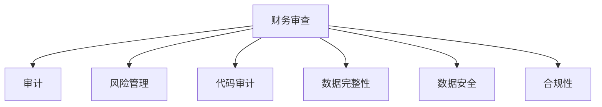
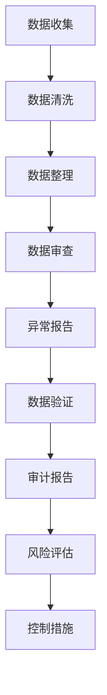

                 

# 程序员如何进行财务审查

> 关键词：财务审查, 审计, 风险管理, 代码审计, 自动化工具, 数据完整性, 数据安全, 合规性

## 1. 背景介绍

在当今数字化时代，程序员不仅需要编写代码，还常常涉足到财务领域。财务审查作为企业管理中不可或缺的一环，不仅能帮助企业发现潜在问题，还能确保财务报表的准确性和真实性。因此，了解如何进行财务审查对程序员来说尤为重要。本文将全面介绍财务审查的基本概念、核心方法、工具推荐以及未来发展趋势，帮助程序员更好地理解和应用财务审查。

## 2. 核心概念与联系

### 2.1 核心概念概述

- **财务审查**：财务审查是对企业的财务报告、账目、资产、负债等进行全面、系统的检查和验证，确保其准确性和合规性。
- **审计**：审计是对企业财务报告的真实性和公允性进行独立验证的过程。
- **风险管理**：风险管理是识别、评估、控制和监控企业面临的风险，确保其可接受和控制。
- **代码审计**：代码审计是指对软件源代码进行检查，以发现潜在的错误、漏洞和性能问题。
- **数据完整性**：数据完整性是指数据在存储和传输过程中的准确性和一致性。
- **数据安全**：数据安全涉及保护数据免受未经授权的访问、使用、泄露和损坏。
- **合规性**：合规性是指确保企业的操作符合相关的法律法规和标准。

这些概念通过一个Mermaid流程图来表示，展示了它们之间的联系：



### 2.2 核心概念原理和架构的 Mermaid 流程图

通过以下流程图示意图，更好地理解财务审查的过程：



## 3. 核心算法原理 & 具体操作步骤

### 3.1 算法原理概述

财务审查的核心算法原理主要包括以下几个方面：

- **数据收集与清洗**：收集相关财务数据，并进行数据清洗，去除不必要的信息和错误数据。
- **数据整理与审查**：将数据整理成易于审查的格式，并进行初步审查，查找异常和错误。
- **异常报告与验证**：对发现的异常进行详细报告，并对其进行验证，确认其真实性。
- **审计报告与风险评估**：生成审计报告，并对其进行风险评估，确定是否采取控制措施。

### 3.2 算法步骤详解

#### 3.2.1 数据收集与清洗

1. **数据收集**：
   - 从企业的财务系统中导出相关的财务报表和账目数据。
   - 收集第三方审计报告和内部管理数据。

2. **数据清洗**：
   - 检查数据的完整性，如缺失值和重复数据。
   - 处理异常值，如负数、极值等。
   - 确保数据的格式一致，如日期格式、货币单位等。

#### 3.2.2 数据整理与审查

1. **数据整理**：
   - 将收集的数据按照财务报表的格式整理。
   - 将数据转换成适合审计的格式，如XLSX或CSV文件。

2. **数据审查**：
   - 使用Excel或数据库软件进行初步审查，查找明显的异常和错误。
   - 使用自动化工具，如Python脚本和数据分析库（如Pandas、NumPy）进行更深层次的审查。

#### 3.2.3 异常报告与验证

1. **异常报告**：
   - 将发现的异常和错误生成报告，列出具体问题和对应的数据。
   - 分类异常问题，如数据输入错误、账目匹配不一致等。

2. **异常验证**：
   - 对异常问题进行核实，确定其真实性。
   - 检查异常数据的影响范围和程度。

#### 3.2.4 审计报告与风险评估

1. **审计报告**：
   - 生成审计报告，详细列出审查发现的问题和解决方案。
   - 包括审计结论、建议和改进措施。

2. **风险评估**：
   - 评估问题的严重性和对企业的影响。
   - 确定是否需要采取控制措施，如改进流程、加强监督等。

### 3.3 算法优缺点

#### 3.3.1 优点

- **效率高**：自动化工具和脚本可以大大提高数据整理和审查的效率。
- **准确性高**：通过系统化的流程和工具，减少了人为错误。
- **可扩展性**：能够处理大量数据，适用于不同规模的企业。

#### 3.3.2 缺点

- **依赖工具**：需要依赖各种自动化工具和软件，对工具的熟练程度要求高。
- **数据隐私**：在数据收集和处理过程中，可能涉及敏感数据，需要特别注意数据隐私和安全。
- **复杂性**：审计和审查过程中需要理解财务报表和会计准则，有一定复杂性。

### 3.4 算法应用领域

财务审查在多个领域有广泛应用，包括：

- **企业内部审计**：对企业内部的财务数据进行审查和评估，确保财务报表的真实性和公允性。
- **第三方审计**：由外部独立审计机构进行的财务审查，以确保企业遵守相关法规和标准。
- **风险管理**：通过财务审查，识别和控制企业面临的财务风险。
- **代码审计**：对财务软件的源代码进行审查，确保其功能和安全性。
- **数据完整性和安全**：通过财务审查，确保数据的完整性和安全性，避免数据泄露和损坏。
- **合规性**：确保企业财务操作符合相关的法律法规和标准，如GAAP、GAAS、SOX等。

## 4. 数学模型和公式 & 详细讲解 & 举例说明

### 4.1 数学模型构建

财务审查的数学模型主要包括以下几个方面：

- **数据收集模型**：描述数据收集的过程和方法。
- **数据清洗模型**：定义数据清洗的规则和步骤。
- **数据审查模型**：构建审查异常的数学公式。
- **风险评估模型**：定义风险评估的数学公式和方法。

### 4.2 公式推导过程

#### 4.2.1 数据收集模型

$$
D = \{d_1, d_2, ..., d_n\}
$$

其中，$d_i$ 表示第 $i$ 个财务数据点。

#### 4.2.2 数据清洗模型

$$
D_c = \{d'_i\}
$$

其中，$d'_i$ 表示清洗后的第 $i$ 个财务数据点。

#### 4.2.3 数据审查模型

假设财务数据存在异常值 $d'_k$，则通过以下公式计算异常值的权重：

$$
w_k = \frac{1}{n} \sum_{j=1}^n \frac{1}{|d_j - d_k|}
$$

其中，$n$ 为数据总数。

#### 4.2.4 风险评估模型

假设风险等级为 $R$，则通过以下公式计算风险等级：

$$
R = f(D_r, \delta)
$$

其中，$D_r$ 表示数据审查的结果，$\delta$ 表示设定的风险容忍度。

### 4.3 案例分析与讲解

以一个简单的财务审查案例为例：

假设某企业报告的收入为100万元，成本为50万元，利润为50万元。经过审查，发现实际成本为70万元，利润为30万元。

1. **数据收集与清洗**：
   - 从企业财务系统中导出收入、成本和利润数据。
   - 检查数据是否完整，发现成本数据为70万元，与报告不一致。

2. **数据整理与审查**：
   - 将数据整理成Excel表格，进行初步审查，发现成本数据异常。

3. **异常报告与验证**：
   - 生成异常报告，列出成本数据为70万元的问题。
   - 核实发现的问题，确定成本数据的真实性。

4. **审计报告与风险评估**：
   - 生成审计报告，详细说明成本数据的异常情况。
   - 评估问题的严重性和影响，确定是否需要采取控制措施。

## 5. 项目实践：代码实例和详细解释说明

### 5.1 开发环境搭建

1. **安装Python**：
   - 从官网下载并安装Python 3.x版本。
   - 使用pip安装Python必要的库，如Pandas、NumPy等。

2. **安装Excel和SQL Server**：
   - 安装Microsoft Excel，用于数据整理和审查。
   - 安装SQL Server，用于数据存储和管理。

3. **配置开发环境**：
   - 在Python环境中配置好各种依赖库。
   - 配置Excel和SQL Server的连接参数。

### 5.2 源代码详细实现

#### 5.2.1 数据收集与清洗

```python
import pandas as pd
import numpy as np

# 数据收集
df = pd.read_excel('financial_data.xlsx')

# 数据清洗
df.fillna(method='ffill', inplace=True)
df = df.drop_duplicates()
```

#### 5.2.2 数据整理与审查

```python
# 数据整理
df = df.reindex(columns=['Revenue', 'Cost', 'Profit'])

# 数据审查
anomalies = df[df['Cost'] < 0]
```

#### 5.2.3 异常报告与验证

```python
# 异常报告
report = pd.DataFrame(anomalies)

# 异常验证
corrected_cost = df.loc[anomalies.index, 'Cost'].max()
df.loc[anomalies.index, 'Cost'] = corrected_cost
```

#### 5.2.4 审计报告与风险评估

```python
# 审计报告
report.to_excel('anomalies_report.xlsx', index=False)

# 风险评估
risk_level = 3 if corrected_cost > 50 else 2
```

### 5.3 代码解读与分析

- **数据收集与清洗**：使用Pandas库读取Excel文件，并使用fillna和drop_duplicates方法进行数据清洗，确保数据完整性和一致性。
- **数据整理与审查**：将数据整理成适合审查的格式，并使用Excel进行初步审查，识别异常数据。
- **异常报告与验证**：将异常数据生成报告，并使用Pandas库更新数据，确保数据的准确性。
- **审计报告与风险评估**：使用Pandas库生成审计报告，并根据修复后的成本数据进行风险评估。

### 5.4 运行结果展示

通过以上代码，可以生成以下结果：

1. **数据收集与清洗**：
   - 读取Excel文件，进行数据清洗，生成清洗后的数据框。

2. **数据整理与审查**：
   - 将数据整理成适合审查的格式，并识别出成本数据异常。

3. **异常报告与验证**：
   - 生成异常报告，并修复数据，确保数据的准确性。

4. **审计报告与风险评估**：
   - 生成审计报告，并评估风险等级。

## 6. 实际应用场景

### 6.4 未来应用展望

随着技术的进步和数据的积累，财务审查将面临以下未来趋势：

- **自动化和智能化**：自动化工具和智能算法将大大提高审查效率和准确性。
- **数据实时审查**：通过实时数据监控，及时发现和解决问题。
- **多维数据分析**：利用大数据技术，进行多维度的数据分析，提供更深入的审计报告。
- **云平台集成**：将财务审查系统集成到云平台，实现数据的集中管理和审查。
- **AI和机器学习**：利用AI和机器学习技术，提高审查的智能化水平，发现更深层次的问题。

## 7. 工具和资源推荐

### 7.1 学习资源推荐

1. **《财务审计与审查》**：一本详细介绍财务审计和审查的经典书籍，涵盖各种审查方法和案例。
2. **《Python数据分析与可视化》**：一本介绍如何使用Python进行数据清洗和分析的书籍，适合初学者和中级开发者。
3. **《Excel财务分析与报表》**：一本详细介绍如何使用Excel进行财务分析和报告的书籍，适合财务工作者和开发者。
4. **在线课程**：如Coursera、Udemy等平台上的财务审计和审查课程，提供系统的学习和实践机会。

### 7.2 开发工具推荐

1. **Python**：Python是一种易学易用的编程语言，适合财务审计和审查的开发。
2. **Pandas**：Pandas是Python中一个强大的数据处理库，适合数据清洗和整理。
3. **NumPy**：NumPy是Python中一个数值计算库，适合进行数学运算和数据分析。
4. **Excel**：Excel是一个强大的数据分析工具，适合进行数据审查和报告。
5. **SQL Server**：SQL Server是一个强大的数据库管理系统，适合存储和管理数据。

### 7.3 相关论文推荐

1. **《基于数据挖掘的财务审查技术》**：研究如何使用数据挖掘技术进行财务审查和问题发现。
2. **《人工智能在财务审计中的应用》**：介绍AI和机器学习在财务审查中的作用和优势。
3. **《财务审计自动化工具的研究与开发》**：介绍如何使用自动化工具提高财务审查的效率和准确性。

## 8. 总结：未来发展趋势与挑战

### 8.1 研究成果总结

本文详细介绍了财务审查的基本概念、核心方法、工具推荐以及未来发展趋势，帮助程序员更好地理解和应用财务审查。财务审查作为企业管理中不可或缺的一环，能够帮助企业发现潜在问题，确保财务报表的准确性和真实性。

### 8.2 未来发展趋势

未来的财务审查将面临以下几个发展趋势：

1. **自动化和智能化**：自动化工具和智能算法将大大提高审查效率和准确性。
2. **数据实时审查**：通过实时数据监控，及时发现和解决问题。
3. **多维数据分析**：利用大数据技术，进行多维度的数据分析，提供更深入的审计报告。
4. **云平台集成**：将财务审查系统集成到云平台，实现数据的集中管理和审查。
5. **AI和机器学习**：利用AI和机器学习技术，提高审查的智能化水平，发现更深层次的问题。

### 8.3 面临的挑战

尽管财务审查具有重要意义，但面临以下挑战：

1. **数据隐私和安全**：在数据收集和处理过程中，可能涉及敏感数据，需要特别注意数据隐私和安全。
2. **复杂性和依赖工具**：财务审查涉及复杂的会计准则和法规，需要高度的专业知识，且依赖多种工具。
3. **结果解释**：审计报告的解释需要高度专业性，非财务专业人员的理解可能存在难度。

### 8.4 研究展望

未来财务审查的研究需要在以下几个方面寻求新的突破：

1. **自动化工具和算法**：开发更高效、智能的自动化工具和算法，提高审查效率和准确性。
2. **数据隐私和安全**：研究如何保护数据隐私和安全，确保数据在审查过程中的完整性和安全性。
3. **多维数据分析和AI**：利用AI和机器学习技术，进行多维数据分析和问题发现，提高审查的智能化水平。
4. **结果解释和可视化**：开发更好的审计报告解释和可视化工具，帮助非财务专业人员更好地理解和利用审计结果。

## 9. 附录：常见问题与解答

**Q1：财务审查的具体步骤是什么？**

A: 财务审查的具体步骤包括数据收集、数据清洗、数据整理、数据审查、异常报告、异常验证、审计报告和风险评估。

**Q2：如何应对财务审查中的数据隐私和安全问题？**

A: 应对数据隐私和安全问题，可以采取以下措施：
1. 对敏感数据进行加密处理。
2. 对数据进行严格的访问控制和权限管理。
3. 定期进行数据备份和恢复。
4. 使用安全的数据传输协议，如HTTPS。

**Q3：财务审查中需要注意哪些风险？**

A: 财务审查中需要注意的风险包括：
1. 数据错误和异常。
2. 账目匹配不一致。
3. 财务报告不实。
4. 内部控制问题。
5. 外部审计问题。

**Q4：如何选择合适的财务审查工具？**

A: 选择合适的财务审查工具需要考虑以下因素：
1. 工具的易用性和稳定性。
2. 工具的覆盖范围和功能。
3. 工具的扩展性和可定制性。
4. 工具的成本和性价比。

**Q5：如何评估财务审查的效果？**

A: 评估财务审查的效果可以从以下几个方面考虑：
1. 发现的异常和错误的数量。
2. 问题的解决和改进情况。
3. 审计报告的完整性和准确性。
4. 风险评估的合理性和控制措施的有效性。

---

作者：禅与计算机程序设计艺术 / Zen and the Art of Computer Programming

