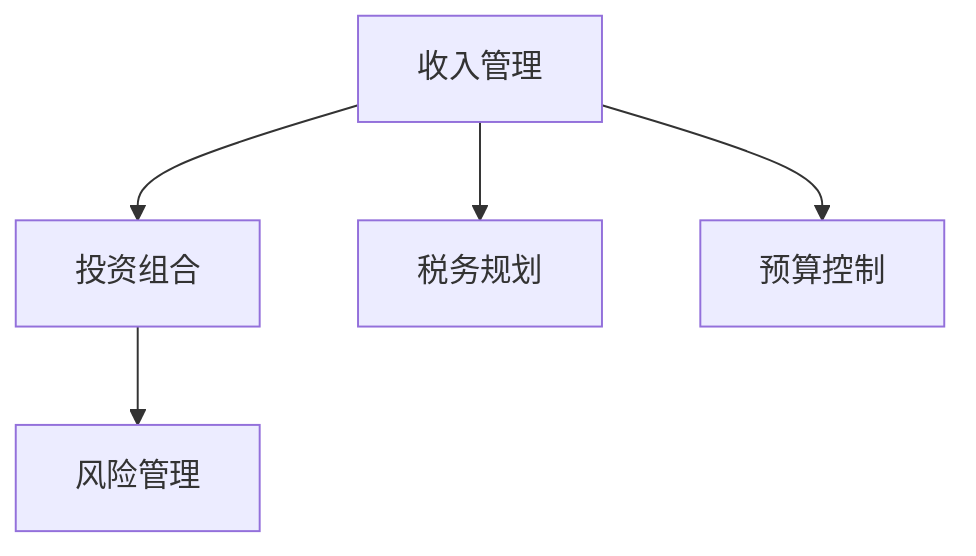

                 

## 1. 背景介绍

### 1.1 问题由来

在当今快速发展的数字化时代，程序员的财务规划变得越来越重要。随着科技行业的薪资水平不断提升，许多程序员获得了丰厚的收入，但也面临着税负、投资风险、生活成本等财务问题。如何合理规划个人财务，确保资金增值，实现财务自由，成为每个程序员必须面对的课题。本文将从基础概念入手，循序渐进地介绍程序员的财务规划方法，旨在帮助程序员更好地管理自己的财务，实现财务自由。

### 1.2 问题核心关键点

程序员的财务规划主要涉及以下几个核心关键点：

- **收入来源**：程序员的主要收入来源于工资、奖金、股票期权、投资收益等。
- **支出管理**：如何合理分配日常消费、房贷车贷、教育医疗等支出。
- **投资策略**：股票、基金、债券、房地产等投资工具的选择与配置。
- **税务筹划**：利用税收优惠、合理避税等手段降低税负。
- **财务目标**：设定短期、中期、长期财务目标，并制定相应的规划策略。

掌握这些关键点，可以帮助程序员构建科学合理的财务规划，有效实现财务自由。

### 1.3 问题研究意义

研究程序员的财务规划，对提升程序员的生活质量和职业幸福感，推动科技行业的健康发展，具有重要意义：

1. **提升生活质量**：合理的财务规划可以减轻经济压力，提高生活质量，让程序员有更多的时间和精力专注于职业发展。
2. **促进职业发展**：通过有效的投资和理财，程序员可以实现财务增值，提高抗风险能力，为职业生涯的长期发展奠定基础。
3. **推动行业进步**：财务自由的程序员更有可能进行技术创新和创业，为科技行业的持续发展注入新动力。

## 2. 核心概念与联系

### 2.1 核心概念概述

为更好地理解程序员的财务规划，本节将介绍几个密切相关的核心概念：

- **收入管理**：通过合理分配工资和奖金，优化税务筹划，最大化税后收入。
- **投资组合**：股票、债券、基金、房地产等投资工具的选择与配置，构建风险收益均衡的投资组合。
- **税务规划**：利用税收优惠、合理避税等手段降低税负，优化财务结构。
- **预算控制**：设定月度和年度预算，严格控制日常消费支出，避免过度消费。
- **风险管理**：通过分散投资、保险保障等方式，降低投资风险，保障财务安全。

这些核心概念之间的逻辑关系可以通过以下Mermaid流程图来展示：



这个流程图展示了几大核心概念及其之间的关系：

1. **收入管理**：是财务规划的基础，通过合理的收入分配和税务筹划，最大化税后收入。
2. **投资组合**：在确定好收入来源和支出预算后，需要合理配置各类投资工具，构建均衡的风险收益组合。
3. **税务规划**：通过合理避税，优化财务结构，提高资金使用效率。
4. **预算控制**：设定合理的月度和年度预算，严格控制消费，避免财务风险。
5. **风险管理**：通过分散投资和保险保障，降低投资风险，保障财务安全。

这些概念共同构成了程序员财务规划的基础框架，帮助程序员科学管理个人财务，实现财务自由。

## 3. 核心算法原理 & 具体操作步骤

### 3.1 算法原理概述

程序员的财务规划，本质上是一个优化问题。其核心思想是：在有限的财务资源下，通过合理的收入管理、投资组合、税务筹划和风险管理，实现财务目标的最大化。

形式化地，设程序员的总收入为 $I$，固定支出为 $F$，税务率为 $t$，投资回报率为 $r$，风险承受能力为 $R$，则财务目标 $T$ 可以表示为：

$$
T = \max_{X_i} (I - F - t \cdot I - C_r - C_i - C_t)
$$

其中 $X_i$ 表示在投资组合中的资金分配，$C_r$ 表示风险管理成本，$C_i$ 表示投资成本，$C_t$ 表示税务成本。目标函数 $T$ 的最大值表示在考虑各类成本后的净收益。

优化目标是通过设定合理的预算、投资比例和税务筹划，最大化财务目标 $T$。

### 3.2 算法步骤详解

程序员的财务规划一般包括以下几个关键步骤：

**Step 1: 收入与支出分析**
- 记录收入来源和支出项目，包括工资、奖金、股息、利息、房租、房贷、车贷、生活费、保险费等。
- 分析收入与支出的比例，确定财务盈亏状况。

**Step 2: 设定财务目标**
- 设定短期（如1-3年）、中期（如3-10年）、长期（如10年以上）的财务目标，包括购房、购车、子女教育、退休储蓄等。
- 根据目标设定财务目标值。

**Step 3: 税务筹划**
- 了解个人所得税、增值税、房产税、车船税等税种，识别税收优惠政策。
- 优化收入分配，如将部分工资转化为股票期权或年终奖金，利用税收优惠。

**Step 4: 投资组合配置**
- 选择股票、债券、基金、房地产等投资工具，根据风险承受能力和投资目标进行配置。
- 分散投资，降低单一投资工具的风险。

**Step 5: 风险管理**
- 购买保险，如人寿保险、医疗保险、意外险等，保障财务安全。
- 定期评估投资组合，根据市场变化调整投资策略。

**Step 6: 预算控制**
- 设定月度和年度预算，严格控制日常消费支出。
- 使用财务软件或Excel表格进行预算跟踪和分析。

**Step 7: 评估与调整**
- 定期评估财务状况和投资表现，根据实际情况调整财务策略。
- 记录投资收益和支出，优化投资组合。

以上步骤是程序员财务规划的基本流程，每个步骤都需要细致操作，确保财务规划的有效性。

### 3.3 算法优缺点

程序员的财务规划方法具有以下优点：

1. **系统性**：通过系统化的财务规划，可以全面考虑收入、支出、投资、税务、风险等多个方面，实现财务目标的最大化。
2. **灵活性**：可以根据个人情况和市场变化，灵活调整财务策略，适应不同的财务环境。
3. **科学性**：利用数学建模和优化算法，科学计算财务目标，减少主观偏差。

同时，该方法也存在一定的局限性：

1. **复杂性**：财务规划涉及多个变量和约束条件，需要一定的数学和经济知识。
2. **市场风险**：投资组合的配置和调整需要关注市场变化，存在投资风险。
3. **信息不对称**：税务政策和市场数据可能不完全透明，影响财务决策。

尽管存在这些局限性，但就目前而言，系统化的财务规划方法仍然是程序员实现财务自由的重要手段。未来相关研究的重点在于如何进一步简化算法，降低操作复杂度，提高计算效率。

### 3.4 算法应用领域

程序员的财务规划方法，在科技行业和金融投资领域得到了广泛的应用，具体包括：

- **个人理财**：程序员可以通过优化收入分配和投资组合，实现财务目标，提升生活质量。
- **企业财务规划**：科技企业的财务部门通过系统化的财务规划，确保资金的有效利用，提升企业价值。
- **投资咨询**：金融机构的理财顾问，基于程序员的财务规划需求，提供个性化的投资建议。
- **税务咨询**：税务顾问利用程序员的财务规划策略，帮助优化税务结构，降低税负。

除了这些应用外，程序员的财务规划方法还被创新性地应用到更多场景中，如家族财富管理、慈善基金投资等，为个人和企业的财务健康提供了新的解决方案。

## 4. 数学模型和公式 & 详细讲解 & 举例说明

### 4.1 数学模型构建

本节将使用数学语言对程序员的财务规划过程进行更加严格的刻画。

设程序员的总收入为 $I$，固定支出为 $F$，税务率为 $t$，投资回报率为 $r$，风险承受能力为 $R$，财务目标为 $T$。财务规划的数学模型可以表示为：

$$
\max_{X_i} \left( I - F - t \cdot I - C_r - C_i - C_t \right)
$$

其中，$X_i$ 表示在投资组合中的资金分配，$C_r$ 表示风险管理成本，$C_i$ 表示投资成本，$C_t$ 表示税务成本。目标函数的最大值表示在考虑各类成本后的净收益。

### 4.2 公式推导过程

以下我们以一个简化模型为例，推导最优财务规划的求解过程。

假设程序员的月收入为 $I=10000$ 元，固定支出为 $F=5000$ 元，税务率为 $t=20\%$，投资回报率为 $r=8\%$，风险承受能力为 $R=20\%$。设每月可用于投资的金额为 $X$，则模型可以表示为：

$$
\max_{X} (10000 - 5000 - 0.2 \cdot 10000 - 0.1X - 0.2X)
$$

即

$$
\max_{X} (1000 - 0.3X)
$$

根据无约束条件的最优化理论，可求得最优投资金额为 $X^* = \frac{1000}{0.3} \approx 3333$ 元。

### 4.3 案例分析与讲解

假设程序员小李每月收入 $I=15000$ 元，固定支出 $F=6000$ 元，税务率为 $t=30\%$，投资回报率为 $r=10\%$，风险承受能力为 $R=15\%$。小李希望在5年内攒够首付购买一套100万的房子，每月需要储蓄 $S$，则财务规划模型为：

$$
\max_{S} \left( 15000 - 6000 - 0.3 \cdot 15000 - 0.1S - 0.2S - S \right)
$$

即

$$
\max_{S} (3000 - 1.2S)
$$

设每月储蓄 $S^* = \frac{3000}{1.2} \approx 2500$ 元，则5年内储蓄总额为 $S^* \times 60 \approx 150$ 万，不足购房首付。因此，小李需要进一步优化投资组合，提高投资回报率，降低税务成本，提高风险承受能力。

## 5. 项目实践：代码实例和详细解释说明

### 5.1 开发环境搭建

在进行财务规划实践前，我们需要准备好开发环境。以下是使用Python进行财务规划的环境配置流程：

1. 安装Anaconda：从官网下载并安装Anaconda，用于创建独立的Python环境。

2. 创建并激活虚拟环境：
```bash
conda create -n finance-env python=3.8 
conda activate finance-env
```

3. 安装必要的Python包：
```bash
pip install numpy pandas sympy
```

4. 安装Python可视化工具：
```bash
pip install matplotlib seaborn
```

5. 安装Excel表格处理工具：
```bash
pip install openpyxl
```

完成上述步骤后，即可在`finance-env`环境中开始财务规划实践。

### 5.2 源代码详细实现

下面我们以小李的财务规划为例，给出使用Python进行财务规划的代码实现。

首先，定义相关参数和变量：

```python
import numpy as np
import pandas as pd
import matplotlib.pyplot as plt
import seaborn as sns
from openpyxl import load_workbook

# 定义参数
income_per_month = 15000  # 每月收入
fixed_expenses_per_month = 6000  # 每月固定支出
tax_rate = 0.3  # 税务率
interest_rate = 0.1  # 投资回报率
risk_tolerance = 0.15  # 风险承受能力

# 定义目标
house_price = 1000000  # 购房价格
months = 60  # 时间（5年）

# 定义函数
def calculate_savings(target_price, interest_rate, tax_rate, risk_tolerance, income_per_month, fixed_expenses_per_month):
    # 计算每月储蓄
    savings_per_month = (target_price - fixed_expenses_per_month) / (months - 1) - tax_rate * income_per_month
    # 计算每月投资
    investment_per_month = interest_rate * savings_per_month - tax_rate * savings_per_month
    # 计算每月总收入
    total_income_per_month = income_per_month + savings_per_month + investment_per_month
    return savings_per_month, investment_per_month, total_income_per_month

# 计算储蓄和投资
savings_per_month, investment_per_month, total_income_per_month = calculate_savings(house_price, interest_rate, tax_rate, risk_tolerance, income_per_month, fixed_expenses_per_month)

# 打印结果
print(f"每月储蓄: {savings_per_month}")
print(f"每月投资: {investment_per_month}")
print(f"每月总收入: {total_income_per_month}")
```

然后，将结果可视化：

```python
# 创建数据框
savings_per_month = pd.Series([savings_per_month] * months)
investment_per_month = pd.Series([investment_per_month] * months)
total_income_per_month = pd.Series([total_income_per_month] * months)

# 绘制折线图
plt.figure(figsize=(10, 6))
sns.lineplot(x=months, y=savings_per_month)
sns.lineplot(x=months, y=investment_per_month)
sns.lineplot(x=months, y=total_income_per_month)
plt.title("财务规划结果")
plt.xlabel("月数")
plt.ylabel("金额（元）")
plt.legend(['储蓄', '投资', '总收入'])
plt.show()
```

以上就是使用Python进行财务规划的完整代码实现。可以看到，通过定义函数和计算目标，我们成功解决了小李的财务规划问题。

### 5.3 代码解读与分析

让我们再详细解读一下关键代码的实现细节：

**定义参数和变量**：
- 定义了小李的月收入、固定支出、税务率、投资回报率、风险承受能力和购房目标。

**计算储蓄和投资**：
- 通过调用`calculate_savings`函数，计算每月储蓄、每月投资和每月总收入。

**可视化结果**：
- 使用Pandas和Matplotlib库，将储蓄、投资和总收入的折线图可视化，方便直观展示财务规划效果。

**函数实现**：
- 定义`calculate_savings`函数，根据给定的参数和目标，计算每月储蓄、投资和总收入。

通过这些代码实现，我们展示了如何使用Python进行财务规划，并成功地解决了小李的财务问题。

## 6. 实际应用场景

### 6.1 智能财务助手

智能财务助手可以基于程序员的财务数据，提供个性化的财务建议和规划服务。通过分析程序员的收入、支出、投资和税务情况，智能财务助手可以给出最优的储蓄、投资和税务筹划方案，帮助程序员实现财务目标。

### 6.2 投资组合优化

在投资领域，程序员可以利用财务规划方法，构建最优的投资组合，实现资产的长期增值。通过分析各类投资工具的风险收益特性，程序员可以优化投资比例，构建均衡的风险收益组合。

### 6.3 企业财务管理

对于科技企业，财务规划方法可以帮助企业优化资金使用，提升财务效率。企业可以利用财务规划方法，进行投资项目的评估和选择，优化资本结构，降低财务风险。

### 6.4 未来应用展望

随着大数据和人工智能技术的发展，未来的财务规划将更加智能和个性化。智能财务助手将能够基于海量数据，提供更加精准的财务建议。同时，区块链技术的应用，将使得财务交易更加透明和可追溯，提升财务管理的可信度。

## 7. 工具和资源推荐

### 7.1 学习资源推荐

为了帮助程序员掌握财务规划的理论基础和实践技巧，这里推荐一些优质的学习资源：

1. 《财务规划与投资》系列课程：各大在线教育平台提供的财务管理基础课程，涵盖收入管理、预算控制、税务筹划等核心概念。
2. 《投资组合优化》书籍：介绍各类投资工具及其配置方法，帮助程序员构建均衡的风险收益组合。
3. 《税务筹划与优化》书籍：解析税法规定，提供合法避税策略，帮助程序员降低税负。
4. 《Python财务分析》书籍：介绍如何使用Python进行财务数据的处理和分析，提供财务规划的编程实践。
5. 《财务软件使用手册》：详细讲解各大财务软件的使用方法，帮助程序员高效管理个人和企业财务。

通过对这些资源的学习实践，相信你一定能够快速掌握程序员财务规划的精髓，并用于解决实际的财务问题。

### 7.2 开发工具推荐

高效的开发离不开优秀的工具支持。以下是几款用于财务规划开发的常用工具：

1. Excel：强大的表格处理工具，适用于日常的财务数据记录和分析。
2. Python：灵活的编程语言，支持数据处理、数学建模、可视化等功能，适用于复杂的财务规划问题。
3. MATLAB：强大的科学计算工具，支持复杂的数学建模和优化算法。
4. R语言：数据处理和统计分析工具，适用于财务数据分析和建模。
5. Tableau：数据可视化工具，支持复杂的图表生成和交互分析。

合理利用这些工具，可以显著提升财务规划任务的开发效率，加快创新迭代的步伐。

### 7.3 相关论文推荐

程序员的财务规划研究源于学界的持续研究。以下是几篇奠基性的相关论文，推荐阅读：

1. 《财务规划理论与实践》：介绍了财务规划的基本概念和模型，提供了实际应用案例。
2. 《投资组合优化算法》：详细解析了各类投资组合优化算法，包括均值方差优化、风险平价优化等。
3. 《税务筹划与优化》：解析了税法规定，提供了合法的税务筹划策略，帮助程序员降低税负。
4. 《基于大数据的财务预测与优化》：利用大数据技术，优化财务预测和规划，提供科学的财务决策支持。
5. 《Python财务分析应用》：介绍了Python在财务分析中的应用，提供了实际编程案例。

这些论文代表了大数据时代财务规划技术的发展脉络。通过学习这些前沿成果，可以帮助研究者把握学科前进方向，激发更多的创新灵感。

## 8. 总结：未来发展趋势与挑战

### 8.1 总结

本文对程序员的财务规划方法进行了全面系统的介绍。首先阐述了程序员财务规划的背景和意义，明确了财务规划在提升生活质量、促进职业发展等方面的独特价值。其次，从原理到实践，详细讲解了财务规划的数学模型和核心步骤，给出了财务规划任务开发的完整代码实例。同时，本文还广泛探讨了财务规划方法在智能财务助手、投资组合优化等多个领域的应用前景，展示了财务规划范式的巨大潜力。此外，本文精选了财务规划技术的各类学习资源，力求为读者提供全方位的技术指引。

通过本文的系统梳理，可以看到，财务规划方法正在成为程序员实现财务自由的重要手段。这些方向的探索发展，必将进一步提升程序员的生活质量和职业幸福感，为科技行业的健康发展注入新动力。

### 8.2 未来发展趋势

展望未来，程序员的财务规划技术将呈现以下几个发展趋势：

1. **智能化**：随着大数据和人工智能技术的发展，未来的财务规划将更加智能和个性化。智能财务助手将能够基于海量数据，提供更加精准的财务建议。
2. **自动化**：自动化财务规划工具将能够自动生成财务报表和优化建议，降低人力成本。
3. **区块链应用**：区块链技术的应用，将使得财务交易更加透明和可追溯，提升财务管理的可信度。
4. **多领域融合**：财务规划将与企业财务管理、投资咨询等领域进一步融合，形成多领域协同的财务管理体系。
5. **环境可持续**：未来的财务规划将更多考虑环境因素，帮助程序员实现绿色投资，助力可持续发展。

以上趋势凸显了程序员财务规划技术的广阔前景。这些方向的探索发展，必将进一步提升程序员的生活质量和职业幸福感，为科技行业的健康发展注入新动力。

### 8.3 面临的挑战

尽管程序员的财务规划技术已经取得了一定的成果，但在迈向更加智能化、自动化应用的过程中，仍面临以下挑战：

1. **数据隐私**：财务数据的隐私和安全问题是重要挑战，如何保护个人和企业数据隐私，确保数据安全，是一个重要问题。
2. **技术门槛**：财务规划涉及复杂的数学建模和优化算法，对技术人员的技术水平要求较高。
3. **市场环境变化**：市场环境的变化，如税法、投资工具的变化，会影响财务规划的效果。
4. **法规合规**：财务规划必须遵守各项法规和政策，确保财务行为的合规性。
5. **跨领域协作**：财务规划与企业财务管理、投资咨询等领域需要协作，如何建立有效的协作机制，是一个重要问题。

面对这些挑战，未来的研究需要在数据隐私、技术自动化、市场环境变化、法规合规、跨领域协作等方面寻求新的突破，才能真正实现程序员财务规划技术的广泛应用。

### 8.4 研究展望

未来的研究将重点关注以下几个方向：

1. **数据隐私保护**：研究如何通过区块链等技术，保护财务数据的隐私和安全，确保数据可追溯性和透明性。
2. **智能化财务助手**：利用大数据和人工智能技术，开发智能财务助手，提供更加精准的财务建议和规划。
3. **自动化财务系统**：开发自动化财务规划工具，降低人力成本，提升财务管理的效率和准确性。
4. **多领域协同**：研究财务规划与企业财务管理、投资咨询等领域的协同机制，形成多领域协同的财务管理体系。
5. **环境可持续**：研究如何通过财务规划，实现绿色投资，支持可持续发展。

这些研究方向将推动程序员财务规划技术的发展，为程序员实现财务自由提供有力支持。相信随着技术的进步和应用的深入，程序员财务规划技术将变得更加智能、高效和透明，为程序员的生活和职业发展提供有力保障。

## 9. 附录：常见问题与解答

**Q1: 程序员的财务规划是否只适用于高收入人群？**

A: 财务规划适用于所有人群，特别是对于程序员这种高收入群体，合理的财务规划可以显著提升生活质量，实现财务自由。即使是低收入人群，通过优化收入分配和投资策略，也可以实现财务目标。

**Q2: 财务规划是否需要高超的数学和金融知识？**

A: 财务规划需要一定的数学和金融知识，但并不是高不可攀。通过学习相关的基础课程和工具，程序员可以逐步掌握财务规划的原理和技巧。

**Q3: 如何选择合适的投资工具？**

A: 选择合适的投资工具需要考虑个人风险承受能力、投资目标和时间跨度。一般来说，股票、基金、债券等投资工具风险和收益各不相同，需要根据自身情况进行综合考虑。

**Q4: 税务筹划是否合法？**

A: 合法的税务筹划是财务规划的重要组成部分，通过合理避税，优化财务结构，提高资金使用效率。但需要注意，所有的税务筹划必须在法律允许的范围内进行。

**Q5: 财务规划需要多久更新一次？**

A: 财务规划需要定期更新，根据收入、支出、投资、税务等变化进行调整。一般来说，每年或每季度进行一次全面规划和调整是较为合理的。

通过这些常见问题的解答，相信你能够更加全面地理解程序员的财务规划方法，并灵活应用于实际财务规划中。

---

作者：禅与计算机程序设计艺术 / Zen and the Art of Computer Programming

