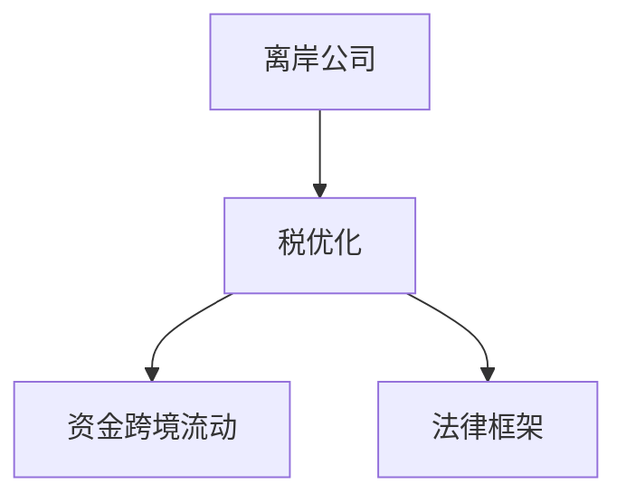

                 

## 1. 背景介绍

### 1.1 问题由来
在当今全球化背景下，越来越多的程序员需要跨越不同的国家和地区，将技术输出到国际市场，开展跨境技术合作或创业。跨境资产配置是实现这一目标的关键步骤，帮助程序员合理管理跨国的资产和税务，最大化收益，规避风险。然而，跨境资产配置涉及复杂的法律、财务、税务问题，需要深入理解相关知识。本文将系统介绍程序员进行跨境资产配置的策略，包括离岸公司、税优化、资金跨境流动等核心概念和具体操作步骤。

### 1.2 问题核心关键点
跨境资产配置的核心在于通过合理布局，最大化跨境收益，同时规避税务和法律风险。关键点包括：

- **离岸公司**：利用国际税收优惠，降低所得税。
- **税优化策略**：应用退税、避税等手段，合理降低税务成本。
- **资金跨境流动**：确保资金合法、合规的跨境流动，规避外汇管制和汇率风险。
- **法律框架**：理解不同国家的法律法规，避免违法行为。

### 1.3 问题研究意义
对程序员而言，掌握跨境资产配置策略，可以有效降低税务和法律风险，提高全球资产的收益。同时，这些知识能够帮助程序员更好地在全球化市场中竞争，拓展职业发展空间。

## 2. 核心概念与联系

### 2.1 核心概念概述

跨境资产配置涉及多个相关概念：

- **离岸公司**：在非居住国注册的公司，享有国际税收优惠，适合跨境企业。
- **税优化**：通过合法手段降低税务成本，如退税、转让定价等。
- **资金跨境流动**：合法合规地进行跨境资金汇兑，规避外汇管制和汇率风险。
- **法律框架**：了解不同国家的法律法规，避免法律风险。

这些概念之间的联系可以用以下Mermaid流程图来展示：



该流程图表明，离岸公司是跨境资产配置的基础，税优化和资金跨境流动是关键手段，法律框架是必备的前提条件。

## 3. 核心算法原理 & 具体操作步骤
### 3.1 算法原理概述

跨境资产配置的原理是通过合理布局，最大化跨境收益，同时规避税务和法律风险。核心步骤包括：

1. **评估税务环境**：了解目标国家和地区的税率和税务优惠政策。
2. **选择离岸公司**：根据项目需求和税务环境，选择合适的离岸公司注册地。
3. **税优化策略**：应用合法手段降低税务成本。
4. **资金跨境流动**：确保资金合法、合规的跨境流动。
5. **合规性检查**：确保配置方案符合不同国家的法律法规。

### 3.2 算法步骤详解

以下是跨境资产配置的具体操作步骤：

**Step 1: 评估税务环境**
- 收集目标国家和地区的税率和税法信息，如企业所得税率、个人所得税率、增值税率、资本利得税等。
- 了解各国对海外收入的税收政策，包括预提税、双边税收协议等。
- 分析各国税收优惠政策，如税收饶让、双边税收协定、出口退税等。

**Step 2: 选择离岸公司**
- 根据项目需求，选择合适的离岸公司注册地，如开曼群岛、百慕大、巴拿马等。
- 考虑注册地的国际税收协定、金融自由度、法律稳定性等因素。
- 进行公司注册，获取离岸公司证书和商业许可证。

**Step 3: 税优化策略**
- 应用合法手段降低税务成本，如合理定价、利用税收饶让、申请出口退税等。
- 利用双边税收协定，避免双重征税。
- 采用转让定价策略，将跨境收入在低税率国家或地区进行合法转移。

**Step 4: 资金跨境流动**
- 了解不同国家的资金流动政策和外汇管制要求。
- 通过银行或金融机构进行合法、合规的跨境资金汇兑。
- 考虑汇率的波动，选择最佳时机进行资金流动。

**Step 5: 合规性检查**
- 确保跨境资产配置方案符合各国法律法规，避免违法行为。
- 定期审计离岸公司的财务和税务记录。
- 准备相关法律文件，应对可能的税务审查和法律诉讼。

### 3.3 算法优缺点

跨境资产配置的优点包括：

- **降低税务成本**：利用国际税收优惠，减少所得税和其他税种。
- **提高收益**：通过合理布局，最大化跨境收益。
- **规避法律风险**：了解不同国家的法律法规，避免违法行为。

缺点包括：

- **复杂度高**：涉及复杂的税务、法律和金融知识。
- **成本高**：注册离岸公司、进行合规审计等费用较高。
- **信息不对称**：不同国家的税务和法律环境差异较大，获取准确信息难度大。

### 3.4 算法应用领域

跨境资产配置在跨境创业、国际投资、跨境技术合作等领域有着广泛应用。

**跨境创业**：通过离岸公司注册，降低税务成本，吸引国际投资者，加速创业进程。
**国际投资**：通过离岸公司进行海外资产配置，规避外汇管制和汇率风险。
**跨境技术合作**：通过离岸公司进行资金流动和税务优化，支持跨境技术合作。

## 4. 数学模型和公式 & 详细讲解  
### 4.1 数学模型构建

为了更好地理解跨境资产配置的数学模型，我们以一个简化案例为例。假设程序员小李在美国，需要在新加坡设立离岸公司，将收益转移到美国。

**Step 1: 设定变量**
- 设美国所得税率为 $T_1$，新加坡所得税率为 $T_2$。
- 设在新加坡设立的离岸公司收益为 $P$。

**Step 2: 税后收益计算**
- 在美国的税后收益为 $P \times (1-T_1)$。
- 在新加坡的税后收益为 $P \times (1-T_2)$。

**Step 3: 总收益计算**
- 总收益为 $P \times (1-T_2) \times (1-T_1)$。

### 4.2 公式推导过程

根据上述设定，总收益计算公式为：

$$
Total\ Benefit = P \times (1-T_1) \times (1-T_2)
$$

通过公式推导，我们可以清楚地看到，通过合理配置离岸公司，可以显著降低税务成本，提高总收益。

### 4.3 案例分析与讲解

假设小李在美国的所得税率为 $30\%$，新加坡的所得税率为 $0\%$。设在新加坡设立的离岸公司收益为 $100,000$ 美元。

根据公式，总收益计算如下：

$$
Total\ Benefit = 100,000 \times (1-0.3) \times (1-0) = 70,000
$$

即通过在新加坡设立离岸公司，小李可以显著提高总收益，达到 $70,000$ 美元。

## 5. 项目实践：代码实例和详细解释说明
### 5.1 开发环境搭建

在进行跨境资产配置的实践前，需要准备好开发环境。以下是使用Python进行开发的建议环境配置：

1. **Python版本**：建议使用Python 3.8及以上版本，确保代码兼容性。
2. **开发工具**：建议使用PyCharm或Jupyter Notebook等IDE，便于编写和调试代码。
3. **数据源**：收集目标国家和地区的税率和税法信息，如官方网站、财务报告等。

### 5.2 源代码详细实现

下面以一个简化的税优化案例为例，展示如何使用Python进行跨境资产配置。

```python
import sympy as sp

# 设定变量
T1 = sp.Rational(30, 100)  # 美国所得税率
T2 = sp.Rational(0, 100)  # 新加坡所得税率
P = 100000  # 离岸公司收益

# 税后收益计算
benefit_A = P * (1 - T1)
benefit_S = P * (1 - T2)

# 总收益计算
total_benefit = P * (1 - T2) * (1 - T1)

# 输出结果
print(f"美国税后收益：{benefit_A}")
print(f"新加坡税后收益：{benefit_S}")
print(f"总收益：{total_benefit}")
```

### 5.3 代码解读与分析

这段代码首先定义了美国和新加坡的所得税率，然后计算了在美国和新加坡的税后收益，最后计算了总收益。输出结果显示，通过在新加坡设立离岸公司，显著提高了总收益。

## 6. 实际应用场景

### 6.1 跨境创业

**案例**：小李在加州创立了一家人工智能公司，希望拓展国际市场。

**操作步骤**：
1. 在新加坡设立离岸公司。
2. 通过离岸公司进行资金流动和税务优化。
3. 在新加坡招聘人才，开展跨境技术合作。

**预期效果**：
- 降低税务成本，提高资金利用效率。
- 在新加坡建立人才和技术优势，加速全球扩张。

### 6.2 国际投资

**案例**：小李在美国进行证券投资，希望优化税务。

**操作步骤**：
1. 在美国设立离岸公司。
2. 将投资收益通过离岸公司进行税务优化。
3. 利用双边税收协定，降低税务成本。

**预期效果**：
- 降低税务成本，提高投资收益。
- 利用国际税收优惠，增强投资吸引力。

### 6.3 跨境技术合作

**案例**：小李在印度合作开发AI项目，希望规避外汇管制和汇率风险。

**操作步骤**：
1. 在新加坡设立离岸公司。
2. 通过离岸公司进行资金流动和税务优化。
3. 利用双边税收协定，降低税务成本。

**预期效果**：
- 规避外汇管制和汇率风险，提高资金流动效率。
- 利用国际税收优惠，支持跨境技术合作。

## 7. 工具和资源推荐
### 7.1 学习资源推荐

为了帮助程序员掌握跨境资产配置的策略，以下是推荐的资源：

1. **《跨境资产配置策略》书籍**：详细介绍了跨境资产配置的理论和实践，包括离岸公司、税优化、资金跨境流动等。
2. **国际税务网络**：提供全球税务法规和政策的信息，帮助程序员了解各国税务环境。
3. **金融时报税务专栏**：提供专业的税务和金融咨询，帮助程序员规避税务风险。
4. **Coursera课程**：提供关于国际税收、法律和金融的在线课程，帮助程序员系统学习相关知识。

### 7.2 开发工具推荐

以下是跨境资产配置开发常用的工具：

1. **Python**：Python具有强大的数据处理和计算能力，适合进行复杂的税务和财务计算。
2. **Sympy**：SymPy是一个符号计算库，用于进行数学公式推导和计算。
3. **Excel**：Excel可以进行数据可视化，帮助程序员快速分析跨境资产配置的效果。
4. **Tableau**：Tableau提供数据可视化功能，便于程序员进行税务和财务数据的分析。

### 7.3 相关论文推荐

以下是一些关于跨境资产配置的经典论文：

1. **《跨境投资与税收优化》**：讨论了跨境投资中的税收优化策略，如双边税收协定、转让定价等。
2. **《国际税收策略》**：介绍了不同国家之间的税收策略和法规，帮助程序员进行跨境税务规划。
3. **《离岸公司与跨境投资》**：分析了离岸公司对跨境投资的影响，探讨了离岸公司的税务和法律优势。

## 8. 总结：未来发展趋势与挑战

### 8.1 总结

本文对跨境资产配置进行了全面介绍，包括离岸公司、税优化、资金跨境流动等核心概念和操作步骤。通过案例分析和公式推导，展示了跨境资产配置的数学模型和实际应用效果。本文还推荐了相关的学习资源、开发工具和论文，帮助程序员全面掌握跨境资产配置的策略。

### 8.2 未来发展趋势

跨境资产配置的未来趋势包括：

1. **数字化和智能化**：利用区块链、大数据等技术，提高跨境资产配置的效率和准确性。
2. **全球化与本地化结合**：结合不同国家和地区的法律法规，实现全球化和本地化的平衡。
3. **绿色税收和可持续投资**：考虑环境和社会责任，推动绿色税收和可持续投资。

### 8.3 面临的挑战

跨境资产配置面临的主要挑战包括：

1. **信息不对称**：不同国家和地区的税务和法律环境差异较大，获取准确信息难度大。
2. **政策变化**：各国税务和法律政策变化较快，需要持续跟踪和调整配置方案。
3. **跨境税务合规**：跨境资产配置涉及复杂的税务和法律问题，需要严格合规。

### 8.4 研究展望

未来，跨境资产配置的研究方向包括：

1. **多国税收优化**：探索多国税收优化策略，提升跨境资产配置的税务收益。
2. **数据驱动决策**：利用大数据和人工智能技术，优化跨境资产配置方案。
3. **自动化和智能化**：开发自动化工具，提升跨境资产配置的效率和准确性。

## 9. 附录：常见问题与解答

**Q1: 如何选择合适的离岸公司注册地？**

A: 选择合适的离岸公司注册地需要考虑多个因素，如税负、金融自由度、法律稳定性等。可以咨询专业的财务顾问或税务专家，进行综合评估。

**Q2: 离岸公司需要维持哪些财务和税务记录？**

A: 离岸公司需要维持完整的财务和税务记录，包括账目、报表、税务申报等。定期进行审计和合规检查，确保财务和税务的透明度和合法性。

**Q3: 如何应对各国税务审查和法律诉讼？**

A: 定期进行税务审查和法律合规检查，准备相关法律文件。同时，与专业的财务顾问和法律顾问合作，应对可能的税务审查和法律诉讼。

**Q4: 跨境资产配置是否适合所有程序员？**

A: 跨境资产配置适合有一定国际业务和财务规划需求的程序员。需要对跨境税务和法律有一定的了解，并愿意投入一定时间和成本。

**Q5: 如何降低跨境资产配置的风险？**

A: 合理选择注册地，严格遵守各国法律法规，定期进行财务和税务审查，利用专业顾问和工具进行风险管理。

---

作者：禅与计算机程序设计艺术 / Zen and the Art of Computer Programming

