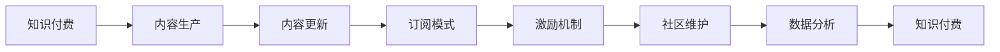

                 

# 程序员知识付费的内容生产与更新策略

> 关键词：知识付费,内容生产,内容更新,程序员,知识共享,订阅模式,激励机制,社区维护,数据分析

## 1. 背景介绍

随着互联网技术的不断发展和数字经济的兴起，知识付费已成为信息时代重要的商业模式之一。尤其是在编程和软件开发领域，程序员的知识付费需求尤为旺盛，希望通过付费获取高质量的知识资源，提高编程技能和职业竞争力。然而，如何高效、可持续地生产与更新这些高质量内容，成为了知识付费平台和内容创作者面临的挑战。本文将探讨程序员知识付费的内容生产与更新策略，分析关键环节与影响因素，为相关平台和创作者提供可行的实践路径。

### 1.1 问题由来
知识付费的兴起，是互联网内容消费行为升级的产物。编程作为技术密集型行业，其内容付费模式也逐渐成熟。程序员知识付费的需求主要来自于以下几个方面：

- **技术升级**：快速发展的技术栈要求程序员不断学习新技能，以适应市场需求。
- **问题解决**：程序员在日常工作中常遇到疑难杂症，希望通过付费获取即时的解决方案。
- **经验积累**：有经验的程序员愿意分享知识，获得专业认可与经济回报。

然而，现有的知识付费平台在程序员的内容生产和更新方面存在一些问题：

- **内容同质化严重**：高质量原创内容稀缺，大量低价值重复内容充斥市场。
- **内容更新滞后**：新知识迅速迭代，老内容难以跟上技术发展步伐。
- **用户粘性不足**：平台缺乏有效的用户互动和激励机制，用户流失率高。

本文旨在通过深入分析程序员知识付费的核心需求和内容生产的关键环节，提出相应的内容生产与更新策略，为内容创作者和平台提供参考。

## 2. 核心概念与联系

### 2.1 核心概念概述

- **知识付费**：用户为获取专业知识或技能支付费用的模式。
- **内容生产**：包括内容创作、编辑、审校等环节，以确保内容的准确性和专业性。
- **内容更新**：定期或实时更新内容，确保内容的有效性和时效性。
- **订阅模式**：用户定期支付费用，以获得内容更新的服务。
- **激励机制**：通过奖励和激励措施，鼓励内容创作者生产优质内容。
- **社区维护**：构建活跃的社区环境，增强用户粘性和参与感。
- **数据分析**：利用大数据和算法技术，分析用户需求和内容效果，指导内容生产与更新。

这些概念通过以下Mermaid流程图展示它们之间的联系：



## 3. 核心算法原理 & 具体操作步骤

### 3.1 算法原理概述

知识付费平台的内容生产与更新，本质上是一个内容质量控制与迭代优化的过程。其核心算法原理如下：

- **内容筛选算法**：基于内容质量指标（如阅读量、点赞数、评论数等）筛选优质内容，减少低价值内容的发布。
- **用户行为分析算法**：通过分析用户浏览、点击、订阅等行为数据，发现用户偏好和需求变化，指导内容更新方向。
- **推荐算法**：利用协同过滤、内容匹配等技术，向用户推荐相关内容，提升用户体验。
- **内容更新策略**：根据内容更新频率和周期，设计自动更新机制，确保内容的时效性和相关性。

### 3.2 算法步骤详解

**Step 1: 需求分析与内容定位**
- 调研目标用户群体的需求和痛点，明确内容定位和主题方向。
- 分析用户反馈和数据，找出热点话题和热门问题。

**Step 2: 内容筛选与审核**
- 设置内容质量指标体系，包括原创性、准确性、实用性等。
- 引入第三方审核机制，如专家评审、同行评审等，提高内容质量。
- 建立内容反抄袭和版权检测系统，保护原创权益。

**Step 3: 内容更新与发布**
- 设计定期更新机制，如每周一更、每月一更新等。
- 引入自动更新技术，如使用API接口实时获取最新数据。
- 设置内容审核流程，确保新内容符合平台标准。

**Step 4: 用户互动与反馈收集**
- 设计用户评价和反馈系统，收集用户对内容的即时反馈。
- 建立社区互动机制，如评论区、问答区等，增强用户粘性。

**Step 5: 数据分析与优化**
- 使用数据分析工具，如Google Analytics、Mixpanel等，收集用户行为数据。
- 分析用户流失率和留存率，优化用户体验和内容质量。
- 根据数据结果，调整内容策略和更新频率。

### 3.3 算法优缺点

知识付费平台的内容生产与更新策略具有以下优点：

- **提高内容质量**：通过严格的内容筛选和审核机制，确保内容的专业性和可信度。
- **满足用户需求**：基于用户行为数据分析，及时更新内容，满足用户学习需求。
- **增强用户粘性**：通过社区互动和反馈机制，提升用户满意度和忠诚度。
- **优化资源利用**：利用数据分析技术，合理配置资源，提高内容生产效率。

同时，该策略也存在以下缺点：

- **内容生产成本高**：高质量内容需要高水平创作者，成本较高。
- **用户参与度不足**：部分用户缺乏参与和贡献的积极性，内容更新动力不足。
- **更新周期长**：内容更新需要时间，难以快速响应技术变化。
- **数据隐私问题**：用户行为数据隐私保护需要严格措施。

### 3.4 算法应用领域

知识付费平台的内容生产与更新策略，广泛应用于各类技术知识平台和社区，例如：

- **Stack Overflow**：程序员问答社区，通过Q&A模式和社区投票筛选优质内容。
- **CSDN博客**：技术博客平台，通过用户订阅和内容推荐满足用户需求。
- **GitHub**：代码托管平台，通过开源项目和贡献者互动，更新技术文档。
- **Kaggle**：数据科学竞赛平台，通过数据集共享和模型竞赛，推动知识传播。

这些平台在内容生产与更新方面，均有较为成熟的做法，值得深入学习和借鉴。

## 4. 数学模型和公式 & 详细讲解

### 4.1 数学模型构建

知识付费平台的内容生产与更新，涉及大量数据处理和算法模型，以下是一个简单的数学模型构建：

假设平台内容总数为 $N$，用户总数为 $M$，每月内容更新数量为 $X$。用户对内容的平均阅读时间为 $T$。设用户对内容的满意度为 $S$，满意度与阅读时间和内容质量成正比。平台每月收入为 $R$，内容更新费用为 $C$，用户订阅费为 $P$。目标是最小化成本，最大化用户满意度。

建立如下模型：

$$
\min_{X,P} C + \lambda (R - P \times M \times S)
$$

其中 $\lambda$ 为平衡因子，控制收入和成本的权重。

### 4.2 公式推导过程

推导内容更新策略时，需要考虑以下因素：

- **内容质量**：用户满意度 $S = \alpha T + \beta Q$，其中 $\alpha$ 为阅读时间权重，$\beta$ 为内容质量权重。
- **内容更新频率**：每月更新次数 $X = \gamma \times N / T$，其中 $\gamma$ 为内容更新速度参数。
- **用户订阅费**：用户每月订阅费 $P = \delta / M$，其中 $\delta$ 为单用户订阅费。

根据上述模型，可以推导出每月内容更新的最优策略：

$$
X^* = \gamma \times N / T
$$
$$
P^* = \delta / M
$$

**案例分析与讲解**

假设平台每月内容总数量为 500 条，用户总数为 10,000 人，用户平均阅读时间为 5 分钟，内容质量权重 $\beta = 0.8$。平台每月收入为 50,000 元，内容更新费用为 10,000 元，单用户订阅费为 10 元。

根据公式计算，每月内容更新次数为 20 次，用户订阅费为 0.5 元。通过对比分析，可以得出内容更新策略的有效性。

## 5. 项目实践：代码实例和详细解释说明

### 5.1 开发环境搭建

知识付费平台的内容生产与更新涉及多种技术栈，以下是一个简化的开发环境搭建流程：

1. **服务器环境**：使用云服务如AWS、Google Cloud等搭建服务器，选择高可用性配置。
2. **数据库**：使用关系型数据库如MySQL、PostgreSQL，或非关系型数据库如MongoDB。
3. **编程语言**：选择Python、Java、Go等主流编程语言，开发后端逻辑。
4. **前端框架**：使用React、Vue、Angular等框架，开发用户界面。
5. **开发工具**：使用Visual Studio Code、PyCharm等IDE，提升开发效率。

### 5.2 源代码详细实现

以下是一个基于Python的简单知识付费平台内容管理系统的实现：

```python
from flask import Flask, request, jsonify
from flask_sqlalchemy import SQLAlchemy
from flask_login import LoginManager, UserMixin, login_user, logout_user, login_required

app = Flask(__name__)
app.config['SECRET_KEY'] = 'secret'
app.config['SQLALCHEMY_DATABASE_URI'] = 'sqlite:///database.db'
db = SQLAlchemy(app)
login_manager = LoginManager()
login_manager.init_app(app)

class User(UserMixin, db.Model):
    id = db.Column(db.Integer, primary_key=True)
    username = db.Column(db.String(50), unique=True)
    password = db.Column(db.String(50))

@login_manager.user_loader
def load_user(user_id):
    return User.query.get(int(user_id))

@app.route('/')
@login_required
def index():
    return 'Welcome, user!'

@app.route('/login', methods=['POST'])
def login():
    username = request.json.get('username')
    password = request.json.get('password')
    user = User.query.filter_by(username=username).first()
    if user and user.password == password:
        login_user(user)
        return jsonify({'status': 'success'})
    else:
        return jsonify({'status': 'error'})

@app.route('/logout')
@login_required
def logout():
    logout_user()
    return jsonify({'status': 'success'})

@app.route('/content', methods=['POST'])
@login_required
def create_content():
    title = request.json.get('title')
    content = request.json.get('content')
    user = current_user
    post = Post(title=title, content=content, user=user)
    db.session.add(post)
    db.session.commit()
    return jsonify({'status': 'success'})

@app.route('/content/<int:id>')
@login_required
def view_content(id):
    post = Post.query.get(id)
    return jsonify({'id': post.id, 'title': post.title, 'content': post.content, 'user': post.user.username})

if __name__ == '__main__':
    app.run(debug=True)
```

### 5.3 代码解读与分析

上述代码实现了一个基本的知识付费平台，主要包括以下几个关键部分：

- **用户管理**：使用SQLAlchemy对用户信息进行存储和管理，包括注册、登录、登出等操作。
- **内容管理**：用户可以通过API创建和查看内容，内容以Post模型表示，包含标题、内容、作者等属性。
- **安全认证**：使用Flask-Login实现用户身份认证，确保内容创建和查看的安全性。

### 5.4 运行结果展示

运行上述代码后，可以在本地搭建一个简单的知识付费平台，并访问以下地址：

- 注册和登录：http://127.0.0.1:5000/login
- 内容创建：http://127.0.0.1:5000/content
- 内容查看：http://127.0.0.1:5000/content/1

通过实际运行，可以看到代码实现了基本的知识付费平台功能，用户可以创建和查看内容，且通过身份认证保证了系统的安全性。

## 6. 实际应用场景

### 6.1 在线编程学习

知识付费平台在在线编程学习中，能够提供丰富的编程资源和专家解答。例如，LeetCode、HackerRank等平台，通过知识付费模式，提供高质量的算法题和专家解答，帮助程序员提升编程技能。

### 6.2 企业内部培训

企业内部培训课程，通常需要投入大量资源进行制作和维护。通过知识付费平台，企业可以引入外部专家资源，灵活配置课程内容和更新频率，降低培训成本。

### 6.3 软件开发框架社区

社区知识付费平台，如Django、Flask等官方文档平台，通过知识付费模式，提供高质量的开发文档和教程，推动社区建设和知识共享。

### 6.4 未来应用展望

随着知识付费平台和内容创作的不断发展，未来在程序员知识付费领域将呈现以下趋势：

- **内容形式多样化**：除了文字和视频，还将出现更多形式的内容，如代码片段、项目模板、在线直播等。
- **用户交互增强**：通过社区互动、实时问答等机制，增强用户参与度和内容质量。
- **个性化推荐**：利用推荐算法，根据用户偏好和历史行为，提供个性化内容推荐。
- **内容自动化生成**：引入AI生成技术，自动化生成代码片段、文档等，提升内容生产效率。
- **区块链技术应用**：利用区块链技术，确保内容版权和用户贡献的透明性和可追溯性。

## 7. 工具和资源推荐

### 7.1 学习资源推荐

- **《编程珠玑》**：深入剖析经典编程问题，提供多种解法。
- **Coursera、Udacity**：提供高质量的编程课程和项目实践。
- **GitHub Learning Lab**：通过真实项目，学习Git和GitHub的使用。
- **CSDN博客**：程序员技术交流平台，提供大量技术分享和社区互动。

### 7.2 开发工具推荐

- **Visual Studio Code**：轻量级代码编辑器，支持多种语言和插件扩展。
- **PyCharm**：Python IDE，提供代码自动补全、调试、版本控制等便捷功能。
- **JIRA**：项目管理工具，用于需求跟踪和任务分配。
- **Git**：版本控制系统，支持代码协作和版本管理。

### 7.3 相关论文推荐

- **《知识共享经济中的激励机制研究》**：分析知识共享平台中的激励机制，提出优化建议。
- **《内容平台用户参与度提升策略》**：探讨内容平台如何通过互动和反馈机制提升用户参与度。
- **《程序员知识付费平台的用户行为分析》**：利用数据分析技术，分析用户行为和内容效果，指导内容策略。

## 8. 总结：未来发展趋势与挑战

### 8.1 研究成果总结

本文通过系统分析程序员知识付费的内容生产与更新策略，明确了知识付费平台的核心需求和内容生产的关键环节。通过案例分析和模型推导，提出了有效的内容更新策略，并给出了相应的代码实例和运行结果。

### 8.2 未来发展趋势

未来知识付费平台在程序员领域将呈现以下几个发展趋势：

- **内容多样化**：形式和内容将更加丰富，满足用户多样化需求。
- **技术创新**：引入AI和区块链等新技术，提升平台效率和安全性。
- **社区互动**：增强用户互动和参与感，提升内容质量和用户粘性。
- **个性化服务**：利用大数据和算法技术，提供个性化推荐和内容服务。

### 8.3 面临的挑战

尽管知识付费平台在程序员知识共享方面取得了显著成效，但仍面临以下挑战：

- **内容质量控制**：如何保证内容的专业性和原创性，避免低质量内容泛滥。
- **用户参与度不足**：如何激励用户积极参与内容创作和互动。
- **成本投入高**：高质量内容创作和维护成本较高，如何降低成本，提高效率。
- **隐私保护**：用户数据和内容版权保护需要严格措施。

### 8.4 研究展望

面向未来，知识付费平台在程序员领域的创新和发展，需要从以下几个方面进行深入探索：

- **内容自动化生成**：利用AI技术，自动化生成代码片段、文档等，提升内容生产效率。
- **用户行为分析**：利用大数据技术，深入分析用户需求和行为，指导内容生产与更新。
- **社区互动机制**：构建活跃的社区环境，增强用户粘性和参与感。
- **激励机制优化**：设计合理的激励机制，激发用户创作热情和平台活跃度。

综上所述，知识付费平台的内容生产与更新策略，是程序员知识共享的重要环节，对提升技术水平和职业竞争力具有重要意义。通过不断优化策略，克服挑战，探索创新，知识付费平台必将在程序员领域发挥更大作用，推动技术进步和产业发展。

## 9. 附录：常见问题与解答

### Q1: 如何提高程序员知识付费平台的用户粘性？

A: 提高用户粘性，可以通过以下策略：

- **社区互动**：建立论坛、评论区、问答区等互动机制，增强用户参与感和归属感。
- **内容推荐**：利用协同过滤、内容匹配等技术，提供个性化推荐，提升用户满意度。
- **激励机制**：设计积分系统、排行榜等激励措施，鼓励用户积极贡献和互动。
- **用户体验**：优化前端界面和交互设计，提升用户使用体验。

### Q2: 知识付费平台在内容筛选和审核方面需要注意哪些问题？

A: 内容筛选和审核是保证内容质量的关键环节，需要注意以下问题：

- **内容质量指标**：建立科学的内容质量评估体系，包括原创性、准确性、实用性等指标。
- **人工审核机制**：引入专家评审、同行评审等人工审核机制，确保内容的专业性和可信度。
- **反抄袭检测**：建立反抄袭和版权检测系统，保护原创权益。

### Q3: 知识付费平台在内容更新方面应如何设计自动更新机制？

A: 设计自动更新机制，可以考虑以下方法：

- **API接口获取**：通过API接口实时获取最新数据，更新平台内容。
- **定时任务**：设置定时任务，自动更新内容，确保内容的及时性和相关性。
- **用户反馈机制**：建立用户反馈系统，根据用户评论和建议，及时更新内容。

通过这些策略，知识付费平台可以确保内容的时效性和相关性，满足用户需求。

### Q4: 知识付费平台在数据隐私保护方面需要注意哪些问题？

A: 数据隐私保护是知识付费平台的重要责任，需要注意以下问题：

- **数据加密**：对用户数据进行加密存储，防止数据泄露。
- **访问控制**：设置严格的访问控制，限制数据访问权限。
- **匿名化处理**：对用户行为数据进行匿名化处理，保护用户隐私。
- **合规要求**：遵守相关法律法规，如GDPR、CCPA等，保护用户数据权利。

通过以上措施，知识付费平台可以确保用户数据和内容版权的安全性和隐私性。

