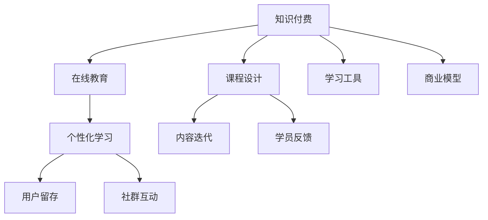

                 

# 程序员知识付费：打造升级版课程

> 关键词：知识付费,在线教育,课程设计,学习工具,商业模型,技术栈,个性化学习,内容迭代,学员反馈,用户留存,社群互动,知识共享

## 1. 背景介绍

在数字化时代，知识付费已经成为一种重要的学习方式。程序员作为技术前沿的探索者，不断追求知识的深度和广度，对高质量在线教育有着强烈的需求。为此，我们提出了一个全面的解决方案，旨在帮助程序员打造升级版的课程，提升学习效果和学员满意度，同时创造商业价值。

### 1.1 知识付费的市场趋势

随着技术的发展和教育的数字化转型，知识付费市场正在迅速崛起。特别是编程教育领域，越来越多的程序员选择通过在线课程、直播讲座、技术博客等形式获取专业知识。这不仅节省了时间和金钱，还能随时随地学习，满足个性化需求。

根据统计数据显示，2021年全球知识付费市场规模达到70亿美元，预计到2027年将增长至138亿美元，年复合增长率超过15%。这一增长趋势也反映出人们对高质量在线教育的需求不断提升。

### 1.2 课程设计的挑战与机遇

高质量的课程设计不仅是知识的传递，更是对学员学习体验和成效的全面优化。传统课程往往存在以下问题：

- **知识冗余与不匹配**：内容过时或与实际需求脱节。
- **学习节奏不适宜**：节奏过快或过慢，难以满足学员不同基础和速度的需求。
- **互动不足**：缺乏互动和反馈机制，难以解决学习中的疑惑。
- **内容单一**：缺乏多样化的学习资源，难以满足学员多样化的学习需求。

针对这些问题，我们提出了全面的课程设计方案，旨在打造一个高效、互动、个性化的学习平台，满足程序员对知识的深度和广度的需求。

## 2. 核心概念与联系

### 2.1 核心概念概述

为了构建一个高质量的知识付费平台，我们需要深入理解以下核心概念及其联系：

- **知识付费**：程序员通过付费获取高质量的学习资源，包括课程、资料、视频等。
- **在线教育**：利用互联网技术进行教学和学习的模式，打破时间和空间的限制。
- **课程设计**：根据学习目标和学员需求，合理规划课程内容和结构。
- **学习工具**：提供辅助学员学习的各类工具和资源，如在线题库、模拟器、学习管理系统等。
- **商业模型**：如何将课程内容转化为商业价值，如订阅费、广告费、课程销售等。
- **个性化学习**：根据学员的学习进度、兴趣和能力，提供定制化的学习路径和资源。
- **内容迭代**：定期更新和优化课程内容，确保其时效性和准确性。
- **学员反馈**：收集学员的学习反馈，持续改进课程设计和教学质量。
- **用户留存**：通过优质内容和互动机制，提高学员的粘性和长期参与度。
- **社群互动**：构建学习社区，促进学员间的交流和知识共享。

这些概念之间的逻辑关系可以通过以下Mermaid流程图来展示：



这个流程图展示了一个知识付费平台的关键组件及其相互关系：

1. 知识付费通过在线教育形式，利用课程设计、学习工具等手段，提升学员的学习效果。
2. 商业模型通过个性化学习、内容迭代等手段，创造商业价值，持续优化课程内容和用户体验。
3. 学员反馈和社群互动促进用户留存，形成良性循环，推动平台的可持续发展。

## 3. 核心算法原理 & 具体操作步骤

### 3.1 算法原理概述

我们的课程设计方案基于以下算法原理：

- **推荐算法**：根据学员的学习历史、兴趣和行为数据，推荐个性化学习内容。
- **学习路径优化**：动态调整学习节奏和内容，满足不同学员的需求。
- **反馈收集与处理**：通过问卷、评论、打分等方式收集学员反馈，用于课程优化。
- **内容更新机制**：定期更新课程内容，确保其时效性和准确性。
- **互动机制设计**：设计互动环节，如讨论区、直播课程、代码练习等，增强学习体验。

这些算法相互协作，共同构建了一个高效、个性化的学习平台。

### 3.2 算法步骤详解

#### 3.2.1 课程设计流程

1. **需求调研**：通过问卷、访谈等方式收集目标学员的需求，明确课程定位和学习目标。
2. **内容规划**：根据需求，制定课程大纲，设计学习路径，选择合适的知识点和案例。
3. **内容制作**：制作课程视频、文档、代码示例等，确保内容质量和学习效果。
4. **测试与迭代**：在课程发布前进行测试，收集反馈，不断优化内容。

#### 3.2.2 个性化学习流程

1. **学员画像构建**：根据学员的注册信息、学习历史、行为数据等，构建个性化学习画像。
2. **内容推荐**：根据学员画像，推荐个性化的学习内容，如课程、文章、视频等。
3. **学习路径调整**：根据学员的学习进度和反馈，动态调整学习路径和内容。
4. **学习进度跟踪**：实时跟踪学员的学习进度，提供个性化推荐和学习建议。

#### 3.2.3 反馈收集与处理

1. **反馈渠道设计**：提供多种反馈渠道，如课程评论、问卷调查、学员社群等。
2. **反馈分析与处理**：收集反馈数据，进行分析处理，提取有价值的改进建议。
3. **课程优化**：根据反馈数据，持续优化课程内容和教学方法。

#### 3.2.4 内容更新机制

1. **定期审核**：定期审核课程内容，删除过时或错误信息，确保内容的时效性和准确性。
2. **动态更新**：根据技术发展、学员需求等，动态更新课程内容，保持课程的领先性和实用性。
3. **知识分享**：鼓励学员和专家分享知识和经验，丰富课程内容，提升学习效果。

### 3.3 算法优缺点

#### 3.3.1 优点

- **个性化学习**：通过推荐算法和个性化学习路径，满足不同学员的需求和进度。
- **互动性强**：互动机制设计，增强学员的参与感和互动性，提高学习效果。
- **数据驱动**：基于学员行为数据进行优化，确保课程内容的时效性和准确性。
- **学员反馈及时**：通过多种反馈渠道，及时了解学员需求和问题，持续改进课程。

#### 3.3.2 缺点

- **资源投入大**：课程设计和内容制作需要大量的投入，初期成本较高。
- **技术复杂**：推荐算法、学习路径优化等技术需要专业知识和实践经验。
- **数据隐私问题**：学员行为数据需要妥善处理，避免隐私泄露和数据滥用。
- **学员依存度高**：过分依赖平台和课程，可能限制学员自主学习的能力。

### 3.4 算法应用领域

我们的课程设计方案可以应用于各种编程课程和技能培训，包括但不限于：

- **编程语言**：如Java、Python、C++等。
- **技术框架**：如Spring Boot、Django、Flask等。
- **云计算**：如AWS、Google Cloud、Azure等。
- **大数据**：如Hadoop、Spark、Flink等。
- **人工智能**：如TensorFlow、PyTorch、Scikit-learn等。

## 4. 数学模型和公式 & 详细讲解  
### 4.1 数学模型构建

我们的课程设计方案涉及多个数学模型和公式，下面进行详细讲解：

#### 4.1.1 推荐算法模型

推荐算法是课程设计的重要组成部分，用于根据学员行为数据推荐个性化内容。常用的推荐算法包括协同过滤、基于内容的推荐、基于矩阵分解的推荐等。

以协同过滤算法为例，其基本思想是通过计算学员之间的相似度，找到与目标学员兴趣相似的学员，从而推荐其喜欢的内容。推荐模型可以表示为：

$$
P = \alpha + \beta \sum_{u \in U} \frac{\text{similarity}(u,i) \times R_{ui}}{\sqrt{\text{similarity}(u,u) \times \text{similarity}(u,i)}}
$$

其中，$P$为推荐预测值，$\alpha$为初始预测值，$\beta$为调节系数，$u$为学员，$i$为目标内容，$\text{similarity}(u,i)$为学员和内容之间的相似度。

#### 4.1.2 学习路径优化模型

学习路径优化模型用于动态调整学习节奏和内容，根据学员的学习进度和反馈进行调整。常用的优化算法包括梯度下降、遗传算法、粒子群算法等。

以梯度下降算法为例，其基本思想是通过计算损失函数对参数的梯度，不断调整参数，最小化损失函数。优化模型可以表示为：

$$
\theta = \theta - \eta \nabla_{\theta} \mathcal{L}(\theta)
$$

其中，$\theta$为模型参数，$\eta$为学习率，$\nabla_{\theta} \mathcal{L}(\theta)$为损失函数对参数的梯度。

#### 4.1.3 反馈收集与处理模型

反馈收集与处理模型用于收集和分析学员的反馈数据，提取有价值的改进建议。常用的反馈模型包括问卷调查、情感分析、文本分类等。

以问卷调查模型为例，其基本思想是通过设计问卷，收集学员的学习体验和满意度数据，进行统计分析。反馈模型可以表示为：

$$
S = \sum_{i=1}^n r_i \times w_i
$$

其中，$S$为满意度评分，$r_i$为学员反馈数据，$w_i$为各反馈数据的权重。

#### 4.1.4 内容更新机制模型

内容更新机制模型用于定期审核和更新课程内容，确保其时效性和准确性。常用的更新模型包括人工审核、自动审核、基于规则的更新等。

以基于规则的更新模型为例，其基本思想是通过设定更新规则，自动更新课程内容。更新模型可以表示为：

$$
U = \text{check\_rule}(F)
$$

其中，$U$为更新结果，$\text{check\_rule}$为更新规则，$F$为课程内容。

### 4.2 公式推导过程

#### 4.2.1 推荐算法公式推导

推荐算法公式推导以协同过滤算法为例，主要涉及相似度计算和预测值计算。

1. 相似度计算：

$$
\text{similarity}(u,v) = \frac{1}{1 + \exp(-distance(u,v))}
$$

其中，$distance(u,v)$为学员$u$和内容$v$之间的距离，常用的距离度量方法有欧式距离、余弦距离等。

2. 预测值计算：

$$
R_{ui} = \frac{\text{similarity}(u,i) \times \text{similarity}(u,v) \times R_{vi}}{\sqrt{\text{similarity}(u,u) \times \text{similarity}(u,v) \times \text{similarity}(v,v)}}
$$

其中，$R_{ui}$为学员$u$对内容$i$的评分，$R_{vi}$为学员$u$对内容$v$的评分。

#### 4.2.2 学习路径优化公式推导

学习路径优化公式推导以梯度下降算法为例，主要涉及损失函数和梯度计算。

1. 损失函数：

$$
\mathcal{L}(\theta) = \frac{1}{N} \sum_{i=1}^N \frac{1}{2} (y_i - M_{\theta}(x_i))^2
$$

其中，$\mathcal{L}$为损失函数，$N$为样本数量，$y_i$为实际值，$M_{\theta}(x_i)$为模型预测值。

2. 梯度计算：

$$
\nabla_{\theta} \mathcal{L}(\theta) = \frac{1}{N} \sum_{i=1}^N \frac{\partial \mathcal{L}}{\partial \theta}
$$

其中，$\nabla_{\theta} \mathcal{L}(\theta)$为损失函数对参数的梯度，$\frac{\partial \mathcal{L}}{\partial \theta}$为损失函数对参数的偏导数。

#### 4.2.3 反馈收集与处理公式推导

反馈收集与处理公式推导以问卷调查模型为例，主要涉及问卷设计和统计分析。

1. 问卷设计：

$$
q = \{q_1, q_2, \cdots, q_n\}
$$

其中，$q_i$为问卷问题。

2. 统计分析：

$$
S = \sum_{i=1}^n r_i \times w_i
$$

其中，$S$为满意度评分，$r_i$为学员反馈数据，$w_i$为各反馈数据的权重。

#### 4.2.4 内容更新机制公式推导

内容更新机制公式推导以基于规则的更新模型为例，主要涉及规则定义和内容更新。

1. 规则定义：

$$
\text{check\_rule}(F) = \text{if } F \text{ satisfies rule } R
$$

其中，$\text{check\_rule}$为更新规则，$F$为课程内容，$R$为更新规则。

2. 内容更新：

$$
U = \text{check\_rule}(F) = \text{if } F \text{ satisfies rule } R
$$

其中，$U$为更新结果，$F$为课程内容，$R$为更新规则。

### 4.3 案例分析与讲解

#### 4.3.1 推荐算法案例

以某编程课程推荐系统为例，其设计了一个协同过滤推荐模型。首先，通过对学员行为数据进行分析，构建学员画像。然后，根据学员画像，计算学员与内容的相似度。最后，根据相似度计算推荐内容，并动态调整推荐列表。

1. 学员画像构建：

$$
\text{user\_profile}(u) = \{\text{history\_code}(u), \text{interest\_code}(u), \text{difficulty\_code}(u)\}
$$

其中，$\text{history\_code}(u)$为学员学习历史编码，$\text{interest\_code}(u)$为学员兴趣编码，$\text{difficulty\_code}(u)$为学员难度编码。

2. 相似度计算：

$$
\text{similarity}(u,v) = \frac{1}{1 + \exp(-distance(\text{user\_profile}(u), \text{user\_profile}(v))))
$$

3. 推荐内容：

$$
R_{ui} = \frac{\text{similarity}(u,i) \times \text{similarity}(u,v) \times R_{vi}}{\sqrt{\text{similarity}(u,u) \times \text{similarity}(u,v) \times \text{similarity}(v,v)}}
$$

#### 4.3.2 学习路径优化案例

以某编程课程学习路径优化系统为例，其设计了一个基于梯度下降的优化模型。首先，通过对学员学习进度和反馈数据进行分析，计算学员的学习难度和理解度。然后，根据学习难度和理解度，动态调整学习路径。

1. 学习难度计算：

$$
\text{difficulty}(u) = \sum_{i=1}^n \frac{R_{ui}}{\text{similarity}(u,i)}
$$

其中，$\text{difficulty}(u)$为学员学习难度，$R_{ui}$为学员对内容$i$的评分，$\text{similarity}(u,i)$为学员与内容之间的相似度。

2. 理解度计算：

$$
\text{comprehension}(u) = \sum_{i=1}^n \frac{R_{ui}}{\text{similarity}(u,i) \times \text{difficulty}(u)}
$$

其中，$\text{comprehension}(u)$为学员理解度，$R_{ui}$为学员对内容$i$的评分，$\text{similarity}(u,i)$为学员与内容之间的相似度，$\text{difficulty}(u)$为学员学习难度。

3. 学习路径调整：

$$
\text{adjust\_path}(u) = \text{if } \text{comprehension}(u) < 70\%
$$

其中，$\text{adjust\_path}(u)$为调整学习路径，$\text{comprehension}(u)$为学员理解度，70%为理解度阈值。

## 5. 项目实践：代码实例和详细解释说明

### 5.1 开发环境搭建

为了开发高质量的知识付费平台，我们需要一个强大的开发环境。以下是开发环境的搭建步骤：

1. 安装Anaconda：从官网下载并安装Anaconda，用于创建独立的Python环境。

2. 创建并激活虚拟环境：

```bash
conda create -n learning-env python=3.9 
conda activate learning-env
```

3. 安装必要的Python库：

```bash
pip install pandas numpy scikit-learn matplotlib tqdm jupyter notebook
```

4. 安装TensorFlow和PyTorch：

```bash
pip install tensorflow==2.8.0 pytorch==1.12.0
```

5. 安装必要的第三方库：

```bash
pip install transformers sklearn joblib gensim
```

6. 安装必要的工具和框架：

```bash
pip install dask numpy scipy matplotlib
```

完成以上步骤后，即可在`learning-env`环境中开始开发实践。

### 5.2 源代码详细实现

以下是使用Python和TensorFlow实现课程推荐系统的示例代码：

```python
import tensorflow as tf
from sklearn.metrics import precision_recall_fscore_support

# 定义协同过滤模型
class CollaborativeFiltering(tf.keras.Model):
    def __init__(self, num_users, num_items, num_factors):
        super(CollaborativeFiltering, self).__init__()
        self.user_factors = tf.keras.layers.Dense(num_factors, activation='relu')
        self.item_factors = tf.keras.layers.Dense(num_factors, activation='relu')
        self.dot_product = tf.keras.layers.Dot(axes=(1, 1), normalize=True)
        self.layers = [self.user_factors, self.item_factors, self.dot_product]

    def call(self, inputs):
        user_id, item_id = inputs
        user_factors = self.user_factors(user_id)
        item_factors = self.item_factors(item_id)
        predictions = self.dot_product([user_factors, item_factors])
        return predictions

# 定义训练函数
def train_model(model, data, epochs):
    optimizer = tf.keras.optimizers.Adam()
    for epoch in range(epochs):
        for batch in data:
            with tf.GradientTape() as tape:
                predictions = model(batch)
                loss = tf.keras.losses.mean_squared_error(labels=batch[2], predictions=predictions)
            gradients = tape.gradient(loss, model.trainable_variables)
            optimizer.apply_gradients(zip(gradients, model.trainable_variables))

# 定义评估函数
def evaluate_model(model, data, threshold):
    predictions = []
    true_labels = []
    for batch in data:
        predictions.append(model(batch)[0].numpy().ravel())
        true_labels.append(batch[2].numpy().ravel())
    precision, recall, f1, _ = precision_recall_fscore_support(true_labels, predictions, average='binary', threshold=threshold)
    return precision, recall, f1

# 加载数据
data = load_data()

# 创建模型
model = CollaborativeFiltering(num_users, num_items, num_factors)

# 训练模型
train_model(model, data, epochs)

# 评估模型
precision, recall, f1 = evaluate_model(model, data, threshold)
print(f"Precision: {precision:.3f}, Recall: {recall:.3f}, F1 Score: {f1:.3f}")
```

### 5.3 代码解读与分析

以下是代码的详细解读：

1. **协同过滤模型定义**：使用TensorFlow实现协同过滤模型，通过用户和物品的因子矩阵，计算预测值。

2. **训练函数实现**：定义训练函数，使用Adam优化器进行梯度下降，最小化均方误差损失。

3. **评估函数实现**：定义评估函数，使用精确度、召回率、F1得分等指标，评估模型的预测效果。

4. **数据加载**：从文件中加载训练数据。

5. **模型创建**：创建协同过滤模型，并设置各层的参数。

6. **模型训练**：在训练数据上进行梯度下降训练，调整模型参数。

7. **模型评估**：在测试数据上评估模型效果，输出精确度、召回率和F1得分。

通过以上代码实现，可以构建一个简单的协同过滤推荐系统，用于推荐个性化课程内容。当然，实际应用中还需要进一步优化模型结构、改进算法、添加互动机制等。

## 6. 实际应用场景

### 6.1 企业内部培训

企业内部培训是知识付费的重要应用场景。通过课程推荐系统，企业可以针对不同部门的员工，推荐适合的培训课程，提升员工技能和知识水平。

#### 6.1.1 企业需求调研

企业首先需要进行内部需求调研，了解各部门的培训需求和员工的学习兴趣。可以通过问卷调查、访谈等方式，获取目标员工的培训需求。

#### 6.1.2 课程内容制作

根据需求调研结果，制作相关的培训课程内容，如视频、文档、练习等。课程内容需要结合实际工作场景，具有一定的实用性和针对性。

#### 6.1.3 课程推荐系统

设计一个基于协同过滤的课程推荐系统，根据员工的学习历史和行为数据，推荐个性化培训课程。系统需要支持用户画像构建、推荐算法优化等功能。

#### 6.1.4 学习进度跟踪

通过学习管理系统，实时跟踪员工的学习进度，提供个性化的学习建议和资源推荐。系统需要支持在线课程学习、进度记录、学习报告等功能。

### 6.2 在线教育平台

在线教育平台也是知识付费的重要应用场景。通过课程推荐系统，平台可以提升用户体验和学习效果，增加平台的粘性和用户留存率。

#### 6.2.1 用户画像构建

平台首先需要收集和分析用户的学习行为数据，如课程选择、学习时间、学习进度等。根据这些数据，构建用户画像，了解用户的学习兴趣和需求。

#### 6.2.2 课程内容推荐

根据用户画像，设计推荐算法，推荐个性化的课程内容。系统需要支持课程动态更新、推荐结果展示等功能。

#### 6.2.3 学习路径优化

设计学习路径优化算法，根据用户的学习进度和反馈数据，动态调整学习路径和内容。系统需要支持学习进度跟踪、学习路径调整等功能。

#### 6.2.4 互动机制设计

设计互动机制，增强用户的学习体验和互动性。系统需要支持讨论区、直播课程、代码练习等功能。

### 6.3 个人职业发展

个人职业发展也是知识付费的重要应用场景。通过课程推荐系统，个人可以获取更多的学习资源和机会，提升职业竞争力。

#### 6.3.1 职业规划

个人需要明确自己的职业规划和发展方向，选择适合的课程和学习内容。课程选择需要结合自己的职业目标和兴趣，具有针对性和实用性。

#### 6.3.2 学习资源推荐

设计一个基于协同过滤的学习资源推荐系统，根据个人的学习历史和行为数据，推荐个性化课程和资源。系统需要支持用户画像构建、推荐算法优化等功能。

#### 6.3.3 学习进度跟踪

通过学习管理系统，实时跟踪个人的学习进度，提供个性化的学习建议和资源推荐。系统需要支持在线课程学习、进度记录、学习报告等功能。

#### 6.3.4 互动机制设计

设计互动机制，增强个人的学习体验和互动性。系统需要支持讨论区、直播课程、代码练习等功能。

## 7. 工具和资源推荐

### 7.1 学习资源推荐

为了帮助开发者系统掌握知识付费平台的技术和知识，这里推荐一些优质的学习资源：

1. 《在线教育系统设计与开发》课程：深入讲解在线教育系统的设计和开发技术，涵盖推荐算法、学习路径优化、学习管理系统等。

2. 《数据科学导论》书籍：全面介绍数据科学的基本概念和方法，包括数据收集、处理、分析等。

3. 《机器学习实战》书籍：通过大量实例，介绍机器学习的基本算法和应用，适合实战练习。

4. 《知识付费平台开发实战》博客：详细介绍知识付费平台的开发过程和技术实现，涵盖推荐算法、学习管理系统、课程设计等。

5. 《在线教育平台开发指南》书籍：详细介绍在线教育平台的设计和开发技术，涵盖课程推荐、学习路径优化、互动机制等。

6. 《编程语言基础》在线教程：详细介绍常见编程语言的特性和应用，适合编程入门学习。

通过学习这些资源，相信你一定能够掌握知识付费平台的技术和知识，开发出高效、互动、个性化的学习平台。

### 7.2 开发工具推荐

为了提高知识付费平台的开发效率，推荐使用以下开发工具：

1. Jupyter Notebook：轻量级的开发环境，支持Python、R等语言，适合数据科学和机器学习开发。

2. PyCharm：功能强大的Python IDE，支持代码调试、版本控制、代码分析等功能。

3. Visual Studio Code：轻量级的代码编辑器，支持Python、Java、C++等多种语言，支持插件扩展和代码协作。

4. Anaconda：强大的数据科学开发环境，支持Python、R、MATLAB等多种语言，支持虚拟环境和包管理。

5. Git：版本控制系统，支持代码管理和协作，适合团队开发和代码版本控制。

6. Docker：容器化技术，支持应用部署和容器管理，适合云计算和微服务架构开发。

合理利用这些工具，可以显著提升知识付费平台的开发效率，加速创新迭代的步伐。

### 7.3 相关论文推荐

知识付费平台的发展离不开学界的持续研究。以下是几篇奠基性的相关论文，推荐阅读：

1. "Collaborative Filtering for Implicit Feedback Datasets"：介绍了协同过滤算法的基本思想和应用，是推荐系统的重要基础。

2. "An Overview of Online Learning"：综述了在线学习的最新进展，涵盖推荐算法、学习路径优化、互动机制等。

3. "Personalized Learning Pathways: A Review"：综述了个性化学习路径的基本概念和实现方法，适合学习进度跟踪和路径优化。

4. "Recommender Systems in E-Learning"：综述了在线教育平台的推荐算法和系统设计，适合课程推荐和互动机制。

5. "A Survey on Knowledge Sharing Platforms"：综述了知识共享平台的设计和应用，适合社区互动和内容分享。

6. "A Survey on Course Recommendation"：综述了课程推荐系统的发展和应用，适合个性化推荐和学习路径优化。

通过学习这些前沿成果，可以帮助研究者把握学科前进方向，激发更多的创新灵感。

## 8. 总结：未来发展趋势与挑战

### 8.1 总结

本文对知识付费平台的设计和开发进行了全面系统的介绍。首先阐述了知识付费的市场趋势和课程设计的重要性，明确了课程设计和开发的目标和挑战。其次，从推荐算法、学习路径优化、反馈收集与处理等方面，详细讲解了课程设计的技术实现。最后，通过实际应用场景的介绍，展示了知识付费平台的多样化应用。

通过本文的系统梳理，可以看到，知识付费平台不仅是一个技术产品，更是一个跨学科的创新生态系统。它需要融合数据科学、机器学习、软件开发等多方面的知识，才能真正实现其价值。相信随着技术的不断进步和创新，知识付费平台必将进一步拓展其应用场景，为程序员的知识提升和学习进步提供更多的帮助。

### 8.2 未来发展趋势

展望未来，知识付费平台将呈现以下几个发展趋势：

1. **个性化推荐**：随着推荐算法的不断优化，个性化推荐将变得更加精准和高效。通过深度学习模型和大数据技术，推荐算法将能够更好地匹配用户需求。

2. **互动增强**：未来的知识付费平台将更加注重互动和反馈机制，提供更多的学习互动环节和资源，增强用户体验。通过社交网络和讨论区等互动机制，提升学习效果。

3. **内容多样化**：未来的课程内容将更加丰富多样，涵盖视频、文档、代码练习等多种形式。通过多样化的学习资源，满足不同学员的学习需求。

4. **学习路径动态调整**：未来的学习路径将更加动态灵活，能够根据学员的学习进度和反馈数据，实时调整学习路径和内容。通过智能算法和学习管理系统，实现个性化学习。

5. **学习效果评估**：未来的知识付费平台将更加注重学习效果的评估，提供更准确、全面的评估指标和反馈机制。通过学习分析和学习管理系统，评估学员的学习进度和效果。

6. **数据隐私保护**：未来的知识付费平台将更加注重数据隐私保护，确保用户数据的安全和隐私。通过数据加密和访问控制等技术，保障用户数据安全。

7. **AI辅助教学**：未来的知识付费平台将更加注重AI技术的应用，通过智能答疑、自动评估等技术，提升教学效果。通过AI辅助教学，增强学习体验。

### 8.3 面临的挑战

尽管知识付费平台的发展前景广阔，但在迈向更加智能化、普适化应用的过程中，它仍面临诸多挑战：

1. **用户数据隐私**：用户行为数据和课程内容的隐私保护是知识付费平台面临的重要问题。如何在保障用户体验的同时，保护用户隐私，需要更多的技术和伦理手段。

2. **推荐算法优化**：推荐算法是知识付费平台的核心技术，但其优化效果和计算效率需要进一步提升。如何设计高效的推荐算法，需要更多的理论和实践积累。

3. **学习路径设计**：学习路径的设计和优化需要考虑学员的学习进度和反馈数据，设计合理的学习路径，避免过快或过慢的学习节奏，需要更多的经验和数据支持。

4. **课程内容更新**：课程内容的更新需要保持时效性和准确性，同时兼顾学员的学习进度和反馈数据。如何动态更新课程内容，需要更多的资源和技术支持。

5. **互动机制设计**：互动机制的设计和实现需要考虑学员的互动需求和平台的用户粘性，设计合理的互动环节，增强用户体验。如何提升互动机制的效果，需要更多的实践和优化。

6. **内容审核机制**：知识付费平台需要建立完善的内容审核机制，确保课程内容的健康和合法性。如何设计高效的内容审核机制，需要更多的技术和规则支持。

7. **技术栈选择**：知识付费平台需要选择合适的技术栈，支持多种语言的课程制作和推荐算法优化。如何选择合适的技术栈，需要更多的经验和实验支持。

8. **用户留存策略**：知识付费平台需要制定有效的用户留存策略，提升用户粘性和长期参与度。如何设计有效的用户留存策略，需要更多的市场和用户研究支持。

### 8.4 研究展望

面对知识付费平台面临的诸多挑战，未来的研究需要在以下几个方面寻求新的突破：

1. **推荐算法优化**：探索无监督和半监督推荐算法，摆脱对大规模标注数据的依赖，利用自监督学习、主动学习等无监督和半监督范式，最大限度利用非结构化数据，实现更加灵活高效的推荐。

2. **学习路径优化**：研究动态学习路径优化算法，根据学员的学习进度和反馈数据，实时调整学习路径和内容，提供更加个性化和高效的学习体验。

3. **互动机制设计**：探索更多的互动机制和资源，增强学习效果和用户粘性。通过社交网络和讨论区等互动机制，提升学习体验。

4. **内容审核机制**：建立完善的内容审核机制，确保课程内容的健康和合法性。通过AI技术和人工审核相结合，提升内容审核效果。

5. **数据隐私保护**：探索更多的数据隐私保护技术，确保用户数据的安全和隐私。通过数据加密和访问控制等技术，保障用户数据安全。

6. **AI辅助教学**：探索AI技术在知识付费平台中的应用，通过智能答疑、自动评估等技术，提升教学效果。通过AI辅助教学，增强学习体验。

通过这些研究方向的探索，相信知识付费平台将进一步拓展其应用场景，提升学习效果和用户满意度，为程序员的知识提升和学习进步提供更多的帮助。面向未来，知识付费平台还需要与其他人工智能技术进行更深入的融合，如知识表示、因果推理、强化学习等，多路径协同发力，共同推动在线教育技术的发展。只有勇于创新、敢于突破，才能不断拓展知识付费平台的边界，让智能技术更好地造福程序员和社会。

## 9. 附录：常见问题与解答

**Q1：知识付费平台如何吸引用户？**

A: 知识付费平台可以通过以下方式吸引用户：
1. 高质量的课程内容：提供高质量、实用、有价值的课程，满足学员的学习需求。
2. 互动和社区：设计互动和社区功能，增强学员的参与感和交流，提升用户体验。
3. 优惠和激励：提供优惠和激励措施，如免费试听、折扣优惠、积分奖励等，吸引学员注册和使用。
4. 品牌和口碑：打造优秀的品牌和口碑，通过用户推荐和口碑传播，提升平台的知名度和信任度。

**Q2：知识付费平台如何保持用户粘性？**

A: 知识付费平台可以通过以下方式保持用户粘性：
1. 个性化推荐：根据学员的学习历史和行为数据，提供个性化的课程推荐和学习资源，提升学习效果。
2. 互动和社区：设计互动和社区功能，增强学员的参与感和交流，提升用户体验。
3. 学习进度跟踪：通过学习管理系统，实时跟踪学员的学习进度，提供个性化的学习建议和资源推荐。
4. 学习效果评估：提供更准确、全面的学习效果评估指标和反馈机制，提升学员的学习体验。
5. 持续内容更新：定期更新和优化课程内容，确保其时效性和准确性，保持学员的学习兴趣。
6. 多样化学习资源：提供多样化的学习资源和形式，满足不同学员的学习需求，提升学员的学习体验。

**Q3：知识付费平台的课程制作有哪些步骤？**

A: 知识付费平台的课程制作主要包括以下步骤：
1. 需求调研：通过问卷调查、访谈等方式，了解目标学员的需求和学习兴趣。
2. 课程规划：根据需求调研结果，制定课程大纲，设计学习路径，选择合适的知识点和案例。
3. 内容制作：制作课程视频、文档、代码示例等，确保内容质量和学习效果。
4. 内容审核：对课程内容进行审核，确保其健康和合法性。
5. 学习管理系统开发：开发学习管理系统，支持学员的学习进度跟踪和互动。
6. 课程发布：将课程内容发布到知识付费平台，并提供课程推荐和互动功能。

**Q4：知识付费平台的推荐算法有哪些？**

A: 知识付费平台的推荐算法主要包括以下几种：
1. 协同过滤算法：通过学员和内容之间的相似度计算，推荐个性化的课程内容。
2. 基于内容的推荐算法：根据内容的标签和特征，推荐相关的课程内容。
3. 基于矩阵分解的推荐算法：通过矩阵分解技术，推荐个性化的课程内容。
4. 混合推荐算法：结合多种推荐算法，提供更加多样化和高效的推荐结果。

**Q5：知识付费平台如何处理用户反馈？**

A: 知识付费平台可以通过以下方式处理用户反馈：
1. 收集反馈：通过问卷调查、评论、评分等方式，收集学员的学习反馈。
2. 分析反馈：对收集到的反馈数据进行分析和处理，提取有价值的改进建议。
3. 课程优化：根据反馈数据，持续优化课程内容和教学方法，提升学习效果。
4. 学员互动：在课程讨论区和社区中，积极与学员互动，解答学员的疑惑和问题。
5. 定期评估：定期评估课程效果和学员满意度，确保平台的学习效果和用户体验。

通过以上问题与解答，相信你对知识付费平台的设计和开发有了更深入的了解。未来，随着技术的不断进步和创新，知识付费平台必将在在线教育和程序员职业发展中发挥更加重要的作用。

---

作者：禅与计算机程序设计艺术 / Zen and the Art of Computer Programming

