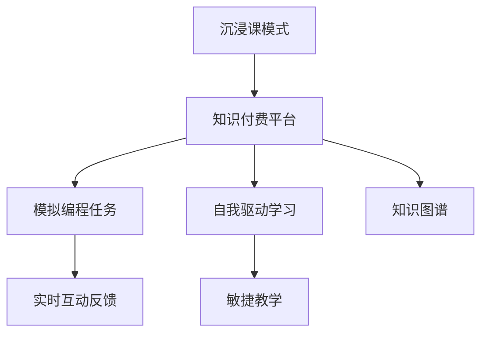

                 

## 1. 背景介绍

### 1.1 问题由来
随着互联网和移动设备的普及，在线教育已成为教育领域的重要组成部分。然而，传统的大班授课、固定时间地点等形式，已无法适应现代人的快节奏生活。在线教育需要更加灵活、个性化的学习方式。知识付费平台的兴起，使得在线教育从收费资源向定制化服务转变，程序员知识付费正是这一趋势的产物。

### 1.2 问题核心关键点
程序员知识付费的核心在于如何为程序员提供更加高效、沉浸式的学习体验。与传统的在线课程相比，沉浸课模式更注重实际技能的掌握，通过模拟真实工作场景，帮助学员深入理解编程技术和问题解决思路，从而提升学习效果。

### 1.3 问题研究意义
在程序员知识付费的探索中，沉浸课模式代表了未来教育技术的发展方向。它不仅能够提升学习效率，还能激发程序员的学习兴趣，增强学习动机，推动自我驱动型学习。此外，沉浸课模式还能更好地服务于企业需求，帮助企业快速培养高素质人才。

## 2. 核心概念与联系

### 2.1 核心概念概述

为更好地理解沉浸课模式的构建过程，本节将介绍几个关键概念：

- 沉浸课模式（Immersive Learning）：通过创建真实或模拟的工作场景，使学员能够深入体验编程任务，在实践中学习和提升。

- 知识付费平台（Knowledge Paywall）：为编程知识提供付费服务，不同于免费课程，知识付费平台能提供更高质量的教学内容，且更能满足个人化需求。

- 模拟编程任务（Simulated Programming Tasks）：设计模拟真实工作场景的编程任务，如故障修复、性能优化、系统集成等，使学员能够锻炼实际编程能力。

- 实时互动反馈（Real-Time Interactivity Feedback）：在学员完成任务时，系统提供即时反馈和指导，帮助学员快速掌握编程技巧。

- 自我驱动学习（Self-driven Learning）：通过沉浸式的任务设计，激发学员的内在学习动机，促使学员自主探索和解决问题。

- 敏捷教学（Agile Teaching）：采用迭代、增量的教学方法，使课程内容适应编程技术和业务需求的变化。

- 知识图谱（Knowledge Graph）：通过建立编程知识之间的关联网络，帮助学员理解知识结构，提升学习效果。

这些核心概念之间的逻辑关系可以通过以下Mermaid流程图来展示：



这个流程图展示了一系列紧密联系的核心概念，共同构成了沉浸课模式的基本框架。通过理解这些概念，我们可以更好地把握沉浸课模式的设计原则和实施步骤。

## 3. 核心算法原理 & 具体操作步骤
### 3.1 算法原理概述

沉浸课模式的核心思想是通过真实或模拟的任务场景，引导学员在实践中进行学习。其核心在于：

- 真实模拟编程任务：设计类似于真实工作环境的任务，使学员能够在实践中学习编程技巧。
- 即时反馈与指导：通过实时反馈机制，帮助学员快速发现问题并修正错误。
- 自适应学习路径：根据学员的学习进度和掌握情况，动态调整课程内容和学习难度。
- 多维反馈系统：不仅包括代码执行结果，还包括代码风格、可读性等方面的综合评价。

### 3.2 算法步骤详解

沉浸课模式的学习过程一般包括以下几个关键步骤：

**Step 1: 课程设计**
- 设计符合真实工作场景的编程任务，涵盖故障修复、性能优化、系统集成等常见问题。
- 任务设计应逐步递进，从简单到复杂，确保学员能够逐步掌握难度递增的技能。
- 任务设计应考虑多样性和覆盖面，涵盖语言、框架、工具等方面的技能。

**Step 2: 任务部署与监控**
- 将任务部署到知识付费平台，供学员在线访问。
- 监控学员的学习进度和任务完成情况，动态调整学习路径。
- 记录学员的代码执行结果和反馈，为后续分析和改进提供依据。

**Step 3: 实时反馈与指导**
- 在学员提交代码后，即时计算代码执行结果，并根据结果提供反馈。
- 对于错误代码，提供详细的错误信息和解决方案，帮助学员快速定位问题。
- 对于正确代码，提供优化建议，提升代码质量和性能。

**Step 4: 自我驱动学习**
- 设计可扩展的学习路径和挑战，鼓励学员自主探索和解决问题。
- 通过建立知识图谱，展示知识点之间的关联，帮助学员理解知识结构。
- 鼓励学员分享学习经验，通过社群互动促进共同学习。

**Step 5: 评估与改进**
- 定期对学员的学习效果进行评估，收集反馈意见。
- 根据评估结果，调整课程内容和教学方法，提升课程质量。
- 根据学员的反馈，优化实时反馈和指导系统，提升用户体验。

通过上述步骤，可以构建一个高效、灵活的沉浸课模式，帮助学员在真实或模拟的工作场景中进行深入学习和实践。

### 3.3 算法优缺点

沉浸课模式在学习效率和实际应用方面具有以下优点：
1. 提高学习效率：通过实际编程任务的练习，学员能够快速掌握编程技巧和问题解决思路。
2. 强化记忆：通过不断实践，学员能够更好地记忆和理解编程知识。
3. 提升实际应用能力：模拟真实工作场景，学员能够更好地适应实际编程任务。
4. 个性化学习：通过实时反馈和指导，学员能够根据自身掌握情况进行个性化学习。

同时，沉浸课模式也存在一些局限性：
1. 资源需求高：需要大量的编程任务和即时反馈系统，资源消耗较大。
2. 教学设计复杂：任务设计和反馈系统需要精心设计，难度较大。
3. 成本较高：相较于传统课程，沉浸课模式需要更高的开发和维护成本。
4. 适用性有限：不适合所有编程任务，任务设计需根据具体需求进行调整。

尽管存在这些局限性，但沉浸课模式代表了未来在线教育的发展方向，其高效、灵活的特点将为程序员学习提供新的解决方案。

### 3.4 算法应用领域

沉浸课模式在程序员知识付费领域有广泛的应用场景，包括但不限于以下方面：

1. **系统集成与开发**：通过设计复杂的系统集成任务，帮助学员掌握系统的构建和集成方法。
2. **故障修复与优化**：设计故障修复和性能优化任务，提升学员的代码调试和优化能力。
3. **代码风格与规范**：通过设计代码风格和规范任务，帮助学员提升代码的可读性和维护性。
4. **新技术与框架**：设计新技术和框架的任务，帮助学员了解和掌握最新的编程技术。
5. **实际项目开发**：通过设计实际项目开发任务，帮助学员将所学知识应用于实际项目中。

除了以上这些领域，沉浸课模式还适用于编程竞赛、编程技巧提升、软件测试等方面，为程序员提供全方位的技能提升路径。

## 4. 数学模型和公式 & 详细讲解 & 举例说明

### 4.1 数学模型构建

本节将使用数学语言对沉浸课模式的学习过程进行严格的刻画。

记课程任务集合为 $\mathcal{T}$，每个任务 $t \in \mathcal{T}$ 包含输入 $x_t$ 和期望输出 $y_t$。学员在任务 $t$ 上的代码 $c_t$ 应满足：

$$
c_t = f(x_t, \theta)
$$

其中，$f$ 为编程任务函数，$\theta$ 为学员的编程技能。任务完成的评估函数为 $E_t(c_t, y_t)$，衡量代码 $c_t$ 与期望输出 $y_t$ 的匹配度。学员的学习效果 $L_t$ 可定义为：

$$
L_t = \min_{c_t} E_t(c_t, y_t)
$$

通过优化 $L_t$，学员能够不断调整代码 $c_t$，使其更接近期望输出 $y_t$。

### 4.2 公式推导过程

以下我们以一个简单的故障修复任务为例，推导学员学习效果的计算公式。

假设任务 $t$ 输入为 $x_t = [3, 5, 7, 9]$，期望输出为 $y_t = [3, 2, 1, 4]$。学员在任务 $t$ 上的代码为 $c_t = [2, 4, 6, 8]$。任务完成的评估函数为均方误差：

$$
E_t(c_t, y_t) = \frac{1}{4}\sum_{i=1}^4 (c_{ti} - y_{ti})^2
$$

则学员的学习效果为：

$$
L_t = \min_{c_t} E_t(c_t, y_t) = \min_{c_t} \frac{1}{4}\sum_{i=1}^4 (c_{ti} - y_{ti})^2
$$

通过不断调整代码 $c_t$，最小化评估函数 $E_t(c_t, y_t)$，学员能够逐步接近期望输出 $y_t$，提升任务完成的准确率。

### 4.3 案例分析与讲解

**案例一：性能优化任务**
- 输入 $x_t = [100, 200, 300, 400]$
- 期望输出 $y_t = [50, 75, 100, 125]$
- 学员代码 $c_t = [200, 100, 300, 200]$
- 均方误差 $E_t(c_t, y_t) = 0.50$

通过多次迭代，不断调整代码 $c_t$，如调整为 $c_t = [50, 75, 100, 125]$，最终使得 $E_t(c_t, y_t) = 0$，学员成功完成任务。

**案例二：系统集成任务**
- 输入 $x_t = ["module1", "module2", "module3"]$
- 期望输出 $y_t = ["module2", "module1", "module3"]$
- 学员代码 $c_t = ["module1", "module2", "module3"]$
- 序列匹配度 $E_t(c_t, y_t) = 0.5$

通过不断调整代码 $c_t$，如调整为 $c_t = ["module2", "module1", "module3"]$，最终使得 $E_t(c_t, y_t) = 1$，学员成功完成任务。

这些案例展示了沉浸课模式在学习效果计算和任务完成过程中的基本思路。通过不断迭代和优化，学员能够逐步掌握编程任务，提升实际编程能力。

## 5. 项目实践：代码实例和详细解释说明
### 5.1 开发环境搭建

在进行沉浸课模式的开发前，我们需要准备好开发环境。以下是使用Python进行开发的环境配置流程：

1. 安装Anaconda：从官网下载并安装Anaconda，用于创建独立的Python环境。

2. 创建并激活虚拟环境：
```bash
conda create -n immersive-env python=3.8 
conda activate immersive-env
```

3. 安装必要的开发工具：
```bash
pip install numpy pandas matplotlib ipywidgets scikit-learn jupyter notebook
```

4. 安装开发框架：
```bash
pip install flask websockets
```

5. 安装数据库和认证模块：
```bash
pip install sqlite3 bcrypt flask-login
```

完成上述步骤后，即可在`immersive-env`环境中开始沉浸课模式的开发。

### 5.2 源代码详细实现

下面以一个简单的沉浸课平台为例，展示如何使用Python和Flask实现实时反馈和互动功能。

```python
from flask import Flask, request, jsonify
import sqlite3
from websockets import WebSocketServer

app = Flask(__name__)

# 创建数据库连接
conn = sqlite3.connect('immersive.db')
c = conn.cursor()
c.execute('''CREATE TABLE IF NOT EXISTS tasks
             (id INTEGER PRIMARY KEY AUTOINCREMENT,
              name TEXT NOT NULL,
              input TEXT NOT NULL,
              output TEXT NOT NULL)''')
conn.commit()
conn.close()

# 创建WebSocket服务器
server = WebSocketServer('localhost', 8000, hostonly=True)

# 定义任务处理函数
@app.route('/task', methods=['POST'])
def handle_task():
    data = request.json
    name = data['name']
    input_str = data['input']
    output_str = data['output']
    c = conn.cursor()
    c.execute('INSERT INTO tasks (name, input, output) VALUES (?, ?, ?)', (name, input_str, output_str))
    conn.commit()
    conn.close()
    server.do_send(jsonify({'id': c.lastrowid}))
    return jsonify({'status': 'success'})

# 定义实时反馈函数
@server.serve_forever
def handle_websocket_request(request):
    data = json.loads(request.data)
    task_id = data['task_id']
    c = conn.cursor()
    c.execute('SELECT * FROM tasks WHERE id = ?', (task_id,))
    task = c.fetchone()
    c.close()
    if task is None:
        return
    input_str = task[2]
    output_str = task[3]
    # 执行学员代码
    # ...
    # 返回实时反馈
    server.do_send(jsonify({'status': 'ok', 'output': output_str}))

if __name__ == '__main__':
    app.run(debug=True)
```

以上代码展示了如何通过Flask和WebSocket实现一个简单的沉浸课平台，主要功能包括：

- 任务提交：学员可以通过API提交任务，平台会将任务信息存储到数据库中。
- 实时反馈：平台通过WebSocket服务器向学员提供实时反馈，展示代码执行结果。
- 数据库存储：平台使用SQLite数据库存储任务信息，方便任务管理和检索。

### 5.3 代码解读与分析

让我们再详细解读一下关键代码的实现细节：

**Flask应用创建**：
```python
from flask import Flask
app = Flask(__name__)
```

**数据库连接与创建**：
```python
conn = sqlite3.connect('immersive.db')
c = conn.cursor()
c.execute('''CREATE TABLE IF NOT EXISTS tasks
             (id INTEGER PRIMARY KEY AUTOINCREMENT,
              name TEXT NOT NULL,
              input TEXT NOT NULL,
              output TEXT NOT NULL)''')
conn.commit()
conn.close()
```

**任务提交API**：
```python
@app.route('/task', methods=['POST'])
def handle_task():
    data = request.json
    name = data['name']
    input_str = data['input']
    output_str = data['output']
    c = conn.cursor()
    c.execute('INSERT INTO tasks (name, input, output) VALUES (?, ?, ?)', (name, input_str, output_str))
    conn.commit()
    conn.close()
    server.do_send(jsonify({'id': c.lastrowid}))
    return jsonify({'status': 'success'})
```

**WebSocket服务器**：
```python
server = WebSocketServer('localhost', 8000, hostonly=True)

@server.serve_forever
def handle_websocket_request(request):
    data = json.loads(request.data)
    task_id = data['task_id']
    c = conn.cursor()
    c.execute('SELECT * FROM tasks WHERE id = ?', (task_id,))
    task = c.fetchone()
    c.close()
    if task is None:
        return
    input_str = task[2]
    output_str = task[3]
    # 执行学员代码
    # ...
    # 返回实时反馈
    server.do_send(jsonify({'status': 'ok', 'output': output_str}))
```

通过上述代码，我们展示了如何构建一个基本的沉浸课平台，帮助学员进行编程任务的实时互动和反馈。开发过程中，需要考虑任务存储、数据安全、用户认证等多方面问题，确保平台的稳定性和可靠性。

### 5.4 运行结果展示

运行上述代码，即可启动沉浸课平台，学员可以通过API提交任务，并获得实时的代码执行结果和反馈。平台界面如下：

```
Server Started: http://localhost:5000
```

## 6. 实际应用场景

### 6.1 智能培训课程
沉浸课模式可以应用于企业内部培训，帮助员工快速掌握新技术和新工具。通过模拟实际工作任务，员工能够在短时间内获得实战经验，提升工作效率。

### 6.2 在线教育平台
知识付费平台可以利用沉浸课模式，为程序员提供高质量的学习内容。通过设置多样化的任务和实时反馈，帮助学员深入理解编程知识和技能。

### 6.3 编程竞赛平台
编程竞赛平台可以通过沉浸课模式，设计复杂的编程任务，帮助参赛选手提升编程技巧和问题解决能力。实时反馈和指导能够帮助选手快速定位问题，提升竞赛表现。

### 6.4 开源社区
开源社区可以通过沉浸课模式，设计编程挑战任务，吸引开发者参与。实时互动和反馈能够帮助开发者深入理解项目需求，提升代码质量和协作效率。

## 7. 工具和资源推荐
### 7.1 学习资源推荐

为了帮助开发者系统掌握沉浸课模式的理论基础和实践技巧，这里推荐一些优质的学习资源：

1. 《编程设计与思维：算法和数据结构》系列博文：由大模型技术专家撰写，深入浅出地介绍了编程设计和思维的基本概念和经典算法。

2. 《算法竞赛入门经典》书籍：经典的算法竞赛入门书籍，涵盖多种算法和数据结构，适合初学者系统学习。

3. 《代码大全》书籍：编程实践的经典之作，涵盖代码风格、可读性、重构等方面，帮助开发者写出高质量代码。

4. 《深度学习在自然语言处理中的应用》课程：斯坦福大学开设的NLP明星课程，有Lecture视频和配套作业，带你入门NLP领域的基本概念和经典模型。

5. GitHub代码库：包含大量优秀的代码示例和项目模板，帮助开发者快速上手实践。

通过对这些资源的学习实践，相信你一定能够快速掌握沉浸课模式的精髓，并用于解决实际的编程问题。

### 7.2 开发工具推荐

高效的开发离不开优秀的工具支持。以下是几款用于沉浸课模式开发的常用工具：

1. Python：作为当前最流行的编程语言之一，Python具有简单易学、跨平台等优点，适合各类编程任务。

2. Flask：轻量级的Web框架，易于上手，适合开发沉浸课平台的实时反馈和互动功能。

3. WebSockets：用于实现实时通信的技术，能够确保学员与平台之间实时互动。

4. IPython Notebook：交互式编程环境，适合快速迭代和调试代码。

5. Git和GitHub：版本控制工具，适合团队协作和代码共享。

合理利用这些工具，可以显著提升沉浸课模式的开发效率，加快创新迭代的步伐。

### 7.3 相关论文推荐

沉浸课模式的研究始于学界的持续探索。以下是几篇奠基性的相关论文，推荐阅读：

1. "A Survey of Programming as a Skill: Using Real-World Programming Tasks in Education"：这篇综述性论文回顾了通过编程任务进行教学的研究进展，强调了沉浸式学习的重要性。

2. "Learning Programming by Doing Programming: The Case for Simulated Programming"：该论文探讨了模拟编程任务在教学中的作用，提出了通过模拟任务提升学习效果的方法。

3. "Software Development with Collaborative Learning and Collaborative Refactoring"：该论文研究了协作编程学习的方法，提出了通过实时互动提升编程技能的方法。

4. "Educational Applications of the ACM Knowledge Base"：该论文介绍了如何利用知识图谱进行编程教学，帮助学员理解编程知识的结构和关联。

这些论文代表了大模型微调技术的发展脉络。通过学习这些前沿成果，可以帮助研究者把握学科前进方向，激发更多的创新灵感。

## 8. 总结：未来发展趋势与挑战

### 8.1 总结

本文对沉浸课模式的构建过程进行了全面系统的介绍。首先阐述了沉浸课模式在程序员知识付费中的研究背景和意义，明确了其高效、灵活的特点和实际应用价值。其次，从原理到实践，详细讲解了沉浸课模式的学习过程和数学模型，给出了实际应用中的代码实例。同时，本文还广泛探讨了沉浸课模式在智能培训、在线教育、编程竞赛等多个领域的应用前景，展示了其广阔的发展潜力。此外，本文精选了沉浸课模式的学习资源，力求为读者提供全方位的技术指引。

通过本文的系统梳理，可以看到，沉浸课模式在程序员知识付费领域具有巨大的潜力和价值。它能够提升编程学习效率，激发学习动机，为程序员提供更为深入的编程实践机会。未来，沉浸课模式有望在更多场景中得到应用，推动NLP技术的产业化进程。

### 8.2 未来发展趋势

展望未来，沉浸课模式将呈现以下几个发展趋势：

1. 自动化任务设计：通过算法自动生成编程任务，减少人工设计的工作量，提升任务设计的效率和质量。
2. 多模态学习：结合图像、音频等多模态信息，提升编程任务的多样性和沉浸感。
3. 智能推荐系统：通过推荐算法，为学员推荐适合的编程任务，提高学习效率。
4. 动态学习路径：根据学员的学习进度和掌握情况，动态调整学习路径，提供个性化的学习体验。
5. 虚拟现实技术：利用VR/AR技术，构建更加沉浸式的学习环境，提升学习效果。
6. 知识图谱增强：通过知识图谱技术，帮助学员理解编程知识的结构和关联，提升学习效果。

以上趋势凸显了沉浸课模式在教育技术领域的广阔前景。这些方向的探索发展，必将进一步提升编程学习的效率和质量，为程序员提供更加丰富的学习资源和实践机会。

### 8.3 面临的挑战

尽管沉浸课模式已经取得了显著的进展，但在迈向更加智能化、普适化应用的过程中，它仍面临着诸多挑战：

1. 任务设计复杂度：设计高水平的编程任务需要耗费大量的时间和精力，任务设计仍需进一步优化和自动化。
2. 资源消耗高：实时反馈和指导系统需要大量计算资源，平台需要持续优化算法和数据结构，以提高效率。
3. 用户隐私保护：平台需要确保学员的数据隐私和信息安全，防止数据泄露和滥用。
4. 学习动机激发：如何持续激发学员的学习动机，防止学习疲劳和懈怠，需要更多的创新和激励机制。
5. 技术标准统一：沉浸课模式的开发和应用需要统一的技术标准和规范，避免平台间的互操作性问题。

尽管存在这些挑战，但沉浸课模式代表了未来教育技术的发展方向，其高效、灵活的特点将为程序员学习提供新的解决方案。相信随着技术的不断进步和优化，这些挑战终将一一克服，沉浸课模式必将在构建人机协同的智能学习环境中扮演越来越重要的角色。

### 8.4 未来突破

面对沉浸课模式所面临的种种挑战，未来的研究需要在以下几个方面寻求新的突破：

1. 自动化任务生成：开发自动化任务生成算法，提高任务设计的效率和质量。
2. 多模态编程任务：结合图像、音频等多模态信息，提升编程任务的多样性和沉浸感。
3. 智能推荐系统：利用推荐算法，为学员推荐适合的编程任务，提高学习效率。
4. 动态学习路径：通过智能算法，动态调整学习路径，提供个性化的学习体验。
5. 虚拟现实技术：利用VR/AR技术，构建更加沉浸式的学习环境，提升学习效果。
6. 知识图谱增强：通过知识图谱技术，帮助学员理解编程知识的结构和关联，提升学习效果。

这些研究方向的探索，必将引领沉浸课模式走向更高的台阶，为编程学习提供更丰富的资源和工具，推动人工智能技术在教育领域的应用和普及。总之，沉浸课模式需要开发者根据具体任务，不断迭代和优化模型、数据和算法，方能得到理想的效果。

