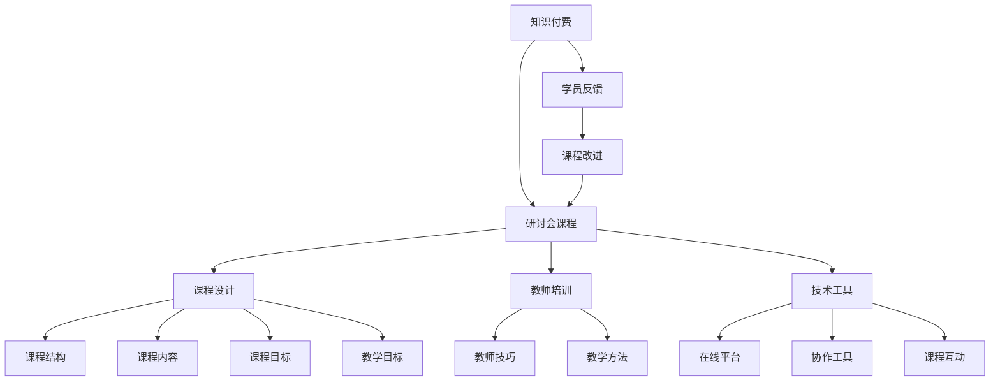

                 

# 程序员知识付费：打造研讨会课程

> 关键词：知识付费, 研讨会课程, 课程设计, 在线教育, 教师培训, 知识传授, 软件开发

## 1. 背景介绍

### 1.1 问题由来

近年来，在线教育市场迅猛发展，知识付费成为一种流行的学习方式。传统的大学课程和线下培训机构已经无法满足广大编程爱好者和职场人士的需求。这促使程序员和教育工作者开始探索新的教育模式和知识传授方式。

而程序员知识付费研讨会课程便是这一背景下的产物。通过构建高质量的研讨会课程，程序员可以分享自己的知识、经验和技术见解，而听众则可以获取实用技能，提升编程能力，这种互动性强的教学方式受到广泛欢迎。

### 1.2 问题核心关键点

在探讨研讨会课程的构建时，以下关键点尤为重要：

- 课程设计：如何设计一个结构合理、内容丰富的研讨会课程，使其能够满足学员需求并激发其学习兴趣。
- 教师培训：如何培训教师，使其具备设计课程、引导讨论和有效传授知识的能力。
- 技术工具：如何选择合适的技术工具和平台，确保研讨会课程的顺利开展和效果最大化。
- 学员反馈：如何收集和利用学员反馈，持续改进课程内容和教学方式。
- 商业模式：如何构建可持续的商业模式，实现知识付费研讨会课程的商业化运作。

## 2. 核心概念与联系

### 2.1 核心概念概述

本节将介绍几个与研讨会课程密切相关的核心概念：

- 知识付费：通过付费方式获取有价值的知识或技能，如在线课程、研讨会、书籍等。
- 研讨会课程：一种以面对面或线上方式进行的互动性强的教育活动，教师与学员共同参与讨论、实践和知识传递。
- 课程设计：选择合适的课程结构和内容，设置课程目标，确保课程的实用性和趣味性。
- 教师培训：为教师提供系统化的培训，提升其教学能力和演讲技巧，确保课程质量。
- 技术工具：支持研讨会课程进行的技术平台和工具，如Zoom、Slack、GitHub等。
- 学员反馈：通过调查问卷、在线评价等方式收集学员的反馈，用于课程改进和优化。

这些概念之间的关系可以通过以下Mermaid流程图来展示：



这个流程图展示了知识付费、研讨会课程、课程设计、教师培训、技术工具和学员反馈等核心概念之间的关系：

1. 知识付费是研讨会课程的驱动因素，而课程设计、教师培训和技术工具是课程成功的前提条件。
2. 课程设计包括课程结构、内容、目标等要素，教师培训提升教师能力，技术工具支持课程实施。
3. 学员反馈用于课程改进，从而形成良性循环。

## 3. 核心算法原理 & 具体操作步骤

### 3.1 算法原理概述

研讨会课程的设计和实施遵循以下基本原理：

1. 需求导向：根据目标受众的需求设计课程内容，确保课程的实用性和针对性。
2. 互动性：通过互动式教学方法，如讨论、问答、案例分析等，提升学员的参与度和理解能力。
3. 实践导向：课程设计中融入实际项目和编程练习，使学员能够在实践中掌握技能。
4. 循序渐进：课程结构由浅入深，逐步增加难度和复杂度，适应不同层次学员的需求。
5. 反馈机制：设置定期的学员反馈环节，收集反馈意见并及时调整课程内容。

### 3.2 算法步骤详解

研讨会课程的构建主要包括以下几个步骤：

**Step 1: 需求分析**

- 确定目标受众：了解学员的背景、兴趣和技术水平，确保课程内容符合其需求。
- 调研市场需求：分析当前市场上的课程需求和竞品情况，找到差异化点。

**Step 2: 课程设计**

- 确定课程结构：划分课程模块，如基础知识、高级技巧、实战项目等。
- 设计课程内容：选择和编写课程讲义、代码示例、练习题等，确保内容全面、准确。
- 设置课程目标：明确课程的总体目标和各个模块的具体目标。

**Step 3: 教师培训**

- 设计培训内容：根据课程需求，设计教师培训内容，包括教学技巧、课程互动方法等。
- 开展培训活动：通过线上或线下方式，对教师进行系统培训，提升其教学能力。

**Step 4: 技术工具选择**

- 选择在线平台：根据课程需求，选择合适的在线平台，如Zoom、Slack、Discord等。
- 配置协作工具：配置协作工具，如GitHub、Jira、Trello等，支持课程管理和协作。

**Step 5: 实施与改进**

- 实施课程：根据课程设计和技术工具，开展课程实施，确保效果。
- 收集反馈：通过调查问卷、在线评价等方式收集学员反馈，分析改进方向。
- 持续改进：根据反馈意见，不断优化课程内容和教学方法，提升课程质量。

### 3.3 算法优缺点

研讨会课程有以下优点：

1. 互动性强：通过互动式教学方法，提升学员的参与度和学习效果。
2. 实践导向：通过实践练习，使学员能够掌握实际编程技能。
3. 反馈机制：通过学员反馈，持续改进课程内容，提升课程质量。

但同时也有以下缺点：

1. 资源投入：课程设计和教师培训需要大量人力和物力投入。
2. 学员差异：学员水平不一，难以设计统一的教学进度和方法。
3. 课程周期：课程设计和实施周期较长，课程更新速度较慢。

## 4. 数学模型和公式 & 详细讲解 & 举例说明

### 4.1 数学模型构建

本节将使用数学语言对研讨会课程的设计和实施过程进行更加严格的刻画。

记研讨会课程为 $C$，包括 $N$ 个课程模块 $C_1, C_2, \ldots, C_N$，每个模块包含 $M$ 个子任务 $T_{ij}$，其中 $i$ 为任务编号，$j$ 为模块编号。设课程时间为 $T$ 个单位时间，课程总目标为 $G$，课程目标分解为 $G_1, G_2, \ldots, G_N$，每个模块的目标为 $G_{ij}$。

### 4.2 公式推导过程

课程的总体目标可以表示为：

$$
G = \sum_{i=1}^N G_{ij}
$$

课程时间为：

$$
T = \sum_{i=1}^N T_{ij}
$$

每个模块的目标可以分解为子任务的目标，即：

$$
G_{ij} = \sum_{k=1}^M T_{ik}
$$

在实际设计中，可以通过设定每个子任务的具体目标和评价标准，实现课程目标的细化和分解。例如，对于“Python编程基础”模块，可以将其分解为变量、数据类型、控制流、函数等子任务，每个子任务的目标可以通过具体编程练习和案例分析来实现。

### 4.3 案例分析与讲解

以“机器学习基础”课程为例，课程结构可以分解为数据预处理、模型选择、模型训练、模型评估等模块。每个模块的目标可以进一步细化为具体的编程任务，如数据清洗、特征工程、模型构建、性能评估等。

具体步骤如下：

1. 数据预处理：选择数据集，进行数据清洗和特征工程，实现数据预处理的目标。
2. 模型选择：介绍各种机器学习模型，如线性回归、决策树、支持向量机等，选择合适的模型。
3. 模型训练：使用训练数据对模型进行训练，实现模型的训练目标。
4. 模型评估：使用测试数据对模型进行评估，实现模型的评估目标。

## 5. 项目实践：代码实例和详细解释说明

### 5.1 开发环境搭建

在进行研讨会课程设计时，我们需要准备好开发环境。以下是使用Python进行开发的环境配置流程：

1. 安装Anaconda：从官网下载并安装Anaconda，用于创建独立的Python环境。

2. 创建并激活虚拟环境：
```bash
conda create -n course-env python=3.8 
conda activate course-env
```

3. 安装必要的库：
```bash
pip install numpy pandas matplotlib jupyter notebook 
```

4. 配置在线平台：
```bash
conda install jupyterlab
```

完成上述步骤后，即可在`course-env`环境中开始课程设计和实施。

### 5.2 源代码详细实现

下面以“Python基础”课程为例，给出使用Jupyter Notebook进行课程设计和实施的PyTorch代码实现。

首先，定义课程模块和子任务：

```python
import numpy as np
import pandas as pd
from jupyter import widgets
from jupyterlab import JupyterLab
from IPython.display import display

# 定义课程模块和子任务
modules = {
    'Python基础': {
        'T1': 'Python环境配置',
        'T2': 'Python基础语法',
        'T3': 'Python数据类型',
        'T4': 'Python控制流'
    },
    'Python高级': {
        'T1': 'Python函数和模块',
        'T2': 'Python文件操作',
        'T3': 'Python异常处理',
        'T4': 'Python多线程编程'
    },
    'Python实战': {
        'T1': 'Python网络编程',
        'T2': 'Python爬虫开发',
        'T3': 'Python数据分析',
        'T4': 'Python机器学习基础'
    }
}

# 定义课程目标
course_goals = {
    'Python基础': '掌握Python基础语法和常用数据类型',
    'Python高级': '掌握Python高级编程技巧和异常处理',
    'Python实战': '掌握Python网络编程、爬虫开发和数据分析'
}

# 定义课程时间
course_time = {
    'Python基础': 4,
    'Python高级': 6,
    'Python实战': 8
}
```

接着，设计课程结构和内容：

```python
def create_course_structure():
    course_structure = {}
    for module, tasks in modules.items():
        course_structure[module] = {}
        for task in tasks:
            course_structure[module][task] = {
                'time': None,
                'content': None
            }
    return course_structure

def set_course_time(course_structure):
    total_time = 0
    for module, tasks in course_structure.items():
        total_time += course_time[module]
    for module, tasks in course_structure.items():
        for task in tasks:
            tasks[task]['time'] = course_time[module] / len(tasks)
    return course_structure

def set_course_content(course_structure):
    for module, tasks in course_structure.items():
        for task in tasks:
            tasks[task]['content'] = f'Python {task.replace("T", "")}课程内容'
    return course_structure

def get_course_structure():
    course_structure = create_course_structure()
    course_structure = set_course_time(course_structure)
    course_structure = set_course_content(course_structure)
    return course_structure
```

然后，设计课程互动和反馈机制：

```python
def create_interaction_widget():
    interaction_widget = widgets.Dropdown(
        options=['选择任务', '选择模块', '选择目标'],
        value='选择任务',
        description='互动方式：'
    )
    display(interaction_widget)

def collect_feedback_widget():
    feedback_widget = widgets.Textarea(
        placeholder='请输入反馈意见',
        description='反馈意见：',
        disabled=False
    )
    display(feedback_widget)
```

最后，启动课程实施流程：

```python
def start_course():
    course_structure = get_course_structure()
    create_interaction_widget()
    collect_feedback_widget()

# 启动课程
start_course()
```

以上就是使用Jupyter Notebook进行Python基础课程设计和实施的完整代码实现。可以看到，利用Jupyter Notebook，我们可以快速构建课程内容和互动反馈机制，极大提高了课程设计的效率。

### 5.3 代码解读与分析

让我们再详细解读一下关键代码的实现细节：

**课程结构和内容设计**

- `create_course_structure`方法：创建课程结构字典，包括课程模块和子任务。
- `set_course_time`方法：根据课程时间，计算每个子任务的学习时间。
- `set_course_content`方法：为每个子任务设置课程内容描述。

**课程互动和反馈机制**

- `create_interaction_widget`方法：创建互动方式选择器，供学员选择课程内容和互动方式。
- `collect_feedback_widget`方法：创建反馈意见输入框，供学员提交反馈意见。

**课程实施流程**

- `start_course`方法：调用其他方法，完成课程结构的创建、时间计算、内容设置、互动方式和反馈机制的构建，并启动课程实施。

通过上述代码实现，我们可以看到，使用Jupyter Notebook进行课程设计和实施，可以极大地提高工作效率，便于快速迭代和更新课程内容。

## 6. 实际应用场景

### 6.1 在线教育平台

知识付费研讨会课程在在线教育平台中的应用非常广泛。这些平台通过汇聚各类专家和讲师，为学员提供各类专业课程，涵盖编程、金融、医学等多个领域。通过在线平台，学员可以随时随地进行学习，与讲师互动，获得实时反馈，提升学习效果。

例如，Coursera、Udemy、edX等在线教育平台已经引入了知识付费研讨会课程，通过视频、直播、互动问答等多种形式，提供高质量的教育资源。

### 6.2 公司内部培训

研讨会课程同样适用于企业内部培训。公司可以通过知识付费研讨会课程，为员工提供技术分享、技能培训和知识更新，提高员工的技术水平和业务能力。

例如，谷歌、亚马逊、微软等大公司内部都有自己的知识付费平台，定期组织各类技术分享和研讨会，帮助员工快速掌握最新技术和工具。

### 6.3 开源社区

开源社区可以通过知识付费研讨会课程，促进社区成员之间的知识交流和经验分享，提升社区的活跃度和技术水平。

例如，GitHub、Stack Overflow等开源社区，定期举办各类技术研讨会和代码审查活动，吸引全球开发者参与，提升社区的技术水平和影响力。

### 6.4 未来应用展望

随着在线教育市场的不断发展，知识付费研讨会课程将迎来更大的发展机遇。未来，研讨会课程将与AI技术结合，通过智能推荐和个性化教学，提升学习效果。

此外，研讨会课程还将与虚拟现实、增强现实等新技术结合，提供更加沉浸式和互动式的学习体验。例如，通过VR技术，学员可以进入虚拟的编程环境，进行实战练习和项目开发，提高实际编程能力。

## 7. 工具和资源推荐

### 7.1 学习资源推荐

为了帮助开发者系统掌握研讨会课程的构建和实施，这里推荐一些优质的学习资源：

1. Coursera、Udemy、edX等在线教育平台：提供各类高质量的课程和专家讲座，涵盖编程、金融、医学等多个领域。

2. Python官方文档和教程：Python是一种广泛使用的编程语言，通过官方文档和教程，可以快速掌握Python编程基础和高级技巧。

3. Jupyter Notebook官方文档和教程：Jupyter Notebook是一种强大的交互式编程环境，通过官方文档和教程，可以快速掌握其使用技巧。

4. TensorFlow官方文档和教程：TensorFlow是一种常用的深度学习框架，通过官方文档和教程，可以快速掌握其核心功能和应用场景。

5. Kaggle竞赛和数据集：Kaggle是一个著名的数据科学竞赛平台，通过参与竞赛和数据集练习，可以提升数据处理和机器学习技能。

通过对这些资源的学习实践，相信你一定能够快速掌握研讨会课程的构建和实施方法，提升自身编程水平和教学能力。

### 7.2 开发工具推荐

高效的开发离不开优秀的工具支持。以下是几款用于研讨会课程开发的常用工具：

1. Jupyter Notebook：一种交互式编程环境，支持代码编写、数据可视化和互动教学，是课程设计和实施的重要工具。

2. GitHub：一个代码托管平台，支持版本控制和代码协作，方便课程管理和学员共享。

3. Zoom、Slack、Discord等：常用的在线沟通工具，支持视频会议、即时消息和频道讨论，方便课程互动和学员交流。

4. Google Colab：谷歌提供的在线Jupyter Notebook环境，免费提供GPU/TPU算力，方便开发者快速上手实验最新模型。

合理利用这些工具，可以显著提升研讨会课程的开发效率，加快创新迭代的步伐。

### 7.3 相关论文推荐

研讨会课程的发展源于学界的持续研究。以下是几篇奠基性的相关论文，推荐阅读：

1. "Interactive Learning for Data Science" by Simon Thompson: 讨论了通过互动式教学方法提升学习效果的理论基础和方法。

2. "Designing Effective Online Courses" by Judith S. Long and Emily J. Prather: 介绍了如何设计高质量的在线课程，包括课程结构、内容设计和互动反馈等。

3. "Knowledge Sharing in Online Communities" by Paul Karau and David J. Torrey: 研究了知识共享在在线社区中的机制和效果，为社区知识付费提供了理论支持。

4. "Parameter-Efficient Transfer Learning for NLP" by Thomas Wolf et al.: 讨论了如何通过参数高效微调，提升模型性能和适应能力，为研讨会课程设计提供了技术支持。

这些论文代表了大语言模型微调技术的发展脉络。通过学习这些前沿成果，可以帮助研究者把握学科前进方向，激发更多的创新灵感。

## 8. 总结：未来发展趋势与挑战

### 8.1 总结

本文对知识付费研讨会课程进行了全面系统的介绍。首先阐述了知识付费、研讨会课程、课程设计、教师培训等核心概念，明确了研讨会课程在在线教育、公司培训、开源社区等场景中的重要价值。其次，从原理到实践，详细讲解了研讨会课程的数学模型和操作步骤，给出了课程设计和实施的完整代码实例。同时，本文还广泛探讨了研讨会课程在多个行业领域的应用前景，展示了知识付费技术的发展潜力。最后，本文精选了研讨会课程的学习资源、开发工具和相关论文，力求为读者提供全方位的技术指引。

通过本文的系统梳理，可以看到，知识付费研讨会课程作为一种新兴的教育方式，已经得到广泛应用和认可，为程序员和教育工作者提供了新的教学思路和技术支持。面向未来，知识付费研讨会课程必将与其他教育技术结合，成为推动知识传播和技能提升的重要手段。

### 8.2 未来发展趋势

展望未来，研讨会课程将呈现以下几个发展趋势：

1. 技术融合：未来研讨会课程将与AI技术、VR技术等新兴技术结合，提供更加沉浸式和互动式的学习体验。
2. 个性化教学：通过智能推荐系统，实现个性化教学和知识推荐，提升学习效果。
3. 多平台集成：未来研讨会课程将集成到各类在线平台和教育系统中，实现统一管理和资源共享。
4. 全球化合作：通过知识付费研讨会课程，促进全球知识共享和跨国合作，提升全球技术水平。
5. 社会影响力：未来研讨会课程将进一步拓展到社会教育领域，促进终身学习和知识普及。

以上趋势凸显了知识付费研讨会课程的广阔前景。这些方向的探索发展，必将进一步提升研讨会课程的实用性和影响力，为教育行业带来新的变革。

### 8.3 面临的挑战

尽管知识付费研讨会课程已经取得了瞩目成就，但在迈向更加智能化、普适化应用的过程中，它仍面临着诸多挑战：

1. 技术门槛：研讨会课程的设计和实施需要较高的技术水平，对参与者提出了较高的要求。
2. 内容更新：课程内容需要持续更新，跟上技术发展的步伐，这对课程维护者提出了新的挑战。
3. 学员管理：如何有效地管理学员，确保课程的互动性和学习效果，还需进一步探索。
4. 商业模式：如何构建可持续的商业模式，实现知识付费研讨会课程的商业化运作，还需深入研究。
5. 社会接受度：如何提高社会对知识付费研讨会课程的接受度，消除误解和偏见，还需更多宣传和教育。

这些挑战需要开发者和教育工作者共同努力，不断优化和改进课程设计，提升教学质量，才能使知识付费研讨会课程得到广泛应用和认可。

### 8.4 研究展望

面向未来，知识付费研讨会课程的研究方向包括：

1. 技术创新：开发新的交互式教学方法和技术工具，提升学习效果和课程互动性。
2. 内容丰富：设计更加全面、实用、有趣的内容，激发学员的学习兴趣和动力。
3. 社会合作：与各类教育机构、企业和社会组织合作，实现资源共享和知识普及。
4. 商业模式：探索新的商业化模式，如课程订阅、会员制度、知识变现等，实现可持续发展。
5. 伦理规范：建立研讨会课程的伦理规范和行为准则，确保课程的公正、公平和合规。

这些研究方向的探索，将进一步推动知识付费研讨会课程的发展，为知识传播和技能提升提供新的技术手段和教育平台。总之，知识付费研讨会课程作为新兴的教育方式，未来必将在推动技术普及和知识共享方面发挥更大的作用。

## 9. 附录：常见问题与解答

**Q1：如何进行课程设计？**

A: 课程设计是知识付费研讨会课程的核心，具体步骤如下：
1. 确定目标受众：了解学员的背景、兴趣和技术水平，确保课程内容符合其需求。
2. 调研市场需求：分析当前市场上的课程需求和竞品情况，找到差异化点。
3. 划分课程模块：将课程内容划分为多个模块，如基础知识、高级技巧、实战项目等。
4. 设计课程目标：明确课程的总体目标和各个模块的具体目标。
5. 选择课程内容：根据课程目标，选择和编写课程讲义、代码示例、练习题等。

**Q2：如何进行教师培训？**

A: 教师培训是确保课程质量的重要环节，具体步骤如下：
1. 设计培训内容：根据课程需求，设计教师培训内容，包括教学技巧、课程互动方法等。
2. 开展培训活动：通过线上或线下方式，对教师进行系统培训，提升其教学能力。
3. 反馈和改进：收集教师的反馈意见，不断优化培训内容和方法，提升培训效果。

**Q3：如何选择在线平台？**

A: 选择在线平台需要考虑以下几个因素：
1. 平台功能：选择功能强大、易于使用的在线平台，支持课程管理、互动反馈等功能。
2. 用户界面：选择界面友好、操作简便的在线平台，方便教师和学员使用。
3. 技术支持：选择技术支持全面、服务质量好的在线平台，确保课程运行的稳定性和可靠性。

**Q4：如何进行学员管理？**

A: 学员管理是确保课程互动性和学习效果的重要环节，具体步骤如下：
1. 学员注册：建立学员账户管理系统，方便学员注册和登录。
2. 互动机制：设置互动机制，如讨论区、问答环节等，鼓励学员积极参与。
3. 反馈收集：通过调查问卷、在线评价等方式收集学员反馈，分析改进方向。
4. 学员激励：设置学员激励机制，如奖励、认证等，提升学员的学习动力。

**Q5：如何进行商业化运作？**

A: 知识付费研讨会课程的商业化运作需要考虑以下几个因素：
1. 定价策略：根据课程内容、教师水平和市场需求，制定合理的定价策略。
2. 营销推广：通过线上线下多种渠道，推广课程内容，吸引学员参与。
3. 服务优化：不断优化课程内容和教学方法，提升学员的学习效果和满意度。
4. 数据利用：通过数据分析，优化课程设计和学员管理，提高运营效率。

通过这些方法和技巧，相信你一定能够系统掌握知识付费研讨会课程的构建和实施方法，提升自身编程水平和教学能力，推动知识付费技术的发展和应用。

---

作者：禅与计算机程序设计艺术 / Zen and the Art of Computer Programming

