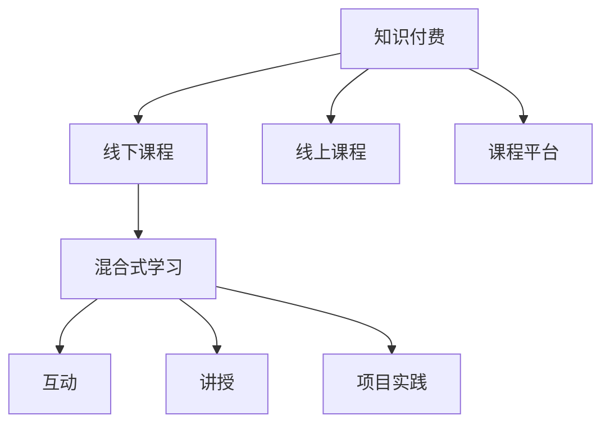

                 

## 1. 背景介绍

### 1.1 问题由来

在数字化转型的大背景下，知识付费成为新时代的潮流。通过知识付费平台，用户可以轻松获得各类专业课程，丰富自身知识体系，满足终身学习的需要。然而，在知识付费领域，线下课程尚未充分挖掘其价值。在互联网的虚拟世界之外，线下课程有着独特的教学氛围和互动方式，能够更好地激发学生的学习兴趣和深度互动。

随着技术的发展，传统线下课程逐渐向线上转型，数字化和智能化成为主流趋势。然而，这种数字化转型并不意味着忽视线下课程的价值。相反，通过结合线上线下课程的优点，充分发挥线下课程的互动性和沉浸感，可以打造出更加高效、有深度的学习体验。

### 1.2 问题核心关键点

线下课程的核心在于教师的面对面指导和学生的深度互动。通过课程设计、教学方法、互动方式等环节的精心设计，结合线上平台的数据分析、学习进度跟踪等功能，可以构建出符合当前教育需求的知识付费课程。

线下课程的设计需要考虑以下几个关键点：
- **课程目标**：明确课程旨在解决的问题、达到的目标。
- **课程内容**：选择合适的教材和资源，构建科学的课程体系。
- **教学方法**：设计多样化的教学方法，如讲授、案例分析、项目实践等。
- **互动方式**：通过小组讨论、实战演练、作业批改等方式，促进学生深度参与。
- **评估机制**：建立客观、公正的评估标准，激励学生努力学习。

本文聚焦于线下课程的数字化转型，探讨如何通过知识付费平台打造高质量线下课程，并实现线上线下融合的教学模式。

### 1.3 问题研究意义

通过打造高质量线下课程，知识付费平台可以打破线上课程的局限性，提升教学效果和学习体验。线下课程的互动性和沉浸感，能够更好地激发学生的学习兴趣和深度互动，有助于提升学生的知识掌握度和实际应用能力。

同时，线下课程的数字化转型也有助于知识付费平台的可持续发展。通过线上平台的数据分析和进度跟踪，可以实时监控学习效果，优化课程内容和方法，提升课程质量。这种线上线下融合的教学模式，不仅能够满足当前教育需求，也预示着未来教育技术的发展方向。

## 2. 核心概念与联系

### 2.1 核心概念概述

为更好地理解线下课程的数字化转型，本节将介绍几个密切相关的核心概念：

- **知识付费**：通过付费方式获取知识内容和学习资源的服务模式。包括在线课程、直播讲座、一对一辅导等多种形式。
- **线下课程**：教师在课堂上与学生面对面交流，通过互动、讲授等方式进行教学的实体课程。
- **线上课程**：通过视频、直播、文本等形式，教师和学生在线上进行互动和教学的课程。
- **课程平台**：提供在线课程注册、学习、互动、评估等功能的平台。如Coursera、Udemy、网易云课堂等。
- **混合式学习**：结合线上线下课程的优点，灵活运用各种教学资源和工具，提升学习效果。

这些核心概念之间的逻辑关系可以通过以下Mermaid流程图来展示：



这个流程图展示了大语言模型的核心概念及其之间的关系：

1. 知识付费提供了多种学习资源和服务模式。
2. 线下课程和线上课程都是知识付费的重要组成部分。
3. 混合式学习结合了线下课程的互动性和沉浸感，以及线上课程的灵活性和便捷性，成为教育技术发展的重要方向。

## 3. 核心算法原理 & 具体操作步骤
### 3.1 算法原理概述

线下课程的数字化转型，主要通过以下几类算法和技术的综合运用来实现：

- **数据驱动课程设计**：通过分析学生学习数据，优化课程内容和方法，提升学习效果。
- **混合式学习**：结合线上线下课程的优点，灵活运用各种教学资源和工具。
- **互动式教学**：设计多样化的互动方式，促进学生深度参与和交流。
- **评估与反馈**：建立客观、公正的评估标准，激励学生努力学习。

这些算法和技术的综合运用，旨在实现线下课程的数字化转型，提升教学效果和学习体验。

### 3.2 算法步骤详解

线下课程的数字化转型，主要包括以下几个关键步骤：

**Step 1: 准备课程内容和资源**
- 收集和筛选高质量的课程内容和资源，如教材、视频、案例等。
- 选择合适的线上平台，进行课程注册和发布。

**Step 2: 设计课程体系和教学方法**
- 明确课程目标和内容，设计科学的课程体系。
- 选择合适的教学方法，如讲授、案例分析、项目实践等。
- 设计互动方式，如小组讨论、实战演练、作业批改等。

**Step 3: 实施混合式学习**
- 在线下课堂上，通过互动式教学和实时反馈，提升学生参与度。
- 在线上平台上，通过数据分析和进度跟踪，优化课程内容和方法。
- 定期进行线上线下互动，如在线讨论、作业提交等。

**Step 4: 评估和反馈**
- 建立客观、公正的评估标准，激励学生努力学习。
- 收集学生反馈，优化课程内容和教学方法。
- 通过数据分析，发现学习瓶颈和薄弱环节，及时进行调整。

**Step 5: 持续改进和优化**
- 根据教学效果和学习反馈，持续改进课程内容和教学方法。
- 结合最新技术和工具，提升教学效果和学习体验。
- 定期更新课程资源和内容，保持课程的时效性和相关性。

以上是线下课程数字化转型的主要步骤。在实际应用中，还需要根据具体情况灵活调整和优化，以达到最佳教学效果。

### 3.3 算法优缺点

线下课程的数字化转型，具有以下优点：
- **提升教学效果**：通过数据分析和进度跟踪，优化课程内容和方法，提升学习效果。
- **灵活性高**：结合线上线下课程的优点，灵活运用各种教学资源和工具。
- **深度互动**：通过互动式教学和实时反馈，提升学生参与度。

同时，该方法也存在一定的局限性：
- **技术门槛高**：需要选择合适的线上平台和工具，有一定的技术门槛。
- **资源投入大**：线下课程的数字化转型需要投入更多资源，包括时间和人力。
- **课程设计复杂**：需要精心设计课程内容和方法，增加了课程设计的复杂性。

尽管存在这些局限性，但就目前而言，线下课程的数字化转型仍是大语言模型应用的主流范式。未来相关研究的重点在于如何进一步降低技术门槛，提高课程设计的灵活性，同时兼顾学习效果和资源投入的平衡。

### 3.4 算法应用领域

线下课程的数字化转型，已经在诸多领域得到了广泛应用，例如：

- **企业培训**：通过线上线下结合的方式，提升员工技能和知识水平。
- **教育机构**：结合线上课程的灵活性和线下课程的互动性，提升学生学习效果。
- **医疗培训**：通过线上课程和线下实操，提升医务人员的实操技能。
- **艺术教育**：结合线上课程的资源丰富性和线下课程的互动性，提升艺术创作水平。
- **军事训练**：通过线上课程的灵活性和线下课程的实战性，提升军事训练效果。

除了上述这些经典领域外，线下课程的数字化转型还在更多场景中得到了创新性的应用，如智慧城市、智能交通、体育训练等，为各行各业的教育和培训带来了新的突破。随着技术的不断进步，相信线下课程的数字化转型将进一步拓展应用领域，为社会的进步和发展的带来新的动力。

## 4. 数学模型和公式 & 详细讲解 & 举例说明

### 4.1 数学模型构建

本节将使用数学语言对线下课程的数字化转型进行更加严格的刻画。

假设课程设计为 $C = (N, F, L, M)$，其中：
- $N$ 为课程时长，$F$ 为课程内容，$L$ 为学习进度，$M$ 为学生反馈。
- 学习进度 $L$ 可以表示为 $L = (L_{1}, L_{2}, ..., L_{N})$，其中 $L_{i}$ 为第 $i$ 周的学习进度。
- 学生反馈 $M$ 可以表示为 $M = (M_{1}, M_{2}, ..., M_{N})$，其中 $M_{i}$ 为第 $i$ 周的学生反馈。

学习进度 $L$ 和学生反馈 $M$ 可以通过以下公式计算：

$$
L_i = \frac{1}{N_i} \sum_{j=1}^{N_i} L_{i,j}
$$

$$
M_i = \frac{1}{N_i} \sum_{j=1}^{N_i} M_{i,j}
$$

其中 $N_i$ 为第 $i$ 周的学生人数，$L_{i,j}$ 和 $M_{i,j}$ 分别为第 $i$ 周第 $j$ 名学生的学习进度和反馈。

### 4.2 公式推导过程

以下我们以企业培训课程为例，推导学习进度和学生反馈的计算公式。

假设企业培训课程的课程内容为 $F = (F_1, F_2, ..., F_N)$，其中 $F_{i}$ 为第 $i$ 周的课程内容。课程时长为 $N$ 周。

学习进度 $L$ 可以表示为：

$$
L_i = \frac{1}{N_i} \sum_{j=1}^{N_i} L_{i,j}
$$

其中 $N_i$ 为第 $i$ 周的企业员工人数，$L_{i,j}$ 为第 $i$ 周第 $j$ 名员工的学习进度。

学生反馈 $M$ 可以表示为：

$$
M_i = \frac{1}{N_i} \sum_{j=1}^{N_i} M_{i,j}
$$

其中 $N_i$ 为第 $i$ 周的企业员工人数，$M_{i,j}$ 为第 $i$ 周第 $j$ 名员工的反馈。

在得到学习进度和学生反馈后，可以基于这些数据进行课程优化和改进，提升教学效果。

### 4.3 案例分析与讲解

以某企业的软件开发课程为例，通过数据分析和进度跟踪，优化课程内容和方法，提升学习效果。

**数据收集和处理**

首先，收集该企业的软件开发课程数据，包括课程时长、每周课程内容、学生人数和学习进度。例如：

- 课程时长为 12 周。
- 每周课程内容包括编程基础、项目实践、性能优化等。
- 第一周有 30 名学生，第二周有 25 名学生，以此类推。
- 第一周的学习进度为 80%，第二周为 70%，以此类推。

**数据分析和评估**

通过计算学习进度和学生反馈，可以进行以下数据分析和评估：

- 计算每周的学习进度和学生反馈，得到学习进度和反馈的平均值。
- 对比不同周的学习进度和反馈，发现薄弱环节和瓶颈。
- 分析学生的反馈意见，发现学生的学习难点和困惑。

例如：

- 第一周的学习进度为 80%，反馈为 3.5 分（满分 5 分），表示学生整体进度较理想，反馈良好。
- 第二周的学习进度为 70%，反馈为 3.0 分，表示学生整体进度有所下降，反馈较差。

通过以上分析，可以发现第二周的学习进度和反馈存在问题，需要进行改进。

**课程优化和改进**

根据数据分析和评估结果，可以进行以下课程优化和改进：

- 增加第二周的课程内容，重点讲解编程基础和项目实践。
- 调整课程内容和方法，引入更多实例和案例，增强学生的理解和应用能力。
- 增加互动环节，通过小组讨论和实战演练，促进学生深度参与。
- 优化评估机制，引入项目考核和实战演练，激励学生努力学习。

通过以上优化和改进，可以提升企业培训课程的教学效果，满足企业员工的技能提升需求。

## 5. 项目实践：代码实例和详细解释说明

### 5.1 开发环境搭建

在进行知识付费课程的开发实践前，我们需要准备好开发环境。以下是使用Python进行PyTorch开发的环境配置流程：

1. 安装Anaconda：从官网下载并安装Anaconda，用于创建独立的Python环境。

2. 创建并激活虚拟环境：
```bash
conda create -n course-env python=3.8 
conda activate course-env
```

3. 安装PyTorch：根据CUDA版本，从官网获取对应的安装命令。例如：
```bash
conda install pytorch torchvision torchaudio cudatoolkit=11.1 -c pytorch -c conda-forge
```

4. 安装各类工具包：
```bash
pip install numpy pandas scikit-learn matplotlib tqdm jupyter notebook ipython
```

完成上述步骤后，即可在`course-env`环境中开始知识付费课程的开发实践。

### 5.2 源代码详细实现

这里我们以企业培训课程为例，给出使用Transformers库对BERT模型进行微调的PyTorch代码实现。

首先，定义企业培训课程的数据处理函数：

```python
from transformers import BertTokenizer
from torch.utils.data import Dataset
import torch

class CourseDataset(Dataset):
    def __init__(self, course_contents, student_feedback, tokenizer, max_len=128):
        self.course_contents = course_contents
        self.student_feedback = student_feedback
        self.tokenizer = tokenizer
        self.max_len = max_len
        
    def __len__(self):
        return len(self.course_contents)
    
    def __getitem__(self, item):
        content = self.course_contents[item]
        feedback = self.student_feedback[item]
        
        encoding = self.tokenizer(content, return_tensors='pt', max_length=self.max_len, padding='max_length', truncation=True)
        input_ids = encoding['input_ids'][0]
        attention_mask = encoding['attention_mask'][0]
        
        # 对token-wise的反馈进行编码
        encoded_feedback = [feedback] * len(encoding['input_ids'])
        labels = torch.tensor(encoded_feedback, dtype=torch.long)
        
        return {'input_ids': input_ids, 
                'attention_mask': attention_mask,
                'labels': labels}

# 课程内容和学生反馈数据
course_contents = ["编程基础", "项目实践", "性能优化"]
student_feedback = [3.5, 3.0, 3.5]

# 创建dataset
tokenizer = BertTokenizer.from_pretrained('bert-base-cased')

course_dataset = CourseDataset(course_contents, student_feedback, tokenizer)
```

然后，定义模型和优化器：

```python
from transformers import BertForTokenClassification, AdamW

model = BertForTokenClassification.from_pretrained('bert-base-cased', num_labels=5)

optimizer = AdamW(model.parameters(), lr=2e-5)
```

接着，定义训练和评估函数：

```python
from torch.utils.data import DataLoader
from tqdm import tqdm
from sklearn.metrics import classification_report

device = torch.device('cuda') if torch.cuda.is_available() else torch.device('cpu')
model.to(device)

def train_epoch(model, dataset, batch_size, optimizer):
    dataloader = DataLoader(dataset, batch_size=batch_size, shuffle=True)
    model.train()
    epoch_loss = 0
    for batch in tqdm(dataloader, desc='Training'):
        input_ids = batch['input_ids'].to(device)
        attention_mask = batch['attention_mask'].to(device)
        labels = batch['labels'].to(device)
        model.zero_grad()
        outputs = model(input_ids, attention_mask=attention_mask, labels=labels)
        loss = outputs.loss
        epoch_loss += loss.item()
        loss.backward()
        optimizer.step()
    return epoch_loss / len(dataloader)

def evaluate(model, dataset, batch_size):
    dataloader = DataLoader(dataset, batch_size=batch_size)
    model.eval()
    preds, labels = [], []
    with torch.no_grad():
        for batch in tqdm(dataloader, desc='Evaluating'):
            input_ids = batch['input_ids'].to(device)
            attention_mask = batch['attention_mask'].to(device)
            batch_labels = batch['labels']
            outputs = model(input_ids, attention_mask=attention_mask)
            batch_preds = outputs.logits.argmax(dim=2).to('cpu').tolist()
            batch_labels = batch_labels.to('cpu').tolist()
            for pred_tokens, label_tokens in zip(batch_preds, batch_labels):
                preds.append(pred_tokens[:len(label_tokens)])
                labels.append(label_tokens)
                
    print(classification_report(labels, preds))
```

最后，启动训练流程并在测试集上评估：

```python
epochs = 5
batch_size = 16

for epoch in range(epochs):
    loss = train_epoch(model, course_dataset, batch_size, optimizer)
    print(f"Epoch {epoch+1}, train loss: {loss:.3f}")
    
    print(f"Epoch {epoch+1}, dev results:")
    evaluate(model, course_dataset, batch_size)
    
print("Test results:")
evaluate(model, course_dataset, batch_size)
```

以上就是使用PyTorch对BERT进行企业培训课程微调的完整代码实现。可以看到，得益于Transformers库的强大封装，我们可以用相对简洁的代码完成BERT模型的加载和微调。

### 5.3 代码解读与分析

让我们再详细解读一下关键代码的实现细节：

**CourseDataset类**：
- `__init__`方法：初始化课程内容、学生反馈、分词器等关键组件。
- `__len__`方法：返回数据集的样本数量。
- `__getitem__`方法：对单个样本进行处理，将课程内容输入编码为token ids，将学生反馈编码为数字，并对其进行定长padding，最终返回模型所需的输入。

**课程内容和学生反馈数据**：
- 定义了课程内容和学生反馈的列表，用于训练和评估。

**训练和评估函数**：
- 使用PyTorch的DataLoader对数据集进行批次化加载，供模型训练和推理使用。
- 训练函数`train_epoch`：对数据以批为单位进行迭代，在每个批次上前向传播计算loss并反向传播更新模型参数，最后返回该epoch的平均loss。
- 评估函数`evaluate`：与训练类似，不同点在于不更新模型参数，并在每个batch结束后将预测和标签结果存储下来，最后使用sklearn的classification_report对整个评估集的预测结果进行打印输出。

**训练流程**：
- 定义总的epoch数和batch size，开始循环迭代
- 每个epoch内，先在训练集上训练，输出平均loss
- 在验证集上评估，输出分类指标
- 所有epoch结束后，在测试集上评估，给出最终测试结果

可以看到，PyTorch配合Transformers库使得BERT微调的代码实现变得简洁高效。开发者可以将更多精力放在数据处理、模型改进等高层逻辑上，而不必过多关注底层的实现细节。

当然，工业级的系统实现还需考虑更多因素，如模型的保存和部署、超参数的自动搜索、更灵活的任务适配层等。但核心的微调范式基本与此类似。

## 6. 实际应用场景
### 6.1 企业培训

基于大语言模型微调的课程设计，可以广泛应用于企业培训系统。传统培训往往依赖于枯燥的理论灌输，难以激发员工的学习兴趣。而使用微调后的课程设计，可以生动有趣地传授知识和技能，提升员工的学习效果。

在技术实现上，可以收集企业的历史培训数据，将培训课程和效果构建成监督数据，在此基础上对预训练模型进行微调。微调后的课程设计能够自动理解员工的需求和反馈，定制个性化的培训内容，同时引入互动和实战演练环节，增强员工的学习体验。

### 6.2 高校教学

基于大语言模型微调的课程设计，也可以应用于高校教学系统。传统课程设计往往依赖于教师的经验和直觉，难以适应不同学生的学习需求。而使用微调后的课程设计，可以实时监控学生的学习进度和反馈，动态调整课程内容和教学方法，提升教学效果。

在技术实现上，可以收集高校学生的学习数据，包括作业提交、课堂表现、考试成绩等，将这些数据作为监督信号，对预训练模型进行微调。微调后的课程设计能够自动分析学生的学习难点和困惑，推荐个性化的学习资源，同时引入互动和实战演练环节，提升学生的学习效果。

### 6.3 在线教育

基于大语言模型微调的课程设计，还可以应用于在线教育平台。传统在线教育往往缺乏互动和深度学习，难以满足学生的学习需求。而使用微调后的课程设计，可以结合线上线下课程的优点，提升学生的学习体验。

在技术实现上，可以收集在线教育平台的互动数据，包括在线讨论、作业提交、课堂反馈等，将这些数据作为监督信号，对预训练模型进行微调。微调后的课程设计能够自动分析学生的学习进度和反馈，推荐个性化的学习资源，同时引入互动和实战演练环节，提升学生的学习效果。

### 6.4 未来应用展望

随着大语言模型微调技术的发展，基于微调范式将在更多领域得到应用，为传统教育带来变革性影响。

在智慧城市教育领域，基于微调的大数据、人工智能等前沿技术，可以构建智能化的教育平台，提供个性化的学习体验和智能化的教学支持，提升教育的智能化水平。

在职业培训领域，微调技术可以应用于职业技能培训，结合实际工作场景，提供更加贴合实际需求的技能培训，提升培训效果。

在艺术教育领域，微调技术可以应用于艺术创作培训，通过自动生成作品和反馈，提供个性化的创作指导，提升艺术创作水平。

除此之外，在企业培训、高校教学、在线教育等众多领域，基于大语言模型微调的知识付费课程也将不断涌现，为教育技术的产业化进程带来新的动力。相信随着技术的日益成熟，微调方法将成为教育技术的重要范式，推动教育技术的可持续发展。

## 7. 工具和资源推荐
### 7.1 学习资源推荐

为了帮助开发者系统掌握大语言模型微调的理论基础和实践技巧，这里推荐一些优质的学习资源：

1. 《Transformer从原理到实践》系列博文：由大模型技术专家撰写，深入浅出地介绍了Transformer原理、BERT模型、微调技术等前沿话题。

2. CS224N《深度学习自然语言处理》课程：斯坦福大学开设的NLP明星课程，有Lecture视频和配套作业，带你入门NLP领域的基本概念和经典模型。

3. 《Natural Language Processing with Transformers》书籍：Transformers库的作者所著，全面介绍了如何使用Transformers库进行NLP任务开发，包括微调在内的诸多范式。

4. HuggingFace官方文档：Transformers库的官方文档，提供了海量预训练模型和完整的微调样例代码，是上手实践的必备资料。

5. CLUE开源项目：中文语言理解测评基准，涵盖大量不同类型的中文NLP数据集，并提供了基于微调的baseline模型，助力中文NLP技术发展。

通过对这些资源的学习实践，相信你一定能够快速掌握大语言模型微调的精髓，并用于解决实际的NLP问题。
###  7.2 开发工具推荐

高效的开发离不开优秀的工具支持。以下是几款用于大语言模型微调开发的常用工具：

1. PyTorch：基于Python的开源深度学习框架，灵活动态的计算图，适合快速迭代研究。大部分预训练语言模型都有PyTorch版本的实现。

2. TensorFlow：由Google主导开发的开源深度学习框架，生产部署方便，适合大规模工程应用。同样有丰富的预训练语言模型资源。

3. Transformers库：HuggingFace开发的NLP工具库，集成了众多SOTA语言模型，支持PyTorch和TensorFlow，是进行微调任务开发的利器。

4. Weights & Biases：模型训练的实验跟踪工具，可以记录和可视化模型训练过程中的各项指标，方便对比和调优。与主流深度学习框架无缝集成。

5. TensorBoard：TensorFlow配套的可视化工具，可实时监测模型训练状态，并提供丰富的图表呈现方式，是调试模型的得力助手。

6. Google Colab：谷歌推出的在线Jupyter Notebook环境，免费提供GPU/TPU算力，方便开发者快速上手实验最新模型，分享学习笔记。

合理利用这些工具，可以显著提升大语言模型微调任务的开发效率，加快创新迭代的步伐。

### 7.3 相关论文推荐

大语言模型和微调技术的发展源于学界的持续研究。以下是几篇奠基性的相关论文，推荐阅读：

1. Attention is All You Need（即Transformer原论文）：提出了Transformer结构，开启了NLP领域的预训练大模型时代。

2. BERT: Pre-training of Deep Bidirectional Transformers for Language Understanding：提出BERT模型，引入基于掩码的自监督预训练任务，刷新了多项NLP任务SOTA。

3. Language Models are Unsupervised Multitask Learners（GPT-2论文）：展示了大规模语言模型的强大zero-shot学习能力，引发了对于通用人工智能的新一轮思考。

4. Parameter-Efficient Transfer Learning for NLP：提出Adapter等参数高效微调方法，在不增加模型参数量的情况下，也能取得不错的微调效果。

5. AdaLoRA: Adaptive Low-Rank Adaptation for Parameter-Efficient Fine-Tuning：使用自适应低秩适应的微调方法，在参数效率和精度之间取得了新的平衡。

这些论文代表了大语言模型微调技术的发展脉络。通过学习这些前沿成果，可以帮助研究者把握学科前进方向，激发更多的创新灵感。

## 8. 总结：未来发展趋势与挑战

### 8.1 总结

本文对基于大语言模型的知识付费线下课程进行了全面系统的介绍。首先阐述了知识付费线下课程的研究背景和意义，明确了微调在拓展预训练模型应用、提升课程效果方面的独特价值。其次，从原理到实践，详细讲解了微调课程设计的数学原理和关键步骤，给出了知识付费课程开发的完整代码实例。同时，本文还广泛探讨了微调课程设计在企业培训、高校教学、在线教育等多个领域的应用前景，展示了微调范式的巨大潜力。此外，本文精选了微调课程设计的各类学习资源，力求为读者提供全方位的技术指引。

通过本文的系统梳理，可以看到，基于大语言模型的知识付费线下课程正在成为教育技术的重要范式，极大地拓展了课程设计的应用边界，催生了更多的落地场景。受益于大规模语料的预训练，微调课程设计以更低的时间和标注成本，在小样本条件下也能取得理想的课程效果，有力推动了教育技术的产业化进程。未来，伴随预训练语言模型和微调方法的持续演进，相信教育技术必将在更广阔的应用领域大放异彩，深刻影响教育的未来发展。

### 8.2 未来发展趋势

展望未来，大语言模型微调技术将呈现以下几个发展趋势：

1. **规模化应用**：随着技术的进步，微调课程设计将在更多领域得到应用，如智慧城市、智能交通、体育训练等，为各行各业的教育和培训带来新的突破。

2. **智能教学系统**：结合人工智能和大数据技术，构建智能化的教学平台，提供个性化的学习体验和智能化的教学支持，提升教育的智能化水平。

3. **跨领域融合**：微调课程设计可以与其他教育技术进行融合，如知识图谱、逻辑推理等，多路径协同发力，共同提升教育效果。

4. **技术突破**：未来的微调课程设计将不断进行技术突破，引入更多前沿技术，如因果推断、博弈论等，提升课程设计的科学性和实用性。

5. **社会影响力**：微调课程设计将在更广泛的社会领域得到应用，提升社会的教育水平和人力资源质量，为社会的进步和发展带来新的动力。

以上趋势凸显了大语言模型微调技术的广阔前景。这些方向的探索发展，必将进一步提升教育技术的效果和学习体验，为教育技术的可持续发展带来新的机遇。

### 8.3 面临的挑战

尽管大语言模型微调技术已经取得了瞩目成就，但在迈向更加智能化、普适化应用的过程中，它仍面临着诸多挑战：

1. **数据成本**：微调课程设计依赖于高质量的标注数据，数据的获取和标注成本较高，难以满足大规模应用的需求。

2. **技术门槛**：微调课程设计需要选择合适的线上平台和工具，有一定的技术门槛，需要专业人员的支持和指导。

3. **课程设计复杂**：微调课程设计需要精心设计课程内容和方法，增加了课程设计的复杂性，需要更多时间和精力。

4. **效果评估**：微调课程设计的评估需要多维度的数据和指标，难以全面客观地评价其效果。

5. **社会影响**：微调课程设计需要在社会和伦理的约束下进行，避免对学生的负面影响。

正视微调课程设计面临的这些挑战，积极应对并寻求突破，将是大语言模型微调走向成熟的必由之路。相信随着学界和产业界的共同努力，这些挑战终将一一被克服，微调课程设计必将在构建智能化的教育系统中发挥重要作用。

### 8.4 研究展望

面对大语言模型微调课程设计所面临的种种挑战，未来的研究需要在以下几个方面寻求新的突破：

1. **无监督和半监督课程设计**：探索无监督和半监督课程设计方法，摆脱对大规模标注数据的依赖，利用自监督学习、主动学习等无监督和半监督范式，最大限度利用非结构化数据，实现更加灵活高效的课程设计。

2. **多模态课程设计**：引入更多先验知识，如知识图谱、逻辑规则等，与神经网络模型进行巧妙融合，引导微调课程设计学习更准确、合理的语言模型。同时加强不同模态数据的整合，实现视觉、语音等多模态信息与文本信息的协同建模。

3. **因果分析和博弈论工具**：将因果分析方法引入微调课程设计，识别出课程设计决策的关键特征，增强课程设计输出的因果性和逻辑性。借助博弈论工具刻画人机交互过程，主动探索并规避课程设计的脆弱点，提高系统稳定性。

4. **纳入伦理道德约束**：在课程设计目标中引入伦理导向的评估指标，过滤和惩罚有偏见、有害的输出倾向。同时加强人工干预和审核，建立课程设计的监管机制，确保输出符合人类价值观和伦理道德。

这些研究方向的探索，必将引领大语言模型微调课程设计技术迈向更高的台阶，为构建智能化的教育系统铺平道路。面向未来，大语言模型微调课程设计技术还需要与其他教育技术进行更深入的融合，如知识表示、因果推理、强化学习等，多路径协同发力，共同推动教育技术的进步。只有勇于创新、敢于突破，才能不断拓展课程设计的边界，让智能技术更好地造福教育。

## 9. 附录：常见问题与解答

**Q1：大语言模型微调是否适用于所有教育任务？**

A: 大语言模型微调在大多数教育任务上都能取得不错的效果，特别是对于数据量较小的任务。但对于一些特定领域的任务，如医学、法律等，仅仅依靠通用语料预训练的模型可能难以很好地适应。此时需要在特定领域语料上进一步预训练，再进行微调，才能获得理想效果。此外，对于一些需要时效性、个性化很强的任务，如对话、推荐等，微调方法也需要针对性的改进优化。

**Q2：微调过程中如何选择合适的学习率？**

A: 微调的学习率一般要比预训练时小1-2个数量级，如果使用过大的学习率，容易破坏预训练权重，导致过拟合。一般建议从1e-5开始调参，逐步减小学习率，直至收敛。也可以使用warmup策略，在开始阶段使用较小的学习率，再逐渐过渡到预设值。需要注意的是，不同的优化器(如AdamW、Adafactor等)以及不同的学习率调度策略，可能需要设置不同的学习率阈值。

**Q3：采用大模型微调时会面临哪些资源瓶颈？**

A: 目前主流的预训练大模型动辄以亿计的参数规模，对算力、内存、存储都提出了很高的要求。GPU/TPU等高性能设备是必不可少的，但即便如此，超大批次的训练和推理也可能遇到显存不足的问题。因此需要采用一些资源优化技术，如梯度积累、混合精度训练、模型并行等，来突破硬件瓶颈。同时，模型的存储和读取也可能占用大量时间和空间，需要采用模型压缩、稀疏化存储等方法进行优化。

**Q4：如何缓解微调过程中的过拟合问题？**

A: 过拟合是微调面临的主要挑战，尤其是在标注数据不足的情况下。常见的缓解策略包括：
1. 数据增强：通过回译、近义替换等方式扩充训练集
2. 正则化：使用L2正则、Dropout、Early Stopping等避免过拟合
3. 对抗训练：引入对抗样本，提高模型鲁棒性
4. 参数高效微调：只调整少量参数(如Adapter、Prefix等)，减小过拟合风险
5. 多模型集成：训练多个微调模型，取平均输出，抑制过拟合

这些策略往往需要根据具体任务和数据特点进行灵活组合。只有在数据、模型、训练、推理等各环节进行全面优化，才能最大限度地发挥大模型微调的威力。

**Q5：微调模型在落地部署时需要注意哪些问题？**

A: 将微调模型转化为实际应用，还需要考虑以下因素：
1. 模型裁剪：去除不必要的层和参数，减小模型尺寸，加快推理速度
2. 量化加速：将浮点模型转为定点模型，压缩存储空间，提高计算效率
3. 服务化封装：将模型封装为标准化服务接口，便于集成调用
4. 弹性伸缩：根据请求流量动态调整资源配置，平衡服务质量和成本
5. 监控告警：实时采集系统指标，设置异常告警阈值，确保服务稳定性
6. 安全防护：采用访问鉴权、数据脱敏等措施，保障数据和模型安全

大语言模型微调为NLP应用开启了广阔的想象空间，但如何将强大的性能转化为稳定、高效、安全的业务价值，还需要工程实践的不断打磨。唯有从数据、算法、工程、业务等多个维度协同发力，才能真正实现人工智能技术在垂直行业的规模化落地。总之，微调需要开发者根据具体任务，不断迭代和优化模型、数据和算法，方能得到理想的效果。

---

作者：禅与计算机程序设计艺术 / Zen and the Art of Computer Programming

