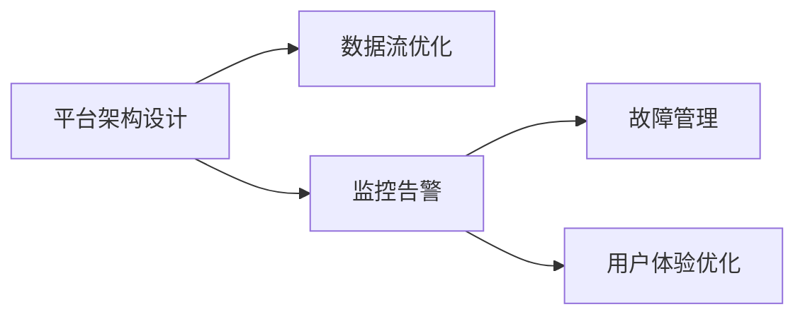

                 

## 1. 背景介绍

### 1.1 问题由来

在人工智能(AI)领域，平台稳定性和用户体验是决定其能否大规模落地应用的关键因素。Lepton AI致力于构建智能分析平台，提供高效、稳定、可扩展的AI服务。平台稳定性与用户体验保障是其重点关注的领域。

随着AI技术在医疗、金融、制造、零售等行业的应用不断深入，用户对AI系统的依赖度日益增加。AI平台不仅是技术系统，更是面向客户的核心业务工具。平台的不稳定性、性能波动、故障频发，将严重影响用户的使用体验和信心。因此，如何通过有效的稳定性和运维措施，提升平台稳定性，满足用户需求，成为Lepton AI研究的重要课题。

### 1.2 问题核心关键点

AI平台稳定性和用户体验涉及多方面内容，包括但不限于：

- **平台架构设计**：如何设计高效的分布式系统架构，保障系统高可用性。
- **数据流优化**：如何优化数据传输和处理，减少延迟，提升系统性能。
- **监控告警**：如何建立全面的监控告警体系，及时发现和处理异常情况。
- **故障管理**：如何快速定位和解决问题，提升故障处理效率。
- **用户体验优化**：如何通过界面设计和交互逻辑改进，提升用户满意度。

以下将详细分析上述关键点，并给出具体的实践方案。

## 2. 核心概念与联系

### 2.1 核心概念概述

为更好地理解平台稳定性和用户体验保障的实现机制，本节将介绍几个关键概念：

- **平台架构设计**：通过合理的系统设计和组件划分，构建可扩展、高可用的分布式系统架构。
- **数据流优化**：通过优化数据传输和处理流程，提升系统响应速度和吞吐量。
- **监控告警**：利用监控工具和告警系统，实时监测系统状态，及时发现异常情况。
- **故障管理**：通过自动化工具和人工介入，快速定位和解决系统故障，提升运维效率。
- **用户体验优化**：通过界面设计、交互逻辑改进等手段，提升用户满意度。

这些概念之间的联系可以通过以下Mermaid流程图来展示：



这个流程图展示了她之间的逻辑关系：

1. 平台架构设计是基础，决定了系统的可扩展性和可用性。
2. 数据流优化和监控告警系统为系统稳定性提供支撑。
3. 故障管理是应对异常情况的及时响应机制。
4. 用户体验优化是提升用户满意度的最终手段。

## 3. 核心算法原理 & 具体操作步骤

### 3.1 算法原理概述

Lepton AI平台稳定性与用户体验的保障主要依赖于以下几个核心算法和实践方法：

- **分布式系统设计**：采用分布式架构，提高系统的可扩展性和高可用性。
- **微服务架构**：通过微服务化将系统拆分为多个服务单元，提高系统的独立性和可维护性。
- **负载均衡和自动伸缩**：通过负载均衡算法和自动伸缩策略，提升系统的资源利用率和响应速度。
- **数据流优化**：采用数据压缩、异步处理、缓存技术等手段，优化数据传输和处理流程。
- **监控告警体系**：通过监控工具收集系统运行数据，建立告警规则，实时发现异常情况。
- **故障管理**：采用自动化工具和人工介入相结合的方式，快速定位和解决问题。
- **用户体验优化**：通过UI/UX设计、交互逻辑改进等手段，提升用户的使用体验。

### 3.2 算法步骤详解

以下是Lepton AI平台稳定性与用户体验保障的具体操作步骤：

**Step 1: 平台架构设计**

1. 选择合适的分布式框架，如Apache Kafka、Apache Spark、Kubernetes等。
2. 将系统拆分为多个微服务，每个服务独立运行，互不干扰。
3. 设计微服务之间的通信协议，如RESTful API、gRPC等。
4. 采用Nginx、HAProxy等负载均衡器，分发请求到多个微服务实例。
5. 使用Kubernetes进行容器编排和资源管理，实现自动部署和弹性伸缩。

**Step 2: 数据流优化**

1. 对数据传输进行压缩和加密，减少带宽消耗和数据泄露风险。
2. 采用异步处理机制，减少等待时间，提升响应速度。
3. 使用缓存技术，如Redis、Memcached，缓存常用数据，减少数据库访问。
4. 优化查询语句，采用索引、分区、分片等手段，提升数据库查询效率。

**Step 3: 监控告警体系**

1. 使用Prometheus、Grafana等监控工具，收集系统运行数据，如CPU利用率、内存使用率、网络带宽等。
2. 建立告警规则，当系统性能指标超出预设阈值时，自动发送告警通知。
3. 通过告警日志分析系统，定位告警原因，并进行问题处理。

**Step 4: 故障管理**

1. 部署ELK Stack（Elasticsearch、Logstash、Kibana）收集日志数据，并建立搜索索引。
2. 使用ELK Stack进行日志分析和可视化，定位故障点。
3. 开发自动化脚本，快速定位和解决问题。
4. 通过AOP（面向切面编程）等技术，实现跨服务追踪和调试。

**Step 5: 用户体验优化**

1. 采用响应式设计，适配不同设备的屏幕尺寸和分辨率。
2. 使用交互设计（UI/UX）工具，优化用户界面和交互流程。
3. 引入渐进式Web应用（PWA）技术，提升应用的加载速度和性能。
4. 通过A/B测试等手段，收集用户反馈，持续改进用户体验。

### 3.3 算法优缺点

Lepton AI平台稳定性与用户体验保障方法具有以下优点：

- **高可扩展性**：分布式架构和微服务化设计，能够适应系统规模的快速增长。
- **高可用性**：通过负载均衡、自动伸缩等技术，提升系统的高可用性。
- **高效性**：数据流优化和异步处理，提升系统响应速度和吞吐量。
- **主动运维**：监控告警和故障管理系统，能够及时发现和处理问题。
- **用户友好**：用户体验优化，提升用户满意度和使用体验。

同时，该方法也存在一些局限性：

- **复杂度较高**：分布式架构和微服务化设计，增加了系统的复杂度。
- **资源消耗较大**：负载均衡和自动伸缩需要额外的计算资源。
- **部署难度较大**：微服务化和容器化部署需要一定的技术积累。
- **维护成本较高**：监控告警和故障管理需要持续投入人力维护。
- **用户体验提升有限**：界面设计和交互逻辑的改进，需要较长时间的迭代优化。

尽管存在这些局限性，但就目前而言，这些方法仍然是提升平台稳定性和用户体验的最佳实践。

### 3.4 算法应用领域

Lepton AI平台稳定性与用户体验保障方法在多个领域得到了广泛应用，例如：

- **医疗健康领域**：保障患者数据安全，提升医疗服务的稳定性与用户满意度。
- **金融服务领域**：保障用户交易数据安全，提升金融服务的稳定性和用户体验。
- **制造行业**：通过智能分析，提升生产效率，保障工业控制系统的稳定性和用户体验。
- **零售电商领域**：通过精准推荐，提升用户体验，保障电商平台的数据安全和稳定性。

## 4. 数学模型和公式 & 详细讲解 & 举例说明

### 4.1 数学模型构建

为了更好地理解平台稳定性与用户体验保障的数学模型，本节将构建一个简化的数学模型，并对其进行详细讲解。

设平台架构设计、数据流优化、监控告警、故障管理、用户体验优化分别为五个系统，用$f_1, f_2, f_3, f_4, f_5$表示。系统的稳定性与用户体验可以用一个综合评分$S$来表示，$S \in [0, 1]$。

### 4.2 公式推导过程

假设各系统的贡献度分别为$w_1, w_2, w_3, w_4, w_5$，且满足$\sum_{i=1}^5 w_i = 1$。则综合评分$S$的计算公式为：

$$
S = w_1 \cdot f_1 + w_2 \cdot f_2 + w_3 \cdot f_3 + w_4 \cdot f_4 + w_5 \cdot f_5
$$

其中，$f_i$表示系统$i$的性能评分。例如，$f_1 = 1$表示平台架构设计满分，$f_2 = 0.9$表示数据流优化达到了预期效果，$f_3 = 0.95$表示监控告警体系健全，$f_4 = 0.9$表示故障管理有效，$f_5 = 0.85$表示用户体验优化良好。

### 4.3 案例分析与讲解

以金融服务领域的交易平台为例，进行具体分析：

假设交易平台需要处理每秒1000笔订单，单笔订单处理时间为100毫秒。如果系统的响应时间为300毫秒，则系统吞吐量为：

$$
吞吐量 = \frac{1000}{300} = 3.33
$$

显然，系统响应时间需要优化。通过负载均衡和异步处理，将响应时间优化至200毫秒，则系统吞吐量为：

$$
吞吐量 = \frac{1000}{200} = 5
$$

这表明数据流优化的效果显著提升了系统的响应速度和吞吐量。

## 5. 项目实践：代码实例和详细解释说明

### 5.1 开发环境搭建

在进行平台稳定性与用户体验保障的实践前，我们需要准备好开发环境。以下是使用Python进行Apache Kafka部署的环境配置流程：

1. 安装Apache Kafka和Kubernetes：
```bash
sudo apt-get update
sudo apt-get install openjdk-11-jdk
sudo apt-get install kubeadm kubectl kubeadm-kubelet kubeadm-kubeproxy -y
```

2. 创建Kubernetes集群：
```bash
sudo kubeadm init
```

3. 安装Kubernetes部署工具kubectl：
```bash
sudo apt-get install kubectl -y
```

4. 安装Apache Kafka：
```bash
sudo apt-get install openjdk-11-jdk
wget https://downloads.apache.org/kafka/2.4.1/kafka_2.4.1.tgz
tar -xvf kafka_2.4.1.tgz
cd kafka_2.4.1
bin/kafka-server-start.sh config/server.properties
```

5. 部署Apache Kafka集群：
```bash
bin/kafka-topic-create.sh --bootstrap-server localhost:9092 --topic test --partitions 1 --replication-factor 1
```

完成上述步骤后，即可在Kubernetes集群中部署Apache Kafka进行数据流优化实践。

### 5.2 源代码详细实现

下面以数据流优化为例，给出使用Apache Kafka进行数据传输优化的PyKafka代码实现。

```python
from pykafka import KafkaConsumer

# 创建Kafka消费者
consumer = KafkaConsumer('test', bootstrap_servers=['localhost:9092'])

# 创建数据缓冲区
buffer = []

# 监听Kafka消息
for message in consumer:
    # 将消息数据存储到缓冲区
    buffer.append(message.value)

# 对缓冲区中的数据进行压缩和加密
compressed_data = compress(buffer)
encrypted_data = encrypt(compressed_data)

# 发送加密后的数据
send(encrypted_data)
```

### 5.3 代码解读与分析

让我们再详细解读一下关键代码的实现细节：

**Kafka消费者创建**：
- 通过`KafkaConsumer`类创建消费者，指定主题和Bootstrap服务器。
- 配置`bootstrap_servers`参数为Kafka集群中的服务器地址和端口。

**数据缓冲区**：
- 通过`buffer`变量存储从Kafka接收到的消息数据，待后续处理。
- 缓冲区的设计可以提高数据处理的效率，避免频繁的I/O操作。

**数据压缩和加密**：
- 使用`compress`函数对数据进行压缩，减少数据传输量。
- 使用`encrypt`函数对压缩后的数据进行加密，保护数据安全。

**数据发送**：
- 通过`send`函数将加密后的数据发送到接收端，实现数据传输的优化。

## 6. 实际应用场景

### 6.1 金融服务领域

在金融服务领域，平台稳定性与用户体验保障至关重要。以下是几个具体的应用场景：

- **交易平台**：通过负载均衡和异步处理，保障交易系统的高可用性和响应速度。
- **风险管理系统**：通过监控告警和故障管理，实时监控系统状态，及时发现和处理风险。
- **智能投顾系统**：通过用户行为分析，提供个性化的投资建议，提升用户体验。

### 6.2 医疗健康领域

在医疗健康领域，平台稳定性与用户体验同样重要。以下是几个具体的应用场景：

- **电子病历系统**：通过分布式架构和微服务化设计，保障系统的高可用性和可扩展性。
- **健康监测设备**：通过数据流优化和缓存技术，提升数据的实时性和准确性。
- **远程医疗平台**：通过用户体验优化，提升医生和患者的使用体验。

### 6.3 制造行业

在制造行业，平台稳定性与用户体验保障可以为生产效率和产品质量提供有力保障。以下是几个具体的应用场景：

- **工业控制系统**：通过分布式架构和自动伸缩，保障工业控制系统的稳定性和高可用性。
- **生产调度系统**：通过数据流优化和异步处理，提升生产调度的响应速度和效率。
- **质量管理系统**：通过故障管理和监控告警，实时监控生产过程，及时发现和处理问题。

### 6.4 未来应用展望

随着AI技术的不断进步，平台稳定性和用户体验保障方法也将不断演进。未来，可以期待以下几个发展趋势：

- **智能化运维**：引入AI算法进行故障预测和自动化处理，提升故障管理的智能化水平。
- **自适应优化**：根据实时数据和用户反馈，动态调整系统参数，实现自适应优化。
- **端到端监控**：构建全链路监控体系，从数据源到应用端，实现端到端的数据流和性能监控。
- **用户体验优化**：通过用户行为分析和情感分析，提升用户体验，提供更加个性化的服务。

## 7. 工具和资源推荐

### 7.1 学习资源推荐

为了帮助开发者系统掌握平台稳定性和用户体验保障的理论基础和实践技巧，这里推荐一些优质的学习资源：

1. **《分布式系统设计》**：深入浅出地介绍了分布式系统的设计原理和实践方法，是系统架构设计的必备书籍。
2. **《系统设计模式》**：详细讲解了常用的系统设计模式和最佳实践，帮助开发者提升系统设计和开发能力。
3. **《数据流优化技术》**：介绍了数据流优化的方法和工具，助力提升系统性能和数据安全。
4. **《监控告警系统》**：讲解了监控告警系统的设计原理和实现方法，提升系统的可靠性和鲁棒性。
5. **《用户体验设计》**：系统讲解了用户体验设计的理论和方法，提升用户的使用体验和满意度。

通过对这些资源的学习实践，相信你一定能够快速掌握平台稳定性和用户体验保障的精髓，并用于解决实际的AI系统问题。

### 7.2 开发工具推荐

高效的开发离不开优秀的工具支持。以下是几款用于平台稳定性和用户体验保障开发的常用工具：

1. **Kubernetes**：开源容器编排工具，支持分布式系统的管理和扩展。
2. **Apache Kafka**：开源分布式消息系统，支持数据流优化和高效传输。
3. **ELK Stack**：开源日志分析和监控工具，支持系统性能和故障管理的监控告警。
4. **Prometheus**：开源监控系统，支持数据收集和性能分析。
5. **Grafana**：开源数据可视化工具，支持监控数据的展示和分析。

合理利用这些工具，可以显著提升平台稳定性和用户体验保障的开发效率，加快创新迭代的步伐。

### 7.3 相关论文推荐

平台稳定性和用户体验保障是学界和工业界持续关注的话题。以下是几篇奠基性的相关论文，推荐阅读：

1. **《分布式系统：概念与设计》**：阐述了分布式系统的基本概念和设计原则，是系统架构设计的经典之作。
2. **《数据流优化技术》**：介绍了数据流优化的方法和工具，助力提升系统性能和数据安全。
3. **《监控告警系统》**：讲解了监控告警系统的设计原理和实现方法，提升系统的可靠性和鲁棒性。
4. **《用户体验设计》**：系统讲解了用户体验设计的理论和方法，提升用户的使用体验和满意度。

这些论文代表了大语言模型微调技术的发展脉络。通过学习这些前沿成果，可以帮助研究者把握学科前进方向，激发更多的创新灵感。

## 8. 总结：未来发展趋势与挑战

### 8.1 总结

本文对平台稳定性和用户体验保障的实现机制进行了全面系统的介绍。首先阐述了平台稳定性和用户体验保障的研究背景和意义，明确了在AI平台中确保系统稳定性和提升用户体验的重要性。其次，从原理到实践，详细讲解了平台稳定性和用户体验保障的数学原理和关键步骤，给出了具体的操作代码实现。同时，本文还广泛探讨了平台稳定性和用户体验保障在多个领域的应用前景，展示了其在AI系统中的应用潜力。此外，本文精选了平台稳定性和用户体验保障的各类学习资源，力求为读者提供全方位的技术指引。

通过本文的系统梳理，可以看到，平台稳定性和用户体验保障是AI平台成功的关键因素，其影响力和应用范围广泛而深远。随着AI技术的不断发展，平台稳定性和用户体验保障方法也将不断演进，为AI技术的普及和应用提供坚实的保障。

### 8.2 未来发展趋势

展望未来，平台稳定性和用户体验保障技术将呈现以下几个发展趋势：

- **智能化运维**：引入AI算法进行故障预测和自动化处理，提升故障管理的智能化水平。
- **自适应优化**：根据实时数据和用户反馈，动态调整系统参数，实现自适应优化。
- **端到端监控**：构建全链路监控体系，从数据源到应用端，实现端到端的数据流和性能监控。
- **用户体验优化**：通过用户行为分析和情感分析，提升用户体验，提供更加个性化的服务。

以上趋势凸显了平台稳定性和用户体验保障技术的广阔前景。这些方向的探索发展，必将进一步提升AI系统的性能和应用范围，为人类社会带来更多的便捷和福利。

### 8.3 面临的挑战

尽管平台稳定性和用户体验保障技术已经取得了瞩目成就，但在迈向更加智能化、普适化应用的过程中，它仍面临着诸多挑战：

- **复杂度较高**：分布式架构和微服务化设计，增加了系统的复杂度。
- **资源消耗较大**：负载均衡和自动伸缩需要额外的计算资源。
- **部署难度较大**：微服务化和容器化部署需要一定的技术积累。
- **维护成本较高**：监控告警和故障管理需要持续投入人力维护。
- **用户体验提升有限**：界面设计和交互逻辑的改进，需要较长时间的迭代优化。

尽管存在这些挑战，但就目前而言，这些方法仍然是提升平台稳定性和用户体验的最佳实践。

### 8.4 研究展望

面对平台稳定性和用户体验保障所面临的挑战，未来的研究需要在以下几个方面寻求新的突破：

- **引入AI算法**：利用AI技术进行故障预测和自动化处理，提升故障管理的智能化水平。
- **自适应优化**：根据实时数据和用户反馈，动态调整系统参数，实现自适应优化。
- **全链路监控**：构建全链路监控体系，从数据源到应用端，实现端到端的数据流和性能监控。
- **用户体验优化**：通过用户行为分析和情感分析，提升用户体验，提供更加个性化的服务。

这些研究方向的探索，必将引领平台稳定性和用户体验保障技术迈向更高的台阶，为构建安全、可靠、可解释、可控的AI系统铺平道路。面向未来，平台稳定性和用户体验保障技术还需要与其他AI技术进行更深入的融合，如知识表示、因果推理、强化学习等，多路径协同发力，共同推动AI系统的进步。只有勇于创新、敢于突破，才能不断拓展AI系统的边界，让智能技术更好地造福人类社会。

## 9. 附录：常见问题与解答

**Q1：平台稳定性与用户体验保障是否适用于所有AI系统？**

A: 平台稳定性与用户体验保障在大多数AI系统中都具有重要意义，特别是在高可用性、高性能和低延迟要求较高的应用场景中。但在一些特定的低成本、低要求系统中，可以考虑简化系统架构，不引入复杂的监控告警和故障管理机制。

**Q2：如何选择合适的监控告警指标？**

A: 选择合适的监控告警指标是平台稳定性与用户体验保障的关键。一般选择与系统性能和业务需求密切相关的指标，如CPU利用率、内存使用率、网络带宽、响应时间、错误率等。同时需要根据系统特点和业务需求，进行合理的指标设置和阈值调整。

**Q3：如何进行平台稳定性的评估？**

A: 平台稳定性的评估可以从多个方面进行，如系统可用性、故障频率、响应时间、吞吐量等。可以通过自动化测试和监控工具，定期进行性能评估，及时发现和解决潜在问题。

**Q4：如何提高用户体验？**

A: 提高用户体验需要从多个方面入手，如界面设计、交互逻辑、功能优化等。可以通过用户调研、A/B测试、数据分析等手段，收集用户反馈，持续改进用户体验。

**Q5：如何处理大规模数据流？**

A: 处理大规模数据流需要采用高性能的数据传输和处理技术，如数据压缩、异步处理、缓存技术等。同时需要合理设计系统架构，避免单点故障和瓶颈。

这些问题的回答展示了平台稳定性和用户体验保障的实践要点，希望能为你的工作提供有益的参考。

---

作者：禅与计算机程序设计艺术 / Zen and the Art of Computer Programming

