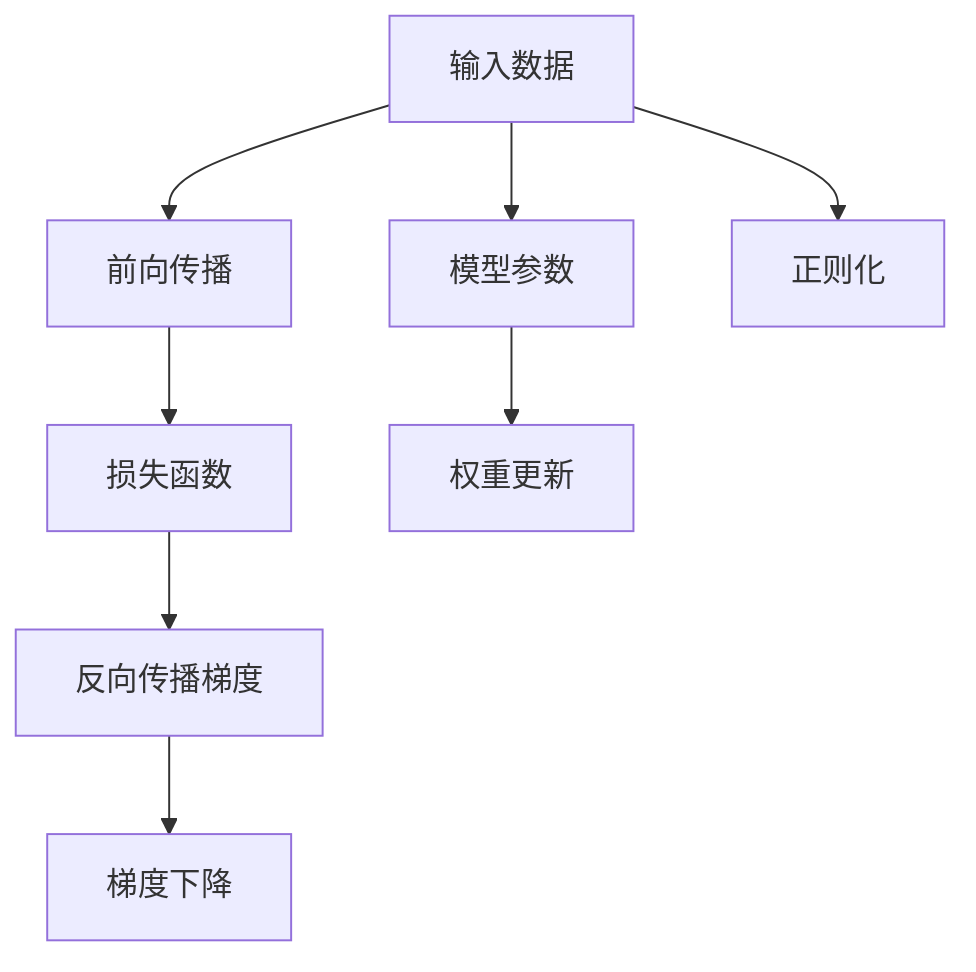

                 

# 第二章：机器学习和反向传播的微妙之处

> 关键词：机器学习,反向传播,梯度下降,深度学习,神经网络,梯度累积,学习率,正则化,优化器

## 1. 背景介绍

机器学习是人工智能的核心技术之一，其通过大量数据训练模型，让模型具备预测、分类、生成等能力。而在机器学习的训练过程中，反向传播(Backpropagation)算法起到了关键作用。它利用链式法则计算损失函数对模型参数的梯度，进而通过梯度下降算法优化模型参数，使得模型能够在数据上表现得更好。本章将深入探讨机器学习和反向传播的微妙之处，帮助你更好地理解和应用这些关键技术。

## 2. 核心概念与联系

### 2.1 核心概念概述

在机器学习和深度学习的框架下，反向传播是一种用于优化神经网络权重的重要算法。它通过反向传播梯度，使用梯度下降算法调整模型参数，以最小化损失函数。

具体来说，反向传播算法主要包括以下几个步骤：

1. **前向传播**：将输入数据通过神经网络，得到输出结果。
2. **计算损失**：计算输出结果与真实标签之间的差异，得到损失函数。
3. **反向传播梯度**：通过链式法则，计算损失函数对每个权重参数的梯度。
4. **梯度下降**：使用梯度下降算法，更新模型参数，以最小化损失函数。

### 2.2 核心概念原理和架构的 Mermaid 流程图



这个流程图展示了机器学习和反向传播的总体架构。输入数据通过模型进行前向传播，计算损失函数，反向传播梯度，并使用梯度下降更新模型参数。同时，还可以在损失函数中加入正则化项，防止过拟合。

## 3. 核心算法原理 & 具体操作步骤

### 3.1 算法原理概述

反向传播算法是深度学习中的核心技术，其主要原理是利用链式法则计算损失函数对模型参数的梯度，进而使用梯度下降算法优化模型参数。具体来说，反向传播算法分为两个部分：前向传播和反向传播。

1. **前向传播**：将输入数据通过神经网络，得到输出结果。
2. **反向传播**：计算损失函数对每个权重参数的梯度。

### 3.2 算法步骤详解

#### 3.2.1 前向传播

前向传播是将输入数据通过神经网络，计算得到输出结果的过程。具体步骤如下：

1. **初始化参数**：随机初始化神经网络的权重和偏置。
2. **前向传播计算**：将输入数据通过神经网络，逐层计算得到每个节点的输出结果。

#### 3.2.2 反向传播

反向传播是计算损失函数对每个权重参数的梯度的过程。具体步骤如下：

1. **计算损失**：计算输出结果与真实标签之间的差异，得到损失函数。
2. **反向传播梯度**：通过链式法则，计算损失函数对每个权重参数的梯度。

#### 3.2.3 梯度下降

梯度下降是使用梯度下降算法，更新模型参数的过程。具体步骤如下：

1. **计算梯度**：计算损失函数对每个权重参数的梯度。
2. **更新参数**：使用梯度下降算法，更新模型参数。

### 3.3 算法优缺点

#### 3.3.1 优点

1. **高效性**：反向传播算法可以高效地计算损失函数对模型参数的梯度，加速模型的优化过程。
2. **泛化性**：反向传播算法可以用于各种神经网络结构，具有很好的泛化性。
3. **可解释性**：反向传播算法的每一步计算都有明确的数学解释，便于理解和调试。

#### 3.3.2 缺点

1. **过拟合风险**：如果神经网络的参数过多，容易出现过拟合现象，导致模型泛化能力下降。
2. **计算复杂度高**：反向传播算法需要计算损失函数对每个权重参数的梯度，计算复杂度较高，特别是在大规模数据集上。
3. **梯度消失和爆炸**：在深度神经网络中，梯度可能会消失或爆炸，导致模型难以收敛。

### 3.4 算法应用领域

反向传播算法在机器学习和深度学习中得到了广泛应用，适用于各种类型的神经网络结构。以下是一些具体的应用领域：

1. **图像识别**：反向传播算法可以用于训练卷积神经网络(CNN)，实现图像识别任务。
2. **自然语言处理**：反向传播算法可以用于训练循环神经网络(RNN)和长短期记忆网络(LSTM)，实现文本分类、机器翻译等任务。
3. **语音识别**：反向传播算法可以用于训练卷积神经网络，实现语音识别任务。
4. **推荐系统**：反向传播算法可以用于训练深度神经网络，实现推荐系统任务。
5. **时间序列预测**：反向传播算法可以用于训练长短期记忆网络，实现时间序列预测任务。

## 4. 数学模型和公式 & 详细讲解

### 4.1 数学模型构建

机器学习中的常见数学模型包括线性回归、逻辑回归、支持向量机(SVM)等。以下以线性回归模型为例，说明反向传播算法的应用。

假设线性回归模型的形式为：

$$
y = \theta^T x + b
$$

其中 $y$ 为输出结果，$x$ 为输入数据，$\theta$ 为模型参数，$b$ 为偏置。

### 4.2 公式推导过程

反向传播算法的核心是计算损失函数对模型参数的梯度。以均方误差损失函数为例，其形式为：

$$
L(y, \hat{y}) = \frac{1}{2} (y - \hat{y})^2
$$

其中 $y$ 为真实标签，$\hat{y}$ 为模型预测结果。

根据链式法则，可以计算损失函数对模型参数的梯度：

$$
\frac{\partial L(y, \hat{y})}{\partial \theta} = \frac{\partial L(y, \hat{y})}{\partial \hat{y}} \frac{\partial \hat{y}}{\partial \theta}
$$

其中，$\frac{\partial L(y, \hat{y})}{\partial \hat{y}}$ 为损失函数对预测结果的梯度，$\frac{\partial \hat{y}}{\partial \theta}$ 为预测结果对模型参数的梯度。

### 4.3 案例分析与讲解

以线性回归为例，进行反向传播算法的具体实现。假设有一个包含 $n$ 个样本的数据集，每个样本包含 $m$ 个特征。定义损失函数为均方误差损失：

$$
L(\theta) = \frac{1}{2n} \sum_{i=1}^n \left( y_i - \hat{y}_i \right)^2
$$

其中，$y_i$ 为第 $i$ 个样本的真实标签，$\hat{y}_i$ 为模型预测结果。

首先，进行前向传播计算：

$$
\hat{y}_i = \theta^T x_i + b
$$

然后，计算损失函数对预测结果的梯度：

$$
\frac{\partial L(\theta)}{\partial \hat{y}} = \frac{1}{n} \sum_{i=1}^n (y_i - \hat{y}_i)
$$

最后，计算损失函数对模型参数的梯度：

$$
\frac{\partial L(\theta)}{\partial \theta} = \frac{\partial L(\theta)}{\partial \hat{y}} \frac{\partial \hat{y}}{\partial \theta} = \frac{\partial L(\theta)}{\partial \hat{y}} x_i^T
$$

使用梯度下降算法更新模型参数：

$$
\theta = \theta - \alpha \frac{\partial L(\theta)}{\partial \theta}
$$

其中，$\alpha$ 为学习率。

## 5. 项目实践：代码实例和详细解释说明

### 5.1 开发环境搭建

在进行机器学习和反向传播的实践时，需要准备好Python开发环境。以下是Python开发环境的搭建步骤：

1. 安装Anaconda：从官网下载并安装Anaconda，用于创建独立的Python环境。
2. 创建并激活虚拟环境：
```bash
conda create -n pytorch-env python=3.8 
conda activate pytorch-env
```
3. 安装必要的工具包：
```bash
pip install numpy pandas scikit-learn torch torchvision torchaudio
```

完成上述步骤后，即可在`pytorch-env`环境中进行机器学习和反向传播的实践。

### 5.2 源代码详细实现

以下是使用PyTorch实现线性回归的代码实现：

```python
import torch
import torch.nn as nn
import torch.optim as optim
import numpy as np

# 定义线性回归模型
class LinearRegression(nn.Module):
    def __init__(self, n_features):
        super(LinearRegression, self).__init__()
        self.linear = nn.Linear(n_features, 1)
    
    def forward(self, x):
        return self.linear(x)
    
# 定义均方误差损失函数
def mse_loss(y_true, y_pred):
    return (y_true - y_pred)**2 / 2

# 生成数据集
x_train = np.random.rand(100, 2)
y_train = np.dot(x_train, np.array([0.5, -0.5])) + np.random.randn(100)
x_train = torch.from_numpy(x_train).float()
y_train = torch.from_numpy(y_train).float()

# 定义模型、优化器和损失函数
model = LinearRegression(2)
optimizer = optim.SGD(model.parameters(), lr=0.01)
criterion = nn.MSELoss()

# 训练模型
for epoch in range(100):
    # 前向传播
    y_pred = model(x_train)
    # 计算损失
    loss = criterion(y_pred, y_train)
    # 反向传播
    optimizer.zero_grad()
    loss.backward()
    optimizer.step()
    # 打印训练结果
    print(f'Epoch {epoch+1}, Loss: {loss.item()}')
```

### 5.3 代码解读与分析

以下是代码中关键部分的解释和分析：

**定义线性回归模型**：

```python
class LinearRegression(nn.Module):
    def __init__(self, n_features):
        super(LinearRegression, self).__init__()
        self.linear = nn.Linear(n_features, 1)
    
    def forward(self, x):
        return self.linear(x)
```

定义了线性回归模型的结构，包含一个线性层。在训练过程中，模型将输入数据通过线性层得到输出结果。

**定义均方误差损失函数**：

```python
def mse_loss(y_true, y_pred):
    return (y_true - y_pred)**2 / 2
```

定义了均方误差损失函数，计算输出结果与真实标签之间的差异。

**生成数据集**：

```python
x_train = np.random.rand(100, 2)
y_train = np.dot(x_train, np.array([0.5, -0.5])) + np.random.randn(100)
x_train = torch.from_numpy(x_train).float()
y_train = torch.from_numpy(y_train).float()
```

生成了一个包含100个样本的数据集，每个样本包含2个特征。使用PyTorch将数据转换为张量。

**定义模型、优化器和损失函数**：

```python
model = LinearRegression(2)
optimizer = optim.SGD(model.parameters(), lr=0.01)
criterion = nn.MSELoss()
```

定义了线性回归模型、随机梯度下降优化器和均方误差损失函数。

**训练模型**：

```python
for epoch in range(100):
    # 前向传播
    y_pred = model(x_train)
    # 计算损失
    loss = criterion(y_pred, y_train)
    # 反向传播
    optimizer.zero_grad()
    loss.backward()
    optimizer.step()
    # 打印训练结果
    print(f'Epoch {epoch+1}, Loss: {loss.item()}')
```

通过循环迭代，进行前向传播、计算损失、反向传播和参数更新，不断优化模型参数。

## 6. 实际应用场景

### 6.1 金融预测

金融预测是机器学习中的一个重要应用场景，反向传播算法可以用于训练神经网络，实现对股票、外汇等金融数据的预测。

具体来说，可以收集金融市场的历史数据，使用反向传播算法训练神经网络模型，预测未来的金融数据走势。例如，可以使用循环神经网络(RNN)或长短期记忆网络(LSTM)，对金融数据进行时间序列预测。

### 6.2 图像识别

图像识别是深度学习中的重要应用场景，反向传播算法可以用于训练卷积神经网络(CNN)，实现图像识别任务。

具体来说，可以收集大量的图像数据，使用反向传播算法训练卷积神经网络模型，对图像进行分类、检测等任务。例如，可以使用卷积神经网络对图像进行分类，对目标进行检测。

### 6.3 自然语言处理

自然语言处理是机器学习中的重要应用场景，反向传播算法可以用于训练循环神经网络(RNN)和长短期记忆网络(LSTM)，实现文本分类、机器翻译等任务。

具体来说，可以收集大量的文本数据，使用反向传播算法训练循环神经网络或长短期记忆网络模型，对文本进行分类、生成等任务。例如，可以使用循环神经网络对文本进行分类，使用长短期记忆网络进行机器翻译。

## 7. 工具和资源推荐

### 7.1 学习资源推荐

为了帮助开发者系统掌握机器学习和反向传播的理论基础和实践技巧，这里推荐一些优质的学习资源：

1. 《深度学习》书籍：Ian Goodfellow等著，全面介绍了深度学习的基本概念和核心算法。
2. CS231n《卷积神经网络》课程：斯坦福大学开设的计算机视觉课程，涵盖了卷积神经网络的基础知识和实现方法。
3. CS224n《自然语言处理》课程：斯坦福大学开设的自然语言处理课程，涵盖了自然语言处理的基本概念和核心算法。
4. 《Python机器学习》书籍：Sebastian Raschka等著，介绍了机器学习的基本概念和Python实现。
5. 《TensorFlow实战Google深度学习框架》书籍：Sudheendra V. Chintala等著，介绍了TensorFlow的基本概念和实现方法。

通过对这些资源的学习实践，相信你一定能够快速掌握机器学习和反向传播的精髓，并用于解决实际的NLP问题。

### 7.2 开发工具推荐

高效的开发离不开优秀的工具支持。以下是几款用于机器学习和反向传播开发的常用工具：

1. PyTorch：基于Python的开源深度学习框架，灵活动态的计算图，适合快速迭代研究。大部分深度学习模型都有PyTorch版本的实现。
2. TensorFlow：由Google主导开发的开源深度学习框架，生产部署方便，适合大规模工程应用。同样有丰富的深度学习模型资源。
3. Keras：高层API，简化了深度学习模型的搭建和训练过程，适合初学者使用。
4. Weights & Biases：模型训练的实验跟踪工具，可以记录和可视化模型训练过程中的各项指标，方便对比和调优。与主流深度学习框架无缝集成。
5. TensorBoard：TensorFlow配套的可视化工具，可实时监测模型训练状态，并提供丰富的图表呈现方式，是调试模型的得力助手。

合理利用这些工具，可以显著提升机器学习和反向传播任务的开发效率，加快创新迭代的步伐。

### 7.3 相关论文推荐

机器学习和反向传播技术的发展源于学界的持续研究。以下是几篇奠基性的相关论文，推荐阅读：

1. Multilayer Perceptrons: An Introduction to Backpropagation Networks and the BPprop Implementation by David E. Rumelhart等。
2. Backpropagation through time and application to continuous time recurrent neural networks by Sebastian B. Seung。
3. ImageNet Classification with Deep Convolutional Neural Networks by Alex Krizhevsky等。
4. Convolutional Neural Networks for Sentence Classification by Quoc V. Le等。
5. Sequence to Sequence Learning with Neural Networks by Ilya Sutskever等。

这些论文代表了大模型微调技术的发展脉络。通过学习这些前沿成果，可以帮助研究者把握学科前进方向，激发更多的创新灵感。

## 8. 总结：未来发展趋势与挑战

### 8.1 总结

本文对机器学习和反向传播的微妙之处进行了全面系统的介绍。首先阐述了机器学习的基本概念和反向传播算法的原理，明确了机器学习和反向传播在深度学习中的重要作用。其次，从原理到实践，详细讲解了机器学习和反向传播的数学模型和实现步骤，给出了机器学习和反向传播任务开发的完整代码实例。同时，本文还广泛探讨了机器学习和反向传播方法在金融预测、图像识别、自然语言处理等多个行业领域的应用前景，展示了机器学习和反向传播范式的巨大潜力。此外，本文精选了机器学习和反向传播技术的各类学习资源，力求为读者提供全方位的技术指引。

通过本文的系统梳理，可以看到，机器学习和反向传播技术正在成为深度学习领域的重要基础，极大地推动了深度学习模型的应用和发展。未来，伴随深度学习模型的不断进步，机器学习和反向传播技术也将不断演进，为深度学习模型在更广泛的应用领域大放异彩提供有力支持。

### 8.2 未来发展趋势

展望未来，机器学习和反向传播技术将呈现以下几个发展趋势：

1. 模型规模持续增大。随着算力成本的下降和数据规模的扩张，深度学习模型的参数量还将持续增长。超大规模模型蕴含的丰富语言知识，有望支撑更加复杂多变的下游任务微调。
2. 模型结构多样化。未来的深度学习模型将更加多样化和灵活，能够适应各种复杂的应用场景。
3. 训练方法多样化。未来的训练方法将更加多样化和高效，能够更好地处理大规模数据和高维数据。
4. 模型压缩与优化。未来的深度学习模型将更加高效和轻量级，能够更好地适应移动设备和其他资源受限的场景。

以上趋势凸显了机器学习和反向传播技术的广阔前景。这些方向的探索发展，必将进一步提升深度学习模型的性能和应用范围，为构建人机协同的智能系统铺平道路。

### 8.3 面临的挑战

尽管机器学习和反向传播技术已经取得了瞩目成就，但在迈向更加智能化、普适化应用的过程中，它仍面临着诸多挑战：

1. 计算资源瓶颈。深度学习模型的计算复杂度较高，需要高性能计算设备支持，难以在低算力设备上运行。
2. 数据标注成本。大规模数据标注成本高，难以获取高质量的标注数据。
3. 模型泛化能力不足。深度学习模型容易出现过拟合现象，导致模型泛化能力下降。
4. 模型解释性不足。深度学习模型的决策过程缺乏可解释性，难以对其推理逻辑进行分析和调试。
5. 安全性问题。深度学习模型容易受到攻击，可能被恶意利用。

这些挑战需要未来的研究者积极应对并寻求突破，才能使机器学习和反向传播技术更好地服务于人类社会。

### 8.4 研究展望

面向未来，机器学习和反向传播技术需要在以下几个方面寻求新的突破：

1. 探索无监督和半监督学习方法。摆脱对大规模标注数据的依赖，利用自监督学习、主动学习等无监督和半监督范式，最大限度利用非结构化数据，实现更加灵活高效的机器学习。
2. 研究参数高效和计算高效的训练方法。开发更加参数高效的训练方法，在固定大部分模型参数的同时，只更新极少量的任务相关参数。同时优化训练过程，减少计算资源消耗。
3. 融合因果和对比学习范式。通过引入因果推断和对比学习思想，增强机器学习模型的建立稳定因果关系的能力，学习更加普适、鲁棒的语言表征。
4. 结合符号化的先验知识。将符号化的先验知识，如知识图谱、逻辑规则等，与深度学习模型进行巧妙融合，引导机器学习过程学习更准确、合理的语言模型。
5. 纳入伦理道德约束。在模型训练目标中引入伦理导向的评估指标，过滤和惩罚有偏见、有害的输出倾向。同时加强人工干预和审核，建立模型行为的监管机制，确保输出符合人类价值观和伦理道德。

这些研究方向的探索，必将引领机器学习和反向传播技术迈向更高的台阶，为构建安全、可靠、可解释、可控的智能系统铺平道路。面向未来，机器学习和反向传播技术还需要与其他人工智能技术进行更深入的融合，如知识表示、因果推理、强化学习等，多路径协同发力，共同推动自然语言理解和智能交互系统的进步。只有勇于创新、敢于突破，才能不断拓展语言模型的边界，让智能技术更好地造福人类社会。

## 9. 附录：常见问题与解答

**Q1：机器学习和反向传播是否适用于所有深度学习任务？**

A: 机器学习和反向传播适用于大多数深度学习任务，特别是那些具有明确输入输出关系和可解释性强的任务。例如，图像识别、文本分类、语音识别等任务都可以通过机器学习和反向传播进行训练。但对于一些复杂的任务，如生成式任务，反向传播的训练过程可能会比较困难。

**Q2：机器学习和反向传播有哪些优点和缺点？**

A: 机器学习和反向传播的优点包括：
1. 高效性：反向传播算法可以高效地计算损失函数对模型参数的梯度，加速模型的优化过程。
2. 泛化性：反向传播算法可以用于各种深度学习任务，具有很好的泛化性。
3. 可解释性：反向传播算法的每一步计算都有明确的数学解释，便于理解和调试。

机器学习和反向传播的缺点包括：
1. 过拟合风险：如果深度学习模型参数过多，容易出现过拟合现象，导致模型泛化能力下降。
2. 计算复杂度高：反向传播算法需要计算损失函数对每个权重参数的梯度，计算复杂度较高，特别是在大规模数据集上。
3. 梯度消失和爆炸：在深度神经网络中，梯度可能会消失或爆炸，导致模型难以收敛。

**Q3：机器学习和反向传播在实际应用中需要注意哪些问题？**

A: 在实际应用中，需要注意以下几个问题：
1. 数据标注成本：大规模数据标注成本高，难以获取高质量的标注数据。
2. 计算资源瓶颈：深度学习模型的计算复杂度较高，需要高性能计算设备支持。
3. 模型泛化能力不足：深度学习模型容易出现过拟合现象，导致模型泛化能力下降。
4. 模型解释性不足：深度学习模型的决策过程缺乏可解释性，难以对其推理逻辑进行分析和调试。

合理解决这些问题，可以使机器学习和反向传播技术更好地服务于实际应用。

**Q4：如何提高机器学习和反向传播的效率？**

A: 提高机器学习和反向传播的效率可以从以下几个方面入手：
1. 使用更高效的算法和数据结构，如GPU加速、混合精度训练、模型并行等。
2. 优化模型结构，如剪枝、量化、参数共享等，减小模型规模，加快推理速度。
3. 使用更高效的优化器，如Adam、Adafactor等，加快模型收敛速度。
4. 使用更高效的损失函数，如交叉熵损失、平方损失等，减小损失函数计算复杂度。

通过这些优化方法，可以显著提高机器学习和反向传播的效率，使模型更快地收敛和部署。

**Q5：机器学习和反向传播在未来的发展方向是什么？**

A: 机器学习和反向传播未来的发展方向包括：
1. 探索无监督和半监督学习方法，最大限度利用非结构化数据，实现更加灵活高效的机器学习。
2. 研究参数高效和计算高效的训练方法，在固定大部分模型参数的同时，只更新极少量的任务相关参数。同时优化训练过程，减少计算资源消耗。
3. 融合因果和对比学习范式，增强机器学习模型的建立稳定因果关系的能力，学习更加普适、鲁棒的语言表征。
4. 结合符号化的先验知识，将符号化的先验知识，如知识图谱、逻辑规则等，与深度学习模型进行巧妙融合，引导机器学习过程学习更准确、合理的语言模型。
5. 纳入伦理道德约束，在模型训练目标中引入伦理导向的评估指标，过滤和惩罚有偏见、有害的输出倾向。同时加强人工干预和审核，建立模型行为的监管机制，确保输出符合人类价值观和伦理道德。

这些研究方向的探索，必将引领机器学习和反向传播技术迈向更高的台阶，为构建安全、可靠、可解释、可控的智能系统铺平道路。

---

作者：禅与计算机程序设计艺术 / Zen and the Art of Computer Programming

