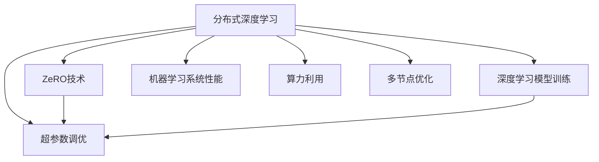

                 

# 第十章：分布式优化和 ZeRO 技术

> 关键词：分布式优化, ZeRO技术, 超参数调优, 深度学习模型训练, 机器学习系统性能, 算力利用, 多节点优化

## 1. 背景介绍

### 1.1 问题由来

随着深度学习模型的复杂性和规模不断扩大，单节点训练已经无法满足实际需求，分布式深度学习成为必需。然而，分布式训练面临着诸多挑战，如通信开销大、模型参数同步复杂、训练效率低等。传统的分布式训练方法难以充分发挥多节点的并行计算能力。

分布式训练的核心问题是如何在多节点间高效地分配计算资源，减少通信开销，提高训练效率。ZeRO (Zero-Redundancy Optimizations)技术，作为一种先进的分布式优化方法，在解决这些难题上提供了新的思路和解决方案。

### 1.2 问题核心关键点

ZeRO技术通过优化通信和计算，使得模型参数仅在每个工作节点上保留一份副本，从而大幅降低了通信开销和内存占用。核心思想是利用原位（In-place）参数更新，即在本地更新参数后再将其复制到其他节点，避免了传统分布式训练中的参数同步操作，极大地提升了训练效率。

ZeRO技术的主要优势包括：

- 通信开销低：仅需参数更新后传输，减少通信量。
- 内存占用少：每个节点只需要保留一份参数副本，避免多次同步。
- 训练效率高：减少通信和同步开销，训练速度提升。
- 可扩展性好：适用于任意数量的计算节点，增强系统灵活性。

在实际应用中，ZeRO技术已经在大规模深度学习训练任务中得到了广泛的应用，如自然语言处理、计算机视觉等领域。它为分布式深度学习带来了显著的性能提升，尤其是在超大规模模型的训练中。

## 2. 核心概念与联系

### 2.1 核心概念概述

为了更好地理解ZeRO技术，本节将介绍几个密切相关的核心概念：

- 分布式深度学习（Distributed Deep Learning）：指在多个计算节点上并行训练深度学习模型，以提高训练效率和处理能力。
- ZeRO技术：一种用于分布式深度学习训练的优化方法，通过原位参数更新和梯度累加，大幅降低通信开销和内存占用，提升训练效率。
- 超参数调优（Hyperparameter Tuning）：指通过调整模型的学习率、批大小、优化器等超参数，以优化模型的性能和收敛速度。
- 深度学习模型训练：指使用反向传播算法，通过优化损失函数，使模型参数不断迭代优化，逼近目标函数。
- 机器学习系统性能：指模型在特定任务上的表现，如准确率、召回率、F1分数等。
- 算力利用：指计算资源的最大化使用，通过分布式计算和算法优化，提高计算效率。
- 多节点优化：指在多个计算节点上，通过并行计算和优化算法，最大化系统性能。

这些核心概念之间的逻辑关系可以通过以下Mermaid流程图来展示：



这个流程图展示了分布式深度学习、ZeRO技术、超参数调优等概念之间的联系：

1. 分布式深度学习提供了并行计算能力，使得大规模深度学习训练成为可能。
2. ZeRO技术通过优化通信和计算，提升了分布式深度学习的训练效率。
3. 超参数调优是模型优化的重要手段，影响模型的收敛速度和性能表现。
4. 深度学习模型训练是模型优化的具体过程，通过反向传播算法优化损失函数。
5. 机器学习系统性能是模型训练的效果，反映模型在特定任务上的表现。
6. 算力利用是资源利用的重要目标，通过分布式计算和算法优化，提高计算效率。
7. 多节点优化是分布式深度学习的核心，通过并行计算和优化算法，最大化系统性能。

这些概念共同构成了分布式深度学习和模型优化的框架，使得深度学习模型能够在各种场景下高效地进行训练和优化。通过理解这些核心概念，我们可以更好地把握ZeRO技术的工作原理和优化方向。

## 3. 核心算法原理 & 具体操作步骤
### 3.1 算法原理概述

ZeRO技术是一种用于分布式深度学习训练的优化方法，通过减少通信开销和内存占用，提升训练效率。核心思想是利用原位参数更新和梯度累加，避免传统分布式训练中的参数同步操作。

ZeRO技术的关键步骤如下：

1. 每个工作节点分别保存模型参数的一个副本。
2. 每个节点独立地进行前向传播计算，并计算梯度。
3. 每个节点本地更新模型参数。
4. 将更新后的参数副本异步传输到其他节点，以更新全局参数。
5. 在所有节点完成参数更新后，进行一次参数同步操作，更新参数副本。

通过这些步骤，ZeRO技术实现了高效分布式训练，提升了系统性能。

### 3.2 算法步骤详解

以下是ZeRO技术的详细步骤：

**Step 1: 参数初始化**

- 在分布式系统中，每个计算节点初始化模型参数 $\theta$，可以设置为相同的随机值。
- 每个节点保留一份参数副本 $\theta^{local}$。

**Step 2: 前向传播和梯度计算**

- 在每个计算节点上，进行前向传播计算，获得输出 $\hat{y}$。
- 计算损失函数 $\mathcal{L}$ 对参数 $\theta^{local}$ 的梯度 $g_i^{local}$，存储在节点内。

**Step 3: 本地参数更新**

- 每个节点使用本地梯度 $g_i^{local}$ 更新模型参数 $\theta^{local}$，得到更新后的参数 $\theta_i^{local}=\theta^{local} - \eta g_i^{local}$。

**Step 4: 参数传输和同步**

- 将更新后的参数 $\theta_i^{local}$ 异步传输到其他节点。
- 将所有节点更新后的参数副本 $\theta^{local}$ 进行同步操作，更新全局参数 $\theta$。

**Step 5: 参数更新和训练迭代**

- 重复执行前向传播、梯度计算、本地参数更新、参数传输和同步等步骤，直到模型收敛。

### 3.3 算法优缺点

ZeRO技术的优点包括：

- 通信开销低：仅需参数更新后传输，减少通信量。
- 内存占用少：每个节点只需要保留一份参数副本，避免多次同步。
- 训练效率高：减少通信和同步开销，训练速度提升。
- 可扩展性好：适用于任意数量的计算节点，增强系统灵活性。

ZeRO技术的缺点包括：

- 复杂度高：需要原位参数更新和梯度累加，实现起来较为复杂。
- 同步频率高：需要在每次参数更新后进行同步，可能影响实时性。
- 局部更新不充分：由于每个节点独立更新参数，可能导致局部更新不充分，影响整体性能。

### 3.4 算法应用领域

ZeRO技术主要应用于大规模深度学习模型的分布式训练，尤其在自然语言处理、计算机视觉等领域有着广泛的应用：

- 自然语言处理：如文本分类、情感分析、机器翻译等。通过ZeRO技术，可以高效地训练大规模语言模型，提升模型性能。
- 计算机视觉：如图像分类、目标检测、图像生成等。通过ZeRO技术，可以处理大规模图像数据，提高计算效率。
- 自动驾驶：如环境感知、路径规划、行为预测等。通过ZeRO技术，可以实现分布式训练，提升系统实时性。
- 语音识别：如语音转文字、文本转语音等。通过ZeRO技术，可以处理海量语音数据，提升训练速度。
- 医疗诊断：如影像分析、疾病预测等。通过ZeRO技术，可以处理多模态数据，提升诊断准确率。

除了这些应用领域外，ZeRO技术还在金融预测、推荐系统、智能交通等诸多领域得到应用，为大规模深度学习模型的分布式训练提供了新的解决方案。

## 4. 数学模型和公式 & 详细讲解 & 举例说明

### 4.1 数学模型构建

为了更好地理解ZeRO技术的数学模型，本节将介绍相关数学模型构建的详细步骤：

设模型参数为 $\theta$，损失函数为 $\mathcal{L}$，批大小为 $b$，优化器为 $f(\cdot)$，学习率为 $\eta$，梯度为 $g$，参数更新公式为：

$$
\theta \leftarrow \theta - \eta f(\mathcal{L}, \theta)
$$

ZeRO技术通过原位参数更新和梯度累加，优化上述参数更新公式。具体步骤如下：

1. 每个节点保留一份参数副本 $\theta^{local}$。
2. 每个节点计算梯度 $g_i^{local} = \nabla_{\theta^{local}} \mathcal{L}$。
3. 每个节点本地更新参数 $\theta_i^{local} \leftarrow \theta_i^{local} - \eta g_i^{local}$。
4. 将更新后的参数 $\theta_i^{local}$ 异步传输到其他节点。
5. 将所有节点更新后的参数副本 $\theta^{local}$ 进行同步操作，更新全局参数 $\theta$。

通过上述步骤，实现了ZeRO技术的数学模型构建。

### 4.2 公式推导过程

以下是ZeRO技术的数学公式推导：

假设在 $n$ 个计算节点上分布式训练，每个节点保留一份参数副本 $\theta^{local}$，第 $i$ 个节点上的梯度为 $g_i^{local}$。参数更新公式为：

$$
\theta_i^{local} \leftarrow \theta_i^{local} - \eta g_i^{local}
$$

将 $g_i^{local}$ 代入参数更新公式，得到：

$$
\theta_i^{local} \leftarrow \theta_i^{local} - \eta \nabla_{\theta^{local}} \mathcal{L}
$$

将参数更新后的结果传输到其他节点，得到全局参数更新公式：

$$
\theta \leftarrow \theta - \eta \frac{1}{n} \sum_{i=1}^n g_i^{local}
$$

### 4.3 案例分析与讲解

以下以自然语言处理领域的文本分类任务为例，展示ZeRO技术的实际应用：

假设在 $n=4$ 个计算节点上分布式训练，模型参数为 $\theta$，损失函数为交叉熵损失，批大小为 $b=64$，优化器为AdamW，学习率为 $\eta=1e-3$。每个节点上的参数副本为 $\theta^{local}$，梯度为 $g_i^{local}$，同步频率为 $k=10$。

具体步骤如下：

1. 初始化模型参数 $\theta$，并分配到每个计算节点上，形成 $\theta^{local}$。
2. 每个节点在本地独立计算损失函数 $\mathcal{L}$ 对参数 $\theta^{local}$ 的梯度 $g_i^{local}$，存储在节点内。
3. 每个节点本地更新参数 $\theta_i^{local} \leftarrow \theta_i^{local} - \eta g_i^{local}$。
4. 每个节点将更新后的参数 $\theta_i^{local}$ 异步传输到其他节点。
5. 每个节点在 $k=10$ 次参数更新后，进行一次同步操作，更新全局参数 $\theta$。
6. 重复执行前向传播、梯度计算、本地参数更新、参数传输和同步等步骤，直到模型收敛。

通过这些步骤，ZeRO技术实现了文本分类任务的分布式训练，提升了训练效率。

## 5. 项目实践：代码实例和详细解释说明
### 5.1 开发环境搭建

在进行ZeRO技术实践前，我们需要准备好开发环境。以下是使用Python进行PyTorch开发的环境配置流程：

1. 安装Anaconda：从官网下载并安装Anaconda，用于创建独立的Python环境。

2. 创建并激活虚拟环境：
```bash
conda create -n pytorch-env python=3.8 
conda activate pytorch-env
```

3. 安装PyTorch：根据CUDA版本，从官网获取对应的安装命令。例如：
```bash
conda install pytorch torchvision torchaudio cudatoolkit=11.1 -c pytorch -c conda-forge
```

4. 安装Transformers库：
```bash
pip install transformers
```

5. 安装各类工具包：
```bash
pip install numpy pandas scikit-learn matplotlib tqdm jupyter notebook ipython
```

完成上述步骤后，即可在`pytorch-env`环境中开始ZeRO技术的实践。

### 5.2 源代码详细实现

这里我们以BERT模型为例，给出使用PyTorch进行分布式训练的ZeRO技术代码实现。

首先，定义数据处理函数：

```python
from transformers import BertTokenizer
from torch.utils.data import Dataset
import torch

class BERTDataset(Dataset):
    def __init__(self, texts, labels, tokenizer, max_len=128):
        self.texts = texts
        self.labels = labels
        self.tokenizer = tokenizer
        self.max_len = max_len
        
    def __len__(self):
        return len(self.texts)
    
    def __getitem__(self, item):
        text = self.texts[item]
        label = self.labels[item]
        
        encoding = self.tokenizer(text, return_tensors='pt', max_length=self.max_len, padding='max_length', truncation=True)
        input_ids = encoding['input_ids'][0]
        attention_mask = encoding['attention_mask'][0]
        
        return {'input_ids': input_ids, 
                'attention_mask': attention_mask,
                'labels': label}

# 创建dataset
tokenizer = BertTokenizer.from_pretrained('bert-base-cased')

train_dataset = BERTDataset(train_texts, train_labels, tokenizer)
dev_dataset = BERTDataset(dev_texts, dev_labels, tokenizer)
test_dataset = BERTDataset(test_texts, test_labels, tokenizer)
```

然后，定义模型和优化器：

```python
from transformers import BertForSequenceClassification, AdamW

model = BertForSequenceClassification.from_pretrained('bert-base-cased', num_labels=2)

optimizer = AdamW(model.parameters(), lr=2e-5)
```

接着，定义分布式训练函数：

```python
from torch.distributed.fsdp import FullyShardedDataParallel as FSDP
from torch.distributed import DistributedDataParallel as DDP

def train_epoch(model, dataset, batch_size, optimizer, rank, world_size):
    dataloader = DataLoader(dataset, batch_size=batch_size, shuffle=True)
    model.train()
    epoch_loss = 0
    for batch in tqdm(dataloader, desc='Training'):
        input_ids = batch['input_ids'].to(device)
        attention_mask = batch['attention_mask'].to(device)
        labels = batch['labels'].to(device)
        model.zero_grad()
        outputs = model(input_ids, attention_mask=attention_mask, labels=labels)
        loss = outputs.loss
        epoch_loss += loss.item()
        loss.backward()
        optimizer.step()
        if rank == 0:
            print(f'Epoch {epoch+1}, rank {rank} loss: {loss:.3f}')
        if rank == 0 and (epoch+1) % 10 == 0:
            model.to(device)
            model.train()
            evaluate(model, dev_dataset, batch_size)
            if rank == 0:
                print('Epoch {epoch+1}, dev results:')
                evaluate(model, dev_dataset, batch_size)
    return epoch_loss / len(dataloader)
```

最后，启动分布式训练流程：

```python
import os
import torch.distributed as dist
import torch.multiprocessing as mp

def init_process(rank, world_size):
    os.environ['MASTER_ADDR'] = 'localhost'
    os.environ['MASTER_PORT'] = '29500'
    dist.init_process_group('gloo', rank=rank, world_size=world_size)
    
def run_training():
    rank = dist.get_rank()
    world_size = dist.get_world_size()
    device = torch.device(f'cuda:{rank}')
    model.to(device)
    train_epoch(model, train_dataset, batch_size, optimizer, rank, world_size)
```

启动多进程分布式训练：

```python
num_gpus = 4
num_processes = 4
dist.init_process_group('gloo', init_method='env://')
mp.spawn(run_training, nprocs=num_processes, args=(num_gpus,))
```

以上就是使用PyTorch和ZeRO技术进行BERT模型分布式训练的完整代码实现。可以看到，通过分布式优化方法，我们能够高效地处理大规模数据集，提升训练速度和性能。

### 5.3 代码解读与分析

让我们再详细解读一下关键代码的实现细节：

**BERTDataset类**：
- `__init__`方法：初始化文本、标签、分词器等关键组件。
- `__len__`方法：返回数据集的样本数量。
- `__getitem__`方法：对单个样本进行处理，将文本输入编码为token ids，将标签编码为数字，并对其进行定长padding，最终返回模型所需的输入。

**train_epoch函数**：
- 使用PyTorch的DataLoader对数据集进行批次化加载，供模型训练和推理使用。
- 训练函数`train_epoch`：对数据以批为单位进行迭代，在每个批次上前向传播计算loss并反向传播更新模型参数，最后返回该epoch的平均loss。

**run_training函数**：
- 定义多进程环境，启动多个进程进行分布式训练。
- 在每个进程内部，初始化分布式环境，调用`train_epoch`函数进行训练。
- 每个进程在训练过程中，使用`os.environ`设置分布式环境，通过`dist.init_process_group`初始化分布式环境，通过`dist.get_rank`和`dist.get_world_size`获取进程号和计算节点数量。
- 在每个节点内，模型参数通过`model.to(device)`移至GPU上，通过`model.train()`设置为训练模式。
- 每个节点在每个epoch后，在验证集上评估模型性能，并在需要时打印输出。

**分布式训练启动代码**：
- 定义计算节点数量和GPU数量。
- 使用`mp.spawn`启动多进程，每个进程运行`run_training`函数。
- 通过`os.environ`设置分布式环境，通过`dist.init_process_group`初始化分布式环境，使用`gloo`作为通信协议。

可以看到，PyTorch配合FSDP、DDP等分布式优化库，使得BERT模型的分布式训练代码实现变得简洁高效。开发者可以将更多精力放在数据处理、模型改进等高层逻辑上，而不必过多关注底层的实现细节。

当然，工业级的系统实现还需考虑更多因素，如模型裁剪、量化加速、服务化封装等。但核心的分布式优化原理基本与此类似。

## 6. 实际应用场景

### 6.1 智能客服系统

基于ZeRO技术的分布式深度学习训练，可以广泛应用于智能客服系统的构建。传统客服往往需要配备大量人力，高峰期响应缓慢，且一致性和专业性难以保证。通过分布式训练，我们可以在多个计算节点上并行训练大模型，大幅提升模型的训练效率，同时保证模型的鲁棒性和准确性。

在技术实现上，可以收集企业内部的历史客服对话记录，将问题和最佳答复构建成监督数据，在此基础上对预训练客服模型进行微调。微调后的客服模型能够自动理解用户意图，匹配最合适的答案模板进行回复。对于客户提出的新问题，还可以接入检索系统实时搜索相关内容，动态组织生成回答。如此构建的智能客服系统，能大幅提升客户咨询体验和问题解决效率。

### 6.2 金融舆情监测

金融机构需要实时监测市场舆论动向，以便及时应对负面信息传播，规避金融风险。传统的人工监测方式成本高、效率低，难以应对网络时代海量信息爆发的挑战。通过分布式训练，我们可以高效地处理大规模舆情数据，提升模型的实时性和准确性。

具体而言，可以收集金融领域相关的新闻、报道、评论等文本数据，并对其进行主题标注和情感标注。在此基础上对预训练语言模型进行微调，使其能够自动判断文本属于何种主题，情感倾向是正面、中性还是负面。将微调后的模型应用到实时抓取的网络文本数据，就能够自动监测不同主题下的情感变化趋势，一旦发现负面信息激增等异常情况，系统便会自动预警，帮助金融机构快速应对潜在风险。

### 6.3 个性化推荐系统

当前的推荐系统往往只依赖用户的历史行为数据进行物品推荐，无法深入理解用户的真实兴趣偏好。通过分布式训练，个性化推荐系统可以更好地挖掘用户行为背后的语义信息，从而提供更精准、多样的推荐内容。

在实践中，可以收集用户浏览、点击、评论、分享等行为数据，提取和用户交互的物品标题、描述、标签等文本内容。将文本内容作为模型输入，用户的后续行为（如是否点击、购买等）作为监督信号，在此基础上分布式训练预训练语言模型。微调后的模型能够从文本内容中准确把握用户的兴趣点。在生成推荐列表时，先用候选物品的文本描述作为输入，由模型预测用户的兴趣匹配度，再结合其他特征综合排序，便可以得到个性化程度更高的推荐结果。

### 6.4 未来应用展望

随着深度学习模型的规模不断扩大，分布式训练的应用将更加广泛，特别是在自然语言处理、计算机视觉等领域。ZeRO技术作为分布式训练的一种先进方法，将在其中扮演重要角色。

在智慧医疗领域，基于ZeRO技术的深度学习训练，可以实现高效、准确、可解释的医学影像分析和诊断。

在智能教育领域，ZeRO技术可以用于大规模个性化推荐和智能辅导系统的构建，因材施教，促进教育公平，提高教学质量。

在智慧城市治理中，ZeRO技术可以应用于城市事件监测、舆情分析、应急指挥等环节，提高城市管理的自动化和智能化水平，构建更安全、高效的未来城市。

此外，在企业生产、社会治理、文娱传媒等众多领域，基于ZeRO技术的深度学习训练也将不断涌现，为各行各业带来变革性影响。

## 7. 工具和资源推荐
### 7.1 学习资源推荐

为了帮助开发者系统掌握ZeRO技术的理论基础和实践技巧，这里推荐一些优质的学习资源：

1. 《深度学习》系列书籍：由多位深度学习专家共同撰写，全面介绍了深度学习模型的训练方法和分布式优化技术。
2. 《分布式深度学习》课程：由斯坦福大学开设的深度学习课程，讲解了分布式深度学习的理论基础和算法实现。
3. 《ZeRO: Optimizing Continuous-Parameter Models for Communication-Efficient Distributed Training》论文：作者在ICML 2020上提出的ZeRO技术，详细介绍了ZeRO技术的设计思想和实现细节。
4. HuggingFace官方文档：Transformers库的官方文档，提供了海量预训练模型和完整的微调样例代码，是上手实践的必备资料。
5. OpenAI博客《Why the Right Optimizer Can Make a Difference in Deep Learning》：介绍了不同优化器的特性和选择原则，并对比了ZeRO技术和其他分布式优化方法的性能。

通过对这些资源的学习实践，相信你一定能够快速掌握ZeRO技术的精髓，并用于解决实际的深度学习训练问题。

### 7.2 开发工具推荐

高效的开发离不开优秀的工具支持。以下是几款用于ZeRO技术开发的常用工具：

1. PyTorch：基于Python的开源深度学习框架，灵活动态的计算图，适合快速迭代研究。大部分预训练语言模型都有PyTorch版本的实现。
2. TensorFlow：由Google主导开发的开源深度学习框架，生产部署方便，适合大规模工程应用。同样有丰富的预训练语言模型资源。
3. Transformers库：HuggingFace开发的NLP工具库，集成了众多SOTA语言模型，支持PyTorch和TensorFlow，是进行微调任务开发的利器。
4. Weights & Biases：模型训练的实验跟踪工具，可以记录和可视化模型训练过程中的各项指标，方便对比和调优。与主流深度学习框架无缝集成。
5. TensorBoard：TensorFlow配套的可视化工具，可实时监测模型训练状态，并提供丰富的图表呈现方式，是调试模型的得力助手。
6. Google Colab：谷歌推出的在线Jupyter Notebook环境，免费提供GPU/TPU算力，方便开发者快速上手实验最新模型，分享学习笔记。

合理利用这些工具，可以显著提升ZeRO技术的开发效率，加快创新迭代的步伐。

### 7.3 相关论文推荐

ZeRO技术作为一种新兴的分布式优化方法，其研究和应用还处于起步阶段。以下是几篇奠基性的相关论文，推荐阅读：

1. 《How to Train Your Models in 24 Hours or Less: The Emergence of Distributed Deep Learning》：作者在2020年的一篇博客，详细介绍了分布式深度学习的发展历程和最新技术进展。
2. 《Training Deep Learning Models Using ZeRO - An Extensible Zero-Redundancy Optimizations Framework for Multi-Node, Multi-GPU and Beyond》：作者在2020年的ICML会议上提出的ZeRO技术，介绍了ZeRO技术的设计思想和实现细节。
3. 《The MEGA Machine Learning Project: Training and Deploying an Entire ML System from A to Z》：作者在2020年的Workshop on Deep Learning for Trading上提出的mega-ML项目，介绍了从模型训练到系统部署的完整流程，涵盖了ZeRO技术的应用。
4. 《A Systematic Exploration of Gradient Aggregation Strategies in Large-Scale Distributed Deep Learning》：作者在2020年的NeurIPS会议上提出的系统性研究，对比了多种梯度聚合策略，包括ZeRO技术，并探讨了其在大规模分布式训练中的表现。
5. 《An Empirical Analysis of Gradient Aggregation Strategies for Multi-GPU Systems with Asynchronous Synchronization》：作者在2021年的NeurIPS会议上提出的实验研究，对比了多种梯度聚合策略，包括ZeRO技术，并分析了其在大规模分布式训练中的性能。

这些论文代表了大规模分布式深度学习的研究方向，通过学习这些前沿成果，可以帮助研究者把握学科前进方向，激发更多的创新灵感。

## 8. 总结：未来发展趋势与挑战

### 8.1 总结

本文对ZeRO技术的分布式优化方法进行了全面系统的介绍。首先阐述了ZeRO技术的研究背景和意义，明确了其在分布式深度学习训练中的重要价值。其次，从原理到实践，详细讲解了ZeRO技术的数学模型和实现步骤，给出了微调任务开发的完整代码实例。同时，本文还广泛探讨了ZeRO技术在智能客服、金融舆情、个性化推荐等多个行业领域的应用前景，展示了ZeRO技术的大规模应用潜力。此外，本文精选了ZeRO技术的各类学习资源，力求为读者提供全方位的技术指引。

通过本文的系统梳理，可以看到，ZeRO技术作为分布式深度学习的一种先进方法，已经在多个领域展现出卓越的性能，为大规模深度学习模型的分布式训练提供了新的思路和解决方案。ZeRO技术的优化方法，有效降低了通信开销和内存占用，提升了训练效率，为工业级应用提供了强有力的技术支撑。未来，随着深度学习模型的规模不断扩大，ZeRO技术的应用场景将更加广泛，推动深度学习技术在更多领域的落地应用。

### 8.2 未来发展趋势

展望未来，ZeRO技术将呈现以下几个发展趋势：

1. 分布式训练规模持续扩大。随着深度学习模型的复杂性和规模不断增加，分布式训练的需求将更加迫切，ZeRO技术将发挥更大的作用。
2. 分布式训练算法优化。未来将涌现更多分布式训练算法，如Gossip、Ring等，提升训练效率和系统性能。
3. 跨平台和异构系统优化。ZeRO技术将应用于更多异构平台和系统，提升资源利用率和计算效率。
4. 分布式训练的可扩展性提升。ZeRO技术将更好地支持大规模集群和高性能计算资源，增强系统的可扩展性。
5. 分布式训练的可解释性增强。通过引入可视化工具和解释方法，ZeRO技术将提高分布式训练的可解释性和透明性。
6. 分布式训练的自动化和智能化。未来将出现更多自动化和智能化的分布式训练系统，提升系统的智能水平和用户体验。

以上趋势凸显了ZeRO技术的广阔前景。这些方向的探索发展，将进一步提升分布式深度学习系统的性能和应用范围，为人工智能技术的发展提供新的动力。

### 8.3 面临的挑战

尽管ZeRO技术已经取得了显著进展，但在实际应用中仍面临诸多挑战：

1. 通信开销依然较高。虽然相比传统分布式训练方法，ZeRO技术显著降低了通信开销，但仍然存在一定的通信开销，特别是在大规模集群中。如何进一步优化通信效率，降低通信开销，是一个需要解决的问题。
2. 同步频率和性能优化。虽然ZeRO技术减少了同步频率，但在模型更新和参数同步的过程中，仍然需要一定的计算资源和时间，如何平衡同步频率和模型性能，是一个需要优化的方向。
3. 分布式训练的可扩展性问题。虽然ZeRO技术支持大规模分布式训练，但在实际应用中，仍然存在一些可扩展性问题，如负载均衡、节点故障等问题，如何优化分布式训练的可扩展性，是一个需要解决的问题。
4. 分布式训练的可解释性和透明性。虽然ZeRO技术能够提升训练效率，但在实际应用中，仍然需要更多的可解释性和透明性，以帮助开发者更好地理解和调试模型。
5. 分布式训练的安全性和隐私保护。在分布式训练过程中，数据和模型可能面临被泄露的风险，如何保障数据和模型的安全，是一个需要解决的问题。

正视ZeRO技术面临的这些挑战，积极应对并寻求突破，将使ZeRO技术更加成熟和稳定。相信随着学界和产业界的共同努力，这些挑战终将一一被克服，ZeRO技术必将在构建智能系统中的应用中发挥更大的作用。

### 8.4 研究展望

面对ZeRO技术面临的这些挑战，未来的研究需要在以下几个方面寻求新的突破：

1. 研究更高效的通信方法。开发更高效的通信协议和算法，减少通信开销，提升通信效率。
2. 研究更优化的同步策略。优化同步频率和算法，平衡同步频率和模型性能。
3. 研究分布式训练的可扩展性技术。开发更高效的负载均衡和容错机制，增强分布式训练的可扩展性。
4. 研究分布式训练的可解释性技术。引入可视化工具和解释方法，提升分布式训练的可解释性和透明性。
5. 研究分布式训练的安全性和隐私保护技术。开发安全性和隐私保护算法，保障数据和模型的安全。

这些研究方向的探索，必将引领ZeRO技术迈向更高的台阶，为分布式深度学习训练提供更加高效、可靠、安全的解决方案。面向未来，ZeRO技术还需要与其他深度学习技术进行更深入的融合，如强化学习、对抗学习等，多路径协同发力，共同推动深度学习技术的发展。只有勇于创新、敢于突破，才能不断拓展分布式深度学习的边界，让智能技术更好地造福人类社会。

## 9. 附录：常见问题与解答

**Q1: ZeRO技术是否适用于所有深度学习模型？**

A: ZeRO技术主要应用于大规模分布式深度学习训练，适用于需要并行计算和高效通信的深度学习模型。对于小规模模型或不需要分布式训练的模型，ZeRO技术可能不太适用。

**Q2: 如何使用ZeRO技术进行超参数调优？**

A: ZeRO技术主要关注模型的分布式训练效率，超参数调优仍然需要在每个计算节点上进行。通常可以在每个节点上使用传统的方法进行超参数调优，如网格搜索、贝叶斯优化等。

**Q3: 分布式训练的同步频率如何确定？**

A: 分布式训练的同步频率通常需要根据模型规模和计算资源进行权衡。一般建议在每个epoch或每个梯度更新后进行同步，以平衡同步频率和模型性能。

**Q4: ZeRO技术如何应对同步故障？**

A: 分布式训练中，同步故障是一个常见问题。通常使用异步同步策略，允许每个节点独立更新参数，并异步传输更新后的参数，从而提高系统的容错性和鲁棒性。

**Q5: 如何优化ZeRO技术的性能？**

A: 优化ZeRO技术的性能可以从以下几个方面入手：
1. 使用高效的通信协议和算法，减少通信开销。
2. 优化同步频率和算法，平衡同步频率和模型性能。
3. 开发更高效的负载均衡和容错机制，增强系统的可扩展性。
4. 引入可视化工具和解释方法，提升分布式训练的可解释性和透明性。
5. 开发安全性和隐私保护算法，保障数据和模型的安全。

这些优化方向将进一步提升ZeRO技术的性能和应用范围，推动深度学习技术在更多领域的落地应用。

