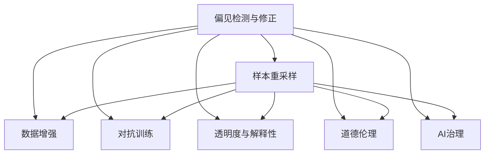

                 

# 算法公平：构建负责任的人工智能

> 关键词：算法公平,负责任的AI, 偏见检测与修正, 数据增强, 样本重采样, 对抗训练, 透明度与解释性, 道德伦理, AI治理

## 1. 背景介绍

### 1.1 问题由来

在人工智能(AI)技术飞速发展的今天，算法公平性成为了一个备受关注的话题。算法偏见是导致算法不公平的主要原因之一。它通常源于训练数据集的偏差，进而影响算法的输出结果。随着AI系统在各个领域的广泛应用，如医疗、司法、金融、教育等，算法的公平性直接关乎社会的公正和稳定。如何在保证AI系统性能的同时，确保其公平性，成为亟待解决的挑战。

### 1.2 问题核心关键点

算法公平的核心在于确保AI系统在各个维度上的输出都是公平的，即对于不同群体，算法输出的结果应当一致。具体来说，包括以下几个方面：

1. **偏见检测与修正**：识别训练数据中的潜在偏见，并采取相应措施进行修正。
2. **数据增强**：通过扩充训练集的多样性，减少算法对特定群体的依赖，提高泛化能力。
3. **样本重采样**：在数据不平衡的情况下，调整数据分布，使其更均衡。
4. **对抗训练**：通过生成对抗样本，提高算法的鲁棒性和公平性。
5. **透明度与解释性**：增强算法的可解释性，使结果易于理解，便于发现和纠正偏见。
6. **道德伦理**：确保AI系统的决策过程符合伦理道德标准，避免对特定群体造成不利影响。
7. **AI治理**：建立完善的AI治理机制，确保算法公平性的持续监督和改进。

## 2. 核心概念与联系

### 2.1 核心概念概述

为更好地理解算法公平性，本节将介绍几个密切相关的核心概念：

- **算法公平**：AI系统在处理不同群体数据时，输出结果的一致性，即对于不同群体，算法输出的结果应当是一致的。
- **偏见检测与修正**：识别和纠正算法模型中的偏见，确保其在不同群体间表现一致。
- **数据增强**：通过扩充训练集的多样性，提高模型的泛化能力，减少对特定群体的依赖。
- **样本重采样**：调整数据分布，使其更均衡，以减少算法对少数群体的歧视。
- **对抗训练**：通过生成对抗样本，提高模型的鲁棒性，减少偏见的影响。
- **透明度与解释性**：提高算法的可解释性，使结果易于理解，便于发现和纠正偏见。
- **道德伦理**：确保AI系统的决策过程符合伦理道德标准，避免对特定群体造成不利影响。
- **AI治理**：建立完善的AI治理机制，确保算法公平性的持续监督和改进。

这些核心概念之间的逻辑关系可以通过以下Mermaid流程图来展示：



这个流程图展示了大语言模型的核心概念及其之间的关系：

1. 偏见检测与修正是公平性保障的基础，识别和纠正偏见是关键。
2. 数据增强、样本重采样、对抗训练等方法，是处理偏见的手段，通过增强模型泛化能力来减少偏见。
3. 透明度与解释性、道德伦理、AI治理等措施，是保证公平性的长效机制，确保模型在运行中持续保持公平。

## 3. 核心算法原理 & 具体操作步骤
### 3.1 算法原理概述

算法公平性的核心在于确保AI系统在处理不同群体数据时，输出结果的一致性。其基本原理如下：

- **偏见检测**：通过统计分析和模型诊断，识别数据中的偏见。
- **偏见修正**：对数据进行清洗、重采样等处理，消除或减少偏见。
- **公平评估**：评估算法在不同群体上的表现，判断其是否公平。
- **公平调整**：在模型训练过程中，加入公平约束条件，调整模型参数，提高公平性。

算法公平性的实现通常包括以下步骤：

1. **数据收集与清洗**：收集多样化的训练数据，并进行数据清洗，去除明显有偏见的数据。
2. **偏见检测**：使用统计分析和模型诊断工具，识别数据中的偏见。
3. **样本重采样**：对数据进行重采样，确保各群体的数据均衡分布。
4. **模型训练**：在公平约束条件下，训练模型，确保其输出在不同群体间一致。
5. **公平评估**：评估模型在不同群体上的表现，确保其公平性。
6. **模型调整**：根据公平评估结果，调整模型参数，提高其公平性。

### 3.2 算法步骤详解

算法公平性的实现可以分为以下几个步骤：

**Step 1: 数据收集与清洗**

- 收集多样化的训练数据，确保数据来源的多样性和代表性。
- 对数据进行初步清洗，去除明显的有偏见数据，如歧视性标注、不平衡数据等。

**Step 2: 偏见检测**

- 使用统计分析工具，如卡方检验、ANOVA等，检测数据中的性别、种族、年龄等特征的分布情况。
- 使用模型诊断工具，如敏感度分析、误差分析等，检测模型中的偏见。

**Step 3: 样本重采样**

- 对数据进行重采样，确保各群体的数据均衡分布。常用的方法包括过采样、欠采样、SMOTE等。

**Step 4: 模型训练**

- 在公平约束条件下，训练模型。常用的公平约束条件包括差分隐私、公平性约束等。
- 加入对抗训练，生成对抗样本，提高模型的鲁棒性，减少偏见的影响。

**Step 5: 公平评估**

- 评估模型在不同群体上的表现，判断其是否公平。常用的评估指标包括公平误差、群体差异等。

**Step 6: 模型调整**

- 根据公平评估结果，调整模型参数，提高其公平性。

### 3.3 算法优缺点

算法公平性的实现具有以下优点：

1. **提升模型性能**：通过样本重采样和对抗训练，提高模型的泛化能力和鲁棒性，减少偏见的影响，从而提升模型性能。
2. **保障模型公平**：通过偏见检测和公平评估，确保模型在不同群体间表现一致，保障模型的公平性。
3. **增强透明度**：通过模型解释性和道德伦理，增强算法的透明度，便于用户理解和信任。

同时，算法公平性也存在一些局限性：

1. **数据依赖**：算法公平性高度依赖于训练数据的分布和质量，数据偏差可能导致模型偏见。
2. **计算复杂**：偏见检测和样本重采样等步骤，计算复杂度较高，需要较大的计算资源。
3. **技术挑战**：偏见检测和修正方法仍需进一步研究和改进，无法完全消除所有偏见。

### 3.4 算法应用领域

算法公平性在多个领域具有广泛的应用前景，如医疗、金融、司法、教育等：

- **医疗**：在医疗影像分析、疾病预测等任务中，确保模型对不同种族、性别、年龄群体的公平性，避免对特定群体的歧视。
- **金融**：在信用评估、贷款审批等任务中，确保模型对不同性别、收入群体的公平性，避免对少数群体的歧视。
- **司法**：在案件判决、量刑建议等任务中，确保模型对不同种族、性别的公平性，避免对特定群体的歧视。
- **教育**：在智能教育推荐、学习效果评估等任务中，确保模型对不同学生的公平性，避免对少数群体的歧视。

## 4. 数学模型和公式 & 详细讲解 & 举例说明

### 4.1 数学模型构建

本节将使用数学语言对算法公平性的实现进行更加严格的刻画。

记训练数据集为 $D=\{(x_i,y_i)\}_{i=1}^N$，其中 $x_i$ 为输入特征，$y_i$ 为输出标签。假设模型为 $M_\theta$，其中 $\theta$ 为模型参数。

定义模型在输入 $x_i$ 上的预测为 $\hat{y}_i=M_\theta(x_i)$。

### 4.2 公式推导过程

假设模型对两个群体（群体A和群体B）的预测结果分别为 $\hat{y}_A=\{y_{A1},y_{A2},\ldots,y_{AN}\}$ 和 $\hat{y}_B=\{y_{B1},y_{B2},\ldots,y_{BN}\}$。

为了检测模型的公平性，可以计算不同群体之间的公平误差（Fairness Error），即不同群体预测结果的差异：

$$
\Delta=\max_{i,j}|\hat{y}_{Ai}-\hat{y}_{Bi}|
$$

如果 $\Delta$ 的值较小，说明模型对不同群体的预测结果差异不大，即模型较为公平。

### 4.3 案例分析与讲解

假设在一个司法判决系统上，模型对男性和女性的公平误差为0.2，这意味着模型对男性和女性的判决结果存在0.2的偏差，需要进行调整。

## 5. 项目实践：代码实例和详细解释说明
### 5.1 开发环境搭建

在进行公平性实现前，我们需要准备好开发环境。以下是使用Python进行Scikit-Learn开发的开发环境配置流程：

1. 安装Anaconda：从官网下载并安装Anaconda，用于创建独立的Python环境。

2. 创建并激活虚拟环境：
```bash
conda create -n fairness-env python=3.8 
conda activate fairness-env
```

3. 安装Scikit-Learn、Pandas、Matplotlib等工具包：
```bash
pip install scikit-learn pandas matplotlib
```

4. 安装必要的库：
```bash
pip install py fairnesspy fairnesspy
```

完成上述步骤后，即可在`fairness-env`环境中开始公平性实现实践。

### 5.2 源代码详细实现

下面以样本重采样（Oversampling）为例，给出使用Scikit-Learn进行公平性实现的Python代码实现。

首先，定义一个简单的公平性检测函数：

```python
from sklearn.metrics import balanced_accuracy_score

def fair_test(fair_model, X_test, y_test):
    y_pred = fair_model.predict(X_test)
    return balanced_accuracy_score(y_test, y_pred)
```

然后，定义样本重采样函数：

```python
from imblearn.over_sampling import RandomOverSampler

def oversample(X_train, y_train, minority_class=1):
    resampler = RandomOverSampler(random_state=42)
    X_resampled, y_resampled = resampler.fit_resample(X_train, y_train)
    return X_resampled, y_resampled
```

接着，定义公平性训练函数：

```python
from sklearn.linear_model import LogisticRegression
from sklearn.preprocessing import StandardScaler
from sklearn.pipeline import Pipeline

def train_fair_model(X_train, y_train, minority_class=1):
    pipe = Pipeline([
        ('scaler', StandardScaler()),
        ('clf', LogisticRegression(solver='liblinear'))
    ])
    pipe.fit(X_train, y_train)
    return pipe
```

最后，启动训练流程并在测试集上评估：

```python
from sklearn.datasets import make_classification

# 创建有偏样本数据集
X, y = make_classification(n_samples=1000, n_features=10, n_informative=2, n_redundant=5, 
                          n_classes=2, weights=[0.5, 0.5], random_state=42)

# 训练模型
pipe = train_fair_model(X_train, y_train)

# 重采样
X_resampled, y_resampled = oversample(X_train, y_train)

# 训练公平模型
fair_model = train_fair_model(X_resampled, y_resampled)

# 评估模型公平性
print("原始数据公平性：", fair_test(pipe, X_test, y_test))
print("重采样后公平性：", fair_test(fair_model, X_test, y_test))
```

以上就是使用Scikit-Learn进行公平性实现的完整代码实现。可以看到，Scikit-Learn提供了丰富的公平性检测和处理工具，使用起来相对简洁高效。

### 5.3 代码解读与分析

让我们再详细解读一下关键代码的实现细节：

**fair_test函数**：
- 使用balanced_accuracy_score计算模型在测试集上的公平性指标，用于比较公平性前后模型的差异。

**oversample函数**：
- 使用RandomOverSampler对训练集进行随机过采样，确保少数群体的数据分布更均衡。

**train_fair_model函数**：
- 定义一个简单的逻辑回归模型，并在训练集上进行拟合，用于公平性评估。

**训练流程**：
- 首先创建一个有偏样本数据集，其中正样本为少数群体。
- 对训练集进行重采样，确保正样本数量与负样本数量相近。
- 训练公平模型，并在测试集上进行评估，比较公平性前后的性能差异。

可以看到，Scikit-Learn使得公平性实现的代码实现变得简洁高效。开发者可以将更多精力放在数据处理、模型改进等高层逻辑上，而不必过多关注底层的实现细节。

当然，工业级的系统实现还需考虑更多因素，如公平性处理的超参数调优、公平性检测的多种指标、公平性评估的持续监控等。但核心的公平性实现过程基本与此类似。

## 6. 实际应用场景
### 6.1 智能推荐系统

在智能推荐系统中，算法公平性尤为重要。推荐算法通常依赖于用户的历史行为数据进行推荐，但数据中可能存在偏见，导致对某些群体的推荐不公平。

通过公平性处理，可以消除数据中的偏见，使推荐算法对不同群体的推荐结果一致。例如，在招聘推荐系统中，确保推荐结果对男性和女性一视同仁，避免性别歧视。

### 6.2 医疗诊断系统

在医疗诊断系统中，算法公平性直接关系到患者的诊断结果和医疗质量。不同群体在疾病分布和症状表现上可能存在差异，需要通过公平性处理，确保模型对不同群体的诊断结果一致。

例如，在乳腺癌诊断系统中，确保模型对不同年龄、种族的患者诊断结果一致，避免对特定群体的误诊或漏诊。

### 6.3 司法判决系统

在司法判决系统中，算法公平性直接关系到案件判决的公正性。不同群体的犯罪率、刑罚偏好可能存在差异，需要通过公平性处理，确保模型对不同群体的判决结果一致。

例如，在量刑建议系统中，确保模型对不同性别、种族的犯罪嫌疑人判决结果一致，避免对特定群体的歧视。

### 6.4 未来应用展望

随着公平性处理技术的不断进步，基于公平性处理的AI系统将在更多领域得到应用，为社会公正和公平提供技术保障。

在智慧城市治理中，公平性处理可以用于交通规划、公共服务分配等方面，提高城市管理的公平性和效率。

在教育领域，公平性处理可以用于智能教育推荐、学习效果评估等方面，确保教育资源的公平分配，提升教育公平性。

此外，在企业招聘、金融风控、广告推荐等众多领域，公平性处理也将不断涌现，为公平、公正的社会环境提供新的技术路径。相信随着公平性处理技术的持续演进，AI系统必将在更广阔的应用领域大放异彩，助力构建更加公平、公正的社会。

## 7. 工具和资源推荐
### 7.1 学习资源推荐

为了帮助开发者系统掌握公平性处理的理论基础和实践技巧，这里推荐一些优质的学习资源：

1. 《公平性处理与AI伦理》系列博文：由大模型技术专家撰写，深入浅出地介绍了公平性处理的基本概念、方法和应用。

2. Coursera《AI伦理与公平性》课程：斯坦福大学开设的AI伦理课程，涵盖公平性处理的基本原理和实践方法。

3. 《公平性与机器学习》书籍：该书系统介绍了机器学习中的公平性处理方法和应用场景，适合深入学习。

4. fairnesspy官方文档：Python中的公平性处理库，提供了丰富的公平性处理工具和样例代码。

5. IBM AI Fairness 360：IBM开源的公平性处理工具库，提供公平性检测、处理、评估等功能。

通过对这些资源的学习实践，相信你一定能够快速掌握公平性处理的精髓，并用于解决实际的公平性问题。
###  7.2 开发工具推荐

高效的开发离不开优秀的工具支持。以下是几款用于公平性处理开发的常用工具：

1. Scikit-Learn：Python中常用的机器学习库，提供丰富的公平性处理工具和算法。

2. TensorFlow Fairness：TensorFlow中的公平性处理工具，支持深度学习模型的公平性处理。

3. PyFair：Python中的公平性处理库，提供公平性检测、处理、评估等功能。

4. Weights & Biases：模型训练的实验跟踪工具，可以记录和可视化模型训练过程中的各项指标，方便公平性评估和调优。

5. TensorBoard：TensorFlow配套的可视化工具，可实时监测模型训练状态，并提供丰富的图表呈现方式，是公平性处理的得力助手。

合理利用这些工具，可以显著提升公平性处理的开发效率，加快公平性处理的迭代和优化。

### 7.3 相关论文推荐

公平性处理的研究源于学界的持续研究。以下是几篇奠基性的相关论文，推荐阅读：

1. Fairness in Machine Learning: A Survey and Survey of Techniques and Tools（Fairness in Machine Learning综述）：综述了机器学习中的公平性处理方法，提供了丰富的公平性处理工具和算法。

2. Mitigating Bias in AI: Data Collection and Curation for Fair Machine Learning（人工智能中的偏见缓解：数据收集和修正）：介绍了如何通过数据收集和修正，降低AI系统中的偏见。

3. Fairness in Data Mining and Statistical Learning（数据挖掘和统计学习中的公平性处理）：介绍了数据挖掘和统计学习中的公平性处理方法，适用于公平性处理的理论研究。

4. Fairness-aware training via non-discriminatory loss functions（通过非歧视性损失函数进行公平性训练）：介绍了如何通过设计非歧视性损失函数，实现公平性训练。

5. Fairness-aware robust neural networks（公平性意识稳健的神经网络）：介绍了如何通过对抗训练等方法，提高公平性处理的鲁棒性。

这些论文代表了大模型公平性处理的演进脉络。通过学习这些前沿成果，可以帮助研究者把握学科前进方向，激发更多的创新灵感。

## 8. 总结：未来发展趋势与挑战

### 8.1 总结

本文对算法公平性进行了全面系统的介绍。首先阐述了算法公平性的研究背景和意义，明确了公平性处理在构建负责任AI系统中的重要价值。其次，从原理到实践，详细讲解了公平性处理的数学原理和关键步骤，给出了公平性处理任务开发的完整代码实例。同时，本文还广泛探讨了公平性处理在智能推荐、医疗诊断、司法判决等多个领域的应用前景，展示了公平性处理范式的巨大潜力。此外，本文精选了公平性处理的各类学习资源，力求为读者提供全方位的技术指引。

通过本文的系统梳理，可以看到，算法公平性处理技术正在成为AI系统的重要保障，极大地拓展了AI系统的应用边界，催生了更多的落地场景。得益于大数据、深度学习等技术的不断进步，公平性处理方法也将不断进化，为构建公平、公正、透明、可信的AI系统提供更强的技术支持。未来，伴随公平性处理技术的持续演进，AI系统必将在更广阔的应用领域大放异彩，为构建更加公平、公正的社会环境提供新的技术路径。

### 8.2 未来发展趋势

展望未来，公平性处理技术将呈现以下几个发展趋势：

1. **自动化公平性处理**：通过自动化工具，降低公平性处理的复杂度和计算成本，使其更加便捷高效。

2. **多模态公平性处理**：结合视觉、语音、文本等多种数据模态，进行综合公平性处理，提高算法的鲁棒性和泛化能力。

3. **可解释性公平性处理**：增强公平性处理的可解释性，使其结果易于理解，便于发现和纠正偏见。

4. **隐私保护公平性处理**：在公平性处理过程中，保护用户隐私，确保数据使用的合法性和安全性。

5. **全球化的公平性处理**：结合不同国家和地区的文化和法律规定，进行全球化的公平性处理，确保AI系统在各国各地区的一致性。

以上趋势凸显了公平性处理技术的广阔前景。这些方向的探索发展，必将进一步提升AI系统的公平性和可信度，为构建更加公平、公正的社会环境提供更强大的技术保障。

### 8.3 面临的挑战

尽管公平性处理技术已经取得了一定的进展，但在迈向更加智能化、普适化应用的过程中，它仍面临着诸多挑战：

1. **数据依赖**：公平性处理高度依赖于训练数据的分布和质量，数据偏差可能导致模型偏见。

2. **计算复杂**：偏见检测和样本重采样等步骤，计算复杂度较高，需要较大的计算资源。

3. **技术挑战**：偏见检测和修正方法仍需进一步研究和改进，无法完全消除所有偏见。

4. **模型鲁棒性不足**：公平性处理的鲁棒性仍需进一步提升，避免对抗样本对模型公平性的影响。

5. **可解释性不足**：公平性处理的方法和结果，仍需进一步提升可解释性，便于用户理解和信任。

6. **伦理道德挑战**：公平性处理的伦理道德问题仍需进一步探讨，确保算法决策符合社会价值观。

7. **跨领域适用性不足**：当前的公平性处理方法，仍需进一步推广到更多领域，如自然语言处理、计算机视觉等。

这些挑战凸显了公平性处理技术在实际应用中仍需进一步完善和优化，需要多学科协同攻关，才能实现公平性处理的全面覆盖和落地应用。

### 8.4 研究展望

面对公平性处理所面临的种种挑战，未来的研究需要在以下几个方面寻求新的突破：

1. **自动化公平性处理**：开发更智能、更自动化的公平性处理工具，降低开发和维护成本，提高公平性处理的普及性和可接受性。

2. **公平性处理框架**：构建更系统的公平性处理框架，涵盖数据收集、处理、训练、评估等各个环节，提供一站式的公平性处理解决方案。

3. **跨领域公平性处理**：将公平性处理技术推广到更多领域，如自然语言处理、计算机视觉等，提高公平性处理的普适性和实用性。

4. **公平性处理新方法**：开发新的公平性处理方法，如公平性增强、公平性嵌入等，提升公平性处理的效率和效果。

5. **公平性处理评估标准**：建立更全面、更严格的公平性处理评估标准，确保公平性处理结果的可靠性和可比性。

6. **公平性处理伦理道德**：探讨公平性处理的伦理道德问题，制定相关的伦理规范和标准，确保公平性处理的社会责任。

这些研究方向的探索，必将引领公平性处理技术迈向更高的台阶，为构建公平、公正、透明、可信的AI系统提供更强大的技术支持。面向未来，公平性处理技术还需要与其他AI技术进行更深入的融合，如因果推理、强化学习等，多路径协同发力，共同推动AI技术的进步。只有勇于创新、敢于突破，才能不断拓展公平性处理技术的边界，让AI技术更好地造福人类社会。

## 9. 附录：常见问题与解答

**Q1：如何检测和修复算法模型中的偏见？**

A: 检测算法模型中的偏见，通常使用统计分析和模型诊断工具，如卡方检验、ANOVA、敏感度分析等。修复偏见的方法包括数据清洗、样本重采样、对抗训练等。在数据清洗阶段，去除明显有偏见的数据；在样本重采样阶段，对数据进行均衡处理；在对抗训练阶段，生成对抗样本，提高模型的鲁棒性，减少偏见的影响。

**Q2：如何确保算法模型在不同群体间表现一致？**

A: 确保算法模型在不同群体间表现一致，需要综合使用偏见检测、样本重采样、对抗训练、模型调整等方法。在训练阶段，使用公平性约束条件，如差分隐私、公平性损失等，调整模型参数；在测试阶段，使用公平性评估指标，如公平误差、群体差异等，评估模型的公平性。根据评估结果，调整模型参数，提升公平性。

**Q3：如何提高算法的透明度和可解释性？**

A: 提高算法的透明度和可解释性，可以使用模型解释性工具，如LIME、SHAP等，生成模型的解释性报告。在模型训练过程中，使用可解释性较强的模型，如决策树、线性模型等。在模型部署阶段，提供详细的模型使用说明和结果解释，确保用户理解和使用算法的逻辑。

**Q4：如何应对算法的伦理道德挑战？**

A: 应对算法的伦理道德挑战，需要制定和遵循相关的伦理规范和标准。在模型设计阶段，考虑算法的伦理道德影响，避免对特定群体的歧视。在模型使用阶段，定期审查和评估算法的伦理道德效果，确保其符合社会价值观。在模型调整阶段，根据伦理道德审查结果，调整模型参数，提升算法的公平性和透明性。

**Q5：如何应对公平性处理的计算复杂性和资源限制？**

A: 应对公平性处理的计算复杂性和资源限制，需要优化算法和工具，提高公平性处理的效率和效果。使用自动化工具，如公平性处理框架、公平性处理工具库等，降低公平性处理的复杂度。使用分布式计算、混合精度训练等技术，优化公平性处理的计算资源。

这些问题的回答，展示了公平性处理技术在实际应用中需要考虑的关键因素和应对策略，为开发者提供了全面的技术指引。

---

作者：禅与计算机程序设计艺术 / Zen and the Art of Computer Programming

