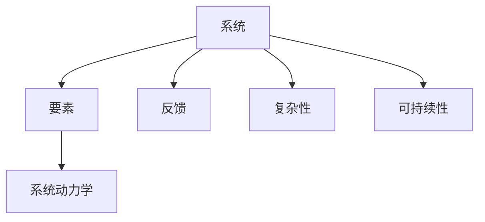

                 

# 系统思考在管理中的应用

## 1. 背景介绍

### 1.1 问题由来
系统思考(Systemic Thinking)是管理科学和系统理论的核心概念，它强调从整体出发，分析系统内部和外部的关联关系，揭示系统动态变化的规律，从而为决策提供科学依据。随着全球化、复杂化的加剧，企业面临的市场环境、技术环境、政策环境和社会环境等日益复杂，传统基于局部、静态、线性的管理方法已难以适应新的挑战。系统思考作为一门新兴的管理思维工具，能够提供系统化、动态化、整体化的分析视角，帮助企业构建更加灵活、高效、可持续的管理体系。

### 1.2 问题核心关键点
系统思考的核心在于其系统化、动态化、整体化的思维模式。系统化指将企业视为一个整体，全面考虑系统内部和外部的各种因素，而非局限于某一局部；动态化指动态地看待系统，理解系统内外部环境的变化，而非静止地对待问题；整体化则强调系统内各个要素的相互作用和相互依赖，理解系统的全局最优而非局部最优。这些关键点共同构成了系统思考在管理中的应用基础，使之成为解决复杂管理问题的有力工具。

## 2. 核心概念与联系

### 2.1 核心概念概述

为更好地理解系统思考在管理中的应用，本节将介绍几个密切相关的核心概念：

- 系统(System)：由若干要素及它们之间的相互作用和相互依赖关系构成的具有特定功能的整体。系统思考关注的是系统的整体性、动态性和关联性，强调要素间的相互影响和系统目标的协调一致。
- 要素(Components)：构成系统的基本单位，如企业的人力资源、资金、市场、技术等。系统思考视每个要素为系统的一部分，分析其对系统的影响。
- 反馈(Feedback)：系统内要素间的相互作用和信息交换，是系统动态变化的主要驱动力。系统思考强调利用反馈机制调节系统，维持系统的稳定和持续改进。
- 复杂性(Complexity)：系统内部各要素之间相互作用复杂，难以简单理解。系统思考关注系统的多样性、层次性和不确定性，强调动态处理和整体协同。
- 可持续性(Sustainability)：系统在满足当前需求的同时，不损害未来发展能力。系统思考强调长远的战略视野和整体利益。
- 系统动力学(System Dynamics)：一门专注于研究系统动态变化规律的系统科学方法，主要用于解决系统性问题。系统思考中的许多理论和技术，都基于系统动力学的研究成果。

这些核心概念之间的逻辑关系可以通过以下Mermaid流程图来展示：



这个流程图展示了一些关键概念及其之间的关系：

1. 系统由要素构成。
2. 要素之间通过反馈产生动态变化。
3. 系统具有复杂性和不确定性。
4. 系统目标是可持续的。
5. 系统动力学是系统思考的科学基础。

这些概念共同构成了系统思考的理论框架，为解决系统性问题提供了有效的分析工具和方法。

## 3. 核心算法原理 & 具体操作步骤
### 3.1 算法原理概述

系统思考在管理中的应用，主要基于以下原理：

- **整体优化**：将企业视为一个整体，通过系统化、动态化的视角，理解系统的全局最优，而非局部最优。
- **反馈机制**：利用系统内外部反馈，及时调整和优化系统，维持系统的稳定和持续改进。
- **层次分析**：将复杂系统分解为多个层次，深入分析各个层次的相互作用和影响，揭示系统运行的内在规律。
- **动态演化**：认识到系统是动态变化的，需要动态地看待问题，理解系统的长期趋势和短期波动。
- **因果关系**：分析系统内各要素间的因果关系，理解其对系统行为和结果的影响，为决策提供依据。

### 3.2 算法步骤详解

系统思考在管理中的应用，主要包括以下几个关键步骤：

**Step 1: 系统建模**
- 定义系统的边界和目标，梳理系统内各要素和它们之间的相互作用关系。
- 识别系统的关键变量和参数，构建系统的数学模型。

**Step 2: 仿真与预测**
- 使用系统动力学工具，对系统进行仿真，预测系统的未来行为和变化趋势。
- 根据仿真结果，识别系统的关键问题和改进方向。

**Step 3: 动态优化**
- 根据预测结果，调整系统内各要素的设定值，优化系统的运行状态。
- 利用反馈机制，不断调整和优化系统，维持系统的稳定和可持续性。

**Step 4: 结果评估与调整**
- 对系统优化后的结果进行评估，验证其是否符合整体优化目标。
- 根据评估结果，进一步调整和优化系统，确保系统的整体最优。

### 3.3 算法优缺点

系统思考在管理中的应用具有以下优点：
1. 全局视野：从整体出发，理解系统的全局最优，避免局部最优陷阱。
2. 动态适应：动态地看待问题，理解系统的长期趋势和短期波动。
3. 反馈调节：利用系统反馈机制，及时调整和优化系统，维持系统的稳定和持续改进。
4. 层次分析：将复杂系统分解为多个层次，深入分析各个层次的相互作用和影响，揭示系统运行的内在规律。
5. 因果关系：分析系统内各要素间的因果关系，理解其对系统行为和结果的影响，为决策提供依据。

同时，该方法也存在一定的局限性：
1. 建模复杂：系统的建模需要深入理解系统内各要素的相互作用和影响，对于复杂系统而言，建模难度较大。
2. 参数敏感：系统的仿真和预测结果对输入参数的敏感性较高，参数设定不当可能导致预测结果失真。
3. 模型假设：系统模型建立在一定的假设基础上，可能存在假设失真，导致模型结果偏差。
4. 操作复杂：系统优化的过程涉及大量数据的收集、分析和处理，对操作人员的技术水平要求较高。
5. 难以量化：系统思考强调整体和动态，难以量化系统的各项指标，需要依赖定性分析。

尽管存在这些局限性，但就目前而言，系统思考在解决复杂管理问题方面的有效性已得到广泛认可，成为管理科学的重要范式。未来相关研究的重点在于如何进一步降低建模复杂度，提高模型的准确性和可操作性，同时兼顾模型的可解释性和伦理安全性等因素。

### 3.4 算法应用领域

系统思考在管理中的应用，涉及诸多领域，以下是几个典型的应用场景：

- **企业战略管理**：系统思考有助于企业从整体视角理解市场和内部环境，制定长期战略规划，实现企业的可持续发展。
- **组织变革管理**：系统思考可以帮助组织理解各要素间的相互作用和影响，识别变革的关键点和风险点，推进组织变革的顺利进行。
- **供应链管理**：系统思考可以理解供应链各环节的相互作用和依赖关系，优化供应链设计，提高供应链的整体效率和稳定性。
- **人力资源管理**：系统思考可以理解员工、组织和市场间的相互作用，优化人力资源配置，实现人尽其才、才尽其用。
- **财务管理和投资决策**：系统思考可以理解财务数据和市场信息间的动态关系，优化财务决策，提高投资回报率。

除了上述这些经典场景外，系统思考还可以应用于研发管理、市场营销、客户关系管理等领域，为企业的管理和运营提供科学依据。

## 4. 数学模型和公式 & 详细讲解
### 4.1 数学模型构建

在系统思考的应用中，我们通常使用系统动力学(System Dynamics)建模方法。系统动力学的数学模型主要包括以下几个关键部分：

1. 状态变量(State Variables)：描述系统当前状态的变量，如库存量、资金余额、员工数量等。
2. 流率(Flow Rates)：描述状态变量随时间变化的速率，如库存变动率、资金变动率、员工变动率等。
3. 储备(Stocks)：描述系统内部长期积累的量，如库存、资金余额、员工数量等。
4. 因果关系(Causal Relationships)：描述状态变量之间的因果关系，如库存影响销售，销售影响资金，资金影响投资等。

系统动力学的基本方程为：

$$
\frac{dS_i}{dt} = R_i(S_i) - D_i(S_i)
$$

其中 $S_i$ 为状态变量，$R_i$ 为输入流率，$D_i$ 为输出流率。

### 4.2 公式推导过程

以下是系统动力学模型的基本推导过程：

1. **状态变量定义**：将系统内各要素的状态用状态变量 $S_i$ 表示，如 $S_{库存}$、$S_{资金}$、$S_{员工}$ 等。

2. **流率定义**：定义每个状态变量的流率 $R_i$ 和 $D_i$，表示状态变量的输入和输出速率。

3. **因果关系建立**：根据系统内各要素间的相互作用关系，建立状态变量间的因果关系，如 $S_{库存}$ 受 $R_{销售}$ 和 $D_{库存消耗}$ 的影响，$S_{资金}$ 受 $R_{投资}$ 和 $D_{资金流出}$ 的影响。

4. **方程建立**：将状态变量和流率代入基本方程，建立系统的微分方程组。

5. **仿真和预测**：使用系统动力学软件，如Vensim、Stella等，对模型进行仿真，预测系统的未来行为和变化趋势。

6. **优化和调整**：根据仿真结果，识别系统的关键问题和改进方向，调整系统内各要素的设定值，优化系统的运行状态。

### 4.3 案例分析与讲解

以下是一个简单的系统动力学案例分析：

假设某企业生产产品，库存量、资金余额、员工数量是影响企业经营的重要状态变量。系统动力学模型建立如下：

1. **状态变量**：
   - $S_{库存}$：当前库存量
   - $S_{资金}$：当前资金余额
   - $S_{员工}$：当前员工数量

2. **流率**：
   - $R_{销售}$：销售产品产生的收入
   - $D_{库存消耗}$：库存的自然消耗
   - $R_{投资}$：投资产生的资金流入
   - $D_{资金流出}$：资金的支出

3. **因果关系**：
   - $S_{库存}$ 受 $R_{销售}$ 和 $D_{库存消耗}$ 的影响
   - $S_{资金}$ 受 $R_{投资}$ 和 $D_{资金流出}$ 的影响
   - $S_{员工}$ 受 $R_{销售}$ 和 $R_{投资}$ 的影响

4. **方程建立**：
   $$
   \frac{dS_{库存}}{dt} = R_{销售} - D_{库存消耗}
   $$
   $$
   \frac{dS_{资金}}{dt} = R_{投资} - D_{资金流出}
   $$
   $$
   \frac{dS_{员工}}{dt} = R_{销售} - R_{投资}
   $$

5. **仿真和预测**：使用系统动力学软件，仿真并预测不同市场环境下企业的库存、资金、员工数量变化趋势。

6. **优化和调整**：根据仿真结果，识别库存、资金、员工数量的关键问题和改进方向，优化企业的经营决策。

## 5. 项目实践：代码实例和详细解释说明
### 5.1 开发环境搭建

在系统思考的实践中，需要搭建适合系统动力学建模和仿真的开发环境。以下是使用Python进行Vensim开发的流程：

1. 安装Python：从官网下载并安装Python，用于编写系统动力学模型。

2. 安装Vensim：从官网下载并安装Vensim，用于构建和仿真系统动力学模型。

3. 安装Jupyter Notebook：从官网下载并安装Jupyter Notebook，用于编写Python脚本和可视化结果。

4. 安装Pandas：使用pip安装Pandas，用于数据处理和分析。

完成上述步骤后，即可在Python环境中进行系统动力学建模和仿真。

### 5.2 源代码详细实现

以下是使用Python和Vensim进行系统动力学建模的代码实现：

```python
import vensim
from vensim import pypp
from vensim.compiler import compile
from vensim.url import url_get

# 定义状态变量
S_inventory = pypp.dv('S_inventory')
S_fund = pypp.dv('S_fund')
S_employees = pypp.dv('S_employees')

# 定义流率
R_sales = pypp.dv('R_sales')
D_inventory_consumption = pypp.dv('D_inventory_consumption')
R_investment = pypp.dv('R_investment')
D_fund_expense = pypp.dv('D_fund_expense')

# 定义方程
eq1 = pypp.equation(S_inventory.rate == R_sales - D_inventory_consumption)
eq2 = pypp.equation(S_fund.rate == R_investment - D_fund_expense)
eq3 = pypp.equation(S_employees.rate == R_sales - R_investment)

# 创建模型
model = vensim.Model('Inventory_Fund_Employees_Dynamics')
model.add_equation(eq1)
model.add_equation(eq2)
model.add_equation(eq3)

# 导出模型
model_file = url_get('https://www.vensim.com/files/Inventory_Fund_Employees_Dynamics.sms')
model.save(model_file)

# 编译模型
compile(model_file)

# 仿真
results = model.simulate('2020-01-01', '2023-12-31')

# 可视化结果
import matplotlib.pyplot as plt
plt.plot(results['S_inventory'], label='Inventory')
plt.plot(results['S_fund'], label='Fund')
plt.plot(results['S_employees'], label='Employees')
plt.legend()
plt.show()
```

在这个代码实现中，我们首先定义了系统的状态变量和流率，然后使用Vensim的Python API定义了系统的方程，最后使用Vensim编译并仿真模型。最终结果将以图表形式展示，帮助分析系统的动态变化。

### 5.3 代码解读与分析

让我们再详细解读一下关键代码的实现细节：

1. **状态变量和流率定义**：使用Vensim的Python API定义了系统内各状态变量的符号，如 $S_{库存}$、$S_{资金}$、$S_{员工}$ 等。同时定义了它们的流率，如 $R_{销售}$、$D_{库存消耗}$、$R_{投资}$、$D_{资金流出}$ 等。

2. **方程建立**：使用Vensim的Python API定义了系统的微分方程，表示各状态变量的动态变化。

3. **模型创建和导出**：使用Vensim的Python API创建系统动力学模型，并导出为Vensim支持的格式。

4. **模型编译和仿真**：使用Vensim的命令行工具，将模型文件编译为可执行格式，并进行仿真。

5. **结果可视化**：使用Python的Matplotlib库，将仿真结果以图表形式展示，帮助分析系统的动态变化。

## 6. 实际应用场景

### 6.1 企业战略管理

系统思考在系统化、动态化、整体化的视角下，可以帮助企业从整体视角理解市场和内部环境，制定长期战略规划，实现企业的可持续发展。

具体而言，企业可以构建系统动力学模型，描述其销售、库存、资金、员工数量等关键要素的动态变化，分析这些要素间的相互作用和影响，识别战略关键点和改进方向。例如，通过仿真预测不同市场环境下的库存需求、资金需求和员工需求，企业可以优化库存管理、投资决策和人力资源配置，实现企业的整体最优。

### 6.2 组织变革管理

系统思考可以帮助组织理解各要素间的相互作用和影响，识别变革的关键点和风险点，推进组织变革的顺利进行。

具体而言，组织可以构建系统动力学模型，描述其成员、资源、流程等要素的动态变化，分析这些要素间的相互作用和影响，识别变革的关键点和风险点。例如，通过仿真预测组织变革前后成员的工作满意度、资源利用率和流程效率的变化，组织可以优化变革方案，降低变革风险，提高变革成功率。

### 6.3 供应链管理

系统思考可以理解供应链各环节的相互作用和依赖关系，优化供应链设计，提高供应链的整体效率和稳定性。

具体而言，企业可以构建系统动力学模型，描述其供应商、制造商、分销商等环节的动态变化，分析这些环节间的相互作用和影响，优化供应链设计。例如，通过仿真预测不同市场环境下的供应链响应速度、库存水平和物流成本的变化，企业可以优化供应链策略，提高供应链的整体效率和稳定性。

### 6.4 未来应用展望

随着系统思考和系统动力学的不断发展和完善，其在管理中的应用前景将更加广阔。

未来，系统思考将进一步融入人工智能、大数据、物联网等新兴技术，实现更深入、更全面的系统分析。例如，通过结合人工智能技术，实现系统的自学习、自优化，提高系统分析的精准性和可靠性。通过结合大数据技术，实现系统的全量数据处理和分析，提供更加丰富的决策依据。通过结合物联网技术，实现系统的实时监控和动态调整，提高系统的灵活性和稳定性。

## 7. 工具和资源推荐
### 7.1 学习资源推荐

为了帮助开发者系统掌握系统思考的理论基础和实践技巧，这里推荐一些优质的学习资源：

1. 《系统动力学建模与仿真》系列博文：由系统动力学专家撰写，深入浅出地介绍了系统动力学的原理、建模方法和应用范例。

2. 《系统思考：管理变革之道》书籍：系统思考领域的经典著作，详细阐述了系统思考的理论基础和实践应用。

3. 《系统动力学基础》课程：麻省理工学院开设的系统动力学课程，提供系统动力学的理论知识和实践案例，适合系统思考初学者。

4. 《系统动力学模型与应用》书籍：系统动力学领域的经典教材，涵盖系统动力学建模、仿真和优化等内容，适合系统动力学实践者。

5. 《系统思考与领导力》课程：哈佛商学院开设的系统思考课程，结合案例教学，深入探讨系统思考在领导力中的应用。

通过对这些资源的学习实践，相信你一定能够快速掌握系统思考的理论基础和实践技巧，并将其应用于实际管理问题中。

### 7.2 开发工具推荐

系统思考的实践离不开高效的开发工具支持。以下是几款用于系统动力学建模和仿真的常用工具：

1. Vensim：系统动力学建模和仿真的主流工具，功能强大、易于使用，支持多种数据导入和输出格式。

2. Stella：麻省理工学院开发的系统动力学建模工具，界面友好、操作简单，适合系统动力学初学者。

3. AnyLogic：系统动力学和离散事件仿真软件的结合，支持多种仿真方法，适用于复杂系统的分析和优化。

4. Python和Pandas：Python和Pandas库提供了丰富的数据分析和处理功能，可以与系统动力学工具结合使用，进行模型构建和仿真。

5. Jupyter Notebook：Python的交互式编程环境，适合编写和展示系统动力学模型的代码和仿真结果。

合理利用这些工具，可以显著提升系统思考的开发效率，加快创新迭代的步伐。

### 7.3 相关论文推荐

系统思考的研究源于学界的持续研究。以下是几篇奠基性的相关论文，推荐阅读：

1. Jay W. Forrester, "Industrial Dynamics: A Systems Approach to Simulating Indus"
2. Peter Senge, "Systems Thinking: Diverging from the Future Backward"
3. John Kay, "Modeling Thinking"
4. Alexander Technological Systems Modeling for Product Development"
5. Antonio Pasquale, "Designing the Intelligent Organization: A System Thinking Approach"

这些论文代表了大系统思考理论的发展脉络。通过学习这些前沿成果，可以帮助研究者把握学科前进方向，激发更多的创新灵感。

## 8. 总结：未来发展趋势与挑战

### 8.1 研究成果总结

本文对系统思考在管理中的应用进行了全面系统的介绍。首先阐述了系统思考的理论基础和应用背景，明确了其系统化、动态化、整体化的思维模式，以及系统动力学作为其核心工具。其次，从原理到实践，详细讲解了系统思考的数学模型和仿真方法，给出了系统动力学建模和仿真的完整代码实例。同时，本文还广泛探讨了系统思考在企业战略管理、组织变革管理、供应链管理等多个领域的应用前景，展示了系统思考范式的巨大潜力。最后，本文精选了系统思考的各类学习资源，力求为读者提供全方位的技术指引。

通过本文的系统梳理，可以看到，系统思考作为一种新兴的管理思维工具，正在成为解决复杂管理问题的有力工具，其系统化、动态化、整体化的思维模式，将为管理科学带来新的突破。系统动力学作为系统思考的核心方法，提供了动态分析和管理系统的科学依据，进一步拓展了管理科学的理论和方法体系。

### 8.2 未来发展趋势

展望未来，系统思考在管理中的应用将呈现以下几个发展趋势：

1. 模型自动化：随着人工智能技术的发展，系统动力学的模型构建将更加自动化，减少人工干预，提高模型构建效率。

2. 多学科融合：系统思考将进一步与人工智能、大数据、物联网等新兴技术结合，实现更深入、更全面的系统分析。

3. 实时仿真：通过物联网技术，实现系统的实时监控和动态调整，提高系统的灵活性和稳定性。

4. 多目标优化：系统动力学将结合多目标优化技术，实现系统整体最优的决策方案。

5. 实时反馈：通过大数据技术，实现系统的实时反馈和动态调整，提高系统的响应速度和优化效果。

6. 自学习系统：通过人工智能技术，实现系统的自学习、自优化，提高系统分析的精准性和可靠性。

这些趋势凸显了系统思考的广阔前景。这些方向的探索发展，将进一步提升系统思考在管理科学中的应用，为复杂系统问题的解决提供更科学、更全面的方法。

### 8.3 面临的挑战

尽管系统思考在解决复杂管理问题方面已取得显著成效，但在实际应用中，仍面临诸多挑战：

1. 建模复杂性：系统的建模需要深入理解系统内各要素的相互作用和影响，对于复杂系统而言，建模难度较大。

2. 模型假设：系统模型建立在一定的假设基础上，可能存在假设失真，导致模型结果偏差。

3. 数据质量：系统分析依赖高质量的数据，数据质量问题可能影响分析结果的可靠性。

4. 模型解释：系统模型的复杂性可能使其难以解释，需要借助可视化工具和解释方法。

5. 参数敏感性：系统的仿真和预测结果对输入参数的敏感性较高，参数设定不当可能导致预测结果失真。

6. 模型验证：系统模型的验证需要实际数据的支持，验证过程可能涉及大量实验数据和分析工作。

尽管存在这些挑战，但随着系统思考和系统动力学的不断发展和完善，这些问题将逐步得到解决，系统思考在管理中的应用前景将更加广阔。

### 8.4 研究展望

面对系统思考在实际应用中面临的挑战，未来的研究需要在以下几个方面寻求新的突破：

1. 提高模型自动化水平：开发更加自动化、智能化的系统动力学建模工具，降低建模复杂性。

2. 改进模型假设和方法：引入更加合理的模型假设，并采用更加多样化的建模方法，提高模型的可靠性。

3. 提升数据质量控制：开发更加高效的数据清洗和处理工具，提高数据的准确性和完整性。

4. 加强模型解释和可视化：开发更加直观、易懂的模型解释工具和可视化方法，提高模型的可解释性。

5. 优化参数设置和调整：研究参数设定方法，提高参数设置的科学性和合理性，降低模型的敏感性。

6. 建立模型验证机制：建立系统模型的验证机制，确保模型结果的可靠性和准确性。

这些研究方向的探索，将引领系统思考和系统动力学向更高层次发展，为管理科学带来新的突破。只有勇于创新、敢于突破，才能不断拓展系统思考的边界，推动管理科学的进步。

## 9. 附录：常见问题与解答

**Q1：系统思考与传统管理方法有何区别？**

A: 系统思考与传统管理方法的最大区别在于其系统化、动态化和整体化的视角。传统管理方法往往基于局部、静态和线性的思维，难以全面理解系统内各要素的相互作用和影响，容易导致局部最优而非全局最优的决策。而系统思考则强调从整体和动态的角度分析系统，理解系统内各要素的因果关系和相互作用，为决策提供科学依据。

**Q2：系统动力学有哪些主要特点？**

A: 系统动力学的主要特点包括：

1. 非线性建模：系统动力学模型采用非线性方程描述系统行为，反映系统的复杂性和多样性。

2. 动态仿真：系统动力学模型基于动态仿真方法，模拟系统随时间变化的动态行为，揭示系统的长期趋势和短期波动。

3. 反馈调节：系统动力学模型强调利用反馈机制，调节系统的行为，维持系统的稳定和持续改进。

4. 多目标优化：系统动力学模型结合多目标优化技术，实现系统整体最优的决策方案。

5. 整体视角：系统动力学模型从整体视角分析系统，理解系统的全局最优，避免局部最优陷阱。

这些特点使得系统动力学成为系统思考的重要工具，为解决复杂系统问题提供了科学依据。

**Q3：系统思考在企业战略管理中的应用案例有哪些？**

A: 系统思考在企业战略管理中的应用案例包括：

1. 市场趋势分析：企业构建系统动力学模型，分析市场供需关系，识别市场趋势，制定适应市场变化的企业战略。

2. 投资决策优化：企业构建系统动力学模型，分析投资回报率和风险，优化投资决策，提高投资回报率。

3. 资源配置优化：企业构建系统动力学模型，分析资源需求和供应关系，优化资源配置，提高资源利用率。

4. 财务预测和控制：企业构建系统动力学模型，分析财务数据和市场信息，预测财务变化趋势，控制财务风险。

5. 供应链管理优化：企业构建系统动力学模型，分析供应链各环节的相互作用和影响，优化供应链设计，提高供应链的整体效率和稳定性。

这些案例展示了系统思考在企业战略管理中的广泛应用，为企业的战略决策提供科学依据。

**Q4：系统思考在实际应用中应注意哪些问题？**

A: 系统思考在实际应用中应注意以下问题：

1. 建模复杂性：系统的建模需要深入理解系统内各要素的相互作用和影响，对于复杂系统而言，建模难度较大，需要耗费大量时间和精力。

2. 模型假设：系统模型建立在一定的假设基础上，可能存在假设失真，导致模型结果偏差，需要不断验证和改进。

3. 数据质量：系统分析依赖高质量的数据，数据质量问题可能影响分析结果的可靠性，需要建立严格的数据质量控制机制。

4. 模型解释：系统模型的复杂性可能使其难以解释，需要借助可视化工具和解释方法，提高模型的可理解性。

5. 参数敏感性：系统的仿真和预测结果对输入参数的敏感性较高，参数设定不当可能导致预测结果失真，需要优化参数设置和调整方法。

6. 模型验证：系统模型的验证需要实际数据的支持，验证过程可能涉及大量实验数据和分析工作，需要建立科学合理的验证机制。

这些问题是系统思考在实际应用中需要注意的关键点，只有克服这些挑战，才能发挥系统思考在管理中的作用。

---

作者：禅与计算机程序设计艺术 / Zen and the Art of Computer Programming

