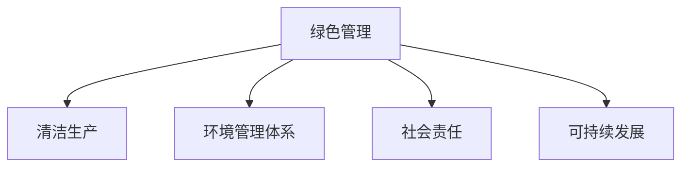

                 

# 绿色管理：可持续发展理念在企业中的应用

> 关键词：绿色管理, 可持续发展, 企业治理, 环境保护, 社会责任

## 1. 背景介绍

在全球气候变化和环境污染日益严重的背景下，企业需要积极承担起环境保护和可持续发展的责任。绿色管理作为一种新型管理模式，将可持续发展理念融入企业治理，通过优化资源配置、降低环境影响、提升社会责任感，为企业带来长远的商业价值和社会价值。本文将系统介绍绿色管理的概念、原理和应用实践，帮助企业领导者掌握这一先进的管理理念。

### 1.1 问题由来

近年来，环境问题已经成为全球关注的焦点。企业在追求经济效益的同时，也开始重视环境责任和社会效益。绿色管理作为一种创新的管理模式，旨在帮助企业实现经济、社会、环境的三重目标，实现可持续发展。通过引入绿色管理，企业可以在竞争中获得优势，提升品牌形象，同时为社会和环境作出积极贡献。

### 1.2 问题核心关键点

绿色管理的核心在于将可持续发展理念融入企业的各个环节，通过优化资源利用、减少环境污染、提高社会责任等措施，实现企业的长期发展和环境保护的双赢。具体来说，绿色管理包括以下关键点：

- **资源优化**：通过提高资源利用效率，减少浪费，降低生产成本。
- **环境保护**：减少生产过程中的环境污染，实现清洁生产。
- **社会责任**：积极承担社会责任，回馈社区。
- **可持续发展**：追求经济、社会、环境三者的和谐发展。

这些关键点构成了绿色管理的基本框架，帮助企业在追求经济增长的同时，也能够实现可持续发展。

## 2. 核心概念与联系

### 2.1 核心概念概述

为更好地理解绿色管理的应用，本节将介绍几个密切相关的核心概念：

- **绿色管理**：将可持续发展理念融入企业治理和管理过程的管理模式。通过优化资源配置、降低环境影响、提升社会责任感，帮助企业实现长期发展。
- **清洁生产**：通过技术创新和管理创新，从源头减少和控制工业生产过程中的污染排放，实现资源的高效利用和环境友好的生产过程。
- **环境管理体系**：基于ISO 14001等国际标准，帮助企业系统地管理其环境影响，确保合规运营。
- **社会责任**：企业在追求经济效益的同时，积极承担社会责任，如支持社区发展、保护人权等。
- **可持续发展**：以保护环境、提升社会福祉、促进经济增长的方式，实现长期的、可维持的发展目标。

这些核心概念之间的逻辑关系可以通过以下Mermaid流程图来展示：



这个流程图展示了几类关键概念及其之间的关系：

1. 绿色管理通过清洁生产、环境管理体系和社会责任等手段，实现可持续发展。
2. 清洁生产是绿色管理中的重要组成部分，通过技术和管理创新，减少生产过程中的环境污染。
3. 环境管理体系提供标准化的管理框架，帮助企业系统地管理其环境影响。
4. 社会责任帮助企业积极承担社会责任，提升品牌形象。
5. 可持续发展是绿色管理的目标，旨在实现经济、社会、环境三者的和谐发展。

## 3. 核心算法原理 & 具体操作步骤

### 3.1 算法原理概述

绿色管理的核心算法原理可以概括为以下几个关键步骤：

1. **资源评估**：对企业资源进行全面的评估，识别出可以优化和减排的环节。
2. **目标设定**：根据企业的实际情况和目标，设定具体的绿色管理目标，如减少碳排放、提高资源利用效率等。
3. **技术创新**：引入和开发新的清洁生产技术和环保技术，提高资源利用效率，减少污染排放。
4. **管理优化**：通过优化企业运营流程，减少资源浪费，降低环境影响。
5. **社会责任落实**：制定和执行社会责任计划，积极回馈社会，提升企业形象。

这些步骤构成了绿色管理的基本算法原理，帮助企业在各个环节实现可持续发展。

### 3.2 算法步骤详解

以下是绿色管理的具体操作步骤：

**Step 1: 资源评估**
- 对企业的资源使用情况进行全面评估，识别出浪费和低效的环节。
- 根据评估结果，制定资源优化策略，如节能降耗、循环利用等。

**Step 2: 目标设定**
- 根据企业的实际情况和目标，设定具体的绿色管理目标。
- 例如，减少碳排放量、提高能源利用效率、降低废物产生量等。

**Step 3: 技术创新**
- 引入和开发新的清洁生产技术和环保技术，提高资源利用效率，减少污染排放。
- 例如，使用高效节能设备、采用循环利用技术、开发环保生产工艺等。

**Step 4: 管理优化**
- 通过优化企业运营流程，减少资源浪费，降低环境影响。
- 例如，优化生产流程、改进物流管理、提高员工环保意识等。

**Step 5: 社会责任落实**
- 制定和执行社会责任计划，积极回馈社会，提升企业形象。
- 例如，支持社区发展、参与环保公益活动、关注员工福利等。

**Step 6: 绩效评估与持续改进**
- 对绿色管理的效果进行评估，识别出需要改进的环节。
- 定期更新和优化绿色管理计划，确保持续改进。

### 3.3 算法优缺点

绿色管理具有以下优点：

- **提升企业形象**：积极承担社会责任，提升企业品牌形象，获得消费者和社会的认可。
- **降低成本**：通过优化资源利用，降低生产成本，提高经济效益。
- **环境友好**：减少生产过程中的环境污染，实现清洁生产。

同时，该方法也存在一定的局限性：

- **技术要求高**：需要引入和开发新的清洁生产技术和环保技术，对技术能力要求较高。
- **成本投入大**：初期需要较大的技术投入和资金支持，可能影响企业财务状况。
- **管理复杂**：需要系统地管理环境影响和社会责任，管理复杂度较高。

尽管存在这些局限性，但绿色管理作为一种可持续发展的管理模式，正在得到越来越多的企业的认可和应用。

### 3.4 算法应用领域

绿色管理作为一种先进的管理理念，可以应用于多个领域，例如：

- **制造业**：通过清洁生产和技术创新，减少工业生产过程中的环境污染，实现资源的高效利用。
- **能源行业**：优化能源消耗，采用可再生能源，降低碳排放，实现绿色能源转型。
- **零售业**：通过优化物流和供应链管理，减少资源浪费和环境污染，提升社会责任。
- **农业**：采用可持续农业技术，减少化肥和农药使用，保护土壤和水资源，实现农业绿色发展。
- **旅游业**：采用环保理念和绿色旅游产品，减少旅游活动对环境的影响，提升旅游业的社会价值。

这些应用领域展示了绿色管理在实际场景中的广泛应用，为企业提供了宝贵的实践经验。

## 4. 数学模型和公式 & 详细讲解  
### 4.1 数学模型构建

绿色管理的核心模型包括环境影响评估模型、资源优化模型和绩效评估模型。以下以环境影响评估模型为例，进行详细讲解。

假设企业生产过程中产生了多种污染物，每种污染物对环境的影响可以用其排放量和单位时间的环境影响因子来表示。设企业总排放量为 $Q$，环境影响因子为 $f$，则环境影响评估模型为：

$$
E = Q \cdot f
$$

其中，$E$ 为总环境影响，$Q$ 为总排放量，$f$ 为单位时间的环境影响因子。

### 4.2 公式推导过程

以二氧化碳排放为例，进行具体推导。

设企业生产过程中每年排放的二氧化碳量为 $Q_C$，每单位二氧化碳的环境影响因子为 $f_C$，则企业每年的二氧化碳环境影响 $E_C$ 可以表示为：

$$
E_C = Q_C \cdot f_C
$$

若企业设定了减少二氧化碳排放的目标，则可以通过以下公式计算需要减少的排放量 $Q_C'$：

$$
Q_C' = Q_C - \Delta Q_C
$$

其中，$\Delta Q_C$ 为需要减少的二氧化碳排放量。

### 4.3 案例分析与讲解

以一家制造业企业为例，分析其绿色管理的实施过程：

**案例背景**：某制造业企业生产过程中每年产生大量废水、废气、固体废物等污染物，需要进行环境影响评估和清洁生产。

**环境影响评估**：通过对企业生产过程中的废水、废气和固体废物的排放量进行评估，计算出其对环境的影响。

**清洁生产**：引入新的废水处理技术，提高废水回收率，减少废水排放量。采用高效节能设备，降低能源消耗，减少废气排放。

**绩效评估**：通过定期监测废水、废气、固体废物的排放量，评估绿色管理的效果，识别需要改进的环节。

通过这一系列措施，企业不仅减少了环境污染，也提升了经济效益，实现了可持续发展。

## 5. 项目实践：代码实例和详细解释说明
### 5.1 开发环境搭建

在进行绿色管理实践前，我们需要准备好开发环境。以下是使用Python进行开发的环境配置流程：

1. 安装Anaconda：从官网下载并安装Anaconda，用于创建独立的Python环境。

2. 创建并激活虚拟环境：
```bash
conda create -n greenviz python=3.8 
conda activate greenviz
```

3. 安装必要的Python包：
```bash
pip install pandas numpy matplotlib seaborn
```

完成上述步骤后，即可在`greenviz`环境中开始绿色管理项目的开发。

### 5.2 源代码详细实现

以下是一个简单的绿色管理项目示例，演示了如何通过Python计算企业的环境影响评估和资源优化。

```python
import pandas as pd
import matplotlib.pyplot as plt

# 假设企业每年排放的污染物数据
emissions = pd.DataFrame({
    '污染物': ['二氧化碳', '二氧化硫', '氮氧化物', '废水', '固体废物'],
    '排放量': [10000, 2000, 500, 1000, 300],
    '单位时间影响因子': [0.1, 0.2, 0.3, 0.5, 0.2],
})

# 计算总环境影响
environmental_impact = emissions['排放量'] * emissions['单位时间影响因子']
total_impact = emissions['污染物'].map(environmental_impact).sum()

# 输出总环境影响
print(f'企业每年的总环境影响为: {total_impact}')

# 计算需要减少的二氧化碳排放量
reduction_target = 1000
Q_C = emissions['排放量'][emissions['污染物'] == '二氧化碳'].iloc[0]
f_C = emissions['单位时间影响因子'][emissions['污染物'] == '二氧化碳'].iloc[0]
Q_C_prime = Q_C - (Q_C - reduction_target)

# 输出需要减少的二氧化碳排放量
print(f'企业需要减少的二氧化碳排放量为: {Q_C_prime}')
```

在这个代码中，我们首先定义了一个包含污染物排放量和单位时间影响因子的DataFrame，然后计算了总环境影响和需要减少的二氧化碳排放量。

### 5.3 代码解读与分析

让我们再详细解读一下关键代码的实现细节：

**emissions DataFrame**：
- 定义了企业排放的污染物数据，包括排放量和单位时间影响因子。

**计算总环境影响**：
- 通过将每种污染物的排放量乘以相应的单位时间影响因子，得到每种污染物的环境影响，然后求和得到总环境影响。

**计算需要减少的二氧化碳排放量**：
- 根据设定的减排目标，计算出需要减少的二氧化碳排放量。

通过这段代码，我们可以看到，使用Python计算环境影响和资源优化是非常简单和直观的。开发者可以根据具体需求，灵活地设计和实现各种绿色管理模型。

## 6. 实际应用场景
### 6.1 制造业

在制造业中，绿色管理主要通过清洁生产和技术创新实现资源的优化利用和环境污染的减少。具体应用场景包括：

- **清洁生产工艺**：采用清洁生产工艺，如低温催化、生物降解等，减少生产过程中的污染排放。
- **能源管理**：优化能源消耗，采用节能设备，如变频器、节能电机等，提高能源利用效率。
- **废物管理**：推行废物分类、回收和再利用，减少废物的产生量。

**案例**：某机械制造企业通过采用低温催化技术，显著降低了生产过程中的二氧化碳排放，实现了绿色制造。

### 6.2 能源行业

在能源行业中，绿色管理主要通过优化能源结构和减少碳排放实现可持续能源转型。具体应用场景包括：

- **可再生能源**：采用太阳能、风能等可再生能源，减少化石能源的使用。
- **能效提升**：优化能源使用效率，减少能源浪费。
- **碳捕集技术**：开发和应用碳捕集技术，减少碳排放。

**案例**：某大型发电企业通过引入碳捕集技术，显著减少了碳排放，实现了绿色能源转型。

### 6.3 零售业

在零售业中，绿色管理主要通过优化物流和供应链管理实现资源的高效利用和环境友好。具体应用场景包括：

- **绿色物流**：采用电动车辆、绿色包装等措施，减少物流过程中的碳排放。
- **供应链管理**：优化供应链流程，减少资源的浪费和环境的污染。
- **消费者教育**：引导消费者进行环保消费，提升社会责任。

**案例**：某大型零售企业通过采用绿色物流和供应链管理措施，显著降低了物流和供应链过程中的环境影响，提升了社会责任感。

### 6.4 农业

在农业中，绿色管理主要通过可持续农业技术实现土地和水资源的保护。具体应用场景包括：

- **有机农业**：采用有机耕作技术，减少化肥和农药的使用。
- **水资源管理**：优化水资源利用，减少水资源的浪费。
- **生物多样性保护**：保护和恢复生物多样性，实现生态平衡。

**案例**：某有机农场通过采用有机耕作技术和水资源管理措施，显著提高了农业生产效率和环境保护水平。

### 6.5 旅游业

在旅游业中，绿色管理主要通过绿色旅游产品和环保措施实现旅游活动的环境影响减少。具体应用场景包括：

- **绿色旅游产品**：开发和推广绿色旅游产品，减少旅游活动对环境的影响。
- **环保设施**：建设和使用环保设施，如污水处理设施、垃圾分类设施等。
- **社区参与**：积极参与社区环保活动，提升社会责任感。

**案例**：某旅游景区通过开发绿色旅游产品和建设环保设施，显著减少了旅游活动对环境的影响，提升了旅游业的社会价值。

## 7. 工具和资源推荐
### 7.1 学习资源推荐

为了帮助企业领导者系统掌握绿色管理的相关知识，以下是一些优质的学习资源：

1. **《绿色管理与可持续发展》系列书籍**：介绍绿色管理的基本概念、原则和实践方法，适合企业高管和管理者阅读。
2. **ISO 14001环境管理体系认证培训**：通过系统学习ISO 14001标准，帮助企业系统地管理其环境影响。
3. **清洁生产技术培训课程**：介绍清洁生产的基本原理和技术，帮助企业优化生产流程，减少环境污染。
4. **社会责任管理培训课程**：介绍社会责任的基本概念和实践方法，帮助企业积极承担社会责任。
5. **可持续发展论坛和会议**：参加相关论坛和会议，了解最新的绿色管理理念和实践经验。

通过这些资源的学习，企业领导者可以更好地掌握绿色管理的理论和实践方法，推动企业的可持续发展。

### 7.2 开发工具推荐

在进行绿色管理实践时，可以使用一些常用的开发工具：

1. **Python编程语言**：Python是数据科学和机器学习领域的主流编程语言，具有丰富的库和工具支持。
2. **Jupyter Notebook**：用于编写和运行Python代码的交互式环境，适合进行数据处理和分析。
3. **Matplotlib和Seaborn**：用于绘制数据可视化图表，帮助企业直观展示环境影响和资源优化效果。
4. **Tableau**：用于数据可视化和报表生成，帮助企业更好地管理和展示绿色管理数据。
5. **Hadoop和Spark**：用于大规模数据处理和分析，支持企业进行环境影响评估和资源优化。

这些工具可以帮助企业更好地进行绿色管理的数据处理和分析，提升管理效率和决策质量。

### 7.3 相关论文推荐

绿色管理的实践需要不断学习和借鉴最新的研究成果。以下是几篇代表性的论文，推荐阅读：

1. **《绿色管理理论及实践研究》**：介绍了绿色管理的基本概念、原则和实践方法，适合企业管理者参考。
2. **《清洁生产技术应用研究》**：探讨了清洁生产技术的基本原理和应用案例，帮助企业优化生产流程。
3. **《企业社会责任与可持续发展》**：介绍了企业社会责任的基本概念和实践方法，帮助企业积极承担社会责任。
4. **《绿色管理的经济效益分析》**：分析了绿色管理对企业经济效益的影响，帮助企业评估绿色管理的投资回报。
5. **《可持续发展目标对企业战略的影响》**：探讨了可持续发展目标对企业战略决策的影响，帮助企业制定可持续发展战略。

这些论文代表了大规模绿色管理研究的发展脉络，提供了丰富的理论和实践经验。

## 8. 总结：未来发展趋势与挑战
### 8.1 研究成果总结

绿色管理作为可持续发展理念在企业中的应用，已经成为现代企业治理的重要组成部分。通过优化资源配置、减少环境污染、提升社会责任感，绿色管理不仅有助于企业的长期发展，也为环境保护和可持续发展做出了重要贡献。

### 8.2 未来发展趋势

未来，绿色管理将在以下几个方面继续发展：

1. **技术创新**：随着清洁生产技术和社会责任管理技术的不断进步，绿色管理将实现更加高效、智能的资源优化和环境管理。
2. **政策支持**：政府将加大对绿色管理的政策支持和资金投入，推动企业实施绿色管理，实现可持续发展。
3. **全球合作**：全球企业将加强合作，共同应对气候变化和环境污染问题，实现全球范围内的可持续发展。

### 8.3 面临的挑战

尽管绿色管理已经在实践中取得了显著成效，但仍面临一些挑战：

1. **成本问题**：绿色管理的实施需要较高的技术投入和资金支持，可能影响企业的财务状况。
2. **技术复杂性**：清洁生产和社会责任管理的实施需要复杂的技术和管理系统，可能对企业的管理能力提出较高要求。
3. **环境评估困难**：环境影响评估需要科学的方法和工具，可能存在评估不准确或遗漏的情况。

### 8.4 研究展望

未来，绿色管理的研究需要在以下几个方面进一步加强：

1. **技术优化**：进一步优化清洁生产技术和社会责任管理技术，提升绿色管理的效果和效率。
2. **政策完善**：完善绿色管理的政策和法规体系，为企业提供更清晰、更可行的指导。
3. **公众参与**：加强公众对绿色管理的认知和参与，形成社会共识，推动绿色管理的广泛实施。

## 9. 附录：常见问题与解答

**Q1：绿色管理是否适用于所有企业？**

A: 绿色管理适用于绝大多数企业，尤其是资源消耗大、环境影响大的制造、能源、零售、农业等行业。

**Q2：如何选择合适的绿色管理技术和工具？**

A: 应根据企业的实际情况和需求，选择合适的绿色管理技术和工具。可以参考相关的技术指南和最佳实践案例，进行科学选择。

**Q3：绿色管理对企业的经济效益有何影响？**

A: 绿色管理通过优化资源配置和减少环境污染，可以显著降低企业的生产成本和运营成本，提升企业的经济效益。

**Q4：如何进行环境影响评估和资源优化？**

A: 应根据企业的实际情况，制定环境影响评估和资源优化计划，利用Python、Tableau等工具进行数据分析和可视化，识别需要改进的环节。

**Q5：绿色管理在实施过程中应注意哪些问题？**

A: 应关注技术实施的可行性和成本问题，确保环境评估的科学性和准确性，同时加强公众参与和政策支持。

通过以上内容的系统介绍，希望能帮助企业领导者更好地理解和应用绿色管理，推动企业的可持续发展。

---

作者：禅与计算机程序设计艺术 / Zen and the Art of Computer Programming

