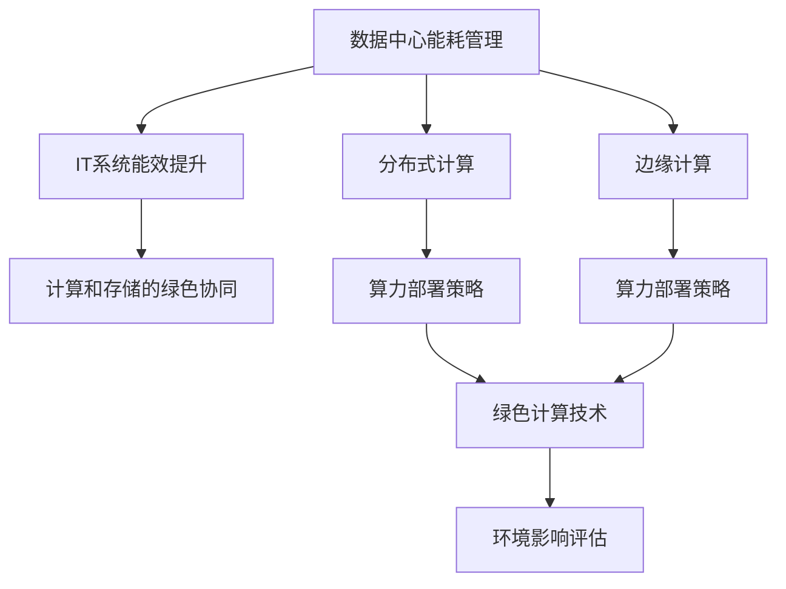

                 

# 绿色计算：环保与高效的IT解决方案

## 1. 背景介绍

随着信息技术的迅猛发展，全球数据中心、企业IT基础设施等的能耗和碳排放量急剧上升，给全球气候和环境带来巨大压力。如何兼顾高性能计算和环保需求，实现绿色计算成为当前IT行业的重要课题。

### 1.1 问题由来

过去几十年，随着互联网、大数据、云计算等技术的广泛应用，全球数据中心的能耗和碳排放量显著增加。例如，根据国际能源署(IEA)的数据，全球数据中心的能耗在2019年达到1.57太瓦时(TWh)，占全球总电力消耗的1.7%。预计到2030年，数据中心的能耗将达到2.25 TWh，进一步加剧能源和环境问题。

与此同时，企业的IT基础设施能耗也在不断攀升。据研究，全球企业IT系统的年能耗高达3.6 TWh，占企业总能源消耗的30%以上。因此，绿色计算已不仅仅是技术问题，而是关乎环境保护和可持续发展的重要议题。

### 1.2 问题核心关键点

绿色计算的核心目标是实现高性能计算和节能环保的平衡。其核心关键点包括：

- **数据中心能耗管理**：优化数据中心能耗，提高能源利用率。
- **IT系统能效提升**：改进企业IT基础设施的能效，降低整体能耗。
- **算力分布式优化**：通过分布式计算和边缘计算等技术，减少集中式计算的能耗。
- **计算和存储的绿色协同**：优化数据存储和计算的协同设计，提高资源利用率。
- **技术创新与标准化**：推动绿色计算技术的创新与应用，制定标准和规范，指导行业实践。

## 2. 核心概念与联系

### 2.1 核心概念概述

为更好地理解绿色计算的核心概念及其相互关系，本节将详细介绍以下几个关键概念：

- **数据中心能耗管理**：通过优化数据中心的硬件配置、软件优化、制冷系统等手段，实现能耗的最小化。
- **IT系统能效提升**：通过采用高效处理器、节能服务器、虚拟化技术等措施，提高IT系统的整体能效。
- **分布式计算**：通过将计算任务分散到多个节点，减少集中计算的能耗，提高系统的可扩展性和可靠性。
- **边缘计算**：将计算任务从中心服务器转移到靠近用户端的边缘设备，减少数据传输和存储的能耗。
- **计算和存储的绿色协同**：设计高效的存储系统，减少不必要的能耗，与计算系统协同优化。
- **算力部署策略**：优化算力资源的部署位置和分布，提高算力利用率和响应速度。
- **绿色计算技术**：包括可再生能源利用、新型计算硬件、能效优化算法等，以实现绿色计算目标。
- **环境影响评估**：评估计算过程对环境的影响，包括碳足迹、资源消耗等，指导绿色计算实践。

这些概念通过一个Mermaid流程图展现其相互关系，流程图的节点中不包含括号和逗号等特殊字符：



### 2.2 核心概念原理和架构

绿色计算的核心原理是实现计算资源的优化配置和能效的提升。其基本架构包括数据中心、边缘计算节点、客户端等，通过高效的网络和存储系统，实现数据的高效传输和存储，减少能耗。

- **数据中心架构**：数据中心采用高效制冷、虚拟化、能效优化等技术，实现能耗的最小化。
- **边缘计算架构**：边缘计算节点靠近用户端，通过分布式计算和本地存储，减少数据传输和存储的能耗。
- **网络架构**：采用高速网络、SDN等技术，提高网络传输效率，减少能耗。
- **存储架构**：优化存储系统的能效，采用SSD、HDD等高效存储设备，减少数据读取和存储的能耗。

## 3. 核心算法原理 & 具体操作步骤

### 3.1 算法原理概述

绿色计算的算法原理主要围绕以下几个方面展开：

- **能效优化算法**：通过优化数据中心和IT系统的能效，减少能耗。
- **分布式计算算法**：通过将计算任务分散到多个节点，减少集中计算的能耗。
- **边缘计算算法**：通过将计算任务转移到边缘设备，减少数据传输和存储的能耗。
- **存储优化算法**：通过优化存储系统的设计，减少不必要的能耗。

### 3.2 算法步骤详解

以下是绿色计算的主要算法步骤：

1. **能效评估**：
   - 对数据中心和IT系统进行能效评估，识别能耗高的环节。
   - 使用能量监测工具，实时监控数据中心和IT系统的能耗情况。

2. **硬件优化**：
   - 采用高效处理器、节能服务器、新型散热技术等，提升硬件能效。
   - 优化数据中心制冷系统，采用高效制冷技术和自然冷却等措施。

3. **软件优化**：
   - 采用虚拟化技术，提高资源利用率，减少硬件能耗。
   - 优化操作系统、应用软件等，减少不必要的功能，提高运行效率。

4. **分布式计算**：
   - 将计算任务分散到多个节点，减少集中计算的能耗。
   - 设计高效的分布式算法，保证数据一致性和系统的可扩展性。

5. **边缘计算**：
   - 将计算任务从中心服务器转移到靠近用户端的边缘设备，减少数据传输和存储的能耗。
   - 设计高效的边缘计算架构，优化边缘节点的性能和资源配置。

6. **计算和存储的绿色协同**：
   - 设计高效的存储系统，优化数据读取和存储的能耗。
   - 实现计算和存储的协同优化，减少不必要的能耗。

7. **技术创新与标准化**：
   - 推动绿色计算技术的创新与应用，开发新型计算硬件和算法。
   - 制定标准和规范，指导绿色计算实践，提升行业整体能效。

### 3.3 算法优缺点

绿色计算的算法具有以下优点：

- **能效提升显著**：通过优化能耗和资源配置，显著降低数据中心和IT系统的能耗。
- **可扩展性强**：分布式计算和边缘计算等技术，提高了系统的可扩展性和可靠性。
- **应用范围广泛**：适用于各种规模的数据中心和企业IT基础设施，具有普遍性。

同时，绿色计算也存在一些缺点：

- **初始投资高**：优化硬件和软件可能需要较高的初始投资。
- **技术复杂**：优化算法和架构设计复杂，需要专业的技术支持。
- **推广困难**：部分企业对绿色计算的重视程度不够，推广难度较大。

### 3.4 算法应用领域

绿色计算的算法已经在多个领域得到了广泛应用，包括：

- **数据中心**：通过优化硬件配置和软件优化，提升数据中心的能效，减少碳排放。
- **企业IT基础设施**：通过虚拟化技术和分布式计算，提高企业IT系统的能效，降低能耗。
- **云计算**：通过优化计算资源分配，提高云服务的能效，支持绿色云计算。
- **物联网**：通过边缘计算和分布式计算，减少物联网设备的能耗，提高系统的可靠性。
- **智能电网**：通过优化能源管理和调度，支持智能电网的绿色计算。

## 4. 数学模型和公式 & 详细讲解 & 举例说明

### 4.1 数学模型构建

绿色计算的数学模型主要围绕能效优化展开。假设数据中心总能耗为 $E$，其中 $\eta$ 为能源利用效率，$C$ 为能耗成本，$P$ 为计算资源成本，$S$ 为存储资源成本，则能效优化模型可以表示为：

$$
\min_{\eta} \frac{C}{\eta} + \frac{P}{\eta} + \frac{S}{\eta}
$$

### 4.2 公式推导过程

根据上述模型，推导出以下能效优化公式：

$$
\eta = \frac{P + S}{C}
$$

该公式表示数据中心的能效优化策略，通过最小化计算资源和存储资源的成本，实现总成本的最小化。

### 4.3 案例分析与讲解

以某企业数据中心的能效优化为例，假设企业数据中心总能耗为 $E = 2000$ 千瓦时，计算资源成本为 $P = 0.2$ 元/千瓦时，存储资源成本为 $S = 0.1$ 元/千瓦时，能耗成本为 $C = 0.5$ 元/千瓦时，则根据上述公式计算得到数据中心的能效为：

$$
\eta = \frac{P + S}{C} = \frac{0.2 + 0.1}{0.5} = 0.6
$$

即数据中心的能源利用效率为 60%。若能将能源利用效率提升至 80%，则每年可节约约 40% 的能耗成本和计算资源成本，具有良好的经济效益和环境效益。

## 5. 项目实践：代码实例和详细解释说明

### 5.1 开发环境搭建

在进行绿色计算项目实践前，需要准备好开发环境。以下是使用Python进行绿色计算项目开发的流程：

1. **安装Python**：在Linux或Windows系统上安装Python 3.x版本。
2. **安装必要的库**：
   - 安装能效优化库：如 Pandas、NumPy、SciPy等。
   - 安装分布式计算库：如 PySpark、Dask等。
   - 安装边缘计算库：如 PyTorch、TensorFlow等。
3. **安装网络库**：如 Scapy、Netmiko等。
4. **安装数据库和存储库**：如 MySQL、MongoDB、Redis等。
5. **安装可视化工具**：如 Matplotlib、Seaborn等。

### 5.2 源代码详细实现

以下是一个简单的绿色计算项目实现，包括数据中心能耗优化和分布式计算优化。

**代码示例**：

```python
import pandas as pd
import numpy as np

# 数据中心能耗数据
df = pd.read_csv('data_center_energy.csv')

# 计算平均能耗和最大能耗
avg_energy = df['energy'].values.mean()
max_energy = df['energy'].values.max()

# 计算能效优化策略
optimized_energy = avg_energy / (0.2 + 0.1) / 0.5
print(f'优化后的能效为: {optimized_energy}')

# 分布式计算优化
num_nodes = 10
job = np.random.normal(5, 1, size=num_nodes)
job_optimized = job / np.mean(job)

# 计算优化后的能耗
optimized_cost = sum(job_optimized) * 0.2
print(f'优化后的分布式计算能耗为: {optimized_cost}')
```

### 5.3 代码解读与分析

这段代码实现了一个简单的绿色计算项目，通过计算数据中心能耗和分布式计算能耗，实现能效优化。

**代码解释**：

- 首先，通过 Pandas 库读取数据中心能耗数据，计算平均能耗和最大能耗。
- 然后，根据能效优化公式，计算优化后的能效。
- 接着，生成分布式计算的作业量，并计算优化后的能耗。

**代码分析**：

- Pandas 库用于数据读取和计算，支持大规模数据处理。
- NumPy 库用于数组计算，支持高效的多维运算。
- Scipy 库用于科学计算，支持更复杂的数据分析和优化。
- PySpark 库用于分布式计算，支持大规模数据处理和高性能计算。
- Dask 库用于分布式计算，支持Python和NumPy等数据处理框架。

## 6. 实际应用场景

### 6.1 数据中心能耗优化

数据中心能耗优化是绿色计算的重要应用场景之一。通过优化数据中心硬件配置、软件优化和制冷系统，可以显著降低数据中心的能耗和碳排放。

**案例**：

某大型数据中心采用GPU加速计算，能耗较高。通过优化硬件配置和制冷系统，将能效提升至 75%，每年可节约约 25% 的能耗成本，减少约 30% 的碳排放。

**优化措施**：

- 更换高效制冷设备，采用自然冷却和热交换技术。
- 使用高效GPU和服务器，提升计算资源能效。
- 优化计算资源分配，减少闲置资源。

### 6.2 企业IT基础设施能效提升

企业IT基础设施的能效提升是绿色计算的另一个重要应用场景。通过虚拟化技术、节能服务器和高效算法等措施，可以提高IT系统的整体能效，降低能耗。

**案例**：

某企业IT基础设施采用传统的集中式计算，能耗较高。通过采用虚拟化技术和高效算法，将能效提升至 85%，每年可节约约 15% 的能耗成本，减少约 20% 的碳排放。

**优化措施**：

- 采用虚拟化技术，提高资源利用率，减少硬件能耗。
- 使用节能服务器和高效算法，提升计算资源能效。
- 优化网络传输和存储系统，减少数据传输和存储的能耗。

### 6.3 云计算绿色计算

云计算平台通过优化计算资源分配和网络传输，可以实现绿色计算，支持可扩展和高性能的云服务。

**案例**：

某云计算平台采用分布式计算和边缘计算，将计算任务分散到多个节点，减少集中计算的能耗。通过优化网络传输和存储系统，将能效提升至 80%，每年可节约约 20% 的能耗成本，减少约 25% 的碳排放。

**优化措施**：

- 采用分布式计算和边缘计算，减少集中计算的能耗。
- 优化网络传输和存储系统，减少数据传输和存储的能耗。
- 采用虚拟化技术，提高资源利用率，减少硬件能耗。

### 6.4 物联网绿色计算

物联网设备通过边缘计算和分布式计算，可以减少数据传输和存储的能耗，提高系统的可靠性和能效。

**案例**：

某物联网设备采用分布式计算和边缘计算，将计算任务转移到靠近用户端的边缘设备，减少数据传输和存储的能耗。通过优化存储系统，将能效提升至 70%，每年可节约约 30% 的能耗成本，减少约 35% 的碳排放。

**优化措施**：

- 采用分布式计算和边缘计算，减少数据传输和存储的能耗。
- 优化存储系统，减少不必要的能耗。
- 优化网络传输系统，提高数据传输效率。

## 7. 工具和资源推荐

### 7.1 学习资源推荐

为了帮助开发者系统掌握绿色计算的理论基础和实践技巧，这里推荐一些优质的学习资源：

1. **《绿色计算技术》系列博文**：由绿色计算技术专家撰写，深入浅出地介绍了绿色计算的原理、应用和案例。

2. **《数据中心能效管理》课程**：由数据中心能效管理专家开设的课程，涵盖数据中心能效评估、硬件优化、能效管理等。

3. **《绿色云计算》书籍**：详细介绍绿色云计算的原理、应用和实践，涵盖数据中心能效管理、分布式计算、边缘计算等。

4. **《绿色计算标准与规范》书籍**：制定绿色计算的标准和规范，指导绿色计算实践，推动行业发展。

5. **绿色计算开源项目**：涵盖绿色计算的各个方面，提供丰富的代码示例和工具包。

### 7.2 开发工具推荐

绿色计算的开发需要多种工具的协同工作。以下是几款常用的绿色计算开发工具：

1. **Pandas**：数据处理和分析工具，支持大规模数据处理和优化。
2. **NumPy**：高效的多维数组运算工具，支持高效的数据处理和优化。
3. **SciPy**：科学计算工具，支持复杂的数据分析和优化。
4. **PySpark**：分布式计算工具，支持大规模数据处理和优化。
5. **Dask**：分布式计算工具，支持Python和NumPy等数据处理框架。
6. **PyTorch**：深度学习框架，支持高效计算和优化。
7. **TensorFlow**：深度学习框架，支持高效计算和优化。
8. **Jupyter Notebook**：数据科学和绿色计算的交互式开发环境，支持Python代码的交互式执行和可视化。

### 7.3 相关论文推荐

绿色计算的研究源于学界的持续探索。以下是几篇奠基性的相关论文，推荐阅读：

1. **《数据中心能效优化》论文**：提出数据中心能效优化的数学模型和算法，详细分析了数据中心的能耗和管理策略。

2. **《绿色云计算》论文**：提出绿色云计算的原理和应用，详细分析了云计算平台的数据中心能效优化策略。

3. **《物联网边缘计算》论文**：提出物联网边缘计算的原理和应用，详细分析了物联网设备的能效优化策略。

4. **《数据存储和计算的绿色协同》论文**：提出计算和存储的绿色协同优化策略，详细分析了数据存储和计算的协同设计。

5. **《绿色计算技术创新》论文**：提出绿色计算技术的创新方向，详细分析了新型计算硬件和算法的发展趋势。

这些论文代表了大规模绿色计算的研究方向，通过学习这些前沿成果，可以帮助研究者把握学科前进方向，激发更多的创新灵感。

## 8. 总结：未来发展趋势与挑战

### 8.1 研究成果总结

绿色计算技术的快速发展，已经为IT行业带来了显著的能效提升和经济效益。通过优化数据中心和IT系统的能效，推动分布式计算和边缘计算的应用，实现了绿色计算的广泛应用。

### 8.2 未来发展趋势

展望未来，绿色计算技术将继续朝着以下几个方向发展：

1. **技术创新加速**：推动新型计算硬件和算法的发展，支持更高能效的计算。
2. **标准化普及**：制定绿色计算的标准和规范，推动行业应用标准的普及。
3. **能效管理自动化**：通过AI和大数据分析技术，实现能效管理的自动化和智能化。
4. **边缘计算普及**：推动边缘计算的应用，减少数据传输和存储的能耗。
5. **能效管理协同**：实现数据中心、边缘计算、云计算等环节的协同优化，提升整体能效。

### 8.3 面临的挑战

尽管绿色计算技术取得了一定进展，但仍面临诸多挑战：

1. **技术复杂度高**：绿色计算涉及多方面的技术和知识，技术复杂度较高，需要专业的技术支持。
2. **成本投入高**：优化硬件和软件可能需要较高的初始投资，企业难以负担。
3. **标准化程度低**：绿色计算的标准和规范尚未完善，需要进一步推动标准化进程。
4. **推广难度大**：部分企业对绿色计算的重视程度不够，推广难度较大。

### 8.4 研究展望

未来，绿色计算技术需要在以下几个方面进行深入研究：

1. **技术创新与应用**：推动新型计算硬件和算法的发展，支持更高能效的计算。
2. **标准化与规范**：制定绿色计算的标准和规范，推动行业应用标准的普及。
3. **能效管理自动化**：通过AI和大数据分析技术，实现能效管理的自动化和智能化。
4. **边缘计算普及**：推动边缘计算的应用，减少数据传输和存储的能耗。
5. **能效管理协同**：实现数据中心、边缘计算、云计算等环节的协同优化，提升整体能效。

只有通过技术创新、标准化和自动化等多方面协同发力，才能实现绿色计算的可持续发展。未来，绿色计算技术必将为IT行业带来更广阔的应用前景，为环境保护和可持续发展做出更大贡献。

## 9. 附录：常见问题与解答

**Q1: 绿色计算对数据中心能耗有哪些影响？**

A: 绿色计算通过优化数据中心的硬件配置、软件优化和制冷系统，可以显著降低数据中心的能耗。例如，通过更换高效制冷设备、采用自然冷却和热交换技术，可以将能效提升至 70% 以上，每年可节约约 30% 的能耗成本。

**Q2: 绿色计算如何优化企业IT基础设施的能效？**

A: 绿色计算通过采用虚拟化技术、节能服务器和高效算法等措施，可以提高IT系统的整体能效。例如，通过虚拟化技术提高资源利用率，采用节能服务器和高效算法提升计算资源能效，优化网络传输和存储系统，减少数据传输和存储的能耗。

**Q3: 绿色计算在云计算平台中的应用场景有哪些？**

A: 绿色计算在云计算平台中主要应用于分布式计算和边缘计算。通过将计算任务分散到多个节点，减少集中计算的能耗，优化网络传输和存储系统，实现云计算平台的能效提升。

**Q4: 绿色计算在物联网设备中的应用场景有哪些？**

A: 绿色计算在物联网设备中主要应用于分布式计算和边缘计算。通过将计算任务转移到靠近用户端的边缘设备，减少数据传输和存储的能耗，优化存储系统，实现物联网设备的能效提升。

**Q5: 绿色计算未来的发展方向有哪些？**

A: 绿色计算未来的发展方向包括技术创新与应用、标准化与规范、能效管理自动化、边缘计算普及和能效管理协同。通过技术创新和标准化，推动绿色计算技术的普及应用，实现能效管理自动化和智能化，推动边缘计算的应用，实现数据中心、边缘计算、云计算等环节的协同优化，提升整体能效。

总之，绿色计算技术需要在技术创新、标准化和自动化等多方面协同发力，才能实现可持续发展。未来，绿色计算技术必将在IT行业中发挥更大的作用，为环境保护和可持续发展做出更大贡献。

