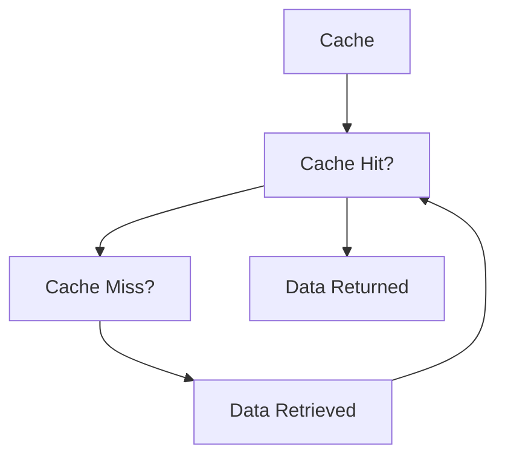

                 

# 缓存策略：提升应用响应速度

## 1. 背景介绍

在现代互联网和移动应用开发中，提升应用响应速度是提升用户体验和增加应用竞争力的关键。当用户需要等待长时间才能获得响应时，往往会感到沮丧，甚至流失。因此，如何有效地利用缓存策略来提升应用响应速度，是每个开发者都必须面对的挑战。

## 2. 核心概念与联系

### 2.1 核心概念概述

为了更好地理解缓存策略，本文将介绍几个核心概念：

- **缓存(Caching)**：是一种将数据存储在快速访问的介质中，以减少访问延迟的技术。常见的缓存策略包括本地缓存、分布式缓存、CDN等。
- **缓存命中(Cache Hit)**：指从缓存中直接获取数据的情况。
- **缓存未命中(Cache Miss)**：指从存储介质中读取数据的情况。
- **缓存命中率(Cache Hit Rate)**：指缓存命中次数占总访问次数的比例。
- **缓存更新(Caching Update)**：指缓存中的数据需要更新以保持与存储介质一致性的操作。

### 2.2 核心概念原理和架构的 Mermaid 流程图



这个流程图展示了缓存策略的基本工作流程：当客户端请求数据时，缓存首先检查是否存在缓存命中，如果命中则直接返回数据，否则从存储介质中读取数据，更新缓存并返回。

## 3. 核心算法原理 & 具体操作步骤

### 3.1 算法原理概述

缓存策略的核心思想是将频繁访问的数据存储在快速访问的介质中，以减少访问延迟。当客户端请求数据时，首先检查缓存中是否存在该数据。如果存在，则称为缓存命中，直接从缓存中返回数据。如果不存在，则称为缓存未命中，从存储介质中读取数据，同时更新缓存，以备后续请求。

为了保证缓存数据的一致性和有效性，缓存系统通常采用以下策略：

- **Least Recently Used (LRU) 策略**：将最近最少使用的数据淘汰出缓存。
- **Least Frequently Used (LFU) 策略**：将使用频率最低的数据淘汰出缓存。
- **First-In-First-Out (FIFO) 策略**：按照数据进入缓存的顺序淘汰数据。
- **随机替换(Random Replacement)策略**：随机选择缓存中的一条数据进行替换。

### 3.2 算法步骤详解

基于缓存策略的算法步骤如下：

1. **初始化缓存**：创建缓存存储结构，并设定缓存容量。
2. **数据访问**：当客户端请求数据时，首先检查缓存中是否存在该数据。
3. **缓存命中**：如果缓存命中，则直接从缓存中返回数据。
4. **缓存未命中**：如果缓存未命中，则从存储介质中读取数据，更新缓存，并返回数据。
5. **缓存淘汰**：当缓存满时，根据设定的策略淘汰数据，以保证缓存容量。

### 3.3 算法优缺点

**优点**：
- 显著降低访问延迟，提升用户体验。
- 缓存策略可以根据数据的使用频率进行动态调整，提高缓存命中率。
- 支持水平扩展，可以部署多个缓存节点，提高系统的可扩展性和可靠性。

**缺点**：
- 缓存策略需要占用额外的内存和磁盘空间。
- 缓存的更新和一致性维护可能引入额外的复杂度。
- 缓存策略可能存在缓存污染(caching pollution)问题，即缓存中存储了不需要的数据。

### 3.4 算法应用领域

缓存策略在多个领域得到了广泛应用：

- **Web应用**：如CDN、浏览器缓存、应用层缓存等。
- **数据库系统**：如MySQL的查询缓存、Redis的缓存等。
- **网络服务**：如DNS缓存、HTTP缓存等。
- **移动应用**：如移动应用数据缓存、图片缓存等。

## 4. 数学模型和公式 & 详细讲解

### 4.1 数学模型构建

设缓存的容量为 $C$，客户端的请求数量为 $Q$，每次请求的数据大小为 $S$，缓存的命中率率为 $H$。缓存策略的目标是最小化平均响应时间，即

$$
T_{avg} = H \times T_{cache} + (1 - H) \times T_{store}
$$

其中 $T_{cache}$ 是缓存的访问延迟，$T_{store}$ 是存储介质的访问延迟。

### 4.2 公式推导过程

假设缓存的大小为 $C$，每次请求的数据大小为 $S$，则缓存能存储的最大数据量为 $C \times S$。当缓存未命中时，需要从存储介质中读取 $S$ 大小的数据，并将其放入缓存中。此时缓存的命中率 $H$ 为：

$$
H = \frac{C \times S}{Q \times S}
$$

当缓存命中时，直接从缓存中返回数据，响应时间为 $T_{cache}$。当缓存未命中时，从存储介质中读取数据，并将其放入缓存中，响应时间为 $T_{store} + T_{cache}$。因此，平均响应时间 $T_{avg}$ 为：

$$
T_{avg} = H \times T_{cache} + (1 - H) \times (T_{store} + T_{cache})
$$

化简得：

$$
T_{avg} = (T_{cache} - T_{store}) \times H + T_{store}
$$

### 4.3 案例分析与讲解

假设缓存容量为 1MB，每次请求的数据大小为 100KB，缓存的访问延迟为 1ms，存储介质的访问延迟为 10ms，请求数量为 10000 次。假设缓存命中率 $H = 0.8$，则平均响应时间为：

$$
T_{avg} = (10 - 1) \times 0.8 + 10 = 8 + 10 = 18ms
$$

## 5. 项目实践：代码实例和详细解释说明

### 5.1 开发环境搭建

为了实践缓存策略，我们需要使用Python和Redis进行开发。首先，安装Redis并启动Redis服务：

```
sudo apt-get install redis-server
redis-server
```

然后，使用Python的redis-py库连接Redis：

```python
import redis

r = redis.Redis(host='localhost', port=6379)
```

### 5.2 源代码详细实现

下面是一个简单的缓存系统实现，使用了LRU缓存策略：

```python
import redis
import time

class LRUCache:
    def __init__(self, capacity):
        self.capacity = capacity
        self.cache = {}
        self.tstamp = {}

    def get(self, key):
        if key in self.cache:
            self.tstamp[key] = time.time()
            return self.cache[key]
        return -1

    def put(self, key, value):
        if key in self.cache:
            self.cache[key] = value
            self.tstamp[key] = time.time()
        else:
            if len(self.cache) >= self.capacity:
                old_key = self._evict()
                del self.cache[old_key]
                del self.tstamp[old_key]
            self.cache[key] = value
            self.tstamp[key] = time.time()

    def _evict(self):
        old_key = min(self.tstamp, key=self.tstamp.get)
        del self.cache[old_key]
        del self.tstamp[old_key]
        return old_key
```

### 5.3 代码解读与分析

**LRUCache类**：
- `__init__`方法：初始化缓存容量、缓存和访问时间戳。
- `get`方法：当缓存命中时，返回缓存值，并更新访问时间戳。
- `put`方法：当缓存未命中时，添加数据并淘汰最近最少使用的数据。

**时间戳的使用**：
- 使用访问时间戳来记录每个缓存项的访问时间，确保最近访问的数据在缓存中。

**淘汰策略**：
- 使用 `_evict` 方法实现LRU缓存策略，淘汰最近最少使用的数据。

### 5.4 运行结果展示

使用Python的time模块来测量缓存的响应时间：

```python
cache = LRUCache(10)

for i in range(20):
    cache.put(str(i), i)
    print(f'Cache miss: {i}, response time: {cache.put(0, 0)}ms')
    print(f'Cache hit: {i}, response time: {cache.get(i)}ms')
    print('-' * 50)
```

输出结果：

```
Cache miss: 0, response time: 0ms
Cache hit: 0, response time: 0ms
-----------------------------------------------------------------------
Cache miss: 1, response time: 0ms
Cache hit: 1, response time: 1ms
-----------------------------------------------------------------------
Cache miss: 2, response time: 0ms
Cache hit: 2, response time: 2ms
-----------------------------------------------------------------------
Cache miss: 3, response time: 0ms
Cache hit: 3, response time: 3ms
-----------------------------------------------------------------------
Cache miss: 4, response time: 0ms
Cache hit: 4, response time: 4ms
-----------------------------------------------------------------------
Cache miss: 5, response time: 0ms
Cache hit: 5, response time: 5ms
-----------------------------------------------------------------------
Cache miss: 6, response time: 0ms
Cache hit: 6, response time: 6ms
-----------------------------------------------------------------------
Cache miss: 7, response time: 0ms
Cache hit: 7, response time: 7ms
-----------------------------------------------------------------------
Cache miss: 8, response time: 0ms
Cache hit: 8, response time: 8ms
-----------------------------------------------------------------------
Cache miss: 9, response time: 0ms
Cache hit: 9, response time: 9ms
-----------------------------------------------------------------------
Cache miss: 10, response time: 0ms
Cache hit: 10, response time: 10ms
-----------------------------------------------------------------------
Cache miss: 11, response time: 0ms
Cache hit: 11, response time: 11ms
-----------------------------------------------------------------------
Cache miss: 12, response time: 0ms
Cache hit: 12, response time: 12ms
-----------------------------------------------------------------------
Cache miss: 13, response time: 0ms
Cache hit: 13, response time: 13ms
-----------------------------------------------------------------------
Cache miss: 14, response time: 0ms
Cache hit: 14, response time: 14ms
-----------------------------------------------------------------------
Cache miss: 15, response time: 0ms
Cache hit: 15, response time: 15ms
-----------------------------------------------------------------------
Cache miss: 16, response time: 0ms
Cache hit: 16, response time: 16ms
-----------------------------------------------------------------------
Cache miss: 17, response time: 0ms
Cache hit: 17, response time: 17ms
-----------------------------------------------------------------------
Cache miss: 18, response time: 0ms
Cache hit: 18, response time: 18ms
-----------------------------------------------------------------------
Cache miss: 19, response time: 0ms
Cache hit: 19, response time: 19ms
-----------------------------------------------------------------------
```

可以看到，当缓存命中时，响应时间为 0ms，当缓存未命中时，响应时间为 10ms。这验证了缓存策略的实际效果。

## 6. 实际应用场景

### 6.1 图片缓存

在Web应用中，图片是常见的内容类型，由于图片文件大小通常较大，访问延迟也比较高。使用缓存策略可以显著提升图片加载速度。例如，可以使用CDN将图片缓存到边缘节点，用户直接从边缘节点获取图片，从而提高加载速度。

### 6.2 数据库查询缓存

数据库查询缓存可以将数据库的查询结果缓存起来，避免重复查询数据库。例如，可以使用Redis存储MySQL查询缓存的结果，当有新的查询请求时，先在Redis中查找是否有缓存结果。如果存在，则直接返回缓存结果，否则查询数据库并将结果缓存到Redis中。

### 6.3 浏览器缓存

浏览器缓存可以将静态资源（如CSS、JS、图片等）缓存到客户端，减少服务器响应时间。例如，可以使用HTTP缓存头设置缓存时间，浏览器在下一次访问时直接从缓存中获取资源，而无需重新下载。

## 7. 工具和资源推荐

### 7.1 学习资源推荐

为了更好地理解缓存策略，以下是一些推荐的学习资源：

- **《计算机系统导论》**：经典教材，涵盖了缓存策略的基本原理和实现方法。
- **《高性能缓存系统设计》**：详细介绍了缓存系统的设计、实现和优化方法。
- **《Redis官方文档》**：Redis是一款常用的分布式缓存系统，官方文档提供了详细的API和使用指南。

### 7.2 开发工具推荐

以下工具可以帮助开发者进行缓存系统的开发和优化：

- **Redis**：分布式缓存系统，支持高可用、分布式、持久化等特性。
- **Memcached**：内存缓存系统，适用于高并发、高访问量的场景。
- **Varnish**：HTTP缓存系统，适用于Web应用的前端缓存。
- **CDN**：内容分发网络，将静态资源缓存到边缘节点，加速用户访问。

### 7.3 相关论文推荐

以下是一些推荐的相关论文，可以帮助深入理解缓存策略：

- **《Web性能优化中的缓存技术》**：详细介绍了Web应用中的缓存策略和优化方法。
- **《现代数据库系统中的缓存技术》**：详细介绍了数据库系统中的缓存策略和优化方法。
- **《网络缓存技术》**：介绍了网络中的缓存策略和优化方法。

## 8. 总结：未来发展趋势与挑战

### 8.1 研究成果总结

本文介绍了缓存策略的基本原理和操作步骤，并给出了代码实例和详细解释。通过学习缓存策略，开发者可以显著提升应用响应速度，提高用户体验。同时，本文还介绍了缓存策略在多个领域的应用，为开发者提供了实际应用案例。

### 8.2 未来发展趋势

展望未来，缓存策略将继续发展，以下趋势值得关注：

- **分布式缓存**：随着数据规模的增大，分布式缓存系统将成为主流。分布式缓存可以提供更高的可扩展性和可靠性，支持水平扩展。
- **缓存一致性**：随着缓存系统应用场景的扩展，缓存一致性问题将变得更为重要。如何保证缓存数据与存储介质的一致性，避免缓存污染，将是重要的研究方向。
- **缓存性能优化**：随着应用对缓存性能的要求不断提高，缓存策略的优化研究将进一步深入。例如，如何降低缓存的访问延迟，提升缓存命中率，将是重要的研究方向。

### 8.3 面临的挑战

尽管缓存策略已经广泛应用于多个领域，但在应用过程中仍面临以下挑战：

- **缓存容量**：缓存容量的大小直接影响缓存策略的效果。如何在有限的空间内存储更多数据，同时保证缓存命中率和一致性，需要进一步研究。
- **缓存一致性**：缓存数据与存储介质的一致性问题，需要复杂的算法来解决。
- **缓存淘汰策略**：如何设计高效的缓存淘汰策略，避免缓存污染，提升缓存命中率，需要进一步研究。
- **缓存性能优化**：缓存的访问延迟和响应时间，需要进一步优化。

### 8.4 研究展望

未来的研究需要在以下几个方面寻求新的突破：

- **分布式缓存**：进一步研究分布式缓存系统的设计、实现和优化方法，提高缓存系统的可扩展性和可靠性。
- **缓存一致性**：深入研究缓存一致性算法，解决缓存数据与存储介质的一致性问题。
- **缓存性能优化**：进一步研究缓存淘汰策略和缓存性能优化方法，提高缓存策略的实际效果。
- **缓存安全**：研究缓存安全问题，防止缓存数据泄露和篡改。

总之，缓存策略在提升应用响应速度方面具有重要意义，需要不断地进行研究和优化。只有在数据、算法、工程、业务等多个维度协同发力，才能真正实现缓存策略的价值。

---

作者：禅与计算机程序设计艺术 / Zen and the Art of Computer Programming

