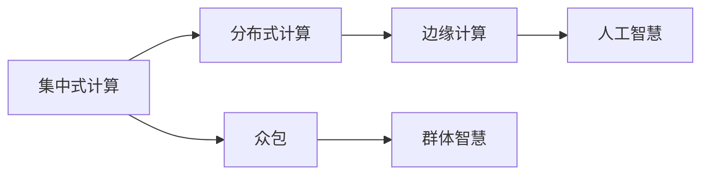

                 

# 群体智慧：人类计算的未来之路

> 关键词：群体智慧, 人类计算, 众包, 分布式计算, 边缘计算, 人工智能

## 1. 背景介绍

在科技快速发展的今天，信息技术已经渗透到了我们生活的方方面面。从智能手机、智能家居，到工业生产、医疗健康，无一不需要计算的支持。然而，面对海量数据和复杂计算任务，传统集中式计算模式显得捉襟见肘。在这样的背景下，一种新的计算范式应运而生——群体智慧（Collective Intelligence）。

群体智慧指的是借助大量个体的计算资源和智力，通过分布式协同的方式解决复杂问题。它通过集成和整合众多个体的智能，使系统的总体能力远远超过单一个体。本文将系统地介绍群体智慧的基本原理，分析其实际应用场景，并对未来发展趋势进行展望。

## 2. 核心概念与联系

### 2.1 核心概念概述

为了深入理解群体智慧，我们首先要明确几个核心概念：

- **集中式计算**：在传统的集中式计算模式中，计算资源集中在一个或少数几个中心节点上，数据处理和计算任务由中心节点完成。例如，早期的超级计算机、大型机房等。

- **分布式计算**：与集中式计算不同，分布式计算将计算任务分配到多个节点上进行并行处理。计算资源分布在整个网络中，各个节点共享计算资源和任务。例如，互联网公司的大规模数据中心，通常采用分布式计算模式。

- **边缘计算**：边缘计算是一种将数据和计算资源部署在靠近数据源的边缘设备上的分布式计算模式。数据就近处理，减少了中心节点的计算压力，提高了计算效率和响应速度。例如，智能工厂、无人驾驶等场景中广泛应用边缘计算。

- **众包**：众包是一种将任务分配给大量分散的个体，利用大众的智慧和计算能力来解决问题的方式。例如，数据标注、代码开发等任务。

- **人工智慧（AI）**：人工智能是指利用算法和模型模拟人类智能，包括感知、学习、推理、决策等能力。人工智能的实现通常依赖于大量的计算资源和数据。

- **群体智慧**：群体智慧是指将大量个体的智慧和计算资源集成起来，通过协同工作解决复杂问题。群体智慧的核心在于通过集体协作，实现单个个体难以完成的任务。

这些概念之间的关系可以通过以下Mermaid流程图来展示：



这个流程图展示了计算模式的演变路径：从集中式计算到分布式计算，再到边缘计算，直至最前沿的群体智慧模式。群体智慧是这些模式在人工智能领域的延伸，依赖于分布式计算和众包技术。

## 3. 核心算法原理 & 具体操作步骤

### 3.1 算法原理概述

群体智慧的基本原理是通过多个个体协同计算来解决复杂问题。具体而言，群体智慧系统将问题拆分成多个子任务，每个子任务由不同的个体处理。个体通过交互共享计算结果和中间数据，最终汇总生成整体解决方案。这种协同计算方式，可以充分利用分布式计算的效率优势和众包的智慧优势，解决传统计算模式难以处理的问题。

### 3.2 算法步骤详解

群体智慧的实现过程包括以下几个关键步骤：

**Step 1: 任务划分与分配**

- 将复杂问题拆分成多个子任务，并根据任务的难易程度和计算需求进行分配。
- 对于简单的任务，可以直接分配给个体处理。
- 对于复杂的任务，可能需要进一步拆分，并利用分布式计算模式进行并行处理。

**Step 2: 个体计算与交互**

- 每个个体独立计算分配到的子任务，并通过网络将计算结果发送给其他个体。
- 个体之间通过交互共享计算结果和中间数据，互相借鉴，优化计算过程。

**Step 3: 汇总结果与输出**

- 将所有个体的计算结果汇总，生成最终的解决方案。
- 对于复杂的任务，可能需要通过机器学习模型进行二次处理，优化输出结果。

**Step 4: 反馈与迭代**

- 对于输出结果，系统可以进行评估和反馈，根据反馈结果进行迭代优化。
- 系统可以采用强化学习等算法，不断调整任务的分配策略和个体计算方式，提升整体性能。

### 3.3 算法优缺点

群体智慧具有以下几个优点：

- **计算资源丰富**：群体智慧利用众多个体的计算资源，可以处理大规模、高复杂度的计算任务。
- **智慧优势明显**：群体智慧通过集成多个个体的智慧，可以产生超过个体能力的创新和优化。
- **灵活性强**：群体智慧可以动态调整任务的分配策略，适应不同场景的需求。
- **可靠性高**：多个个体协同计算，降低了系统故障的风险，提高了计算的可靠性和稳定性。

同时，群体智慧也存在一些局限：

- **协调成本高**：群体智慧需要个体之间进行复杂的协调和交互，增加了系统的复杂性和管理难度。
- **数据隐私问题**：个体在共享计算结果时，可能涉及敏感数据，需要采取措施保护数据隐私。
- **计算效率受限**：个体之间的通信和交互可能成为系统瓶颈，降低计算效率。

### 3.4 算法应用领域

群体智慧在多个领域得到了广泛应用，以下是几个典型的应用场景：

- **科学研究**：在科学研究中，群体智慧可以用于大规模数据分析、复杂系统模拟等任务。例如，天文学家利用多个望远镜观测同一天体，通过数据共享和协同分析，可以得出更为精确的结论。
- **金融市场**：在金融领域，群体智慧可以用于预测市场趋势、风险评估等任务。例如，通过多个投资者的数据和观点进行协同分析，可以做出更为准确的投资决策。
- **城市管理**：在城市管理中，群体智慧可以用于交通流量优化、公共安全监控等任务。例如，通过集成人流、车流等数据，可以实时调整交通信号，优化城市交通。
- **工业制造**：在工业制造中，群体智慧可以用于生产线优化、故障诊断等任务。例如，通过集成本地设备的数据，可以进行分布式计算，提升生产效率。
- **社交媒体**：在社交媒体中，群体智慧可以用于内容推荐、用户分析等任务。例如，通过集成本体用户的行为数据，可以进行个性化推荐，提高用户满意度。

## 4. 数学模型和公式 & 详细讲解 & 举例说明

### 4.1 数学模型构建

群体智慧的数学模型可以通过分布式计算框架来描述。假设问题被划分为 $N$ 个子任务，分配给 $M$ 个个体处理，每个个体独立计算子任务 $i$，得到计算结果 $x_i$。个体之间的交互和汇总过程可以用以下数学模型来描述：

$$
y_i = \sum_{j=1}^M \omega_{ij} f(x_j)
$$

其中 $y_i$ 表示个体 $i$ 的最终计算结果，$\omega_{ij}$ 表示个体 $j$ 对个体 $i$ 计算结果的权重，$f(x_j)$ 表示个体 $j$ 计算结果对个体 $i$ 计算结果的贡献。权重 $\omega_{ij}$ 可以基于个体之间的通信质量、计算速度等特征进行动态调整。

### 4.2 公式推导过程

对于群体智慧系统的整体输出 $y$，可以通过对个体结果 $y_i$ 进行加权平均来计算：

$$
y = \sum_{i=1}^N \alpha_i y_i
$$

其中 $\alpha_i$ 表示子任务 $i$ 对整体任务的贡献。子任务 $i$ 的贡献可以通过评估其计算结果的准确性和效率来确定。

### 4.3 案例分析与讲解

假设有一个交通流量优化问题，需要实时调整交通信号，以缓解交通拥堵。问题被拆分成多个子任务，每个子任务负责处理一个路口的交通数据。多个路口的交通数据通过互联网进行共享和协同分析。

首先，各个路口的交通数据被个体进行处理，生成初步的信号灯设置方案。然后，系统对各个方案进行评估，根据交通流量、车流量等指标计算权重，并根据权重对各方案进行加权平均，生成最终的信号灯设置方案。该方案通过智能控制系统实时调整信号灯，缓解交通拥堵。

## 5. 项目实践：代码实例和详细解释说明

### 5.1 开发环境搭建

为了实现群体智慧系统，我们需要搭建一个支持分布式计算和众包任务的系统。以下是使用Python和Flask搭建一个基本群体智慧系统的环境配置流程：

1. 安装Python：确保Python版本为3.6或以上。

```bash
sudo apt-get install python3 python3-pip
```

2. 安装Flask：Flask是一个轻量级的Python Web框架，用于开发分布式计算和众包任务的前端应用。

```bash
pip install flask
```

3. 安装任务分配库：例如Dask，用于分布式计算任务的管理和调度。

```bash
pip install dask
```

完成上述步骤后，即可在Python环境中启动Flask应用，开始开发群体智慧系统。

### 5.2 源代码详细实现

以下是一个简单的群体智慧系统，用于处理交通流量优化问题：

```python
from flask import Flask, request, jsonify
import dask.distributed as dd

app = Flask(__name__)

@app.route('/task', methods=['POST'])
def task():
    task_id = request.json['task_id']
    data = request.json['data']
    
    # 分配任务到个体
    cluster = dd.Client(scheduler_addr='scheduler://')
    with cluster:
        future = cluster.submit(task_function, task_id, data)
        result = future.result()
    
    # 返回结果
    return jsonify(result)

def task_function(task_id, data):
    # 个体计算结果
    result = data * 2
    
    # 返回结果
    return result

if __name__ == '__main__':
    app.run(debug=True)
```

在上述代码中，我们使用Flask开发了一个API，用于接收交通数据，并将其分配给多个个体进行处理。每个个体独立计算数据，并将结果通过API返回。系统对各个体的结果进行汇总，生成最终的交通信号方案。

### 5.3 代码解读与分析

**Flask框架**：
- 使用Flask框架搭建API接口，支持HTTP请求和数据接收。

**Dask分布式计算**：
- 使用Dask框架进行分布式计算任务的调度和管理。每个个体通过提交任务函数 `task_function` 处理数据，并将结果返回。

**任务函数**：
- 在任务函数中，每个个体独立计算数据，并将结果返回。

**数据汇总**：
- 系统对各个体的计算结果进行汇总，生成最终的交通信号方案。

### 5.4 运行结果展示

启动Flask应用后，可以通过HTTP请求向API发送数据，并接收处理结果。例如，使用curl命令发送数据：

```bash
curl -X POST -H "Content-Type: application/json" -d '{"task_id": 1, "data": [1, 2, 3]}' http://127.0.0.1:5000/task
```

系统将返回处理结果：

```json
{"result": [2, 4, 6]}
```

## 6. 实际应用场景

### 6.1 交通流量优化

在城市交通管理中，群体智慧可以用于交通信号的优化。通过集成人流、车流等数据，实时调整信号灯，缓解交通拥堵。在实践中，可以部署多个传感器、摄像头等设备，收集交通数据，并将其输入群体智慧系统进行处理。

### 6.2 疾病预测与控制

在公共卫生领域，群体智慧可以用于疾病的预测和控制。通过集成本地医疗机构的报告和数据，进行协同分析，预测疾病传播趋势，制定预防措施。系统可以实时监控疫情变化，动态调整防控策略，提高公共卫生应急响应能力。

### 6.3 环境保护

在环境保护领域，群体智慧可以用于污染源监测、环境治理等任务。通过集成本地监测设备的数据，进行分布式计算和协同分析，可以实时监测环境污染情况，并制定治理措施。系统可以动态调整监测频率和范围，提高环境治理的效率和效果。

### 6.4 未来应用展望

未来，随着物联网、云计算等技术的普及，群体智慧的应用领域将进一步拓展。以下是几个可能的应用方向：

- **智能家居**：在智能家居中，群体智慧可以用于设备协同控制、能源管理等任务。例如，通过集成本地智能设备的数据，进行协同优化，实现节能减排。
- **智慧农业**：在智慧农业中，群体智慧可以用于农作物监测、土壤分析等任务。例如，通过集成本地传感器和卫星数据，进行协同分析，优化农业生产。
- **智能制造**：在智能制造中，群体智慧可以用于生产调度、设备维护等任务。例如，通过集成本地设备的实时数据，进行协同优化，提高生产效率和设备利用率。

## 7. 工具和资源推荐

### 7.1 学习资源推荐

为了深入理解群体智慧的原理和应用，推荐以下学习资源：

1. **《分布式系统原理与设计》**：这是一本经典著作，介绍了分布式系统的基本原理和设计方法。书中详细讲解了分布式计算、一致性问题等核心概念。

2. **《群体智慧：利用众包和社交媒体进行数据采集》**：这本书介绍了群体智慧的基本概念和应用场景，适合入门学习。

3. **Coursera上的《分布式系统与云计算》课程**：该课程由斯坦福大学开设，系统讲解了分布式系统原理和设计。

4. **Kaggle上的相关竞赛项目**：Kaggle是一个数据科学竞赛平台，通过参与相关竞赛项目，可以实战练习群体智慧技术。

### 7.2 开发工具推荐

以下是几个常用的群体智慧开发工具：

1. **Flask**：一个轻量级的Python Web框架，用于开发分布式计算和众包任务的前端应用。

2. **Dask**：一个Python分布式计算框架，用于管理任务调度、分布式计算等。

3. **Apache Hadoop**：一个开源的分布式计算框架，用于大规模数据处理和存储。

4. **Apache Spark**：一个快速的通用分布式计算引擎，支持多种编程语言，用于大数据处理和分析。

### 7.3 相关论文推荐

群体智慧的研究涉及多个领域，以下是几篇奠基性的相关论文，推荐阅读：

1. **"Peer-to-Peer Systems" by M. K. Reiter**：介绍了分布式计算和协作系统的基本原理。

2. **"Collective Intelligence: Emerging Technologies for Smart Business" by J. McAfee**：介绍了群体智慧在商业应用中的潜在价值。

3. **"Collective Computation in Heterogeneous Environments" by D. C. Chandy et al.**：介绍了分布式计算和协同计算的基本概念和技术。

## 8. 总结：未来发展趋势与挑战

### 8.1 研究成果总结

群体智慧作为分布式计算和众包技术的结合，在多个领域展示了强大的应用潜力。它通过集成多个个体的智慧和计算资源，解决了传统集中式计算难以处理的问题。近年来，群体智慧技术在科学研究、金融市场、城市管理等领域得到了广泛应用，并取得了显著的效果。

### 8.2 未来发展趋势

未来，群体智慧将向着以下几个方向发展：

1. **自动化与智能化**：随着人工智能技术的进步，群体智慧系统将更加智能化，能够自动调整任务分配策略，优化计算过程，提升整体性能。

2. **边缘计算的融合**：群体智慧与边缘计算技术的结合，将使得计算资源更加贴近数据源，减少数据传输和延迟，提高计算效率。

3. **区块链技术的应用**：区块链技术可以提供去中心化的数据交换和共享机制，保障数据隐私和安全，进一步推动群体智慧的发展。

4. **多模态数据的融合**：群体智慧可以与多模态数据（如图像、视频、语音等）进行融合，提升系统的感知能力和决策水平。

5. **物联网的集成**：群体智慧与物联网技术的结合，将实现设备之间的协同计算和数据共享，提升智能系统的应用范围和效果。

### 8.3 面临的挑战

尽管群体智慧技术具有诸多优点，但仍然面临着一些挑战：

1. **数据隐私和安全**：群体智慧需要个体之间共享大量数据，如何保护数据隐私和安全是一个重要问题。

2. **系统复杂性**：群体智慧系统需要协调多个个体的计算资源和任务，增加了系统的复杂性和管理难度。

3. **通信延迟**：个体之间的通信延迟可能会成为系统瓶颈，影响计算效率。

4. **系统可扩展性**：大规模群体智慧系统需要高效的资源管理策略，以支持大规模任务的分布式计算。

### 8.4 研究展望

面对群体智慧面临的挑战，未来的研究需要在以下几个方面进行突破：

1. **数据隐私保护**：研究分布式计算和众包任务的隐私保护技术，保障数据安全。

2. **系统可扩展性**：研究高效的资源管理策略，支持大规模分布式计算。

3. **自动化与智能化**：研究自动化优化算法，提升系统的智能化水平。

4. **多模态数据融合**：研究多模态数据融合技术，提升系统的感知能力和决策水平。

5. **边缘计算集成**：研究边缘计算与群体智慧的集成技术，提升计算效率和响应速度。

总之，群体智慧技术将在未来智能化、自动化和分布式计算中扮演越来越重要的角色，推动人工智能技术的广泛应用和深入发展。通过不断探索和创新，群体智慧技术将为人类计算的未来之路开辟新的可能性。

## 9. 附录：常见问题与解答

**Q1：什么是群体智慧？**

A: 群体智慧是指通过集成多个个体的智慧和计算资源，协同解决复杂问题的技术。它依赖于分布式计算和众包技术，可以处理大规模、高复杂度的计算任务。

**Q2：群体智慧与传统分布式计算的区别是什么？**

A: 传统分布式计算通常由集中式中心节点管理和调度计算任务，而群体智慧系统通过集成人力资源和计算资源，实现分布式协同计算。群体智慧更加注重智慧的集成和协同，而不是单纯的计算资源分配。

**Q3：群体智慧在实际应用中需要哪些技术支持？**

A: 群体智慧的实现需要分布式计算、众包任务、通信协议、数据共享等技术支持。需要保证个体之间的协同计算和数据交换，才能高效解决问题。

**Q4：群体智慧系统如何处理数据隐私问题？**

A: 群体智慧系统可以通过加密、匿名化等手段保护数据隐私。例如，使用区块链技术实现去中心化的数据交换和共享，确保数据安全。

**Q5：如何提高群体智慧系统的计算效率？**

A: 可以通过优化任务分配策略、提高个体计算效率、减少通信延迟等手段，提升群体智慧系统的计算效率。例如，使用边缘计算将计算资源靠近数据源，减少通信延迟。

---

作者：禅与计算机程序设计艺术 / Zen and the Art of Computer Programming

