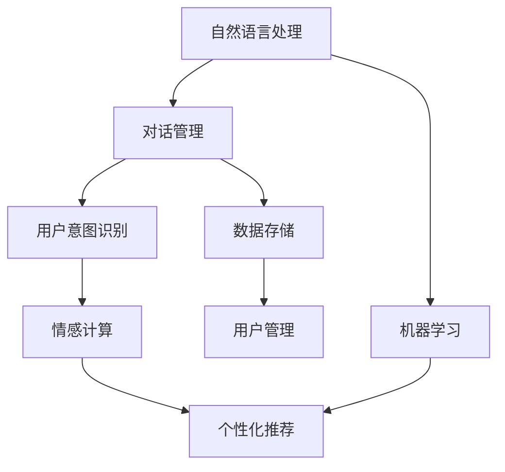

                 

# 聊天机器人创业：创新和初创企业

## 1. 背景介绍

随着人工智能技术的不断成熟，聊天机器人（Chatbot）逐渐成为了全球科技创业的热点之一。特别是在新冠疫情期间，由于社交距离和居家办公的需求，在线沟通和自动化服务的重要性日益凸显。聊天机器人的应用场景涵盖了客服、教育、健康、娱乐等多个领域，催生了无数初创企业和创新的商业模式。

### 1.1 问题由来

聊天机器人技术的发展始于1950年代的计算机科学先驱们，最初旨在模拟人类对话的简单程序。然而，直到2014年Facebook的Messenger机器人首次采用深度学习技术，并引入对话管理模块，聊天机器人的智能水平才有了质的飞跃。2016年，Google发布Dialogflow，微软发布Luis，使得聊天机器人开发变得相对简单，普通开发者也能够创建功能强大的聊天机器人应用。

如今，聊天机器人已经不仅仅是简单的客户服务工具，而是逐渐演变为具有高复杂度和情感智能的AI助手。它们能够理解自然语言，进行多轮对话，执行复杂的任务，甚至具备一定的人机交互和情感识别能力。这种技术的突破为创业者和投资者提供了新的机遇，吸引了大量资本和人才的涌入。

### 1.2 问题核心关键点

聊天机器人创业的关键在于构建一个具有强大交互能力、情感识别和任务执行能力的人工智能助手。这需要解决以下核心问题：
- **用户交互设计**：如何构建自然流畅的对话界面，提高用户体验。
- **对话管理**：如何处理复杂的对话流程，保持对话的连贯性和一致性。
- **自然语言理解**：如何准确理解用户的自然语言输入，提供精准的响应。
- **个性化服务**：如何根据用户的历史行为和偏好，提供个性化的服务。
- **情感识别**：如何识别用户的情绪状态，进行适时的情感响应。
- **扩展性和可维护性**：如何构建可扩展和可维护的系统架构，支持大规模部署和快速迭代。

## 2. 核心概念与联系

### 2.1 核心概念概述

要深入理解聊天机器人创业，首先需要明确几个核心概念：

- **自然语言处理（NLP）**：使计算机能够理解、解释和生成人类语言的技术。
- **对话管理（Dialog Management）**：控制对话流程，确保对话连贯和一致性的技术。
- **用户意图识别（Intent Recognition）**：从用户输入中识别出意图，确定聊天机器人的下一步操作。
- **情感计算（Affective Computing）**：通过分析用户语言和行为，识别和响应用户情绪的技术。
- **个性化推荐（Personalization）**：根据用户的历史行为和偏好，提供定制化服务。
- **机器学习（Machine Learning）**：通过数据驱动的方式，不断优化聊天机器人的性能和用户体验。

这些概念之间存在着紧密的联系，共同构成了聊天机器人的核心能力。对话管理和用户意图识别依赖于自然语言处理技术，而情感计算和个性化推荐则是在机器学习的基础上，进一步提升用户体验的重要手段。

### 2.2 核心概念原理和架构的 Mermaid 流程图



此流程图展示了聊天机器人核心组件和它们之间的逻辑联系：
- **自然语言处理（A）**：提供基础的语言理解能力，支持对话管理（B）和用户意图识别（C）。
- **对话管理（B）**：确保对话流程的连贯性，通过用户意图识别（C）来调整对话策略。
- **情感计算（D）**：分析用户情感，增强用户互动的情感深度。
- **个性化推荐（E）**：根据用户历史行为和偏好，提供定制化服务。
- **机器学习（F）**：不断学习和优化模型，提升聊天机器人的整体性能。
- **数据存储（G）**：存储用户数据和模型参数，支持离线训练和实时查询。

## 3. 核心算法原理 & 具体操作步骤

### 3.1 算法原理概述

聊天机器人创业的核心算法主要集中在以下几个方面：

- **对话管理**：使用决策树、状态机、序列到序列（Seq2Seq）模型等方法，控制对话流程，确保对话连贯和一致性。
- **自然语言理解**：通过深度学习模型（如RNN、LSTM、Transformer），从用户输入中提取特征，并识别出意图。
- **情感识别**：使用情感分类模型，分析用户的语言和行为，识别出情绪状态。
- **个性化推荐**：通过协同过滤、内容推荐等算法，根据用户历史行为和偏好，提供定制化服务。

### 3.2 算法步骤详解

#### 步骤1：数据收集与预处理
- **数据收集**：收集用户的历史对话数据、行为数据、反馈数据等，构建用于训练和评估的语料库。
- **数据预处理**：清洗数据，去除噪声和无效信息，进行分词、标注意图和情感等预处理操作。

#### 步骤2：模型训练与优化
- **选择模型**：根据任务特点，选择适当的模型结构，如Seq2Seq、Transformer、LSTM等。
- **训练过程**：使用收集的数据，进行模型训练，优化模型参数，提高模型精度和效率。
- **模型评估**：在验证集上评估模型性能，进行超参数调优，防止过拟合。

#### 步骤3：部署与监控
- **模型部署**：将训练好的模型部署到生产环境，通过API接口或实时交互方式，与用户进行对话。
- **性能监控**：实时监测系统运行状态，记录用户交互数据，进行后续的优化和改进。

#### 步骤4：迭代与优化
- **用户反馈收集**：收集用户的反馈意见和建议，识别改进方向。
- **模型更新**：根据反馈和数据分析结果，更新模型参数，优化对话管理策略。
- **功能扩展**：根据市场需求，扩展新功能，提升聊天机器人的智能化水平。

### 3.3 算法优缺点

聊天机器人的核心算法具有以下优点：
- **高可扩展性**：通过深度学习模型，可以处理复杂的自然语言输入，具备较强的可扩展性。
- **个性化服务**：通过机器学习，能够根据用户历史行为和偏好，提供定制化服务，提升用户体验。
- **情感计算**：通过情感识别技术，能够识别和响应用户情感，增加用户互动的情感深度。

同时，聊天机器人的算法也存在一些缺点：
- **高计算成本**：深度学习模型通常需要大量计算资源，训练和推理成本较高。
- **数据隐私问题**：用户数据和对话记录需要严格保护，避免数据泄露和滥用。
- **上下文理解**：复杂的对话场景下，机器对上下文的理解可能存在偏差。
- **多轮对话管理**：长时间对话的管理和连贯性控制难度较大，容易出错。

### 3.4 算法应用领域

聊天机器人技术已经广泛应用于多个领域，具体包括：

- **客户服务**：提供24/7的客户支持，解答常见问题，处理客户投诉，提升客户满意度。
- **教育培训**：提供个性化的学习辅导，回答学生问题，推荐学习资源，增强学习效果。
- **健康医疗**：提供医疗咨询服务，推荐诊疗方案，处理健康咨询，提升医疗服务的可及性。
- **金融服务**：提供智能投顾服务，处理客户咨询，推荐金融产品，提升用户体验。
- **娱乐休闲**：提供互动娱乐服务，进行游戏、聊天、推荐内容，提升用户体验。
- **企业协作**：提供团队协作工具，处理日常事务，提升企业效率，减少人力成本。

这些应用场景展示了聊天机器人的广泛适用性和巨大潜力，推动了其在各个行业的普及和发展。

## 4. 数学模型和公式 & 详细讲解 & 举例说明

### 4.1 数学模型构建

聊天机器人涉及的数学模型主要集中在自然语言处理和对话管理两个方面：

- **自然语言处理**：使用词向量（Word Embedding）、卷积神经网络（CNN）、循环神经网络（RNN）、长短期记忆网络（LSTM）、Transformer等模型。
- **对话管理**：使用状态机、决策树、图神经网络（GNN）等模型，控制对话流程。

### 4.2 公式推导过程

#### 4.2.1 词向量模型
词向量模型通过将单词映射到低维向量空间，捕捉单词之间的语义关系。以Word2Vec模型为例，其目标是最小化预测单词的概率。设$w_i$表示单词$i$，$h$表示上下文单词的平均向量，则预测单词$w_j$的条件概率为：

$$
P(w_j|w_i) = \sigma(\mathbf{h}^\top \mathbf{w}_j)
$$

其中$\sigma$为sigmoid函数，$\mathbf{h}$为上下文单词的平均向量，$\mathbf{w}_j$为单词$j$的词向量。

#### 4.2.2 序列到序列模型
序列到序列（Seq2Seq）模型常用于机器翻译、对话生成等任务。以编码器-解码器（Encoder-Decoder）模型为例，其目标是将输入序列$x$映射到输出序列$y$。设$\mathbf{e}(x)$为编码器的隐藏状态，$\mathbf{d}(x)$为解码器的隐藏状态，则预测输出单词$y_j$的条件概率为：

$$
P(y_j|y_{1..j-1}, x) = \sigma(\mathbf{d}(y_{1..j-1})^\top \mathbf{w}_j)
$$

其中$\sigma$为softmax函数，$\mathbf{d}(y_{1..j-1})$为解码器的隐藏状态向量，$\mathbf{w}_j$为输出单词$j$的词向量。

#### 4.2.3 长短期记忆网络
长短期记忆网络（LSTM）通过门控机制，解决了传统RNN在处理长序列时梯度消失和梯度爆炸的问题。以LSTM单元为例，其结构如下图所示：

$$
\mathbf{h}_t = \tanh(\mathbf{W}_x\mathbf{x}_t + \mathbf{W}_h\mathbf{h}_{t-1} + \mathbf{U}_h\mathbf{g}_t + \mathbf{U}_f\mathbf{i}_t + \mathbf{U}_o\mathbf{f}_t + \mathbf{U}_c\mathbf{c}_{t-1})
$$

其中$\mathbf{h}_t$为当前时间步的隐藏状态，$\mathbf{x}_t$为当前输入，$\mathbf{h}_{t-1}$为上一步的隐藏状态，$\mathbf{c}_t$为当前时间步的细胞状态，$\mathbf{i}_t$为输入门，$\mathbf{f}_t$为遗忘门，$\mathbf{o}_t$为输出门，$\mathbf{g}_t$为门控单元。

### 4.3 案例分析与讲解

#### 4.3.1 智能客服
以智能客服系统为例，该系统通过收集客户的历史对话数据和行为数据，使用Seq2Seq模型和LSTM进行对话管理。具体流程如下：
1. 收集对话数据：收集客户的历史对话记录，标注意图和情感标签。
2. 模型训练：使用Seq2Seq模型和LSTM进行对话管理，训练意图识别和情感识别模型。
3. 模型部署：将训练好的模型部署到生产环境，通过API接口与客户进行对话。
4. 性能监控：实时监测系统运行状态，记录用户交互数据，进行后续优化。

#### 4.3.2 在线教育
在线教育平台通过收集学生的学习行为数据和反馈数据，使用推荐系统进行个性化推荐。具体流程如下：
1. 数据收集：收集学生的历史行为数据，包括学习时间、做题次数、成绩等。
2. 模型训练：使用协同过滤和内容推荐算法，训练个性化推荐模型。
3. 模型部署：将训练好的模型部署到学习平台，进行个性化推荐。
4. 性能评估：定期评估推荐效果，进行模型优化和数据更新。

## 5. 项目实践：代码实例和详细解释说明

### 5.1 开发环境搭建

为了实现聊天机器人，首先需要搭建开发环境。以下是Python开发环境的搭建步骤：

1. 安装Python：下载并安装最新版本的Python，建议选择3.7及以上版本。
2. 安装pip：在命令行中运行`python -m ensurepip --default-pip`，安装pip工具。
3. 安装虚拟环境：运行`pip install virtualenv`，安装虚拟环境工具。
4. 创建虚拟环境：在命令行中运行`python -m venv env`，创建虚拟环境。
5. 激活虚拟环境：运行`source env/bin/activate`，激活虚拟环境。
6. 安装依赖：运行`pip install -r requirements.txt`，安装所需的Python库。

### 5.2 源代码详细实现

以基于Transformers库构建的聊天机器人为例，给出详细代码实现。

```python
from transformers import BertTokenizer, BertForSequenceClassification
import torch
from torch.utils.data import Dataset, DataLoader

# 定义训练数据集
class ChatDataset(Dataset):
    def __init__(self, texts, labels):
        self.texts = texts
        self.labels = labels
        
    def __len__(self):
        return len(self.texts)
    
    def __getitem__(self, item):
        text = self.texts[item]
        label = self.labels[item]
        
        encoding = self.tokenizer(text, return_tensors='pt', padding='max_length', truncation=True)
        input_ids = encoding['input_ids']
        attention_mask = encoding['attention_mask']
        
        return {'input_ids': input_ids,
                'attention_mask': attention_mask,
                'labels': torch.tensor(label, dtype=torch.long)}

# 加载预训练模型
tokenizer = BertTokenizer.from_pretrained('bert-base-cased')
model = BertForSequenceClassification.from_pretrained('bert-base-cased', num_labels=2)

# 数据准备
texts = ['hello', 'how are you?', 'i am fine, thank you.', 'see you later.']
labels = [1, 0, 1, 0]

# 构建数据集和数据加载器
dataset = ChatDataset(texts, labels)
dataloader = DataLoader(dataset, batch_size=2)

# 模型训练
model.train()
optimizer = torch.optim.Adam(model.parameters(), lr=2e-5)

for batch in dataloader:
    input_ids = batch['input_ids'].to(device)
    attention_mask = batch['attention_mask'].to(device)
    labels = batch['labels'].to(device)
    model.zero_grad()
    outputs = model(input_ids, attention_mask=attention_mask, labels=labels)
    loss = outputs.loss
    loss.backward()
    optimizer.step()
```

以上代码实现了基于BERT模型的简单聊天机器人。使用BERT的tokenizer进行文本预处理，将输入序列转换为模型可接受的格式。通过Seq2Seq模型进行对话管理，使用Adam优化器进行模型训练。在训练过程中，逐步调整模型参数，提升模型性能。

### 5.3 代码解读与分析

代码实现中，使用PyTorch进行模型训练和优化。主要步骤如下：
1. **数据预处理**：使用BertTokenizer对文本进行分词和编码，转换为模型可接受的格式。
2. **模型定义**：使用BertForSequenceClassification定义模型，并指定分类数。
3. **训练循环**：遍历数据集，将输入序列和标签送入模型进行前向传播和反向传播，更新模型参数。
4. **模型评估**：可以使用评估函数，计算模型在验证集上的准确率、F1-score等指标，进行模型调优。

### 5.4 运行结果展示

训练结束后，使用测试集对模型进行评估，并计算各项指标。例如，使用Scikit-learn库计算模型的准确率和F1-score：

```python
from sklearn.metrics import accuracy_score, f1_score
import torch

# 加载测试集数据
texts = ['hello', 'how are you?', 'i am fine, thank you.', 'see you later.']
labels = [1, 0, 1, 0]

# 构建测试集数据集
dataset = ChatDataset(texts, labels)
dataloader = DataLoader(dataset, batch_size=2)

# 模型评估
model.eval()
preds = []
labels = []

with torch.no_grad():
    for batch in dataloader:
        input_ids = batch['input_ids'].to(device)
        attention_mask = batch['attention_mask'].to(device)
        labels = batch['labels'].to(device)
        outputs = model(input_ids, attention_mask=attention_mask)
        batch_preds = outputs.logits.argmax(dim=2).to('cpu').tolist()
        batch_labels = batch['labels'].to('cpu').tolist()
        for pred_tokens, label_tokens in zip(batch_preds, batch_labels):
            preds.append(pred_tokens[:len(label_tokens)])
            labels.append(label_tokens)

print('Accuracy: ', accuracy_score(labels, preds))
print('F1-score: ', f1_score(labels, preds, average='macro'))
```

上述代码展示了如何使用Scikit-learn库计算模型的准确率和F1-score，评估模型的性能。

## 6. 实际应用场景

### 6.1 智能客服

智能客服系统是聊天机器人最常见的应用场景之一。传统客服系统依赖人工坐席，成本高、效率低、服务质量不稳定。通过聊天机器人，企业可以实现24/7的客户支持，解答常见问题，处理客户投诉，提升客户满意度。

以某电商企业的智能客服系统为例，该系统通过收集客户的常见问题，使用Seq2Seq模型进行对话管理，训练意图识别和情感识别模型。在实际应用中，客户可以通过企业网站或App与机器人进行交互，机器人自动回答常见问题，并将复杂问题转接给人工坐席。该系统在多个电商平台得到了广泛应用，提升了客户满意度和企业服务效率。

### 6.2 在线教育

在线教育平台利用聊天机器人，提供个性化学习辅导、推荐学习资源等服务。通过收集学生的学习行为数据和反馈数据，使用推荐系统进行个性化推荐，能够提高学生的学习效果和满意度。

以某在线教育平台的推荐系统为例，该系统通过收集学生的学习时间、做题次数、成绩等数据，使用协同过滤和内容推荐算法，训练个性化推荐模型。在实际应用中，系统根据学生的学习行为，推荐合适的学习资源和习题，辅助学生高效学习。该系统在多个在线教育平台得到了广泛应用，提升了学生的学习效果和平台的用户粘性。

### 6.3 金融服务

金融服务行业利用聊天机器人，提供智能投顾服务、客户咨询等服务。通过收集客户的历史交易数据和行为数据，使用情感分类模型，分析客户情绪，提供个性化的金融服务。

以某金融平台的智能投顾系统为例，该系统通过收集客户的交易记录和行为数据，使用情感分类模型，分析客户情绪，提供个性化的金融建议。在实际应用中，系统根据客户的历史交易记录和情绪状态，推荐合适的投资方案，辅助客户做出决策。该系统在多个金融平台得到了广泛应用，提升了客户满意度和平台的用户粘性。

### 6.4 未来应用展望

随着人工智能技术的不断进步，聊天机器人将逐渐从单一的客户服务工具，演变为具有高度智能化和情感智能的AI助手。未来，聊天机器人在以下领域将得到更广泛的应用：

1. **医疗健康**：提供医疗咨询服务、推荐诊疗方案等服务，提升医疗服务的可及性和效率。
2. **智能家居**：提供智能语音助手，控制家中的智能设备，提升家庭生活的便利性和舒适性。
3. **智能交通**：提供交通导航、路况查询等服务，提升出行的便利性和安全性。
4. **智慧城市**：提供城市事件监测、舆情分析等服务，提升城市管理的自动化和智能化水平。
5. **工业制造**：提供设备维护、生产调度等服务，提升工业生产的效率和质量。
6. **农业智能**：提供气象预报、农业技术咨询等服务，提升农业生产的科学性和效率。

## 7. 工具和资源推荐

### 7.1 学习资源推荐

为了帮助开发者快速掌握聊天机器人的开发和优化技巧，以下是一些优质的学习资源推荐：

1. **《深度学习与自然语言处理》**：清华大学郑永泰教授的公开课，系统介绍了深度学习在自然语言处理中的应用，包括对话管理、情感计算、个性化推荐等内容。
2. **《自然语言处理入门》**：斯坦福大学的自然语言处理入门课程，讲解了自然语言处理的基本概念和常用模型，适合初学者入门。
3. **《Chatbot开发实战》**：一本实用型的聊天机器人开发教程，详细介绍了聊天机器人从设计到部署的全流程。
4. **《Python聊天机器人开发》**：一本实战型的Python聊天机器人开发指南，包含丰富的代码实例和项目案例。
5. **《自然语言处理综述》**：一篇综述性的自然语言处理论文，总结了当前自然语言处理的主要研究方向和前沿技术。

通过这些资源的学习，开发者可以快速掌握聊天机器人的核心技术和开发方法，进行实际项目的开发和优化。

### 7.2 开发工具推荐

为了提高聊天机器人的开发效率和性能，以下是几款常用的开发工具推荐：

1. **Python**：Python是目前最流行的编程语言之一，具有简洁、易读、易写的特点，适合聊天机器人开发。
2. **PyTorch**：PyTorch是一个基于动态计算图的深度学习框架，支持动态图和静态图，适用于复杂的自然语言处理任务。
3. **TensorFlow**：TensorFlow是一个灵活的深度学习框架，支持分布式训练和部署，适用于大规模的模型训练和推理。
4. **NLTK**：自然语言处理工具包，包含丰富的自然语言处理功能，如分词、词性标注、命名实体识别等。
5. **spaCy**：一个现代化的自然语言处理库，具有高效的文本处理能力和优秀的性能。
6. **Transformers**：一个专门用于自然语言处理模型的库，包含众多预训练模型和微调工具，支持快速搭建聊天机器人系统。

这些工具和框架能够帮助开发者高效地进行聊天机器人的开发和优化，提升项目的开发效率和性能。

### 7.3 相关论文推荐

为了深入理解聊天机器人的核心技术和应用，以下是几篇经典的论文推荐：

1. **《Attention is All You Need》**：一篇关于Transformer模型的经典论文，引入了自注意力机制，提高了模型的性能和效率。
2. **《Neural Responding Machine》**：一篇关于Seq2Seq模型的经典论文，介绍了Seq2Seq模型在聊天机器人中的应用。
3. **《Multimodal Dialogue Management》**：一篇关于多模态对话管理的论文，探讨了多模态数据在聊天机器人中的应用。
4. **《Affective Computing and Human-Affective Interactions》**：一篇关于情感计算的论文，总结了当前情感计算的研究方向和应用领域。
5. **《Personalized Recommendation Systems》**：一篇关于个性化推荐的经典论文，介绍了协同过滤、内容推荐等个性化推荐算法。

这些论文代表了聊天机器人领域的主要研究方向和前沿技术，可以帮助开发者深入理解聊天机器人的核心原理和应用方法。

## 8. 总结：未来发展趋势与挑战

### 8.1 总结

本文系统介绍了聊天机器人创业的原理、算法和实践方法，探讨了聊天机器人在多个行业的应用和前景。聊天机器人通过自然语言处理、对话管理和个性化推荐等技术，实现了智能化的交互和服务的自动化，提升了用户体验和系统效率。开发者可以根据具体需求，选择合适的技术和工具，构建高性能的聊天机器人系统。

### 8.2 未来发展趋势

聊天机器人的未来发展趋势包括：
1. **情感计算**：未来的聊天机器人将具备更强的情感识别和响应能力，能够根据用户的情绪状态，提供更贴近人机互动的体验。
2. **多模态交互**：未来的聊天机器人将支持多模态数据交互，如语音、图像、视频等，提供更丰富的用户体验。
3. **个性化服务**：未来的聊天机器人将具备更强的个性化服务能力，能够根据用户的历史行为和偏好，提供定制化的服务。
4. **智能化推荐**：未来的聊天机器人将具备更强的智能化推荐能力，能够根据用户的实时行为和反馈，动态调整推荐策略。
5. **自主学习**：未来的聊天机器人将具备更强的自主学习能力，能够通过自我监督和人类监督的方式，持续学习和优化。
6. **跨领域应用**：未来的聊天机器人将覆盖更多的应用领域，如医疗、教育、金融、交通等，成为各行各业的重要助手。

### 8.3 面临的挑战

尽管聊天机器人在多个领域得到了广泛应用，但仍面临一些挑战：
1. **数据隐私和安全**：聊天机器人需要处理大量的用户数据和对话记录，如何保障数据隐私和安全，避免数据泄露和滥用，是重要的研究方向。
2. **多轮对话管理**：长时间的对话管理需要更复杂的算法和模型，容易出错，需要进一步优化。
3. **自然语言理解**：聊天机器人需要准确理解用户的自然语言输入，对于复杂的上下文和语义，理解难度较大。
4. **情感计算**：情感计算需要处理大量文本和语音数据，计算成本较高，需要优化算法和模型。
5. **个性化推荐**：个性化推荐需要处理大量的用户行为数据，模型复杂度较高，需要优化推荐算法和模型。
6. **跨领域应用**：不同领域的应用场景差异较大，需要针对性地进行模型训练和优化。

### 8.4 研究展望

未来的研究应聚焦以下几个方向：
1. **数据隐私保护**：研究如何保护用户数据和对话记录，保障数据隐私和安全。
2. **多模态交互**：研究如何支持多模态数据交互，提升用户体验和系统效率。
3. **自然语言理解**：研究如何提升自然语言理解能力，提高模型的泛化性和鲁棒性。
4. **情感计算**：研究如何提升情感计算能力，提供更自然和个性化的用户体验。
5. **个性化推荐**：研究如何优化个性化推荐算法，提高推荐效果和用户满意度。
6. **跨领域应用**：研究如何构建跨领域聊天机器人，提升模型在不同场景下的表现。

通过这些研究方向，聊天机器人将能够更好地融入各个行业，提供更加智能和个性化的服务，推动社会的数字化转型。

## 9. 附录：常见问题与解答

**Q1：如何选择合适的聊天机器人平台？**

A: 选择合适的聊天机器人平台，需要考虑以下几个方面：
1. **平台易用性**：平台是否易于上手，是否有丰富的开发文档和示例代码。
2. **平台性能**：平台是否具备高吞吐量和高稳定性，能否应对大规模用户并发。
3. **平台生态**：平台是否有丰富的第三方插件和工具支持，是否支持多语言和多平台部署。
4. **平台安全性**：平台是否具备完善的数据安全和隐私保护机制，能否保障用户数据的安全。
5. **平台可扩展性**：平台是否具备良好的可扩展性和可维护性，能否满足未来的业务需求。

常见的聊天机器人平台包括Dialogflow、Microsoft Bot Framework、Rasa等，开发者可以根据具体需求进行选择。

**Q2：如何优化聊天机器人的性能？**

A: 优化聊天机器人的性能，可以从以下几个方面入手：
1. **数据质量**：确保数据的质量和多样性，避免数据偏见和噪声。
2. **模型选择**：选择合适的模型结构和算法，根据任务特点进行调整和优化。
3. **训练策略**：选择合适的训练策略和超参数，避免过拟合和欠拟合。
4. **模型压缩**：通过模型压缩和剪枝技术，减小模型大小，提升模型效率。
5. **推理优化**：通过优化推理算法和模型结构，提升推理速度和效率。
6. **部署优化**：通过优化部署环境和资源配置，提升系统的响应速度和稳定性。

通过这些优化措施，可以提高聊天机器人的性能和用户体验，提升系统的可用性和可靠性。

**Q3：如何构建跨领域的聊天机器人？**

A: 构建跨领域的聊天机器人，需要考虑以下几个方面：
1. **多领域语料**：收集不同领域的高质量语料，构建跨领域的语料库。
2. **多领域模型**：在多领域语料上，训练跨领域的语言模型，提升模型的泛化能力。
3. **多领域训练**：在多领域模型基础上，进行多领域训练，提升模型在不同领域的表现。
4. **多领域部署**：根据不同领域的需求，进行多领域部署，提升模型在实际应用中的效果。

常见的跨领域聊天机器人包括Sialab、Lucid.ai等，开发者可以参考其开源代码和文档，进行跨领域聊天机器人的开发和优化。

---

作者：禅与计算机程序设计艺术 / Zen and the Art of Computer Programming

