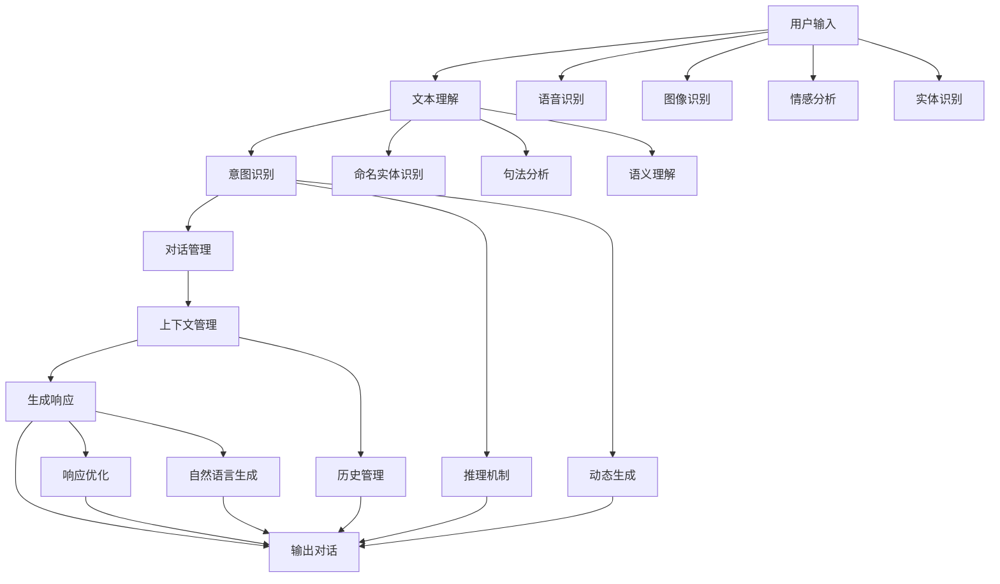

                 

# 聊天机器人工程和问题解决：创新解决方案

> 关键词：聊天机器人,工程实践,问题解决,自然语言处理,NLP,深度学习,预训练模型,多模态学习

## 1. 背景介绍

### 1.1 问题由来

在当今数字化和智能化时代，聊天机器人(Chatbot)已经成为各类应用中不可或缺的一部分，从客服自动回复到智能助手，从虚拟助手到智能教育，聊天机器人的应用领域不断扩展，带来了极高的用户价值。然而，由于技术复杂、用户体验挑战、多场景适配等因素，聊天机器人工程实践也面临着诸多难题。

为此，本文旨在深入剖析聊天机器人的工程挑战，从基础架构设计到模型训练，从问题识别到优化策略，全面系统地介绍如何构建高效、易用、智能的聊天机器人，为各行业的应用开发者提供创新解决方案。

## 2. 核心概念与联系

### 2.1 核心概念概述

聊天机器人工程涉及多个核心概念，包括：

- **聊天机器人(Chatbot)**：通过自然语言处理技术，模拟人类对话的人工智能系统。聊天机器人能够接收用户输入，根据上下文生成自然语言响应，实现人机对话。
- **自然语言处理(NLP)**：专注于计算机如何处理和理解人类语言的学科，包括文本处理、语义理解、情感分析等任务。
- **深度学习(Deep Learning)**：一种通过模拟人类大脑神经网络进行数据处理和模式识别的技术，在NLP领域被广泛应用。
- **预训练模型(Pre-trained Model)**：在大规模无标签数据上预训练的通用模型，如BERT、GPT等，具有较强的语言理解能力。
- **多模态学习(Multimodal Learning)**：结合文本、图像、音频等多种数据源进行学习，提升聊天机器人的感知能力。
- **对话管理(Dialogue Management)**：负责跟踪对话历史、管理对话状态，确保聊天机器人能够理解并生成连贯的响应。
- **上下文感知(Context-Awareness)**：聊天机器人需要根据对话历史和当前情境，生成更加符合语境的响应。
- **交互设计(Interaction Design)**：设计用户交互界面，提升用户体验，降低用户使用门槛。

这些概念之间通过特定的框架和逻辑联系在一起，共同构成了聊天机器人的工作机制。

### 2.2 核心概念原理和架构的 Mermaid 流程图



以上流程图展示了聊天机器人工作流程的核心环节：

1. **用户输入**：用户通过文本、语音、图像等多种方式与聊天机器人交互。
2. **文本理解**：将用户输入转换为可处理的形式，包括分词、命名实体识别、句法分析等。
3. **意图识别**：理解用户输入的意图，区分不同类型的问题或请求。
4. **对话管理**：跟踪对话历史，管理对话状态，保持对话连贯性。
5. **上下文管理**：根据对话历史和当前情境，生成上下文感知响应。
6. **生成响应**：基于意图、上下文生成自然语言响应，并进行优化和生成。
7. **输出对话**：将生成后的响应呈现给用户。

这些环节通过合理的架构设计和算法实现，构建了聊天机器人的基础能力。

## 3. 核心算法原理 & 具体操作步骤

### 3.1 算法原理概述

聊天机器人的核心算法原理主要基于自然语言处理和深度学习技术，分为以下几步：

1. **预训练模型选择**：选择适合的预训练模型，如BERT、GPT等，作为聊天机器人的基础模块。
2. **数据预处理**：对用户输入进行分词、命名实体识别、句法分析等预处理，转换为模型可接受的形式。
3. **意图识别**：使用分类器或神经网络对用户输入进行意图分类，区分不同类型的问题或请求。
4. **对话管理**：使用对话管理器跟踪对话历史，管理对话状态，确保聊天机器人能够理解并生成连贯的响应。
5. **生成响应**：根据意图、上下文生成自然语言响应，并进行优化和生成。
6. **交互设计**：设计用户交互界面，提升用户体验，降低用户使用门槛。

### 3.2 算法步骤详解

以下是基于上述核心算法的详细操作步骤：

**Step 1: 预训练模型选择**
- 根据具体应用场景选择合适的预训练模型，如针对客服场景的BERT模型，针对智能教育的GPT模型等。
- 确定模型架构，包括编码器、解码器、自注意力机制等关键组件。

**Step 2: 数据预处理**
- 使用分词工具对用户输入进行分词，去除停用词、标点等噪声。
- 进行命名实体识别，提取关键信息。
- 进行句法分析，分析句子结构和语法规则。
- 对处理后的文本进行编码，转换为模型可接受的向量形式。

**Step 3: 意图识别**
- 使用意图分类器对用户输入进行分类，如分类器为决策树、支持向量机等。
- 对于复杂的意图分类任务，使用神经网络模型，如RNN、CNN、Transformer等。

**Step 4: 对话管理**
- 设计对话管理器的状态转移图，描述对话状态和转移规则。
- 实现对话管理器的推理机制，包括状态更新、对话跳转等。

**Step 5: 生成响应**
- 使用语言生成模型生成自然语言响应，如基于Transformer的模型。
- 对生成响应进行优化，如使用BLEU、ROUGE等指标评估和调整生成质量。
- 对响应进行解码，转换为文本形式输出。

**Step 6: 交互设计**
- 设计简洁直观的用户界面，方便用户输入和查看响应。
- 对用户输入和响应进行UI交互设计，提升用户体验。

### 3.3 算法优缺点

基于上述核心算法的聊天机器人工程有以下优缺点：

**优点：**

- **通用性高**：基于预训练模型和深度学习技术，具有较强的通用性和适应性，可以适用于多种应用场景。
- **响应速度快**：通过预训练和微调优化，聊天机器人的响应速度较快，能够实时处理用户输入。
- **用户体验好**：基于自然语言处理技术，生成的响应自然流畅，能够提供接近人类的交流体验。
- **可扩展性强**：通过模块化设计，易于扩展和更新，支持多轮对话和复杂交互。

**缺点：**

- **数据依赖性强**：依赖大量的标注数据进行训练，数据质量和数量对模型效果有较大影响。
- **模型复杂度高**：预训练模型和深度学习模型的参数量较大，对计算资源要求高。
- **上下文感知难度大**：聊天机器人需要处理复杂的对话历史和上下文信息，设计和实现具有挑战性。
- **鲁棒性不足**：面对多样化的用户输入和复杂场景，聊天机器人容易出现误解和错误。

### 3.4 算法应用领域

聊天机器人的核心算法在多个领域得到广泛应用，例如：

- **客户服务**：自动回复客户咨询，提升服务效率和客户满意度。
- **智能助手**：提供日常任务管理、信息查询、日程安排等服务。
- **教育辅导**：解答学生疑问，提供个性化辅导，辅助教学。
- **健康咨询**：提供医疗咨询、健康建议，帮助用户管理健康。
- **金融理财**：提供投资建议、财务规划、客户服务等功能。

除了上述这些经典应用外，聊天机器人的核心算法还可以扩展到更多场景中，如智能家居、智能交通、智能安防等，为各行各业提供智能化的解决方案。

## 4. 数学模型和公式 & 详细讲解 & 举例说明

### 4.1 数学模型构建

本节将使用数学语言对聊天机器人的核心算法进行更加严格的刻画。

设聊天机器人处理的输入文本为 $X$，意图标签为 $Y$，对话历史为 $C$。假设模型由预训练语言模型 $M_{\theta}$ 作为基础，添加意图分类器 $I$ 和对话管理器 $D$。则聊天机器人的数学模型可表示为：

$$
Y = I(M_{\theta}(X), C)
$$

其中 $I$ 为意图分类器，$M_{\theta}$ 为预训练模型，$X$ 为输入文本，$C$ 为对话历史。

### 4.2 公式推导过程

以下我们以意图分类任务为例，推导分类器的构建过程。

假设意图分类器的输入为 $X$ 和对话历史 $C$，输出为意图标签 $Y$。则分类器的损失函数为：

$$
\mathcal{L}(I) = -\frac{1}{N}\sum_{i=1}^N \sum_{y=1}^k \ell(I(X^{(i)}, C^{(i)}), y)
$$

其中 $\ell$ 为交叉熵损失函数，$k$ 为意图类别数量。

分类器的输出为：

$$
\hat{Y} = \operatorname{softmax}(I(X^{(i)}, C^{(i)}))
$$

其中 $\hat{Y}$ 为预测概率分布。

通过梯度下降等优化算法，训练分类器最小化损失函数，使得模型能够准确地对用户输入进行意图分类。

### 4.3 案例分析与讲解

假设一个在线教育平台希望实现智能辅导功能，通过聊天机器人解答学生的问题。可以选择BERT模型作为预训练模型，使用交叉熵损失函数构建意图分类器。

首先，收集学生提问的数据集，包括问题和对应的意图标签。将数据集分为训练集和测试集，对训练集进行数据预处理，包括分词、命名实体识别、句法分析等。

接着，使用BERT模型作为预训练模型，将处理后的文本转换为向量形式。在向量上添加意图分类器，使用交叉熵损失函数进行训练。训练过程中，使用Adam优化器，设定合适的学习率，并使用正则化技术防止过拟合。

训练完成后，对测试集进行评估，计算意图分类器的准确率、召回率和F1分数。根据评估结果，对模型进行调参和优化，提升分类精度。

最后，将意图分类器集成到聊天机器人中，使用对话管理器跟踪对话历史，根据意图生成相应的回答。通过不断迭代和优化，提升聊天机器人的智能化水平和用户体验。

## 5. 项目实践：代码实例和详细解释说明

### 5.1 开发环境搭建

在进行聊天机器人工程实践前，我们需要准备好开发环境。以下是使用Python进行PyTorch开发的环境配置流程：

1. 安装Anaconda：从官网下载并安装Anaconda，用于创建独立的Python环境。

2. 创建并激活虚拟环境：
```bash
conda create -n chatbot-env python=3.8 
conda activate chatbot-env
```

3. 安装PyTorch：根据CUDA版本，从官网获取对应的安装命令。例如：
```bash
conda install pytorch torchvision torchaudio cudatoolkit=11.1 -c pytorch -c conda-forge
```

4. 安装TensorFlow：如果需要使用TensorFlow，请执行以下命令：
```bash
conda install tensorflow
```

5. 安装自然语言处理工具包：
```bash
pip install nltk spacy gensim pytorch-nlp transformers
```

完成上述步骤后，即可在`chatbot-env`环境中开始聊天机器人工程的实践。

### 5.2 源代码详细实现

这里我们以基于BERT模型的意图分类器为例，给出聊天机器人工程的代码实现。

首先，定义意图分类器的数据处理函数：

```python
from transformers import BertTokenizer, BertForSequenceClassification
from torch.utils.data import Dataset, DataLoader
from torch.nn import CrossEntropyLoss
from sklearn.metrics import classification_report

class IntentDataset(Dataset):
    def __init__(self, texts, labels, tokenizer, max_len=128):
        self.texts = texts
        self.labels = labels
        self.tokenizer = tokenizer
        self.max_len = max_len
        
    def __len__(self):
        return len(self.texts)
    
    def __getitem__(self, item):
        text = self.texts[item]
        label = self.labels[item]
        
        encoding = self.tokenizer(text, return_tensors='pt', max_length=self.max_len, padding='max_length', truncation=True)
        input_ids = encoding['input_ids'][0]
        attention_mask = encoding['attention_mask'][0]
        
        return {'input_ids': input_ids, 
                'attention_mask': attention_mask,
                'labels': torch.tensor(label, dtype=torch.long)}
```

然后，定义模型和优化器：

```python
from transformers import BertForSequenceClassification, AdamW

model = BertForSequenceClassification.from_pretrained('bert-base-cased', num_labels=num_labels)

optimizer = AdamW(model.parameters(), lr=2e-5)
```

接着，定义训练和评估函数：

```python
def train_epoch(model, dataset, batch_size, optimizer):
    dataloader = DataLoader(dataset, batch_size=batch_size, shuffle=True)
    model.train()
    epoch_loss = 0
    for batch in dataloader:
        input_ids = batch['input_ids'].to(device)
        attention_mask = batch['attention_mask'].to(device)
        labels = batch['labels'].to(device)
        model.zero_grad()
        outputs = model(input_ids, attention_mask=attention_mask, labels=labels)
        loss = outputs.loss
        epoch_loss += loss.item()
        loss.backward()
        optimizer.step()
    return epoch_loss / len(dataloader)

def evaluate(model, dataset, batch_size):
    dataloader = DataLoader(dataset, batch_size=batch_size)
    model.eval()
    preds, labels = [], []
    with torch.no_grad():
        for batch in dataloader:
            input_ids = batch['input_ids'].to(device)
            attention_mask = batch['attention_mask'].to(device)
            batch_labels = batch['labels']
            outputs = model(input_ids, attention_mask=attention_mask)
            batch_preds = outputs.logits.argmax(dim=2).to('cpu').tolist()
            batch_labels = batch_labels.to('cpu').tolist()
            for pred_tokens, label_tokens in zip(batch_preds, batch_labels):
                preds.append(pred_tokens[:len(label_tokens)])
                labels.append(label_tokens)
                
    print(classification_report(labels, preds))
```

最后，启动训练流程并在测试集上评估：

```python
epochs = 5
batch_size = 16

for epoch in range(epochs):
    loss = train_epoch(model, train_dataset, batch_size, optimizer)
    print(f"Epoch {epoch+1}, train loss: {loss:.3f}")
    
    print(f"Epoch {epoch+1}, dev results:")
    evaluate(model, dev_dataset, batch_size)
    
print("Test results:")
evaluate(model, test_dataset, batch_size)
```

以上就是使用PyTorch对BERT进行意图分类任务微调的代码实现。可以看到，得益于Transformers库的强大封装，我们可以用相对简洁的代码完成BERT模型的加载和微调。

### 5.3 代码解读与分析

让我们再详细解读一下关键代码的实现细节：

**IntentDataset类**：
- `__init__`方法：初始化文本、标签、分词器等关键组件。
- `__len__`方法：返回数据集的样本数量。
- `__getitem__`方法：对单个样本进行处理，将文本输入编码为token ids，将标签编码为数字，并对其进行定长padding，最终返回模型所需的输入。

**模型和优化器**：
- 使用BERTForSequenceClassification从预训练模型中加载意图分类器。
- 定义AdamW优化器，设定合适的学习率。

**训练和评估函数**：
- 使用PyTorch的DataLoader对数据集进行批次化加载，供模型训练和推理使用。
- 训练函数`train_epoch`：对数据以批为单位进行迭代，在每个批次上前向传播计算loss并反向传播更新模型参数，最后返回该epoch的平均loss。
- 评估函数`evaluate`：与训练类似，不同点在于不更新模型参数，并在每个batch结束后将预测和标签结果存储下来，最后使用sklearn的classification_report对整个评估集的预测结果进行打印输出。

**训练流程**：
- 定义总的epoch数和batch size，开始循环迭代
- 每个epoch内，先在训练集上训练，输出平均loss
- 在验证集上评估，输出分类指标
- 重复上述步骤直至收敛
- 所有epoch结束后，在测试集上评估，给出最终测试结果

可以看到，PyTorch配合Transformers库使得BERT微调的代码实现变得简洁高效。开发者可以将更多精力放在数据处理、模型改进等高层逻辑上，而不必过多关注底层的实现细节。

当然，工业级的系统实现还需考虑更多因素，如模型的保存和部署、超参数的自动搜索、更灵活的任务适配层等。但核心的微调范式基本与此类似。

## 6. 实际应用场景

### 6.1 智能客服系统

基于聊天机器人的客服系统可以广泛应用于各种服务场景，如电商客服、金融咨询、医疗咨询等。传统客服系统需要配备大量人力，高峰期响应缓慢，且一致性和专业性难以保证。而使用基于聊天机器人的客服系统，可以7x24小时不间断服务，快速响应客户咨询，用自然流畅的语言解答各类常见问题。

在技术实现上，可以收集企业内部的历史客服对话记录，将问题和最佳答复构建成监督数据，在此基础上对预训练聊天机器人进行微调。微调后的聊天机器人能够自动理解用户意图，匹配最合适的答案模板进行回复。对于客户提出的新问题，还可以接入检索系统实时搜索相关内容，动态组织生成回答。如此构建的智能客服系统，能大幅提升客户咨询体验和问题解决效率。

### 6.2 智能助手

智能助手是聊天机器人的典型应用之一，为用户提供日程安排、信息查询、提醒通知等服务。通过微调聊天机器人，能够根据用户的历史行为和偏好，提供个性化的服务和建议。

在实际应用中，可以通过收集用户的日程、喜好、行为数据，训练聊天机器人模型。模型能够根据用户输入，生成个性化的回复，如提醒用户即将到来的会议、提供相关资料查询等。智能助手还可以与其他系统集成，如日历应用、知识图谱等，提供更加丰富和多样化的服务。

### 6.3 教育辅导

聊天机器人技术在教育领域有着广泛的应用，能够辅助教师教学和学生学习。通过微调聊天机器人，可以解答学生的常见问题，提供个性化的学习建议和辅导。

在教育场景中，可以收集学生的学习行为、成绩、问题等数据，训练聊天机器人模型。模型能够根据学生输入，生成相应的回答和建议，如解释知识点、推荐相关学习资源等。教育聊天机器人可以提升学习效率，减轻教师负担，提供更精准的教育服务。

### 6.4 健康咨询

智能健康咨询系统通过聊天机器人提供健康建议、疾病咨询、心理咨询等服务。在实际应用中，可以通过收集医生的诊疗记录、健康数据、医学文献等数据，训练聊天机器人模型。模型能够根据用户输入，生成相应的回答和建议，如疾病预防、健康饮食、心理疏导等。

智能健康咨询系统能够提供24小时的健康咨询服务，减轻患者和医生之间的信息不对称，提升医疗服务的可及性和便利性。

### 6.5 金融理财

基于聊天机器人的金融理财系统能够提供投资建议、财务规划、客户服务等。在实际应用中，可以通过收集用户的财务数据、投资偏好、市场信息等数据，训练聊天机器人模型。模型能够根据用户输入，生成相应的回答和建议，如投资建议、理财规划、风险提示等。

金融理财聊天机器人能够提升金融服务的个性化和智能化水平，帮助用户进行更加精准的投资和理财决策。

## 7. 工具和资源推荐

### 7.1 学习资源推荐

为了帮助开发者系统掌握聊天机器人的工程实践和问题解决，这里推荐一些优质的学习资源：

1. 《Python自然语言处理》书籍：详细介绍Python在NLP中的应用，包括文本处理、意图识别、对话管理等核心技术。
2. 《深度学习与自然语言处理》课程：斯坦福大学开设的深度学习与NLP经典课程，涵盖模型选择、算法实现、模型评估等多个方面。
3. Coursera上的自然语言处理课程：提供从基础到高级的自然语言处理课程，覆盖NLP的各个核心技术。
4. Kaggle上的NLP竞赛：参加NLP领域的竞赛，通过实际问题解决提升技术能力。
5. GitHub上的开源项目：学习和借鉴优秀的聊天机器人项目，理解实际的工程实现。

通过对这些资源的学习实践，相信你一定能够快速掌握聊天机器人的工程实践和问题解决技巧，并用于解决实际的NLP问题。

### 7.2 开发工具推荐

高效的开发离不开优秀的工具支持。以下是几款用于聊天机器人开发的常用工具：

1. PyTorch：基于Python的开源深度学习框架，灵活动态的计算图，适合快速迭代研究。
2. TensorFlow：由Google主导开发的开源深度学习框架，生产部署方便，适合大规模工程应用。
3. Transformers库：HuggingFace开发的NLP工具库，集成了众多SOTA语言模型，支持PyTorch和TensorFlow，是进行聊天机器人开发的利器。
4. Weights & Biases：模型训练的实验跟踪工具，可以记录和可视化模型训练过程中的各项指标，方便对比和调优。
5. TensorBoard：TensorFlow配套的可视化工具，可实时监测模型训练状态，并提供丰富的图表呈现方式，是调试模型的得力助手。
6. Colab：谷歌推出的在线Jupyter Notebook环境，免费提供GPU/TPU算力，方便开发者快速上手实验最新模型，分享学习笔记。

合理利用这些工具，可以显著提升聊天机器人工程的开发效率，加快创新迭代的步伐。

### 7.3 相关论文推荐

聊天机器人工程涉及的自然语言处理和深度学习技术的发展，离不开学界的持续研究。以下是几篇奠基性的相关论文，推荐阅读：

1. Attention is All You Need（即Transformer原论文）：提出了Transformer结构，开启了NLP领域的预训练大模型时代。
2. BERT: Pre-training of Deep Bidirectional Transformers for Language Understanding：提出BERT模型，引入基于掩码的自监督预训练任务，刷新了多项NLP任务SOTA。
3. Chatbots Using Deep Learning: A Survey of Models, Architectures and Applications：全面综述了深度学习在聊天机器人领域的应用，涵盖模型选择、架构设计、实际应用等多个方面。
4. Seq2Seq Models with Dynamic Attention for Dialogue Management：提出动态注意力机制的对话管理器，提升聊天机器人的连贯性和智能水平。
5. Generating Efficient and Effective DialoGPT Responses Using Comprehensive Intent Analysis：提出多意图分析的生成模型，提高聊天机器人的响应质量和用户满意度。

这些论文代表了大语言模型微调技术的发展脉络。通过学习这些前沿成果，可以帮助研究者把握学科前进方向，激发更多的创新灵感。

## 8. 总结：未来发展趋势与挑战

### 8.1 总结

本文对聊天机器人的工程实践和问题解决进行了全面系统的介绍。首先阐述了聊天机器人的工程挑战，从基础架构设计到模型训练，从问题识别到优化策略，全面系统地介绍如何构建高效、易用、智能的聊天机器人，为各行业的应用开发者提供创新解决方案。

通过本文的系统梳理，可以看到，基于深度学习和自然语言处理技术的聊天机器人工程正在快速发展，极大地提升了用户交流的智能化水平和体验。未来，随着技术的持续演进和应用场景的不断拓展，聊天机器人在智能服务、教育、医疗、金融等领域的潜力将得到更大发挥。

### 8.2 未来发展趋势

展望未来，聊天机器人工程将呈现以下几个发展趋势：

1. **多模态学习**：结合文本、图像、语音等多种数据源进行学习，提升聊天机器人的感知能力。例如，基于图像的识别技术，可以识别用户表情，提升情感分析的准确性。
2. **上下文感知增强**：聊天机器人需要处理复杂的对话历史和上下文信息，设计和实现更加高效和准确的上下文感知算法，如双向Transformer、BERT等。
3. **个性化推荐**：基于用户历史行为和偏好，提供个性化的推荐和建议，如推荐系统、个性化查询等。
4. **多轮对话管理**：设计和实现更加复杂的对话管理器，支持多轮对话和复杂交互。
5. **零样本学习和少样本学习**：利用预训练模型和大规模数据，提升聊天机器人对新场景和新问题的适应能力。
6. **知识图谱整合**：将知识图谱和规则库与聊天机器人结合，提升其决策的合理性和可靠性。
7. **深度学习和强化学习的结合**：结合强化学习技术，通过模拟人类交互，优化聊天机器人的决策策略，提升用户体验。

### 8.3 面临的挑战

尽管聊天机器人工程已经取得了显著进展，但在迈向更加智能化、普适化应用的过程中，仍面临诸多挑战：

1. **数据质量和数量**：聊天机器人依赖大量的标注数据进行训练，数据质量和数量对模型效果有较大影响。如何获取高质量标注数据，提高数据利用率，是当前的一大难题。
2. **上下文感知难度大**：聊天机器人需要处理复杂的对话历史和上下文信息，设计和实现高效的上下文感知算法，具有挑战性。
3. **鲁棒性不足**：聊天机器人面对多样化的用户输入和复杂场景，容易出现误解和错误。如何提升鲁棒性，确保模型在不同环境下的稳定性，仍需深入研究。
4. **资源消耗大**：预训练模型和深度学习模型的参数量较大，对计算资源要求高。如何优化模型结构和资源利用，实现更高效的部署，是工程实践中需要解决的问题。
5. **模型可解释性不足**：聊天机器人的决策过程通常缺乏可解释性，难以对其推理逻辑进行分析和调试。如何赋予聊天机器人更强的可解释性，将是亟待攻克的难题。
6. **伦理和安全问题**：聊天机器人可能学习到有偏见、有害的信息，通过微调传递到下游任务，产生误导性、歧视性的输出，给实际应用带来安全隐患。如何从数据和算法层面消除模型偏见，确保输出的安全性，也将是重要的研究课题。

### 8.4 研究展望

面对聊天机器人工程所面临的挑战，未来的研究需要在以下几个方面寻求新的突破：

1. **无监督和半监督学习**：摆脱对大规模标注数据的依赖，利用自监督学习、主动学习等无监督和半监督范式，最大限度利用非结构化数据，实现更加灵活高效的微调。
2. **多模态数据融合**：结合视觉、语音等多种数据源，提升聊天机器人的感知能力。例如，结合图像识别和语音识别技术，提升情感分析和实体识别的准确性。
3. **上下文感知算法优化**：设计和实现更加高效和准确的上下文感知算法，提升聊天机器人的连贯性和智能水平。例如，双向Transformer、BERT等模型在上下文感知上的表现更为优秀。
4. **模型可解释性增强**：引入可解释性技术，如可解释性生成模型、可解释性语言模型等，提升聊天机器人的决策透明度和可信度。
5. **知识图谱整合**：将知识图谱和规则库与聊天机器人结合，提升其决策的合理性和可靠性。例如，结合知识图谱进行实体链接，提升命名实体识别的准确性。
6. **多轮对话管理优化**：设计和实现更加复杂的对话管理器，支持多轮对话和复杂交互。例如，结合强化学习技术，通过模拟人类交互，优化聊天机器人的决策策略，提升用户体验。
7. **隐私和安全保障**：设计和实现隐私保护和安全保障机制，确保用户数据和隐私的安全性。例如，使用差分隐私技术保护用户数据隐私。

这些研究方向的探索，必将引领聊天机器人工程迈向更高的台阶，为构建更加智能、可靠、可解释的聊天机器人系统铺平道路。面向未来，聊天机器人工程需要与其他人工智能技术进行更深入的融合，如知识表示、因果推理、强化学习等，多路径协同发力，共同推动自然语言理解和智能交互系统的进步。只有勇于创新、敢于突破，才能不断拓展聊天机器人的边界，让智能技术更好地造福人类社会。

## 9. 附录：常见问题与解答

**Q1：如何评估聊天机器人的性能？**

A: 评估聊天机器人的性能可以从以下几个方面考虑：

1. **准确率**：衡量聊天机器人对用户输入的理解和回应是否准确。
2. **召回率**：衡量聊天机器人能否覆盖用户输入的多样性和复杂性。
3. **F1分数**：综合考虑准确率和召回率，给出整体的性能评估。
4. **用户满意度**：通过用户反馈和满意度调查，评估聊天机器人的用户体验。
5. **平均响应时间**：衡量聊天机器人的响应速度，确保及时响应用户需求。

**Q2：聊天机器人如何处理对话历史和上下文？**

A: 聊天机器人通常使用对话管理器来跟踪和管理对话历史，确保对话连贯性和上下文感知。对话管理器会记录用户输入和机器人响应的序列，并根据上下文生成更合适的回应。

具体实现上，可以使用状态转移图或神经网络模型，如双向Transformer、BERT等，来处理对话历史和上下文。这些模型能够捕捉对话中的长期依赖关系，提升上下文感知的准确性。

**Q3：聊天机器人如何处理多样化的用户输入？**

A: 聊天机器人通常使用多意图分类器和生成模型来处理多样化的用户输入。多意图分类器能够识别用户输入的多个意图，生成模型能够根据意图生成相应的回应。

具体实现上，可以使用多个分类器或神经网络模型，如RNN、CNN、Transformer等，对用户输入进行多意图分类。对于每个意图，使用生成模型（如基于Transformer的模型）生成相应的回应。

**Q4：聊天机器人在面对复杂场景时的鲁棒性如何提升？**

A: 提升聊天机器人的鲁棒性可以从以下几个方面考虑：

1. **数据增强**：通过回译、近义替换等方式扩充训练集，提升模型对多样化的用户输入的适应能力。
2. **对抗训练**：引入对抗样本，提高模型对噪声和扰动的鲁棒性。
3. **正则化技术**：使用L2正则、Dropout等技术，防止模型过拟合。
4. **多轮对话管理**：设计和实现更加复杂的对话管理器，确保对话连贯性和上下文感知。
5. **知识图谱整合**：将知识图谱和规则库与聊天机器人结合，提升其决策的合理性和可靠性。

**Q5：聊天机器人在实际应用中需要注意哪些问题？**

A: 聊天机器人在实际应用中需要注意以下几个问题：

1. **用户隐私保护**：收集和存储用户数据时，需要遵循隐私保护法规，确保用户数据的安全性。
2. **上下文一致性**：确保聊天机器人能够处理复杂的多轮对话，保持对话连贯性。
3. **用户友好性**：设计简洁直观的用户界面，提升用户体验，降低用户使用门槛。
4. **模型可解释性**：确保聊天机器人的决策过程透明，用户可以理解和信任其输出。
5. **持续更新和优化**：定期收集用户反馈，更新和优化聊天机器人模型，提升用户体验。

---

作者：禅与计算机程序设计艺术 / Zen and the Art of Computer Programming

