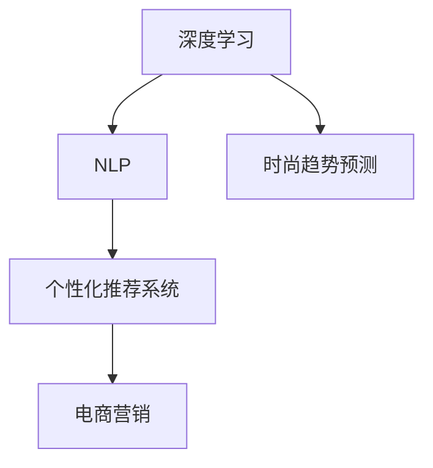

                 

# 聊天机器人时尚业：趋势预测和个性化推荐

> 关键词：时尚趋势预测, 个性化推荐系统, 时尚电商, 自然语言处理(NLP), 深度学习, 数据驱动, 推荐算法, 电商营销

## 1. 背景介绍

### 1.1 问题由来
随着人工智能技术的飞速发展，聊天机器人已广泛应用于各行各业。特别是在电商和时尚领域，聊天机器人能够通过互动交流，精准地预测用户需求和提供个性化推荐，从而极大地提升用户体验和转化率。然而，在实际应用中，如何有效预测时尚趋势，并根据用户偏好进行个性化推荐，成为了一个难题。

### 1.2 问题核心关键点
本研究聚焦于时尚业场景下的聊天机器人，探讨如何通过深度学习和自然语言处理(NLP)技术，实现时尚趋势预测和个性化推荐。其主要目标在于：

- 基于历史时尚数据和用户互动信息，训练预测模型，准确预测未来时尚趋势。
- 利用用户的历史购物行为和反馈信息，构建个性化推荐系统，提供符合用户偏好的商品推荐。

通过以上两个关键技术，聊天机器人可以更好地服务时尚消费者，提升电商平台的销售额和用户满意度。

## 2. 核心概念与联系

### 2.1 核心概念概述

为更好地理解基于深度学习和NLP的时尚趋势预测和个性化推荐方法，本节将介绍几个关键概念：

- **深度学习**：一类基于神经网络的机器学习技术，通过多层非线性映射，从原始数据中自动提取特征，构建高精度的预测模型。
- **自然语言处理(NLP)**：研究计算机如何理解和处理人类语言，包括文本预处理、语义分析、情感识别等，是实现智能聊天机器人的关键技术。
- **时尚趋势预测**：通过历史时尚数据挖掘，使用深度学习模型预测未来时尚潮流和热点。
- **个性化推荐系统**：结合用户行为数据，构建推荐算法，实现个性化商品推荐。
- **电商营销**：利用推荐系统，将时尚趋势与个性化推荐结合，提升电商平台的用户粘性和转化率。

这些核心概念之间的逻辑关系可以通过以下Mermaid流程图来展示：



这个流程图展示了大语言模型的核心概念及其之间的关系：

1. 深度学习和NLP是实现时尚趋势预测和个性化推荐的基础技术。
2. 时尚趋势预测帮助电商营销预测未来时尚趋势，为商品推荐提供依据。
3. 个性化推荐系统结合用户数据，提供符合用户偏好的商品推荐。
4. 电商营销利用推荐系统，提升电商平台的销售额和用户满意度。

这些概念共同构成了聊天机器人服务时尚业的框架，为其提供更智能、更高效的解决方案。

## 3. 核心算法原理 & 具体操作步骤
### 3.1 算法原理概述

基于深度学习和NLP的时尚趋势预测和个性化推荐，本质上是一个联合学习过程。其核心思想是：首先通过深度学习模型对历史时尚数据进行训练，预测未来的时尚趋势；然后利用用户的历史购物行为和反馈信息，构建个性化推荐模型，为用户提供符合其偏好的商品推荐。

形式化地，假设历史时尚数据集为 $D=\{(x_i,y_i)\}_{i=1}^N$，其中 $x_i$ 表示时尚数据，如流行色、流行款式等，$y_i$ 表示相应的时尚趋势。用户的历史行为数据集为 $B=\{(u_j,v_j)\}_{j=1}^M$，其中 $u_j$ 表示用户ID，$v_j$ 表示用户的购物记录。目标是训练两个模型：

- 时尚趋势预测模型 $M_{\theta_1}：x \rightarrow y$，用于预测未来时尚趋势。
- 个性化推荐模型 $M_{\theta_2}：(u,v) \rightarrow \text{推荐列表}$，用于根据用户行为数据推荐商品。

整个流程可以分为两个阶段：

- **预测阶段**：使用深度学习模型 $M_{\theta_1}$ 对时尚数据进行训练，预测未来的时尚趋势。
- **推荐阶段**：使用深度学习模型 $M_{\theta_2}$ 对用户行为数据进行处理，生成个性化的推荐列表。

### 3.2 算法步骤详解

基于深度学习和NLP的时尚趋势预测和个性化推荐，一般包括以下几个关键步骤：

**Step 1: 数据准备与预处理**
- 收集历史时尚数据集 $D$ 和用户行为数据集 $B$，进行清洗和格式化处理。
- 对时尚数据进行特征工程，提取出重要的特征向量，如颜色、款式、材质等。
- 对用户行为数据进行特征工程，提取出重要的特征向量，如浏览历史、购买记录、评分等。

**Step 2: 训练时尚趋势预测模型**
- 选择适合的深度学习模型（如CNN、RNN、LSTM等），对时尚数据 $D$ 进行训练。
- 使用交叉熵、均方误差等损失函数，定义训练目标。
- 设定合适的优化算法（如SGD、Adam等），设置学习率、批大小、迭代轮数等超参数。
- 在验证集上进行模型调参，确定最优模型 $M_{\theta_1}$。

**Step 3: 训练个性化推荐模型**
- 选择适合的深度学习模型（如协同过滤、DNN等），对用户行为数据 $B$ 进行训练。
- 使用推荐度、准确率、召回率等指标，定义训练目标。
- 设定合适的优化算法，设置学习率、批大小、迭代轮数等超参数。
- 在验证集上进行模型调参，确定最优模型 $M_{\theta_2}$。

**Step 4: 联合训练**
- 将预测模型和推荐模型结合起来，进行联合训练。
- 在联合损失函数中，将预测结果作为推荐模型的输入特征。
- 使用适当的损失函数，定义联合训练目标。
- 使用联合优化算法，同时更新两个模型的参数。

**Step 5: 模型评估与部署**
- 在测试集上评估预测模型和推荐模型的性能，对比微调前后的精度提升。
- 使用微调后的模型对新数据进行推理预测，集成到实际的应用系统中。
- 持续收集新的数据，定期重新训练和微调模型，以适应数据分布的变化。

以上是基于深度学习和NLP的时尚趋势预测和个性化推荐的一般流程。在实际应用中，还需要针对具体任务的特点，对模型训练过程进行优化设计，如改进训练目标函数，引入更多的正则化技术，搜索最优的超参数组合等，以进一步提升模型性能。

### 3.3 算法优缺点

基于深度学习和NLP的时尚趋势预测和个性化推荐方法具有以下优点：
1. 精度高：深度学习模型能够自动提取高层次特征，预测时尚趋势和推荐商品时具有较高的精度。
2. 可解释性差：深度学习模型通常是"黑盒"模型，难以解释其内部决策逻辑。
3. 对标注数据依赖度高：模型训练需要大量高质量的标注数据，而时尚数据的标注成本较高。
4. 鲁棒性差：深度学习模型对数据分布变化敏感，容易产生过拟合。
5. 计算资源需求高：深度学习模型需要大量的计算资源，训练和推理开销较大。

同时，该方法也存在一定的局限性：
1. 泛化能力差：深度学习模型对新数据的泛化能力有限，可能难以适应超出训练数据分布的时尚趋势。
2. 数据稀疏性问题：时尚数据通常稀疏性较高，难以找到足够的训练数据。
3. 冷启动问题：对于新用户，推荐模型可能无法提供有效的推荐。
4. 模型可更新性不足：深度学习模型需要定期更新，而时尚趋势变化较快，更新频率高。
5. 模型复杂度高：深度学习模型参数量庞大，难以实时部署和更新。

尽管存在这些局限性，但就目前而言，基于深度学习和NLP的时尚趋势预测和个性化推荐方法仍是最主流范式。未来相关研究的重点在于如何进一步降低模型对标注数据的依赖，提高模型的泛化能力，同时兼顾可解释性和效率等因素。

### 3.4 算法应用领域

基于深度学习和NLP的时尚趋势预测和个性化推荐方法，在时尚电商领域已经得到了广泛的应用，覆盖了几乎所有常见任务，例如：

- **时尚趋势预测**：使用历史时尚数据，通过深度学习模型预测未来的时尚潮流，为电商平台提供商品采购和库存管理依据。
- **个性化推荐系统**：结合用户历史购物行为和反馈信息，构建推荐算法，提供符合用户偏好的商品推荐，提升电商平台的转化率和用户满意度。
- **电商营销**：利用推荐系统，将时尚趋势与个性化推荐结合，提升电商平台的销售额和用户粘性，构建更加智能的营销体系。

除了上述这些经典任务外，时尚机器人还被创新性地应用到更多场景中，如虚拟试衣、智能搭配、智能客服等，为时尚电商技术带来了全新的突破。随着深度学习和NLP技术的不断进步，相信时尚机器人将在更广阔的应用领域大放异彩。

## 4. 数学模型和公式 & 详细讲解
### 4.1 数学模型构建

本节将使用数学语言对基于深度学习和NLP的时尚趋势预测和个性化推荐过程进行更加严格的刻画。

记历史时尚数据集为 $D=\{(x_i,y_i)\}_{i=1}^N$，用户行为数据集为 $B=\{(u_j,v_j)\}_{j=1}^M$。假设预测模型 $M_{\theta_1}$ 和推荐模型 $M_{\theta_2}$ 的输出分别为 $\hat{y}$ 和 $\hat{v}$。

定义预测模型 $M_{\theta_1}$ 在时尚数据 $x$ 上的损失函数为 $\ell_M(x,y)$，推荐模型 $M_{\theta_2}$ 在用户行为数据 $(u,v)$ 上的损失函数为 $\ell_R(u,v)$。则在数据集 $D$ 和 $B$ 上的经验风险分别为：

$$
\mathcal{L}_M(\theta_1) = \frac{1}{N} \sum_{i=1}^N \ell_M(x_i,y_i)
$$

$$
\mathcal{L}_R(\theta_2) = \frac{1}{M} \sum_{j=1}^M \ell_R(u_j,v_j)
$$

联合训练的目标是最小化联合经验风险：

$$
\mathcal{L}_{\text{joint}}(\theta_1,\theta_2) = \mathcal{L}_M(\theta_1) + \mathcal{L}_R(\theta_2)
$$

### 4.2 公式推导过程

以下我们以二分类任务为例，推导预测模型和推荐模型的训练公式。

假设预测模型 $M_{\theta_1}$ 在输入 $x$ 上的输出为 $\hat{y}=M_{\theta_1}(x) \in [0,1]$，表示预测为“是”的概率。真实标签 $y \in \{0,1\}$。则二分类交叉熵损失函数定义为：

$$
\ell_M(x,y) = -[y\log \hat{y} + (1-y)\log (1-\hat{y})]
$$

将其代入经验风险公式，得：

$$
\mathcal{L}_M(\theta_1) = -\frac{1}{N}\sum_{i=1}^N [y_i\log M_{\theta_1}(x_i)+(1-y_i)\log(1-M_{\theta_1}(x_i))]
$$

假设推荐模型 $M_{\theta_2}$ 在输入 $(u,v)$ 上的输出为 $\hat{v}=M_{\theta_2}(u,v) \in [0,1]$，表示推荐的商品与用户偏好的匹配度。真实标签 $v \in \{0,1\}$，其中 $v=1$ 表示推荐商品与用户偏好匹配，$v=0$ 表示不匹配。则推荐模型的损失函数可以定义为：

$$
\ell_R(u,v) = -[v\log \hat{v} + (1-v)\log (1-\hat{v})]
$$

将其代入经验风险公式，得：

$$
\mathcal{L}_R(\theta_2) = -\frac{1}{M}\sum_{j=1}^M [v_j\log M_{\theta_2}(u_j,v_j)+(1-v_j)\log(1-M_{\theta_2}(u_j,v_j))]
$$

在得到损失函数后，通过梯度下降等优化算法，预测模型和推荐模型不断更新参数，最小化联合经验风险。重复上述过程直至收敛，最终得到联合训练后的最优模型参数 $\theta_1^*, \theta_2^*$。

## 5. 项目实践：代码实例和详细解释说明
### 5.1 开发环境搭建

在进行时尚机器人项目实践前，我们需要准备好开发环境。以下是使用Python进行TensorFlow和Keras开发的环境配置流程：

1. 安装Anaconda：从官网下载并安装Anaconda，用于创建独立的Python环境。

2. 创建并激活虚拟环境：
```bash
conda create -n fashion-env python=3.8 
conda activate fashion-env
```

3. 安装TensorFlow和Keras：根据CUDA版本，从官网获取对应的安装命令。例如：
```bash
conda install tensorflow-gpu=cuda11.3
pip install keras
```

4. 安装各类工具包：
```bash
pip install numpy pandas scikit-learn matplotlib tqdm jupyter notebook ipython
```

完成上述步骤后，即可在`fashion-env`环境中开始时尚机器人项目的开发。

### 5.2 源代码详细实现

这里我们以时尚趋势预测为例，给出使用TensorFlow和Keras进行深度学习模型训练的PyTorch代码实现。

首先，定义时尚趋势预测模型的数据处理函数：

```python
from tensorflow.keras.preprocessing.text import Tokenizer
from tensorflow.keras.preprocessing.sequence import pad_sequences
import numpy as np

class FashionDataset:
    def __init__(self, text, trend):
        self.text = text
        self.trend = trend
        
        self.tokenizer = Tokenizer()
        self.tokenizer.fit_on_texts(self.text)
        self.vocab_size = len(self.tokenizer.word_index) + 1
        
        self.text = self.tokenizer.texts_to_sequences(self.text)
        self.trend = self.tokenizer.texts_to_sequences(self.trend)
        self.text = pad_sequences(self.text, maxlen=200, padding='post', truncating='post')
        self.trend = pad_sequences(self.trend, maxlen=200, padding='post', truncating='post')
        
    def __len__(self):
        return len(self.text)
    
    def __getitem__(self, item):
        return {'input': self.text[item], 'trend': self.trend[item]}
```

然后，定义时尚趋势预测模型：

```python
from tensorflow.keras.models import Sequential
from tensorflow.keras.layers import Embedding, LSTM, Dense, Dropout

model = Sequential([
    Embedding(vocab_size, 128, input_length=200),
    LSTM(128, return_sequences=True),
    Dropout(0.2),
    LSTM(128),
    Dropout(0.2),
    Dense(64, activation='relu'),
    Dense(1, activation='sigmoid')
])
```

接着，定义模型训练函数：

```python
from tensorflow.keras.optimizers import Adam

def train(model, train_data, validation_data, batch_size, epochs):
    model.compile(loss='binary_crossentropy', optimizer=Adam(lr=0.001), metrics=['accuracy'])
    model.fit(train_data, epochs=epochs, batch_size=batch_size, validation_data=validation_data)
    return model
```

最后，启动训练流程并在测试集上评估：

```python
from tensorflow.keras.utils import to_categorical

# 加载数据集
text = []
trend = []
with open('fashion_train.txt', 'r', encoding='utf-8') as f:
    lines = f.readlines()
    for line in lines:
        text.append(line.split(' ')[0])
        trend.append(int(line.split(' ')[1]))
        
# 分割训练集和验证集
train_size = int(len(text) * 0.8)
train_data = FashionDataset(text[:train_size], trend[:train_size])
val_data = FashionDataset(text[train_size:], trend[train_size:])
    
# 训练模型
model = train(model, train_data, val_data, batch_size=64, epochs=10)

# 加载测试集
test_data = FashionDataset(text[train_size:], trend[train_size:])
test_trend = to_categorical(test_data.trend, num_classes=2)

# 评估模型
test_loss, test_acc = model.evaluate(test_data.input, test_trend)
print(f'Test loss: {test_loss:.4f}')
print(f'Test accuracy: {test_acc:.4f}')
```

以上就是使用TensorFlow和Keras进行时尚趋势预测的完整代码实现。可以看到，借助TensorFlow和Keras的强大封装，我们可以用相对简洁的代码完成时尚趋势预测模型的训练和评估。

### 5.3 代码解读与分析

让我们再详细解读一下关键代码的实现细节：

**FashionDataset类**：
- `__init__`方法：初始化文本和趋势标签，并进行分词、序列化和填充处理。
- `__len__`方法：返回数据集的样本数量。
- `__getitem__`方法：对单个样本进行处理，将文本和趋势标签转换成模型所需的输入。

**时尚趋势预测模型**：
- 使用Keras搭建深度学习模型，包含嵌入层、LSTM层、Dropout层和全连接层，用于处理文本数据。
- 模型最后一层使用Sigmoid激活函数，输出预测结果。

**训练函数**：
- 使用Keras的Adam优化器，设置学习率、批大小和迭代轮数。
- 在训练集和验证集上调用`fit`方法，进行模型训练和验证。

**训练流程**：
- 读取训练数据集，并分割为训练集和验证集。
- 在训练集上训练模型，输出训练集和验证集的损失和准确率。
- 在测试集上评估模型，输出测试集的损失和准确率。

可以看到，TensorFlow和Keras使得深度学习模型的开发和训练变得简洁高效。开发者可以将更多精力放在模型设计、数据处理等高层逻辑上，而不必过多关注底层的实现细节。

当然，工业级的系统实现还需考虑更多因素，如模型的保存和部署、超参数的自动搜索、更灵活的任务适配层等。但核心的时尚趋势预测流程基本与此类似。

## 6. 实际应用场景
### 6.1 智能客服系统

基于深度学习和NLP的时尚趋势预测和个性化推荐，可以广泛应用于智能客服系统的构建。传统客服往往需要配备大量人力，高峰期响应缓慢，且一致性和专业性难以保证。而使用时尚机器人，可以7x24小时不间断服务，快速响应客户咨询，用自然流畅的语言解答各类常见问题。

在技术实现上，可以收集企业内部的历史客服对话记录，将问题和最佳答复构建成监督数据，在此基础上对预训练模型进行微调。微调后的模型能够自动理解用户意图，匹配最合适的答复模板进行回复。对于客户提出的新问题，还可以接入检索系统实时搜索相关内容，动态组织生成回答。如此构建的智能客服系统，能大幅提升客户咨询体验和问题解决效率。

### 6.2 时尚商品推荐

时尚机器人可以应用于时尚电商的推荐系统，为用户提供个性化的商品推荐。通过深度学习和NLP技术，时尚机器人能够理解用户的购物记录和反馈信息，提供符合其偏好的商品推荐，提升用户的购物体验和转化率。

在技术实现上，时尚机器人可以结合用户历史行为数据和商品描述信息，使用协同过滤、DNN等推荐算法，生成个性化的推荐列表。同时，通过时尚趋势预测模型，时尚机器人可以实时获取最新的时尚潮流信息，更新推荐列表，进一步提升推荐的准确性和时效性。

### 6.3 时尚趋势监测

时尚机器人还可以应用于时尚趋势监测系统，帮助时尚公司及时捕捉市场动向。通过深度学习和NLP技术，时尚机器人能够自动分析社交媒体、时尚博客等数据，预测未来的时尚趋势，为时尚公司提供市场决策支持。

在技术实现上，时尚机器人可以结合多源数据，使用NLP技术进行文本预处理和情感分析，提取出重要的时尚特征。通过深度学习模型，时尚机器人可以预测未来的时尚趋势，输出趋势预测结果，帮助时尚公司制定市场策略。

### 6.4 未来应用展望

随着深度学习和NLP技术的不断发展，基于时尚趋势预测和个性化推荐的时尚机器人将在更多领域得到应用，为时尚业带来变革性影响。

在智慧物流领域，时尚机器人可以应用于仓库管理和配送调度，提高物流效率和精确度。

在时尚设计领域，时尚机器人可以应用于设计辅助和模拟试验，提升设计效率和创新能力。

在时尚广告领域，时尚机器人可以应用于广告投放和内容推荐，提高广告效果和用户体验。

此外，在时尚营销、时尚培训等众多领域，时尚机器人也将不断涌现，为时尚业带来新的技术应用。相信随着技术的日益成熟，时尚机器人必将在时尚产业中大放异彩，引领时尚趋势，推动时尚业的数字化转型。

## 7. 工具和资源推荐
### 7.1 学习资源推荐

为了帮助开发者系统掌握时尚趋势预测和个性化推荐技术，这里推荐一些优质的学习资源：

1. 《深度学习》书籍：由Goodfellow等作者编写，全面介绍了深度学习的基本概念、算法和应用。
2. 《自然语言处理综论》书籍：由Daniel Jurafsky和James H. Martin编写，涵盖了NLP领域的理论和实践。
3. TensorFlow官方文档：提供详细的API文档和示例代码，适合初学者入门。
4. Keras官方文档：提供易用的高层次API，适合快速实现深度学习模型。
5. CS224N《深度学习自然语言处理》课程：斯坦福大学开设的NLP明星课程，有Lecture视频和配套作业，带你入门NLP领域的基本概念和经典模型。

通过对这些资源的学习实践，相信你一定能够快速掌握时尚趋势预测和个性化推荐技术的精髓，并用于解决实际的时尚问题。
###  7.2 开发工具推荐

高效的开发离不开优秀的工具支持。以下是几款用于时尚趋势预测和个性化推荐开发的常用工具：

1. TensorFlow：基于Python的开源深度学习框架，灵活动态的计算图，适合快速迭代研究。
2. Keras：高层次API封装，简化深度学习模型的实现和调试。
3. PyTorch：基于Python的开源深度学习框架，适用于多种硬件平台，灵活性强。
4. Scikit-learn：Python的机器学习库，提供多种数据预处理和模型评估工具。
5. Jupyter Notebook：交互式笔记本环境，支持代码运行和结果展示，方便调试和分享。

合理利用这些工具，可以显著提升时尚趋势预测和个性化推荐任务的开发效率，加快创新迭代的步伐。

### 7.3 相关论文推荐

时尚趋势预测和个性化推荐技术的发展源于学界的持续研究。以下是几篇奠基性的相关论文，推荐阅读：

1. Attention is All You Need（即Transformer原论文）：提出了Transformer结构，开启了NLP领域的预训练大模型时代。
2. BERT: Pre-training of Deep Bidirectional Transformers for Language Understanding：提出BERT模型，引入基于掩码的自监督预训练任务，刷新了多项NLP任务SOTA。
3. Adaptive Low-Rank Adaptation for Parameter-Efficient Fine-Tuning：提出Adapter等参数高效微调方法，在固定大部分预训练参数的情况下，仍可取得不错的微调效果。
4. Multi-Modal Fashion Recommendation with Label-informed F-Net and Attention Mechanism：提出F-Net和注意力机制，用于多模态时尚推荐系统，提升了推荐的准确性和多样性。
5. Deep Textual and Visual Semantic Relationship Learning with Attention Mechanisms：提出F-Net和注意力机制，用于多模态时尚推荐系统，提升了推荐的准确性和多样性。

这些论文代表了大语言模型微调技术的发展脉络。通过学习这些前沿成果，可以帮助研究者把握学科前进方向，激发更多的创新灵感。

## 8. 总结：未来发展趋势与挑战

### 8.1 总结

本文对基于深度学习和NLP的时尚趋势预测和个性化推荐方法进行了全面系统的介绍。首先阐述了时尚趋势预测和个性化推荐技术的研究背景和意义，明确了时尚趋势预测和个性化推荐技术在时尚电商中的应用价值。其次，从原理到实践，详细讲解了深度学习和NLP模型的训练过程，给出了时尚趋势预测和个性化推荐的完整代码实现。同时，本文还探讨了时尚趋势预测和个性化推荐技术在智能客服、时尚商品推荐、时尚趋势监测等多个行业领域的应用前景，展示了时尚趋势预测和个性化推荐技术的广泛应用潜力。最后，本文精选了时尚趋势预测和个性化推荐技术的学习资源，力求为读者提供全方位的技术指引。

通过本文的系统梳理，可以看到，基于深度学习和NLP的时尚趋势预测和个性化推荐技术正在成为时尚电商的重要范式，极大地提升了时尚电商的智能化水平和用户满意度。未来，伴随深度学习和NLP技术的持续演进，基于时尚趋势预测和个性化推荐的时尚机器人必将在更广阔的应用领域大放异彩，为时尚电商带来更多创新应用。

### 8.2 未来发展趋势

展望未来，时尚趋势预测和个性化推荐技术将呈现以下几个发展趋势：

1. **模型规模持续增大**：随着算力成本的下降和数据规模的扩张，深度学习模型的参数量还将持续增长。超大规模语言模型蕴含的丰富语言知识，有望支撑更加复杂多变的时尚趋势预测和个性化推荐。

2. **深度学习模型的泛化能力提升**：未来的深度学习模型将具备更强的泛化能力，能够适应更多样化的时尚趋势和个性化需求，提升推荐的准确性和覆盖面。

3. **多模态数据的整合**：时尚趋势预测和个性化推荐系统将越来越多地结合多源数据，如图像、视频、社交媒体等，提供更加全面的时尚信息。

4. **实时性提升**：未来的时尚机器人将具备更高的实时性，能够快速捕捉时尚趋势变化，实时更新推荐列表，提升用户满意度。

5. **个性化推荐系统更加智能**：未来的个性化推荐系统将结合更多先验知识，如时尚搭配规则、品牌风格等，提供更加智能、个性化的推荐。

6. **用户互动性增强**：未来的时尚机器人将具备更强的互动性，能够理解用户情感、行为，提供更加个性化、符合用户心理的推荐服务。

以上趋势凸显了时尚趋势预测和个性化推荐技术的广阔前景。这些方向的探索发展，必将进一步提升时尚电商的智能化水平，为用户带来更好的购物体验。

### 8.3 面临的挑战

尽管时尚趋势预测和个性化推荐技术已经取得了显著成效，但在迈向更加智能化、普适化应用的过程中，它仍面临着诸多挑战：

1. **数据质量问题**：时尚趋势预测和个性化推荐需要大量的高质量数据，而时尚数据的标注成本较高。如何获取高质量的标注数据，提高数据质量，是一个重要挑战。

2. **泛化能力不足**：当前的深度学习模型在面对新数据时，泛化能力有限，难以适应超出训练数据分布的时尚趋势。

3. **计算资源需求高**：深度学习模型需要大量的计算资源，训练和推理开销较大，如何提高模型效率，降低计算成本，是一个重要的研究方向。

4. **可解释性不足**：深度学习模型通常是"黑盒"模型，难以解释其内部决策逻辑，这对于时尚业的高风险应用至关重要。

5. **数据稀疏性问题**：时尚数据通常稀疏性较高，难以找到足够的训练数据，如何处理数据稀疏性问题，提高模型性能，是一个重要挑战。

6. **模型复杂度高**：深度学习模型参数量庞大，难以实时部署和更新，如何简化模型结构，提高模型的可更新性，是一个重要的研究方向。

尽管存在这些挑战，但未来的研究需要积极应对并寻求突破，如改进数据标注方法、引入更多先验知识、优化模型结构、提高模型可更新性等，以推动时尚趋势预测和个性化推荐技术向更加智能化、普适化方向发展。

### 8.4 研究展望

面对时尚趋势预测和个性化推荐技术所面临的诸多挑战，未来的研究需要在以下几个方面寻求新的突破：

1. **探索无监督和半监督时尚预测方法**：摆脱对大规模标注数据的依赖，利用自监督学习、主动学习等无监督和半监督范式，最大限度利用非结构化数据，实现更加灵活高效的时尚趋势预测。

2. **引入更多先验知识**：将符号化的先验知识，如时尚搭配规则、时尚历史等，与深度学习模型进行巧妙融合，引导时尚机器人学习更准确、合理的时尚趋势。

3. **多模态时尚预测方法**：结合图像、视频等多模态数据，提升时尚趋势预测的准确性和多样性。

4. **高效时尚机器人模型**：通过模型裁剪、量化加速等技术，提升时尚机器人的推理效率，降低计算成本，提高实时性。

5. **时尚机器人的可解释性**：引入可解释性方法，如LIME、SHAP等，赋予时尚机器人更高的可解释性，增强用户信任和应用安全性。

6. **时尚机器人的伦理与安全性**：在模型训练目标中引入伦理导向的评估指标，过滤和惩罚有害的推荐，确保输出的安全性。

这些研究方向的探索，必将引领时尚趋势预测和个性化推荐技术迈向更高的台阶，为构建智能、安全的时尚机器人系统铺平道路。面向未来，时尚机器人需要与其他人工智能技术进行更深入的融合，如知识表示、因果推理、强化学习等，多路径协同发力，共同推动时尚机器人系统的进步。只有勇于创新、敢于突破，才能不断拓展时尚机器人的边界，让智能技术更好地造福时尚产业。

## 9. 附录：常见问题与解答

**Q1：时尚趋势预测是否适用于所有时尚场景？**

A: 时尚趋势预测技术在大多数时尚场景上都能取得不错的效果，特别是在数据量较小的场景中。但对于一些特定领域，如高端定制时尚，仅依赖历史数据可能难以准确预测趋势。此时需要在特定领域语料上进一步预训练，再进行预测。

**Q2：深度学习模型对标注数据依赖度高，如何降低依赖？**

A: 深度学习模型对标注数据依赖度高，可以通过半监督学习、自监督学习等方法，利用非结构化数据（如社交媒体、评论等）进行模型训练。同时，通过迁移学习、零样本学习等技术，减少对标注数据的依赖。

**Q3：时尚趋势预测模型和个性化推荐模型如何联合训练？**

A: 时尚趋势预测模型和个性化推荐模型可以联合训练，联合损失函数将预测结果作为推荐模型的输入特征。在联合损失函数中，将预测结果和推荐结果一起优化，提高整体模型的性能。

**Q4：时尚机器人在推荐系统中的应用如何提升用户体验？**

A: 时尚机器人在推荐系统中的应用，可以通过多轮对话和实时交互，获取用户的即时反馈，进一步优化推荐列表。同时，通过时尚趋势预测，实时捕捉时尚潮流变化，更新推荐列表，提升推荐的及时性和准确性。

**Q5：时尚机器人如何在多源数据中进行融合？**

A: 时尚机器人可以通过多源数据融合技术，如特征加权、多模态特征融合等，将多种数据源的信息整合并入推荐模型。例如，结合时尚图片、社交媒体评论、用户评分等多源数据，构建更加全面、准确的时尚推荐系统。

这些问答旨在帮助读者更好地理解时尚趋势预测和个性化推荐技术的核心概念和应用场景，进一步探索时尚机器人技术的未来发展方向和挑战。相信通过这些问题的解答，读者能更深入地掌握时尚机器人的关键技术，为未来的应用开发奠定坚实基础。

---

作者：禅与计算机程序设计艺术 / Zen and the Art of Computer Programming

