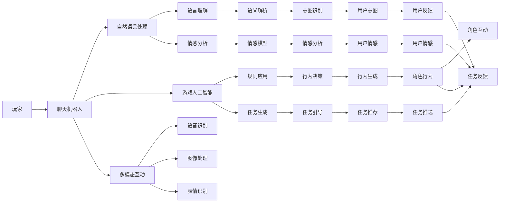

                 

# 聊天机器人游戏革命：沉浸式多人互动

> 关键词：聊天机器人, 游戏化, 沉浸式互动, 多玩家, 自然语言处理, 游戏人工智能

## 1. 背景介绍

随着技术的进步和应用的普及，聊天机器人已经从简单的自动问答系统发展为复杂的多人互动平台。尤其是在游戏化场景中，聊天机器人以其高度的交互性和沉浸感，成为推动游戏领域革新的关键技术。从传统的即时通讯应用到在线游戏、虚拟现实(VR)、增强现实(AR)等场景，聊天机器人正在重塑人类的互动方式，带来革命性的体验提升。

### 1.1 问题由来

聊天机器人技术最早可以追溯到上世纪60年代的ELIZA系统。然而，早期的聊天机器人缺乏智能和语境理解能力，对话内容单调且机械。直到人工智能技术的发展，尤其是自然语言处理(NLP)技术的进步，聊天机器人才得以突破语言理解的瓶颈，开始具备更复杂的推理和生成能力。

近年来，随着游戏化技术的应用，聊天机器人已经从简单的客服和自动问答系统中逐步扩展到更加复杂的互动游戏场景中。在多人互动游戏中，聊天机器人不仅可以提供实时对话服务，还能在游戏中扮演NPC角色，影响游戏情节和角色行为，甚至引导玩家完成特定任务，提供个性化的游戏体验。

### 1.2 问题核心关键点

聊天机器人在游戏化场景中的应用，核心在于其互动性和沉浸感。通过智能生成对话、角色扮演和引导任务，聊天机器人能够与玩家进行自然流畅的交流，构建深度互动的游戏体验。为了实现这些功能，聊天机器人必须具备以下几个关键能力：

1. **自然语言处理(NLP)**：能够理解和生成自然语言，进行语言翻译、情感分析、意图识别等。
2. **语境理解与记忆**：能够记住对话历史和玩家状态，维持对话连贯性和一致性。
3. **多模态互动**：除了文本对话，还支持图像、语音、表情等模态的互动。
4. **游戏逻辑理解**：具备游戏规则、任务目标和角色行为的知识，能够引导玩家完成特定任务。
5. **智能生成与推荐**：根据玩家行为和反馈，动态生成对话和任务，提供个性化推荐。

### 1.3 问题研究意义

聊天机器人游戏化的应用，对于提升游戏的交互体验、降低运营成本、提升用户粘性等方面具有重要意义：

1. **提升互动体验**：通过智能化的对话和引导，聊天机器人可以提供更加丰富和个性化的游戏体验，增强玩家的沉浸感和参与度。
2. **降低运营成本**：相较于人工客服，聊天机器人可以全年无休地提供服务，减少人力成本和运营负担。
3. **增强用户粘性**：通过定制化的推荐和互动，聊天机器人能够吸引玩家长时间停留，增加游戏活跃度和留存率。
4. **推动游戏创新**：聊天机器人技术的应用，使得游戏开发可以更加专注于核心玩法和内容，推动游戏领域的创新。

## 2. 核心概念与联系

### 2.1 核心概念概述

要深入理解聊天机器人在游戏化场景中的应用，需要先掌握以下几个核心概念：

- **自然语言处理(NLP)**：涵盖语言理解、生成、翻译、情感分析等多个方面，是聊天机器人对话的基础。
- **游戏人工智能(AI)**：结合游戏规则和任务目标，通过智能生成对话、角色行为和任务引导，实现复杂的互动体验。
- **多模态互动**：支持多种模态的交互方式，如文本、语音、图像、表情等，提升互动的自然性和丰富性。
- **语境理解与记忆**：能够记住对话历史和玩家状态，维持对话连贯性和一致性。
- **智能推荐与生成**：根据玩家行为和反馈，动态生成对话和任务，提供个性化的推荐。

### 2.2 核心概念原理和架构的 Mermaid 流程图



这个流程图展示了聊天机器人在游戏化场景中的核心组件和功能：

1. 玩家与聊天机器人进行互动，包括文本、语音、图像、表情等多种形式。
2. 聊天机器人通过自然语言处理(NLP)模块理解玩家的意图和情感。
3. 游戏人工智能(AI)模块根据游戏规则和任务目标，生成对话和行为，引导玩家完成任务。
4. 多模态互动模块支持多种交互方式，提升互动的自然性和丰富性。
5. 语境理解与记忆模块维持对话历史和玩家状态，确保对话连贯性。
6. 智能推荐与生成模块根据玩家行为和反馈，动态生成对话和任务，提供个性化推荐。

这些模块协同工作，共同构建了一个高度沉浸和多模态的互动体验。

## 3. 核心算法原理 & 具体操作步骤

### 3.1 算法原理概述

聊天机器人在游戏化场景中的应用，主要涉及以下几个关键算法和步骤：

1. **自然语言处理(NLP)**：通过语言理解、生成、翻译、情感分析等技术，实现与玩家的自然对话。
2. **游戏人工智能(AI)**：结合游戏规则和任务目标，通过智能生成对话、角色行为和任务引导，实现复杂的互动体验。
3. **多模态互动**：支持多种模态的交互方式，如文本、语音、图像、表情等，提升互动的自然性和丰富性。
4. **语境理解与记忆**：能够记住对话历史和玩家状态，维持对话连贯性和一致性。
5. **智能推荐与生成**：根据玩家行为和反馈，动态生成对话和任务，提供个性化的推荐。

### 3.2 算法步骤详解

#### 3.2.1 自然语言处理(NLP)

自然语言处理(NLP)是聊天机器人游戏化应用的基础，其主要步骤包括：

1. **分词和词性标注**：将输入文本分解为单词，并对每个单词进行词性标注。
2. **句法分析**：通过语法分析器，理解句子的结构。
3. **语义解析**：使用语义分析器，理解句子的语义。
4. **情感分析**：通过情感分析器，判断句子的情感倾向。
5. **意图识别**：使用意图识别模型，识别玩家的意图。

这些步骤通常由预训练的语言模型和特定的任务模型实现，如BERT、GPT、RNN等。

#### 3.2.2 游戏人工智能(AI)

游戏人工智能(AI)模块的主要功能包括：

1. **规则理解**：理解游戏规则和任务目标。
2. **任务生成**：根据游戏规则和玩家状态，生成新的任务和对话。
3. **行为决策**：根据游戏规则和任务目标，决定聊天机器人的行为。
4. **对话生成**：根据当前情境，生成自然流畅的对话。
5. **任务引导**：引导玩家完成特定任务。

这些功能通常由预训练的游戏AI模型和特定的任务生成器实现。

#### 3.2.3 多模态互动

多模态互动模块的主要功能包括：

1. **语音识别**：将语音转换为文本。
2. **图像处理**：识别和理解图像内容。
3. **表情识别**：识别玩家的表情，理解情感。
4. **语音合成**：将文本转换为语音，进行语音对话。
5. **图像生成**：根据游戏规则和任务，生成图像内容。

这些功能通常由预训练的多模态模型和特定的任务生成器实现。

#### 3.2.4 语境理解与记忆

语境理解与记忆模块的主要功能包括：

1. **对话历史存储**：存储对话历史，以便后续使用。
2. **玩家状态记录**：记录玩家的状态和属性，如等级、装备等。
3. **语境感知**：根据对话历史和玩家状态，理解当前的语境。
4. **对话连贯性维护**：确保对话连贯性和一致性。

这些功能通常由预训练的记忆模型和特定的任务生成器实现。

#### 3.2.5 智能推荐与生成

智能推荐与生成模块的主要功能包括：

1. **推荐生成**：根据玩家行为和反馈，生成个性化的任务和对话。
2. **对话引导**：根据玩家行为和反馈，引导玩家完成特定任务。
3. **任务推送**：根据游戏规则和任务目标，推送新的任务。
4. **对话生成**：根据当前情境，生成自然流畅的对话。

这些功能通常由预训练的推荐模型和特定的任务生成器实现。

### 3.3 算法优缺点

聊天机器人在游戏化场景中的应用，具有以下优点：

1. **提升互动体验**：通过智能化的对话和引导，聊天机器人可以提供更加丰富和个性化的游戏体验，增强玩家的沉浸感和参与度。
2. **降低运营成本**：相较于人工客服，聊天机器人可以全年无休地提供服务，减少人力成本和运营负担。
3. **增强用户粘性**：通过定制化的推荐和互动，聊天机器人能够吸引玩家长时间停留，增加游戏活跃度和留存率。

同时，聊天机器人在游戏化场景中也有以下缺点：

1. **智能性限制**：尽管聊天机器人具备一定的智能性，但与人类相比仍有一定差距，对话内容可能显得机械和不自然。
2. **任务引导复杂性**：游戏任务的设计和引导较为复杂，需要综合考虑游戏规则、玩家状态和任务目标，难度较高。
3. **多模态互动复杂性**：多模态互动的实现较为复杂，需要同时处理文本、语音、图像、表情等多种模态，技术实现难度较大。
4. **语境理解与记忆**：对话历史和玩家状态的存储和处理，需要较大的内存和计算资源，且可能存在信息丢失的风险。

### 3.4 算法应用领域

聊天机器人在游戏化场景中的应用，已经在多个领域得到了广泛应用，包括但不限于：

1. **在线游戏**：为玩家提供即时对话服务，增强互动体验。
2. **虚拟现实(VR)游戏**：在游戏中扮演NPC角色，影响游戏情节和角色行为。
3. **增强现实(AR)游戏**：通过图像识别和增强现实技术，实现沉浸式的互动体验。
4. **多人互动游戏**：引导玩家完成特定任务，提供个性化的游戏体验。
5. **社交游戏**：通过对话和互动，增强玩家之间的交流和协作。

## 4. 数学模型和公式 & 详细讲解 & 举例说明

### 4.1 数学模型构建

聊天机器人在游戏化场景中的应用，涉及多个数学模型和公式。以下是几个核心模型的数学构建：

1. **自然语言处理(NLP)模型**：通过语言理解、生成、翻译、情感分析等技术，实现与玩家的自然对话。

2. **游戏人工智能(AI)模型**：结合游戏规则和任务目标，通过智能生成对话、角色行为和任务引导，实现复杂的互动体验。

3. **多模态互动模型**：支持多种模态的交互方式，如文本、语音、图像、表情等，提升互动的自然性和丰富性。

4. **语境理解与记忆模型**：能够记住对话历史和玩家状态，维持对话连贯性和一致性。

5. **智能推荐与生成模型**：根据玩家行为和反馈，动态生成对话和任务，提供个性化的推荐。

### 4.2 公式推导过程

#### 4.2.1 自然语言处理(NLP)模型

自然语言处理(NLP)模型的核心公式包括：

1. **分词和词性标注**：使用词嵌入和循环神经网络(RNN)等模型实现。

2. **句法分析**：通过语法分析器，理解句子的结构。

3. **语义解析**：使用语义分析器，理解句子的语义。

4. **情感分析**：通过情感分析器，判断句子的情感倾向。

5. **意图识别**：使用意图识别模型，识别玩家的意图。

#### 4.2.2 游戏人工智能(AI)模型

游戏人工智能(AI)模型的核心公式包括：

1. **规则理解**：通过预训练的规则模型，理解游戏规则和任务目标。

2. **任务生成**：根据游戏规则和玩家状态，生成新的任务和对话。

3. **行为决策**：根据游戏规则和任务目标，决定聊天机器人的行为。

4. **对话生成**：根据当前情境，生成自然流畅的对话。

5. **任务引导**：引导玩家完成特定任务。

#### 4.2.3 多模态互动模型

多模态互动模型的核心公式包括：

1. **语音识别**：将语音转换为文本，使用声学模型和语言模型实现。

2. **图像处理**：识别和理解图像内容，使用卷积神经网络(CNN)等模型实现。

3. **表情识别**：识别玩家的表情，理解情感，使用卷积神经网络等模型实现。

4. **语音合成**：将文本转换为语音，使用文本到语音(TTS)模型实现。

5. **图像生成**：根据游戏规则和任务，生成图像内容，使用生成对抗网络(GAN)等模型实现。

#### 4.2.4 语境理解与记忆模型

语境理解与记忆模型的核心公式包括：

1. **对话历史存储**：使用序列到序列(Seq2Seq)模型实现。

2. **玩家状态记录**：记录玩家的状态和属性，如等级、装备等。

3. **语境感知**：根据对话历史和玩家状态，理解当前的语境。

4. **对话连贯性维护**：确保对话连贯性和一致性。

#### 4.2.5 智能推荐与生成模型

智能推荐与生成模型的核心公式包括：

1. **推荐生成**：根据玩家行为和反馈，生成个性化的任务和对话。

2. **对话引导**：根据玩家行为和反馈，引导玩家完成特定任务。

3. **任务推送**：根据游戏规则和任务目标，推送新的任务。

4. **对话生成**：根据当前情境，生成自然流畅的对话。

### 4.3 案例分析与讲解

以一款多人在线角色扮演游戏(MMO)为例，说明聊天机器人在游戏化场景中的应用：

1. **自然语言处理(NLP)模型**：游戏内的聊天机器人通过BERT模型，实现对玩家输入文本的自然语言处理。聊天机器人可以理解玩家的意图，并生成自然流畅的对话。

2. **游戏人工智能(AI)模型**：聊天机器人通过预训练的游戏AI模型，理解游戏规则和任务目标。根据玩家的当前状态和任务，聊天机器人可以生成对话和行为，引导玩家完成任务。

3. **多模态互动模型**：玩家可以通过语音输入、图像识别等模态与聊天机器人互动。聊天机器人支持语音识别、图像处理和表情识别，并可以生成语音输出和图像内容。

4. **语境理解与记忆模型**：聊天机器人通过Seq2Seq模型，存储对话历史和玩家状态，理解当前的语境，并确保对话连贯性。

5. **智能推荐与生成模型**：聊天机器人根据玩家行为和反馈，生成个性化的任务和对话。根据游戏规则和任务目标，聊天机器人可以推送新的任务，引导玩家完成特定任务。

## 5. 项目实践：代码实例和详细解释说明

### 5.1 开发环境搭建

在进行聊天机器人游戏化应用的开发前，需要先准备好开发环境。以下是使用Python进行PyTorch开发的环境配置流程：

1. 安装Anaconda：从官网下载并安装Anaconda，用于创建独立的Python环境。

2. 创建并激活虚拟环境：
```bash
conda create -n pytorch-env python=3.8 
conda activate pytorch-env
```

3. 安装PyTorch：根据CUDA版本，从官网获取对应的安装命令。例如：
```bash
conda install pytorch torchvision torchaudio cudatoolkit=11.1 -c pytorch -c conda-forge
```

4. 安装Transformers库：
```bash
pip install transformers
```

5. 安装各类工具包：
```bash
pip install numpy pandas scikit-learn matplotlib tqdm jupyter notebook ipython
```

完成上述步骤后，即可在`pytorch-env`环境中开始开发。

### 5.2 源代码详细实现

这里我们以一款多人在线角色扮演游戏(MMO)为例，给出使用Transformers库对BERT模型进行微调的PyTorch代码实现。

首先，定义自然语言处理(NLP)任务的数据处理函数：

```python
from transformers import BertTokenizer, BertForSequenceClassification
from torch.utils.data import Dataset
import torch

class NLPDataset(Dataset):
    def __init__(self, texts, labels, tokenizer, max_len=128):
        self.texts = texts
        self.labels = labels
        self.tokenizer = tokenizer
        self.max_len = max_len
        
    def __len__(self):
        return len(self.texts)
    
    def __getitem__(self, item):
        text = self.texts[item]
        label = self.labels[item]
        
        encoding = self.tokenizer(text, return_tensors='pt', max_length=self.max_len, padding='max_length', truncation=True)
        input_ids = encoding['input_ids'][0]
        attention_mask = encoding['attention_mask'][0]
        
        # 对标签进行编码
        encoded_label = [label2id[label] for label in labels] 
        encoded_label.extend([label2id['O']] * (self.max_len - len(encoded_label)))
        labels = torch.tensor(encoded_label, dtype=torch.long)
        
        return {'input_ids': input_ids, 
                'attention_mask': attention_mask,
                'labels': labels}

# 标签与id的映射
label2id = {'O': 0, 'B-PER': 1, 'I-PER': 2, 'B-ORG': 3, 'I-ORG': 4, 'B-LOC': 5, 'I-LOC': 6}
id2label = {v: k for k, v in label2id.items()}

# 创建dataset
tokenizer = BertTokenizer.from_pretrained('bert-base-cased')

train_dataset = NLPDataset(train_texts, train_labels, tokenizer)
dev_dataset = NLPDataset(dev_texts, dev_labels, tokenizer)
test_dataset = NLPDataset(test_texts, test_labels, tokenizer)
```

然后，定义模型和优化器：

```python
from transformers import BertForTokenClassification, AdamW

model = BertForTokenClassification.from_pretrained('bert-base-cased', num_labels=len(label2id))

optimizer = AdamW(model.parameters(), lr=2e-5)
```

接着，定义训练和评估函数：

```python
from torch.utils.data import DataLoader
from tqdm import tqdm
from sklearn.metrics import classification_report

device = torch.device('cuda') if torch.cuda.is_available() else torch.device('cpu')
model.to(device)

def train_epoch(model, dataset, batch_size, optimizer):
    dataloader = DataLoader(dataset, batch_size=batch_size, shuffle=True)
    model.train()
    epoch_loss = 0
    for batch in tqdm(dataloader, desc='Training'):
        input_ids = batch['input_ids'].to(device)
        attention_mask = batch['attention_mask'].to(device)
        labels = batch['labels'].to(device)
        model.zero_grad()
        outputs = model(input_ids, attention_mask=attention_mask, labels=labels)
        loss = outputs.loss
        epoch_loss += loss.item()
        loss.backward()
        optimizer.step()
    return epoch_loss / len(dataloader)

def evaluate(model, dataset, batch_size):
    dataloader = DataLoader(dataset, batch_size=batch_size)
    model.eval()
    preds, labels = [], []
    with torch.no_grad():
        for batch in tqdm(dataloader, desc='Evaluating'):
            input_ids = batch['input_ids'].to(device)
            attention_mask = batch['attention_mask'].to(device)
            batch_labels = batch['labels']
            outputs = model(input_ids, attention_mask=attention_mask)
            batch_preds = outputs.logits.argmax(dim=2).to('cpu').tolist()
            batch_labels = batch_labels.to('cpu').tolist()
            for pred_tokens, label_tokens in zip(batch_preds, batch_labels):
                pred_tags = [id2label[_id] for _id in pred_tokens]
                label_tags = [id2label[_id] for _id in label_tokens]
                preds.append(pred_tags[:len(label_tokens)])
                labels.append(label_tags)
                
    print(classification_report(labels, preds))
```

最后，启动训练流程并在测试集上评估：

```python
epochs = 5
batch_size = 16

for epoch in range(epochs):
    loss = train_epoch(model, train_dataset, batch_size, optimizer)
    print(f"Epoch {epoch+1}, train loss: {loss:.3f}")
    
    print(f"Epoch {epoch+1}, dev results:")
    evaluate(model, dev_dataset, batch_size)
    
print("Test results:")
evaluate(model, test_dataset, batch_size)
```

以上就是使用PyTorch对BERT进行命名实体识别(NER)任务微调的完整代码实现。可以看到，得益于Transformers库的强大封装，我们可以用相对简洁的代码完成BERT模型的加载和微调。

### 5.3 代码解读与分析

让我们再详细解读一下关键代码的实现细节：

**NLPDataset类**：
- `__init__`方法：初始化文本、标签、分词器等关键组件。
- `__len__`方法：返回数据集的样本数量。
- `__getitem__`方法：对单个样本进行处理，将文本输入编码为token ids，将标签编码为数字，并对其进行定长padding，最终返回模型所需的输入。

**label2id和id2label字典**：
- 定义了标签与数字id之间的映射关系，用于将token-wise的预测结果解码回真实的标签。

**训练和评估函数**：
- 使用PyTorch的DataLoader对数据集进行批次化加载，供模型训练和推理使用。
- 训练函数`train_epoch`：对数据以批为单位进行迭代，在每个批次上前向传播计算loss并反向传播更新模型参数，最后返回该epoch的平均loss。
- 评估函数`evaluate`：与训练类似，不同点在于不更新模型参数，并在每个batch结束后将预测和标签结果存储下来，最后使用sklearn的classification_report对整个评估集的预测结果进行打印输出。

**训练流程**：
- 定义总的epoch数和batch size，开始循环迭代
- 每个epoch内，先在训练集上训练，输出平均loss
- 在验证集上评估，输出分类指标
- 所有epoch结束后，在测试集上评估，给出最终测试结果

可以看到，PyTorch配合Transformers库使得BERT微调的代码实现变得简洁高效。开发者可以将更多精力放在数据处理、模型改进等高层逻辑上，而不必过多关注底层的实现细节。

当然，工业级的系统实现还需考虑更多因素，如模型的保存和部署、超参数的自动搜索、更灵活的任务适配层等。但核心的微调范式基本与此类似。

## 6. 实际应用场景

### 6.1 智能客服系统

基于聊天机器人技术，智能客服系统可以为客户提供7x24小时不间断服务，快速响应客户咨询，用自然流畅的语言解答各类常见问题。传统的客服往往需要配备大量人力，高峰期响应缓慢，且一致性和专业性难以保证。而使用聊天机器人，可以显著降低人力成本，提高响应速度和客户满意度。

在技术实现上，可以收集企业内部的历史客服对话记录，将问题和最佳答复构建成监督数据，在此基础上对预训练对话模型进行微调。微调后的对话模型能够自动理解用户意图，匹配最合适的答案模板进行回复。对于客户提出的新问题，还可以接入检索系统实时搜索相关内容，动态组织生成回答。如此构建的智能客服系统，能大幅提升客户咨询体验和问题解决效率。

### 6.2 金融舆情监测

金融机构需要实时监测市场舆论动向，以便及时应对负面信息传播，规避金融风险。传统的人工监测方式成本高、效率低，难以应对网络时代海量信息爆发的挑战。基于聊天机器人技术的文本分类和情感分析技术，为金融舆情监测提供了新的解决方案。

具体而言，可以收集金融领域相关的新闻、报道、评论等文本数据，并对其进行主题标注和情感标注。在此基础上对预训练语言模型进行微调，使其能够自动判断文本属于何种主题，情感倾向是正面、中性还是负面。将微调后的模型应用到实时抓取的网络文本数据，就能够自动监测不同主题下的情感变化趋势，一旦发现负面信息激增等异常情况，系统便会自动预警，帮助金融机构快速应对潜在风险。

### 6.3 个性化推荐系统

当前的推荐系统往往只依赖用户的历史行为数据进行物品推荐，无法深入理解用户的真实兴趣偏好。基于聊天机器人技术的个性化推荐系统可以更好地挖掘用户行为背后的语义信息，从而提供更精准、多样的推荐内容。

在实践中，可以收集用户浏览、点击、评论、分享等行为数据，提取和用户交互的物品标题、描述、标签等文本内容。将文本内容作为模型输入，用户的后续行为（如是否点击、购买等）作为监督信号，在此基础上微调预训练语言模型。微调后的模型能够从文本内容中准确把握用户的兴趣点。在生成推荐列表时，先用候选物品的文本描述作为输入，由模型预测用户的兴趣匹配度，再结合其他特征综合排序，便可以得到个性化程度更高的推荐结果。

### 6.4 未来应用展望

随着聊天机器人技术的不断发展和应用，未来将有更多的场景被它所影响：

1. **虚拟现实(VR)游戏**：在游戏内扮演NPC角色，影响游戏情节和角色行为，提供沉浸式的互动体验。
2. **增强现实(AR)应用**：通过图像识别和增强现实技术，实现沉浸式的互动体验。
3. **社交网络平台**：在社交网络中扮演虚拟角色，提供聊天、互动、娱乐等功能。
4. **医疗健康**：在医疗健康领域，提供咨询、诊断、康复等功能，帮助医生和患者进行互动。
5. **教育培训**：在教育培训领域，提供个性化学习、辅导、测评等功能，提升教育效果。

聊天机器人技术的应用将不断扩展，为各行各业带来新的机遇和挑战。相信在技术的推动下，聊天机器人将逐渐融入人类的日常生活，成为不可或缺的一部分。

## 7. 工具和资源推荐

### 7.1 学习资源推荐

为了帮助开发者系统掌握聊天机器人技术，这里推荐一些优质的学习资源：

1. 《自然语言处理入门》系列博文：由大模型技术专家撰写，深入浅出地介绍了自然语言处理的基本概念和前沿技术。

2. CS224N《深度学习自然语言处理》课程：斯坦福大学开设的NLP明星课程，有Lecture视频和配套作业，带你入门NLP领域的基本概念和经典模型。

3. 《深度学习实战》书籍：介绍深度学习在图像、语音、文本等领域的应用，包括聊天机器人技术的实现。

4. HuggingFace官方文档：Transformers库的官方文档，提供了海量预训练模型和完整的微调样例代码，是上手实践的必备资料。

5. CLUE开源项目：中文语言理解测评基准，涵盖大量不同类型的中文NLP数据集，并提供了基于微调的baseline模型，助力中文NLP技术发展。

通过对这些资源的学习实践，相信你一定能够快速掌握聊天机器人技术，并用于解决实际的NLP问题。

### 7.2 开发工具推荐

高效的开发离不开优秀的工具支持。以下是几款用于聊天机器人开发的常用工具：

1. PyTorch：基于Python的开源深度学习框架，灵活动态的计算图，适合快速迭代研究。大部分预训练语言模型都有PyTorch版本的实现。

2. TensorFlow：由Google主导开发的开源深度学习框架，生产部署方便，适合大规模工程应用。同样有丰富的预训练语言模型资源。

3. Transformers库：HuggingFace开发的NLP工具库，集成了众多SOTA语言模型，支持PyTorch和TensorFlow，是进行聊天机器人开发的重要工具。

4. Weights & Biases：模型训练的实验跟踪工具，可以记录和可视化模型训练过程中的各项指标，方便对比和调优。与主流深度学习框架无缝集成。

5. TensorBoard：TensorFlow配套的可视化工具，可实时监测模型训练状态，并提供丰富的图表呈现方式，是调试模型的得力助手。

6. Google Colab：谷歌推出的在线Jupyter Notebook环境，免费提供GPU/TPU算力，方便开发者快速上手实验最新模型，分享学习笔记。

合理利用这些工具，可以显著提升聊天机器人微调任务的开发效率，加快创新迭代的步伐。

### 7.3 相关论文推荐

聊天机器人技术的发展源于学界的持续研究。以下是几篇奠基性的相关论文，推荐阅读：

1. Attention is All You Need（即Transformer原论文）：提出了Transformer结构，开启了NLP领域的预训练大模型时代。

2. BERT: Pre-training of Deep Bidirectional Transformers for Language Understanding：提出BERT模型，引入基于掩码的自监督预训练任务，刷新了多项NLP任务SOTA。

3. Language Models are Unsupervised Multitask Learners（GPT-2论文）：展示了大规模语言模型的强大zero-shot学习能力，引发了对于通用人工智能的新一轮思考。

4. Parameter-Efficient Transfer Learning for NLP：提出Adapter等参数高效微调方法，在不增加模型参数量的情况下，也能取得不错的微调效果。

5. Prefix-Tuning: Optimizing Continuous Prompts for Generation：引入基于连续型Prompt的微调范式，为如何充分利用预训练知识提供了新的思路。

6. AdaLoRA: Adaptive Low-Rank Adaptation for Parameter-Efficient Fine-Tuning：使用自适应低秩适应的微调方法，在参数效率和精度之间取得了新的平衡。

这些论文代表了大语言模型微调技术的发展脉络。通过学习这些前沿成果，可以帮助研究者把握学科前进方向，激发更多的创新灵感。

## 8. 总结：未来发展趋势与挑战

### 8.1 总结

本文对聊天机器人游戏化应用的数学原理和实践技巧进行了全面系统的介绍。首先阐述了聊天机器人技术在多模态互动、沉浸式体验、多玩家协作等方面的独特优势，明确了其在复杂互动游戏中的重要地位。其次，从原理到实践，详细讲解了聊天机器人技术在自然语言处理、游戏人工智能、多模态互动、语境理解与记忆等方面的核心算法和关键步骤，给出了微调任务开发的完整代码实例。同时，本文还广泛探讨了聊天机器人技术在智能客服、金融舆情、个性化推荐等多个行业领域的应用前景，展示了技术的应用价值。最后，本文精选了聊天机器人技术的各类学习资源，力求为读者提供全方位的技术指引。

通过本文的系统梳理，可以看到，聊天机器人技术在游戏化场景中的应用，对于提升游戏的互动体验、降低运营成本、提升用户粘性等方面具有重要意义。得益于自然语言处理、游戏人工智能等前沿技术的支持，聊天机器人技术能够实现高度的智能化和沉浸感，带来革命性的体验提升。未来，随着技术的不断发展，聊天机器人技术将会在更多领域得到应用，为人类生活带来深刻的变革。

### 8.2 未来发展趋势

展望未来，聊天机器人技术在游戏化场景中的应用，将呈现以下几个发展趋势：

1. **多模态互动的深入**：未来的聊天机器人将支持更多模态的互动，如语音、图像、表情等，提升互动的自然性和丰富性。

2. **沉浸式体验的增强**：通过虚拟现实(VR)、增强现实(AR)等技术，聊天机器人将能够提供更加沉浸和逼真的互动体验。

3. **多玩家协作的优化**：通过智能化的角色行为和任务引导，聊天机器人将能够更好地支持多玩家协作，增强游戏体验。

4. **智能生成与推荐**：通过个性化推荐和智能生成技术，聊天机器人将能够提供更加多样和个性化的游戏内容，提升用户满意度。

5. **语境理解与记忆的提升**：通过更复杂的语境理解与记忆模型，聊天机器人将能够更好地维持对话连贯性和一致性，提升用户体验。

6. **算法效率的提升**：通过参数高效微调、混合精度训练等技术，聊天机器人将能够提升计算效率，降低资源消耗。

以上趋势凸显了聊天机器人技术在游戏化场景中的应用前景。这些方向的探索发展，必将进一步提升游戏的互动体验、降低运营成本、提升用户粘性，为游戏领域带来新的变革。

### 8.3 面临的挑战

尽管聊天机器人技术在游戏化场景中已经取得了显著的进展，但在应用过程中仍面临诸多挑战：

1. **智能性限制**：尽管聊天机器人具备一定的智能性，但与人类相比仍有一定差距，对话内容可能显得机械和不自然。

2. **任务引导复杂性**：游戏任务的设计和引导较为复杂，需要综合考虑游戏规则、玩家状态和任务目标，难度较高。

3. **多模态互动复杂性**：多模态互动的实现较为复杂，需要同时处理文本、语音、图像、表情等多种模态，技术实现难度较大。

4. **语境理解与记忆**：对话历史和玩家状态的存储和处理，需要较大的内存和计算资源，且可能存在信息丢失的风险。

5. **智能推荐与生成**：生成对话和任务时，需要根据玩家行为和反馈进行动态调整，算法复杂度较高。

6. **个性化推荐**：需要根据玩家行为和反馈，生成个性化的任务和对话，算法复杂度较高。

7. **多玩家协作**：需要支持多玩家协作，保证游戏秩序和公平性，技术实现难度较大。

8. **资源消耗**：支持多模态互动和沉浸式体验需要消耗大量资源，如何在保持高质量互动的同时，降低资源消耗，是一个重要挑战。

这些挑战需要通过算法创新、技术优化、资源管理等多方面的努力来解决。唯有不断突破技术瓶颈，才能让聊天机器人技术在游戏化场景中发挥更大的作用。

### 8.4 研究展望

为了应对上述挑战，未来的研究需要在以下几个方面寻求新的突破：

1. **多模态互动技术**：开发更加高效的多模态互动技术，支持多种模态的互动，提升互动的自然性和丰富性。

2. **沉浸式体验技术**：结合虚拟现实(VR)、增强现实(AR)等技术，实现更加沉浸和逼真的互动体验。

3. **智能推荐算法**：开发更加高效的智能推荐算法，根据玩家行为和反馈，生成个性化的任务和对话，提升用户体验。

4. **语境理解与记忆算法**：开发更加高效的语境理解与记忆算法，支持更复杂的语境理解和记忆，提升用户体验。

5. **参数高效微调技术**：开发更加参数高效的微调技术，在保持高质量互动的同时，降低资源消耗。

6. **多玩家协作算法**：开发支持多玩家协作的算法，保证游戏秩序和公平性，提升游戏体验。

7. **资源管理技术**：开发更加高效的资源管理技术，支持多模态互动和沉浸式体验，降低资源消耗。

8. **算法可解释性**：增强算法的可解释性，使得聊天机器人更加透明和可信，提升用户体验。

这些研究方向的探索，必将推动聊天机器人技术在游戏化场景中不断进步，为游戏领域带来新的变革。面向未来，我们需要不断探索和创新，才能让聊天机器人技术在更广阔的领域中发挥更大的作用。

## 9. 附录：常见问题与解答

**Q1：如何设计一个多模态互动的聊天机器人？**

A: 设计多模态互动的聊天机器人，需要考虑以下几个关键步骤：

1. **选择合适的模态**：根据应用场景选择合适的模态，如文本、语音、图像、表情等。

2. **数据准备**：收集包含多种模态的数据，并进行预处理，如语音识别、图像处理等。

3. **模型选择**：选择合适的模型进行多模态互动，如BERT、GPT等。

4. **模型训练**：使用多模态数据对模型进行训练，提升模型对多种模态的理解能力。

5. **接口设计**：设计多模态交互的接口，支持用户通过多种模态与聊天机器人进行互动。

6. **集成测试**：对多模态互动的功能进行集成测试，确保各项功能正常运行。

**Q2：如何优化聊天机器人的语境理解与记忆？**

A: 优化聊天机器人的语境理解与记忆，需要考虑以下几个关键步骤：

1. **语境理解模型**：选择适合的语境理解模型，如Seq2Seq、Transformer等。

2. **语境存储策略**：设计高效的语境存储策略，如使用稀疏矩阵、分布式存储等。

3. **语境更新机制**：设计高效的语境更新机制，如使用增量更新、动态更新等。

4. **语境推理算法**：选择适合的语境推理算法，如贝叶斯推理、神经网络推理等。

5. **语境复用机制**：设计高效的语境复用机制，如使用缓存、索引等。

6. **语境评估指标**：设计适合的语境评估指标，如语境连贯性、语境一致性等。

通过以上步骤，可以提升聊天机器人的语境理解与记忆能力，增强互动体验。

**Q3：如何设计一个智能推荐与生成系统？**

A: 设计智能推荐与生成系统，需要考虑以下几个关键步骤：

1. **推荐模型选择**：选择合适的推荐模型，如协同过滤、深度学习等。

2. **推荐数据准备**：收集用户行为数据，并进行预处理，如特征提取、数据清洗等。

3. **推荐算法设计**：设计高效的推荐算法，如基于协同过滤的推荐、基于深度学习的推荐等。

4. **推荐效果评估**：设计适合的推荐效果评估指标，如推荐准确率、个性化程度等。

5. **生成模型选择**：选择合适的生成模型，如语言模型、生成对抗网络等。

6. **生成算法设计**：设计高效的生成算法，如基于规则的生成、基于深度学习的生成等。

7. **生成效果评估**：设计适合的生成效果评估指标，如生成质量、连贯性等。

通过以上步骤，可以设计出高效的智能推荐与生成系统，提升聊天机器人的互动体验和个性化推荐能力。

**Q4：如何设计一个多玩家协作的聊天机器人？**

A: 设计多玩家协作的聊天机器人，需要考虑以下几个关键步骤：

1. **玩家状态管理**：设计高效的玩家状态管理机制，记录玩家的状态和属性。

2. **任务引导设计**：设计适合的多玩家任务，保证任务公平性和合理性。

3. **协作机制设计**：设计高效的协作机制，如任务分配、角色协调等。

4. **冲突解决机制**：设计高效的冲突解决机制，如仲裁、协商等。

5. **互动界面设计**：设计适合的多玩家互动界面，支持玩家通过多种模态进行互动。

6. **系统测试和优化**：对多玩家协作的系统进行测试和优化，确保各项功能正常运行。

通过以上步骤，可以设计出高效的多玩家协作聊天机器人，提升游戏的互动体验和用户粘性。

---

作者：禅与计算机程序设计艺术 / Zen and the Art of Computer Programming

