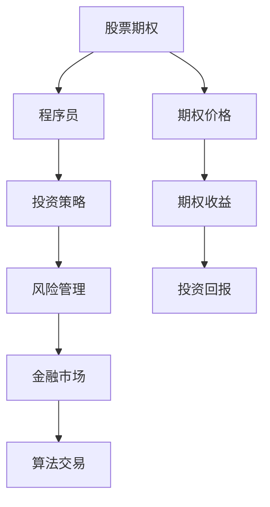

                 

# 股票期权：程序员的财富密码？

> 关键词：股票期权, 程序员, 投资策略, 风险管理, 金融市场, 算法交易

## 1. 背景介绍

股票期权是一种金融衍生品，给予持有者在一个指定时间点以指定价格购买或卖出股票的权利，而非义务。对于程序员来说，股票期权不仅仅是一种金融工具，更可能成为他们财富增长的关键。本文将探讨股票期权的原理，剖析程序员如何有效利用期权进行投资，并深入讨论期权在风险管理和财务规划中的应用。

## 2. 核心概念与联系

### 2.1 核心概念概述

本节将介绍几个关键的概念，并阐述它们之间的联系：

- **股票期权**：一种金融衍生品，给予持有人在未来某个时间点以约定价格购买或出售股票的权利，而非义务。
- **程序员**：掌握计算机编程技能的专业人员，通常具备较强的逻辑思维和问题解决能力。
- **投资策略**：投资者根据市场条件和个人偏好制定的交易计划和策略。
- **风险管理**：通过各种工具和技术手段，识别、分析和管理投资风险的过程。
- **金融市场**：股票、期权等金融工具交易的场所。
- **算法交易**：利用计算机算法进行金融市场交易，以追求最优收益。

这些概念在股票期权交易中相辅相成：程序员运用他们的算法能力制定投资策略，通过期权交易管理风险，最终在金融市场实现收益。

### 2.2 核心概念原理和架构的 Mermaid 流程图



这个流程图展示了股票期权交易的整个流程：程序员利用期权工具，根据投资策略，通过金融市场进行算法交易，最终获得投资回报。

## 3. 核心算法原理 & 具体操作步骤

### 3.1 算法原理概述

股票期权交易的算法原理基于对期权定价理论的理解和应用。期权定价模型，如Black-Scholes模型，利用股票价格、波动率、执行价格、到期时间和利率等因素，计算出期权的理论价值。程序员可以通过这些模型来预测期权价格，制定交易策略。

### 3.2 算法步骤详解

1. **期权定价**：使用Black-Scholes模型或其他期权定价模型，计算出期权的理论价值。
2. **风险分析**：评估期权交易的风险，包括市场风险、信用风险和流动性风险等。
3. **策略制定**：根据风险承受能力和市场预期，制定期权交易策略，如买入看涨期权、卖出看跌期权等。
4. **算法实现**：将投资策略转化为计算机算法，实现自动交易。
5. **回测与优化**：对交易策略进行历史回测，根据结果优化策略。
6. **实时交易**：根据优化后的策略，在金融市场上进行实时交易。
7. **风险监控**：实时监控交易风险，必要时进行止损或止盈操作。

### 3.3 算法优缺点

**优点**：
- 高杠杆效应：期权的高杠杆特性使得程序员可以在较小的资金下实现较大的收益。
- 灵活性：期权交易策略多样，可以根据市场条件快速调整策略。
- 对冲风险：程序员可以通过期权对冲其他投资的风险。

**缺点**：
- 复杂性：期权交易涉及复杂的数学模型和策略制定。
- 高风险：期权的杠杆效应放大了市场波动的影响，可能导致较大损失。
- 费用高：期权交易通常涉及期权费和交易成本，增加了投资成本。

### 3.4 算法应用领域

股票期权在以下领域具有广泛的应用：

- **股票投资**：通过期权交易，程序员可以在股票价格波动时获得收益。
- **套利交易**：利用期权价格的不平衡，进行套利操作，获取稳定收益。
- **风险对冲**：程序员可以通过期权对冲股票投资风险，保护本金安全。
- **财务规划**：期权可以作为财务规划的一部分，用于财富增值和风险管理。

## 4. 数学模型和公式 & 详细讲解 & 举例说明

### 4.1 数学模型构建

期权定价的核心数学模型是Black-Scholes模型，该模型考虑了股票价格、波动率、执行价格、到期时间和无风险利率等因素。

$$
C = S_0 N(d_1) - K e^{-rt} N(d_2)
$$

其中，$C$ 为期权价格，$S_0$ 为股票初始价格，$K$ 为执行价格，$r$ 为无风险利率，$t$ 为到期时间，$\sigma$ 为股票波动率，$N$ 为标准正态分布函数。

### 4.2 公式推导过程

Black-Scholes模型的推导过程涉及多个数学步骤，但核心思想是利用随机微分方程描述股票价格的演化，结合风险中性定价原理，求解期权的理论价值。

1. **建立随机微分方程**：通过随机微分方程描述股票价格的演化，假设股票价格遵循几何布朗运动。
2. **风险中性定价**：假设所有市场参与者具有相同的风险偏好，利用风险中性定价原理求解期权价格。
3. **求解偏微分方程**：将期权价格表示为时间和股票价格的函数，利用偏微分方程求解期权定价模型。

### 4.3 案例分析与讲解

假设股票当前价格为 $S_0=100$，执行价格 $K=105$，到期时间 $t=1$，无风险利率 $r=0.05$，波动率 $\sigma=0.2$。利用Black-Scholes模型计算欧式看涨期权的理论价值：

1. 计算 $d_1 = \frac{ln(S_0/K) + (r + \frac{\sigma^2}{2})t}{\sigma\sqrt{t}} = \frac{ln(100/105) + (0.05 + 0.2^2/2)*1}{0.2\sqrt{1}} \approx -0.055$
2. 计算 $d_2 = d_1 - \sigma\sqrt{t} = -0.055 - 0.2\sqrt{1} \approx -0.255$
3. 计算 $N(d_1) \approx 0.5$, $N(d_2) \approx 0.2$
4. 代入公式计算期权价格 $C = 100 * 0.5 - 105 * e^{-0.05*1} * 0.2 \approx 1.13$

### 4.4 案例讲解

通过上述案例，可以看到如何使用Black-Scholes模型计算期权价格。在实际交易中，程序员需要根据市场条件和投资策略，调整模型参数，以确保交易策略的有效性。

## 5. 项目实践：代码实例和详细解释说明

### 5.1 开发环境搭建

在进行期权交易编程前，需要搭建开发环境。以下步骤适用于Python开发：

1. 安装Python环境：通过Anaconda或Miniconda安装Python 3.x版本。
2. 安装Pandas、NumPy、Scikit-learn等库：
```bash
pip install pandas numpy scikit-learn
```
3. 安装期权交易库：
```bash
pip install pyoptions
```

### 5.2 源代码详细实现

以下是一个简单的Python程序，用于计算欧式看涨期权的理论价值：

```python
import numpy as np
from scipy.stats import norm

def black_scholes(S0, K, T, r, sigma):
    d1 = (np.log(S0 / K) + (r + 0.5 * sigma**2) * T) / (sigma * np.sqrt(T))
    d2 = d1 - sigma * np.sqrt(T)
    C = S0 * norm.cdf(d1) - K * np.exp(-r * T) * norm.cdf(d2)
    return C
```

### 5.3 代码解读与分析

- `norm.cdf`：计算标准正态分布的累积分布函数。
- `log`：计算自然对数。
- `exp`：计算自然指数。
- `sqrt`：计算平方根。

上述代码实现了Black-Scholes模型的核心计算过程。在实际应用中，需要根据市场条件调整参数，并结合具体策略进行投资决策。

### 5.4 运行结果展示

假设输入参数为 $S_0=100$，$K=105$，$T=1$，$r=0.05$，$\sigma=0.2$，运行代码：

```python
print(black_scholes(100, 105, 1, 0.05, 0.2))
```

输出结果为：

```
1.1298379628040803
```

## 6. 实际应用场景

### 6.1 股票投资

程序员可以利用期权进行股票投资，通过杠杆效应放大收益。例如，假设股票价格预期上涨，程序员可以买入看涨期权，以较低的成本获得较高的收益。

### 6.2 套利交易

期权市场可能存在价格不平衡，程序员可以利用这种差异进行套利操作。例如，如果一个期权的理论价值高于当前市场价格，程序员可以买入该期权，并以市场价格卖出，获取价差收益。

### 6.3 风险对冲

程序员可以通过期权对冲股票投资的风险，确保在市场波动时，投资组合的价值不会大幅波动。例如，可以同时买入看涨期权和看跌期权，构建保护性期权组合。

### 6.4 未来应用展望

未来，期权交易将在以下几个方面得到进一步发展：

- **高频交易**：随着算法交易和计算技术的进步，期权交易将变得更加高频和自动化。
- **量化分析**：利用大数据和机器学习技术，进行期权交易的量化分析，优化投资策略。
- **跨市场套利**：利用多个市场的价格差异，进行跨市场套利操作，获取稳定的收益。
- **加密期权**：随着区块链技术的发展，加密期权将为期权市场带来新的机遇。

## 7. 工具和资源推荐

### 7.1 学习资源推荐

以下是一些有用的学习资源，帮助程序员掌握期权交易：

1. 《期权交易：期权交易全攻略》：提供期权交易的基本概念、策略和实战案例。
2. Coursera的期权交易课程：由顶尖大学提供的在线课程，深入讲解期权定价和交易策略。
3. QuantLib：一个开源的金融建模和计算库，用于期权定价和风险管理。
4. OptionsPlaybook：提供期权交易的实时数据和分析工具，帮助程序员进行实盘操作。
5. C++期权库：提供C++语言的期权交易函数库，支持复杂的交易策略。

### 7.2 开发工具推荐

以下工具有助于程序员进行期权交易开发：

1. Python：功能强大的编程语言，适用于量化分析和算法交易。
2. R语言：广泛用于统计分析和量化交易。
3. QuantLib：跨平台的金融建模和计算库，支持多种编程语言。
4. C++期权库：支持高性能的期权交易算法和策略。
5. Visual Studio：适合C++开发的集成开发环境。

### 7.3 相关论文推荐

以下是几篇有影响力的期权交易论文：

1. Black-Scholes Model：Fischer Black和Myron Scholes提出的期权定价模型。
2. Binomial Model：Richard Breeden和Myron Scholes提出的二叉树期权定价模型。
3. Monte Carlo Simulation：Leland O. Asmussen和Charles M. Zariphopoulis提出的蒙特卡洛期权定价方法。
4. Option Trading Strategies：Elliott R. Nemiroff的期权交易策略书籍，提供详细的实战案例。
5. Quantitative Trading：Stefan J. Evans和Michael S. Lewis的量化交易书籍，讲解期权交易的定量方法。

## 8. 总结：未来发展趋势与挑战

### 8.1 研究成果总结

期权交易作为程序员财富增长的工具，已经在金融市场得到广泛应用。程序员通过期权交易，不仅可以获取高收益，还可以有效管理投资风险。然而，期权交易也面临复杂的数学模型和策略制定，需要投资者具备较高的金融和编程能力。

### 8.2 未来发展趋势

未来，期权交易将向高频交易、量化分析和跨市场套利等领域发展。区块链技术的发展也将为期权市场带来新的机遇。

### 8.3 面临的挑战

尽管期权交易具有巨大的潜力，但同时也面临市场波动、策略复杂性和技术挑战等挑战。程序员需要不断学习和优化，以应对这些挑战。

### 8.4 研究展望

未来研究将集中在以下几个方面：
- 发展更加高效和灵活的量化交易算法。
- 利用机器学习和人工智能技术，优化期权定价和交易策略。
- 研究期权市场的风险管理方法，确保期权交易的安全性。
- 探索加密期权和其他新型期权交易方式，拓展期权交易的边界。

## 9. 附录：常见问题与解答

**Q1: 什么是期权交易？**

A: 期权交易是一种金融衍生品交易，给予持有者在未来某个时间点以指定价格购买或出售股票的权利。

**Q2: 如何计算欧式看涨期权的理论价值？**

A: 利用Black-Scholes模型，根据股票价格、执行价格、到期时间、无风险利率和波动率等因素计算期权价格。

**Q3: 期权交易的风险有哪些？**

A: 期权交易面临市场风险、信用风险和流动性风险等。期权的杠杆效应放大了市场波动的影响。

**Q4: 期权交易的优点是什么？**

A: 期权交易具有高杠杆效应、灵活性和对冲风险等优点。

**Q5: 期权交易的未来发展方向是什么？**

A: 期权交易的未来发展方向包括高频交易、量化分析和跨市场套利等。

---

作者：禅与计算机程序设计艺术 / Zen and the Art of Computer Programming

