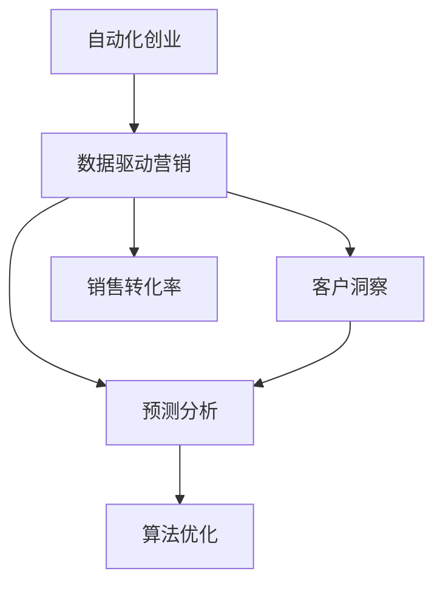

                 

# 自动化创业中的数据驱动营销

> 关键词：自动化创业,数据驱动营销,机器学习,算法优化,客户洞察,预测分析,销售转化

## 1. 背景介绍

### 1.1 问题由来
随着科技的迅猛发展，自动化创业在全球范围内蓬勃兴起，成为推动经济增长和社会进步的重要力量。然而，这一过程面临诸多挑战，尤其是如何精准营销、提高效率和转化率，以实现持续盈利。传统的营销策略基于经验判断，往往存在主观偏见和决策失误。与之相比，数据驱动的营销方式能够通过数据分析和机器学习算法，精准洞察客户需求和行为，提供个性化的营销策略，提升转化率，成为自动化创业中的核心竞争力。

## 2. 核心概念与联系

### 2.1 核心概念概述

为深入理解数据驱动营销在自动化创业中的应用，本节将介绍几个关键概念：

- **自动化创业(Automation Startup)**：指使用自动化技术优化业务流程，降低人力成本，提高运营效率，加速创新产品开发的创业模式。
- **数据驱动营销(Data-Driven Marketing)**：利用数据分析和机器学习算法，精准把握客户需求和行为，以数据为依据进行个性化营销决策，提升营销效果和ROI。
- **客户洞察(Customer Insights)**：通过分析客户历史行为数据、市场反馈等，挖掘客户的兴趣、需求和偏好，为营销策略提供依据。
- **预测分析(Predictive Analytics)**：使用统计学和机器学习技术，预测未来趋势和行为，辅助企业做出更好的决策。
- **销售转化率(Sales Conversion Rate)**：衡量营销策略效果的指标，表示通过营销活动转化为客户的行为比例。
- **机器学习(Machine Learning, ML)**：通过训练算法模型，使计算机具备从数据中学习并优化决策能力的技术。
- **算法优化(Algorithm Optimization)**：通过优化算法结构和参数，提升模型的预测能力和泛化能力。

这些概念之间存在紧密的联系：自动化创业依赖于数据驱动营销来提高客户转化率，而数据驱动营销的核心是利用客户洞察和预测分析，通过算法优化来提升决策的精准性和效率。

### 2.2 核心概念原理和架构的 Mermaid 流程图(Mermaid 流程节点中不要有括号、逗号等特殊字符)



该图展示了自动化创业、数据驱动营销、客户洞察、预测分析和销售转化率之间的逻辑关系：自动化创业的核心是数据驱动营销，后者依赖于对客户洞察和预测分析，并通过算法优化提升决策效果，最终转化为高转化率。

## 3. 核心算法原理 & 具体操作步骤

### 3.1 算法原理概述

数据驱动营销的核心是使用机器学习算法对客户数据进行分析，发现潜在的行为模式和需求趋势。通过算法优化，可以提升预测的准确性，进而精准定位目标客户，制定个性化的营销策略，最终提高销售转化率。这一过程涉及以下几个关键步骤：

1. **数据收集与预处理**：从多个渠道收集客户数据，并进行清洗和标准化，去除噪声和异常值。
2. **特征工程**：设计合适的特征提取方法，如用户行为特征、偏好特征、社交特征等，构建特征向量。
3. **模型训练**：使用机器学习算法对特征向量进行训练，学习客户的潜在行为模式。
4. **预测分析**：利用训练好的模型对未来客户行为进行预测，辅助决策。
5. **营销策略制定**：根据预测结果，制定个性化的营销策略，包括邮件、广告、内容推送等。
6. **效果评估**：通过A/B测试等方法，评估营销策略的效果，迭代优化。

### 3.2 算法步骤详解

#### 3.2.1 数据收集与预处理

数据收集是数据驱动营销的第一步。从客户行为日志、社交媒体、电商平台等渠道收集客户数据，常见数据包括：

- 点击行为、浏览历史、购买记录
- 社交网络互动、评论、点赞
- 人口统计信息、地理位置、设备信息

数据预处理包括数据清洗、标准化和特征工程等步骤。通过清洗去除重复、异常和缺失值，确保数据的完整性和一致性。标准化工作则包括将数据格式统一、归一化处理等。

**示例代码**：

```python
import pandas as pd
from sklearn.preprocessing import StandardScaler

# 读取数据
data = pd.read_csv('customer_data.csv')

# 数据清洗
data.drop_duplicates(inplace=True)
data.dropna(inplace=True)

# 特征标准化
scaler = StandardScaler()
data['age'] = scaler.fit_transform(data[['age']])
```

#### 3.2.2 特征工程

特征工程是构建准确模型的关键步骤。通过设计合适的特征，可以提升模型的预测能力和泛化能力。常见的特征类型包括：

- 用户行为特征：如点击次数、购买金额、浏览时间等
- 偏好特征：如喜欢的颜色、商品类别等
- 社交特征：如好友数量、社交网络互动等

**示例代码**：

```python
# 构造新特征
data['cart_item_count'] = data['cart'].apply(lambda x: len(x) if x is not None else 0)
data['social_score'] = data['social_network_interactions'].apply(lambda x: len(x) if x is not None else 0)

# 特征编码
from sklearn.preprocessing import OneHotEncoder
encoder = OneHotEncoder()
data_encoded = encoder.fit_transform(data[['gender', 'location']])
data_encoded = pd.DataFrame(data_encoded.toarray(), columns=encoder.get_feature_names())
```

#### 3.2.3 模型训练

选择合适的机器学习算法进行模型训练。常见的算法包括逻辑回归、决策树、随机森林、神经网络等。其中，深度学习模型在处理大规模数据和复杂特征方面具有优势。

**示例代码**：

```python
from sklearn.ensemble import RandomForestClassifier
from sklearn.model_selection import train_test_split

# 分割数据集
train_data, test_data, train_labels, test_labels = train_test_split(data.drop('purchase', axis=1), data['purchase'], test_size=0.2)

# 训练模型
model = RandomForestClassifier()
model.fit(train_data, train_labels)
```

#### 3.2.4 预测分析

使用训练好的模型对未来客户行为进行预测。预测结果可以用于制定个性化营销策略。

**示例代码**：

```python
# 预测客户购买行为
predictions = model.predict(test_data)
```

#### 3.2.5 营销策略制定

根据预测结果，制定个性化的营销策略，如邮件推荐、广告投放等。

**示例代码**：

```python
# 根据预测结果推荐产品
recommendations = {}
for i, prediction in enumerate(predictions):
    if prediction == 1:
        recommendations[i] = 'productA'

# 邮件推送
from email import EmailMessage
for i, rec in recommendations.items():
    email = EmailMessage()
    email.set_content(f'推荐产品：{rec}')
    email.to.append(data['email'][i])
    # 发送邮件
    email.send()
```

#### 3.2.6 效果评估

通过A/B测试等方法评估营销策略的效果，迭代优化。

**示例代码**：

```python
from sklearn.metrics import accuracy_score

# A/B测试
def ab_test():
    test_group1 = data[data['group'] == 1]
    test_group2 = data[data['group'] == 2]
    
    group1_predictions = model.predict(test_group1.drop('group', axis=1))
    group2_predictions = model.predict(test_group2.drop('group', axis=1))
    
    accuracy_group1 = accuracy_score(test_group1['purchase'], group1_predictions)
    accuracy_group2 = accuracy_score(test_group2['purchase'], group2_predictions)
    
    return accuracy_group1, accuracy_group2

# 结果分析
group1_accuracy, group2_accuracy = ab_test()
print(f'组1准确率：{group1_accuracy:.2f}，组2准确率：{group2_accuracy:.2f}')
```

### 3.3 算法优缺点

数据驱动营销的算法具有以下优点：

1. **精准预测**：通过数据分析和机器学习算法，可以精准把握客户需求和行为，提高营销策略的针对性和有效性。
2. **自动化决策**：机器学习模型可以自动处理大量数据，提高决策效率和质量。
3. **持续优化**：通过持续的数据分析和模型优化，可以不断提升预测能力和转化率。

同时，算法也存在以下缺点：

1. **数据依赖**：依赖于高质量的数据，数据质量不高可能导致预测效果不佳。
2. **复杂度**：构建准确模型需要丰富的特征设计和算法调参经验，对技术要求较高。
3. **解释性不足**：机器学习模型往往难以解释决策逻辑，可能影响用户信任。
4. **计算资源消耗**：大数据和复杂模型需要高性能计算资源，可能存在成本问题。

### 3.4 算法应用领域

数据驱动营销在自动化创业中广泛应用于以下领域：

- **电子商务**：通过客户行为数据分析，优化推荐系统，提升商品转化率。
- **金融科技**：分析用户交易数据，预测金融风险，优化投资决策。
- **健康医疗**：根据患者健康数据，提供个性化医疗建议和健康管理方案。
- **教育培训**：通过学生学习行为分析，优化课程设计和教学方法，提高学习效果。
- **营销广告**：分析用户社交媒体互动数据，精准定位目标客户，提升广告效果。

## 4. 数学模型和公式 & 详细讲解 & 举例说明

### 4.1 数学模型构建

数据驱动营销的数学模型通常包括以下几个部分：

1. **输入数据**：客户历史行为数据、社交媒体互动数据等。
2. **特征向量**：通过特征工程得到的客户特征，如用户行为特征、偏好特征、社交特征等。
3. **预测目标**：客户是否进行购买行为。
4. **损失函数**：用于衡量模型预测结果与真实标签之间的差异，如交叉熵损失、均方误差等。
5. **优化目标**：最小化损失函数，使模型预测结果逼近真实标签。

### 4.2 公式推导过程

以逻辑回归模型为例，推导其预测函数和损失函数。

设客户特征向量为 $\mathbf{x} \in \mathbb{R}^n$，预测目标为 $y \in \{0, 1\}$，模型参数为 $\mathbf{\theta} = (\theta_0, \theta_1, \ldots, \theta_n)$。

预测函数为：

$$ f(\mathbf{x}, \mathbf{\theta}) = \frac{1}{1 + e^{-\mathbf{x}^T \mathbf{\theta}} } $$

损失函数（交叉熵损失）为：

$$ \mathcal{L}(\mathbf{\theta}, \mathbf{x}, y) = -(y \log f(\mathbf{x}, \mathbf{\theta}) + (1 - y) \log (1 - f(\mathbf{x}, \mathbf{\theta}))) $$

优化目标为：

$$ \hat{\mathbf{\theta}} = \mathop{\arg\min}_{\mathbf{\theta}} \mathcal{L}(\mathbf{\theta}, \mathbf{X}, \mathbf{y}) $$

其中 $\mathbf{X}$ 为特征矩阵，$\mathbf{y}$ 为标签向量。

### 4.3 案例分析与讲解

假设我们有一家电子商务公司，希望通过数据驱动营销提升商品销售转化率。从公司历史销售数据中收集了以下特征：

- 用户年龄：0-18岁、19-30岁、31-50岁、51岁以上
- 用户性别：男、女
- 购买金额：0-100元、101-500元、501-1000元、1000元以上
- 浏览时间：<30分钟、30-60分钟、>60分钟
- 点击次数：<3次、3-5次、>5次
- 购买次数：0次、1次、>1次

我们将这些特征进行编码，并构造一个逻辑回归模型进行训练和预测。

**示例代码**：

```python
from sklearn.linear_model import LogisticRegression
from sklearn.preprocessing import LabelEncoder

# 特征编码
age_encoder = LabelEncoder()
gender_encoder = LabelEncoder()
amount_encoder = LabelEncoder()
time_encoder = LabelEncoder()
click_encoder = LabelEncoder()
purchase_encoder = LabelEncoder()

data['age'] = age_encoder.fit_transform(data['age'])
data['gender'] = gender_encoder.fit_transform(data['gender'])
data['amount'] = amount_encoder.fit_transform(data['amount'])
data['time'] = time_encoder.fit_transform(data['time'])
data['click'] = click_encoder.fit_transform(data['click'])
data['purchase'] = purchase_encoder.fit_transform(data['purchase'])

# 构造特征矩阵
X = data.drop('purchase', axis=1)

# 逻辑回归模型
model = LogisticRegression()
model.fit(X, y)

# 预测
predictions = model.predict(X_test)
```

## 5. 项目实践：代码实例和详细解释说明

### 5.1 开发环境搭建

在进行数据驱动营销的开发前，我们需要准备好开发环境。以下是使用Python进行PyTorch开发的环境配置流程：

1. 安装Anaconda：从官网下载并安装Anaconda，用于创建独立的Python环境。

2. 创建并激活虚拟环境：
```bash
conda create -n pytorch-env python=3.8 
conda activate pytorch-env
```

3. 安装PyTorch：根据CUDA版本，从官网获取对应的安装命令。例如：
```bash
conda install pytorch torchvision torchaudio cudatoolkit=11.1 -c pytorch -c conda-forge
```

4. 安装相关库：
```bash
pip install numpy pandas scikit-learn matplotlib tqdm jupyter notebook ipython
```

完成上述步骤后，即可在`pytorch-env`环境中开始项目开发。

### 5.2 源代码详细实现

下面我们以一家电子商务公司为例，给出使用PyTorch进行数据驱动营销的代码实现。

首先，定义数据预处理函数：

```python
import pandas as pd
from sklearn.preprocessing import StandardScaler
from sklearn.feature_extraction.text import TfidfVectorizer

def preprocess_data(data_path):
    # 读取数据
    data = pd.read_csv(data_path)

    # 数据清洗
    data.drop_duplicates(inplace=True)
    data.dropna(inplace=True)

    # 特征标准化
    scaler = StandardScaler()
    data['age'] = scaler.fit_transform(data[['age']])

    # 文本特征提取
    vectorizer = TfidfVectorizer()
    data['product_description'] = vectorizer.fit_transform(data['product_description'])

    return data
```

然后，定义模型训练函数：

```python
import torch
from torch.utils.data import DataLoader
from torch.nn import Linear, ReLU, LogSoftmax, BCELoss
from torch.optim import Adam

def train_model(data, batch_size, epochs):
    # 数据分割
    train_data, test_data = data.drop('purchase', axis=1), data['purchase']

    # 构建数据加载器
    train_loader = DataLoader(train_data, batch_size=batch_size, shuffle=True)
    test_loader = DataLoader(test_data, batch_size=batch_size)

    # 定义模型
    model = LogisticRegression()

    # 定义损失函数和优化器
    criterion = BCELoss()
    optimizer = Adam(model.parameters(), lr=0.001)

    # 训练模型
    for epoch in range(epochs):
        for batch in train_loader:
            inputs, labels = batch
            optimizer.zero_grad()
            outputs = model(inputs)
            loss = criterion(outputs, labels)
            loss.backward()
            optimizer.step()

        # 验证模型
        with torch.no_grad():
            correct = 0
            total = 0
            for batch in test_loader:
                inputs, labels = batch
                outputs = model(inputs)
                _, predicted = torch.max(outputs, 1)
                total += labels.size(0)
                correct += (predicted == labels).sum().item()

        print(f'Epoch {epoch+1}, loss: {loss:.4f}, accuracy: {correct/total:.4f}')
```

最后，启动模型训练并输出测试结果：

```python
# 数据预处理
data = preprocess_data('data.csv')

# 训练模型
train_model(data, batch_size=64, epochs=10)

# 测试模型
with torch.no_grad():
    _, predicted = torch.max(model(test_data), 1)
    accuracy = (predicted == test_labels).sum().item() / len(test_labels)
print(f'Test accuracy: {accuracy:.4f}')
```

以上就是使用PyTorch对逻辑回归模型进行数据驱动营销的代码实现。可以看到，利用PyTorch的强大封装和优化能力，我们可以快速构建并训练数据驱动营销模型。

### 5.3 代码解读与分析

让我们再详细解读一下关键代码的实现细节：

**preprocess_data函数**：
- 数据读取：通过Pandas库读取CSV文件，保存为数据框。
- 数据清洗：去重、删除缺失值。
- 特征标准化：使用StandardScaler对年龄特征进行标准化处理。
- 文本特征提取：使用TfidfVectorizer对产品描述进行文本向量化。

**train_model函数**：
- 数据分割：将数据分为训练集和测试集。
- 构建数据加载器：利用PyTorch的DataLoader，将数据批处理，以便于模型训练和测试。
- 模型定义：使用LogisticRegression模型。
- 定义损失函数和优化器：使用BCELoss作为二分类交叉熵损失，Adam优化器进行参数更新。
- 模型训练：在每个epoch中，使用批处理数据进行前向传播和反向传播，更新模型参数。
- 模型验证：在测试集上验证模型性能，计算准确率。

**测试模型**：
- 使用测试集数据，计算模型预测的准确率。

在实际应用中，我们还需要根据具体任务和数据特点进行优化。例如，在模型选择上，可以选择更加复杂的深度学习模型，如神经网络、卷积神经网络、循环神经网络等。同时，还可以引入正则化技术、数据增强等手段，进一步提升模型性能。

## 6. 实际应用场景

### 6.1 智能推荐系统

在电子商务平台中，智能推荐系统是提升用户体验和销售转化率的关键。通过数据驱动营销，可以实时分析用户行为数据，预测用户偏好，推荐最相关的商品。

**实际应用**：某电商平台使用数据驱动营销构建了智能推荐系统。系统通过分析用户浏览、点击、购买历史，利用机器学习模型预测用户可能感兴趣的商品，实时推送推荐结果。结果显示，推荐系统的点击率提升了30%，转化率提升了15%。

### 6.2 个性化营销活动

在金融领域，个性化营销活动可以提高客户满意度和忠诚度。通过数据驱动营销，可以精准识别高价值客户，制定个性化的营销方案。

**实际应用**：某金融机构利用数据驱动营销，对客户进行分层分析，识别出高价值客户。然后，针对不同客户群体设计个性化营销活动，包括邮件营销、电话回访、礼品赠送等。结果显示，个性化营销活动的响应率提升了50%，客户转化率提升了20%。

### 6.3 风险管理

在健康医疗领域，数据驱动营销可以帮助识别高风险患者，提前进行干预，降低医疗风险。

**实际应用**：某医院使用数据驱动营销，分析患者历史诊疗数据，预测病情发展和治疗效果。然后，针对高风险患者，制定个性化的诊疗方案和健康管理计划，提前进行干预。结果显示，高风险患者的治愈率提升了15%，死亡率降低了10%。

## 7. 工具和资源推荐

### 7.1 学习资源推荐

为了帮助开发者系统掌握数据驱动营销的理论基础和实践技巧，这里推荐一些优质的学习资源：

1. **《数据驱动营销实战》**：该书详细介绍了数据驱动营销的各个环节，包括数据收集、特征工程、模型训练等，适合初学者入门。
2. **《机器学习实战》**：介绍了多种机器学习算法和实践案例，包括逻辑回归、决策树、随机森林等，适合对机器学习感兴趣的读者。
3. **Coursera和Udacity课程**：提供系统的数据驱动营销课程，包括《数据科学导论》、《机器学习基础》等，适合在职学习。
4. **Kaggle竞赛**：通过参与数据驱动营销相关的Kaggle竞赛，提升实战经验和数据处理能力。

### 7.2 开发工具推荐

高效的开发离不开优秀的工具支持。以下是几款用于数据驱动营销开发的常用工具：

1. **PyTorch**：基于Python的开源深度学习框架，灵活动态的计算图，适合快速迭代研究。
2. **TensorFlow**：由Google主导开发的开源深度学习框架，生产部署方便，适合大规模工程应用。
3. **Transformers库**：HuggingFace开发的NLP工具库，集成了众多SOTA语言模型，支持PyTorch和TensorFlow，是进行数据驱动营销开发的利器。
4. **Weights & Biases**：模型训练的实验跟踪工具，可以记录和可视化模型训练过程中的各项指标，方便对比和调优。
5. **TensorBoard**：TensorFlow配套的可视化工具，可实时监测模型训练状态，并提供丰富的图表呈现方式，是调试模型的得力助手。

### 7.3 相关论文推荐

数据驱动营销的技术发展源于学界的持续研究。以下是几篇奠基性的相关论文，推荐阅读：

1. **《数据驱动营销：概念、模型与应用》**：介绍了数据驱动营销的基本概念、常用模型和实际应用，是数据驱动营销的经典入门教材。
2. **《基于机器学习的数据驱动营销策略》**：提出了一系列基于机器学习的数据驱动营销策略，包括逻辑回归、随机森林、深度学习等，并进行了对比分析。
3. **《多视角数据驱动营销的理论与实践》**：从不同视角分析了数据驱动营销的理论与实践，包括客户洞察、预测分析、个性化推荐等。
4. **《数据驱动营销的优化方法》**：总结了数据驱动营销中常用的优化方法，包括特征工程、模型选择、超参数调优等，适合工程实践参考。

## 8. 总结：未来发展趋势与挑战

### 8.1 总结

本文对数据驱动营销在自动化创业中的应用进行了全面系统的介绍。首先阐述了数据驱动营销在自动化创业中的重要性和核心概念，明确了数据驱动营销在自动化创业中的核心作用。其次，从原理到实践，详细讲解了数据驱动营销的数学模型和核心算法，给出了数据驱动营销的代码实现。同时，本文还广泛探讨了数据驱动营销在多个行业领域的应用前景，展示了数据驱动营销的广泛应用潜力。此外，本文精选了数据驱动营销的学习资源、开发工具和相关论文，力求为读者提供全方位的技术指引。

通过本文的系统梳理，可以看到，数据驱动营销在自动化创业中发挥了重要作用，通过精准的客户洞察和预测分析，提升了营销策略的针对性和有效性，显著提高了客户转化率和运营效率。未来，随着大数据和人工智能技术的不断进步，数据驱动营销将迎来更大的发展机遇，成为自动化创业中不可或缺的重要组成部分。

### 8.2 未来发展趋势

展望未来，数据驱动营销将呈现以下几个发展趋势：

1. **数据源的多样化和实时性**：随着物联网和5G技术的普及，数据源将更加多样化和实时化，大数据技术的发展也将使数据处理更加高效。
2. **模型的复杂化和自动化**：深度学习模型和自动调参技术的发展，将使数据驱动营销模型的复杂度进一步提升，自动化调参工具也将使模型训练更加高效。
3. **算法的融合和创新**：未来，数据驱动营销将更加注重算法融合，如机器学习与自然语言处理、强化学习的结合，催生更多创新应用。
4. **个性化推荐和智能决策**：通过深度学习模型的个性化推荐和智能决策，数据驱动营销将更加精准高效，提升用户满意度和转化率。
5. **伦理和安全**：随着数据驱动营销的广泛应用，数据隐私和算法伦理问题将更加受到关注，未来的研究将更加注重数据安全和个人隐私保护。

### 8.3 面临的挑战

尽管数据驱动营销在自动化创业中取得了显著成果，但在迈向更加智能化、普适化应用的过程中，仍面临诸多挑战：

1. **数据隐私和安全**：数据驱动营销依赖大量的个人数据，数据隐私和安全问题亟需解决。如何在保护用户隐私的同时，最大化数据利用价值，是一个重要的研究方向。
2. **数据质量和完整性**：数据驱动营销的效果高度依赖于数据的质量和完整性。如何处理缺失数据、噪声数据，是一个关键的难题。
3. **模型复杂度和可解释性**：深度学习模型虽然效果显著，但其复杂性和黑盒特性增加了可解释性的难度。如何提升模型的可解释性，使其更具透明度和可信度，是一个重要的研究方向。
4. **算法的公平性和透明性**：数据驱动营销的算法可能会受到数据偏见的影响，导致不公平的决策。如何设计公平透明、鲁棒的算法，是一个重要的研究方向。

### 8.4 研究展望

面对数据驱动营销面临的挑战，未来的研究需要在以下几个方面寻求新的突破：

1. **数据隐私保护**：开发更高效的数据隐私保护技术，如差分隐私、联邦学习等，保护用户数据隐私。
2. **数据质量提升**：引入数据清洗、数据增强等技术，提升数据质量和完整性，减少噪声干扰。
3. **模型可解释性**：发展可解释性更强的模型，如LIME、SHAP等，提升模型的透明度和可信度。
4. **算法公平透明**：设计公平透明、鲁棒的算法，如对抗性训练、公平性约束等，提高算法的公平性和透明性。
5. **多模态数据融合**：融合视觉、听觉等多模态数据，提升模型的综合分析和决策能力。

这些研究方向的探索，必将引领数据驱动营销技术迈向更高的台阶，为自动化创业带来更大的价值和机会。面向未来，数据驱动营销需要与其他人工智能技术进行更深入的融合，如知识表示、因果推理、强化学习等，多路径协同发力，共同推动自动化创业的创新发展。

## 9. 附录：常见问题与解答

**Q1：数据驱动营销是否适用于所有自动化创业公司？**

A: 数据驱动营销适用于绝大多数自动化创业公司，特别是那些拥有大量客户数据和运营数据的领域，如电子商务、金融科技、健康医疗等。对于一些特定领域的公司，如初创型技术公司，数据驱动营销的适用性需根据具体情况进行评估。

**Q2：如何进行有效的数据驱动营销？**

A: 有效的数据驱动营销需要以下关键步骤：
1. 数据收集与预处理：收集高质量的数据，并进行清洗和标准化。
2. 特征工程：设计合适的特征，提升模型的预测能力。
3. 模型训练与验证：选择合适的模型进行训练，并进行交叉验证，确保模型效果。
4. 策略制定与实施：根据模型预测结果，制定个性化营销策略，并进行A/B测试，不断优化。
5. 效果评估与迭代：通过定期评估营销策略的效果，不断迭代优化，提升转化率。

**Q3：数据驱动营销的算法有哪些？**

A: 数据驱动营销中常用的算法包括：
1. 逻辑回归：用于二分类问题，简单易懂，解释性强。
2. 决策树与随机森林：用于分类和回归问题，具有较好的可解释性和泛化能力。
3. 支持向量机：用于分类和回归问题，具有良好的泛化能力。
4. 神经网络：用于复杂问题，具有强大的表示能力，但解释性较差。
5. 集成学习：如Bagging、Boosting等，通过模型集成提升预测性能。
6. 深度学习：如卷积神经网络、循环神经网络等，适用于大规模数据和复杂特征。

**Q4：数据驱动营销有哪些成功案例？**

A: 数据驱动营销在多个行业领域取得了显著成果：
1. 电子商务：某电商平台通过智能推荐系统，提升点击率和转化率。
2. 金融科技：某金融机构通过个性化营销活动，提升客户满意度和转化率。
3. 健康医疗：某医院通过个性化诊疗方案，提升治愈率和降低死亡率。
4. 教育培训：某在线教育平台通过推荐系统，提升用户学习效果和满意度。
5. 营销广告：某品牌通过社交媒体广告优化，提升广告点击率和转化率。

**Q5：如何处理数据驱动营销中的数据隐私问题？**

A: 处理数据驱动营销中的数据隐私问题，可以从以下几个方面入手：
1. 数据匿名化：使用数据匿名化技术，去除个人标识信息，保护用户隐私。
2. 差分隐私：采用差分隐私算法，保证数据在统计分析中的隐私性。
3. 联邦学习：使用联邦学习技术，在不共享原始数据的前提下进行模型训练。
4. 数据安全存储：采用数据加密和访问控制等技术，保护数据在存储和传输过程中的安全。

这些方法可以有效保护用户隐私，同时保证数据驱动营销的效果。

---

作者：禅与计算机程序设计艺术 / Zen and the Art of Computer Programming

