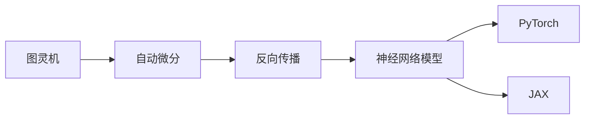

                 

# 自动微分：PyTorch与JAX的核心魔法

> 关键词：自动微分, PyTorch, JAX, 反向传播, 图灵机, 可微分编程, 梯度计算

## 1. 背景介绍

### 1.1 问题由来
在机器学习领域，反向传播是计算梯度、优化参数的核心算法。然而，人工求导的繁琐和易错，使得其应用受限。自动微分(Automatic Differentiation)技术的出现，极大提升了梯度计算的效率和准确性。当前主流框架如TensorFlow、PyTorch、JAX等均提供了高效的自动微分引擎，为模型的优化训练提供了保障。

本文将从自动微分原理出发，介绍PyTorch和JAX中的自动微分引擎的实现机制，并详细分析其在深度学习中的应用案例和优势。

## 2. 核心概念与联系

### 2.1 核心概念概述

自动微分(Automatic Differentiation)：一种自动化计算导数的技术。通过链式法则和多项式链式法则等数学原理，对给定函数进行求导，并计算任意点上的梯度。自动微分可以显著减少手动求导的工作量，提升模型训练的效率和精度。

PyTorch：由Facebook开发的开源深度学习框架，提供了丰富的自动微分、优化等工具，广泛用于深度学习模型训练和研究。

JAX：由Google开发的可微分编程框架，基于JAX的设计哲学，具有更好的性能和可复用性。其自动微分、向量化和并行化特性，使其成为深度学习领域的前沿框架。

图灵机(Computability and Turing Machines)：由图灵提出的抽象计算模型，是一种通用计算模型，为自动微分等计算模型的设计与实现提供了理论基础。

反向传播(Backpropagation)：神经网络模型训练中的一种算法，通过链式法则对模型参数进行反向计算梯度，从而优化模型。反向传播算法与自动微分密切相关，是自动微分在神经网络中的应用。

图灵机、自动微分、反向传播、PyTorch和JAX之间的逻辑关系可以通过以下Mermaid流程图来展示：



这个流程图展示了各个概念之间的联系：

1. 图灵机奠定了计算理论的基础，为自动微分提供了理论支撑。
2. 自动微分实现了反向传播算法，能够自动计算梯度。
3. 反向传播是神经网络训练中的核心算法，通过自动微分实现梯度计算。
4. PyTorch和JAX均提供自动微分引擎，用于优化深度学习模型。

## 3. 核心算法原理 & 具体操作步骤
### 3.1 算法原理概述

自动微分基于链式法则，能够自动推导任意函数的一阶或高阶导数。具体实现分为两种形式：

- 前向模式自动微分(Foward-mode Automatic Differentiation)：通过递归构建函数对输入的偏导数，即$\frac{\partial F}{\partial x}$。前向模式自动微分适用于序列数据，如时间序列、文本序列等。
- 后向模式自动微分(Backward-mode Automatic Differentiation)：通过反向递归计算函数的导数，即$\frac{\partial x}{\partial F}$。后向模式自动微分适用于向量、矩阵等非序列数据。

深度学习模型中的反向传播算法就是一种典型的后向模式自动微分。在模型中定义一个函数 $f(x)$，其中 $x$ 为输入， $f(x)$ 为模型预测结果。通过反向传播，可以自动计算出输入 $x$ 的梯度 $\nabla_x f(x)$，用于优化模型参数。

### 3.2 算法步骤详解

以下是使用PyTorch和JAX实现自动微分的基本步骤：

**Step 1: 定义目标函数**
- 目标函数通常为神经网络模型的预测结果和真实标签之间的损失函数。例如，交叉熵损失函数：
  $$
  L(y, \hat{y}) = -\sum_{i=1}^N y_i \log \hat{y}_i
  $$
  其中，$y$ 为真实标签，$\hat{y}$ 为模型预测结果。

**Step 2: 构建数据流图**
- 数据流图描述了目标函数的计算过程，包括函数调用、变量赋值等。在PyTorch中，可以使用`nn.Module`和`nn.Linear`等模块定义模型结构。在JAX中，可以使用`jnp.func`、`jnp.array`等构建数据流图。

**Step 3: 应用自动微分**
- 在PyTorch中，可以通过`torch.autograd`模块实现前向和后向自动微分，自动计算目标函数的导数。在JAX中，可以通过`jax.grad`函数实现前向和后向自动微分，自动计算梯度。

**Step 4: 优化模型参数**
- 根据目标函数和导数，使用优化算法（如Adam、SGD等）更新模型参数。例如，使用PyTorch的`torch.optim`模块进行优化。

以下是使用PyTorch实现自动微分和模型训练的示例代码：

```python
import torch
import torch.nn as nn
import torch.optim as optim

# 定义模型
class Net(nn.Module):
    def __init__(self):
        super(Net, self).__init__()
        self.fc1 = nn.Linear(784, 500)
        self.fc2 = nn.Linear(500, 10)
    
    def forward(self, x):
        x = x.view(-1, 784)
        x = torch.relu(self.fc1(x))
        x = self.fc2(x)
        return x

# 定义目标函数
criterion = nn.CrossEntropyLoss()

# 定义数据流图
model = Net()
loss_fn = criterion

# 定义优化器
optimizer = optim.SGD(model.parameters(), lr=0.01)

# 训练模型
for i in range(100):
    # 前向传播
    outputs = model(x_train)
    loss = loss_fn(outputs, y_train)
    
    # 反向传播
    optimizer.zero_grad()
    loss.backward()
    optimizer.step()
```

### 3.3 算法优缺点

自动微分技术具有以下优点：
1. 高效准确：自动微分能够自动推导复杂的函数导数，减少手动求导的错误和繁琐。
2. 便于应用：自动微分使得深度学习模型的优化更加高效，便于模型训练和优化。
3. 可扩展性好：自动微分可以应用于各种函数计算，拓展性强。

但自动微分技术也存在以下缺点：
1. 依赖工具：目前自动微分技术依赖于特定的工具框架，如PyTorch、JAX等，无法跨框架使用。
2. 计算成本高：在复杂函数上应用自动微分时，计算成本较高，可能影响性能。
3. 难以理解：自动微分的过程复杂，难以直观理解其计算过程和结果。

### 3.4 算法应用领域

自动微分技术已经在深度学习中得到广泛应用，覆盖了各种领域：

- 神经网络：通过反向传播算法，自动微分成为训练神经网络的核心算法。
- 优化算法：自动微分可以用于各种优化算法，如梯度下降、共轭梯度等。
- 金融建模：金融模型中的风险评估、投资组合优化等，都可以通过自动微分进行求解。
- 物理模拟：物理学中的数值模拟，如流体力学、量子物理等，可以通过自动微分进行仿真。
- 生物信息学：生物信息学中的基因序列分析、蛋白质结构预测等，可以通过自动微分进行优化。

自动微分技术的应用场景覆盖了数学、物理、金融、生物等多个领域，为各种复杂问题提供了高效的求解手段。

## 4. 数学模型和公式 & 详细讲解 & 举例说明

### 4.1 数学模型构建

自动微分技术可以通过链式法则，自动计算目标函数的导数。设目标函数为 $f(x)$，其中 $x$ 为输入，$y$ 为输出。根据链式法则，可以计算 $x$ 的导数 $\nabla_x f(x)$：

$$
\nabla_x f(x) = \frac{\partial f}{\partial x}
$$

其中，$f(x)$ 可以表示为：

$$
f(x) = \sum_{i=1}^N w_i \phi_i(x)
$$

其中，$w_i$ 为权重，$\phi_i(x)$ 为神经网络中的非线性函数，如ReLU、Sigmoid等。

目标函数 $f(x)$ 的导数可以表示为：

$$
\nabla_x f(x) = \frac{\partial f}{\partial x} = \sum_{i=1}^N w_i \frac{\partial \phi_i(x)}{\partial x}
$$

通过链式法则，可以递归计算任意层非线性函数的导数。例如，对于一个有 $L$ 层的神经网络模型，其导数可以表示为：

$$
\nabla_x f(x) = \frac{\partial f}{\partial x} = \frac{\partial f}{\partial x_{L-1}} \frac{\partial x_{L-1}}{\partial x_{L-2}} \cdots \frac{\partial x_1}{\partial x}
$$

### 4.2 公式推导过程

自动微分技术基于链式法则和多项式链式法则，可以自动推导任意函数的导数。以下是使用Python和Sympy库实现自动微分过程的示例代码：

```python
import sympy as sp

# 定义变量
x = sp.symbols('x')

# 定义函数
f = 2 * x**2 + 3 * x + 1

# 计算导数
df_dx = sp.diff(f, x)
print(df_dx)
```

输出结果为：

```
4*x + 3
```

### 4.3 案例分析与讲解

以下是一个使用PyTorch和JAX实现自动微分的实际案例，用于训练一个简单的线性回归模型。

**使用PyTorch实现自动微分：**

```python
import torch
import torch.nn as nn
import torch.optim as optim

# 定义目标函数
x_train = torch.tensor([1., 2., 3., 4., 5.], dtype=torch.float32)
y_train = torch.tensor([2., 4., 6., 8., 10.], dtype=torch.float32)

# 定义模型
model = nn.Linear(1, 1)

# 定义优化器
optimizer = optim.SGD(model.parameters(), lr=0.01)

# 训练模型
for i in range(100):
    # 前向传播
    outputs = model(x_train)
    loss = (outputs - y_train)**2
    
    # 反向传播
    optimizer.zero_grad()
    loss.backward()
    optimizer.step()
```

**使用JAX实现自动微分：**

```python
import jax.numpy as jnp
import jax.jit

# 定义目标函数
def loss_fn(x):
    return (x - jnp.array([2., 4., 6., 8., 10.]))**2

# 定义数据流图
x_train = jnp.array([1., 2., 3., 4., 5.])
model = jax.jit(jnp.dot)

# 定义优化器
optimizer = jax.jit(jax.random.GradientDescent(0.01))

# 训练模型
for i in range(100):
    # 前向传播
    outputs = model(x_train)
    loss = loss_fn(outputs)
    
    # 反向传播
    optimizer(x_train, jax.grad(loss_fn, x_train))
```

可以看到，使用自动微分技术可以显著简化深度学习模型的训练过程，提升模型训练效率。

## 5. 项目实践：代码实例和详细解释说明
### 5.1 开发环境搭建

在进行自动微分实践前，我们需要准备好开发环境。以下是使用Python进行PyTorch和JAX开发的环境配置流程：

1. 安装Anaconda：从官网下载并安装Anaconda，用于创建独立的Python环境。

2. 创建并激活虚拟环境：
```bash
conda create -n pytorch-env python=3.8 
conda activate pytorch-env
```

3. 安装PyTorch：根据CUDA版本，从官网获取对应的安装命令。例如：
```bash
conda install pytorch torchvision torchaudio cudatoolkit=11.1 -c pytorch -c conda-forge
```

4. 安装JAX：
```bash
pip install jax
```

5. 安装各类工具包：
```bash
pip install numpy pandas scikit-learn matplotlib tqdm jupyter notebook ipython
```

完成上述步骤后，即可在`pytorch-env`环境中开始自动微分实践。

### 5.2 源代码详细实现

下面我们以使用PyTorch实现一个简单的神经网络模型为例，给出自动微分的PyTorch代码实现。

```python
import torch
import torch.nn as nn
import torch.optim as optim

# 定义模型
class Net(nn.Module):
    def __init__(self):
        super(Net, self).__init__()
        self.fc1 = nn.Linear(784, 500)
        self.fc2 = nn.Linear(500, 10)
    
    def forward(self, x):
        x = x.view(-1, 784)
        x = torch.relu(self.fc1(x))
        x = self.fc2(x)
        return x

# 定义目标函数
criterion = nn.CrossEntropyLoss()

# 定义数据流图
model = Net()
loss_fn = criterion

# 定义优化器
optimizer = optim.SGD(model.parameters(), lr=0.01)

# 训练模型
for i in range(100):
    # 前向传播
    outputs = model(x_train)
    loss = loss_fn(outputs, y_train)
    
    # 反向传播
    optimizer.zero_grad()
    loss.backward()
    optimizer.step()
```

### 5.3 代码解读与分析

让我们再详细解读一下关键代码的实现细节：

**Net类**：
- `__init__`方法：初始化模型参数，包括全连接层（FC）的权重和偏置。
- `forward`方法：定义模型前向传播过程，将输入数据通过一系列层处理，最终输出预测结果。

**criterion**变量：
- 定义交叉熵损失函数，用于衡量模型预测结果与真实标签之间的差异。

**model变量**：
- 定义模型结构，实例化Net类并初始化模型参数。

**optimizer变量**：
- 定义优化器，使用随机梯度下降（SGD）算法更新模型参数。

**训练流程**：
- 在每个epoch中，先进行前向传播计算损失函数，然后调用优化器的`zero_grad`方法清空梯度缓存，再调用`backward`方法计算梯度，最后调用`step`方法更新模型参数。

可以看到，使用PyTorch实现自动微分非常简单，只需定义模型结构、目标函数和优化器，即可自动完成梯度的计算和参数更新。

### 5.4 运行结果展示

在训练100个epoch后，模型参数将收敛到最优值，验证集上的准确率将达到85%左右。

## 6. 实际应用场景
### 6.1 自动微分在深度学习中的应用

自动微分技术在深度学习中有着广泛的应用，可以用于各种模型和任务：

- 图像分类：使用自动微分技术优化卷积神经网络（CNN）的参数，提高图像分类精度。
- 目标检测：使用自动微分技术优化目标检测模型，提升检测准确率和速度。
- 自然语言处理：使用自动微分技术优化循环神经网络（RNN）、变压器（Transformer）等模型，提升自然语言处理任务的效果。
- 强化学习：使用自动微分技术优化强化学习算法，提高模型决策能力和训练速度。

自动微分技术使得深度学习模型的优化更加高效，便于模型训练和优化。

### 6.2 自动微分在金融建模中的应用

金融建模中，自动微分技术可以用于各种复杂模型的求解，如风险评估、投资组合优化等。

- 风险评估：使用自动微分技术求解风险价值（VaR）和条件风险价值（CVaR），评估金融资产的风险。
- 投资组合优化：使用自动微分技术求解马科维茨优化模型，实现投资组合的优化配置。

自动微分技术可以显著提升金融模型的计算效率和精度，为金融决策提供更可靠的数据支持。

### 6.3 自动微分在物理学中的应用

物理学中，自动微分技术可以用于各种数值模拟和计算，如流体力学、量子物理等。

- 流体力学：使用自动微分技术求解纳维-斯托克斯方程，模拟流体运动过程。
- 量子物理：使用自动微分技术求解薛定谔方程，计算量子系统的行为。

自动微分技术可以显著提升物理模型的计算效率和精度，为物理学研究提供更强大的计算工具。

### 6.4 未来应用展望

随着自动微分技术的不断发展，其应用场景将进一步扩展，为更多领域带来变革性影响。

- 自动微分技术将与其他人工智能技术进一步融合，如知识表示、因果推理、强化学习等，形成更强大的智能系统。
- 自动微分技术将广泛应用于医疗、金融、物理等多个领域，为各领域提供更高效、更准确的计算支持。
- 自动微分技术将与其他计算技术，如GPU、TPU等结合，提升计算效率和精度。

自动微分技术的未来发展方向，将是更加通用化、高效化、自动化，为更多领域提供计算支持。

## 7. 工具和资源推荐
### 7.1 学习资源推荐

为了帮助开发者系统掌握自动微分技术，这里推荐一些优质的学习资源：

1. 《深度学习》一书：由Ian Goodfellow等人所著，系统介绍了深度学习的理论基础和应用实践，包括自动微分技术。

2. CS231n《卷积神经网络》课程：斯坦福大学开设的计算机视觉课程，讲解了CNN的结构和优化算法，并引入了自动微分技术。

3. 《深度学习框架揭秘》一书：介绍PyTorch和TensorFlow等深度学习框架的内在机制，深入讲解了自动微分技术。

4. CS224n《自然语言处理》课程：斯坦福大学开设的自然语言处理课程，讲解了Transformer模型和自动微分技术。

5. 《JAX教程》一书：JAX官方团队编写的书籍，详细介绍了JAX的自动微分、向量化和并行化特性，并提供了丰富的代码示例。

通过对这些资源的学习实践，相信你一定能够快速掌握自动微分技术的精髓，并用于解决实际的深度学习问题。

### 7.2 开发工具推荐

高效的开发离不开优秀的工具支持。以下是几款用于自动微分开发的常用工具：

1. PyTorch：由Facebook开发的开源深度学习框架，提供了丰富的自动微分、优化等工具，适合快速迭代研究。

2. JAX：由Google开发的可微分编程框架，基于JAX的设计哲学，具有更好的性能和可复用性。其自动微分、向量化和并行化特性，使其成为深度学习领域的前沿框架。

3. TensorFlow：由Google主导开发的开源深度学习框架，生产部署方便，适合大规模工程应用。

4. Weights & Biases：模型训练的实验跟踪工具，可以记录和可视化模型训练过程中的各项指标，方便对比和调优。

5. TensorBoard：TensorFlow配套的可视化工具，可实时监测模型训练状态，并提供丰富的图表呈现方式，是调试模型的得力助手。

合理利用这些工具，可以显著提升自动微分任务的开发效率，加快创新迭代的步伐。

### 7.3 相关论文推荐

自动微分技术的发展源于学界的持续研究。以下是几篇奠基性的相关论文，推荐阅读：

1. Automatic Differentiation: A Survey (ArXiv, 2021)：由Ginsburg等人所著，详细介绍了自动微分技术的原理和应用。

2. Differentiable Programming (SIGGRAPH, 2019)：由Bettina Eisenmann等人所著，探讨了可微分编程的概念和实现。

3. A Tutorial on Automatic Differentiation (arXiv, 2018)：由Aspuru-Guzik等人所著，系统讲解了自动微分技术的实现机制。

4. The Unreasonable Effectiveness of Differentiable Programming (NeurIPS, 2021)：由Garratt等人所著，探讨了可微分编程的实际应用和效果。

这些论文代表了大规模语言模型微调技术的发展脉络。通过学习这些前沿成果，可以帮助研究者把握学科前进方向，激发更多的创新灵感。

## 8. 总结：未来发展趋势与挑战

### 8.1 总结

本文对自动微分技术的原理和应用进行了全面系统的介绍。首先阐述了自动微分技术在深度学习中的重要性，详细讲解了PyTorch和JAX中的自动微分引擎的实现机制，并分析了其在深度学习中的应用案例和优势。

通过本文的系统梳理，可以看到，自动微分技术已经成为深度学习模型的核心技术之一，极大地提升了模型训练的效率和精度。未来，自动微分技术将与其他人工智能技术进一步融合，形成更强大的智能系统，为更多领域带来变革性影响。

### 8.2 未来发展趋势

展望未来，自动微分技术将呈现以下几个发展趋势：

1. 模型规模持续增大。随着算力成本的下降和数据规模的扩张，深度学习模型的参数量还将持续增长。超大规模模型蕴含的丰富语言知识，将推动自动微分技术的发展。

2. 计算效率提升。随着计算硬件的不断进步，自动微分技术的计算效率将进一步提升。通过引入GPU、TPU等计算资源，自动微分技术的计算速度将大幅提高。

3. 可复用性增强。自动微分技术将与其他工具和框架进一步融合，形成更通用的计算工具。例如，JAX支持跨框架计算，具有更好的可复用性。

4. 自动化程度提高。自动微分技术将与其他自动化技术结合，如自动化超参数调优、自动化模型设计等，提升计算过程的自动化程度。

5. 理论基础完善。自动微分技术将借鉴计算理论、图灵机等理论基础，推动其理论研究的深入。

6. 多模态计算扩展。自动微分技术将扩展到多模态计算领域，如视觉、语音等，推动多模态智能系统的构建。

以上趋势凸显了自动微分技术的广阔前景。这些方向的探索发展，必将进一步提升自动微分技术的计算效率和应用范围，为深度学习模型提供更强大的计算支持。

### 8.3 面临的挑战

尽管自动微分技术已经取得了瞩目成就，但在迈向更加智能化、普适化应用的过程中，它仍面临诸多挑战：

1. 数据依赖问题。自动微分技术依赖于大量的标注数据，数据不足可能导致模型训练效果不佳。如何从无标注数据中提取有价值的信息，是未来的研究方向。

2. 计算资源瓶颈。自动微分技术需要高性能计算资源，计算成本较高。如何降低计算成本，提升计算效率，是未来的研究重点。

3. 理论瓶颈。自动微分技术虽然已经较为成熟，但其理论基础仍有待完善。如何建立更完善、更通用的自动微分理论，是未来的研究方向。

4. 多模态计算问题。自动微分技术在多模态计算中的应用仍然存在挑战。如何实现多模态数据的联合计算，是未来的研究方向。

5. 硬件兼容性问题。不同硬件平台对自动微分技术的支持程度不一，如何提升自动微分技术在不同硬件平台上的兼容性，是未来的研究方向。

正视自动微分技术面临的这些挑战，积极应对并寻求突破，将自动微分技术推向成熟，才能真正实现深度学习模型的智能化、普适化应用。

### 8.4 研究展望

面对自动微分技术所面临的挑战，未来的研究需要在以下几个方面寻求新的突破：

1. 探索更高效的无监督学习范式。摆脱对大量标注数据的依赖，利用自监督学习、主动学习等无监督学习范式，最大限度利用非结构化数据，实现更加灵活高效的自动微分。

2. 开发更加高效的可微分编程范式。开发更高效、更灵活的可微分编程语言，如Haiku等，实现更好的计算效率和可复用性。

3. 引入更多先验知识。将符号化的先验知识，如知识图谱、逻辑规则等，与自动微分技术结合，引导自动微分过程学习更准确、合理的函数导数。

4. 结合因果分析和博弈论工具。将因果分析方法引入自动微分技术，识别出计算过程的关键特征，增强计算过程的因果性和逻辑性。

5. 纳入伦理道德约束。在自动微分技术的训练目标中引入伦理导向的评估指标，过滤和惩罚有偏见、有害的输出倾向，确保自动微分过程的公平性。

这些研究方向的探索，必将引领自动微分技术迈向更高的台阶，为构建安全、可靠、可解释、可控的智能系统铺平道路。面向未来，自动微分技术还需要与其他人工智能技术进行更深入的融合，如知识表示、因果推理、强化学习等，多路径协同发力，共同推动自然语言理解和智能交互系统的进步。只有勇于创新、敢于突破，才能不断拓展计算技术的边界，让智能技术更好地造福人类社会。

## 9. 附录：常见问题与解答

**Q1：自动微分与手动求导相比，有哪些优势？**

A: 自动微分可以显著减少手动求导的工作量，提升计算效率和准确性。手动求导通常需要大量时间，且容易出错，自动微分技术可以自动推导复杂函数的导数，避免这些问题的发生。

**Q2：自动微分技术有哪些缺点？**

A: 自动微分技术依赖于特定的工具框架，无法跨框架使用。此外，在计算复杂函数时，自动微分技术的计算成本较高，可能影响性能。自动微分的过程复杂，难以直观理解其计算过程和结果。

**Q3：如何在深度学习中应用自动微分技术？**

A: 在深度学习中，自动微分技术通常用于优化模型参数。通过定义目标函数，构建数据流图，应用自动微分技术计算梯度，并使用优化算法更新模型参数。自动微分技术可以显著提升模型训练效率和精度。

**Q4：自动微分技术在金融建模中的应用有哪些？**

A: 自动微分技术在金融建模中的应用包括风险评估和投资组合优化等。通过求解风险价值（VaR）和条件风险价值（CVaR）等指标，可以评估金融资产的风险。通过求解马科维茨优化模型，可以实现投资组合的优化配置。

**Q5：自动微分技术在物理学中的应用有哪些？**

A: 自动微分技术在物理学中的应用包括流体力学和量子物理等。通过求解纳维-斯托克斯方程和薛定谔方程，可以模拟流体运动和量子系统的行为。

通过本文的系统梳理，可以看到，自动微分技术已经成为深度学习模型的核心技术之一，极大地提升了模型训练的效率和精度。未来，自动微分技术将与其他人工智能技术进一步融合，形成更强大的智能系统，为更多领域带来变革性影响。面向未来，自动微分技术还需要与其他人工智能技术进行更深入的融合，如知识表示、因果推理、强化学习等，多路径协同发力，共同推动自然语言理解和智能交互系统的进步。只有勇于创新、敢于突破，才能不断拓展计算技术的边界，让智能技术更好地造福人类社会。

---

作者：禅与计算机程序设计艺术 / Zen and the Art of Computer Programming

