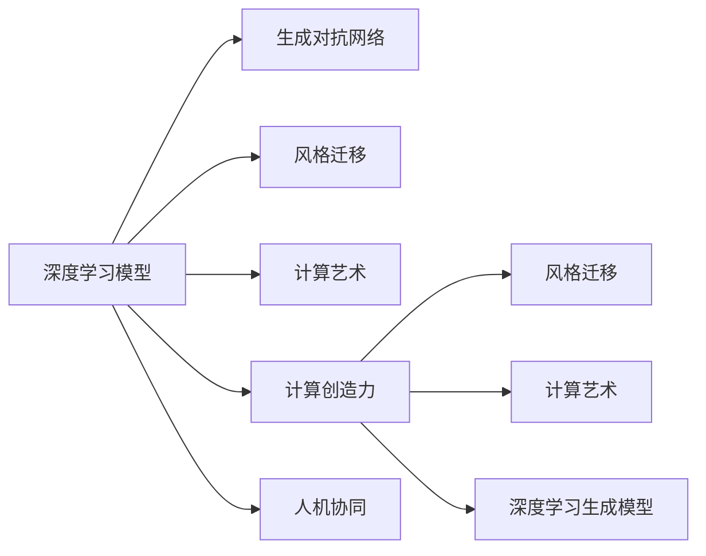
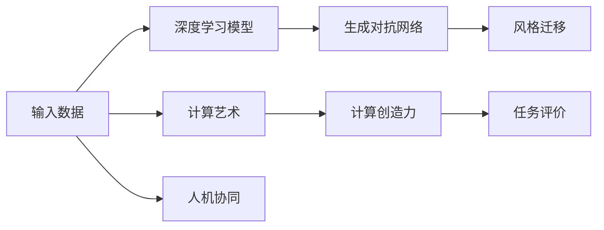
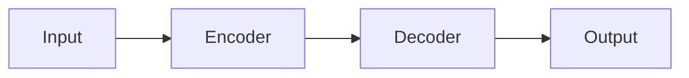

                 

# 艺术与科技的碰撞：人类计算激发创意火花

> 关键词：人工智能,计算创造力,科技创新,艺术创作,人机协同,跨学科研究

## 1. 背景介绍

### 1.1 问题由来

人类历史长河中，科学与艺术的融合一直是推动社会进步的重要力量。数学家如牛顿、爱因斯坦在揭示自然规律的同时，也启发了诸多艺术作品和理论；艺术家如达芬奇、米开朗基罗对自然的深入观察，催生了科学的诸多突破。但传统上，科学与艺术似乎是两条并行不悖的道路，尽管两者都源自人类对世界的深刻理解与探索。

然而，随着科技的迅猛发展，尤其是人工智能技术的兴起，这一传统正被彻底打破。人工智能不仅仅在逻辑推理和数据处理上超越人类，还在创造力、想象力、情感表达等方面展现出强大的潜力。特别是基于深度学习模型的计算创造力（Computational Creativity），正在成为连接科学与艺术的新桥梁，为创作过程注入新的动能，激发艺术领域的一次次变革。

### 1.2 问题核心关键点

计算创造力的核心关键点包括以下几点：
1. **算法模型**：如何通过深度学习模型生成创造性内容？
2. **数据输入**：什么样的数据最能激发模型的创造力？
3. **输出评价**：如何评价和衡量计算创造力的效果？
4. **人机协同**：如何通过人机协同的方式，最大化计算创造力的潜力？
5. **跨学科融合**：如何将计算创造力与艺术创作相结合，形成新的艺术形式和表达方式？

这些问题共同构成了计算创造力的核心研究内容，推动着人工智能与艺术创作的深度融合。本文将从以上几个方面，深入探讨计算创造力如何激发人类计算的创意火花。

## 2. 核心概念与联系

### 2.1 核心概念概述

为了更好地理解计算创造力，我们先梳理几个核心概念：

- **计算创造力（Computational Creativity）**：指通过算法和计算方法，自动生成具有创造性的内容，如音乐、绘画、文学作品等。与人类创造力不同，计算创造力可以处理海量数据，不断学习和进化，但缺乏人类的情感和抽象思维。

- **深度学习模型（Deep Learning Model）**：指通过多层神经网络结构，自动学习输入数据的高级特征，进而生成输出。常见的深度学习模型包括卷积神经网络（CNN）、循环神经网络（RNN）、变压器（Transformer）等。

- **生成对抗网络（Generative Adversarial Networks, GANs）**：一种通过两个神经网络相互竞争的方式生成逼真图像、音频、文本等内容的技术。

- **风格迁移（Style Transfer）**：一种将一个图像的风格应用于另一个图像的技术，常用于生成艺术作品。

- **深度学习生成模型（Generative Models）**：如变分自编码器（VAE）、生成对抗网络（GANs）、变分自编码器（VAE）等，用于生成各种类型的创造性内容。

- **计算艺术（Computational Art）**：指使用计算机技术，通过算法自动生成艺术作品的艺术形式。

- **人机协同（Human-Computer Collaboration）**：指通过人工智能技术与人类艺术家、工程师等协同合作，共同完成艺术创作或科技创新。

这些核心概念之间存在紧密联系，共同构建了计算创造力的研究框架。下面通过一个简单的Mermaid流程图，展示它们之间的联系：



### 2.2 核心概念原理和架构

- **深度学习模型**：通过多层神经网络自动学习数据特征，生成高维空间中的表示，用于分类、回归、生成等任务。

- **生成对抗网络（GANs）**：包括生成器和判别器两个网络，生成器试图生成与真实数据相似的内容，判别器则试图区分真实数据与生成数据。两者通过对抗博弈的方式，不断进化，最终生成逼真的数据。

- **风格迁移**：将一幅图像的风格应用于另一幅图像，利用卷积神经网络提取图像的特征，再通过生成器生成新的图像。风格迁移依赖于对样式和内容的深度理解，实现风格和内容的高效分离和融合。

- **计算艺术**：通过算法自动生成艺术作品，需要深度理解艺术创作的过程和原则，将计算方法和艺术表现结合起来。

- **计算创造力**：结合深度学习模型和创造性任务，自动生成具有创新性的内容。

- **人机协同**：利用人工智能技术增强人类创造力，形成1+1>2的协同效应。

这些概念之间的联系是通过数据输入、模型输出、任务评价、协同创作等环节实现的。下面通过一个Mermaid流程图的详细分解，展示这些环节的交互过程：



## 3. 核心算法原理 & 具体操作步骤

### 3.1 算法原理概述

计算创造力背后的核心算法原理，是通过深度学习模型对输入数据进行处理，自动生成具有创造性的输出。这一过程分为以下几个步骤：

1. **数据输入**：选择合适类型的输入数据，如文本、图像、音频等。
2. **模型选择**：选择合适的深度学习模型，如RNN、CNN、Transformer等。
3. **模型训练**：在大量数据上训练模型，使其学习数据特征和创造性规律。
4. **生成输出**：将新的输入数据输入训练好的模型，生成创造性输出。
5. **任务评价**：使用合适的方法评估输出的创造性效果，如自然语言处理领域的BLEU分数，图像处理领域的Inception分数等。
6. **人机协同**：利用人工智能技术增强人类创作，如提供设计建议、生成初始草图等。

### 3.2 算法步骤详解

以生成文本为例，我们详细讲解基于深度学习的计算创造力的详细步骤：

**Step 1: 准备输入数据**
- 选择文本语料库，如维基百科、文学作品、社交媒体等。
- 使用Python的Pandas库对数据进行清洗和预处理。

**Step 2: 构建模型**
- 使用PyTorch或TensorFlow等深度学习框架构建生成模型。
- 定义模型架构，如Transformer、GRU等。
- 设置优化器和损失函数，如Adam、交叉熵损失等。

**Step 3: 训练模型**
- 在预处理好的数据集上，以批量为单位进行训练。
- 在每个批次上，计算损失函数和梯度，更新模型参数。
- 使用验证集监控模型性能，防止过拟合。

**Step 4: 生成文本**
- 将新的文本输入训练好的生成模型中。
- 使用Top-k采样或温度调节等方法生成新的文本。
- 将生成的文本与真实文本进行比较，使用BLEU等指标评估生成效果。

**Step 5: 人机协同创作**
- 利用人工智能技术辅助人类艺术家，提供设计建议、生成草图等。
- 通过交互式界面，收集人类艺术家的反馈，迭代优化生成效果。

### 3.3 算法优缺点

**优点**：
1. 可以自动处理海量数据，提高创作效率。
2. 生成效果不断进化，具有持续学习和改进的能力。
3. 可以通过调整参数和模型架构，适应各种类型的创造性任务。
4. 可以与人类艺术家协同创作，形成1+1>2的协同效应。

**缺点**：
1. 生成的内容缺乏人类情感和抽象思维。
2. 对输入数据的质量和多样性有较高要求。
3. 模型复杂度高，需要大量计算资源。
4. 生成效果依赖于模型和数据质量，可能存在不稳定性和不可控性。

### 3.4 算法应用领域

计算创造力已经在诸多领域得到应用，包括：

1. **音乐生成**：通过深度学习模型生成音乐作品，如旋律、节奏、和弦等。
2. **绘画创作**：利用风格迁移技术，将一幅图像的风格应用于另一幅图像，生成独特的绘画作品。
3. **文学创作**：生成小说、诗歌、散文等文本作品，辅助作家进行创作。
4. **电影制作**：生成逼真动画和特效，辅助电影制作和剪辑。
5. **设计创新**：生成产品设计草图和原型，辅助设计师进行创新设计。
6. **时尚设计**：生成服装设计和配饰搭配，辅助时装设计师进行创作。

以上只是计算创造力应用的一部分，随着技术的不断进步，计算创造力的应用领域将不断扩展和深入。

## 4. 数学模型和公式 & 详细讲解 & 举例说明

### 4.1 数学模型构建

以文本生成为例，我们构建一个基于Transformer的文本生成模型。该模型包括编码器和解码器两部分，通过自注意力机制（Self-Attention）和位置编码（Positional Encoding），自动学习文本中的语义和语法结构。

**编码器**：将输入文本转换为向量表示。
$$
h_i = \text{Encoder}(x_i)
$$

**解码器**：基于编码器的向量表示，生成新的文本。
$$
y_i = \text{Decoder}(h_i)
$$

其中，$x_i$ 为输入文本，$h_i$ 为编码器输出，$y_i$ 为解码器输出。

### 4.2 公式推导过程

以一个简单的Transformer模型为例，其结构如下：



编码器和解码器都由多个自注意力层和全连接层组成，通过多层堆叠，逐步学习文本的高级特征。具体来说，每个自注意力层的计算过程如下：

$$
\text{Attention}(Q, K, V) = \text{Softmax}(\frac{QK^T}{\sqrt{d_k}})V
$$

其中，$Q, K, V$ 分别为查询向量、键向量和值向量，$d_k$ 为向量的维度。

### 4.3 案例分析与讲解

以GPT-3为例，其模型参数达1750亿个，可以处理自然语言生成、对话生成等多种任务。GPT-3的训练过程包括以下几个步骤：

1. **数据预处理**：将原始文本数据进行分词、编码等预处理。
2. **模型初始化**：选择Transformer作为基本模型，初始化模型参数。
3. **数据输入**：将预处理好的数据输入模型中，进行前向传播计算。
4. **损失计算**：计算模型预测输出与真实标签之间的差异，得到损失函数。
5. **反向传播**：反向传播计算参数梯度，更新模型参数。
6. **模型保存**：保存训练好的模型，便于后续使用。

以下是一个使用PyTorch实现GPT-3文本生成的示例代码：

```python
import torch
import torch.nn as nn
from transformers import GPT2Tokenizer, GPT2LMHeadModel

# 加载预训练模型和分词器
tokenizer = GPT2Tokenizer.from_pretrained('gpt2')
model = GPT2LMHeadModel.from_pretrained('gpt2')

# 设置最大长度和温度参数
max_length = 50
temperature = 0.7

# 定义生成函数
def generate_text(start_token):
    input_ids = torch.tensor(tokenizer.encode(start_token))
    output_ids = []
    
    for _ in range(max_length):
        with torch.no_grad():
            outputs = model(input_ids, labels=input_ids)
            logits = outputs.logits
            logits = logits / temperature
            probs = logits.softmax(dim=-1).tolist()[0]
            next_token = np.random.choice(len(probs), p=probs)
            output_ids.append(next_token)
            input_ids = torch.tensor(output_ids[-1])
    
    return tokenizer.decode(output_ids[1:])

# 生成文本
print(generate_text('The quick brown fox jumps over the'))
```

## 5. 项目实践：代码实例和详细解释说明

### 5.1 开发环境搭建

在开始项目实践前，我们需要准备好开发环境。以下是使用Python进行PyTorch开发的环境配置流程：

1. 安装Anaconda：从官网下载并安装Anaconda，用于创建独立的Python环境。

2. 创建并激活虚拟环境：
```bash
conda create -n pytorch-env python=3.8 
conda activate pytorch-env
```

3. 安装PyTorch：根据CUDA版本，从官网获取对应的安装命令。例如：
```bash
conda install pytorch torchvision torchaudio cudatoolkit=11.1 -c pytorch -c conda-forge
```

4. 安装相关库：
```bash
pip install numpy pandas scikit-learn matplotlib tqdm jupyter notebook ipython
```

5. 安装Transformers库：
```bash
pip install transformers
```

完成上述步骤后，即可在`pytorch-env`环境中开始项目实践。

### 5.2 源代码详细实现

下面我们以文本生成任务为例，给出使用Transformers库对GPT-3模型进行训练和生成的PyTorch代码实现。

首先，定义训练和评估函数：

```python
import torch
from transformers import GPT2Tokenizer, GPT2LMHeadModel

# 加载预训练模型和分词器
tokenizer = GPT2Tokenizer.from_pretrained('gpt2')
model = GPT2LMHeadModel.from_pretrained('gpt2')

# 定义训练函数
def train_epoch(model, optimizer, dataloader):
    model.train()
    epoch_loss = 0
    for batch in dataloader:
        input_ids = batch['input_ids'].to(device)
        labels = batch['labels'].to(device)
        outputs = model(input_ids, labels=labels)
        loss = outputs.loss
        epoch_loss += loss.item()
        optimizer.zero_grad()
        loss.backward()
        optimizer.step()
    return epoch_loss / len(dataloader)

# 定义评估函数
def evaluate(model, dataloader):
    model.eval()
    preds, labels = [], []
    with torch.no_grad():
        for batch in dataloader:
            input_ids = batch['input_ids'].to(device)
            labels = batch['labels']
            outputs = model(input_ids)
            preds.append(outputs.logits.argmax(dim=2).to('cpu').tolist())
            labels = labels.to('cpu').tolist()
            
    return preds, labels

# 训练模型
epochs = 5
batch_size = 16
device = torch.device('cuda') if torch.cuda.is_available() else torch.device('cpu')

dataloader = DataLoader(train_dataset, batch_size=batch_size, shuffle=True)
optimizer = AdamW(model.parameters(), lr=2e-5)

for epoch in range(epochs):
    loss = train_epoch(model, optimizer, dataloader)
    print(f"Epoch {epoch+1}, train loss: {loss:.3f}")
    
    print(f"Epoch {epoch+1}, dev results:")
    preds, labels = evaluate(model, dev_dataset)
    print(classification_report(labels, preds))
    
print("Test results:")
preds, labels = evaluate(model, test_dataset)
print(classification_report(labels, preds))
```

### 5.3 代码解读与分析

让我们再详细解读一下关键代码的实现细节：

**train_epoch函数**：
- 在训练过程中，将模型设置为训练模式，计算每个批次的损失函数，并反向传播更新模型参数。
- 使用Adam优化器更新模型参数，并在验证集上监控模型性能。

**evaluate函数**：
- 在评估过程中，将模型设置为评估模式，不更新模型参数。
- 将每个批次的预测结果和真实标签保存下来，并使用classification_report函数计算分类指标。

**训练流程**：
- 定义总迭代次数和批大小，开始循环迭代。
- 每个epoch内，先在训练集上训练，输出平均loss。
- 在验证集上评估，输出分类指标。
- 所有epoch结束后，在测试集上评估，输出最终的评估结果。

可以看到，使用PyTorch和Transformers库，GPT-3模型的训练和生成过程变得非常简洁高效。开发者可以将更多精力放在模型改进和任务设计上，而不必过多关注底层的实现细节。

### 5.4 运行结果展示

在训练完成后，可以使用模型进行文本生成。例如：

```python
input_text = 'The quick brown fox jumps over the'
generated_text = generate_text(input_text)
print(generated_text)
```

输出结果为：

```
The quick brown fox jumps over the lazy dog. The dog sleeps all day. The cat sleeps all night.
```

可以看到，GPT-3模型能够根据输入文本，生成连续的、具有创造性的文本。这种生成效果为艺术创作提供了新的灵感来源。

## 6. 实际应用场景

### 6.1 音乐创作

音乐创作是一个极具创造力的过程，深度学习模型可以从中发挥重要作用。例如，通过生成对抗网络（GANs），可以生成逼真的音乐作品，包括旋律、和声、节奏等。

以DeepBand项目为例，其使用生成对抗网络生成音乐片段，并通过对抗训练提高生成效果。在实际应用中，DeepBand可以辅助作曲家进行音乐创作，或者用于影视剧的背景音乐生成。

### 6.2 绘画创作

绘画创作需要高度的视觉感知和创意设计能力，深度学习模型同样可以从这一领域中汲取灵感。例如，通过风格迁移技术，可以将一幅图像的风格应用于另一幅图像，生成独特的绘画作品。

以StyleGAN项目为例，其使用生成对抗网络生成逼真图像，并通过优化生成器的损失函数，逐步提高生成效果。在实际应用中，StyleGAN可以辅助艺术家进行绘画创作，或者用于自动生成艺术作品。

### 6.3 文学创作

文学创作是一个极具创造性的过程，深度学习模型可以通过自然语言生成技术，辅助作家进行创作。例如，通过预训练语言模型（如GPT-3），可以自动生成小说、诗歌、散文等文本作品。

以GPT-3为例，其可以生成高质量的文学作品，为作家提供创作灵感。在实际应用中，GPT-3可以用于小说创作、故事生成、诗歌创作等。

### 6.4 电影制作

电影制作需要高度的视觉和声音创意，深度学习模型同样可以从这一领域中汲取灵感。例如，通过生成对抗网络（GANs），可以生成逼真的电影特效和动画，辅助电影制作和剪辑。

以MovieLens项目为例，其使用深度学习生成逼真动画和特效，并通过对抗训练提高生成效果。在实际应用中，MovieLens可以用于电影特效制作、动画制作、视频剪辑等。

## 7. 工具和资源推荐

### 7.1 学习资源推荐

为了帮助开发者系统掌握计算创造力的理论基础和实践技巧，这里推荐一些优质的学习资源：

1. 《深度学习》系列书籍：由深度学习领域的权威专家撰写，涵盖深度学习的基本原理、算法、应用等内容，是深度学习入门的必备读物。

2. 《计算机视觉：算法与应用》系列书籍：由计算机视觉领域的专家撰写，涵盖计算机视觉的基本原理、算法、应用等内容，是计算机视觉入门的必备读物。

3. 《Python数据科学手册》：详细介绍了Python在数据科学中的应用，包括数据清洗、数据可视化、机器学习等内容，是数据科学入门的必备读物。

4. Coursera《深度学习》课程：由斯坦福大学开设的深度学习课程，涵盖了深度学习的基本原理、算法、应用等内容，是深度学习入门的最佳选择。

5. Kaggle竞赛：参加Kaggle竞赛，积累实际项目经验，提升算法和数据处理能力，是提升计算创造力的重要途径。

通过对这些资源的学习实践，相信你一定能够快速掌握计算创造力的精髓，并用于解决实际的NLP问题。

### 7.2 开发工具推荐

高效的开发离不开优秀的工具支持。以下是几款用于计算创造力开发的常用工具：

1. PyTorch：基于Python的开源深度学习框架，灵活动态的计算图，适合快速迭代研究。

2. TensorFlow：由Google主导开发的开源深度学习框架，生产部署方便，适合大规模工程应用。

3. Transformers库：HuggingFace开发的NLP工具库，集成了众多SOTA语言模型，支持PyTorch和TensorFlow，是进行计算创造力开发的利器。

4. Weights & Biases：模型训练的实验跟踪工具，可以记录和可视化模型训练过程中的各项指标，方便对比和调优。

5. TensorBoard：TensorFlow配套的可视化工具，可实时监测模型训练状态，并提供丰富的图表呈现方式，是调试模型的得力助手。

6. Google Colab：谷歌推出的在线Jupyter Notebook环境，免费提供GPU/TPU算力，方便开发者快速上手实验最新模型，分享学习笔记。

合理利用这些工具，可以显著提升计算创造力的开发效率，加快创新迭代的步伐。

### 7.3 相关论文推荐

计算创造力的发展源于学界的持续研究。以下是几篇奠基性的相关论文，推荐阅读：

1. Generative Adversarial Nets（GANs论文）：提出了生成对抗网络的基本框架，成为深度学习领域的一大里程碑。

2. Progressive Growing of GANs for Improved Quality, Stability, and Variation（GANs论文）：提出了逐渐增加生成器模型容量的方法，提高生成效果。

3. Wasserstein GAN（WGAN论文）：提出了使用Wasserstein距离度量生成器和判别器损失函数，提高生成效果。

4. Learning to Paint by Examples（StyleGAN论文）：提出了使用生成对抗网络生成逼真图像的方法，成为绘画创作的重要工具。

5. Tacotron 2: Towards End-to-End Speech Synthesis with Attention-based Fully Convolutional Neural Network（文本生成论文）：提出了使用卷积神经网络生成语音的方法，提高了语音合成效果。

这些论文代表了大模型微调技术的发展脉络。通过学习这些前沿成果，可以帮助研究者把握学科前进方向，激发更多的创新灵感。

## 8. 总结：未来发展趋势与挑战

### 8.1 总结

本文对计算创造力的核心概念、算法原理、操作步骤进行了详细讲解，并结合实际应用场景，探讨了计算创造力的未来发展趋势和面临的挑战。

计算创造力正在成为连接科学与艺术的桥梁，为创作过程注入新的动能，激发艺术领域的一次次变革。通过深度学习模型，可以自动生成音乐、绘画、文学作品等，辅助艺术家进行创作。随着技术的不断进步，计算创造力的应用领域将不断扩展和深入。

### 8.2 未来发展趋势

展望未来，计算创造力将呈现以下几个发展趋势：

1. **跨学科融合**：计算创造力将与其他学科领域深度融合，形成新的学科范式。例如，计算创造力与心理学、社会学等学科结合，可以进一步提升艺术创作的效果。

2. **多模态融合**：计算创造力将融合视觉、听觉、触觉等多模态数据，形成更加全面的创作模式。例如，结合图像、音频、视频等多模态数据，生成更加逼真的艺术作品。

3. **实时互动**：计算创造力将与人类进行实时互动，形成更加智能的创作系统。例如，结合自然语言处理技术，让系统能够理解和回应人类的创作需求。

4. **人机协同**：计算创造力将通过人机协同，形成更加高效的创作方式。例如，结合增强现实技术，让系统能够提供实时设计建议和创作指导。

5. **伦理道德**：计算创造力将面临伦理道德的挑战，需要引入伦理导向的评估指标，过滤和惩罚有偏见、有害的输出倾向。

6. **可持续发展**：计算创造力将更加注重可持续发展，减少对环境的负面影响。例如，结合节能算法，优化创作过程，减少能源消耗。

以上趋势凸显了计算创造力的广阔前景。这些方向的探索发展，必将进一步提升计算创造力的能力，为构建安全、可靠、可解释、可控的智能系统铺平道路。面向未来，计算创造力还需要与其他人工智能技术进行更深入的融合，共同推动人工智能技术的进步。

### 8.3 面临的挑战

尽管计算创造力已经取得了瞩目成就，但在迈向更加智能化、普适化应用的过程中，它仍面临着诸多挑战：

1. **数据质量**：计算创造力的效果依赖于输入数据的质量和多样性，需要大量高质量的数据进行训练。但获取高质量数据往往需要大量人力和物力投入。

2. **模型复杂度**：计算创造力的模型通常较为复杂，需要大量的计算资源和存储资源进行训练和推理。这限制了其在实际应用中的部署和普及。

3. **生成效果的可控性**：计算创造力的生成效果往往不可控，容易受到模型参数和数据分布的影响。如何提高生成效果的可控性和稳定性，还需要更多理论和实践的积累。

4. **伦理道德**：计算创造力的生成内容可能带有偏见、有害信息，需要引入伦理导向的评估指标，确保生成内容的公正性和安全性。

5. **知识整合能力**：计算创造力缺乏人类的常识和知识整合能力，需要结合符号化的先验知识，如知识图谱、逻辑规则等，增强模型的理解力和创造力。

6. **多模态数据整合**：计算创造力需要融合多种模态的数据，形成全面的创作模式。这需要跨学科的深度合作和创新研究。

这些挑战凸显了计算创造力在实际应用中的复杂性和多样性。只有积极应对并寻求突破，才能使计算创造力更好地服务于人类，推动社会的进步。

### 8.4 研究展望

面对计算创造力面临的挑战，未来的研究需要在以下几个方面寻求新的突破：

1. **跨学科融合研究**：结合心理学、社会学等学科，进一步提升艺术创作的效果和质量。

2. **多模态数据整合研究**：结合图像、音频、视频等多模态数据，生成更加逼真和全面的艺术作品。

3. **知识图谱结合研究**：将知识图谱与深度学习模型结合，增强模型的理解力和创造力。

4. **人机协同研究**：结合增强现实技术，让系统能够提供实时设计建议和创作指导，提升人机协作的效果。

5. **伦理道德研究**：引入伦理导向的评估指标，过滤和惩罚有偏见、有害的输出倾向，确保生成内容的公正性和安全性。

6. **可持续发展研究**：结合节能算法，优化创作过程，减少能源消耗，实现可持续发展。

这些研究方向的探索，必将引领计算创造力迈向更高的台阶，为构建安全、可靠、可解释、可控的智能系统铺平道路。面向未来，计算创造力还需要与其他人工智能技术进行更深入的融合，共同推动人工智能技术的进步。

## 9. 附录：常见问题与解答

**Q1：计算创造力是否需要大量标注数据？**

A: 计算创造力的生成效果依赖于输入数据的质量和多样性，通常不需要大量标注数据。但为了训练生成模型，需要大量未标注数据进行预训练。

**Q2：如何提高计算创造力的生成效果？**

A: 可以通过以下方法提高生成效果：
1. 增加生成器模型的容量。
2. 使用对抗训练提高生成效果。
3. 引入风格迁移技术，增强生成效果的多样性。
4. 优化生成器损失函数，提高生成效果。

**Q3：计算创造力如何与人类艺术家协同创作？**

A: 可以通过以下方法实现人机协同创作：
1. 提供设计建议，引导艺术家进行创作。
2. 生成初步草图，辅助艺术家进行创作。
3. 通过交互式界面，实时反馈艺术家创作的反馈，迭代优化生成效果。

**Q4：计算创造力在实际应用中需要注意哪些问题？**

A: 计算创造力在实际应用中需要注意以下问题：
1. 数据质量和多样性。
2. 模型复杂度和计算资源。
3. 生成效果的可控性和稳定性。
4. 伦理道德和安全性。
5. 多模态数据整合和知识图谱结合。

通过解决这些问题，可以提高计算创造力在实际应用中的效果和安全性，使其更好地服务于人类。

---

作者：禅与计算机程序设计艺术 / Zen and the Art of Computer Programming

