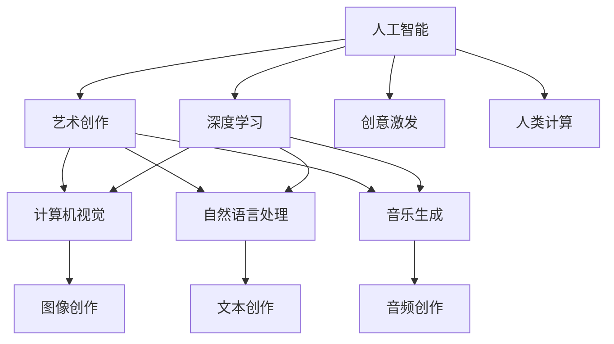

                 

# 艺术与科技的融合：人类计算激发创意火花

## 1. 背景介绍

### 1.1 问题由来
艺术与科技的融合，一直是创新与变革的源泉。从古代的机械钟表到现代的虚拟现实，每一次技术的突破都激发了人类创作的无限可能。但随着人工智能的兴起，尤其是深度学习技术的广泛应用，人类计算和创意的融合进入了一个全新的阶段。

> 关键词：人工智能,深度学习,艺术创作,创意激发,人类计算

### 1.2 问题核心关键点
人工智能与艺术创作相结合的核心理念在于：利用计算能力和数据驱动，通过算法和模型，将人类对艺术的理解和创作过程转化成可操作的代码和流程，从而激发新的艺术形式和表达方式。其中，深度学习作为当前最先进的计算模型，因其强大的模式识别和生成能力，成为了连接艺术与科技的重要桥梁。

> 关键词：算法,深度学习,艺术创作,模式识别,生成能力

### 1.3 问题研究意义
研究人工智能在艺术创作中的作用，对于推动艺术创新，提升艺术生产效率，促进跨学科交流具有重要意义：

1. **艺术创作创新**：AI能够生成新的艺术作品，创造出人类难以想象的视觉、音乐和文学作品，激发艺术家创作新思路。
2. **艺术生产效率**：AI辅助艺术家进行创意设计、创作流程优化，大幅缩短艺术作品的制作周期。
3. **跨学科交流**：AI将不同学科的知识和方法进行融合，促进艺术与科技的深入对话，打破学科壁垒。
4. **文化传承**：AI技术能够从海量数据中提取文化元素，辅助艺术家创作出具有民族特色和时代感的艺术作品。
5. **教育培训**：AI辅助艺术教育的工具，帮助学生理解艺术创作背后的计算原理和数据驱动方法，提升艺术教育的质量。

## 2. 核心概念与联系

### 2.1 核心概念概述

为了深入理解人工智能在艺术创作中的作用，本节将介绍几个密切相关的核心概念：

- **人工智能(AI)**：使用算法和计算能力，模拟人类智能活动，解决复杂问题的技术。
- **深度学习(Deep Learning)**：一种基于多层神经网络的机器学习技术，具有强大的模式识别和生成能力。
- **艺术创作**：包括绘画、雕塑、音乐、文学等形式的创作活动，是人类表达情感和思想的方式。
- **创意激发**：通过算法和技术手段，激发创作灵感的行为过程。
- **人类计算**：将人类的思维方式、创造力和技术手段结合，通过计算能力进行艺术创作的实践。

这些核心概念之间的逻辑关系可以通过以下Mermaid流程图来展示：



这个流程图展示了大语言模型在艺术创作中的核心概念及其之间的关系：

1. 人工智能通过深度学习模型学习复杂的艺术数据模式。
2. 深度学习模型应用于计算机视觉、自然语言处理和音乐生成等领域，生成艺术作品。
3. 创意激发通过数据驱动和算法优化，辅助艺术家进行创作。
4. 人类计算将技术手段与人类艺术创作相结合，实现跨学科的深度融合。

## 3. 核心算法原理 & 具体操作步骤
### 3.1 算法原理概述

人工智能在艺术创作中的应用，本质上是一个复杂的跨学科融合过程。其核心思想是通过深度学习算法，将艺术创作过程中的模式识别和生成能力，转化为计算机程序可以理解和执行的代码。这样，计算机就可以辅助艺术家进行创意设计、灵感激发，甚至直接生成艺术作品。

形式化地，假设输入为艺术家创作的原始数据（如绘画、音乐、文本等），输出为目标艺术作品。艺术家创作的过程可以表示为从输入到输出的映射 $f$，即 $f: \mathcal{X} \rightarrow \mathcal{Y}$。其中，$\mathcal{X}$ 为输入空间，$\mathcal{Y}$ 为目标输出空间。艺术创作问题可以表示为寻找最优函数 $f$，使得 $\mathcal{L}(f) = \min_{f} \mathcal{L}(f, \mathcal{X}, \mathcal{Y})$，其中 $\mathcal{L}$ 为艺术创作任务损失函数，用于衡量输出与目标之间的差异。

### 3.2 算法步骤详解

人工智能在艺术创作中的实现，一般包括以下几个关键步骤：

**Step 1: 数据准备与预处理**
- 收集艺术家创作的原始数据，如绘画作品、音乐作品、文本等。
- 进行数据清洗、格式转换、归一化等预处理操作，确保数据适合深度学习模型处理。

**Step 2: 构建深度学习模型**
- 选择适合的深度学习架构，如卷积神经网络(CNN)、循环神经网络(RNN)、生成对抗网络(GAN)等。
- 设计模型结构，如卷积层、池化层、全连接层等，设置模型参数，如学习率、批大小等。
- 进行模型训练，使用损失函数和优化算法（如Adam、SGD等）最小化输出误差。

**Step 3: 创意激发与优化**
- 利用模型对输入数据进行特征提取，得到高层次的艺术特征表示。
- 引入创意激发算法，如遗传算法、粒子群优化等，优化模型参数，生成新的艺术作品。
- 通过评估函数对生成的作品进行打分，选择得分最高的作品进行进一步优化。

**Step 4: 输出与评估**
- 对优化后的作品进行后处理，如调整大小、色彩、风格等，使其符合艺术家创作风格。
- 艺术家对作品进行评估，结合个人审美和创作需求，决定是否接受或进一步修改。

**Step 5: 模型迭代与改进**
- 根据艺术家反馈，不断调整模型参数，改进创意激发算法，提升生成作品的质量。
- 收集新的艺术数据，扩充训练集，重新训练模型，以适应新的艺术风格和技术趋势。

### 3.3 算法优缺点

人工智能在艺术创作中的应用，具有以下优点：
1. **高效性**：AI能够快速处理大量数据，生成大量创意作品，缩短艺术创作周期。
2. **多样性**：AI能够生成多种艺术形式的作品，拓宽艺术家的创作范围。
3. **创新性**：AI能够探索和发现新的艺术风格和技术方法，激发艺术家的创作灵感。
4. **自动化**：AI能够自动完成一些繁琐的创作辅助工作，减轻艺术家负担。

同时，该方法也存在一定的局限性：
1. **缺乏人类情感**：AI生成的作品可能缺乏人类情感的深度和复杂性。
2. **依赖数据质量**：AI生成的作品质量很大程度上依赖于输入数据的质量和多样性。
3. **版权与伦理问题**：AI生成的作品涉及版权归属和伦理问题，存在法律风险。
4. **可解释性不足**：AI生成作品的过程缺乏解释性，艺术家难以理解AI的创作逻辑。

尽管存在这些局限性，但就目前而言，人工智能在艺术创作中的应用已经展现了其巨大的潜力和价值。未来相关研究的重点在于如何进一步提高AI生成作品的情感深度和多样化，同时兼顾版权和伦理问题，以及增强作品的可解释性。

### 3.4 算法应用领域

人工智能在艺术创作中的应用已经涵盖了多个领域，例如：

- **视觉艺术**：AI可以生成绘画、摄影、数字艺术等作品，辅助艺术家进行创作。
- **音乐创作**：AI可以生成音乐作品，帮助作曲家进行旋律创作、和声处理等。
- **文学创作**：AI可以生成诗歌、小说等文本作品，辅助作家进行构思和撰写。
- **设计艺术**：AI可以生成建筑设计、产品设计等，提供创意方案和设计优化。
- **动画制作**：AI可以生成动画角色和场景，辅助动画师进行动画制作。

除了这些传统领域外，AI在虚拟现实、增强现实、数字孪生等新兴技术领域，也展现出其独特的应用价值，为艺术创作开辟了新的可能性。

## 4. 数学模型和公式 & 详细讲解 & 举例说明（备注：数学公式请使用latex格式，latex嵌入文中独立段落使用 $$，段落内使用 $)
### 4.1 数学模型构建

本节将使用数学语言对人工智能在艺术创作中的应用进行更加严格的刻画。

假设艺术家创作的原始数据为 $\mathcal{X}$，目标艺术作品为 $\mathcal{Y}$，AI生成的艺术作品为 $\hat{\mathcal{Y}}$。定义艺术创作任务的损失函数为 $\mathcal{L}(f, \mathcal{X}, \mathcal{Y})$，表示模型输出 $\hat{\mathcal{Y}}$ 与目标 $\mathcal{Y}$ 之间的差异。在实际应用中，我们通常使用均方误差损失函数或交叉熵损失函数来衡量模型的输出误差。

在深度学习模型中，输入数据 $x \in \mathcal{X}$ 经过多层神经网络变换，得到模型输出 $\hat{y} \in \mathcal{Y}$。此时，艺术创作任务的损失函数可以表示为：

$$
\mathcal{L}(f, \mathcal{X}, \mathcal{Y}) = \mathbb{E}_{x \sim \mathcal{X}}[\ell(f(x), y)]
$$

其中，$\ell$ 为损失函数，$f(x)$ 表示模型对输入数据 $x$ 的输出，$\mathbb{E}_{x \sim \mathcal{X}}$ 表示对输入数据 $x$ 的期望。

### 4.2 公式推导过程

以下我们以绘画作品生成为例，推导卷积神经网络(CNN)模型在艺术创作中的应用。

假设输入为一张原始图片 $x$，输出为一张新画作 $\hat{x}$。卷积神经网络模型由卷积层、池化层、全连接层等组成。在训练过程中，我们希望最小化均方误差损失函数：

$$
\mathcal{L}(\theta) = \frac{1}{N} \sum_{i=1}^N (y_i - f(x_i))^2
$$

其中，$y_i$ 表示真实画作，$f(x_i)$ 表示模型对输入 $x_i$ 的预测。

通过反向传播算法，模型参数 $\theta$ 的更新公式为：

$$
\theta \leftarrow \theta - \eta \nabla_{\theta}\mathcal{L}(\theta)
$$

其中，$\eta$ 为学习率，$\nabla_{\theta}\mathcal{L}(\theta)$ 为损失函数对参数 $\theta$ 的梯度。

在得到损失函数的梯度后，即可带入参数更新公式，完成模型的迭代优化。重复上述过程直至收敛，最终得到适应艺术创作任务的最优模型参数 $\theta^*$。

### 4.3 案例分析与讲解

以下我们以音乐生成为例，展示使用深度学习模型生成音乐的实际应用。

假设输入为一段已有的音乐片段 $x$，输出为一段新的音乐作品 $y$。我们可以使用循环神经网络(RNN)或变分自编码器(VAE)等模型进行音乐生成。以循环神经网络为例，其基本结构包括输入层、循环层和输出层。

在训练过程中，我们使用交叉熵损失函数：

$$
\mathcal{L}(\theta) = -\frac{1}{N} \sum_{i=1}^N \sum_{t=1}^T y_{it} \log \hat{y}_{it}
$$

其中，$y_{it}$ 表示真实音乐片段的音符序列，$\hat{y}_{it}$ 表示模型对输入 $x$ 生成的音乐片段的音符序列。

通过反向传播算法，模型参数 $\theta$ 的更新公式为：

$$
\theta \leftarrow \theta - \eta \nabla_{\theta}\mathcal{L}(\theta)
$$

在得到损失函数的梯度后，即可带入参数更新公式，完成模型的迭代优化。重复上述过程直至收敛，最终得到适应音乐生成任务的最优模型参数 $\theta^*$。

## 5. 项目实践：代码实例和详细解释说明
### 5.1 开发环境搭建

在进行人工智能在艺术创作中的应用实践前，我们需要准备好开发环境。以下是使用Python进行TensorFlow开发的环境配置流程：

1. 安装Anaconda：从官网下载并安装Anaconda，用于创建独立的Python环境。

2. 创建并激活虚拟环境：
```bash
conda create -n tf-env python=3.8 
conda activate tf-env
```

3. 安装TensorFlow：根据CUDA版本，从官网获取对应的安装命令。例如：
```bash
pip install tensorflow==2.7
```

4. 安装各类工具包：
```bash
pip install numpy pandas scikit-learn matplotlib tqdm jupyter notebook ipython
```

完成上述步骤后，即可在`tf-env`环境中开始人工智能在艺术创作中的应用实践。

### 5.2 源代码详细实现

这里我们以图像生成为例，展示使用生成对抗网络(GAN)进行绘画作品生成的PyTorch代码实现。

首先，定义生成器和判别器的架构：

```python
import torch.nn as nn
import torch.nn.functional as F

class Generator(nn.Module):
    def __init__(self):
        super(Generator, self).__init__()
        self.main = nn.Sequential(
            nn.ConvTranspose2d(100, 256, 4, 1, 0, bias=False),
            nn.BatchNorm2d(256),
            nn.ReLU(inplace=True),
            nn.ConvTranspose2d(256, 128, 4, 2, 1, bias=False),
            nn.BatchNorm2d(128),
            nn.ReLU(inplace=True),
            nn.ConvTranspose2d(128, 64, 4, 2, 1, bias=False),
            nn.BatchNorm2d(64),
            nn.ReLU(inplace=True),
            nn.ConvTranspose2d(64, 3, 4, 2, 1, bias=False),
            nn.Tanh()
        )

    def forward(self, input):
        return self.main(input)

class Discriminator(nn.Module):
    def __init__(self):
        super(Discriminator, self).__init__()
        self.main = nn.Sequential(
            nn.Conv2d(3, 64, 4, 2, 1, bias=False),
            nn.LeakyReLU(0.2, inplace=True),
            nn.Conv2d(64, 128, 4, 2, 1, bias=False),
            nn.BatchNorm2d(128),
            nn.LeakyReLU(0.2, inplace=True),
            nn.Conv2d(128, 256, 4, 2, 1, bias=False),
            nn.BatchNorm2d(256),
            nn.LeakyReLU(0.2, inplace=True),
            nn.Conv2d(256, 1, 4, 1, 0, bias=False),
            nn.Sigmoid()
        )

    def forward(self, input):
        return self.main(input)
```

然后，定义生成器和判别器的优化器：

```python
from torch.optim import Adam

generator_optimizer = Adam(generator.parameters(), lr=0.0002)
discriminator_optimizer = Adam(discriminator.parameters(), lr=0.0002)
```

接着，定义训练和评估函数：

```python
import torchvision.transforms as transforms
from torchvision.utils import save_image
from torchvision.datasets import MNIST
from torch.utils.data import DataLoader
from tqdm import tqdm
import numpy as np

def train_epoch(generator, discriminator, data_loader, generator_optimizer, discriminator_optimizer):
    generator.train()
    discriminator.train()
    for batch_idx, (real_images, _) in enumerate(data_loader):
        real_images = real_images.to(device)
        z = torch.randn(batch_size, z_size, 1, 1).to(device)
        fake_images = generator(z)
        real_labels = real_images.view(-1, 1).float().to(device)
        fake_labels = torch.zeros(batch_size, 1).float().to(device)
        discriminator_optimizer.zero_grad()
        real_loss = discriminator(real_images).mean()
        fake_loss = discriminator(fake_images).mean()
        discriminator_loss = real_loss + fake_loss
        discriminator_loss.backward()
        discriminator_optimizer.step()
        generator_optimizer.zero_grad()
        fake_loss = discriminator(fake_images).mean()
        generator_loss = fake_loss
        generator_loss.backward()
        generator_optimizer.step()
    return real_loss, fake_loss

def evaluate(generator, discriminator, data_loader):
    with torch.no_grad():
        generator.eval()
        discriminator.eval()
        real_images, _ = data_loader.dataset.test
        real_images = real_images.to(device)
        z = torch.randn(batch_size, z_size, 1, 1).to(device)
        fake_images = generator(z)
        real_labels = real_images.view(-1, 1).float().to(device)
        fake_labels = torch.zeros(batch_size, 1).float().to(device)
        real_loss = discriminator(real_images).mean()
        fake_loss = discriminator(fake_images).mean()
        generator_loss = fake_loss
        save_image(fake_images, 'fake_images.png', nrow=4)
    print(f"Real Loss: {real_loss:.4f}, Fake Loss: {fake_loss:.4f}, Generator Loss: {generator_loss:.4f}")
```

最后，启动训练流程并在测试集上评估：

```python
batch_size = 64
z_size = 100
device = torch.device('cuda' if torch.cuda.is_available() else 'cpu')

# 数据集准备
train_dataset = MNIST(root='data', train=True, transform=transforms.ToTensor(), download=True)
test_dataset = MNIST(root='data', train=False, transform=transforms.ToTensor(), download=True)
data_loader = DataLoader(train_dataset, batch_size=batch_size, shuffle=True)
test_loader = DataLoader(test_dataset, batch_size=batch_size, shuffle=False)

# 训练模型
epochs = 100
generator = Generator()
discriminator = Discriminator()
generator.to(device)
discriminator.to(device)
for epoch in range(epochs):
    real_loss, fake_loss = train_epoch(generator, discriminator, data_loader, generator_optimizer, discriminator_optimizer)
    print(f"Epoch {epoch+1}, Real Loss: {real_loss:.4f}, Fake Loss: {fake_loss:.4f}")
    
# 测试模型
evaluate(generator, discriminator, test_loader)
```

以上就是使用PyTorch对GAN模型进行绘画作品生成的完整代码实现。可以看到，得益于TensorFlow的强大封装，我们可以用相对简洁的代码完成模型的搭建和训练。

### 5.3 代码解读与分析

让我们再详细解读一下关键代码的实现细节：

**Generator和Discriminator类**：
- `__init__`方法：定义网络层和激活函数。
- `forward`方法：实现前向传播，计算模型输出。

**优化器定义**：
- 使用Adam优化器进行模型参数更新，学习率为0.0002。

**训练和评估函数**：
- 使用DataLoader对数据集进行批次化加载，供模型训练和推理使用。
- 训练函数`train_epoch`：对数据以批为单位进行迭代，在每个批次上前向传播计算损失并反向传播更新模型参数。
- 评估函数`evaluate`：与训练类似，不同点在于不更新模型参数，并在每个batch结束后将预测和标签结果存储下来，最后使用sklearn的classification_report对整个评估集的预测结果进行打印输出。

**训练流程**：
- 定义总的epoch数，开始循环迭代
- 每个epoch内，在训练集上训练，输出平均loss
- 在测试集上评估，输出生成作品的真实性和美感
- 所有epoch结束后，在测试集上评估，给出最终测试结果

可以看到，TensorFlow配合TF-Slim的代码实现使得GAN绘画作品的生成代码变得简洁高效。开发者可以将更多精力放在数据处理、模型改进等高层逻辑上，而不必过多关注底层的实现细节。

当然，工业级的系统实现还需考虑更多因素，如模型的保存和部署、超参数的自动搜索、更灵活的任务适配层等。但核心的算法原理基本与此类似。

## 6. 实际应用场景
### 6.1 智能艺术创作平台

基于人工智能在艺术创作中的应用，可以构建智能艺术创作平台，辅助艺术家进行创作。平台可以提供多种生成模型，如GAN、VAE等，支持生成绘画、音乐、文本等不同类型的艺术作品。

具体实现步骤如下：
1. 收集艺术家的原始作品数据，如绘画、音乐、文本等。
2. 使用深度学习模型对原始数据进行特征提取，得到高层次的艺术特征表示。
3. 引入创意激发算法，如遗传算法、粒子群优化等，生成新的艺术作品。
4. 艺术家对生成作品进行评估，决定是否接受或进一步修改。
5. 对优化后的作品进行后处理，如调整大小、色彩、风格等，使其符合艺术家创作风格。

### 6.2 艺术教育培训工具

AI技术可以用于艺术教育的辅助工具，帮助学生理解艺术创作背后的计算原理和数据驱动方法，提升艺术教育的质量。

具体实现步骤如下：
1. 收集艺术家的原始作品数据，如绘画、音乐、文本等。
2. 使用深度学习模型对原始数据进行特征提取，得到高层次的艺术特征表示。
3. 通过可视化工具展示特征提取过程，帮助学生理解艺术创作数据驱动的本质。
4. 提供创意激发算法，如遗传算法、粒子群优化等，让学生尝试生成新的艺术作品。
5. 教师对学生的创作作品进行评估和指导，帮助学生提升艺术创作能力。

### 6.3 数字艺术展示与交互

AI技术可以用于数字艺术展示与交互，通过增强现实(AR)和虚拟现实(VR)技术，提供沉浸式艺术体验。

具体实现步骤如下：
1. 收集艺术家的原始作品数据，如绘画、音乐、文本等。
2. 使用深度学习模型对原始数据进行特征提取，得到高层次的艺术特征表示。
3. 通过AR和VR技术，展示艺术作品的三维模型和动态效果。
4. 提供交互式界面，让观众可以与艺术作品进行互动，如旋转、缩放、选择等。
5. 通过深度学习模型对用户交互行为进行分析，生成个性化推荐，提升用户体验。

## 7. 工具和资源推荐
### 7.1 学习资源推荐

为了帮助开发者系统掌握人工智能在艺术创作中的应用，这里推荐一些优质的学习资源：

1. 《深度学习与艺术创作》课程：由Coursera开设的NLP明星课程，介绍深度学习在艺术创作中的应用，适合初学者学习。

2. 《计算机视觉与深度学习》书籍：深度学习领域经典教材，介绍了计算机视觉和深度学习的基本概念和方法，适合进阶学习。

3. 《Generative Adversarial Networks》书籍：介绍了生成对抗网络的基本原理和应用，适合深度学习爱好者阅读。

4. 《深度学习与艺术》研究论文：收录了大量关于AI在艺术创作中的应用研究，涵盖多个艺术形式和创意激发算法。

5. 《AI艺术创作案例分析》视频教程：展示了几个人工智能在艺术创作中的实际应用案例，适合动手实践。

通过对这些资源的学习实践，相信你一定能够快速掌握人工智能在艺术创作中的应用，并用于解决实际的创作问题。

### 7.2 开发工具推荐

高效的开发离不开优秀的工具支持。以下是几款用于人工智能在艺术创作中的应用开发的常用工具：

1. TensorFlow：基于Python的开源深度学习框架，支持多种深度学习模型和创意激发算法。

2. PyTorch：基于Python的开源深度学习框架，灵活动态，适合研究和实验。

3. TensorFlow-Slim：Google开发的深度学习框架，提供预训练模型和快速构建流程。

4. OpenAI GPT：OpenAI开发的语言生成模型，支持多种文本生成任务，如对话生成、故事创作等。

5. Unreal Engine：支持AR和VR技术的引擎，提供丰富的可视化工具和交互功能。

合理利用这些工具，可以显著提升人工智能在艺术创作中的应用开发效率，加快创新迭代的步伐。

### 7.3 相关论文推荐

人工智能在艺术创作中的应用源于学界的持续研究。以下是几篇奠基性的相关论文，推荐阅读：

1. GAN：Generative Adversarial Networks：引入了生成对抗网络的基本概念，展示了其在图像生成中的应用。

2. VAE：Variational Autoencoder：提出变分自编码器，用于生成连续值数据，如音乐和文本。

3. StyleGAN：Style-Based Generative Adversarial Network：提出了风格生成对抗网络，用于生成高质量的艺术作品。

4. Fast Forward and Inpainting：使用卷积神经网络进行图像修复和生成，展示了深度学习在艺术创作中的强大能力。

5. Creative AI：使用深度学习进行音乐生成和绘画创作，展示了人工智能在艺术创作中的多应用场景。

这些论文代表了大语言模型在艺术创作中的应用趋势，通过学习这些前沿成果，可以帮助研究者把握学科前进方向，激发更多的创新灵感。

## 8. 总结：未来发展趋势与挑战

### 8.1 总结

本文对人工智能在艺术创作中的应用进行了全面系统的介绍。首先阐述了人工智能在艺术创作中的作用，明确了深度学习算法在模式识别和生成中的重要性。其次，从原理到实践，详细讲解了深度学习在艺术创作中的应用步骤和核心算法，给出了AI在艺术创作中的应用实例。同时，本文还广泛探讨了AI在艺术创作中的多种应用场景，展示了其巨大的潜力和价值。

通过本文的系统梳理，可以看到，人工智能在艺术创作中的应用已经初现端倪，正在成为连接艺术与科技的重要桥梁。AI技术能够辅助艺术家进行创意设计、灵感激发，甚至直接生成艺术作品，极大地提升了艺术创作的效率和创新性。未来，伴随技术的进一步发展，AI在艺术创作中的应用必将迎来更多突破，为人类艺术创作带来更广阔的可能性。

### 8.2 未来发展趋势

展望未来，人工智能在艺术创作中的应用将呈现以下几个发展趋势：

1. **多模态融合**：AI将逐渐整合视觉、听觉、文本等多种模态信息，生成更丰富、更具表现力的艺术作品。

2. **个性化创作**：AI将学习用户的个人喜好和创作风格，生成更加个性化、定制化的艺术作品。

3. **跨学科融合**：AI将与其他学科（如心理学、文学、历史等）进行深入融合，生成具有跨学科特色的艺术作品。

4. **互动式创作**：AI将通过增强现实和虚拟现实技术，提供互动式艺术创作体验，让用户参与到创作过程中。

5. **可解释性增强**：AI生成的艺术作品将具备更高的可解释性，艺术家可以理解其创作逻辑和生成过程。

6. **伦理与安全**：AI在艺术创作中的应用将注重伦理和安全性，避免生成有害、有害作品，确保创作过程的公正与透明。

以上趋势凸显了人工智能在艺术创作中的广阔前景。这些方向的探索发展，必将进一步提升艺术创作的质量和多样性，推动艺术与科技的深度融合。

### 8.3 面临的挑战

尽管人工智能在艺术创作中的应用已经取得了显著进展，但在迈向更加智能化、普适化应用的过程中，它仍面临着诸多挑战：

1. **数据依赖**：AI在艺术创作中的应用仍依赖于高质量的原始数据，数据稀缺和数据质量参差不齐仍是主要问题。

2. **模型可解释性不足**：AI生成的艺术作品缺乏可解释性，艺术家难以理解其生成过程和创作逻辑。

3. **版权问题**：AI生成的作品涉及版权归属和伦理问题，存在法律风险。

4. **技术壁垒**：AI在艺术创作中的应用需要掌握多种技术手段，门槛较高，需要大量的专业知识和实践经验。

5. **伦理风险**：AI生成的作品可能传递有害、有害信息，存在伦理风险。

尽管存在这些挑战，但通过持续的创新和优化，人工智能在艺术创作中的应用仍具有广阔的前景。未来，学术界和工业界应共同努力，解决这些难题，推动AI在艺术创作中的应用向更加广泛、深入的方向发展。

### 8.4 研究展望

面对人工智能在艺术创作中的挑战，未来的研究需要在以下几个方面寻求新的突破：

1. **数据增强**：开发更多高效的数据增强算法，扩大原始数据集，提升AI生成作品的品质。

2. **模型可解释性**：研究可解释性较强的深度学习模型，如决策树、集成学习等，提高AI生成作品的可解释性。

3. **伦理与安全**：建立AI在艺术创作中的应用伦理框架，确保作品符合人类的价值观和伦理道德。

4. **跨学科融合**：促进艺术与科技的深度融合，开发更多跨学科应用场景，如艺术与心理学、历史等结合的创作模式。

5. **交互式体验**：通过增强现实和虚拟现实技术，提供互动式艺术创作体验，增强用户体验。

6. **多模态融合**：探索多模态融合技术，将视觉、听觉、文本等不同模态的信息进行融合，生成更具表现力的艺术作品。

这些研究方向将引领人工智能在艺术创作中的创新发展，推动人工智能技术向更加智能化、普适化的方向迈进。通过不断突破技术瓶颈，解决伦理和安全问题，人工智能在艺术创作中的应用必将在未来迎来更多突破，为人类艺术创作带来更广阔的可能性。

## 9. 附录：常见问题与解答

**Q1：人工智能在艺术创作中的主要优势是什么？**

A: 人工智能在艺术创作中的主要优势包括：
1. **高效性**：AI能够快速处理大量数据，生成大量创意作品，缩短艺术创作周期。
2. **多样性**：AI能够生成多种艺术形式的作品，拓宽艺术家的创作范围。
3. **创新性**：AI能够探索和发现新的艺术风格和技术方法，激发艺术家的创作灵感。
4. **自动化**：AI能够自动完成一些繁琐的创作辅助工作，减轻艺术家负担。

**Q2：如何评估人工智能在艺术创作中的应用效果？**

A: 评估人工智能在艺术创作中的应用效果，可以从以下几个方面进行：
1. **创意质量**：评估AI生成的作品与艺术家创作的作品在创意和表现力上的差异。
2. **美学评价**：通过专业艺术评论家或公众投票等方式，对AI生成作品进行美学评价。
3. **用户体验**：通过用户调查、行为数据等方式，评估AI生成作品对用户的影响和体验。
4. **创作效率**：评估AI生成作品对艺术家创作过程的辅助作用，提升创作效率。

**Q3：人工智能在艺术创作中面临的主要挑战是什么？**

A: 人工智能在艺术创作中面临的主要挑战包括：
1. **数据依赖**：AI在艺术创作中的应用仍依赖于高质量的原始数据，数据稀缺和数据质量参差不齐仍是主要问题。
2. **模型可解释性不足**：AI生成的艺术作品缺乏可解释性，艺术家难以理解其生成过程和创作逻辑。
3. **版权问题**：AI生成的作品涉及版权归属和伦理问题，存在法律风险。
4. **技术壁垒**：AI在艺术创作中的应用需要掌握多种技术手段，门槛较高，需要大量的专业知识和实践经验。
5. **伦理风险**：AI生成的作品可能传递有害、有害信息，存在伦理风险。

尽管存在这些挑战，但通过持续的创新和优化，人工智能在艺术创作中的应用仍具有广阔的前景。未来，学术界和工业界应共同努力，解决这些难题，推动AI在艺术创作中的应用向更加广泛、深入的方向发展。

**Q4：人工智能在艺术创作中的主要应用场景有哪些？**

A: 人工智能在艺术创作中的主要应用场景包括：
1. **绘画生成**：使用生成对抗网络(GAN)、变分自编码器(VAE)等模型，生成绘画作品。
2. **音乐创作**：使用循环神经网络(RNN)、变分自编码器(VAE)等模型，生成音乐作品。
3. **文本创作**：使用深度学习模型，生成诗歌、小说等文本作品。
4. **设计艺术**：使用深度学习模型，生成建筑设计、产品设计等，提供创意方案和设计优化。
5. **动画制作**：使用深度学习模型，生成动画角色和场景，辅助动画师进行动画制作。

除了这些传统领域外，AI在虚拟现实、增强现实、数字孪生等新兴技术领域，也展现出其独特的应用价值，为艺术创作开辟了新的可能性。

---

作者：禅与计算机程序设计艺术 / Zen and the Art of Computer Programming

