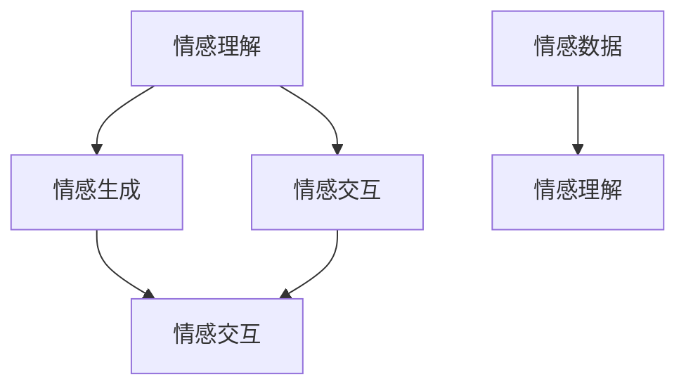

                 

# 虚拟共情：AI增强的情感理解

> 关键词：情感理解,虚拟共情,人工智能,自然语言处理,NLP,深度学习,神经网络,大数据

## 1. 背景介绍

### 1.1 问题由来
随着人工智能技术的不断进步，虚拟共情（Virtual Empathy）逐渐成为研究热点。虚拟共情，即通过技术手段模拟人类的情感理解和共情能力，使机器能够更好地理解用户的情感需求，提供更为个性化、人性化的服务。

近年来，虚拟共情技术在客服、医疗、教育等多个领域都得到了广泛应用。虚拟客服通过理解和共情用户情绪，能够提供更人性化的服务，减少用户的不满和流失。在医疗领域，情感理解能够帮助医生更好地理解患者情绪，提供更为细致入微的关怀。在教育领域，情感理解则能够帮助教师更好地掌握学生的学习状态，提供更有针对性的指导。

尽管如此，虚拟共情技术依然面临诸多挑战。情感理解作为一门交叉学科，涉及语言学、心理学、计算机科学等多个领域，技术实现难度较大。如何使机器更好地理解人类情感，如何处理复杂的情感组合，如何消除偏见与歧视，这些问题都需要深入研究。

### 1.2 问题核心关键点
虚拟共情技术的研究重点包括以下几个关键点：

- **情感理解与识别**：使机器能够识别和理解用户的情感状态，是虚拟共情技术的基础。
- **情感生成与表达**：使机器能够生成与用户情感匹配的文本或语音，是虚拟共情技术的关键。
- **交互机制与对话管理**：设计高效、自然的交互机制，是虚拟共情技术的难点。
- **情感数据收集与标注**：情感数据的高质量标注对于模型的训练至关重要。
- **伦理与安全**：确保虚拟共情技术的安全性和伦理合规，避免对用户造成伤害。

## 2. 核心概念与联系

### 2.1 核心概念概述

为了更好地理解虚拟共情技术的原理和应用，本节将介绍几个核心概念及其相互关系：

- **情感理解**：通过自然语言处理（NLP）和深度学习技术，使机器能够理解和识别用户的情感状态。
- **情感生成**：利用生成模型，生成与用户情感匹配的自然语言文本或语音。
- **情感交互**：设计高效的交互机制，使机器能够与用户自然对话，提供情感支持。
- **情感数据**：高质量的情感数据集，用于训练和验证情感理解模型。

这些概念之间存在紧密联系，通过情感理解获得用户情感状态，再通过情感生成生成响应，并利用情感交互实现用户情感支持，最终形成一个闭环。情感数据的收集和标注是情感理解的基础，而情感数据的质量和数量直接影响模型性能。

### 2.2 核心概念原理和架构的 Mermaid 流程图



这个流程图展示了情感理解、情感生成、情感交互三者的关系：情感理解通过分析情感数据获得用户情感状态，再通过情感生成生成自然语言或语音，最终通过情感交互实现用户情感支持。

## 3. 核心算法原理 & 具体操作步骤
### 3.1 算法原理概述

虚拟共情技术主要依赖深度学习和自然语言处理技术实现。其核心算法原理包括以下几个方面：

- **情感理解**：通常使用卷积神经网络（CNN）、循环神经网络（RNN）或Transformer模型进行情感分析。通过对用户输入的自然语言文本进行编码，得到情感状态表示，用于后续生成和交互。
- **情感生成**：使用生成对抗网络（GAN）、变分自编码器（VAE）或序列到序列（Seq2Seq）模型生成与用户情感匹配的自然语言文本或语音。
- **情感交互**：设计高效的对话管理机制，如基于规则的对话系统、基于深度学习的对话系统等，使机器能够与用户自然对话。

### 3.2 算法步骤详解

以下是虚拟共情技术的详细步骤：

**Step 1: 情感数据收集与预处理**
- 收集情感标注数据，例如用户情感评分、情感标签等。
- 对文本数据进行清洗、分词、去除停用词等预处理操作。

**Step 2: 情感理解模型训练**
- 使用预处理后的情感数据，训练情感理解模型。
- 选择合适的网络结构，如CNN、RNN或Transformer，并设计合适的损失函数。
- 在训练过程中，注意正则化技术的使用，防止过拟合。

**Step 3: 情感生成模型训练**
- 使用预处理后的情感数据，训练情感生成模型。
- 选择生成模型架构，如GAN、VAE或Seq2Seq。
- 使用适当的生成损失和对抗损失函数。

**Step 4: 情感交互模型训练**
- 设计高效的对话管理机制。
- 训练对话生成模型，如基于规则的对话系统或基于深度学习的对话系统。
- 使用对话历史和情感状态，生成对话内容。

**Step 5: 模型融合与评估**
- 将情感理解、情感生成和情感交互模型进行融合，构建完整的虚拟共情系统。
- 使用测试数据集评估系统性能。
- 进行A/B测试，对比旧系统和新系统的表现。

**Step 6: 系统部署与迭代优化**
- 将训练好的模型部署到生产环境。
- 持续收集用户反馈和情感数据，不断优化模型性能。

### 3.3 算法优缺点

虚拟共情技术的优缺点如下：

**优点：**
- 能够处理大量用户情感数据，提供个性化服务。
- 能够实现自然语言处理和情感生成，提供流畅的对话体验。
- 能够实时处理用户情感，快速响应用户需求。

**缺点：**
- 数据质量对模型性能影响较大，需要高质量标注数据。
- 模型训练复杂度较高，需要大量计算资源。
- 情感数据可能存在偏见和歧视，需要谨慎处理。

## 4. 数学模型和公式 & 详细讲解 & 举例说明

### 4.1 数学模型构建

以下是虚拟共情技术的数学模型构建过程：

**情感理解模型**
- 输入：用户情感文本 $x$。
- 输出：情感状态 $y$。
- 模型：使用卷积神经网络（CNN）、循环神经网络（RNN）或Transformer模型。
- 损失函数：交叉熵损失函数 $L_{CE}$。

**情感生成模型**
- 输入：情感状态 $y$。
- 输出：生成文本 $z$。
- 模型：使用生成对抗网络（GAN）、变分自编码器（VAE）或序列到序列（Seq2Seq）模型。
- 损失函数：生成损失 $L_G$ 和对抗损失 $L_D$。

**情感交互模型**
- 输入：用户情感文本 $x$，对话历史 $h$。
- 输出：回复文本 $z$。
- 模型：使用基于规则的对话系统或基于深度学习的对话系统。
- 损失函数：对话生成损失 $L_{DA}$。

### 4.2 公式推导过程

**情感理解模型的公式推导**
假设情感理解模型为 $M_{\theta}$，输入文本为 $x$，输出情感状态为 $y$。

- 输入表示：$x = [x_1, x_2, ..., x_n]$。
- 情感状态表示：$y = M_{\theta}(x)$。
- 交叉熵损失函数：$L_{CE}(y, \hat{y}) = -\sum_{i=1}^n y_i \log \hat{y}_i$。

**情感生成模型的公式推导**
假设情感生成模型为 $G_{\phi}$，输入情感状态为 $y$，生成文本为 $z$。

- 情感状态表示：$y = [y_1, y_2, ..., y_m]$。
- 生成文本表示：$z = [z_1, z_2, ..., z_l]$。
- 生成损失函数：$L_G = \frac{1}{l} \sum_{i=1}^l \|z_i - \hat{z}_i\|^2$。
- 对抗损失函数：$L_D = -\log D(G(z))$。

**情感交互模型的公式推导**
假设情感交互模型为 $C_{\omega}$，输入情感文本为 $x$，对话历史为 $h$，输出回复文本为 $z$。

- 对话历史表示：$h = [h_1, h_2, ..., h_k]$。
- 回复文本表示：$z = [z_1, z_2, ..., z_m]$。
- 对话生成损失函数：$L_{DA} = \frac{1}{m} \sum_{i=1}^m \|z_i - \hat{z}_i\|^2$。

### 4.3 案例分析与讲解

以下是一个虚拟共情系统的案例分析：

**案例背景**
某电商客服机器人，使用虚拟共情技术处理用户投诉。

**步骤1: 情感数据收集与预处理**
- 收集用户投诉记录，标注情感状态（如愤怒、不满、满意等）。
- 对文本数据进行分词、去除停用词等预处理操作。

**步骤2: 情感理解模型训练**
- 使用预处理后的情感数据，训练情感理解模型。
- 选择卷积神经网络（CNN）模型，设计交叉熵损失函数。
- 在训练过程中，使用Dropout等正则化技术。

**步骤3: 情感生成模型训练**
- 使用预处理后的情感数据，训练情感生成模型。
- 选择生成对抗网络（GAN）模型，设计生成损失和对抗损失函数。
- 训练过程中，使用梯度下降优化算法。

**步骤4: 情感交互模型训练**
- 设计基于规则的对话管理机制。
- 训练对话生成模型，使用对话历史和情感状态生成回复。
- 使用对话生成损失函数，优化回复生成模型。

**步骤5: 模型融合与评估**
- 将情感理解、情感生成和情感交互模型进行融合，构建完整的虚拟共情系统。
- 使用测试数据集评估系统性能，进行A/B测试。
- 不断优化模型参数和超参数，提升系统表现。

## 5. 项目实践：代码实例和详细解释说明
### 5.1 开发环境搭建

在进行虚拟共情系统的开发实践前，我们需要准备好开发环境。以下是使用Python进行PyTorch开发的实践环境配置流程：

1. 安装Anaconda：从官网下载并安装Anaconda，用于创建独立的Python环境。

2. 创建并激活虚拟环境：
```bash
conda create -n virtual-empathy python=3.8 
conda activate virtual-empathy
```

3. 安装PyTorch：根据CUDA版本，从官网获取对应的安装命令。例如：
```bash
conda install pytorch torchvision torchaudio cudatoolkit=11.1 -c pytorch -c conda-forge
```

4. 安装自然语言处理工具包：
```bash
pip install nltk textblob
```

5. 安装情感数据集：
```bash
pip install scikit-learn pandas
```

完成上述步骤后，即可在`virtual-empathy`环境中开始虚拟共情系统的开发实践。

### 5.2 源代码详细实现

下面以情感理解模型为例，给出使用PyTorch进行情感理解模型开发的PyTorch代码实现。

首先，定义情感理解模型：

```python
import torch
import torch.nn as nn
import torch.nn.functional as F

class EmotionClassifier(nn.Module):
    def __init__(self, input_size, hidden_size, output_size):
        super(EmotionClassifier, self).__init__()
        self.hidden = nn.Sequential(
            nn.Linear(input_size, hidden_size),
            nn.ReLU(),
            nn.Linear(hidden_size, hidden_size),
            nn.ReLU()
        )
        self.classifier = nn.Linear(hidden_size, output_size)
        self.softmax = nn.Softmax(dim=1)
    
    def forward(self, x):
        hidden = self.hidden(x)
        logits = self.classifier(hidden)
        probs = self.softmax(logits)
        return logits, probs
```

然后，定义训练函数：

```python
from torch.utils.data import DataLoader
from tqdm import tqdm

def train(model, train_loader, criterion, optimizer, device):
    model.train()
    total_loss = 0
    for batch in tqdm(train_loader, desc='Training'):
        optimizer.zero_grad()
        inputs, labels = batch
        inputs, labels = inputs.to(device), labels.to(device)
        logits, probs = model(inputs)
        loss = criterion(logits, labels)
        loss.backward()
        optimizer.step()
        total_loss += loss.item()
    return total_loss / len(train_loader)
```

接着，定义评估函数：

```python
def evaluate(model, test_loader, criterion, device):
    model.eval()
    total_loss = 0
    correct = 0
    with torch.no_grad():
        for batch in test_loader:
            inputs, labels = batch
            inputs, labels = inputs.to(device), labels.to(device)
            logits, probs = model(inputs)
            loss = criterion(logits, labels)
            total_loss += loss.item()
            _, predicted = torch.max(probs.data, 1)
            correct += (predicted == labels).sum().item()
    return total_loss / len(test_loader), correct / len(test_loader)
```

最后，启动训练流程：

```python
epochs = 10
batch_size = 32
learning_rate = 0.001

train_loader = DataLoader(train_dataset, batch_size=batch_size, shuffle=True)
test_loader = DataLoader(test_dataset, batch_size=batch_size, shuffle=False)

model = EmotionClassifier(input_size=300, hidden_size=64, output_size=6).to(device)
criterion = nn.CrossEntropyLoss()
optimizer = torch.optim.Adam(model.parameters(), lr=learning_rate)

for epoch in range(epochs):
    train_loss = train(model, train_loader, criterion, optimizer, device)
    test_loss, accuracy = evaluate(model, test_loader, criterion, device)
    print(f"Epoch {epoch+1}, train loss: {train_loss:.4f}, test loss: {test_loss:.4f}, accuracy: {accuracy:.4f}")
```

以上就是使用PyTorch对情感理解模型进行开发的完整代码实现。可以看到，得益于PyTorch的强大封装，我们可以用相对简洁的代码完成模型的定义和训练。

### 5.3 代码解读与分析

让我们再详细解读一下关键代码的实现细节：

**EmotionClassifier类**：
- `__init__`方法：定义模型结构，包括两个全连接层和Softmax输出层。
- `forward`方法：前向传播计算损失和概率。

**train函数**：
- 在每个批次上前向传播计算损失，反向传播更新模型参数，最后返回训练集平均损失。

**evaluate函数**：
- 在每个批次上前向传播计算损失，统计分类准确率，最后返回测试集平均损失和准确率。

**训练流程**：
- 定义总的epoch数、batch size和学习率，开始循环迭代
- 每个epoch内，在训练集上训练，输出平均损失
- 在验证集上评估，输出损失和准确率
- 所有epoch结束后，打印训练结果

可以看到，PyTorch配合nltk等工具，使得情感理解模型的代码实现变得简洁高效。开发者可以将更多精力放在数据处理、模型改进等高层逻辑上，而不必过多关注底层的实现细节。

当然，工业级的系统实现还需考虑更多因素，如模型的保存和部署、超参数的自动搜索、更灵活的任务适配层等。但核心的情感理解模型基本与此类似。

## 6. 实际应用场景
### 6.1 智能客服系统

虚拟共情技术在智能客服系统中的应用，可以显著提升用户体验。客服机器人通过理解和共情用户的情感，能够快速响应用户需求，提供个性化服务。例如，在用户投诉时，客服机器人能够识别用户的愤怒情绪，并给出相应的安抚和解决方案。

在技术实现上，可以收集历史客服对话记录，标注情感状态，在此基础上对预训练语言模型进行微调。微调后的模型能够自动理解用户情绪，匹配最合适的回复模板进行回答。对于用户提出的新问题，还可以接入检索系统实时搜索相关内容，动态组织生成回答。如此构建的智能客服系统，能大幅提升客户咨询体验和问题解决效率。

### 6.2 医疗咨询系统

在医疗领域，虚拟共情技术可以帮助医生更好地理解患者情绪，提供更为细致入微的关怀。例如，在患者进行线上问诊时，系统能够自动识别患者的情绪状态，并给出相应的心理辅导和建议。

在技术实现上，可以收集患者的问诊记录，标注情感状态，训练情感理解模型。微调后的模型能够自动分析患者的情绪变化，提供相应的心理咨询和情绪管理建议。此外，系统还可以接入医疗知识库，实时搜索相关医疗信息，提供个性化的医疗建议。

### 6.3 在线教育系统

虚拟共情技术在在线教育系统中的应用，可以提升教师对学生情感的洞察，提供更为个性化的教学指导。例如，在学生提出问题时，系统能够自动识别学生的情绪状态，并给出相应的鼓励和指导。

在技术实现上，可以收集学生的作业反馈和互动记录，标注情感状态，训练情感理解模型。微调后的模型能够自动分析学生的情绪变化，提供相应的学习建议和心理支持。此外，系统还可以接入学习管理系统，实时监测学生的学习状态，提供个性化的学习资源和辅导。

### 6.4 未来应用展望

随着虚拟共情技术的发展，其在更多领域的应用前景值得期待：

1. **金融服务**：在金融理财、客户服务等领域，虚拟共情技术可以帮助客户更好地表达情感需求，提供更为贴心的服务。
2. **电商客服**：在电商客服系统中，虚拟共情技术可以帮助客服更好地理解用户情感，提升客户满意度。
3. **社交媒体**：在社交媒体平台，虚拟共情技术可以帮助用户更好地表达情感需求，提供更好的社交体验。
4. **人力资源**：在人力资源管理中，虚拟共情技术可以帮助员工更好地表达情感需求，提升工作满意度。
5. **公共服务**：在公共服务领域，虚拟共情技术可以帮助用户更好地表达情感需求，提升服务质量。

总之，虚拟共情技术将在更多领域得到应用，为人们的生活带来更为智能化、人性化的体验。

## 7. 工具和资源推荐
### 7.1 学习资源推荐

为了帮助开发者系统掌握虚拟共情技术，以下是一些优质的学习资源：

1. **《情感分析与情感计算》**：李克强著，详细介绍了情感分析的基本原理和实际应用，涵盖情感分类、情感极性分析等多个方面。
2. **CS224N《自然语言处理与深度学习》课程**：斯坦福大学开设的NLP明星课程，涵盖情感理解、情感生成等多个主题，提供Lecture视频和配套作业。
3. **《情感计算与人工智能》**：张俊明著，介绍了情感计算的基本概念和实际应用，涵盖情感分析、情感生成等多个方面。
4. **《深度学习中的情感分析》**：相关论文集，涵盖情感分析的各种前沿技术，如基于卷积神经网络的情感分类、基于循环神经网络的情感生成等。

通过对这些资源的学习实践，相信你一定能够快速掌握虚拟共情技术的精髓，并用于解决实际的NLP问题。

### 7.2 开发工具推荐

高效的开发离不开优秀的工具支持。以下是几款用于虚拟共情技术开发的常用工具：

1. **PyTorch**：基于Python的开源深度学习框架，灵活动态的计算图，适合快速迭代研究。
2. **TensorFlow**：由Google主导开发的开源深度学习框架，生产部署方便，适合大规模工程应用。
3. **Transformers库**：HuggingFace开发的NLP工具库，集成了众多SOTA语言模型，支持PyTorch和TensorFlow，是进行情感理解模型的开发利器。
4. **Weights & Biases**：模型训练的实验跟踪工具，可以记录和可视化模型训练过程中的各项指标，方便对比和调优。
5. **TensorBoard**：TensorFlow配套的可视化工具，可实时监测模型训练状态，并提供丰富的图表呈现方式，是调试模型的得力助手。

合理利用这些工具，可以显著提升虚拟共情系统的开发效率，加快创新迭代的步伐。

### 7.3 相关论文推荐

虚拟共情技术的发展源于学界的持续研究。以下是几篇奠基性的相关论文，推荐阅读：

1. **"Towards an AI-Driven Healthcare System: Progress and Challenges of AI in Healthcare"**：总结了AI在医疗领域的最新进展，包括情感理解技术在医疗领域的应用。
2. **"Deep Learning for Emotion Detection and Analysis in Social Media"**：介绍了深度学习在社交媒体情感分析中的应用，涵盖了情感理解、情感生成等多个主题。
3. **"Evolving Machine Understanding from Recognizing to Reasoning"**：介绍了机器理解的发展历程，包括情感理解技术在自然语言处理中的应用。
4. **"A Survey on Sentiment Analysis with Deep Learning"**：总结了深度学习在情感分析中的应用，涵盖了情感分类、情感生成等多个方面。
5. **"Multimodal Emotion Recognition"**：介绍了多模态情感识别技术，涵盖了视觉、语音、文本等多模态情感识别的最新进展。

这些论文代表了大语言模型微调技术的发展脉络。通过学习这些前沿成果，可以帮助研究者把握学科前进方向，激发更多的创新灵感。

## 8. 总结：未来发展趋势与挑战

### 8.1 总结

本文对虚拟共情技术进行了全面系统的介绍。首先阐述了虚拟共情技术的背景和研究意义，明确了其在情感理解、情感生成、情感交互等多个方面的关键点。其次，从原理到实践，详细讲解了虚拟共情技术的数学模型和关键步骤，给出了情感理解模型的代码实例。同时，本文还广泛探讨了虚拟共情技术在智能客服、医疗、教育等多个领域的应用前景，展示了其广阔的应用空间。最后，本文精选了虚拟共情技术的各类学习资源，力求为读者提供全方位的技术指引。

通过本文的系统梳理，可以看到，虚拟共情技术正在成为人工智能技术的重要应用范式，极大地拓展了情感理解技术的边界，推动了人工智能技术的落地应用。未来，伴随技术的不断发展，虚拟共情技术必将在更多领域得到应用，为人类认知智能的进化带来深远影响。

### 8.2 未来发展趋势

展望未来，虚拟共情技术将呈现以下几个发展趋势：

1. **深度学习与认知科学的结合**：深度学习与认知科学的结合，将使虚拟共情技术更接近人类的情感理解能力，提升其准确性和可解释性。
2. **多模态情感识别**：多模态情感识别技术将使虚拟共情技术能够处理更多的情感信息，提升其鲁棒性和泛化能力。
3. **实时情感分析**：实时情感分析技术将使虚拟共情系统能够即时响应用户情感变化，提升其交互性和服务质量。
4. **情感生成技术的提升**：情感生成技术的提升将使虚拟共情系统能够生成更为自然流畅的对话内容，提升其用户体验。
5. **跨领域应用拓展**：虚拟共情技术将拓展到更多领域，如金融、医疗、教育等，提升其在各领域的应用效果。

以上趋势凸显了虚拟共情技术的广阔前景。这些方向的探索发展，必将进一步提升虚拟共情系统的性能和应用范围，为构建人机协同的智能系统铺平道路。

### 8.3 面临的挑战

尽管虚拟共情技术已经取得了不小的进展，但在迈向更加智能化、普适化应用的过程中，它仍面临着诸多挑战：

1. **数据质量与多样性**：高质量的情感数据对于模型性能至关重要。如何获取更多高质量、多样性的情感数据，是一个重要挑战。
2. **模型复杂度与效率**：情感理解与生成模型的复杂度较高，计算资源需求较大。如何提升模型的训练效率和推理效率，是关键问题。
3. **情感多样性与共情深度**：情感数据的多样性和复杂性较大，如何提升模型对不同情感状态的识别和理解，是重要难题。
4. **伦理与安全**：虚拟共情系统可能对用户隐私和情感安全造成威胁。如何保护用户隐私，确保情感数据的安全，是重要任务。
5. **跨领域应用的一致性**：不同领域和应用场景的情感理解和生成存在差异，如何设计通用且适应性强的虚拟共情系统，是重要挑战。

正视虚拟共情技术面临的这些挑战，积极应对并寻求突破，将使其在构建安全、可靠、可解释、可控的智能系统上迈出坚实步伐。相信随着学界和产业界的共同努力，这些挑战终将一一被克服，虚拟共情技术必将在构建人机协同的智能系统上发挥更大作用。

### 8.4 研究展望

面向未来，虚拟共情技术的研究需要在以下几个方面寻求新的突破：

1. **跨领域应用拓展**：虚拟共情技术将拓展到更多领域，如金融、医疗、教育等，提升其在各领域的应用效果。
2. **多模态情感识别**：多模态情感识别技术将使虚拟共情系统能够处理更多的情感信息，提升其鲁棒性和泛化能力。
3. **实时情感分析**：实时情感分析技术将使虚拟共情系统能够即时响应用户情感变化，提升其交互性和服务质量。
4. **情感生成技术的提升**：情感生成技术的提升将使虚拟共情系统能够生成更为自然流畅的对话内容，提升其用户体验。
5. **深度学习与认知科学的结合**：深度学习与认知科学的结合，将使虚拟共情技术更接近人类的情感理解能力，提升其准确性和可解释性。

这些研究方向的探索，必将引领虚拟共情技术迈向更高的台阶，为构建安全、可靠、可解释、可控的智能系统铺平道路。面向未来，虚拟共情技术还需要与其他人工智能技术进行更深入的融合，如知识表示、因果推理、强化学习等，多路径协同发力，共同推动自然语言理解和智能交互系统的进步。只有勇于创新、敢于突破，才能不断拓展情感理解技术的边界，让智能技术更好地造福人类社会。

## 9. 附录：常见问题与解答

**Q1：虚拟共情技术在实际应用中是否面临隐私和安全问题？**

A: 虚拟共情技术在实际应用中确实面临隐私和安全问题。用户的情感数据通常涉及敏感信息，如何保护用户隐私，确保情感数据的安全，是一个重要挑战。为此，可以采用以下措施：

1. **数据匿名化**：对用户情感数据进行匿名化处理，保护用户隐私。
2. **数据加密**：对情感数据进行加密存储和传输，确保数据安全。
3. **访问控制**：限制情感数据的访问权限，确保只有授权人员才能访问数据。
4. **隐私保护技术**：使用隐私保护技术，如差分隐私、联邦学习等，保护用户隐私。

通过这些措施，可以有效保护用户情感数据的隐私和安全，确保虚拟共情技术的应用效果。

**Q2：虚拟共情技术在实际应用中如何处理情感数据的多样性和复杂性？**

A: 虚拟共情技术在处理情感数据的多样性和复杂性时，可以采用以下策略：

1. **情感标注**：使用大规模情感标注数据，训练高质量的情感理解模型。
2. **多模态情感数据**：结合文本、语音、图像等多模态数据，提升情感理解的准确性。
3. **情感生成模型**：使用多模态情感生成模型，生成更为自然流畅的对话内容。
4. **情感词典**：使用情感词典进行情感识别和情感生成，提升模型的鲁棒性和泛化能力。

通过这些策略，可以有效处理情感数据的多样性和复杂性，提升虚拟共情技术的性能和应用效果。

**Q3：虚拟共情技术在实际应用中如何提升模型的训练效率和推理效率？**

A: 虚拟共情技术在实际应用中，可以通过以下策略提升模型的训练效率和推理效率：

1. **模型裁剪**：去除不必要的层和参数，减小模型尺寸，加快推理速度。
2. **模型量化**：将浮点模型转为定点模型，压缩存储空间，提高计算效率。
3. **模型并行**：使用模型并行技术，提高计算效率。
4. **预训练模型**：使用预训练模型，加快模型训练速度。
5. **算法优化**：使用高效的算法优化技术，提升模型训练和推理效率。

通过这些策略，可以有效提升虚拟共情技术的训练效率和推理效率，提升其应用效果。

总之，虚拟共情技术在实际应用中需要考虑数据质量、模型复杂度、情感多样性、隐私和安全等多个因素。只有通过多方协同努力，才能构建安全、可靠、可解释、可控的智能系统，让人工智能技术更好地服务于人类社会。

