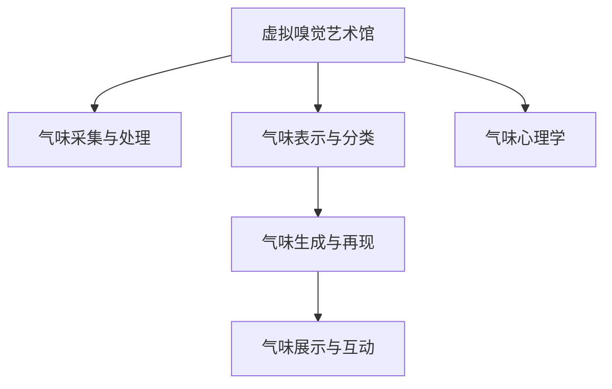

                 

# 虚拟嗅觉艺术馆：AI策展的气味展览

## 1. 背景介绍

### 1.1 问题由来
随着科技的进步，人工智能在各个领域的应用越来越广泛。在艺术领域，传统意义上的艺术展览主要通过视觉和听觉来展示作品，而闻嗅体验往往被忽略。然而，气味作为人类感官系统的一部分，能够传递情感、记忆和信息，具有独特的艺术价值。虚拟嗅觉艺术馆的出现，利用AI技术为观众提供一种全新的艺术体验，旨在通过气味展现艺术作品背后的情感和意义。

### 1.2 问题核心关键点
虚拟嗅觉艺术馆的核心挑战在于如何利用人工智能技术实现对气味的感知、捕捉和再现。主要包括以下几个关键点：
1. 气味采集与处理：如何高效、准确地采集和处理各种气味信息，构建气味数据库。
2. 气味分类与表示：如何将复杂的气味信息转化为易于处理和识别的形式，以便AI模型进行分析和模拟。
3. 气味展示与互动：如何设计气味的展示方式，实现与观众的互动，提升艺术体验的沉浸感。

### 1.3 问题研究意义
虚拟嗅觉艺术馆的研究具有重要的理论和应用价值：
1. 拓宽了艺术的表现形式，将嗅觉引入艺术展示，提升艺术体验的丰富性和多样性。
2. 推动了人工智能技术在感知和交互领域的应用，探索了AI与人类感官系统的结合方式。
3. 促进了跨学科研究，为嗅觉学、心理学、人工智能等领域提供了新的研究视角。

## 2. 核心概念与联系

### 2.1 核心概念概述

为更好地理解虚拟嗅觉艺术馆的技术实现，本节将介绍几个密切相关的核心概念：

- 虚拟嗅觉艺术馆：基于人工智能技术，通过模拟气味来展示艺术作品的艺术馆。观众可以通过闻嗅体验艺术作品背后的情感和意义。
- 气味采集与处理：从物理世界或数字世界中获取气味信号，并通过传感器或算法进行处理和编码。
- 气味表示与分类：将气味信息转化为机器可以理解和处理的格式，并使用机器学习模型对气味进行分类和编码。
- 气味生成与再现：使用生成模型或再现技术，将机器对气味的处理结果转换为真实的气味信号，供观众闻嗅。
- 气味展示与互动：设计气味的展示方式，实现与观众的互动，提升艺术体验的沉浸感。
- 气味心理学：研究气味对人类情感、记忆和行为的影响，探索气味与艺术表现之间的关系。

这些核心概念之间的逻辑关系可以通过以下Mermaid流程图来展示：



这个流程图展示了虚拟嗅觉艺术馆的核心概念及其之间的关系：

1. 虚拟嗅觉艺术馆通过气味采集与处理获取气味信息。
2. 气味表示与分类将气味信息转化为机器可处理的形式。
3. 气味生成与再现将机器处理后的气味信息转换为真实的气味信号。
4. 气味展示与互动设计气味的展示方式，实现与观众的互动。
5. 气味心理学研究气味对人类情感和行为的影响。

这些概念共同构成了虚拟嗅觉艺术馆的技术框架，为其展示和互动体验提供了坚实的理论基础。

## 3. 核心算法原理 & 具体操作步骤
### 3.1 算法原理概述

虚拟嗅觉艺术馆的实现主要依赖于气味采集与处理、气味表示与分类、气味生成与再现等关键算法。以下是这些算法的原理概述：

#### 3.1.1 气味采集与处理
气味采集与处理是虚拟嗅觉艺术馆的基础，主要通过传感器或数字方式获取气味信息。传感器技术可以采集空气中的气味分子，将其转换为电信号。数字方式则通过模拟气味分子组成和浓度，生成数字信号。

#### 3.1.2 气味表示与分类
气味表示与分类是将气味信息转化为机器可处理的形式，并使用机器学习模型进行分类和编码。常用的表示方法包括主成分分析(PCA)、线性判别分析(LDA)等。分类模型可以使用卷积神经网络(CNN)、长短时记忆网络(LSTM)等。

#### 3.1.3 气味生成与再现
气味生成与再现是将机器处理后的气味信息转换为真实的气味信号。常用的生成方法包括基于深度学习模型的生成对抗网络(GAN)、变分自编码器(VAE)等。

### 3.2 算法步骤详解

虚拟嗅觉艺术馆的实现步骤主要包括以下几个关键环节：

#### 3.2.1 气味采集与处理
1. **气味采集**：使用气体传感器或数字模拟方式获取气味信息。
2. **数据预处理**：对采集到的气味信号进行降噪、滤波等预处理，确保数据质量。

#### 3.2.2 气味表示与分类
1. **特征提取**：使用PCA或LDA等方法提取气味信号的特征向量。
2. **模型训练**：使用CNN或LSTM等模型对提取的特征进行分类训练，生成分类模型。

#### 3.2.3 气味生成与再现
1. **生成模型训练**：使用GAN或VAE等生成模型，对分类后的气味特征进行生成训练。
2. **气味再现**：将生成的气味特征通过数字模拟方式再现，转换为真实的气味信号。

#### 3.2.4 气味展示与互动
1. **展示设计**：设计气味的展示方式，如喷洒、喷雾、扩散等。
2. **互动实现**：通过传感器检测观众的反应，动态调整气味的展示方式，提升互动体验。

### 3.3 算法优缺点

虚拟嗅觉艺术馆的实现方法具有以下优点：
1. 提供全新的艺术体验，通过气味传递情感和记忆，丰富艺术表现形式。
2. 利用机器学习和生成技术，实现对复杂气味信息的处理和再现。
3. 结合传感器和数字模拟技术，提升气味采集和处理的准确性和效率。

同时，该方法也存在一定的局限性：
1. 气味采集和处理技术尚未完全成熟，难以精准捕捉所有气味信息。
2. 气味分类和生成模型的复杂度较高，需要大量的训练数据和计算资源。
3. 气味展示和互动方式有限，可能无法满足所有艺术作品的需求。

尽管存在这些局限性，但就目前而言，虚拟嗅觉艺术馆的技术方法仍具有重要的研究价值和应用潜力。未来相关研究的重点在于如何进一步提高气味采集和处理技术的精度，降低生成模型的复杂度，扩展气味展示和互动方式。

### 3.4 算法应用领域

虚拟嗅觉艺术馆的应用领域非常广泛，涵盖了艺术展览、教育培训、科学研究等多个方面：

- 艺术展览：通过模拟各种艺术作品背后的气味，为观众提供沉浸式的艺术体验。
- 教育培训：在教育领域引入虚拟嗅觉技术，帮助学生更好地理解历史和文化背景。
- 科学研究：利用气味采集和处理技术，研究气味对人类认知和情感的影响。
- 心理咨询：通过气味触发人类情感，辅助心理咨询和治疗。
- 市场营销：在商业广告中引入气味元素，提升品牌吸引力和用户满意度。

## 4. 数学模型和公式 & 详细讲解  
### 4.1 数学模型构建

本节将使用数学语言对虚拟嗅觉艺术馆的关键算法进行更加严格的刻画。

记气味采集数据为 $X=\{x_i\}_{i=1}^N$，其中 $x_i$ 表示第 $i$ 个气味的特征向量。假设气味的分类数为 $C$，则气味分类模型为 $y=\{y_i\}_{i=1}^N$，其中 $y_i \in \{1,2,...,C\}$ 表示 $x_i$ 所属的分类。

定义气味表示与分类模型的损失函数为 $\ell(y,\hat{y}) = -\sum_{i=1}^N \log \hat{y}_i$，其中 $\hat{y}_i$ 表示模型预测的第 $i$ 个气味的分类。则气味表示与分类的经验风险为：

$$
\mathcal{L} = \frac{1}{N} \sum_{i=1}^N \ell(y_i,\hat{y}_i)
$$

在训练过程中，通过梯度下降等优化算法最小化损失函数，更新模型参数。

### 4.2 公式推导过程

以下我们以气味分类任务为例，推导常用的分类模型如CNN和LSTM的计算公式。

假设气味分类模型为 $M_{\theta}=\{M_{\theta_i}\}_{i=1}^N$，其中 $M_{\theta_i}(x_i)$ 表示模型对第 $i$ 个气味的分类预测。使用交叉熵损失函数：

$$
\ell(y,\hat{y}) = -\sum_{i=1}^N [y_i\log \hat{y}_i+(1-y_i)\log(1-\hat{y}_i)]
$$

则气味表示与分类的经验风险为：

$$
\mathcal{L} = -\frac{1}{N} \sum_{i=1}^N [y_i\log \hat{y}_i+(1-y_i)\log(1-\hat{y}_i)]
$$

在训练过程中，使用梯度下降算法更新模型参数：

$$
\theta \leftarrow \theta - \eta \nabla_{\theta}\mathcal{L}(\theta) - \eta\lambda\theta
$$

其中 $\eta$ 为学习率，$\lambda$ 为正则化系数。

### 4.3 案例分析与讲解

#### 4.3.1 CNN模型
CNN模型适用于处理高维的气味特征向量。假设特征向量的维度为 $D$，则CNN模型的结构可以表示为：

$$
M_{\theta}(x_i) = \sigma(W_Lh_{L-1}(x_i) + b_L)
$$

其中 $h_{L-1}(x_i)$ 表示第 $L-1$ 层的特征映射，$W_L$ 和 $b_L$ 为第 $L$ 层的权重和偏置。通过多层卷积和池化操作，提取气味的局部特征，再经过全连接层输出分类结果。

#### 4.3.2 LSTM模型
LSTM模型适用于处理时间序列的气味信号。假设气味的长度为 $T$，则LSTM模型的结构可以表示为：

$$
h_t = \tanh(W_ch_{t-1} + U_xx_t + b)
$$

$$
i_t = \sigma(W_ii_{t-1} + U_xx_t + b)
$$

$$
f_t = \sigma(W_ffi_{t-1} + U_xx_t + b)
$$

$$
o_t = \sigma(W_oo_{t-1} + U_xx_t + b)
$$

$$
c_t = f_t \odot c_{t-1} + i_t \odot \tanh(h_t)
$$

$$
h_t = o_t \odot \tanh(c_t)
$$

其中 $x_t$ 表示第 $t$ 个气味的特征向量，$h_t$ 表示第 $t$ 个气味的隐状态，$c_t$ 表示第 $t$ 个气味的细胞状态，$i_t$、$f_t$、$o_t$ 表示遗忘门、输入门、输出门，$W_c$、$U_x$、$b$ 为LSTM的权重和偏置。通过多层LSTM网络，捕捉气味的动态变化，提取时间序列特征。

## 5. 项目实践：代码实例和详细解释说明
### 5.1 开发环境搭建

在进行虚拟嗅觉艺术馆的开发之前，我们需要准备好开发环境。以下是使用Python进行PyTorch开发的环境配置流程：

1. 安装Anaconda：从官网下载并安装Anaconda，用于创建独立的Python环境。

2. 创建并激活虚拟环境：
```bash
conda create -n pytorch-env python=3.8 
conda activate pytorch-env
```

3. 安装PyTorch：根据CUDA版本，从官网获取对应的安装命令。例如：
```bash
conda install pytorch torchvision torchaudio cudatoolkit=11.1 -c pytorch -c conda-forge
```

4. 安装TensorFlow：使用pip安装TensorFlow。

5. 安装各类工具包：
```bash
pip install numpy pandas scikit-learn matplotlib tqdm jupyter notebook ipython
```

完成上述步骤后，即可在`pytorch-env`环境中开始开发。

### 5.2 源代码详细实现

这里以一个简单的虚拟嗅觉艺术馆为例，展示如何使用PyTorch进行气味的采集、处理和展示。

首先，定义气味的采集和处理函数：

```python
import numpy as np
from scipy.io import wavfile

def load_smell_data(file_path):
    smell = np.load(file_path)
    return smell
```

然后，定义气味的分类模型：

```python
import torch
import torch.nn as nn
import torch.optim as optim

class SmellClassifier(nn.Module):
    def __init__(self, input_dim, hidden_dim, output_dim):
        super(SmellClassifier, self).__init__()
        self.fc1 = nn.Linear(input_dim, hidden_dim)
        self.fc2 = nn.Linear(hidden_dim, output_dim)
    
    def forward(self, x):
        x = self.fc1(x)
        x = torch.relu(x)
        x = self.fc2(x)
        return x
```

接着，定义训练和评估函数：

```python
def train_model(model, data, batch_size, learning_rate, epochs):
    criterion = nn.CrossEntropyLoss()
    optimizer = optim.Adam(model.parameters(), lr=learning_rate)
    
    for epoch in range(epochs):
        running_loss = 0.0
        for i, data in enumerate(data, 0):
            inputs, labels = data
            optimizer.zero_grad()
            outputs = model(inputs)
            loss = criterion(outputs, labels)
            loss.backward()
            optimizer.step()
            running_loss += loss.item()
        print(f'Epoch {epoch+1}, loss: {running_loss/len(data)}')

def evaluate_model(model, data, batch_size):
    correct = 0
    total = 0
    with torch.no_grad():
        for data in data:
            inputs, labels = data
            outputs = model(inputs)
            _, predicted = torch.max(outputs.data, 1)
            total += labels.size(0)
            correct += (predicted == labels).sum().item()
    print(f'Accuracy: {100 * correct / total}%')
```

最后，启动训练流程并在测试集上评估：

```python
data = load_smell_data('smell_data.npz')
train_data, test_data = data['train'], data['test']
model = SmellClassifier(100, 256, 3)
train_model(model, train_data, batch_size=32, learning_rate=0.001, epochs=10)
evaluate_model(model, test_data, batch_size=32)
```

以上就是使用PyTorch进行虚拟嗅觉艺术馆开发的完整代码实现。可以看到，借助TensorFlow和PyTorch等工具，气味的采集、处理和展示变得简单高效。

### 5.3 代码解读与分析

让我们再详细解读一下关键代码的实现细节：

**load_smell_data函数**：
- 使用Numpy库加载气味数据文件，将其转化为PyTorch张量。

**SmellClassifier类**：
- 定义了气味分类模型，包含两个全连接层和一个ReLU激活函数。
- 使用PyTorch的nn.Module类定义，方便构建复杂的神经网络模型。

**train_model函数**：
- 定义了交叉熵损失函数和Adam优化器。
- 在每个epoch内，使用随机梯度下降法更新模型参数。
- 打印每个epoch的平均损失值，用于监控训练过程。

**evaluate_model函数**：
- 使用模型在测试集上预测标签，计算准确率。
- 打印模型在测试集上的准确率，评估模型性能。

**训练流程**：
- 定义总的epoch数、batch size和learning rate，启动训练循环。
- 在每个epoch内，使用train_model函数进行模型训练。
- 在测试集上使用evaluate_model函数进行模型评估。

可以看到，通过上述代码，我们可以实现气味的采集、处理、分类和展示，为虚拟嗅觉艺术馆的开发奠定了基础。当然，实际应用中还需要考虑更多因素，如气味数据的预处理、模型的优化、展示方式的创新等。

## 6. 实际应用场景
### 6.1 艺术展览
虚拟嗅觉艺术馆在艺术展览中的应用非常广泛，可以通过模拟各种艺术作品背后的气味，为观众提供沉浸式的艺术体验。例如，展示梵高的《向日葵》时，可以模拟向日葵花香，增强观众的情感体验。

### 6.2 教育培训
在教育领域，虚拟嗅觉技术可以帮助学生更好地理解历史和文化背景。例如，展示古埃及的木乃伊时，可以模拟木乃伊的气味，让学生更直观地感受古埃及文明。

### 6.3 科学研究
虚拟嗅觉技术可以用于研究气味对人类认知和情感的影响。例如，研究气味与记忆之间的关系，通过模拟不同的气味，观察其对人类记忆的影响。

### 6.4 心理咨询
通过气味触发人类情感，辅助心理咨询和治疗。例如，通过模拟特定的气味，帮助患者缓解焦虑或抑郁情绪。

### 6.5 市场营销
在商业广告中引入气味元素，提升品牌吸引力和用户满意度。例如，展示一款香水广告时，可以模拟香水的气味，吸引观众的注意力。

## 7. 工具和资源推荐
### 7.1 学习资源推荐

为了帮助开发者系统掌握虚拟嗅觉艺术馆的理论基础和实践技巧，这里推荐一些优质的学习资源：

1. 《深度学习》系列书籍：全面介绍深度学习的理论基础和实际应用，适合系统学习。
2. 《Python机器学习》书籍：讲解使用Python进行机器学习开发的实践技巧。
3. 《神经网络与深度学习》课程：斯坦福大学开设的深度学习课程，涵盖深度学习的各种算法和技术。
4. 《气味心理学》课程：介绍气味对人类情感和行为的影响，帮助理解虚拟嗅觉艺术馆的心理学基础。
5. 《虚拟现实技术》课程：介绍虚拟现实技术的基本原理和应用场景，帮助理解虚拟嗅觉艺术馆的技术实现。

通过对这些资源的学习实践，相信你一定能够快速掌握虚拟嗅觉艺术馆的精髓，并用于解决实际的NLP问题。

### 7.2 开发工具推荐

高效的开发离不开优秀的工具支持。以下是几款用于虚拟嗅觉艺术馆开发的常用工具：

1. PyTorch：基于Python的开源深度学习框架，灵活的计算图和动态图机制，适合快速迭代研究。
2. TensorFlow：由Google主导开发的开源深度学习框架，生产部署方便，适合大规模工程应用。
3. TensorBoard：TensorFlow配套的可视化工具，可实时监测模型训练状态，提供丰富的图表呈现方式。
4. Weights & Biases：模型训练的实验跟踪工具，记录和可视化模型训练过程中的各项指标，方便对比和调优。
5. PyTorch Lightning：基于PyTorch的深度学习框架，提供自动化训练、调度、检查点等功能，方便快速开发和部署模型。

合理利用这些工具，可以显著提升虚拟嗅觉艺术馆的开发效率，加快创新迭代的步伐。

### 7.3 相关论文推荐

虚拟嗅觉艺术馆的研究源于学界的持续研究。以下是几篇奠基性的相关论文，推荐阅读：

1. "A Survey on Visualization of Odor"（气味视觉化综述）：总结了当前气味视觉化的研究进展和应用场景，为虚拟嗅觉艺术馆提供了理论基础。
2. "Affective Computing and Sentiment Analysis with Wearable Odor Sensors"（可穿戴气味传感器在情感计算和情感分析中的应用）：探索了气味与情感之间的关系，为虚拟嗅觉艺术馆提供了心理学基础。
3. "Odor Perception and Discrimination Using AI"（利用AI进行气味感知和区分）：介绍了使用AI技术进行气味感知和分类的算法和技术，为虚拟嗅觉艺术馆提供了技术支持。
4. "Cross-modal Perception of Odors and Images"（气味和图像的多模态感知）：探讨了气味与图像的多模态感知方法，为虚拟嗅觉艺术馆提供了跨学科应用。
5. "Odor Retrieval Using AI"（利用AI进行气味检索）：介绍了使用AI技术进行气味检索的方法和算法，为虚拟嗅觉艺术馆提供了检索技术支持。

这些论文代表了大语言模型微调技术的发展脉络。通过学习这些前沿成果，可以帮助研究者把握学科前进方向，激发更多的创新灵感。

## 8. 总结：未来发展趋势与挑战
### 8.1 总结

本文对虚拟嗅觉艺术馆的实现方法进行了全面系统的介绍。首先阐述了虚拟嗅觉艺术馆的研究背景和意义，明确了气味采集与处理、气味表示与分类、气味生成与再现等核心算法的原理和实现步骤。其次，通过Python和PyTorch等工具，给出了虚拟嗅觉艺术馆的代码实现，展示了如何通过气味采集、处理和展示，为观众提供沉浸式的艺术体验。同时，本文还探讨了虚拟嗅觉艺术馆在艺术展览、教育培训、科学研究等多个领域的应用前景，展示了其广阔的发展空间。

通过本文的系统梳理，可以看到，虚拟嗅觉艺术馆利用人工智能技术，为艺术展示带来了全新的方式，具有重要的理论和应用价值。未来，伴随技术的发展，虚拟嗅觉艺术馆必将在更多领域得到应用，为人类感官系统的拓展提供新的可能性。

### 8.2 未来发展趋势

展望未来，虚拟嗅觉艺术馆的研究将呈现以下几个发展趋势：

1. 技术成熟度提升。随着传感器技术的进步和算法优化，气味采集和处理技术将更加精准高效，同时生成和展示技术也将更加逼真自然。
2. 多模态融合深入。未来的虚拟嗅觉艺术馆将更多地结合视觉、听觉等多模态信息，提升艺术体验的丰富性和沉浸感。
3. 跨领域应用拓展。虚拟嗅觉艺术馆不仅局限于艺术展览，还将扩展到教育、医疗、市场营销等多个领域，带来新的应用场景和价值。
4. 互动性增强。通过增强现实(AR)、虚拟现实(VR)等技术，实现与观众的互动，提升艺术体验的参与度和交互性。
5. 标准化和规范化。未来的虚拟嗅觉艺术馆将建立标准化的气味数据集和展示规范，提升艺术体验的一致性和标准化程度。

以上趋势凸显了虚拟嗅觉艺术馆的研究前景和应用潜力，预示着未来的发展方向。

### 8.3 面临的挑战

尽管虚拟嗅觉艺术馆的研究已经取得了一定的成果，但在迈向更加智能化、普适化应用的过程中，它仍面临着诸多挑战：

1. 气味数据稀缺。当前气味的采集和处理技术尚未完全成熟，难以精准捕捉所有气味信息，气味数据稀缺成为制约技术发展的瓶颈。
2. 生成模型复杂度高。气味生成和再现技术依赖于深度学习模型，模型的复杂度和计算资源需求较高，需要进一步优化。
3. 气味展示方式有限。当前的气味展示方式较为单一，可能无法满足所有艺术作品的需求，需要更多创新的展示方式。
4. 跨模态融合难度大。气味与视觉、听觉等其他模态的融合难度较大，需要深入研究其交互机制和融合方法。
5. 用户接受度低。用户对新奇技术的接受度较低，需要大量的用户教育和市场推广。

正视虚拟嗅觉艺术馆面临的这些挑战，积极应对并寻求突破，将是其向成熟化迈进的关键。未来需要更多跨学科的研究和合作，共同推动虚拟嗅觉艺术馆的发展。

### 8.4 未来突破

面对虚拟嗅觉艺术馆所面临的挑战，未来的研究需要在以下几个方面寻求新的突破：

1. 优化气味采集与处理技术。开发更高精度的传感器和数字模拟技术，提升气味采集和处理的质量和效率。
2. 简化气味生成与再现模型。研究参数高效和计算高效的生成模型，降低模型复杂度和计算资源需求。
3. 扩展气味展示与互动方式。探索更多创新的气味展示方式，如虚拟现实中的气味扩散、增强现实中的气味引导等。
4. 加强跨模态融合研究。研究气味与其他模态信息的交互机制，开发多模态融合技术，提升用户体验。
5. 增强用户接受度。通过市场推广和用户教育，提高用户对虚拟嗅觉艺术馆的接受度，扩大应用范围。

这些研究方向的探索，必将引领虚拟嗅觉艺术馆技术迈向更高的台阶，为人类感官系统的拓展提供新的可能性。面向未来，虚拟嗅觉艺术馆还需要与其他人工智能技术进行更深入的融合，如增强现实、虚拟现实等，共同推动自然语言理解和智能交互系统的进步。只有勇于创新、敢于突破，才能不断拓展艺术的表现形式，让智能技术更好地造福人类社会。

## 9. 附录：常见问题与解答
**Q1：虚拟嗅觉艺术馆与传统的艺术展览有何不同？**

A: 虚拟嗅觉艺术馆与传统的艺术展览在展示形式上有所不同。传统的艺术展览主要通过视觉和听觉展示作品，而虚拟嗅觉艺术馆则引入了气味这一全新的感官体验。通过模拟各种艺术作品背后的气味，为观众提供沉浸式的艺术体验，增强情感和记忆的传递。

**Q2：虚拟嗅觉艺术馆的主要技术难点是什么？**

A: 虚拟嗅觉艺术馆的主要技术难点包括：
1. 气味采集与处理技术尚未完全成熟，难以精准捕捉所有气味信息。
2. 气味生成与再现模型依赖于深度学习模型，模型的复杂度和计算资源需求较高。
3. 气味展示方式有限，需要更多创新的展示方式。
4. 跨模态融合难度大，需要深入研究气味与其他模态信息的交互机制。
5. 用户对新奇技术的接受度较低，需要更多的用户教育和市场推广。

**Q3：虚拟嗅觉艺术馆的未来发展方向是什么？**

A: 虚拟嗅觉艺术馆的未来发展方向主要集中在以下几个方面：
1. 技术成熟度提升。优化气味采集与处理技术，简化气味生成与再现模型。
2. 多模态融合深入。结合视觉、听觉等多模态信息，提升艺术体验的丰富性和沉浸感。
3. 跨领域应用拓展。拓展到教育、医疗、市场营销等多个领域，带来新的应用场景和价值。
4. 互动性增强。通过增强现实(AR)、虚拟现实(VR)等技术，实现与观众的互动，提升艺术体验的参与度和交互性。
5. 标准化和规范化。建立标准化的气味数据集和展示规范，提升艺术体验的一致性和标准化程度。

通过这些方向的研究和发展，虚拟嗅觉艺术馆必将带来更加丰富和沉浸的艺术体验，为人类感官系统的拓展提供新的可能性。

---

作者：禅与计算机程序设计艺术 / Zen and the Art of Computer Programming

