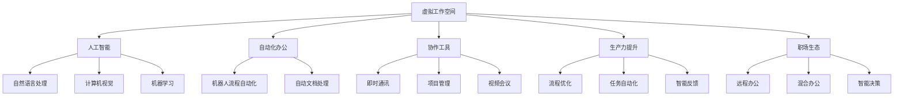

                 

# 虚拟工作空间：AI时代的职场革命

> 关键词：虚拟办公室, 人工智能, 自动化, 协作工具, 生产力提升, 职场生态

## 1. 背景介绍

### 1.1 问题由来

随着人工智能技术的飞速发展，虚拟工作空间（Virtual Workspaces）逐渐成为企业应对现代职场新常态的重要手段。无论是远程工作、混合办公，还是高度自动化的生产环境，人工智能技术在优化办公效率、提升员工生产力、重塑职场生态等方面都展现出巨大潜力。虚拟工作空间的构建，不仅改变了传统的工作模式，也催生了全新的协作方式和产业生态。

### 1.2 问题核心关键点

- **远程工作普及**：全球疫情加速了远程办公的普及，人工智能技术在此背景下助力企业构建高效、灵活的虚拟工作环境。
- **自动化办公**：通过智能化的办公软件和协作工具，AI能自动化处理大量重复性任务，解放员工精力，提高工作效率。
- **数据驱动决策**：AI驱动的实时数据分析能力，帮助企业洞察市场变化、优化资源配置，提升决策质量。
- **智能协作**：AI技术在语音识别、自然语言处理、机器学习等领域的突破，支持更高效的团队协作和知识共享。

### 1.3 问题研究意义

虚拟工作空间的AI革命，对于提升企业竞争力、优化人力资源配置、改善员工工作体验具有重要意义：

1. **效率提升**：AI驱动的自动化和智能化工具，减少了繁琐的日常工作，让员工能专注于更有创造性的任务。
2. **成本节约**：减少了办公空间、设备和人员成本，使得小型企业也能拥有与大企业相当的竞争力。
3. **灵活应对**：AI技术使得企业能够快速适应市场变化和员工需求，增强组织的弹性和适应性。
4. **安全保障**：AI监控和分析能力，能够有效预防网络安全威胁，保护企业数据和隐私。
5. **员工赋能**：通过智能化的培训和反馈系统，提升员工技能和满意度，促进团队协作和创新。

## 2. 核心概念与联系

### 2.1 核心概念概述

为更好地理解虚拟工作空间的AI革命，本节将介绍几个密切相关的核心概念：

- **虚拟工作空间（Virtual Workspace）**：通过网络技术，构建的一种虚拟化的办公环境，支持远程办公、混合办公等多种模式。
- **人工智能（Artificial Intelligence, AI）**：模拟人类智能过程，使机器能够执行需要人类智能的任务，包括但不限于自然语言处理、计算机视觉、机器学习等。
- **自动化办公（Automated Office）**：通过AI和机器人流程自动化（RPA）技术，自动化处理办公中的各种任务，提升办公效率。
- **协作工具（Collaboration Tools）**：支持团队协作和信息共享的数字化工具，如Slack、Teams等。
- **生产力提升（Productivity Improvement）**：通过优化流程和工具，提升员工的工作效率和质量。
- **职场生态（Workplace Ecosystem）**：由人、技术、流程等多种要素构成的虚拟职场生态系统。

这些核心概念之间的逻辑关系可以通过以下Mermaid流程图来展示：



这个流程图展示了几大核心概念及其之间的关联：

1. 虚拟工作空间通过人工智能技术进行辅助，提升自动化办公和协作工具的功能。
2. 自动化办公和协作工具支持生产力提升，进一步优化职场生态。
3. 生产力提升依赖于自然语言处理、计算机视觉、机器学习等技术支撑。
4. 职场生态涵盖了远程办公、混合办公、智能决策等多种模式，通过技术手段不断优化。

这些概念共同构成了虚拟工作空间AI革命的框架，使得AI技术能够更好地融入到现代职场中，助力企业实现数字化转型。

## 3. 核心算法原理 & 具体操作步骤
### 3.1 算法原理概述

虚拟工作空间的AI革命，本质上是一个通过人工智能技术优化办公环境、提升生产力的过程。其核心思想是：

1. **数据驱动**：利用人工智能技术处理和分析海量办公数据，洞察业务流程中的瓶颈和优化点。
2. **自动化处理**：通过机器人流程自动化技术，自动化处理重复性和低价值的任务，提升办公效率。
3. **智能协作**：使用自然语言处理和机器学习技术，支持智能化的沟通和协作，提升团队生产力。
4. **动态决策**：通过数据分析和机器学习模型，支持实时决策和问题解决，增强组织的灵活性。

### 3.2 算法步骤详解

基于虚拟工作空间的AI革命，一般包括以下几个关键步骤：

**Step 1: 数据采集与分析**

- 收集企业内部的办公数据，包括邮件、文档、会议记录等。
- 使用自然语言处理技术对文本进行清洗和结构化，提取关键信息。
- 应用机器学习算法分析数据模式，识别出高价值和高风险的业务领域。

**Step 2: 自动化办公流程**

- 基于数据分析结果，设计自动化流程，减少人工干预。
- 使用机器人流程自动化（RPA）工具，自动化处理常规任务，如数据录入、报表生成等。
- 集成AI驱动的自动化工具，如智能文档处理、邮件分类等，提升办公效率。

**Step 3: 智能协作平台**

- 构建基于AI的协作工具，支持即时通讯、项目管理、视频会议等功能。
- 使用自然语言处理技术，支持智能化的内容检索和知识推荐，提升信息共享效率。
- 应用机器学习算法，个性化推荐任务和协作伙伴，促进团队协作。

**Step 4: 实时决策与反馈**

- 构建实时数据分析平台，监测关键业务指标和员工绩效。
- 应用机器学习模型，预测业务趋势和员工需求，支持动态资源配置。
- 设置智能反馈机制，及时调整办公策略和流程，提升整体生产力。

**Step 5: 持续优化与学习**

- 定期收集反馈数据，评估AI技术的应用效果。
- 根据反馈结果，持续优化和迭代AI模型和办公流程。
- 引入深度学习等高级技术，增强AI系统的自适应能力和学习能力。

以上是虚拟工作空间的AI革命的一般流程。在实际应用中，还需要针对具体场景和需求，对各个环节进行优化设计和持续改进，以进一步提升办公效率和员工满意度。

### 3.3 算法优缺点

虚拟工作空间的AI革命具有以下优点：

1. **效率提升**：自动化和智能化技术大幅减少了人工操作，提高了办公效率。
2. **成本降低**：减少了办公空间、设备和人力资源的投入，降低了运营成本。
3. **灵活应对**：AI技术能快速响应市场变化和员工需求，提高组织的适应性。
4. **数据驱动**：通过数据驱动决策，提高了业务决策的科学性和准确性。
5. **协作优化**：智能化的协作工具和内容推荐，增强了团队协作和信息共享。

同时，该方法也存在一定的局限性：

1. **技术复杂**：构建和维护AI系统需要较高的技术门槛，企业需投入较多的资源。
2. **隐私风险**：大量数据的集中处理可能带来隐私和数据安全问题，需严格遵守数据保护法规。
3. **用户习惯**：部分员工可能对新技术适应不良，影响AI系统的推广和应用。
4. **依赖数据**：AI系统的性能高度依赖于数据的质量和数量，需持续采集和更新数据。
5. **技术局限**：当前的AI技术尚未完全解决复杂场景下的问题，仍需不断迭代和优化。

尽管存在这些局限性，但就目前而言，基于AI的虚拟工作空间仍然是一种高效、灵活的办公模式，对于提升企业竞争力具有重要意义。未来相关研究将继续探索如何在技术、伦理、成本等多方面进行平衡，以实现更加成熟和普及的AI驱动办公环境。

### 3.4 算法应用领域

虚拟工作空间的AI革命，在多个领域都得到了广泛的应用，例如：

- **远程办公**：通过AI驱动的协作工具和自动化流程，支持全球员工高效协同工作。
- **混合办公**：结合线下和线上办公环境，通过AI技术优化资源配置，提升办公体验。
- **生产自动化**：在制造业、服务业等实体经济领域，通过机器人流程自动化，提升生产效率。
- **知识管理**：利用AI技术对企业知识进行结构化和智能推荐，促进知识共享和创新。
- **智能决策**：通过实时数据分析和预测模型，辅助高层决策和管理，优化企业战略。

除了上述这些经典应用外，AI技术还在更多领域展现出其变革性影响，如智慧城市、健康医疗、教育培训等，为各行各业带来了新的机遇和挑战。

## 4. 数学模型和公式 & 详细讲解 & 举例说明

### 4.1 数学模型构建

本节将使用数学语言对虚拟工作空间的AI革命过程进行更加严格的刻画。

记办公数据集为 $D=\{(x_i,y_i)\}_{i=1}^N, x_i \in \mathcal{X}, y_i \in \mathcal{Y}$，其中 $\mathcal{X}$ 为输入空间，$\mathcal{Y}$ 为输出空间。假设AI系统用于优化某一业务指标 $K$，则优化目标为：

$$
\min_{\theta} \sum_{i=1}^N \ell(x_i, y_i, K)
$$

其中 $\ell(x_i, y_i, K)$ 为损失函数，用于衡量数据和指标之间的差异。常见的损失函数包括均方误差、交叉熵等。

### 4.2 公式推导过程

以下我们以基于机器学习的自动化办公流程为例，推导优化目标函数及其梯度的计算公式。

假设AI系统对一项任务 $T$ 进行自动化处理，通过分析历史数据，建立模型 $M_{\theta}:\mathcal{X} \rightarrow \mathcal{Y}$，其中 $\mathcal{X}$ 为输入空间，$\mathcal{Y}$ 为输出空间，$\theta \in \mathbb{R}^d$ 为模型参数。优化目标为最小化任务完成率与理想值的差异：

$$
\mathcal{L}(\theta) = \sum_{i=1}^N \ell(M_{\theta}(x_i), y_i)
$$

其中 $\ell(M_{\theta}(x_i), y_i)$ 为任务完成率与理想值的差异，$\ell$ 为损失函数。

根据链式法则，损失函数对参数 $\theta_k$ 的梯度为：

$$
\frac{\partial \mathcal{L}(\theta)}{\partial \theta_k} = \sum_{i=1}^N \frac{\partial \ell(M_{\theta}(x_i), y_i)}{\partial \theta_k}
$$

其中 $\frac{\partial \ell(M_{\theta}(x_i), y_i)}{\partial \theta_k}$ 可进一步递归展开，利用自动微分技术完成计算。

在得到损失函数的梯度后，即可带入参数更新公式，完成模型的迭代优化。重复上述过程直至收敛，最终得到适应特定业务指标的最优模型参数 $\theta^*$。

## 5. 项目实践：代码实例和详细解释说明

### 5.1 开发环境搭建

在进行AI驱动的虚拟工作空间实践前，我们需要准备好开发环境。以下是使用Python进行PyTorch开发的环境配置流程：

1. 安装Anaconda：从官网下载并安装Anaconda，用于创建独立的Python环境。

2. 创建并激活虚拟环境：
```bash
conda create -n pytorch-env python=3.8 
conda activate pytorch-env
```

3. 安装PyTorch：根据CUDA版本，从官网获取对应的安装命令。例如：
```bash
conda install pytorch torchvision torchaudio cudatoolkit=11.1 -c pytorch -c conda-forge
```

4. 安装各类工具包：
```bash
pip install numpy pandas scikit-learn matplotlib tqdm jupyter notebook ipython
```

完成上述步骤后，即可在`pytorch-env`环境中开始开发实践。

### 5.2 源代码详细实现

这里我们以智能协作平台为例，给出使用PyTorch进行AI协作平台开发的PyTorch代码实现。

首先，定义协作平台的数据处理函数：

```python
import torch
from torch.utils.data import Dataset
from transformers import BertTokenizer

class CollaborationDataset(Dataset):
    def __init__(self, texts, labels, tokenizer, max_len=128):
        self.texts = texts
        self.labels = labels
        self.tokenizer = tokenizer
        self.max_len = max_len
        
    def __len__(self):
        return len(self.texts)
    
    def __getitem__(self, item):
        text = self.texts[item]
        label = self.labels[item]
        
        encoding = self.tokenizer(text, return_tensors='pt', max_length=self.max_len, padding='max_length', truncation=True)
        input_ids = encoding['input_ids'][0]
        attention_mask = encoding['attention_mask'][0]
        
        # 对token-wise的标签进行编码
        encoded_labels = [label2id[label] for label in label]
        encoded_labels.extend([label2id['O']] * (self.max_len - len(encoded_labels)))
        labels = torch.tensor(encoded_labels, dtype=torch.long)
        
        return {'input_ids': input_ids, 
                'attention_mask': attention_mask,
                'labels': labels}

# 标签与id的映射
label2id = {'O': 0, 'C': 1}
id2label = {v: k for k, v in label2id.items()}

# 创建dataset
tokenizer = BertTokenizer.from_pretrained('bert-base-cased')

train_dataset = CollaborationDataset(train_texts, train_labels, tokenizer)
dev_dataset = CollaborationDataset(dev_texts, dev_labels, tokenizer)
test_dataset = CollaborationDataset(test_texts, test_labels, tokenizer)
```

然后，定义模型和优化器：

```python
from transformers import BertForTokenClassification, AdamW

model = BertForTokenClassification.from_pretrained('bert-base-cased', num_labels=len(label2id))

optimizer = AdamW(model.parameters(), lr=2e-5)
```

接着，定义训练和评估函数：

```python
from torch.utils.data import DataLoader
from tqdm import tqdm
from sklearn.metrics import classification_report

device = torch.device('cuda') if torch.cuda.is_available() else torch.device('cpu')
model.to(device)

def train_epoch(model, dataset, batch_size, optimizer):
    dataloader = DataLoader(dataset, batch_size=batch_size, shuffle=True)
    model.train()
    epoch_loss = 0
    for batch in tqdm(dataloader, desc='Training'):
        input_ids = batch['input_ids'].to(device)
        attention_mask = batch['attention_mask'].to(device)
        labels = batch['labels'].to(device)
        model.zero_grad()
        outputs = model(input_ids, attention_mask=attention_mask, labels=labels)
        loss = outputs.loss
        epoch_loss += loss.item()
        loss.backward()
        optimizer.step()
    return epoch_loss / len(dataloader)

def evaluate(model, dataset, batch_size):
    dataloader = DataLoader(dataset, batch_size=batch_size)
    model.eval()
    preds, labels = [], []
    with torch.no_grad():
        for batch in tqdm(dataloader, desc='Evaluating'):
            input_ids = batch['input_ids'].to(device)
            attention_mask = batch['attention_mask'].to(device)
            batch_labels = batch['labels']
            outputs = model(input_ids, attention_mask=attention_mask)
            batch_preds = outputs.logits.argmax(dim=2).to('cpu').tolist()
            batch_labels = batch_labels.to('cpu').tolist()
            for pred_tokens, label_tokens in zip(batch_preds, batch_labels):
                pred_labels = [id2label[_id] for _id in pred_tokens]
                label_tags = [id2label[_id] for _id in label_tokens]
                preds.append(pred_labels[:len(label_tokens)])
                labels.append(label_tags)
                
    print(classification_report(labels, preds))
```

最后，启动训练流程并在测试集上评估：

```python
epochs = 5
batch_size = 16

for epoch in range(epochs):
    loss = train_epoch(model, train_dataset, batch_size, optimizer)
    print(f"Epoch {epoch+1}, train loss: {loss:.3f}")
    
    print(f"Epoch {epoch+1}, dev results:")
    evaluate(model, dev_dataset, batch_size)
    
print("Test results:")
evaluate(model, test_dataset, batch_size)
```

以上就是使用PyTorch进行智能协作平台开发的完整代码实现。可以看到，得益于Transformer库的强大封装，我们可以用相对简洁的代码完成BERT模型的加载和微调。

### 5.3 代码解读与分析

让我们再详细解读一下关键代码的实现细节：

**CollaborationDataset类**：
- `__init__`方法：初始化文本、标签、分词器等关键组件。
- `__len__`方法：返回数据集的样本数量。
- `__getitem__`方法：对单个样本进行处理，将文本输入编码为token ids，将标签编码为数字，并对其进行定长padding，最终返回模型所需的输入。

**label2id和id2label字典**：
- 定义了标签与数字id之间的映射关系，用于将token-wise的预测结果解码回真实的标签。

**训练和评估函数**：
- 使用PyTorch的DataLoader对数据集进行批次化加载，供模型训练和推理使用。
- 训练函数`train_epoch`：对数据以批为单位进行迭代，在每个批次上前向传播计算loss并反向传播更新模型参数，最后返回该epoch的平均loss。
- 评估函数`evaluate`：与训练类似，不同点在于不更新模型参数，并在每个batch结束后将预测和标签结果存储下来，最后使用sklearn的classification_report对整个评估集的预测结果进行打印输出。

**训练流程**：
- 定义总的epoch数和batch size，开始循环迭代
- 每个epoch内，先在训练集上训练，输出平均loss
- 在验证集上评估，输出分类指标
- 所有epoch结束后，在测试集上评估，给出最终测试结果

可以看到，PyTorch配合Transformer库使得智能协作平台的开发变得简洁高效。开发者可以将更多精力放在数据处理、模型改进等高层逻辑上，而不必过多关注底层的实现细节。

当然，工业级的系统实现还需考虑更多因素，如模型的保存和部署、超参数的自动搜索、更灵活的任务适配层等。但核心的AI驱动办公流程基本与此类似。

## 6. 实际应用场景
### 6.1 智能客服系统

基于AI的虚拟工作空间，在智能客服系统的构建上得到了广泛应用。传统客服往往需要配备大量人力，高峰期响应缓慢，且一致性和专业性难以保证。而使用AI驱动的智能客服系统，可以7x24小时不间断服务，快速响应客户咨询，用自然流畅的语言解答各类常见问题。

在技术实现上，可以收集企业内部的历史客服对话记录，将问题和最佳答复构建成监督数据，在此基础上对预训练模型进行微调。微调后的模型能够自动理解用户意图，匹配最合适的答案模板进行回复。对于客户提出的新问题，还可以接入检索系统实时搜索相关内容，动态组织生成回答。如此构建的智能客服系统，能大幅提升客户咨询体验和问题解决效率。

### 6.2 金融舆情监测

金融机构需要实时监测市场舆论动向，以便及时应对负面信息传播，规避金融风险。传统的人工监测方式成本高、效率低，难以应对网络时代海量信息爆发的挑战。基于AI驱动的虚拟工作空间，文本分类和情感分析技术被广泛应用。

具体而言，可以收集金融领域相关的新闻、报道、评论等文本数据，并对其进行主题标注和情感标注。在此基础上对预训练语言模型进行微调，使其能够自动判断文本属于何种主题，情感倾向是正面、中性还是负面。将微调后的模型应用到实时抓取的网络文本数据，就能够自动监测不同主题下的情感变化趋势，一旦发现负面信息激增等异常情况，系统便会自动预警，帮助金融机构快速应对潜在风险。

### 6.3 个性化推荐系统

当前的推荐系统往往只依赖用户的历史行为数据进行物品推荐，无法深入理解用户的真实兴趣偏好。基于AI驱动的虚拟工作空间，个性化推荐系统可以更好地挖掘用户行为背后的语义信息，从而提供更精准、多样的推荐内容。

在实践中，可以收集用户浏览、点击、评论、分享等行为数据，提取和用户交互的物品标题、描述、标签等文本内容。将文本内容作为模型输入，用户的后续行为（如是否点击、购买等）作为监督信号，在此基础上微调预训练语言模型。微调后的模型能够从文本内容中准确把握用户的兴趣点。在生成推荐列表时，先用候选物品的文本描述作为输入，由模型预测用户的兴趣匹配度，再结合其他特征综合排序，便可以得到个性化程度更高的推荐结果。

### 6.4 未来应用展望

随着AI技术的不断发展，虚拟工作空间的AI革命将在更多领域得到应用，为传统行业带来变革性影响。

在智慧医疗领域，基于AI的虚拟工作空间，医疗问答、病历分析、药物研发等应用将提升医疗服务的智能化水平，辅助医生诊疗，加速新药开发进程。

在智能教育领域，AI驱动的虚拟工作空间，作业批改、学情分析、知识推荐等方面，因材施教，促进教育公平，提高教学质量。

在智慧城市治理中，AI技术在虚拟工作空间中的应用，城市事件监测、舆情分析、应急指挥等环节，提高城市管理的自动化和智能化水平，构建更安全、高效的未来城市。

此外，在企业生产、社会治理、文娱传媒等众多领域，基于AI驱动的虚拟工作空间的应用也将不断涌现，为经济社会发展注入新的动力。相信随着技术的日益成熟，虚拟工作空间的AI革命必将成为人工智能技术落地应用的重要范式，推动人工智能技术向更广阔的领域加速渗透。

## 7. 工具和资源推荐
### 7.1 学习资源推荐

为了帮助开发者系统掌握虚拟工作空间的AI革命的理论基础和实践技巧，这里推荐一些优质的学习资源：

1. 《人工智能基础》系列博文：由AI领域专家撰写，系统介绍了AI技术的基本概念、算法原理和应用案例。

2. CS231n《深度学习视觉与神经网络》课程：斯坦福大学开设的计算机视觉课程，涵盖图像识别、目标检测等视觉任务，是学习计算机视觉技术的经典资源。

3. 《自然语言处理综述》书籍：自然语言处理领域的经典教材，全面介绍了NLP的基础理论和最新进展。

4. 《Python深度学习》书籍：深度学习领域的入门书籍，详细介绍PyTorch等深度学习框架的使用，适合初学者和开发者参考。

5. AI驱动的虚拟工作空间应用案例：开源项目GitHub，提供多种虚拟工作空间应用的代码实现和文档，供开发者学习和借鉴。

通过对这些资源的学习实践，相信你一定能够快速掌握虚拟工作空间的AI革命的精髓，并用于解决实际的NLP问题。
###  7.2 开发工具推荐

高效的开发离不开优秀的工具支持。以下是几款用于虚拟工作空间AI驱动办公开发的常用工具：

1. PyTorch：基于Python的开源深度学习框架，灵活动态的计算图，适合快速迭代研究。大部分预训练语言模型都有PyTorch版本的实现。

2. TensorFlow：由Google主导开发的开源深度学习框架，生产部署方便，适合大规模工程应用。同样有丰富的预训练语言模型资源。

3. Transformers库：HuggingFace开发的NLP工具库，集成了众多SOTA语言模型，支持PyTorch和TensorFlow，是进行AI驱动办公开发的利器。

4. Weights & Biases：模型训练的实验跟踪工具，可以记录和可视化模型训练过程中的各项指标，方便对比和调优。与主流深度学习框架无缝集成。

5. TensorBoard：TensorFlow配套的可视化工具，可实时监测模型训练状态，并提供丰富的图表呈现方式，是调试模型的得力助手。

6. Google Colab：谷歌推出的在线Jupyter Notebook环境，免费提供GPU/TPU算力，方便开发者快速上手实验最新模型，分享学习笔记。

合理利用这些工具，可以显著提升虚拟工作空间AI驱动办公的开发效率，加快创新迭代的步伐。

### 7.3 相关论文推荐

虚拟工作空间的AI革命源于学界的持续研究。以下是几篇奠基性的相关论文，推荐阅读：

1. Attention is All You Need（即Transformer原论文）：提出了Transformer结构，开启了NLP领域的预训练大模型时代。

2. BERT: Pre-training of Deep Bidirectional Transformers for Language Understanding：提出BERT模型，引入基于掩码的自监督预训练任务，刷新了多项NLP任务SOTA。

3. Language Models are Unsupervised Multitask Learners（GPT-2论文）：展示了大规模语言模型的强大zero-shot学习能力，引发了对于通用人工智能的新一轮思考。

4. Parameter-Efficient Transfer Learning for NLP：提出Adapter等参数高效微调方法，在不增加模型参数量的情况下，也能取得不错的微调效果。

5. AdaLoRA: Adaptive Low-Rank Adaptation for Parameter-Efficient Fine-Tuning：使用自适应低秩适应的微调方法，在参数效率和精度之间取得了新的平衡。

这些论文代表了大语言模型微调技术的发展脉络。通过学习这些前沿成果，可以帮助研究者把握学科前进方向，激发更多的创新灵感。

## 8. 总结：未来发展趋势与挑战

### 8.1 总结

本文对基于AI的虚拟工作空间的职场革命进行了全面系统的介绍。首先阐述了AI驱动办公环境的背景和意义，明确了AI技术在提升办公效率、优化人力资源配置、改善员工工作体验等方面的独特价值。其次，从原理到实践，详细讲解了AI驱动的虚拟工作空间的构建过程，给出了AI协作平台开发的完整代码实例。同时，本文还广泛探讨了AI驱动的虚拟工作空间在智能客服、金融舆情、个性化推荐等多个行业领域的应用前景，展示了AI技术在企业中的应用潜力。

通过本文的系统梳理，可以看到，基于AI的虚拟工作空间正在成为现代办公的重要趋势，极大地提升了企业的办公效率和员工生产力。未来随着AI技术的不断进步，虚拟工作空间的AI革命必将成为企业数字化转型的重要推动力，为职场带来更深层次的变革。

### 8.2 未来发展趋势

展望未来，虚拟工作空间的AI革命将呈现以下几个发展趋势：

1. **技术集成化**：AI技术将与其他前沿技术如区块链、5G、边缘计算等深度融合，构建更智能、高效的虚拟工作空间。
2. **人机协作化**：智能化的办公工具和机器人流程自动化，将进一步增强人机协作，提升办公效率。
3. **场景多样化**：虚拟工作空间将广泛应用于医疗、教育、制造、娱乐等多个领域，带来新的行业变革。
4. **数据智能化**：通过大数据和AI技术，构建实时数据分析平台，支持智能决策和问题解决。
5. **生态多元化**：虚拟工作空间将成为一个由人、技术、流程、数据等多种要素构成的生态系统，提供更全面、灵活的办公支持。

这些趋势凸显了虚拟工作空间AI革命的广阔前景。技术、业务、组织模式等多方面的融合创新，将使AI驱动的办公环境更加智能、高效、灵活。未来，随着AI技术的不断演进，虚拟工作空间必将成为实现智能化办公的重要手段。

### 8.3 面临的挑战

尽管虚拟工作空间的AI革命带来了诸多便利，但在迈向更加智能化、普适化应用的过程中，它仍面临着诸多挑战：

1. **技术复杂度**：AI技术的应用需要高度专业化的技术支持，企业需投入大量资源进行人才培养和技术研发。
2. **数据隐私**：AI系统的运行依赖于大量数据，数据隐私和安全问题不容忽视。需严格遵守数据保护法规，确保数据安全和隐私保护。
3. **用户接受度**：部分员工可能对新技术适应不良，影响AI系统的推广和应用。需进行充分的用户培训和引导，提升员工对AI技术的接受度。
4. **数据质量**：AI系统的性能高度依赖于数据的质量和数量，需持续采集和更新数据，以保持系统的准确性和可靠性。
5. **技术局限**：当前的AI技术尚未完全解决复杂场景下的问题，仍需不断迭代和优化。

尽管存在这些挑战，但就目前而言，基于AI的虚拟工作空间仍然是一种高效、灵活的办公模式，对于提升企业竞争力具有重要意义。未来相关研究将继续探索如何在技术、伦理、成本等多方面进行平衡，以实现更加成熟和普及的AI驱动办公环境。

### 8.4 研究展望

未来，虚拟工作空间的AI革命需要在以下几个方面寻求新的突破：

1. **无监督学习和半监督学习**：探索无监督和半监督学习方法，摆脱对大规模标注数据的依赖，充分利用非结构化数据，实现更灵活高效的AI办公。
2. **多模态融合**：将视觉、听觉、文本等多种模态的数据进行深度融合，提升AI系统的综合感知能力和决策能力。
3. **伦理与法规**：在AI技术应用过程中，加强伦理教育和法规约束，确保AI系统的公平、透明、可解释。
4. **人机协同**：进一步探索人机协作机制，让AI系统更好地辅助人类决策，提升办公效率和质量。
5. **持续学习与自适应**：构建持续学习机制，使AI系统能够不断更新知识，适应不断变化的市场和业务需求。

这些研究方向的探索，必将引领虚拟工作空间AI革命走向更高的台阶，为构建安全、可靠、可解释、可控的智能办公环境提供新的思路和方向。面向未来，虚拟工作空间的AI革命需要跨学科、跨领域的协同创新，共同推动AI技术在职场中的应用和普及。

## 9. 附录：常见问题与解答

**Q1：AI驱动的虚拟工作空间如何平衡成本和效率？**

A: AI驱动的虚拟工作空间在提升效率的同时，也能显著降低企业的运营成本。通过自动化处理重复性任务，减少了人力投入和办公空间需求。虽然初期建设AI系统的成本较高，但长期来看，AI技术能带来更高的生产力和更低的运营成本，企业应权衡利弊，逐步引入AI技术。

**Q2：AI技术在虚拟工作空间中面临哪些伦理和隐私挑战？**

A: AI技术在虚拟工作空间的应用，面临的主要伦理和隐私挑战包括：
1. 数据隐私：需严格保护员工和企业数据，避免数据泄露和滥用。
2. 算法偏见：AI系统可能学习到数据中的偏见，影响决策公平性。需引入多样化的数据和算法，减少偏见影响。
3. 员工监控：AI系统可能被用于监控员工行为，需明确监控范围和隐私保护措施。
4. 伦理决策：AI系统在决策过程中，需考虑伦理和道德问题，避免滥用技术。

企业应制定严格的伦理和隐私保护政策，确保AI技术的健康应用。

**Q3：AI驱动的虚拟工作空间如何提升员工满意度？**

A: AI驱动的虚拟工作空间，通过自动化和智能化工具，减轻员工负担，提升工作效率。同时，AI系统还能提供个性化的协作和反馈机制，帮助员工提升技能和满意度。企业应关注员工反馈，不断优化AI系统，使其更好地服务于员工需求。

**Q4：AI驱动的虚拟工作空间如何处理数据质量问题？**

A: 数据质量是AI系统性能的基础，AI驱动的虚拟工作空间需持续采集和更新数据，确保数据的多样性和代表性。同时，需引入数据清洗和预处理技术，提升数据质量。企业应建立完善的数据治理机制，确保数据的质量和安全。

**Q5：AI驱动的虚拟工作空间如何应对技术复杂度挑战？**

A: AI技术的应用需要专业人才的支持，企业应加强AI技术和人才培训，建立专业的AI团队。同时，应引入简单易用的AI开发工具和平台，降低技术门槛，方便员工使用。AI技术应作为辅助工具，支持人类决策，而不是替代人类。

---

作者：禅与计算机程序设计艺术 / Zen and the Art of Computer Programming

