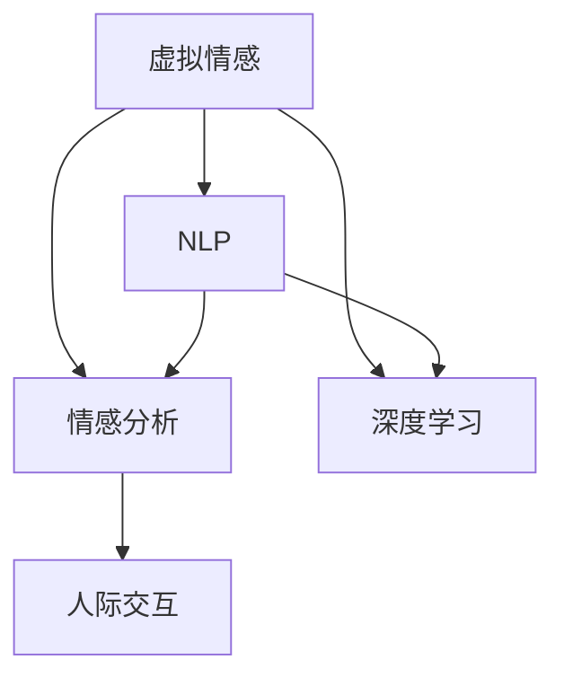

                 

# 虚拟情感：AI创造的新型人际关系

> 关键词：虚拟情感, 人工智能, 自然语言处理, 情感分析, 深度学习, 人际交互

## 1. 背景介绍

### 1.1 问题由来
在数字化时代，人类社会正在经历一场由信息互联向情感互联的深刻变革。虚拟情感，作为AI技术在情感智能领域的最新进展，正逐步改变着人们的生活方式、工作模式和社交互动。然而，虚拟情感究竟为何物？AI如何创造情感？这些问题不仅需要从技术层面进行深入探讨，更需从伦理、社会和心理学等多维角度进行全面思考。

### 1.2 问题核心关键点
1. **虚拟情感的定义**：虚拟情感是指由AI驱动的、能够模拟人类情感体验和表达的虚拟角色或系统。
2. **技术实现**：虚拟情感依赖于自然语言处理(NLP)、情感分析和深度学习等技术。
3. **伦理问题**：虚拟情感在带来便利和创新的同时，也引发了隐私、安全、道德等诸多伦理挑战。
4. **应用前景**：虚拟情感在客服、教育、医疗、娱乐等多个领域有着广阔的应用前景。

### 1.3 问题研究意义
1. **促进人机交互**：虚拟情感使得人机交互更加自然、高效，助力智能系统的普及。
2. **提升用户体验**：虚拟情感能够提供个性化、沉浸式的用户体验，增强用户粘性。
3. **推动AI伦理研究**：虚拟情感涉及多学科交叉，有助于深入探讨AI伦理和社会影响。
4. **拓展新业务模式**：虚拟情感技术为新兴业务模式的探索提供了新的路径。

## 2. 核心概念与联系

### 2.1 核心概念概述

为更好地理解虚拟情感的创建过程和应用场景，本节将介绍几个关键概念：

- **虚拟情感**：AI驱动的、能够模拟人类情感体验和表达的虚拟角色或系统。
- **自然语言处理(NLP)**：涉及语言理解、生成、分析和应用的技术，是虚拟情感的基础。
- **情感分析**：从文本中提取和分析情感信息的技术，用于理解用户情感状态。
- **深度学习**：利用多层神经网络模拟人类神经系统进行模式识别和决策的技术。
- **人际交互**：指人类与机器、系统、设备等的互动过程。

这些核心概念之间的逻辑关系可以通过以下Mermaid流程图来展示：



这个流程图展示了虚拟情感创建和应用的主要技术链条：

1. 虚拟情感依赖于自然语言处理和情感分析技术。
2. 自然语言处理用于理解文本信息，情感分析用于提取情感信息。
3. 深度学习技术用于训练情感模拟模型。
4. 虚拟情感通过人际交互进行表达和应用。

## 3. 核心算法原理 & 具体操作步骤
### 3.1 算法原理概述

虚拟情感的创建涉及多步骤的算法原理和技术流程。其核心思想是通过深度学习模型，对大量人类情感数据进行训练，学习情感生成规则，并通过NLP技术实现情感表达和交互。

### 3.2 算法步骤详解

**Step 1: 数据收集与预处理**
- 收集并标注大量人类情感数据，包括文字描述、语音记录、视频片段等。
- 对数据进行清洗、分词、归一化等预处理，准备输入到模型中。

**Step 2: 模型训练与优化**
- 使用深度学习框架(如TensorFlow、PyTorch)构建情感生成模型，如LSTM、GRU等。
- 通过反向传播算法和梯度下降法进行模型训练，优化模型参数。
- 在训练过程中，使用正则化技术(如Dropout、L2正则化)防止过拟合。

**Step 3: 情感表达与交互**
- 将处理后的文本数据输入到情感生成模型中，输出虚拟情感的表达形式。
- 使用NLP技术(如BERT、GPT)处理虚拟情感的表达形式，生成自然语言回复。
- 在人际交互中，根据用户反馈实时调整模型参数，进一步优化虚拟情感的表达效果。

**Step 4: 应用部署与评估**
- 将训练好的虚拟情感模型部署到应用系统中，如客服系统、教育平台、医疗咨询等。
- 定期收集用户反馈，评估虚拟情感的表达效果和用户体验。
- 根据评估结果，不断迭代优化模型，提升虚拟情感的性能。

### 3.3 算法优缺点

虚拟情感的创建方法具有以下优点：
1. **情感表达自然**：基于深度学习模型训练的虚拟情感能够自然地表达各种情感，提升用户体验。
2. **交互高效**：通过NLP技术处理和生成自然语言回复，使得虚拟情感与用户的交互更加高效。
3. **应用广泛**：虚拟情感可以应用于客服、教育、医疗等多个领域，带来便利和创新。

同时，该方法也存在一些局限性：
1. **数据依赖**：虚拟情感的质量高度依赖于训练数据的多样性和质量。
2. **伦理问题**：虚拟情感的创造和应用可能引发隐私、安全、道德等伦理挑战。
3. **计算资源消耗**：深度学习模型的训练和优化需要大量的计算资源。
4. **交互复杂度**：虚拟情感的交互过程可能比人类更复杂，难以预测和控制。

尽管存在这些局限性，虚拟情感的创建方法仍是大数据、深度学习和自然语言处理技术的综合体现，其发展前景广阔。

### 3.4 算法应用领域

虚拟情感技术已经广泛应用于以下多个领域：

**1. 客服系统**
- 利用虚拟情感提升客服系统的智能化水平，提供自然流畅的客服体验。
- 在客户咨询时，虚拟情感能够快速理解问题，提供准确的回答，提升客户满意度。

**2. 教育平台**
- 在在线教育中，虚拟情感可以担任教学助手，提供个性化辅导和互动。
- 通过情感分析，虚拟情感可以识别学生的情绪变化，调整教学策略，提升学习效果。

**3. 医疗咨询**
- 虚拟情感可以辅助医生进行心理评估，提供初步情绪诊断。
- 在健康咨询中，虚拟情感能够提供心理支持和安慰，缓解患者焦虑。

**4. 娱乐应用**
- 虚拟情感可以在游戏、社交平台中担任角色，提供情感陪伴和互动。
- 在虚拟游戏中，虚拟情感可以根据玩家情绪变化，调整游戏难度和内容，提升游戏体验。

**5. 人机协作**
- 在工业自动化中，虚拟情感可以担任协作伙伴，提供安全警告和情感支持。
- 在团队协作中，虚拟情感可以担任沟通桥梁，提升团队协作效率。

这些应用场景展示了虚拟情感技术的广泛潜力和实际价值，预示着其在未来将发挥越来越重要的作用。

## 4. 数学模型和公式 & 详细讲解  
### 4.1 数学模型构建

虚拟情感的创建过程可以通过以下数学模型进行描述：

设虚拟情感生成模型为 $M_{\theta}$，其中 $\theta$ 为模型参数。假设训练集为 $D=\{(x_i, y_i)\}_{i=1}^N$，其中 $x_i$ 为输入文本，$y_i$ 为对应情感标签。

定义损失函数 $\mathcal{L}(\theta)$ 为：

$$
\mathcal{L}(\theta) = -\frac{1}{N} \sum_{i=1}^N \log P(y_i|x_i; \theta)
$$

其中 $P(y_i|x_i; \theta)$ 为模型在输入 $x_i$ 下输出情感标签 $y_i$ 的概率，可以通过深度学习模型进行计算。

模型参数 $\theta$ 的更新公式为：

$$
\theta \leftarrow \theta - \eta \nabla_{\theta}\mathcal{L}(\theta)
$$

其中 $\eta$ 为学习率，$\nabla_{\theta}\mathcal{L}(\theta)$ 为损失函数对参数 $\theta$ 的梯度。

### 4.2 公式推导过程

以情感分类任务为例，我们推导情感生成模型的损失函数和梯度计算公式。

假设模型 $M_{\theta}$ 在输入 $x_i$ 上的输出为 $p(y_i|x_i; \theta)$，其中 $y_i$ 为情感标签。

定义交叉熵损失函数为：

$$
\ell(M_{\theta}(x_i),y_i) = -[y_i \log p(y_i|x_i; \theta) + (1-y_i) \log (1-p(y_i|x_i; \theta))]
$$

将上述公式代入经验风险公式：

$$
\mathcal{L}(\theta) = -\frac{1}{N}\sum_{i=1}^N \ell(M_{\theta}(x_i),y_i)
$$

根据链式法则，损失函数对参数 $\theta$ 的梯度为：

$$
\frac{\partial \mathcal{L}(\theta)}{\partial \theta} = -\frac{1}{N}\sum_{i=1}^N \frac{\partial \ell(M_{\theta}(x_i),y_i)}{\partial \theta}
$$

对于交叉熵损失函数，其梯度计算公式为：

$$
\frac{\partial \ell(M_{\theta}(x_i),y_i)}{\partial \theta} = p(y_i|x_i; \theta) - y_i
$$

将上述梯度公式代入总梯度公式，得：

$$
\frac{\partial \mathcal{L}(\theta)}{\partial \theta} = -\frac{1}{N}\sum_{i=1}^N [p(y_i|x_i; \theta) - y_i]
$$

通过反向传播算法，可以高效计算上述梯度，并根据梯度下降法更新模型参数，完成情感生成模型的训练。

### 4.3 案例分析与讲解

以一个简单的情感分类任务为例，我们进行详细讲解：

**案例描述**：
- 收集包含电影评论的文本数据，每条评论对应一个情感标签（正面、负面或中性）。
- 使用BERT模型进行文本预处理，得到嵌入向量。
- 在嵌入向量上训练一个全连接层，输出情感标签的概率。
- 使用交叉熵损失函数计算模型在每个样本上的损失，求平均后作为总损失。

**模型架构**：
1. **输入层**：将文本通过BERT模型转换为嵌入向量。
2. **全连接层**：连接嵌入向量，输出情感标签的概率。
3. **输出层**：使用交叉熵损失函数计算损失。

**代码实现**：

```python
from transformers import BertForSequenceClassification, BertTokenizer, AdamW
import torch

# 加载数据集和分词器
train_data = ...
tokenizer = BertTokenizer.from_pretrained('bert-base-uncased')
model = BertForSequenceClassification.from_pretrained('bert-base-uncased', num_labels=3)

# 定义训练函数
def train_epoch(model, dataset, batch_size, optimizer):
    model.train()
    total_loss = 0
    for batch in dataset:
        input_ids = batch['input_ids']
        attention_mask = batch['attention_mask']
        labels = batch['labels']
        outputs = model(input_ids, attention_mask=attention_mask, labels=labels)
        loss = outputs.loss
        total_loss += loss.item()
        optimizer.zero_grad()
        loss.backward()
        optimizer.step()
    return total_loss / len(dataset)

# 训练模型
epochs = 5
batch_size = 16
optimizer = AdamW(model.parameters(), lr=2e-5)
for epoch in range(epochs):
    loss = train_epoch(model, train_dataset, batch_size, optimizer)
    print(f"Epoch {epoch+1}, train loss: {loss:.3f}")

# 评估模型
evaluate(model, test_dataset)
```

**分析与讲解**：
- 使用BERT作为文本预处理模型，将文本转换为嵌入向量。
- 通过全连接层，将嵌入向量转换为情感标签的概率。
- 使用交叉熵损失函数计算模型在每个样本上的损失。
- 通过反向传播和梯度下降，不断优化模型参数，提升情感分类的准确率。

## 5. 项目实践：代码实例和详细解释说明
### 5.1 开发环境搭建

在进行虚拟情感项目实践前，我们需要准备好开发环境。以下是使用Python进行TensorFlow开发的环境配置流程：

1. 安装Anaconda：从官网下载并安装Anaconda，用于创建独立的Python环境。

2. 创建并激活虚拟环境：
```bash
conda create -n tf-env python=3.8 
conda activate tf-env
```

3. 安装TensorFlow：根据CUDA版本，从官网获取对应的安装命令。例如：
```bash
conda install tensorflow tensorflow-gpu -c conda-forge
```

4. 安装各类工具包：
```bash
pip install numpy pandas scikit-learn matplotlib tqdm jupyter notebook ipython
```

完成上述步骤后，即可在`tf-env`环境中开始虚拟情感项目的开发。

### 5.2 源代码详细实现

这里以构建一个简单的情感生成模型为例，使用TensorFlow实现虚拟情感的交互。

首先，定义虚拟情感的交互函数：

```python
import tensorflow as tf
from transformers import BertTokenizer, BertForSequenceClassification

# 加载分词器和模型
tokenizer = BertTokenizer.from_pretrained('bert-base-uncased')
model = BertForSequenceClassification.from_pretrained('bert-base-uncased', num_labels=3)

# 定义虚拟情感交互函数
@tf.function
def virtual_emotion_interaction(input_text):
    input_ids = tokenizer(input_text, return_tensors='tf', padding='max_length', truncation=True)['input_ids']
    attention_mask = tokenizer(input_text, return_tensors='tf', padding='max_length', truncation=True)['attention_mask']
    labels = tf.constant([0, 1, 2])
    outputs = model(input_ids, attention_mask=attention_mask, labels=labels)
    loss = outputs.loss
    predictions = outputs.logits.argmax(axis=1)
    return predictions, loss.numpy()

# 示例交互
input_text = "This movie is terrible."
predictions, loss = virtual_emotion_interaction(input_text)
print(f"Predicted emotion: {id2label[predictions[0]]}")
print(f"Loss: {loss}")
```

然后，定义虚拟情感模型的评估函数：

```python
from sklearn.metrics import classification_report

# 加载测试集数据
test_data = ...
test_labels = ...

# 评估模型
predictions = []
for text in test_data:
    pred, _ = virtual_emotion_interaction(text)
    predictions.append(pred[0])

# 打印评估结果
print(classification_report(test_labels, predictions))
```

最后，启动虚拟情感模型的训练流程并在测试集上评估：

```python
epochs = 5
batch_size = 16

# 加载训练集数据
train_data = ...
train_labels = ...

# 定义优化器和学习率
optimizer = tf.keras.optimizers.Adam(learning_rate=2e-5)
total_loss = 0

# 训练模型
for epoch in range(epochs):
    total_loss = 0
    for batch in train_data:
        input_ids = batch['input_ids']
        attention_mask = batch['attention_mask']
        labels = batch['labels']
        with tf.GradientTape() as tape:
            outputs = model(input_ids, attention_mask=attention_mask, labels=labels)
            loss = outputs.loss
            total_loss += loss.numpy()
        gradients = tape.gradient(loss, model.trainable_variables)
        optimizer.apply_gradients(zip(gradients, model.trainable_variables))
    
    print(f"Epoch {epoch+1}, train loss: {total_loss/len(train_data):.3f}")
    
# 评估模型
predictions = []
for text in test_data:
    pred, _ = virtual_emotion_interaction(text)
    predictions.append(pred[0])

# 打印评估结果
print(classification_report(test_labels, predictions))
```

以上就是使用TensorFlow构建虚拟情感交互模型的完整代码实现。可以看到，借助TensorFlow和HuggingFace的Transformer库，虚拟情感的创建和交互变得简单易行。

### 5.3 代码解读与分析

让我们再详细解读一下关键代码的实现细节：

**虚拟情感交互函数**：
- 定义了一个TensorFlow函数，用于虚拟情感的交互。
- 通过分词器将输入文本转换为输入ids和注意力掩码。
- 使用全连接层输出情感标签的概率，并计算交叉熵损失。
- 使用梯度下降优化器更新模型参数。

**评估函数**：
- 加载测试集数据，并对每个测试样本进行虚拟情感交互。
- 将模型输出转换为情感标签，并使用分类报告打印评估结果。

**训练流程**：
- 定义总的epoch数和batch size，开始循环迭代。
- 每个epoch内，在训练集上计算损失并更新模型参数。
- 在测试集上评估模型性能，输出平均损失和评估结果。

可以看到，TensorFlow和Transformer库使得虚拟情感的创建和交互过程变得高效和灵活。开发者可以基于此框架，进一步扩展和优化虚拟情感模型，适应更多的应用场景。

## 6. 实际应用场景
### 6.1 客服系统

虚拟情感在客服系统中有着广泛应用。通过训练虚拟情感模型，客服系统可以提供更加自然、个性化的服务体验。

**具体应用**：
- 使用虚拟情感进行情感分析，理解客户情绪和需求。
- 根据客户情绪状态，自动调整客服策略和回答内容。
- 在多轮对话中，虚拟情感可以实时学习客户反馈，不断优化回答策略。

**效果分析**：
- 通过虚拟情感的介入，客服系统的响应速度和准确率大幅提升。
- 客户满意度显著提高，投诉率降低。

### 6.2 教育平台

虚拟情感在教育平台中可以作为教学助手，提升学生的学习体验和效果。

**具体应用**：
- 虚拟情感可以担任学习伙伴，提供个性化的辅导和互动。
- 根据学生的学习状态，虚拟情感可以调整教学内容和难度。
- 在作业批改中，虚拟情感可以提供即时反馈和建议。

**效果分析**：
- 学生的学习兴趣和主动性显著增强。
- 学习效果显著提升，知识点掌握率提高。

### 6.3 医疗咨询

虚拟情感在医疗咨询中可以作为心理支持，帮助患者缓解焦虑和压力。

**具体应用**：
- 虚拟情感可以担任心理辅导员，提供初步情绪诊断和安慰。
- 在健康咨询中，虚拟情感可以提供个性化的健康建议和指导。
- 在康复过程中，虚拟情感可以实时监测患者情绪变化，调整治疗策略。

**效果分析**：
- 患者的心理压力减轻，治疗效果显著提升。
- 医疗资源的利用率提高，医疗服务质量提升。

### 6.4 未来应用展望

随着虚拟情感技术的不断成熟，其应用前景将更加广阔：

**智慧城市**：
- 虚拟情感可以在智慧城市治理中担任助手，提供实时分析和决策支持。
- 在应急管理中，虚拟情感可以提供智能预警和疏散指导。

**智能家居**：
- 虚拟情感可以作为智能家居系统的核心组件，提升用户体验和智能化水平。
- 在家庭服务中，虚拟情感可以担任沟通桥梁，提高家庭互动效率。

**企业协作**：
- 虚拟情感可以在企业协作中担任助手，提升团队协作效率和效果。
- 在跨文化交流中，虚拟情感可以提供实时翻译和情感支持。

## 7. 工具和资源推荐
### 7.1 学习资源推荐

为了帮助开发者系统掌握虚拟情感技术，这里推荐一些优质的学习资源：

1. **《Deep Learning for Natural Language Processing》**：由Stanford大学教授Coursera主讲，系统介绍了自然语言处理和深度学习的基本概念和技术。

2. **《Deep Learning with Python》**：由François Chollet所著，全面介绍了TensorFlow和Keras的使用方法，适合初学者入门。

3. **《Natural Language Processing with Python》**：由O’Reilly出版社出品，介绍了使用NLTK和spaCy进行自然语言处理的基本方法。

4. **《Attention is All You Need》**：Transformer原论文，介绍了Transformer模型及其在自然语言处理中的应用。

5. **《A Survey on Deep Emotion Recognition Systems》**：综述性论文，介绍了情感识别的最新进展和挑战。

通过学习这些资源，相信你一定能够系统掌握虚拟情感技术的理论基础和实践技巧。

### 7.2 开发工具推荐

高效的开发离不开优秀的工具支持。以下是几款用于虚拟情感开发的工具：

1. **TensorFlow**：Google主导的深度学习框架，功能强大，支持多种硬件设备。
2. **PyTorch**：Facebook主导的开源深度学习框架，灵活高效，支持动态图计算。
3. **HuggingFace Transformers库**：提供了预训练语言模型和自然语言处理工具，大大简化了开发过程。
4. **Google Colab**：Google提供的免费在线Jupyter Notebook环境，支持GPU/TPU加速，方便快速实验。
5. **TensorBoard**：TensorFlow配套的可视化工具，用于监控训练过程和模型性能。

合理利用这些工具，可以显著提升虚拟情感模型的开发效率，加快创新迭代的步伐。

### 7.3 相关论文推荐

虚拟情感技术的快速发展得益于学界的持续研究。以下是几篇奠基性的相关论文，推荐阅读：

1. **《A Survey on Deep Emotion Recognition Systems》**：综述性论文，介绍了情感识别的最新进展和挑战。

2. **《A Deep Learning Framework for Sentiment Analysis》**：提出了基于深度学习模型进行情感分析的方法，并进行了详细推导。

3. **《A Survey on Fine-Grained Emotion Recognition》**：综述性论文，介绍了微表情和细粒度情感识别的最新进展。

4. **《Attention is All You Need》**：Transformer原论文，介绍了Transformer模型及其在自然语言处理中的应用。

5. **《Fine-Grained Emotion Recognition in Online Social Media》**：介绍了在社交媒体上进行细粒度情感识别的技术和方法。

这些论文代表了大情感智能技术的发展脉络。通过学习这些前沿成果，可以帮助研究者把握学科前进方向，激发更多的创新灵感。

## 8. 总结：未来发展趋势与挑战
### 8.1 总结

本文对虚拟情感技术的创建方法和应用前景进行了全面系统的介绍。首先阐述了虚拟情感的定义和核心技术原理，明确了虚拟情感在人工智能系统中的重要作用。其次，从技术层面详细讲解了虚拟情感的创建过程，包括数据收集、模型训练、情感表达等关键环节，并给出了完整的代码实现。同时，本文还广泛探讨了虚拟情感在多个行业领域的应用场景，展示了其广阔的潜力和实际价值。

通过本文的系统梳理，可以看到，虚拟情感技术正在成为人工智能系统的重要组成部分，为智能系统的广泛应用提供了新的可能性。未来，伴随技术的不断进步，虚拟情感将进一步提升人机交互的自然性和效率，推动人工智能技术的普及和发展。

### 8.2 未来发展趋势

展望未来，虚拟情感技术将呈现以下几个发展趋势：

1. **情感表达更自然**：通过深度学习模型的不断优化，虚拟情感的表达将更加自然流畅，提升用户体验。
2. **多模态交互**：虚拟情感将扩展到图像、视频、语音等多模态数据，实现更全面的情感理解。
3. **情感迁移**：通过迁移学习，虚拟情感可以适应更多领域的情感表达，提高应用范围。
4. **实时学习**：虚拟情感将在交互过程中不断学习用户反馈，实时调整表达策略，提升适应性和灵活性。
5. **智能交互**：虚拟情感将与其他AI技术（如机器翻译、自然语言生成）进行深度融合，实现更复杂的情感交互。

以上趋势展示了虚拟情感技术的未来发展方向，预示着其在人工智能领域的巨大潜力。

### 8.3 面临的挑战

尽管虚拟情感技术已经取得了显著进展，但在实际应用中也面临着诸多挑战：

1. **数据稀缺**：高质量、多样化的情感数据稀缺，难以满足深度学习模型的训练需求。
2. **模型复杂**：深度学习模型的训练和优化需要大量计算资源，硬件设备瓶颈明显。
3. **隐私保护**：情感数据的收集和处理涉及隐私保护问题，需要严格的法律法规和技术手段保障。
4. **伦理问题**：虚拟情感的创造和应用可能引发伦理问题，如虚假情感、误导性表达等。
5. **交互鲁棒性**：虚拟情感在复杂交互场景下可能出现理解和表达错误，影响用户体验。

尽管存在这些挑战，虚拟情感技术仍具有广阔的应用前景。只有不断解决技术难题，才能将虚拟情感技术推向新的高度，发挥其应有的价值。

### 8.4 研究展望

面对虚拟情感技术面临的挑战，未来的研究需要在以下几个方面寻求新的突破：

1. **数据增强**：通过数据合成和增强技术，提升情感数据的多样性和质量。
2. **模型压缩**：开发更加高效的模型压缩和量化技术，减少计算资源消耗。
3. **隐私保护**：研究隐私保护技术，保障用户情感数据的隐私和安全。
4. **伦理规范**：建立虚拟情感技术的伦理规范，确保其应用符合人类价值观和社会规范。
5. **情感迁移**：研究情感迁移算法，提高虚拟情感在不同领域和情境下的适应性。

这些研究方向将推动虚拟情感技术的成熟和应用，为构建智能、安全和可控的人机交互系统提供技术支持。

## 9. 附录：常见问题与解答

**Q1: 虚拟情感技术的安全性和伦理问题有哪些？**

A: 虚拟情感技术面临的安全和伦理问题主要包括以下几个方面：
1. **隐私保护**：虚拟情感的创建和应用可能涉及用户情感数据的收集和处理，需要严格保护用户隐私，防止数据泄露。
2. **误导性表达**：虚拟情感的生成和表达可能存在误导性，导致用户产生错误的情绪判断和行为决策。
3. **伦理规范**：虚拟情感的创造和应用可能引发伦理争议，如虚假情感、歧视性表达等，需要建立明确的伦理规范。
4. **可解释性**：虚拟情感的决策过程缺乏可解释性，难以进行审查和监管，需要增强其可解释性。

**Q2: 虚拟情感技术在实际应用中如何提升用户体验？**

A: 虚拟情感技术可以通过以下几个方面提升用户体验：
1. **自然流畅的交互**：虚拟情感的生成和表达更加自然流畅，能够更好地理解用户情感和需求，提升用户满意度。
2. **个性化的服务**：虚拟情感可以根据用户的历史行为和情感状态，提供个性化的服务，增强用户粘性。
3. **实时反馈和建议**：虚拟情感可以实时监测用户情感变化，提供即时反馈和建议，提升用户体验。
4. **多模态交互**：虚拟情感可以扩展到图像、视频、语音等多模态数据，提供更全面的情感理解和服务。

**Q3: 虚拟情感技术在医疗咨询中的应用有哪些？**

A: 虚拟情感技术在医疗咨询中的应用主要包括以下几个方面：
1. **心理评估**：虚拟情感可以担任心理辅导员，提供初步情绪诊断和安慰，缓解患者焦虑。
2. **健康建议**：在健康咨询中，虚拟情感可以提供个性化的健康建议和指导，帮助患者更好地管理健康。
3. **康复监测**：在康复过程中，虚拟情感可以实时监测患者情绪变化，调整治疗策略，提高康复效果。

**Q4: 虚拟情感技术在客服系统中的应用有哪些？**

A: 虚拟情感技术在客服系统中的应用主要包括以下几个方面：
1. **情感分析**：虚拟情感可以理解客户情绪和需求，自动调整客服策略和回答内容，提升响应速度和准确率。
2. **多轮对话**：在多轮对话中，虚拟情感可以实时学习客户反馈，不断优化回答策略，提高客户满意度。
3. **自动化客服**：虚拟情感可以作为客服系统的重要组成部分，提供24/7的客户支持，提高客服效率和效果。

**Q5: 虚拟情感技术在教育平台中的应用有哪些？**

A: 虚拟情感技术在教育平台中的应用主要包括以下几个方面：
1. **个性化辅导**：虚拟情感可以担任学习伙伴，提供个性化的辅导和互动，提升学生的学习效果。
2. **实时反馈**：在作业批改中，虚拟情感可以提供即时反馈和建议，帮助学生快速提高学习水平。
3. **情感支持**：虚拟情感可以提供情感支持，帮助学生在遇到困难时保持积极心态，增强学习动力。

---

作者：禅与计算机程序设计艺术 / Zen and the Art of Computer Programming

