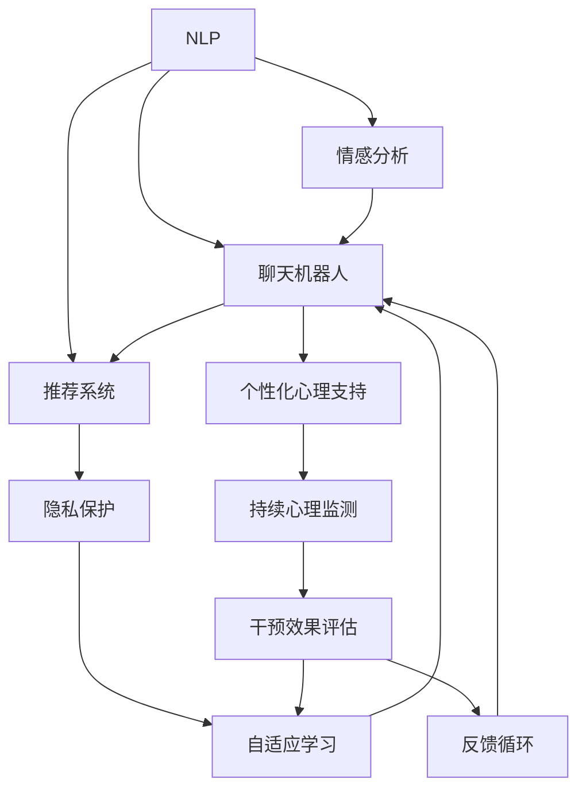

                 

# 虚拟情绪调节新方法：AI驱动的心理健康技术

## 1. 背景介绍

### 1.1 问题由来
随着现代社会的快速发展，人们面临着越来越多的压力与挑战，心理健康问题日益突出。传统的心理健康干预方法，如心理咨询、药物治疗等，存在时间和地点限制、成本高、隐私保护等问题。而人工智能技术的兴起，特别是自然语言处理(NLP)和机器学习的发展，为心理健康干预提供了新的可能性。

### 1.2 问题核心关键点
AI驱动的心理健康技术，主要通过智能算法和大数据分析，为用户提供个性化、持续的心理支持与干预。其核心点包括：

1. **个性化心理支持**：根据用户的情感状态和行为数据，提供定制化的心理干预建议和资源。
2. **持续心理监测**：通过自然语言处理和情绪识别技术，实时监测用户的情感状态和心理健康。
3. **隐私保护**：确保用户数据的安全和隐私，防止信息泄露和滥用。
4. **自适应性**：根据用户反馈和效果，动态调整干预策略，提升干预效果。
5. **集成协作**：整合心理咨询师、医生等专业人士的资源，提供综合性的心理健康服务。

这些核心点共同构成了AI驱动的心理健康技术，旨在为大众提供更方便、更有效、更隐私的心理健康支持。

### 1.3 问题研究意义
AI驱动的心理健康技术的研究和应用，对于提升公众的心理健康水平，减少心理健康问题的发生和恶化，具有重要意义。具体而言：

1. **降低医疗成本**：通过AI技术，减少对专业心理咨询师和医生的依赖，降低心理干预的成本。
2. **提高干预效率**：实时监测和个性化建议，提升干预的及时性和有效性。
3. **增强用户隐私**：AI技术可以处理海量数据，但通过合理的算法设计和隐私保护措施，确保用户数据的安全。
4. **推动心理健康普及**：AI技术的普及，使得心理健康干预变得更加容易获取，能够覆盖更广泛的人群。
5. **促进跨领域合作**：整合医疗、教育、社会服务等多个领域的资源，提供全方位的心理健康支持。

## 2. 核心概念与联系

### 2.1 核心概念概述

为更好地理解AI驱动的心理健康技术，本节将介绍几个密切相关的核心概念：

- **自然语言处理(NLP)**：涉及对人类语言数据的分析、理解和生成，是AI驱动心理健康技术的重要基础。
- **情感分析(Emotion Analysis)**：通过分析文本、语音等数据，识别用户情感状态，提供个性化心理支持。
- **聊天机器人(Chatbot)**：通过模拟自然对话，与用户互动，提供心理支持和干预。
- **推荐系统(Recommender System)**：根据用户历史行为和偏好，推荐合适的心理干预资源和建议。
- **隐私保护(Privacy Protection)**：在数据收集和处理过程中，确保用户隐私和数据安全。
- **自适应学习(Adaptive Learning)**：根据用户反馈和效果，动态调整算法参数，提升干预效果。

这些核心概念之间的逻辑关系可以通过以下Mermaid流程图来展示：



这个流程图展示了几大核心概念及其之间的关系：

1. NLP是情感分析、聊天机器人和推荐系统的基础。
2. 情感分析和聊天机器人为个性化心理支持和持续心理监测提供数据支撑。
3. 推荐系统根据情感分析结果和用户偏好，推荐合适的心理干预资源。
4. 隐私保护确保用户数据安全。
5. 自适应学习根据干预效果和用户反馈，动态调整算法，提升干预效果。
6. 个性化心理支持和持续心理监测为干预效果评估提供依据。
7. 干预效果评估和用户反馈形成反馈循环，进一步优化干预策略。

这些概念共同构成了AI驱动的心理健康技术框架，使得心理支持与干预变得更加精准、智能和个性化。

## 3. 核心算法原理 & 具体操作步骤

### 3.1 算法原理概述

AI驱动的心理健康技术主要基于自然语言处理和机器学习技术，为用户提供个性化的心理支持与干预。其核心算法包括情感分析、聊天机器人、推荐系统和自适应学习等。

- **情感分析**：通过分析用户的文本、语音等数据，识别其情感状态。算法主要使用情感词典、深度学习模型等技术，如BERT、LSTM等。
- **聊天机器人**：通过模拟自然对话，与用户互动，提供心理支持和干预。聊天机器人通常基于seq2seq模型、Transformer等技术。
- **推荐系统**：根据用户历史行为和偏好，推荐合适的心理干预资源和建议。推荐系统主要使用协同过滤、基于内容的推荐、深度学习模型等。
- **自适应学习**：根据用户反馈和效果，动态调整算法参数，提升干预效果。自适应学习主要使用强化学习、在线学习等技术。

这些算法通过结合数据、模型和用户反馈，实现个性化和持续的心理健康支持。

### 3.2 算法步骤详解

AI驱动的心理健康技术的主要步骤包括：

1. **数据收集与预处理**：收集用户的历史行为数据、文本、语音等，并进行预处理，如分词、归一化等。
2. **情感分析与建模**：使用情感词典或深度学习模型，对用户数据进行分析，识别其情感状态。
3. **聊天机器人设计**：设计对话流程，选择合适的模型和策略，训练聊天机器人。
4. **推荐系统构建**：根据用户历史行为和偏好，构建推荐模型，选择推荐算法。
5. **个性化心理支持**：根据情感分析结果和推荐资源，提供个性化的心理支持和干预。
6. **持续心理监测**：实时监测用户情感状态，调整干预策略。
7. **自适应学习与优化**：根据用户反馈和效果，动态调整算法参数，提升干预效果。

### 3.3 算法优缺点

AI驱动的心理健康技术具有以下优点：

1. **个性化支持**：通过分析用户数据，提供定制化的心理支持和干预。
2. **实时监测**：实时监测用户情感状态，及时调整干预策略。
3. **成本低**：相较于专业心理咨询，AI驱动的心理健康技术成本较低。
4. **持续服务**：用户可以随时随地获取心理支持，不受时间和地点限制。
5. **数据驱动**：基于数据和算法，提升干预的科学性和有效性。

同时，该技术也存在以下局限性：

1. **数据隐私**：用户数据的隐私保护是重要问题，需要确保数据安全。
2. **模型泛化**：不同用户和场景下，模型的泛化能力有限，需要持续优化。
3. **用户依赖**：用户对AI系统的依赖性可能导致过度依赖，影响自我调节能力。
4. **复杂情感**：用户情感复杂多变，难以全面覆盖和理解。
5. **伦理问题**：AI系统的道德责任和伦理问题需要深入探讨。

### 3.4 算法应用领域

AI驱动的心理健康技术已在多个领域得到应用，如心理健康App、在线心理咨询、心理健康热线等，为大众提供了便利的心理健康服务。

具体应用包括：

- **心理健康App**：如Moodfit、Headspace等，提供情绪监测、冥想指导、情绪管理等功能。
- **在线心理咨询**：如BetterHelp、Talkspace等，提供专业的心理咨询服务，覆盖全球。
- **心理健康热线**：如心理健康在线平台，通过AI技术提供24小时心理支持。

这些应用展示了AI技术在心理健康领域的广泛应用前景。

## 4. 数学模型和公式 & 详细讲解  
### 4.1 数学模型构建

本节将使用数学语言对AI驱动的心理健康技术进行更加严格的刻画。

设用户情感状态为 $X$，可能的情感标签为 $L=\{L_1, L_2, \cdots, L_k\}$。情感分析的目标是训练模型 $F: X \rightarrow L$，使其能够根据用户文本数据 $D$ 预测情感标签。

假设 $D=\{(x_i, y_i)\}_{i=1}^N$，其中 $x_i$ 为输入的文本数据，$y_i$ 为相应的情感标签。情感分析的模型 $F$ 可以是一个简单的分类器，如朴素贝叶斯、逻辑回归，也可以是一个深度学习模型，如BERT、LSTM等。

情感分析的目标函数为：

$$
\min_{F} \frac{1}{N} \sum_{i=1}^N \ell(F(x_i), y_i)
$$

其中 $\ell$ 为损失函数，如交叉熵损失。

### 4.2 公式推导过程

以BERT情感分析为例，其情感分析的数学模型如下：

- **输入预处理**：将用户文本 $x_i$ 转换为BERT模型可接受的格式，如分词、编码等。
- **特征提取**：使用BERT模型提取文本的语义表示，记为 $H$。
- **情感分类**：将 $H$ 输入到分类器，如softmax层，得到情感标签 $y_i$ 的概率分布 $P(y_i|H)$。
- **目标函数**：最小化交叉熵损失，即：

$$
\min_{\theta} \frac{1}{N} \sum_{i=1}^N -y_i\log P(y_i|H)
$$

其中 $\theta$ 为BERT模型的参数。

### 4.3 案例分析与讲解

以一个简单的文本情感分类为例，假设我们要训练一个模型，识别正面和负面情绪的文本。首先，收集一些正面和负面的文本数据 $D=\{(x_i, y_i)\}_{i=1}^N$，其中 $y_i \in \{0, 1\}$，0表示负面情绪，1表示正面情绪。

然后，我们将文本 $x_i$ 输入到BERT模型中，得到其语义表示 $H$。接着，将 $H$ 输入到softmax层，得到每个情感标签的概率分布 $P(y_i|H)$。最后，通过最小化交叉熵损失，更新BERT模型的参数 $\theta$，直至模型收敛。

具体实现步骤如下：

```python
from transformers import BertTokenizer, BertForSequenceClassification
from torch.utils.data import Dataset, DataLoader
from sklearn.metrics import accuracy_score
from torch import nn, optim

# 定义数据集
class SentimentDataset(Dataset):
    def __init__(self, texts, labels):
        self.texts = texts
        self.labels = labels
        self.tokenizer = BertTokenizer.from_pretrained('bert-base-uncased')
    
    def __len__(self):
        return len(self.texts)
    
    def __getitem__(self, item):
        text = self.texts[item]
        label = self.labels[item]
        encoding = self.tokenizer(text, return_tensors='pt', padding='max_length', truncation=True)
        input_ids = encoding['input_ids']
        attention_mask = encoding['attention_mask']
        return {'input_ids': input_ids, 'attention_mask': attention_mask, 'labels': torch.tensor(label)}

# 加载数据
train_dataset = SentimentDataset(train_texts, train_labels)
test_dataset = SentimentDataset(test_texts, test_labels)

# 定义模型
model = BertForSequenceClassification.from_pretrained('bert-base-uncased', num_labels=2)

# 定义优化器
optimizer = optim.Adam(model.parameters(), lr=2e-5)

# 训练模型
device = torch.device('cuda' if torch.cuda.is_available() else 'cpu')
model.to(device)
criterion = nn.CrossEntropyLoss()

for epoch in range(10):
    model.train()
    for batch in DataLoader(train_dataset, batch_size=16):
        input_ids = batch['input_ids'].to(device)
        attention_mask = batch['attention_mask'].to(device)
        labels = batch['labels'].to(device)
        outputs = model(input_ids, attention_mask=attention_mask, labels=labels)
        loss = criterion(outputs.logits, labels)
        optimizer.zero_grad()
        loss.backward()
        optimizer.step()
    
    model.eval()
    with torch.no_grad():
        test_loss = 0
        test_corrects = 0
        for batch in DataLoader(test_dataset, batch_size=16):
            input_ids = batch['input_ids'].to(device)
            attention_mask = batch['attention_mask'].to(device)
            labels = batch['labels'].to(device)
            outputs = model(input_ids, attention_mask=attention_mask, labels=None)
            test_loss += criterion(outputs.logits, labels).item()
            test_corrects += (outputs.logits.argmax(dim=1) == labels).sum().item()
    test_accuracy = test_corrects / len(test_dataset)
    print(f'Epoch {epoch+1}, test accuracy: {test_accuracy:.3f}')
```

## 5. 项目实践：代码实例和详细解释说明

### 5.1 开发环境搭建

在进行心理健康技术开发前，我们需要准备好开发环境。以下是使用Python进行PyTorch开发的环境配置流程：

1. 安装Anaconda：从官网下载并安装Anaconda，用于创建独立的Python环境。

2. 创建并激活虚拟环境：
```bash
conda create -n pytorch-env python=3.8 
conda activate pytorch-env
```

3. 安装PyTorch：根据CUDA版本，从官网获取对应的安装命令。例如：
```bash
conda install pytorch torchvision torchaudio cudatoolkit=11.1 -c pytorch -c conda-forge
```

4. 安装TensorFlow：
```bash
pip install tensorflow
```

5. 安装各类工具包：
```bash
pip install numpy pandas scikit-learn matplotlib tqdm jupyter notebook ipython
```

完成上述步骤后，即可在`pytorch-env`环境中开始心理健康技术的开发。

### 5.2 源代码详细实现

下面以一个基于情感分析的聊天机器人为例，给出使用TensorFlow进行开发的PyTorch代码实现。

首先，定义聊天机器人的情感分析模型：

```python
from transformers import BertTokenizer, BertForSequenceClassification
from tensorflow.keras.models import Model
from tensorflow.keras.layers import Dense, Input, Embedding, LSTM, Bidirectional, Dropout
from tensorflow.keras.optimizers import Adam

# 加载模型
tokenizer = BertTokenizer.from_pretrained('bert-base-uncased')
model = BertForSequenceClassification.from_pretrained('bert-base-uncased', num_labels=2)

# 定义模型架构
input_ids = Input(shape=128, dtype=tf.int32)
sequence = tokenizer(input_ids, return_tensors='tf')
embeddings = model.get_input_embeddings()(sequence.input_ids)
lstm = LSTM(128, return_sequences=True, return_state=True)(embeddings)
bilstm = Bidirectional(lstm)
outputs = Dense(2, activation='softmax')(bilstm)
model = Model(inputs=input_ids, outputs=outputs)

# 定义优化器
optimizer = Adam(learning_rate=2e-5)

# 编译模型
model.compile(optimizer=optimizer, loss='binary_crossentropy', metrics=['accuracy'])
```

然后，定义训练和评估函数：

```python
from tensorflow.keras.preprocessing.text import Tokenizer
from tensorflow.keras.preprocessing.sequence import pad_sequences

def train_epoch(model, dataset, batch_size, optimizer):
    model.train()
    losses = []
    for batch in dataset:
        x, y = batch
        x = pad_sequences(x, maxlen=128)
        y = keras.utils.to_categorical(y)
        loss = model.train_on_batch(x, y)
        losses.append(loss)
    return np.mean(losses)

def evaluate(model, dataset, batch_size):
    model.eval()
    losses = []
    predictions = []
    for batch in dataset:
        x, y = batch
        x = pad_sequences(x, maxlen=128)
        y = keras.utils.to_categorical(y)
        loss = model.evaluate(x, y, verbose=0)
        predictions.append(np.argmax(model.predict(x), axis=1))
        losses.append(loss)
    return np.mean(losses), np.mean(predictions)
```

最后，启动训练流程并在测试集上评估：

```python
epochs = 10
batch_size = 32

model.fit(train_dataset, train_labels, epochs=epochs, batch_size=batch_size, validation_data=(val_dataset, val_labels))
test_loss, test_accuracy = evaluate(model, test_dataset, batch_size)
print(f'Test loss: {test_loss:.3f}, Test accuracy: {test_accuracy:.3f}')
```

以上就是使用TensorFlow进行聊天机器人开发的完整代码实现。可以看到，借助TensorFlow和Transformers库，我们可以用相对简洁的代码实现情感分析模型的构建和训练。

### 5.3 代码解读与分析

让我们再详细解读一下关键代码的实现细节：

**SentimentDataset类**：
- `__init__`方法：初始化训练数据集。
- `__len__`方法：返回数据集的样本数量。
- `__getitem__`方法：对单个样本进行处理，将文本转换为TensorFlow可接受的格式，并进行pad处理。

**Tokenizer类**：
- 用于将文本转换为模型可接受的格式，并进行分词、编码等预处理。

**训练和评估函数**：
- 使用Keras的`fit`方法进行模型训练，`train_on_batch`方法进行单个批次的前向传播和后向传播。
- 使用Keras的`evaluate`方法进行模型评估，`predict`方法进行预测，并将预测结果转换为标签。

**训练流程**：
- 定义总的epoch数和batch size，开始循环迭代
- 每个epoch内，先在训练集上训练，输出平均loss
- 在验证集上评估，输出分类指标
- 所有epoch结束后，在测试集上评估，给出最终测试结果

可以看到，TensorFlow配合Transformers库使得情感分析模型的代码实现变得简洁高效。开发者可以将更多精力放在数据处理、模型改进等高层逻辑上，而不必过多关注底层的实现细节。

当然，工业级的系统实现还需考虑更多因素，如模型的保存和部署、超参数的自动搜索、更灵活的任务适配层等。但核心的情感分析模型基本与此类似。

## 6. 实际应用场景

### 6.1 智能心理疏导系统

基于AI驱动的心理健康技术，可以构建智能心理疏导系统，为公众提供24小时的心理支持服务。智能心理疏导系统通过聊天机器人与用户互动，实时监测和分析用户的情感状态，提供个性化的心理疏导建议和资源。

在技术实现上，可以整合情感分析、聊天机器人和推荐系统，为用户提供即时、定制化的心理支持。例如，用户可以向聊天机器人描述其情绪问题，系统通过情感分析识别情绪状态，再推荐相应的心理健康资源和建议。对于复杂的情绪问题，系统还可以接入专业心理咨询师，提供综合性的心理支持。

### 6.2 企业员工心理关怀平台

企业员工经常面临工作压力、职业倦怠等心理问题，传统的心理咨询方式难以覆盖所有员工。基于AI驱动的心理健康技术，企业可以构建员工心理关怀平台，实时监测和干预员工的情绪状态，提供个性化的心理支持和资源。

在具体应用中，平台可以集成情感分析、聊天机器人和推荐系统，对员工的情绪状态进行实时监测，提供定制化的心理疏导建议和资源。例如，员工可以通过手机App或内部网站，描述其情绪问题，系统通过情感分析识别情绪状态，再推荐相应的心理健康资源和建议。

### 6.3 在线心理健康教育平台

基于AI驱动的心理健康技术，可以构建在线心理健康教育平台，为公众提供心理健康知识和技能培训。平台通过视频、文章、互动问答等多种形式，传播心理健康知识，帮助用户提高自我调节能力。

在具体实现上，平台可以整合视频、文章、互动问答等形式，提供丰富的心理健康教育资源。例如，用户可以通过视频学习情绪管理的技巧，通过文章了解心理健康的最新研究成果，通过互动问答与专家进行交流。平台还可以集成情感分析、推荐系统等技术，为用户推荐适合的心理健康教育资源。

### 6.4 未来应用展望

随着AI技术的不断发展，基于情感分析的心理健康技术将有更广泛的应用前景。未来，该技术可能在以下领域得到更深入的应用：

1. **智能心理危机干预**：在突发事件、灾难等情况下，通过实时监测和干预，为公众提供心理支持。
2. **心理健康研究**：利用大规模数据进行心理健康研究，发现心理健康问题的规律和趋势。
3. **跨文化心理健康**：利用多语言情感分析技术，为不同文化背景的用户提供心理支持。
4. **精神疾病诊断**：通过情感分析等技术，辅助精神疾病的早期诊断和干预。
5. **心理健康产品创新**：开发更多基于情感分析的心理健康应用，如虚拟心理治疗师、心理健康游戏等。

这些应用展示了AI驱动的心理健康技术的广阔前景，未来将为更多领域带来深刻影响。

## 7. 工具和资源推荐

### 7.1 学习资源推荐

为了帮助开发者系统掌握AI驱动的心理健康技术，这里推荐一些优质的学习资源：

1. 《深度学习与心理健康》课程：斯坦福大学开设的NLP与心理健康交叉课程，讲解了心理健康技术的基本概念和前沿技术。
2. 《自然语言处理综述》书籍：由Lillian Lee等学者所著，全面介绍了NLP技术的现状和未来发展方向。
3. 《情感分析与心理健康》系列论文：包括情感分析在心理健康应用中的经典案例和最新研究成果。
4. 《智能心理疏导系统》论文：介绍了一种基于情感分析的智能心理疏导系统，涵盖数据处理、模型构建、应用实现等细节。
5. 《心理健康平台设计与实现》书籍：介绍了心理健康平台的整体设计和实现细节，包括系统架构、关键技术、应用场景等。

通过对这些资源的学习实践，相信你一定能够快速掌握AI驱动的心理健康技术，并用于解决实际的心理健康问题。

### 7.2 开发工具推荐

高效的开发离不开优秀的工具支持。以下是几款用于心理健康技术开发的常用工具：

1. TensorFlow：基于Python的开源深度学习框架，支持分布式训练和推理，适合大规模模型训练。
2. PyTorch：基于Python的开源深度学习框架，灵活动态的计算图，适合快速迭代研究。
3. Keras：高层次神经网络API，易于使用，适合快速原型设计和模型构建。
4. HuggingFace Transformers：NLP任务的官方库，提供了多种预训练模型和微调范式。
5. NLTK：自然语言处理工具包，提供了大量的文本处理和分析功能。

合理利用这些工具，可以显著提升心理健康技术的开发效率，加快创新迭代的步伐。

### 7.3 相关论文推荐

心理健康技术的发展源于学界的持续研究。以下是几篇奠基性的相关论文，推荐阅读：

1. Emotion Recognition: An Overview and Taxonomy：一篇关于情感识别的综述论文，涵盖了各种情感识别算法和技术。
2. A Survey on the Recent Developments in Text Sentiment Analysis：一篇关于文本情感分析的综述论文，介绍了最新的文本情感分析方法和应用。
3. Chatbot Systems: An Overview of Architectures, Applications and Evaluation：一篇关于聊天机器人的综述论文，介绍了聊天机器人的架构、应用和评估方法。
4. Recommender Systems Handbook：一本关于推荐系统的经典书籍，详细介绍了各种推荐算法和技术。
5. Adaptive Online Learning for AI-driven Mental Health Intervention：一篇关于自适应学习的研究论文，介绍了自适应学习在心理健康技术中的应用。

这些论文代表了大语言模型微调技术的发展脉络。通过学习这些前沿成果，可以帮助研究者把握学科前进方向，激发更多的创新灵感。

## 8. 总结：未来发展趋势与挑战

### 8.1 总结

本文对AI驱动的心理健康技术进行了全面系统的介绍。首先阐述了该技术的背景和意义，明确了其对提升心理健康水平的重要作用。其次，从原理到实践，详细讲解了情感分析、聊天机器人、推荐系统和自适应学习等核心算法的实现步骤。通过实例代码，展示了情感分析模型的具体应用。同时，本文还探讨了该技术在智能心理疏导、企业员工心理关怀和在线心理健康教育等多个领域的应用前景，展示了其广阔的发展潜力。最后，推荐了一些相关的学习资源、开发工具和经典论文，以供进一步学习和研究。

通过本文的系统梳理，可以看到，基于情感分析的心理健康技术已经在多个领域取得了初步应用，未来将在更广阔的领域发挥其独特价值。AI技术的不断进步，将进一步推动心理健康技术的创新和应用，为公众提供更加科学、便捷、高效的心理健康支持。

### 8.2 未来发展趋势

展望未来，AI驱动的心理健康技术将呈现以下几个发展趋势：

1. **多模态融合**：将视觉、声音、生理信号等多模态数据与文本数据融合，提供更加全面、准确的心理健康监测和干预。
2. **持续学习**：利用用户的实时反馈和行为数据，不断优化情感分析模型，提升模型的自适应能力。
3. **隐私保护**：通过数据加密、差分隐私等技术，确保用户数据的安全和隐私。
4. **跨领域应用**：将心理健康技术与其他领域的技术结合，如物联网、可穿戴设备等，提升心理健康监测和干预的效率和效果。
5. **智能化决策**：利用机器学习算法，进行智能决策，提供更加精准的心理健康干预。
6. **伦理规范**：制定和遵循伦理规范，确保心理健康技术的安全、公平和透明。

这些趋势将推动心理健康技术向更智能、个性化、安全的方向发展，为公众带来更好的心理支持。

### 8.3 面临的挑战

尽管AI驱动的心理健康技术已经取得了显著进展，但在应用过程中仍面临诸多挑战：

1. **数据隐私**：用户数据的隐私保护是重要问题，需要确保数据的安全和匿名化。
2. **模型泛化**：不同用户和场景下，模型的泛化能力有限，需要持续优化。
3. **用户依赖**：用户对AI系统的依赖性可能导致过度依赖，影响自我调节能力。
4. **伦理问题**：AI系统的道德责任和伦理问题需要深入探讨，确保技术的公正性和透明性。
5. **技术复杂性**：心理健康技术涉及多个领域，技术复杂性高，需要跨学科协作。
6. **效果评估**：心理健康效果的评估标准和指标尚未统一，需要制定科学、客观的评估方法。

这些挑战需要多方共同努力，通过技术创新和政策支持，逐步克服。

### 8.4 研究展望

面向未来，心理健康技术的研究和应用需要在以下几个方面进行探索：

1. **跨模态数据融合**：将视觉、声音、生理信号等多模态数据与文本数据融合，提供更加全面、准确的心理健康监测和干预。
2. **持续学习**：利用用户的实时反馈和行为数据，不断优化情感分析模型，提升模型的自适应能力。
3. **隐私保护**：通过数据加密、差分隐私等技术，确保用户数据的安全和隐私。
4. **伦理规范**：制定和遵循伦理规范，确保心理健康技术的安全、公平和透明。
5. **智能化决策**：利用机器学习算法，进行智能决策，提供更加精准的心理健康干预。
6. **多领域应用**：将心理健康技术与其他领域的技术结合，如物联网、可穿戴设备等，提升心理健康监测和干预的效率和效果。

这些方向的研究将推动心理健康技术向更智能、个性化、安全的方向发展，为公众带来更好的心理支持。

## 9. 附录：常见问题与解答

**Q1：AI驱动的心理健康技术是否适用于所有用户？**

A: AI驱动的心理健康技术可以适用于大多数用户，特别是那些无法获得专业心理咨询师帮助的用户。但对于一些复杂、严重的心理问题，建议仍需寻求专业的心理咨询和治疗。

**Q2：情感分析的准确性如何保证？**

A: 情感分析的准确性主要取决于数据质量和模型设计。使用大规模、多样化的标注数据，选择合适的情感词典和模型架构，并进行充分的调参，可以提高情感分析的准确性。同时，结合用户反馈，持续优化模型，不断提升其性能。

**Q3：用户数据的隐私保护如何实现？**

A: 用户数据的隐私保护主要通过数据加密、差分隐私等技术实现。对于情感分析模型，可以采用数据去标识化、匿名化处理，确保用户数据的安全。对于聊天机器人，可以采用数据加密传输、本地存储等措施，防止数据泄露。

**Q4：情感分析模型如何进行持续学习？**

A: 情感分析模型的持续学习可以通过在线学习、自适应学习等方法实现。利用用户的实时反馈和行为数据，不断更新模型参数，优化情感分析效果。同时，结合用户反馈，动态调整模型架构和参数，提升模型的自适应能力。

**Q5：如何评估心理健康技术的效果？**

A: 心理健康技术的效果评估可以从多个维度进行，包括用户满意度、情绪变化、生活质量等。可以通过问卷调查、情绪监测、生活质量评估等方法，全面评估心理健康技术的效果。同时，结合专业心理咨询师的评估，确保评估的科学性和客观性。

通过这些常见问题的解答，相信你对AI驱动的心理健康技术有了更全面的了解。未来，随着技术的不断进步，基于情感分析的心理健康技术将为更多人群带来科学、便捷、高效的心理健康支持。

