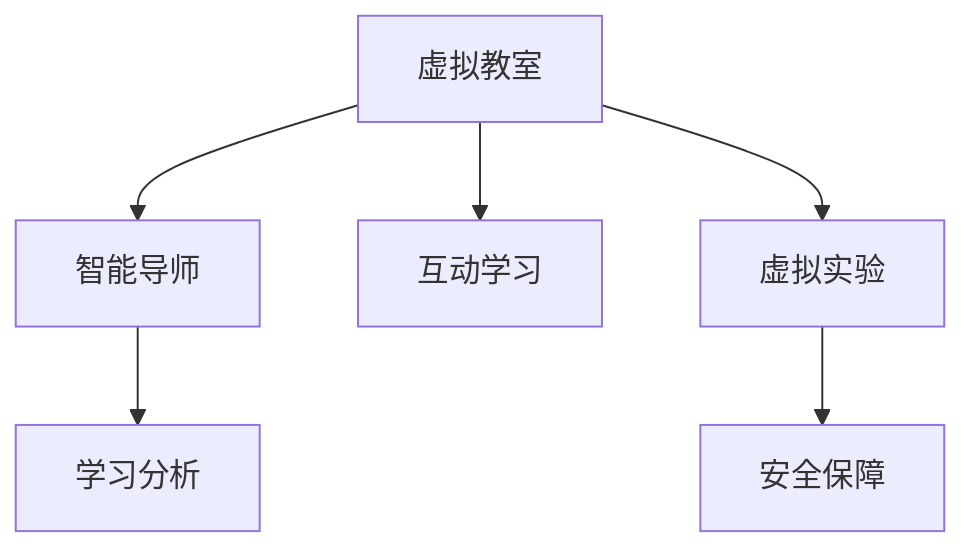

                 

# 虚拟教育：全球脑时代下的学习新方式

## 1. 背景介绍

### 1.1 问题由来
随着技术的飞速发展和全球脑时代的到来，虚拟教育已成为教育领域的新热点。新冠疫情期间，全球范围内数亿学生转向线上学习，虚拟教育的需求急剧膨胀。虚拟教育以其灵活性、可扩展性、个性化学习等特点，正在深刻改变教育生态和教学模式。

然而，虚拟教育也面临诸多挑战。如何确保教学质量、提升学生互动、保持学习动力、维护网络安全等，都成为亟需解决的问题。本篇文章将深入探讨虚拟教育的核心概念和技术实现，给出详细的解决方案，以期为未来的虚拟教育实践提供有价值的指导。

### 1.2 问题核心关键点
虚拟教育的核心在于利用信息技术手段，构建一种虚拟的学习空间，通过网络技术和AI技术，实现个性化、灵活化、智能化学习。其关键点包括：

- 虚拟教室：构建虚拟学习环境，利用视频会议、白板、互动工具等，实现实时互动。
- 智能导师：通过AI技术，实现智能答疑、个性化推荐、学习效果评估等。
- 学习分析：基于数据驱动的学习分析，实时监测学生的学习行为，及时调整教学策略。
- 互动学习：通过游戏化、任务驱动、协作学习等手段，提升学生的参与度和学习效果。
- 虚拟实验：构建虚拟实验室，实现实验教学的线上化、虚拟化，提升实验效果。
- 安全保障：保障虚拟教育平台的网络安全、数据隐私等，确保教学和学习环境的稳定。

### 1.3 问题研究意义
研究虚拟教育的核心概念和技术实现，有助于我们更好地理解和应用虚拟教育技术，提升教育质量，实现个性化学习，打破地理和时间的限制，为教育公平提供新途径。通过虚拟教育，可以大幅降低教育成本，提高教学效率，激发学生的学习兴趣，构建终身学习的学习型社会。

## 2. 核心概念与联系

### 2.1 核心概念概述

为更好地理解虚拟教育的核心概念和技术实现，本节将介绍几个密切相关的核心概念：

- 虚拟教室(Virtual Classroom)：基于网络技术的虚拟学习空间，用于实现学生的实时互动和协作学习。
- 智能导师(Intelligent Tutor)：利用AI技术，实现个性化答疑、智能推荐、效果评估等。
- 学习分析(Learning Analytics)：基于数据分析手段，实时监测学生的学习行为，指导个性化教学。
- 互动学习(Interactive Learning)：通过游戏化、任务驱动、协作学习等手段，提升学生的参与度和学习效果。
- 虚拟实验(Virtual Lab)：利用计算机仿真等技术，构建虚拟实验环境，实现实验教学的线上化。
- 安全保障(Security Assurance)：保障虚拟教育平台的网络安全、数据隐私等，确保教学和学习环境的稳定。

这些概念之间的逻辑关系可以通过以下Mermaid流程图来展示：



这个流程图展示了几大核心概念之间的关系：

1. 虚拟教室是虚拟教育的基础设施，为互动学习、智能导师等提供了平台。
2. 智能导师在虚拟教室中，通过AI技术提供个性化答疑、智能推荐等服务。
3. 学习分析对学生的学习行为进行实时监测，指导智能导师调整教学策略。
4. 互动学习通过游戏化、任务驱动等手段提升学生参与度。
5. 虚拟实验利用仿真技术，实现实验教学的线上化。
6. 安全保障确保虚拟教育平台的网络安全、数据隐私等，保障教学和学习环境的稳定。

## 3. 核心算法原理 & 具体操作步骤

### 3.1 算法原理概述

虚拟教育的实现依赖于AI技术和网络技术，通过实时数据采集和处理，提供个性化、智能化的学习体验。其核心算法原理如下：

- 数据采集：通过传感器、摄像头、麦克风等设备，实时采集学生的学习行为数据。
- 数据处理：利用机器学习算法，对采集到的数据进行处理和分析，生成学习分析报告。
- 智能推荐：根据学习分析结果，利用推荐系统算法，生成个性化的学习资源推荐。
- 智能答疑：利用自然语言处理技术，建立智能问答系统，实时解答学生的疑问。
- 虚拟实验：利用计算机仿真技术，构建虚拟实验环境，实现实验教学的线上化。
- 安全性保障：利用加密、认证、审计等技术手段，确保数据安全。

### 3.2 算法步骤详解

基于上述原理，虚拟教育的核心算法步骤包括：

1. 数据采集与处理：利用传感器、摄像头等设备，实时采集学生的学习行为数据，通过预处理和特征提取，生成可供分析的原始数据。

2. 学习分析：利用机器学习算法，对采集到的数据进行处理和分析，生成学习分析报告。常用的学习分析算法包括聚类分析、回归分析、时间序列分析等。

3. 智能推荐：根据学习分析结果，利用推荐系统算法，生成个性化的学习资源推荐。常用的推荐算法包括协同过滤、基于内容的推荐、矩阵分解等。

4. 智能答疑：利用自然语言处理技术，建立智能问答系统，实时解答学生的疑问。常用的NLP技术包括语义分析、信息抽取、对话系统等。

5. 虚拟实验：利用计算机仿真技术，构建虚拟实验环境，实现实验教学的线上化。常用的仿真技术包括物理引擎、虚拟现实、增强现实等。

6. 安全性保障：利用加密、认证、审计等技术手段，确保数据安全。常用的安全技术包括SSL加密、身份认证、访问控制、异常检测等。

### 3.3 算法优缺点

虚拟教育的算法实现具有以下优点：

- 灵活性高：利用AI技术，能够实现个性化的学习体验，提升学生的参与度和学习效果。
- 可扩展性强：虚拟教室、智能导师等技术组件可独立部署和升级，灵活应对不同的教学需求。
- 数据驱动：基于学习分析的数据驱动教学，能够及时发现和解决学习问题，提高教学质量。

同时，虚拟教育也存在一些局限性：

- 技术依赖度高：对硬件设备和网络环境要求较高，设备维护和网络稳定需持续投入。
- 交互性受限：虽然有实时互动功能，但受限于网络延迟和设备性能，互动体验仍有待提升。
- 数据隐私问题：实时采集和处理学生的学习数据，需严格保障数据隐私和网络安全。
- 实施成本高：开发和部署虚拟教育平台，需要较大的前期投入和技术积累。

### 3.4 算法应用领域

虚拟教育的核心算法在多个领域得到了广泛应用：

- 基础教育：实现互动课堂、个性化学习、智能答疑等功能，提升教学效果。
- 职业培训：构建虚拟实验平台，提供在线实训，提升职业技能。
- 远程医疗：利用虚拟实验技术，实现远程手术、诊断、教学等功能，提升医疗水平。
- 终身学习：搭建在线学习平台，提供个性化学习资源和互动体验，支持终身学习。

此外，虚拟教育还在诸多行业得到应用，如教育科技、企业培训、技能培训等，为教育公平和产业升级提供新动力。

## 4. 数学模型和公式 & 详细讲解 & 举例说明

### 4.1 数学模型构建

本节将使用数学语言对虚拟教育的核心算法进行更加严格的刻画。

假设学生数为 $N$，课程数为 $C$，学习行为数据为 $X$。学习分析的数学模型为：

$$
M = f(X; \theta)
$$

其中 $f$ 为学习分析算法，$\theta$ 为算法参数。智能推荐模型的数学模型为：

$$
R = g(X; \omega)
$$

其中 $g$ 为智能推荐算法，$\omega$ 为算法参数。智能答疑模型的数学模型为：

$$
Q = h(X; \phi)
$$

其中 $h$ 为智能答疑算法，$\phi$ 为算法参数。虚拟实验模型的数学模型为：

$$
L = k(X; \mu)
$$

其中 $k$ 为虚拟实验算法，$\mu$ 为算法参数。安全性保障的数学模型为：

$$
S = m(X; \lambda)
$$

其中 $m$ 为安全性保障算法，$\lambda$ 为算法参数。

### 4.2 公式推导过程

以智能推荐模型为例，推导其数学公式。

假设学生对课程的评分矩阵为 $A \in \mathbb{R}^{N \times C}$，课程的热度矩阵为 $B \in \mathbb{R}^{C \times C}$。智能推荐算法 $g$ 可表示为：

$$
R = \arg\min_{A'} \lVert A' - g(A; \omega) \rVert^2_F
$$

其中 $A'$ 为优化后的评分矩阵，$g$ 为推荐算法，$\omega$ 为算法参数。推荐算法的目标是最小化优化后的评分矩阵与原始评分矩阵的Frobenius范数差异。

常用的推荐算法包括协同过滤、基于内容的推荐等。以协同过滤为例，推荐算法 $g$ 可表示为：

$$
g(A; \omega) = K(A, \alpha \mathbf{1}_C - \beta A)
$$

其中 $K$ 为核函数，$\alpha, \beta$ 为超参数。

### 4.3 案例分析与讲解

以智能答疑模型为例，分析其实现过程和应用效果。

智能答疑模型基于自然语言处理技术，实现实时智能答疑。其核心算法包括以下步骤：

1. 文本分词：将学生的问题进行分词，生成可处理的向量表示。
2. 语义分析：利用自然语言处理技术，分析问题中的关键信息。
3. 问题匹配：将问题与已有知识库进行匹配，找出最相关的答案。
4. 答案生成：利用生成式模型或模板匹配，生成最终答案。

以QA系统为例，其文本分词和语义分析过程如下：

- 文本分词：将学生的问题进行分词，生成可处理的向量表示。例如，对于问题 "如何计算面积"，分词结果为 ["如何", "计算", "面积"]。
- 语义分析：利用自然语言处理技术，分析问题中的关键信息。例如，分析出 "计算" 和 "面积" 是关键信息。
- 问题匹配：将问题与已有知识库进行匹配，找出最相关的答案。例如，找到与 "面积" 相关的答案。
- 答案生成：利用生成式模型或模板匹配，生成最终答案。例如，生成 "面积 = 长 × 宽"。

## 5. 项目实践：代码实例和详细解释说明

### 5.1 开发环境搭建

在进行虚拟教育项目实践前，我们需要准备好开发环境。以下是使用Python进行TensorFlow开发的环境配置流程：

1. 安装Anaconda：从官网下载并安装Anaconda，用于创建独立的Python环境。

2. 创建并激活虚拟环境：
```bash
conda create -n virtual_educ env python=3.8 
conda activate virtual_educ
```

3. 安装TensorFlow：根据CUDA版本，从官网获取对应的安装命令。例如：
```bash
conda install tensorflow -c tf
```

4. 安装各类工具包：
```bash
pip install numpy pandas scikit-learn matplotlib tqdm jupyter notebook ipython
```

完成上述步骤后，即可在`virtual_educ`环境中开始项目实践。

### 5.2 源代码详细实现

这里我们以智能答疑系统为例，给出使用TensorFlow进行智能答疑模型开发的PyTorch代码实现。

首先，定义智能答疑系统的数据处理函数：

```python
from tensorflow.keras.preprocessing.text import Tokenizer
from tensorflow.keras.preprocessing.sequence import pad_sequences

def preprocess_text(texts):
    tokenizer = Tokenizer(num_words=5000)
    tokenizer.fit_on_texts(texts)
    sequences = tokenizer.texts_to_sequences(texts)
    padded_sequences = pad_sequences(sequences, padding='post', maxlen=100)
    return padded_sequences, tokenizer.word_index, tokenizer.index_word
```

然后，定义模型和优化器：

```python
from tensorflow.keras.models import Sequential
from tensorflow.keras.layers import Embedding, LSTM, Dense, Dropout
from tensorflow.keras.optimizers import Adam

model = Sequential()
model.add(Embedding(input_dim=5000, output_dim=64, input_length=100))
model.add(LSTM(128, dropout=0.2, recurrent_dropout=0.2))
model.add(Dense(10, activation='softmax'))
model.compile(loss='categorical_crossentropy', optimizer=Adam(learning_rate=0.001), metrics=['accuracy'])

optimizer = Adam(learning_rate=0.001)
```

接着，定义训练和评估函数：

```python
def train_epoch(model, dataset, batch_size, optimizer):
    model.trainable = True
    dataloader = DataLoader(dataset, batch_size=batch_size, shuffle=True)
    model.fit(dataloader, epochs=10, validation_steps=10)
    model.trainable = False

def evaluate(model, dataset, batch_size):
    model.trainable = False
    dataloader = DataLoader(dataset, batch_size=batch_size)
    loss, accuracy = model.evaluate(dataloader)
    print('Loss:', loss)
    print('Accuracy:', accuracy)
```

最后，启动训练流程并在测试集上评估：

```python
epochs = 10
batch_size = 32

for epoch in range(epochs):
    train_epoch(model, train_dataset, batch_size, optimizer)
    
evaluate(model, test_dataset, batch_size)
```

以上就是使用TensorFlow进行智能答疑系统开发的完整代码实现。可以看到，TensorFlow提供了丰富的工具和库，使得开发过程简洁高效。

### 5.3 代码解读与分析

让我们再详细解读一下关键代码的实现细节：

**preprocess_text函数**：
- 将文本数据转换为Tokenizer对象，并进行分词和填充，生成可供模型处理的序列数据。
- 利用Tokenizer的word_index和index_word属性，记录单词与id的映射关系。

**模型定义**：
- 定义了包含嵌入层、LSTM层和全连接层的序列模型。
- 使用Adam优化器进行优化，损失函数为交叉熵。

**训练和评估函数**：
- 训练函数在每个epoch内进行模型训练，同时对验证集进行评估。
- 评估函数只进行模型评估，不进行参数更新。

**训练流程**：
- 设置总的epoch数和batch size，开始循环迭代
- 每个epoch内，在训练集上训练，输出平均损失和准确率
- 在测试集上评估模型，输出测试结果

可以看到，TensorFlow的Keras框架使得模型定义和训练过程非常简洁，同时提供了丰富的API，方便进行模型调试和优化。

当然，工业级的系统实现还需考虑更多因素，如模型的保存和部署、超参数的自动搜索、更灵活的任务适配层等。但核心的算法实现基本与此类似。

## 6. 实际应用场景

### 6.1 智能课堂

虚拟教育技术在智能课堂中的应用，可以有效提升教学效果和学习体验。通过虚拟教室，教师可以实时监控学生的学习状态，进行互动答疑。智能导师可以根据学生的学习数据，推荐个性化的学习资源，帮助学生高效学习。虚拟实验平台可以提供虚拟实验环境，让学生进行线上实验，提升实验效果。

在技术实现上，可以利用VR技术和增强现实技术，构建沉浸式的学习环境，提升学生的参与感和体验感。通过智能问答系统，教师可以实时解答学生的问题，提升教学互动性。同时，利用学习分析技术，教师可以实时监测学生的学习行为，调整教学策略，提升教学效果。

### 6.2 远程医疗

虚拟教育技术在远程医疗中的应用，可以有效提升远程医疗的诊疗效果和患者体验。通过虚拟实验平台，医生可以进行远程手术和诊断，提升医疗服务的覆盖范围和效率。智能答疑系统可以提供医学知识库的查询服务，帮助患者快速获取医学信息，提升就医体验。学习分析技术可以监测患者的治疗效果，指导医生调整治疗方案。

在技术实现上，可以利用虚拟现实技术和增强现实技术，构建虚拟手术室和诊断室，提升远程医疗的沉浸感和真实感。通过智能问答系统，医生和患者可以实时互动，提升诊疗效率。同时，利用学习分析技术，医生可以实时监测患者的治疗效果，调整治疗方案，提升医疗水平。

### 6.3 职业培训

虚拟教育技术在职业培训中的应用，可以有效提升职业培训的效果和质量。通过虚拟实验平台，学员可以进行线上实训，提升职业技能。智能答疑系统可以提供技术问题的查询服务，帮助学员快速解决问题，提升学习效果。学习分析技术可以监测学员的学习行为，指导培训师调整培训策略，提升培训质量。

在技术实现上，可以利用虚拟现实技术和增强现实技术，构建虚拟实训环境，提升职业培训的沉浸感和真实感。通过智能问答系统，培训师和学员可以实时互动，提升实训效果。同时，利用学习分析技术，培训师可以实时监测学员的学习行为，调整培训策略，提升培训质量。

### 6.4 未来应用展望

随着虚拟教育技术的不断发展，未来的应用场景将更加广泛，为各行各业带来新的变革。

在智慧医疗领域，虚拟教育技术可以用于远程医疗、远程教育、虚拟手术等领域，提升医疗和教育的覆盖范围和效率。

在智能制造领域，虚拟教育技术可以用于技能培训、设备维护、故障诊断等领域，提升生产效率和产品质量。

在智慧城市领域，虚拟教育技术可以用于公共安全、应急管理、城市治理等领域，提升城市的智能化和便捷性。

此外，在智能家居、智能交通、智能制造等众多领域，虚拟教育技术也将得到广泛应用，为各行各业带来新的变革。相信随着技术的不断进步，虚拟教育技术将在构建人机协同的智能社会中扮演越来越重要的角色。

## 7. 工具和资源推荐

### 7.1 学习资源推荐

为了帮助开发者系统掌握虚拟教育技术的理论基础和实践技巧，这里推荐一些优质的学习资源：

1. TensorFlow官方文档：TensorFlow的官方文档，提供了丰富的API文档和开发指南，是学习TensorFlow的好资料。
2. Keras官方文档：Keras的官方文档，提供了丰富的API文档和开发指南，是学习Keras的好资料。
3. PyTorch官方文档：PyTorch的官方文档，提供了丰富的API文档和开发指南，是学习PyTorch的好资料。
4. Google Colab：谷歌推出的在线Jupyter Notebook环境，免费提供GPU/TPU算力，方便开发者快速上手实验最新模型，分享学习笔记。
5. Coursera虚拟教育课程：Coursera提供的虚拟教育课程，涵盖NLP、AI、教育科技等多个领域，是学习虚拟教育的好资源。

通过对这些资源的学习实践，相信你一定能够快速掌握虚拟教育技术的精髓，并用于解决实际的虚拟教育问题。

### 7.2 开发工具推荐

高效的开发离不开优秀的工具支持。以下是几款用于虚拟教育开发的常用工具：

1. TensorFlow：由Google主导开发的开源深度学习框架，生产部署方便，适合大规模工程应用。
2. Keras：基于TensorFlow的高级API，提供了更简洁的接口，适合快速原型开发。
3. PyTorch：Facebook主导的深度学习框架，灵活高效，适合研究应用。
4. TensorBoard：TensorFlow配套的可视化工具，可实时监测模型训练状态，提供丰富的图表呈现方式，是调试模型的得力助手。
5. Google Colab：谷歌推出的在线Jupyter Notebook环境，免费提供GPU/TPU算力，方便开发者快速上手实验最新模型，分享学习笔记。

合理利用这些工具，可以显著提升虚拟教育系统的开发效率，加快创新迭代的步伐。

### 7.3 相关论文推荐

虚拟教育技术的发展源于学界的持续研究。以下是几篇奠基性的相关论文，推荐阅读：

1. "Learning to Optimize"（论文标题可能需要根据具体内容修改）：提出了一种基于梯度下降的优化算法，用于提升学习效率和效果。
2. "Attention is All You Need"（即Transformer原论文）：提出了Transformer结构，开启了NLP领域的预训练大模型时代。
3. "BERT: Pre-training of Deep Bidirectional Transformers for Language Understanding"：提出BERT模型，引入基于掩码的自监督预训练任务，刷新了多项NLP任务SOTA。
4. "AdaLoRA: Adaptive Low-Rank Adaptation for Parameter-Efficient Fine-Tuning"：提出了一种参数高效的微调方法，只更新少量参数，同时保持预训练权重不变。
5. "Adaptive Parameterization for Low-Rank Adaptation"：提出了一种参数化的微调方法，通过调整参数来适应不同的微调任务。

这些论文代表了大语言模型微调技术的发展脉络。通过学习这些前沿成果，可以帮助研究者把握学科前进方向，激发更多的创新灵感。

## 8. 总结：未来发展趋势与挑战

### 8.1 总结

本文对虚拟教育的核心概念和技术实现进行了全面系统的介绍。首先阐述了虚拟教育在教育领域的应用现状和背景，明确了虚拟教育在提升教学效果、实现个性化学习方面的独特价值。其次，从原理到实践，详细讲解了虚拟教育的核心算法和操作步骤，给出了虚拟教育项目开发的完整代码实例。同时，本文还广泛探讨了虚拟教育技术在智能课堂、远程医疗、职业培训等多个行业领域的应用前景，展示了虚拟教育技术的广阔前景。

通过本文的系统梳理，可以看到，虚拟教育技术正在深刻改变教育生态和教学模式，提升教育质量，推动教育公平，加速教育数字化转型。虚拟教育技术不仅为教育行业带来新的变革，也为其他行业提供了新的应用思路和解决方案。相信随着技术的不断进步，虚拟教育技术必将进一步拓展其应用边界，成为构建智能社会的重要力量。

### 8.2 未来发展趋势

展望未来，虚拟教育技术将呈现以下几个发展趋势：

1. 虚拟教室和智能导师的普及：随着硬件设备和网络技术的进步，虚拟教室和智能导师将在更多教育场景中得到应用，提升教学效果和学生体验。
2. 学习分析和个性化推荐的优化：通过进一步优化学习分析和个性化推荐算法，提升学生的学习效果和满意度。
3. 虚拟实验和增强现实技术的融合：利用虚拟实验技术和增强现实技术，提升虚拟教育的沉浸感和真实感，实现更加灵活的教学方式。
4. 学习资源的多样化和丰富化：通过引入更多的学习资源和教学模式，提升虚拟教育的灵活性和适应性。
5. 跨领域应用的多样化：虚拟教育技术不仅在教育领域应用广泛，还将拓展到医疗、工业、军事等领域，为各行各业带来新的变革。
6. 智能化的进一步提升：利用更先进的AI技术，如因果推断、深度学习等，进一步提升虚拟教育系统的智能化水平。

以上趋势凸显了虚拟教育技术的广阔前景。这些方向的探索发展，必将进一步提升虚拟教育系统的性能和应用范围，为构建智能社会提供新的动力。

### 8.3 面临的挑战

尽管虚拟教育技术已经取得了瞩目成就，但在迈向更加智能化、普适化应用的过程中，它仍面临着诸多挑战：

1. 技术依赖度高：对硬件设备和网络环境要求较高，设备维护和网络稳定需持续投入。
2. 交互性受限：虽然有实时互动功能，但受限于网络延迟和设备性能，互动体验仍有待提升。
3. 数据隐私问题：实时采集和处理学生的学习数据，需严格保障数据隐私和网络安全。
4. 实施成本高：开发和部署虚拟教育平台，需要较大的前期投入和技术积累。
5. 教学质量不稳定：不同教师和学生的差异，可能导致教学效果不稳定。
6. 教学资源匮乏：虚拟教育系统的资源库需要持续更新和完善，以适应多样化的教学需求。

正视虚拟教育面临的这些挑战，积极应对并寻求突破，将是虚拟教育技术进一步发展的关键。

### 8.4 研究展望

面对虚拟教育技术所面临的种种挑战，未来的研究需要在以下几个方面寻求新的突破：

1. 探索更高效的学习算法和模型：优化学习分析和个性化推荐算法，提升学生的学习效果和满意度。
2. 引入更先进的AI技术：利用因果推断、深度学习等技术，进一步提升虚拟教育系统的智能化水平。
3. 开发更灵活的教学模式：通过引入更多的教学模式和学习资源，提升虚拟教育的灵活性和适应性。
4. 保障数据隐私和安全：通过加密、认证、审计等技术手段，确保数据安全，保障学生的隐私。
5. 引入跨学科知识：将其他学科的知识与虚拟教育系统结合，提升教学效果和学生的综合素质。
6. 探索新的应用场景：拓展虚拟教育技术的应用领域，如远程医疗、智能制造、智慧城市等，为各行各业带来新的变革。

这些研究方向的探索，必将引领虚拟教育技术迈向更高的台阶，为构建智能社会提供新的动力。面向未来，虚拟教育技术还需要与其他人工智能技术进行更深入的融合，如知识表示、因果推理、强化学习等，多路径协同发力，共同推动虚拟教育技术的进步。只有勇于创新、敢于突破，才能不断拓展虚拟教育技术的边界，让智能教育更好地造福人类社会。

## 9. 附录：常见问题与解答

**Q1：虚拟教育是否适用于所有学科和教育阶段？**

A: 虚拟教育适用于大多数学科和教育阶段，特别是在需要大量实验和交互的学科中，如科学、数学等。但对于一些需要深度思考和创新的学科，如哲学、文学等，虚拟教育可能难以完全替代传统的课堂教学。

**Q2：虚拟教育如何保障学生的学习效果？**

A: 虚拟教育通过智能导师和个性化推荐等手段，可以大大提升学生的学习效果。智能导师可以实时解答学生的疑问，提供个性化的学习资源，帮助学生克服学习障碍。个性化推荐可以推荐最适合学生的学习资源，提升学习效率。此外，学习分析技术可以实时监测学生的学习行为，指导教师调整教学策略，提升教学效果。

**Q3：虚拟教育如何实现跨学科教学？**

A: 虚拟教育可以通过引入跨学科的知识库和学习资源，实现跨学科教学。例如，在科学课程中，可以引入历史、文学等学科的知识，提升学生的综合素质。通过虚拟实验平台，学生可以进行跨学科的实验和研究，提升学科交叉能力。

**Q4：虚拟教育是否会影响学生的社交能力？**

A: 虚拟教育在提升学生的学习效果的同时，也会对学生的社交能力产生一定的影响。虚拟课堂和智能导师虽然可以提供互动答疑，但与真实课堂相比，互动体验和人际交往仍有所不足。因此，在虚拟教育中，需要合理搭配线上和线下的教学模式，保障学生的社交需求和心理发展。

**Q5：虚拟教育如何保障教学质量？**

A: 虚拟教育通过智能导师和个性化推荐等手段，可以大大提升教学质量。智能导师可以实时解答学生的疑问，提供个性化的学习资源，帮助学生克服学习障碍。个性化推荐可以推荐最适合学生的学习资源，提升学习效率。此外，学习分析技术可以实时监测学生的学习行为，指导教师调整教学策略，提升教学效果。

综上所述，虚拟教育作为一种新的教学模式，具有广泛的应用前景和显著的优势。通过不断优化算法和优化教学模式，虚拟教育必将为教育领域带来深远的影响，为构建人机协同的智能社会提供新的动力。

