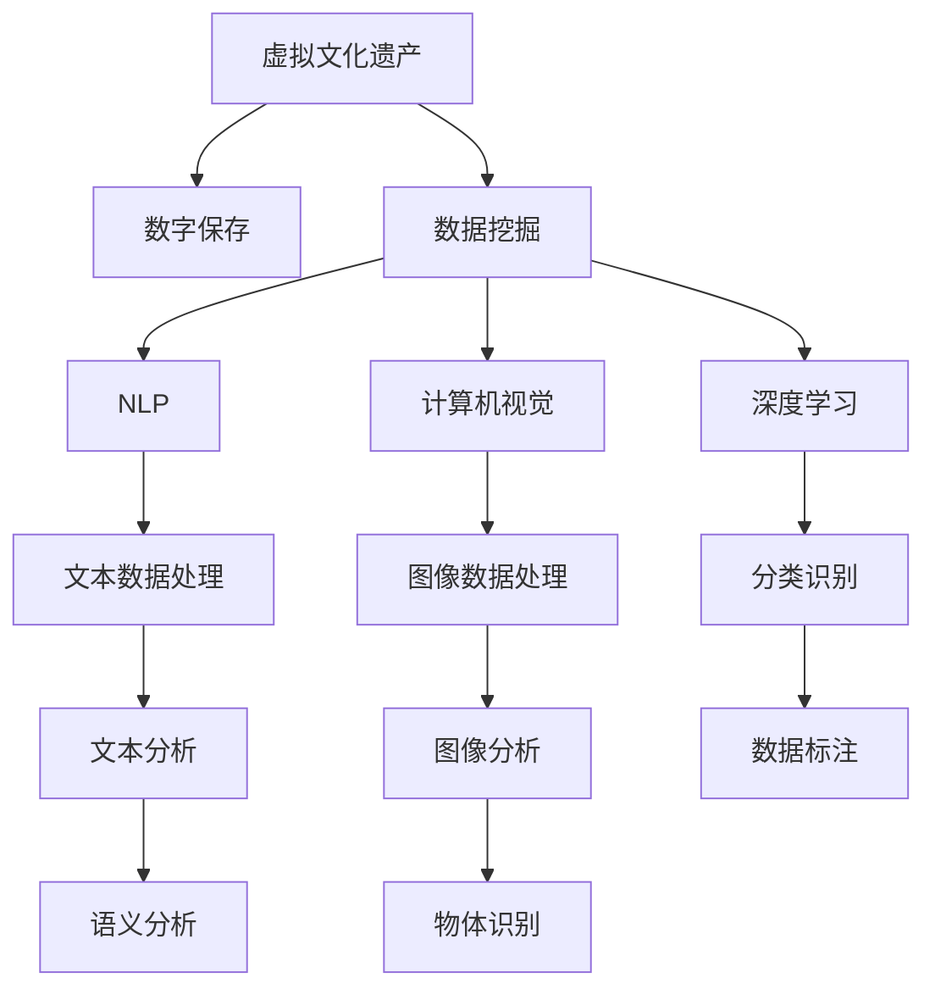

                 

# 虚拟文化遗产保护:全球文明记忆的数字化保存

## 1. 背景介绍

### 1.1 问题由来
随着全球化的加速，文化遗产的保护成为了一个全球性的问题。传统上，文化遗产的保护主要是通过物理手段，如建立博物馆、设立保护区、修复和维护等。然而，这些方法在面对时间和空间的限制时显得力不从心。特别是对于一些不可移动的遗址，如古遗址、历史建筑、传统文化，物理保护的成本和难度都极高。

近年来，随着信息技术的飞速发展，数字技术为文化遗产的保护提供了新的途径。数字化的保存方式，不仅能够长期保存文化遗产信息，还能通过互联网实现跨越时空的传播和共享，极大地拓展了文化遗产保护的范围和深度。特别是在疫情影响下，传统文化活动受限，数字化保护显得尤为重要。

### 1.2 问题核心关键点
虚拟文化遗产保护的核心在于将文化遗产数字化，并进行有效的管理和利用。这需要依赖于以下几个关键点：
- 数字化数据的采集与处理：包括高分辨率的图像、3D扫描数据、文本记录、音频记录等。
- 数据管理和存储：构建高效的数据库系统，确保数据的长期保存和检索。
- 数据访问与共享：设计友好的用户界面，使全球用户能够方便地访问和使用文化遗产信息。
- 数据挖掘与分析：利用机器学习、数据挖掘等技术，挖掘出有价值的信息和知识。

这些关键点的协同工作，才能实现文化遗产的高效、低成本保护和传播。

### 1.3 问题研究意义
虚拟文化遗产保护的研究和实践具有以下重要意义：
- 长期保存：数字化保存可以超越物理形态的限制，实现文化遗产的长期保存和流传。
- 跨文化交流：通过互联网，不同文化背景的人们可以共享和交流文化遗产信息，促进文化多样性和理解。
- 教育和科研：数字化文化遗产为教育和科研提供了丰富的素材，有助于文化遗产的传承和创新。
- 经济增值：数字化的文化遗产资源，可以转化为商业资源，推动文化创意产业的发展。

## 2. 核心概念与联系

### 2.1 核心概念概述

为更好地理解虚拟文化遗产保护的方法和技术，本节将介绍几个密切相关的核心概念：

- **虚拟文化遗产**：通过数字化手段记录和重现的文化遗产，包括但不限于数字化的影像、文本、3D模型等。
- **数字保存(Digital Preservation)**：通过数字化技术对文化遗产进行记录、保存、管理和利用的过程。
- **数据挖掘(Data Mining)**：从大量数据中提取有价值信息的过程，常用于文化遗产数据的分析。
- **自然语言处理(Natural Language Processing, NLP)**：通过计算机技术处理和理解自然语言，常用于文本记录的数字化和分析。
- **计算机视觉(Computer Vision)**：利用计算机技术分析和理解图像、视频等视觉数据，常用于文化遗产的数字化采集和分析。
- **深度学习(Deep Learning)**：一种机器学习方法，能够从数据中自动学习特征，常用于文化遗产的数据分析和分类。

这些核心概念之间的逻辑关系可以通过以下Mermaid流程图来展示：



这个流程图展示了一系列核心概念及其之间的联系：

1. 虚拟文化遗产通过数字化手段进行保存。
2. 保存的数据需要进行挖掘，提取有价值的信息。
3. 挖掘的数据可以包括文本、图像等多种形式，需要分别进行处理。
4. 文本数据利用NLP技术进行数字化处理和分析。
5. 图像数据利用计算机视觉技术进行数字化采集和分析。
6. 分类识别和语义分析等深度学习技术，进一步挖掘数据的价值。

这些概念共同构成了虚拟文化遗产保护的框架，为实现文化遗产的高效、精准保存和利用提供了理论基础。

## 3. 核心算法原理 & 具体操作步骤

### 3.1 算法原理概述

虚拟文化遗产保护的算法原理主要涉及以下几个方面：

- **数字化采集**：通过高分辨率相机、3D扫描仪等设备，采集文化遗产的图像、3D模型等数据。
- **数据清洗与预处理**：对采集的数据进行清洗和预处理，去除噪声和失真。
- **数据标注与分类**：对数字化数据进行标注和分类，为后续分析和应用提供基础。
- **文本与图像分析**：利用NLP和计算机视觉技术，对文本和图像数据进行深入分析。
- **数据挖掘与知识发现**：通过数据挖掘算法，从大量数据中提取有价值的信息和知识。
- **数据存储与访问**：设计高效的数据库系统，确保数据的长期保存和检索。
- **数据传播与共享**：通过互联网和API等手段，实现数据的共享和传播。

### 3.2 算法步骤详解

虚拟文化遗产保护的具体操作步骤如下：

**Step 1: 准备数字采集设备**
- 根据文化遗产的特点选择合适的数字采集设备，如相机、3D扫描仪等。
- 确保设备的参数（如分辨率、帧率等）满足数字化保存的要求。

**Step 2: 数据采集与预处理**
- 对采集的数据进行预处理，包括去噪、校正、拼接等操作。
- 对文本数据进行OCR识别，转化为可处理的数字格式。

**Step 3: 数据标注与分类**
- 利用专业知识和工具对数字化数据进行标注，如名称、类别、时间等。
- 对标注后的数据进行分类，如按照文化、地域、历史时期等标准分类。

**Step 4: 文本与图像分析**
- 对文本数据进行NLP处理，提取关键字、实体等信息。
- 对图像数据进行计算机视觉处理，识别物体、场景等。

**Step 5: 数据挖掘与知识发现**
- 利用深度学习模型，对文本和图像数据进行分类、标注等操作。
- 通过数据挖掘算法，提取数据的统计特征和模式。

**Step 6: 数据存储与访问**
- 选择合适的数据库系统，如MySQL、PostgreSQL等，存储数字化数据。
- 设计友好的数据访问接口，使用户能够方便地访问和使用数据。

**Step 7: 数据传播与共享**
- 通过互联网和API接口，实现数据的共享和传播。
- 确保数据传播过程中的安全性和隐私保护。

### 3.3 算法优缺点

虚拟文化遗产保护的算法具有以下优点：
1. 长期保存：数字化保存可以超越物理形态的限制，实现文化遗产的长期保存和流传。
2. 跨文化交流：通过互联网，不同文化背景的人们可以共享和交流文化遗产信息，促进文化多样性和理解。
3. 教育和科研：数字化文化遗产为教育和科研提供了丰富的素材，有助于文化遗产的传承和创新。
4. 经济增值：数字化的文化遗产资源，可以转化为商业资源，推动文化创意产业的发展。

同时，该算法也存在一些局限性：
1. 数据质量依赖设备：采集设备的精度和性能对数字化保存质量有很大影响。
2. 数据量巨大：大规模文化遗产数字化需要处理大量的数据，对计算资源和存储资源要求较高。
3. 数据标准化问题：不同采集设备、不同标准的数据可能存在格式不统一的问题，需要进行预处理和标准化。
4. 数据隐私与安全：数字化文化遗产涉及大量敏感信息，需要确保数据的安全性和隐私保护。

### 3.4 算法应用领域

虚拟文化遗产保护算法在以下领域得到了广泛应用：

- **博物馆与档案馆**：数字化保存博物馆和档案馆的藏品，实现永久保存和共享。
- **历史建筑保护**：通过3D扫描和图像采集，实现历史建筑的保护和修复。
- **文化遗产修复**：利用数字化手段，辅助文化遗产的修复和保护。
- **教育与科研**：利用数字化文化遗产资源，推动教育和科研工作。
- **文化创意产业**：将数字化文化遗产转化为商业资源，推动文化创意产业的发展。

## 4. 数学模型和公式 & 详细讲解 & 举例说明

### 4.1 数学模型构建

本节将使用数学语言对虚拟文化遗产保护的数据处理和分析过程进行更加严格的刻画。

假设文化遗产数字化采集的数据集为 $D=\{(x_i,y_i)\}_{i=1}^N, x_i \in \mathcal{X}, y_i \in \mathcal{Y}$，其中 $\mathcal{X}$ 为输入空间，$\mathcal{Y}$ 为输出空间。

定义数字化数据采集过程为 $f: \mathcal{X} \rightarrow \mathcal{X}'$，其中 $\mathcal{X}'$ 为数字化后的数据空间。

数据预处理过程为 $g: \mathcal{X}' \rightarrow \mathcal{X}''$，其中 $\mathcal{X}''$ 为处理后的数据空间。

数据标注和分类过程为 $h: \mathcal{X}'' \rightarrow \mathcal{Y}$，其中 $\mathcal{Y}$ 为标注后的数据空间。

文本分析过程为 $m: \mathcal{X}'' \rightarrow \mathcal{Z}$，其中 $\mathcal{Z}$ 为文本处理后的特征空间。

图像分析过程为 $n: \mathcal{X}'' \rightarrow \mathcal{W}$，其中 $\mathcal{W}$ 为图像处理后的特征空间。

数据挖掘和知识发现过程为 $p: \mathcal{Z}, \mathcal{W} \rightarrow \mathcal{K}$，其中 $\mathcal{K}$ 为知识发现后的结果空间。

数据存储和访问过程为 $s: \mathcal{K} \rightarrow \mathcal{M}$，其中 $\mathcal{M}$ 为数据库存储后的空间。

数据传播和共享过程为 $r: \mathcal{M} \rightarrow \mathcal{O}$，其中 $\mathcal{O}$ 为共享后的数据空间。

### 4.2 公式推导过程

以下我们以文本数据处理为例，推导NLP中的文本分类公式及其梯度的计算公式。

假设模型 $M_{\theta}$ 在输入 $x$ 上的输出为 $\hat{y}=M_{\theta}(x) \in [0,1]$，表示样本属于正类的概率。真实标签 $y \in \{0,1\}$。则二分类交叉熵损失函数定义为：

$$
\ell(M_{\theta}(x),y) = -[y\log \hat{y} + (1-y)\log (1-\hat{y})]
$$

将其代入经验风险公式，得：

$$
\mathcal{L}(\theta) = -\frac{1}{N}\sum_{i=1}^N [y_i\log M_{\theta}(x_i)+(1-y_i)\log(1-M_{\theta}(x_i))]
$$

根据链式法则，损失函数对参数 $\theta_k$ 的梯度为：

$$
\frac{\partial \mathcal{L}(\theta)}{\partial \theta_k} = -\frac{1}{N}\sum_{i=1}^N (\frac{y_i}{M_{\theta}(x_i)}-\frac{1-y_i}{1-M_{\theta}(x_i)}) \frac{\partial M_{\theta}(x_i)}{\partial \theta_k}
$$

其中 $\frac{\partial M_{\theta}(x_i)}{\partial \theta_k}$ 可进一步递归展开，利用自动微分技术完成计算。

在得到损失函数的梯度后，即可带入参数更新公式，完成模型的迭代优化。重复上述过程直至收敛，最终得到适应数字化保护任务的最优模型参数 $\theta^*$。

## 5. 项目实践：代码实例和详细解释说明

### 5.1 开发环境搭建

在进行虚拟文化遗产保护实践前，我们需要准备好开发环境。以下是使用Python进行PyTorch开发的环境配置流程：

1. 安装Anaconda：从官网下载并安装Anaconda，用于创建独立的Python环境。

2. 创建并激活虚拟环境：
```bash
conda create -n pytorch-env python=3.8 
conda activate pytorch-env
```

3. 安装PyTorch：根据CUDA版本，从官网获取对应的安装命令。例如：
```bash
conda install pytorch torchvision torchaudio cudatoolkit=11.1 -c pytorch -c conda-forge
```

4. 安装Transformers库：
```bash
pip install transformers
```

5. 安装各类工具包：
```bash
pip install numpy pandas scikit-learn matplotlib tqdm jupyter notebook ipython
```

完成上述步骤后，即可在`pytorch-env`环境中开始虚拟文化遗产保护实践。

### 5.2 源代码详细实现

这里我们以一个虚拟文化遗产的数字化保存项目为例，给出使用Transformers库进行文本数据处理的PyTorch代码实现。

首先，定义文本数据处理函数：

```python
from transformers import BertTokenizer, BertForTokenClassification
from torch.utils.data import Dataset
import torch

class HeritageDataset(Dataset):
    def __init__(self, texts, tags, tokenizer, max_len=128):
        self.texts = texts
        self.tags = tags
        self.tokenizer = tokenizer
        self.max_len = max_len
        
    def __len__(self):
        return len(self.texts)
    
    def __getitem__(self, item):
        text = self.texts[item]
        tags = self.tags[item]
        
        encoding = self.tokenizer(text, return_tensors='pt', max_length=self.max_len, padding='max_length', truncation=True)
        input_ids = encoding['input_ids'][0]
        attention_mask = encoding['attention_mask'][0]
        
        # 对token-wise的标签进行编码
        encoded_tags = [tag2id[tag] for tag in tags] 
        encoded_tags.extend([tag2id['O']] * (self.max_len - len(encoded_tags)))
        labels = torch.tensor(encoded_tags, dtype=torch.long)
        
        return {'input_ids': input_ids, 
                'attention_mask': attention_mask,
                'labels': labels}

# 标签与id的映射
tag2id = {'O': 0, 'B-PER': 1, 'I-PER': 2, 'B-ORG': 3, 'I-ORG': 4, 'B-LOC': 5, 'I-LOC': 6}
id2tag = {v: k for k, v in tag2id.items()}

# 创建dataset
tokenizer = BertTokenizer.from_pretrained('bert-base-cased')

train_dataset = HeritageDataset(train_texts, train_tags, tokenizer)
dev_dataset = HeritageDataset(dev_texts, dev_tags, tokenizer)
test_dataset = HeritageDataset(test_texts, test_tags, tokenizer)
```

然后，定义模型和优化器：

```python
from transformers import BertForTokenClassification, AdamW

model = BertForTokenClassification.from_pretrained('bert-base-cased', num_labels=len(tag2id))

optimizer = AdamW(model.parameters(), lr=2e-5)
```

接着，定义训练和评估函数：

```python
from torch.utils.data import DataLoader
from tqdm import tqdm
from sklearn.metrics import classification_report

device = torch.device('cuda') if torch.cuda.is_available() else torch.device('cpu')
model.to(device)

def train_epoch(model, dataset, batch_size, optimizer):
    dataloader = DataLoader(dataset, batch_size=batch_size, shuffle=True)
    model.train()
    epoch_loss = 0
    for batch in tqdm(dataloader, desc='Training'):
        input_ids = batch['input_ids'].to(device)
        attention_mask = batch['attention_mask'].to(device)
        labels = batch['labels'].to(device)
        model.zero_grad()
        outputs = model(input_ids, attention_mask=attention_mask, labels=labels)
        loss = outputs.loss
        epoch_loss += loss.item()
        loss.backward()
        optimizer.step()
    return epoch_loss / len(dataloader)

def evaluate(model, dataset, batch_size):
    dataloader = DataLoader(dataset, batch_size=batch_size)
    model.eval()
    preds, labels = [], []
    with torch.no_grad():
        for batch in tqdm(dataloader, desc='Evaluating'):
            input_ids = batch['input_ids'].to(device)
            attention_mask = batch['attention_mask'].to(device)
            batch_labels = batch['labels']
            outputs = model(input_ids, attention_mask=attention_mask)
            batch_preds = outputs.logits.argmax(dim=2).to('cpu').tolist()
            batch_labels = batch_labels.to('cpu').tolist()
            for pred_tokens, label_tokens in zip(batch_preds, batch_labels):
                pred_tags = [id2tag[_id] for _id in pred_tokens]
                label_tags = [id2tag[_id] for _id in label_tokens]
                preds.append(pred_tags[:len(label_tags)])
                labels.append(label_tags)
                
    print(classification_report(labels, preds))
```

最后，启动训练流程并在测试集上评估：

```python
epochs = 5
batch_size = 16

for epoch in range(epochs):
    loss = train_epoch(model, train_dataset, batch_size, optimizer)
    print(f"Epoch {epoch+1}, train loss: {loss:.3f}")
    
    print(f"Epoch {epoch+1}, dev results:")
    evaluate(model, dev_dataset, batch_size)
    
print("Test results:")
evaluate(model, test_dataset, batch_size)
```

以上就是使用PyTorch对文本数据进行数字化处理的完整代码实现。可以看到，得益于Transformers库的强大封装，我们可以用相对简洁的代码完成文本数据的处理和分类。

### 5.3 代码解读与分析

让我们再详细解读一下关键代码的实现细节：

**HeritageDataset类**：
- `__init__`方法：初始化文本、标签、分词器等关键组件。
- `__len__`方法：返回数据集的样本数量。
- `__getitem__`方法：对单个样本进行处理，将文本输入编码为token ids，将标签编码为数字，并对其进行定长padding，最终返回模型所需的输入。

**tag2id和id2tag字典**：
- 定义了标签与数字id之间的映射关系，用于将token-wise的预测结果解码回真实的标签。

**训练和评估函数**：
- 使用PyTorch的DataLoader对数据集进行批次化加载，供模型训练和推理使用。
- 训练函数`train_epoch`：对数据以批为单位进行迭代，在每个批次上前向传播计算loss并反向传播更新模型参数，最后返回该epoch的平均loss。
- 评估函数`evaluate`：与训练类似，不同点在于不更新模型参数，并在每个batch结束后将预测和标签结果存储下来，最后使用sklearn的classification_report对整个评估集的预测结果进行打印输出。

**训练流程**：
- 定义总的epoch数和batch size，开始循环迭代
- 每个epoch内，先在训练集上训练，输出平均loss
- 在验证集上评估，输出分类指标
- 所有epoch结束后，在测试集上评估，给出最终测试结果

可以看到，PyTorch配合Transformers库使得文本数据处理和分类的代码实现变得简洁高效。开发者可以将更多精力放在数据处理、模型改进等高层逻辑上，而不必过多关注底层的实现细节。

当然，工业级的系统实现还需考虑更多因素，如模型的保存和部署、超参数的自动搜索、更灵活的任务适配层等。但核心的微调范式基本与此类似。

## 6. 实际应用场景

### 6.1 虚拟博物馆
虚拟博物馆是一种典型的虚拟文化遗产保护应用场景。通过数字化技术，博物馆可以将展品的高分辨率图像、3D模型、历史文档等数据进行采集和处理，通过互联网向全球用户展示。

在技术实现上，可以设计友好的用户界面，使用户能够方便地浏览虚拟博物馆的展品。通过增强现实(AR)技术，用户还可以在虚拟环境中进行互动，增强体验感。

### 6.2 历史建筑保护
历史建筑的数字化保护也是虚拟文化遗产保护的重要方向。通过对建筑物的3D扫描和图像采集，可以对建筑物进行精确的数字化重现，便于后期的修复和保护。

在技术实现上，可以利用计算机视觉技术对建筑物的3D模型进行分类、标注，提取建筑物的关键特征。通过可视化技术，用户可以直观地看到建筑物的结构信息，辅助修复和保护工作。

### 6.3 文化遗产修复
文化遗产修复是虚拟文化遗产保护的重要应用之一。通过数字化手段，可以对受损的文化遗产进行精确的数字化重现，便于修复工作的开展。

在技术实现上，可以结合计算机视觉和深度学习技术，对文化遗产的图像数据进行分类、标注，提取受损区域和修复信息。通过虚拟现实(VR)技术，用户可以在虚拟环境中进行修复操作，增强修复效果。

### 6.4 未来应用展望
随着虚拟文化遗产保护技术的不断发展，未来将呈现以下几个趋势：

1. **跨文化交流的深化**：通过虚拟文化遗产保护，不同文化背景的人们可以更加深入地交流和理解，促进文化多样性和全球化。
2. **数字化教育的普及**：虚拟文化遗产保护为教育和科研提供了丰富的素材，推动了数字化教育的普及和发展。
3. **文化创意产业的繁荣**：数字化的文化遗产资源可以转化为商业资源，推动文化创意产业的发展，带来更多的经济效益。
4. **智能化的维护和修复**：结合智能技术，实现文化遗产的智能化维护和修复，提高效率和精度。

## 7. 工具和资源推荐
### 7.1 学习资源推荐

为了帮助开发者系统掌握虚拟文化遗产保护的理论基础和实践技巧，这里推荐一些优质的学习资源：

1. **《数字保存与文化遗产保护》系列博文**：由虚拟文化遗产保护专家撰写，深入浅出地介绍了数字化保存和文化遗产保护的理论基础和实践方法。

2. **《自然语言处理概论》课程**：斯坦福大学开设的自然语言处理课程，提供了丰富的教学视频和资料，带你入门NLP领域的基础知识。

3. **《数字保存与文化遗产保护》书籍**：全面介绍了数字化保存和文化遗产保护的理论和方法，适合进一步深入学习。

4. **《自然语言处理与计算机视觉》书籍**：详细介绍了NLP和计算机视觉的基础知识和应用实例，是虚拟文化遗产保护中常用的技术手段。

5. **OpenCV官方文档**：计算机视觉库OpenCV的官方文档，提供了大量的代码示例和详细的使用指南，是进行图像处理和分析的重要资源。

通过对这些资源的学习实践，相信你一定能够快速掌握虚拟文化遗产保护的理论基础和实践方法，并用于解决实际的文化遗产保护问题。

### 7.2 开发工具推荐

高效的开发离不开优秀的工具支持。以下是几款用于虚拟文化遗产保护开发的常用工具：

1. **Python**：Python是一种高效灵活的编程语言，适用于虚拟文化遗产保护中的数据分析和处理。

2. **PyTorch**：基于Python的开源深度学习框架，适用于虚拟文化遗产保护中的模型训练和推理。

3. **OpenCV**：计算机视觉库OpenCV，适用于虚拟文化遗产保护中的图像处理和分析。

4. **TorchScript**：PyTorch的静态编译工具，适用于虚拟文化遗产保护中的模型优化和部署。

5. **TensorBoard**：TensorFlow配套的可视化工具，适用于虚拟文化遗产保护中的模型训练和优化。

6. **Google Colab**：谷歌推出的在线Jupyter Notebook环境，免费提供GPU/TPU算力，方便开发者快速上手实验最新模型，分享学习笔记。

合理利用这些工具，可以显著提升虚拟文化遗产保护开发的效率，加快创新迭代的步伐。

### 7.3 相关论文推荐

虚拟文化遗产保护的研究源于学界的持续研究。以下是几篇奠基性的相关论文，推荐阅读：

1. **《虚拟博物馆的数字化与交互性设计》**：介绍了虚拟博物馆的数字化设计和交互性实现方法，为虚拟文化遗产保护提供了重要的实践参考。

2. **《历史建筑3D数字化与虚拟现实技术》**：研究了历史建筑3D扫描和虚拟现实技术的应用，为历史建筑保护提供了重要的技术支持。

3. **《文化遗产数字化与智能修复》**：探讨了文化遗产数字化和智能修复的理论与实践，为文化遗产修复提供了重要的技术路径。

4. **《基于深度学习的文化遗产分类与标注》**：介绍了深度学习在文化遗产分类和标注中的应用，为文化遗产数字化处理提供了重要的技术支持。

5. **《数字化文化遗产的存储与访问技术》**：研究了数字化文化遗产的存储和访问技术，为数字化文化遗产的长期保存和访问提供了重要的技术支持。

这些论文代表了大语言模型微调技术的发展脉络。通过学习这些前沿成果，可以帮助研究者把握学科前进方向，激发更多的创新灵感。

## 8. 总结：未来发展趋势与挑战

### 8.1 总结

本文对虚拟文化遗产保护的方法和技术进行了全面系统的介绍。首先阐述了虚拟文化遗产保护的背景和意义，明确了数字化保存和传播的重要性。其次，从原理到实践，详细讲解了虚拟文化遗产保护的数据处理和分析过程，给出了虚拟文化遗产保护的完整代码实例。同时，本文还探讨了虚拟文化遗产保护在实际应用中的多种场景，展示了数字化保护的广阔前景。最后，本文精选了虚拟文化遗产保护的学习资源、开发工具和相关论文，力求为开发者提供全方位的技术指引。

通过本文的系统梳理，可以看到，虚拟文化遗产保护的研究和实践为文化遗产的数字化保存和传播提供了强大的技术支持。数字化保护不仅能够实现文化遗产的长期保存，还能通过互联网和AR/VR技术，实现跨文化交流和共享，极大地拓展了文化遗产保护的范围和深度。未来，随着技术的不断进步，虚拟文化遗产保护必将在更多领域得到应用，为文化遗产的保护和传承带来新的希望。

### 8.2 未来发展趋势

展望未来，虚拟文化遗产保护技术将呈现以下几个发展趋势：

1. **跨文化交流的深化**：数字化保护技术的发展，将进一步深化不同文化背景的人们之间的交流和理解，促进全球文化多样性和文化交流。
2. **数字化教育的普及**：数字化文化遗产为教育和科研提供了丰富的素材，推动了数字化教育的普及和发展，提高了教育的效率和质量。
3. **文化创意产业的繁荣**：数字化的文化遗产资源可以转化为商业资源，推动文化创意产业的发展，带来更多的经济效益。
4. **智能化的维护和修复**：结合智能技术，实现文化遗产的智能化维护和修复，提高效率和精度。
5. **多方协作的创新**：虚拟文化遗产保护需要多方协作，政府、学术界、产业界共同努力，才能实现文化遗产的长期保护和有效传播。

### 8.3 面临的挑战

尽管虚拟文化遗产保护技术已经取得了显著进展，但在迈向更加智能化、普适化应用的过程中，它仍面临着诸多挑战：

1. **数据质量问题**：采集设备的精度和性能对数字化保存质量有很大影响。如何提高数据采集质量，是一个重要的挑战。
2. **数据标准化问题**：不同采集设备、不同标准的数据可能存在格式不统一的问题，需要进行预处理和标准化。
3. **数据隐私与安全**：数字化文化遗产涉及大量敏感信息，需要确保数据的安全性和隐私保护。
4. **跨文化交流的障碍**：不同文化背景的人们在使用数字化文化遗产资源时，可能存在语言和文化差异，需要进行多语言的数字化保护。
5. **技术实现难度**：虚拟文化遗产保护需要跨学科的知识和技术，如计算机视觉、自然语言处理、深度学习等，技术实现难度较大。

### 8.4 研究展望

面对虚拟文化遗产保护所面临的种种挑战，未来的研究需要在以下几个方面寻求新的突破：

1. **提高数据采集质量**：研究新的数据采集技术和设备，提高数据采集的精度和性能。
2. **数据标准化**：制定统一的数据标准，实现不同来源数据的兼容和互操作。
3. **数据隐私保护**：研究新的数据隐私保护技术，确保数字化文化遗产的安全性和隐私保护。
4. **多语言数字化保护**：研究多语言数字化保护技术，满足不同语言和文化背景用户的需求。
5. **跨学科融合**：将计算机视觉、自然语言处理、深度学习等多学科知识和技术进行深度融合，推动虚拟文化遗产保护技术的发展。

这些研究方向的探索，必将引领虚拟文化遗产保护技术迈向更高的台阶，为文化遗产的保护和传承带来新的希望。面向未来，虚拟文化遗产保护技术还需要与其他人工智能技术进行更深入的融合，如知识表示、因果推理、强化学习等，多路径协同发力，共同推动文化遗产的保护和传承。

## 9. 附录：常见问题与解答

**Q1：虚拟文化遗产保护是否适用于所有文化遗产类型？**

A: 虚拟文化遗产保护技术适用于大多数文化遗产类型，特别是那些不可移动的遗址，如古遗址、历史建筑、传统文化等。对于可以移动的文化遗产，如文物、艺术品等，也可以采用数字化手段进行保护。

**Q2：如何选择合适的数据采集设备？**

A: 数据采集设备的选择应根据文化遗产的特点和保存要求，选择合适的设备进行数据采集。例如，对于3D模型采集，可以选择激光扫描仪、结构光扫描仪等设备。对于高分辨率图像采集，可以选择高像素的相机和镜头。

**Q3：数据标准化问题如何解决？**

A: 数据标准化可以通过定义统一的数据格式和标准来解决。例如，在虚拟博物馆项目中，可以定义统一的3D模型格式和图像格式，确保数据的兼容和互操作。

**Q4：如何确保数据隐私与安全？**

A: 数据隐私与安全是数字化文化遗产保护中必须重视的问题。可以采用数据加密、访问控制等技术手段，确保数据的安全性和隐私保护。

**Q5：虚拟文化遗产保护对技术要求有哪些？**

A: 虚拟文化遗产保护对技术要求较高，需要跨学科的知识和技术，如计算机视觉、自然语言处理、深度学习等。需要具有较强的技术能力和团队协作能力，才能实现高质量的数字化保护。

**Q6：虚拟文化遗产保护的难点是什么？**

A: 虚拟文化遗产保护的主要难点在于数据采集、数据处理、数据标注、数据存储和数据传播等环节。这些环节的实现需要高度的技术能力和丰富的专业知识，因此需要投入大量的人力和物力。

总之，虚拟文化遗产保护是一个涉及多学科、多技术的复杂系统工程。只有在各环节的技术突破和协同合作下，才能实现高质量、高效率的数字化保护。相信随着技术的不断进步，虚拟文化遗产保护必将在文化遗产保护中发挥越来越重要的作用。

---

作者：禅与计算机程序设计艺术 / Zen and the Art of Computer Programming

