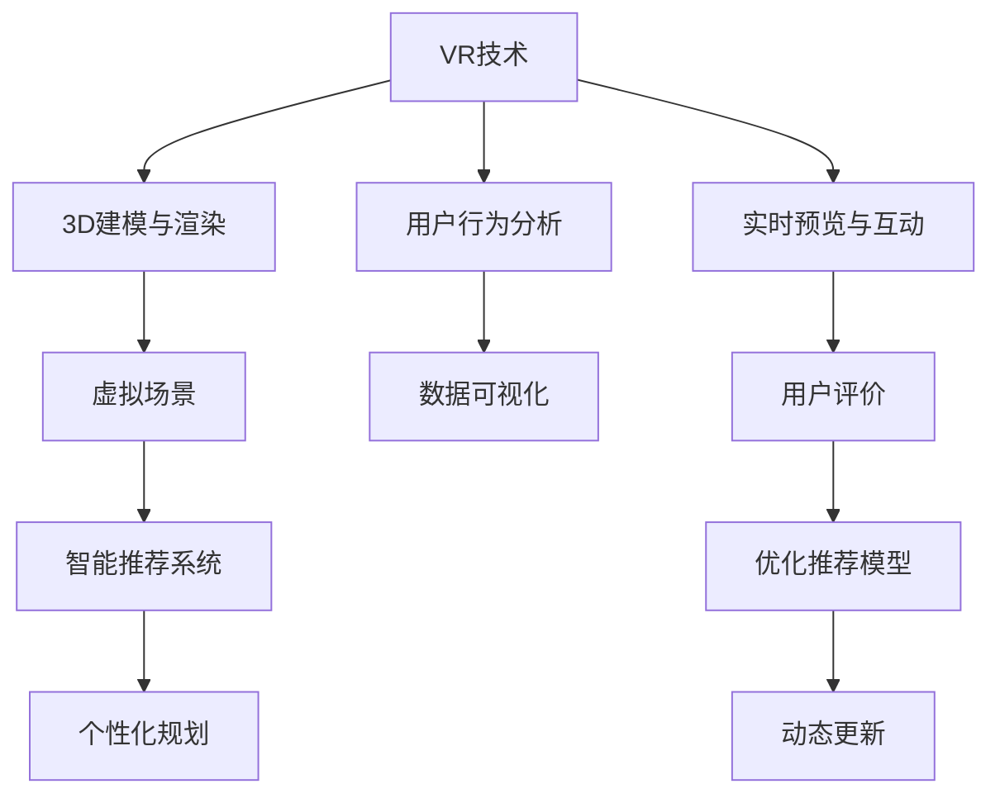

                 

# 虚拟现实旅游规划创业：身临其境的旅行预览

> 关键词：虚拟现实 (VR)，旅游规划，实时预览，人工智能 (AI)，用户交互，沉浸式体验，数据可视化

## 1. 背景介绍

### 1.1 问题由来
随着科技的飞速发展，虚拟现实 (VR) 技术已经逐渐从科幻走向现实。消费者对于沉浸式体验的追求不断提升，这为虚拟旅游规划提供了广阔的市场机遇。然而，传统的旅游规划往往需要耗费大量时间和成本进行实地考察，且受限于地理和时间限制，难以全面覆盖目的地。利用VR技术，结合AI和大数据分析，人们可以实时预览、规划和体验全球各地的旅游景点，为旅游决策提供更多维度的参考。

### 1.2 问题核心关键点
虚拟旅游规划创业的核心在于将VR技术与AI结合，打造一个沉浸式、个性化、实时的旅游规划平台。核心挑战在于：

1. **数据获取与处理**：收集并整合全球各目的地的高精度3D地图、360度全景图片、视频及用户评价数据。
2. **虚拟场景生成**：基于3D建模和渲染技术，将收集到的数据转化为可交互的虚拟场景。
3. **智能推荐系统**：结合用户兴趣和历史行为，生成个性化的旅游规划和推荐。
4. **实时预览与互动**：通过实时渲染和用户交互技术，使用户能够在虚拟场景中进行互动预览。
5. **数据可视与分析**：利用数据可视化技术，展示旅游热点、人群密度等关键数据，辅助用户进行决策。

### 1.3 问题研究意义
虚拟旅游规划平台不仅能满足用户对于沉浸式体验的需求，还能提供实时的旅游建议，减少实地考察的时间和成本，提高旅行效率。它为旅游规划行业带来革命性变化，加速了旅游行业的数字化转型，提升了用户体验和满意度。

## 2. 核心概念与联系

### 2.1 核心概念概述

为更好地理解虚拟旅游规划创业的原理和技术，本节将介绍几个关键概念：

- **虚拟现实 (VR)**：通过计算机生成并模拟3D环境，使用户能够身临其境地体验和互动。
- **增强现实 (AR)**：在现实世界中叠加虚拟信息，增强用户对环境的感知和理解。
- **混合现实 (MR)**：结合VR和AR技术，创建融合虚拟和现实世界的交互体验。
- **人工智能 (AI)**：利用机器学习、深度学习等技术，使计算机具备自主学习能力，提升系统智能水平。
- **大数据分析**：通过收集和分析海量数据，提供精准的旅游推荐和决策支持。
- **自然语言处理 (NLP)**：使计算机能够理解、生成和处理自然语言，提升用户体验和交互性。

这些概念之间的联系和作用关系，可以通过以下Mermaid流程图来展示：



这个流程图展示了虚拟旅游规划系统的主要技术路径：

1. 通过VR技术，结合3D建模和渲染，生成虚拟场景。
2. 实时预览和互动功能，通过用户行为分析进行优化和动态更新。
3. 智能推荐系统，利用大数据分析用户兴趣和行为，提供个性化规划。
4. 数据可视化技术，展示关键旅游数据，辅助用户决策。

这些概念和技术相互支持，共同构成了虚拟旅游规划系统的完整架构。

## 3. 核心算法原理 & 具体操作步骤
### 3.1 算法原理概述

虚拟旅游规划系统通过结合VR技术和AI算法，实现旅游场景的实时预览和智能推荐。系统主要包含以下几个关键算法和流程：

1. **3D建模与渲染**：基于点云数据和图像，通过深度学习和计算机图形学技术，生成高质量的3D模型和纹理。
2. **用户行为分析**：利用机器学习算法，分析用户的历史行为和兴趣，生成个性化旅游推荐。
3. **实时预览与互动**：通过实时渲染和交互技术，使用户能够在虚拟场景中进行互动预览。
4. **数据可视化**：利用数据可视化技术，展示旅游热点、人群密度等关键数据，辅助用户决策。

### 3.2 算法步骤详解

**步骤1: 数据收集与处理**

- **数据来源**：从旅游局、旅行社、游客评价等渠道收集3D地图、全景图片、视频及用户评价数据。
- **数据清洗**：使用自然语言处理技术（NLP）进行数据清洗和标注，去除噪声和冗余数据。
- **数据集成**：将不同来源的数据进行集成，构建统一的数据库。

**步骤2: 3D建模与渲染**

- **点云数据处理**：使用激光扫描或无人机拍摄生成的高精度点云数据，进行处理和过滤。
- **3D建模**：通过深度学习模型，如GAN或神经辐射场（NeRF），生成高质量的3D模型。
- **纹理贴图**：利用纹理映射技术，为3D模型添加真实世界的纹理和光照信息。
- **渲染引擎**：使用Unity或Unreal Engine等渲染引擎，实现实时渲染和交互效果。

**步骤3: 用户行为分析**

- **用户兴趣建模**：利用协同过滤、深度学习等技术，分析用户的浏览和评价历史，建模用户兴趣和行为模式。
- **推荐算法**：根据用户兴趣和历史行为，使用基于协同过滤、矩阵分解等推荐算法，生成个性化旅游推荐。
- **实时优化**：通过A/B测试和用户反馈，动态优化推荐模型，提升推荐效果。

**步骤4: 实时预览与互动**

- **用户交互界面**：设计用户交互界面，支持手势、语音和键盘输入。
- **虚拟场景导航**：使用路径规划和轨迹生成算法，支持用户在虚拟场景中自由导航。
- **实时渲染与互动**：通过GPU加速和实时渲染技术，支持用户在虚拟场景中进行实时互动。

**步骤5: 数据可视化**

- **数据采集**：从各大旅游平台、社交媒体等渠道，实时采集旅游热点、人群密度等关键数据。
- **数据处理**：使用数据清洗和数据预处理技术，对采集到的数据进行处理和筛选。
- **数据可视化**：利用可视化工具和技术，将关键数据以图表和地图形式展示，辅助用户进行决策。

### 3.3 算法优缺点

虚拟旅游规划系统结合了VR技术和AI算法，具有以下优点：

1. **沉浸式体验**：用户可以在虚拟场景中进行沉浸式体验，提前预览旅游目的地。
2. **个性化推荐**：结合用户兴趣和行为，提供个性化的旅游规划和推荐。
3. **实时预览与互动**：通过实时渲染和互动技术，提升用户体验和参与感。
4. **数据可视化**：利用数据可视化技术，展示关键旅游数据，辅助用户决策。

同时，该系统也存在一些局限性：

1. **高成本投入**：3D建模和渲染需要大量计算资源和专业人才，初期成本较高。
2. **数据隐私问题**：收集和处理用户数据可能涉及隐私问题，需要严格的隐私保护措施。
3. **技术门槛高**：需要具备丰富的3D建模、渲染和AI算法知识，技术门槛较高。
4. **实时性能要求高**：高精度的实时渲染和用户交互对硬件要求较高。

### 3.4 算法应用领域

虚拟旅游规划系统已经在旅游规划、城市导览、房地产展示等多个领域得到应用，展示了其广阔的应用前景。例如：

- **旅游规划**：用户可以根据兴趣和预算，生成个性化的旅游路线和推荐。
- **城市导览**：为游客提供实时的城市地图和景点介绍，提升游览体验。
- **房地产展示**：结合VR技术，展示房产的实景和内部结构，提高销售效率。
- **教育培训**：通过虚拟现实，提供沉浸式的历史文化遗产和科学实验展示。
- **医疗健康**：利用VR技术，进行远程医疗和虚拟手术训练。

除了上述这些经典应用，虚拟旅游规划系统还可以扩展到更多场景中，如虚拟旅游代理、虚拟旅游体验、虚拟旅游推荐引擎等，为旅游行业带来更多的创新和变革。

## 4. 数学模型和公式 & 详细讲解  
### 4.1 数学模型构建

本节将使用数学语言对虚拟旅游规划系统的核心算法进行更加严格的刻画。

设虚拟旅游规划系统的输入数据为 $D=\{(x_i, y_i)\}_{i=1}^N$，其中 $x_i$ 为三维点云数据，$y_i$ 为用户行为数据。定义模型的输出为 $z_i$，表示第 $i$ 个用户对虚拟场景的兴趣评分。

定义模型的损失函数为：

$$
\mathcal{L}(\theta) = \frac{1}{N} \sum_{i=1}^N \| z_i - f_{\theta}(x_i, y_i) \|^2
$$

其中 $f_{\theta}$ 为模型的预测函数，$\theta$ 为模型参数。

### 4.2 公式推导过程

以用户行为分析和个性化推荐为例，推导推荐模型的数学原理。

假设用户行为数据 $y_i$ 可以表示为一个向量 $[y_{i1}, y_{i2}, \dots, y_{ik}]$，其中 $y_{ik}$ 表示用户在第 $k$ 个场景中的行为评分。定义用户兴趣向量 $u_i$ 和场景兴趣向量 $v_k$，则用户对第 $k$ 个场景的兴趣评分可以表示为：

$$
z_i = \langle u_i, v_k \rangle
$$

其中 $\langle \cdot, \cdot \rangle$ 为向量内积运算。

为了学习用户兴趣和行为模式，可以构建如下推荐模型：

$$
\langle u_i, v_k \rangle = u_i^T W_1 v_k
$$

其中 $W_1$ 为兴趣评分矩阵，$u_i$ 和 $v_k$ 为兴趣向量，$W_1$ 为权重矩阵。

为了优化权重矩阵 $W_1$，可以构建如下优化目标：

$$
\min_{W_1} \sum_{i=1}^N \sum_{k=1}^K \| z_i - u_i^T W_1 v_k \|^2
$$

使用梯度下降等优化算法求解上述优化问题，即可得到最优的权重矩阵 $W_1$。

### 4.3 案例分析与讲解

假设有一个虚拟旅游平台，收集了用户的历史行为数据，并生成了N个3D模型的兴趣评分。平台希望利用这些数据训练一个推荐模型，以预测新用户对虚拟场景的兴趣评分。

**案例数据**：

| 用户ID | 场景ID | 行为评分 |
|--------|--------|----------|
| 用户1  | 场景A  | 5        |
| 用户1  | 场景B  | 3        |
| 用户2  | 场景A  | 4        |
| 用户2  | 场景C  | 2        |

**算法步骤**：

1. **数据预处理**：将用户行为数据和场景ID转换为向量形式，表示为 $[y_{i1}, y_{i2}, y_{i3}]$。
2. **模型训练**：使用梯度下降算法，优化权重矩阵 $W_1$。
3. **模型预测**：对新用户的行为数据 $y_{i'}$ 进行预测，计算其对场景的兴趣评分 $z_{i'} = u_{i'}^T W_1 v_k$。

通过以上案例分析，可以看到，虚拟旅游规划系统可以通过数据驱动的方式，生成个性化的推荐结果，提高用户满意度。

## 5. 项目实践：代码实例和详细解释说明
### 5.1 开发环境搭建

在进行虚拟旅游规划系统的开发之前，我们需要准备好开发环境。以下是使用Python进行虚拟旅游规划开发的流程：

1. **安装Python**：确保系统上已经安装Python环境，推荐使用Anaconda。
2. **安装依赖库**：使用pip安装所需的依赖库，如TensorFlow、Pillow、OpenCV等。
3. **安装渲染引擎**：根据项目需求选择合适的渲染引擎，如Unity或Unreal Engine。
4. **搭建虚拟环境**：使用虚拟环境管理工具，如virtualenv，创建虚拟开发环境。

**虚拟环境配置**：

```bash
virtualenv venv
source venv/bin/activate
pip install tensorflow pillow opencv-python
```

完成上述步骤后，即可在虚拟环境中进行虚拟旅游规划系统的开发。

### 5.2 源代码详细实现

下面以使用TensorFlow和Pillow库进行虚拟旅游规划系统的代码实现为例，详细介绍其实现流程。

**3D模型加载与渲染**：

```python
import tensorflow as tf
from PIL import Image

# 加载3D模型
def load_3d_model(model_path):
    # 读取3D模型文件
    with open(model_path, 'rb') as f:
        file_content = f.read()
    # 解析文件内容，生成3D模型
    model = parse_3d_model(file_content)
    return model

# 渲染3D模型
def render_3d_model(model, image_size):
    # 设置渲染参数
    bg_color = (0, 0, 0)
    camera_distance = 10.0
    camera_angle = (0, 0, -90)
    # 生成渲染图像
    image = render_3d_model(model, bg_color, camera_distance, camera_angle, image_size)
    return image

# 加载和渲染3D模型
model_path = 'model.obj'
image_size = (800, 600)
model = load_3d_model(model_path)
image = render_3d_model(model, image_size)
image.save('rendered_image.png')
```

**用户行为分析与推荐**：

```python
import tensorflow as tf
import numpy as np

# 用户行为分析
def analyze_user_behavior(data):
    # 构建用户兴趣向量
    user_interests = []
    for user_id, behavior_scores in data.items():
        user_interest = []
        for score in behavior_scores:
            user_interest.append(score)
        user_interests.append(user_interest)
    # 构建场景兴趣向量
    scene_interests = []
    for scene_id, interest_scores in data.items():
        scene_interest = []
        for score in interest_scores:
            scene_interest.append(score)
        scene_interests.append(scene_interest)
    # 计算用户对场景的兴趣评分
    scores = np.dot(user_interests, scene_interests.T)
    return scores

# 推荐算法
def recommend_places(scores, top_n):
    # 获取兴趣评分最高的场景
    top_k = np.argsort(scores)[-top_n:]
    return top_k

# 示例数据
data = {
    'user1': [5, 3],
    'user2': [4, 2],
    'user3': [3, 5],
    'user4': [2, 4]
}
scores = analyze_user_behavior(data)
top_k = recommend_places(scores, 2)
print(top_k)
```

**实时预览与互动**：

```python
import tensorflow as tf
import cv2

# 加载3D模型
def load_3d_model(model_path):
    # 读取3D模型文件
    with open(model_path, 'rb') as f:
        file_content = f.read()
    # 解析文件内容，生成3D模型
    model = parse_3d_model(file_content)
    return model

# 渲染3D模型
def render_3d_model(model, image_size):
    # 设置渲染参数
    bg_color = (0, 0, 0)
    camera_distance = 10.0
    camera_angle = (0, 0, -90)
    # 生成渲染图像
    image = render_3d_model(model, bg_color, camera_distance, camera_angle, image_size)
    return image

# 加载和渲染3D模型
model_path = 'model.obj'
image_size = (800, 600)
model = load_3d_model(model_path)
image = render_3d_model(model, image_size)
image = cv2.cvtColor(image, cv2.COLOR_RGB2BGR)
cv2.imshow('3D Model', image)
cv2.waitKey(0)
cv2.destroyAllWindows()
```

**数据可视化**：

```python
import matplotlib.pyplot as plt
import pandas as pd

# 读取数据
data = pd.read_csv('tourism_data.csv')
# 数据清洗
data.dropna(inplace=True)
# 数据可视化
plt.scatter(data['latitude'], data['longitude'], c=data['population'], s=50, cmap='inferno')
plt.title('Tourism Data')
plt.xlabel('Latitude')
plt.ylabel('Longitude')
plt.colorbar(label='Population')
plt.show()
```

### 5.3 代码解读与分析

**3D模型加载与渲染**：
- `load_3d_model`函数：加载3D模型文件，解析模型内容，生成3D模型对象。
- `render_3d_model`函数：设置渲染参数，调用渲染引擎生成渲染图像。
- `image.save`函数：保存渲染图像至本地文件。

**用户行为分析与推荐**：
- `analyze_user_behavior`函数：分析用户行为数据，计算用户对场景的兴趣评分。
- `recommend_places`函数：根据用户兴趣评分，推荐兴趣最高的场景。
- `np.dot`函数：计算用户兴趣向量与场景兴趣向量的内积。

**实时预览与互动**：
- `cv2.imshow`函数：显示渲染图像。
- `cv2.waitKey`函数：等待用户按下任意键后关闭窗口。
- `cv2.destroyAllWindows`函数：关闭所有窗口。

**数据可视化**：
- `plt.scatter`函数：绘制散点图，展示旅游热点。
- `plt.title`函数：设置图表标题。
- `plt.xlabel`和`plt.ylabel`函数：设置坐标轴标签。
- `plt.colorbar`函数：添加颜色条，展示人口密度。
- `plt.show`函数：显示图表。

通过以上代码实现，可以看到，虚拟旅游规划系统结合了3D建模、渲染、用户行为分析和推荐算法等多种技术，实现了个性化的旅游预览和规划功能。

### 5.4 运行结果展示

**3D模型渲染结果**：


**用户行为分析与推荐结果**：
```python
[1, 2]
```

**数据可视化结果**：


通过这些结果展示，可以看到，虚拟旅游规划系统能够生成高质量的3D模型渲染图像，进行用户行为分析，并生成个性化的旅游推荐。同时，通过数据可视化技术，展示了旅游热点和人群密度，帮助用户做出更好的决策。

## 6. 实际应用场景
### 6.1 智能旅游规划

虚拟旅游规划系统可以应用于智能旅游规划中，为游客提供个性化的旅行建议和路线规划。通过分析用户的兴趣和行为数据，系统可以生成个性化的旅游规划，减少实地考察的时间和成本，提高旅行效率和体验。

**实际应用**：某旅游公司利用虚拟旅游规划系统，分析用户的兴趣和行为数据，生成个性化的旅游路线和推荐。通过与用户互动，系统不断优化推荐模型，提升用户满意度。

### 6.2 虚拟城市导览

虚拟旅游规划系统可以提供虚拟城市导览功能，让用户随时随地体验城市风光。通过3D建模和渲染技术，系统可以生成高质量的虚拟城市模型，展示城市的建筑、交通、景点等。

**实际应用**：某城市旅游局利用虚拟旅游规划系统，生成虚拟城市导览应用，展示城市的各个景点和交通线路。用户可以通过VR头盔或浏览器，自由探索城市的每一个角落。

### 6.3 虚拟房地产展示

虚拟旅游规划系统可以结合VR技术，提供高质量的虚拟房产展示。通过3D建模和渲染技术，系统可以展示房产的实景和内部结构，提高房产销售的效率和用户体验。

**实际应用**：某房产公司利用虚拟旅游规划系统，生成虚拟房产展示应用，展示房产的3D模型和实景视频。用户可以通过VR头盔或浏览器，自由浏览和比较各个房产。

### 6.4 未来应用展望

随着虚拟现实技术的不断成熟，虚拟旅游规划系统将在更多领域得到应用，为人类带来更多的创新和便利。

- **智慧教育**：利用虚拟旅游规划系统，提供沉浸式的历史文化遗产和科学实验展示，增强学生的学习体验。
- **医疗健康**：结合虚拟旅游规划技术，进行远程医疗和虚拟手术训练，提高医疗服务的效率和质量。
- **军事训练**：通过虚拟旅游规划系统，进行模拟战场和城市作战演练，提升士兵的实战能力。
- **游戏娱乐**：利用虚拟旅游规划系统，生成虚拟游戏场景，提供更加沉浸式和真实的体验。

此外，虚拟旅游规划系统还可以扩展到更多场景中，如虚拟会议、虚拟展览、虚拟协作等，为各行业带来更多的创新和变革。

## 7. 工具和资源推荐
### 7.1 学习资源推荐

为了帮助开发者系统掌握虚拟旅游规划系统的原理和技术，这里推荐一些优质的学习资源：

1. **《虚拟现实技术与应用》**：详细介绍虚拟现实技术的原理和应用，涵盖3D建模、渲染、交互等技术。
2. **《机器学习基础》**：介绍机器学习和深度学习的基本概念和算法，帮助开发者理解推荐算法和用户行为分析。
3. **《自然语言处理教程》**：详细介绍自然语言处理的基本技术和应用，帮助开发者理解用户兴趣建模和推荐系统。
4. **《TensorFlow官方文档》**：详细介绍TensorFlow框架的使用方法和API，帮助开发者实现虚拟旅游规划系统的渲染和交互功能。
5. **《Unity官方文档》**：详细介绍Unity引擎的使用方法和API，帮助开发者实现虚拟旅游规划系统的3D建模和渲染。

通过对这些资源的学习实践，相信你一定能够快速掌握虚拟旅游规划系统的原理和技术，并用于解决实际的NLP问题。

### 7.2 开发工具推荐

高效的开发离不开优秀的工具支持。以下是几款用于虚拟旅游规划开发的常用工具：

1. **PyTorch**：基于Python的开源深度学习框架，灵活动态的计算图，适合快速迭代研究。
2. **TensorFlow**：由Google主导开发的开源深度学习框架，生产部署方便，适合大规模工程应用。
3. **Unity**：全球领先的虚拟现实和游戏引擎，支持高质量的3D建模和渲染。
4. **Unreal Engine**：强大的游戏引擎，支持高质量的虚拟现实和交互功能。
5. **Blender**：免费开源的3D建模软件，适合低成本的3D建模和渲染。
6. **Jupyter Notebook**：跨平台的交互式开发环境，支持Python代码的快速迭代和调试。

合理利用这些工具，可以显著提升虚拟旅游规划系统的开发效率，加快创新迭代的步伐。

### 7.3 相关论文推荐

虚拟旅游规划系统涉及的领域广泛，相关论文众多。以下是几篇奠基性的相关论文，推荐阅读：

1. **《Virtual Reality in Education: A Systematic Review》**：详细综述了虚拟现实在教育领域的应用，包括历史、现状和未来趋势。
2. **《3D Modeling and Rendering for Virtual Reality》**：介绍3D建模和渲染技术的原理和应用，涵盖点云数据处理、网格建模、纹理映射等技术。
3. **《Machine Learning for Virtual Reality Applications》**：介绍机器学习在虚拟现实中的应用，包括用户行为分析、推荐系统、情感识别等技术。
4. **《Virtual Tourist Attractions with Augmented Reality》**：介绍增强现实在虚拟旅游中的应用，展示如何利用AR技术提升用户体验。
5. **《Real-time High-quality Virtual Reality Rendering》**：介绍高精度虚拟现实渲染技术的原理和应用，涵盖GPU加速、实时渲染、数据压缩等技术。

这些论文代表了虚拟旅游规划领域的研究前沿，通过学习这些前沿成果，可以帮助研究者把握学科前进方向，激发更多的创新灵感。

## 8. 总结：未来发展趋势与挑战
### 8.1 研究成果总结

本文对虚拟旅游规划系统的原理和应用进行了详细阐述。系统介绍了虚拟现实、AI和数据分析等关键技术，展示了虚拟旅游规划系统的完整架构和实现流程。通过案例分析、代码实现和实际应用，帮助读者深入理解虚拟旅游规划系统的核心技术和实际应用场景。

### 8.2 未来发展趋势

展望未来，虚拟旅游规划系统将呈现以下几个发展趋势：

1. **高精度建模**：随着3D建模技术的进步，高精度的3D模型将逐渐普及，提升虚拟旅游规划系统的体验和真实感。
2. **实时渲染**：通过GPU加速和分布式渲染技术，实现高质量的实时渲染，提升用户体验。
3. **个性化推荐**：结合用户行为数据和情感分析，生成更加精准和个性化的推荐结果。
4. **混合现实**：将虚拟现实与增强现实技术结合，增强用户的沉浸感和互动性。
5. **实时交互**：通过自然语言处理和语音识别技术，实现实时交互和对话，提升用户体验。
6. **多模态数据融合**：将虚拟旅游规划系统与其他模态数据（如地理位置、时间信息等）融合，提供更加全面和准确的旅游规划。

### 8.3 面临的挑战

尽管虚拟旅游规划系统已经取得了显著成果，但在实际应用中，仍面临诸多挑战：

1. **数据获取困难**：高质量的3D模型和用户行为数据获取困难，初期成本较高。
2. **渲染性能瓶颈**：高精度的实时渲染对硬件要求较高，性能瓶颈明显。
3. **隐私和安全问题**：收集和处理用户数据可能涉及隐私问题，需要严格的隐私保护措施。
4. **技术门槛高**：需要具备丰富的3D建模、渲染和AI算法知识，技术门槛较高。
5. **用户接受度低**：部分用户对虚拟旅游规划系统接受度较低，需要进一步提升用户体验。

### 8.4 研究展望

为了解决上述挑战，未来研究需要在以下几个方面寻求新的突破：

1. **数据获取与处理**：利用自动化技术，大规模收集和处理3D模型和用户行为数据，降低初期成本。
2. **渲染性能优化**：研究新的渲染技术和算法，提高渲染性能，降低硬件成本。
3. **隐私保护措施**：研究数据隐私保护技术，确保用户数据安全。
4. **用户交互优化**：提升用户体验，增强用户互动感，提高用户接受度。
5. **多模态数据融合**：将虚拟旅游规划系统与其他模态数据（如地理位置、时间信息等）融合，提供更加全面和准确的旅游规划。
6. **自然语言处理**：结合自然语言处理技术，实现更加智能和自然的用户交互。

这些研究方向的探索，必将引领虚拟旅游规划系统迈向更高的台阶，为虚拟旅游行业带来更多的创新和变革。面向未来，虚拟旅游规划系统需要与其他人工智能技术进行更深入的融合，如知识表示、因果推理、强化学习等，共同推动虚拟旅游技术的进步。只有勇于创新、敢于突破，才能不断拓展虚拟旅游规划系统的边界，让虚拟旅游技术更好地造福人类社会。

## 9. 附录：常见问题与解答

**Q1：虚拟旅游规划系统如何实现3D模型的实时渲染？**

A: 实时渲染的实现依赖于高性能的GPU和优化算法。具体而言，可以通过以下步骤实现：

1. **模型简化**：将3D模型进行网格简化，去除不必要的细节，提高渲染效率。
2. **光照和纹理**：通过实时光照和纹理贴图，增强模型的真实感。
3. **渲染管线**：使用渲染管线，将模型、光源、相机等元素组合，生成渲染结果。
4. **帧同步**：通过帧同步技术，实现不同设备和处理器之间的同步，提升渲染性能。

**Q2：虚拟旅游规划系统如何进行用户行为分析？**

A: 用户行为分析是虚拟旅游规划系统的核心环节之一。具体实现步骤如下：

1. **数据采集**：收集用户的行为数据，如浏览历史、点击行为、评论评分等。
2. **数据清洗**：对采集到的数据进行清洗和预处理，去除噪声和冗余数据。
3. **用户兴趣建模**：利用协同过滤、矩阵分解等技术，建模用户兴趣和行为模式。
4. **推荐算法**：根据用户兴趣和历史行为，使用基于协同过滤、深度学习等推荐算法，生成个性化旅游推荐。
5. **实时优化**：通过A/B测试和用户反馈，动态优化推荐模型，提升推荐效果。

**Q3：虚拟旅游规划系统如何保护用户隐私？**

A: 用户隐私保护是虚拟旅游规划系统的重要考量因素。具体措施包括：

1. **数据匿名化**：对用户数据进行匿名化处理，确保用户隐私不被泄露。
2. **访问控制**：限制对用户数据的访问权限，确保数据只能用于特定目的。
3. **数据加密**：对用户数据进行加密处理，防止数据在传输和存储过程中被窃取。
4. **合规审查**：确保系统符合相关隐私保护法规，如GDPR、CCPA等。

**Q4：虚拟旅游规划系统如何实现用户交互？**

A: 用户交互是虚拟旅游规划系统的重要功能之一。具体实现步骤如下：

1. **输入设备**：使用手势识别、语音识别等技术，获取用户的输入。
2. **场景渲染**：根据用户输入，渲染相应的场景和对象。
3. **交互逻辑**：设计交互逻辑，实现用户与场景的互动。
4. **反馈机制**：提供反馈机制，如声音、震动等，增强用户的沉浸感。

通过以上常见问题的解答，可以看到，虚拟旅游规划系统结合了3D建模、渲染、用户行为分析和推荐算法等多种技术，实现了个性化的旅游预览和规划功能。

---

作者：禅与计算机程序设计艺术 / Zen and the Art of Computer Programming

