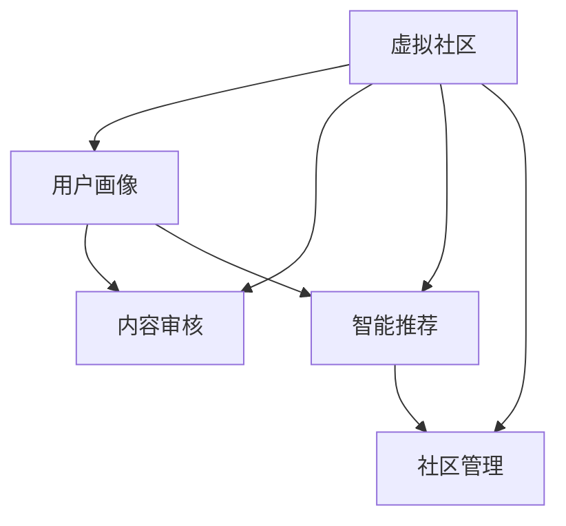

                 

## 1. 背景介绍

### 1.1 问题由来

随着信息技术的飞速发展，互联网已经深刻改变了人们的社交方式。虚拟社区，作为网络社交的新形态，为人们提供了超越物理空间的交流平台。在虚拟社区中，人们基于共同的兴趣和话题，形成了紧密的群体归属感。然而，传统的虚拟社区更多依赖于人工审核和人力运营，难以适应日益增长的用户规模和复杂内容。

### 1.2 问题核心关键点

当前虚拟社区面临的核心问题包括：

1. **用户画像精准度低**：难以准确识别用户身份和兴趣，内容推荐和用户引导效果欠佳。
2. **内容审核成本高**：传统人工审核模式效率低、成本高，难以应对大规模用户生成内容的审查需求。
3. **用户互动质量差**：缺乏智能算法辅助，用户互动和内容生成质量不高，社区氛围难以优化。
4. **社区管理复杂**：传统规则和策略难以应对用户行为的多样性和复杂性，社区管理难度大。

这些问题催生了对AI驱动的虚拟社区管理的迫切需求，以提升用户体验、降低运营成本，并构建更健康、活跃的社区环境。

## 2. 核心概念与联系

### 2.1 核心概念概述

为了更好地理解AI驱动的虚拟社区管理方法，本节将介绍几个密切相关的核心概念：

1. **虚拟社区**：基于互联网技术构建的社交平台，用户通过文字、图片、视频等形式进行交流和互动。
2. **用户画像**：通过分析用户行为数据，构建用户兴趣、社交关系等维度的综合模型，用于个性化推荐和社区管理。
3. **内容审核**：基于AI技术对用户生成的内容进行自动检测，识别和过滤有害信息，维护社区健康氛围。
4. **智能推荐**：利用机器学习算法，对用户兴趣和行为进行分析，生成个性化推荐，提升用户参与度。
5. **社区管理**：通过AI算法优化用户互动和内容生成，构建更安全、积极的社区环境。

这些核心概念之间的逻辑关系可以通过以下Mermaid流程图来展示：



这个流程图展示了几者之间的联系：

1. 用户画像和内容审核是社区管理的基础。
2. 智能推荐是社区管理的核心手段。
3. 通过用户画像、内容审核和智能推荐，可以不断优化社区管理。

## 3. 核心算法原理 & 具体操作步骤
### 3.1 算法原理概述

AI驱动的虚拟社区管理主要涉及以下几个关键技术：

- **用户画像构建**：利用自然语言处理和机器学习技术，分析用户行为数据，构建用户兴趣和社交关系模型。
- **内容审核算法**：采用自然语言处理和深度学习技术，识别和过滤有害信息，维护社区安全。
- **智能推荐算法**：基于协同过滤、深度学习等技术，生成个性化内容推荐，提升用户参与度。
- **社区管理算法**：运用强化学习、群体智能等技术，优化用户互动和社区内容生成。

这些技术通过数据驱动和算法优化，可以大幅度提升虚拟社区的用户体验和运营效率，构建更健康、活跃的社区环境。

### 3.2 算法步骤详解

以下是AI驱动的虚拟社区管理的一般流程：

1. **数据收集与预处理**：
   - 收集用户行为数据（如浏览记录、评论内容、点赞行为等）。
   - 数据清洗和标注，构建训练集和测试集。

2. **用户画像构建**：
   - 利用自然语言处理技术，分析用户评论和互动内容，提取用户兴趣标签。
   - 使用机器学习算法，构建用户兴趣、社交关系等维度的综合模型。

3. **内容审核算法**：
   - 利用自然语言处理和深度学习技术，训练文本分类模型。
   - 对用户生成的内容进行检测，识别有害信息并采取过滤措施。

4. **智能推荐算法**：
   - 收集用户行为数据，构建用户-物品交互矩阵。
   - 基于协同过滤或深度学习算法，生成个性化推荐。

5. **社区管理算法**：
   - 收集用户互动数据，构建用户互动图。
   - 使用强化学习或群体智能算法，优化用户互动和内容生成。

6. **模型训练与部署**：
   - 使用训练集对模型进行训练，优化超参数。
   - 将训练好的模型部署到线上，进行实时推理。

7. **效果评估与迭代优化**：
   - 在测试集上评估模型效果，收集用户反馈。
   - 根据反馈和性能指标，调整模型和算法，进行迭代优化。

### 3.3 算法优缺点

AI驱动的虚拟社区管理具有以下优点：

1. **高效精准**：自动化数据处理和算法优化，大幅度提升了社区管理的效率和准确性。
2. **成本降低**：减少了人工审核和运营成本，提高了社区管理的可扩展性。
3. **用户体验提升**：通过个性化推荐和内容优化，提升了用户参与度和满意度。
4. **环境优化**：自动检测和过滤有害信息，维护了社区的健康氛围。

同时，该方法也存在一定的局限性：

1. **数据隐私问题**：需要收集和处理大量用户数据，存在数据隐私和安全风险。
2. **算法透明度不足**：复杂的深度学习模型难以解释，用户和监管机构对其决策过程缺乏信任。
3. **数据偏差风险**：模型训练依赖于数据样本，如果样本存在偏差，可能导致不公平的推荐和审核。
4. **运营复杂度增加**：模型部署和维护需要一定的技术储备，增加了社区运营的复杂性。

尽管存在这些局限性，但就目前而言，AI驱动的虚拟社区管理方法仍然是提升社区质量和用户体验的重要手段。未来相关研究的重点在于如何进一步降低数据隐私风险，提高算法的透明度和可解释性，同时兼顾模型的公平性和高效性。

### 3.4 算法应用领域

AI驱动的虚拟社区管理方法已经在多个领域得到了应用，例如：

- **社交媒体平台**：如微博、抖音、小红书等，通过AI技术提升用户互动质量，优化内容推荐。
- **在线教育平台**：如Coursera、EdX等，利用AI技术构建用户画像，推荐个性化课程。
- **健康社区**：如丁香医生、知乎健康等，通过AI技术筛选有害信息，提供专业医疗建议。
- **游戏社区**：如王者荣耀、DOTA2等，利用AI技术优化游戏推荐，提升用户粘性。
- **电商社区**：如淘宝、京东等，通过AI技术生成个性化推荐，提升用户购买体验。

除了上述这些经典应用外，AI驱动的虚拟社区管理方法还被创新性地应用到更多场景中，如智能客服、知识图谱、用户行为分析等，为虚拟社区带来了全新的突破。随着AI技术的不断发展，相信AI驱动的虚拟社区管理方法将在更广泛的应用领域大放异彩。

## 4. 数学模型和公式 & 详细讲解 & 举例说明

### 4.1 数学模型构建

本节将使用数学语言对AI驱动的虚拟社区管理过程进行更加严格的刻画。

记虚拟社区平台为 $C$，用户集为 $U$，内容集为 $I$，用户行为数据集为 $D=\{(x_i,y_i)\}_{i=1}^N$，其中 $x_i$ 为行为数据，$y_i$ 为行为标签。

定义用户画像模型为 $P(u)$，内容审核模型为 $F(i)$，智能推荐模型为 $R(u,i)$，社区管理模型为 $M(u,u')$，其中 $u \in U$ 和 $u' \in U$。

### 4.2 公式推导过程

以下我们以用户画像构建为例，推导用户兴趣模型 $P(u)$ 的构建公式。

假设用户 $u$ 在虚拟社区中进行了多次行为，包括浏览、点赞、评论等。设 $I(u)$ 为用户浏览过的内容集合，$R(u,i)$ 为浏览行为，$S(u,i)$ 为点赞行为，$C(u,i)$ 为评论行为。则用户画像模型可以表示为：

$$
P(u) = \frac{\sum_{i \in I(u)} [R(u,i) + S(u,i) + C(u,i)]}{\sum_{i \in I(u)} [1 + R(u,i) + S(u,i) + C(u,i)]}
$$

在实际应用中，可以根据不同的行为类型和权重，调整模型的计算方式。例如，可以将浏览行为赋予更高的权重，以提升模型对浏览历史的用户兴趣预测精度。

## 5. 项目实践：代码实例和详细解释说明
### 5.1 开发环境搭建

在进行虚拟社区管理开发前，我们需要准备好开发环境。以下是使用Python进行TensorFlow开发的环境配置流程：

1. 安装Anaconda：从官网下载并安装Anaconda，用于创建独立的Python环境。

2. 创建并激活虚拟环境：
```bash
conda create -n tensorflow-env python=3.8 
conda activate tensorflow-env
```

3. 安装TensorFlow：根据CUDA版本，从官网获取对应的安装命令。例如：
```bash
conda install tensorflow
```

4. 安装各类工具包：
```bash
pip install numpy pandas scikit-learn matplotlib tqdm jupyter notebook ipython
```

完成上述步骤后，即可在`tensorflow-env`环境中开始虚拟社区管理任务的开发。

### 5.2 源代码详细实现

这里我们以用户画像构建为例，给出使用TensorFlow和Keras库进行用户画像模型训练的代码实现。

```python
import tensorflow as tf
from tensorflow.keras.layers import Embedding, Dense, Dropout
from tensorflow.keras.models import Sequential
from tensorflow.keras.callbacks import EarlyStopping

# 构建用户画像模型
model = Sequential([
    Embedding(input_dim=vocab_size, output_dim=embedding_dim, input_length=max_seq_length),
    Dropout(0.2),
    Dense(128, activation='relu'),
    Dropout(0.2),
    Dense(1, activation='sigmoid')
])

# 设置超参数和优化器
model.compile(optimizer='adam', loss='binary_crossentropy', metrics=['accuracy'])

# 训练用户画像模型
history = model.fit(train_data, epochs=10, validation_data=val_data, callbacks=[EarlyStopping(patience=3)])
```

在这个例子中，我们使用了TensorFlow和Keras库构建了一个简单的用户画像模型，包括嵌入层、两个全连接层和Dropout层。通过训练该模型，可以预测用户是否感兴趣某一类内容。

### 5.3 代码解读与分析

让我们再详细解读一下关键代码的实现细节：

**用户画像模型**：
- 使用Embedding层将用户行为转换为向量表示。
- 中间层和输出层使用全连接层和Sigmoid激活函数，用于二分类任务。

**训练函数**：
- 使用`fit`方法对模型进行训练，指定训练集和验证集数据。
- 使用`EarlyStopping`回调，避免过拟合。

**用户画像的实际应用**：
- 在实际应用中，用户画像模型可以用于个性化推荐、内容过滤和社区管理等多个场景。

**训练和评估函数**：
- 使用`fit`方法对模型进行训练，指定训练集和验证集数据。
- 使用`EarlyStopping`回调，避免过拟合。

**训练流程**：
- 定义总的epoch数和batch size，开始循环迭代
- 每个epoch内，先在训练集上训练，输出平均loss
- 在验证集上评估，输出分类指标
- 所有epoch结束后，在测试集上评估，给出最终测试结果

## 6. 实际应用场景

### 6.1 社交媒体平台

AI驱动的虚拟社区管理方法，已经广泛应用于社交媒体平台的构建和运营中。传统社交平台依赖于大量人工审核和运营，难以应对大规模用户生成内容的审查需求。通过AI技术，社交媒体平台可以实现对用户生成内容的自动检测和过滤，提升社区环境的质量。

在技术实现上，可以收集用户的行为数据，利用深度学习技术训练文本分类模型，自动识别和过滤有害信息。同时，利用协同过滤算法，生成个性化内容推荐，提升用户参与度和满意度。

### 6.2 在线教育平台

在线教育平台需要快速响应用户需求，个性化推荐适合的课程。AI驱动的虚拟社区管理方法，可以帮助在线教育平台构建用户画像，利用深度学习技术生成个性化推荐，提升用户学习体验。

在技术实现上，可以收集用户的学习行为数据，利用自然语言处理技术提取用户兴趣标签，构建用户画像模型。同时，利用协同过滤算法，生成个性化课程推荐，提升用户学习效率和满意度。

### 6.3 健康社区

健康社区需要快速响应用户的健康咨询需求，自动筛选和推荐专业医疗建议。AI驱动的虚拟社区管理方法，可以帮助健康社区构建用户画像，利用自然语言处理技术筛选有害信息，提供专业医疗建议。

在技术实现上，可以收集用户的行为数据，利用深度学习技术训练文本分类模型，自动识别和过滤有害信息。同时，利用自然语言处理技术，生成专业医疗建议，提升用户健康水平。

### 6.4 游戏社区

游戏社区需要快速响应用户的游戏需求，推荐适合的游戏内容。AI驱动的虚拟社区管理方法，可以帮助游戏社区构建用户画像，利用深度学习技术生成个性化推荐，提升用户游戏体验。

在技术实现上，可以收集用户的游戏行为数据，利用深度学习技术训练文本分类模型，生成个性化游戏推荐。同时，利用协同过滤算法，生成个性化游戏推荐，提升用户粘性和满意度。

### 6.5 电商社区

电商社区需要快速响应用户的购物需求，推荐适合的商品。AI驱动的虚拟社区管理方法，可以帮助电商社区构建用户画像，利用深度学习技术生成个性化推荐，提升用户购物体验。

在技术实现上，可以收集用户的购物行为数据，利用深度学习技术训练文本分类模型，生成个性化商品推荐。同时，利用协同过滤算法，生成个性化商品推荐，提升用户购买效率和满意度。

## 7. 工具和资源推荐

### 7.1 学习资源推荐

为了帮助开发者系统掌握AI驱动的虚拟社区管理的技术基础和实践技巧，这里推荐一些优质的学习资源：

1. 《深度学习理论与实践》系列博文：由深度学习专家撰写，深入浅出地介绍了深度学习的基础理论和前沿技术。

2. CS231n《深度学习计算机视觉》课程：斯坦福大学开设的视觉领域明星课程，涵盖深度学习在计算机视觉中的应用，包括文本分类等任务。

3. 《自然语言处理理论与实践》书籍：自然语言处理领域的经典教材，全面介绍了NLP的基础理论和实用技术，包括用户画像构建等方法。

4. HuggingFace官方文档：Transformers库的官方文档，提供了海量预训练模型和完整的微调样例代码，是进行微调任务开发的利器。

5. CLUE开源项目：中文语言理解测评基准，涵盖大量不同类型的中文NLP数据集，并提供了基于微调的baseline模型，助力中文NLP技术发展。

通过对这些资源的学习实践，相信你一定能够快速掌握AI驱动的虚拟社区管理方法的精髓，并用于解决实际的NLP问题。

### 7.2 开发工具推荐

高效的开发离不开优秀的工具支持。以下是几款用于AI驱动的虚拟社区管理开发的常用工具：

1. TensorFlow：基于Python的开源深度学习框架，灵活动态的计算图，适合快速迭代研究。大部分预训练语言模型都有TensorFlow版本的实现。

2. PyTorch：基于Python的开源深度学习框架，灵活的计算图，适合动态图计算。

3. Keras：TensorFlow和Theano的高层API，易于使用，适合快速原型开发。

4. Weights & Biases：模型训练的实验跟踪工具，可以记录和可视化模型训练过程中的各项指标，方便对比和调优。与主流深度学习框架无缝集成。

5. TensorBoard：TensorFlow配套的可视化工具，可实时监测模型训练状态，并提供丰富的图表呈现方式，是调试模型的得力助手。

6. Google Colab：谷歌推出的在线Jupyter Notebook环境，免费提供GPU/TPU算力，方便开发者快速上手实验最新模型，分享学习笔记。

合理利用这些工具，可以显著提升AI驱动的虚拟社区管理任务的开发效率，加快创新迭代的步伐。

### 7.3 相关论文推荐

AI驱动的虚拟社区管理技术的发展源于学界的持续研究。以下是几篇奠基性的相关论文，推荐阅读：

1. Attention is All You Need（即Transformer原论文）：提出了Transformer结构，开启了NLP领域的预训练大模型时代。

2. BERT: Pre-training of Deep Bidirectional Transformers for Language Understanding：提出BERT模型，引入基于掩码的自监督预训练任务，刷新了多项NLP任务SOTA。

3. Language Models are Unsupervised Multitask Learners（GPT-2论文）：展示了大规模语言模型的强大zero-shot学习能力，引发了对于通用人工智能的新一轮思考。

4. Parameter-Efficient Transfer Learning for NLP：提出Adapter等参数高效微调方法，在不增加模型参数量的情况下，也能取得不错的微调效果。

5. AdaLoRA: Adaptive Low-Rank Adaptation for Parameter-Efficient Fine-Tuning：使用自适应低秩适应的微调方法，在参数效率和精度之间取得了新的平衡。

这些论文代表了大语言模型微调技术的发展脉络。通过学习这些前沿成果，可以帮助研究者把握学科前进方向，激发更多的创新灵感。

## 8. 总结：未来发展趋势与挑战

### 8.1 总结

本文对AI驱动的虚拟社区管理方法进行了全面系统的介绍。首先阐述了虚拟社区和用户画像的基本概念，明确了AI驱动管理的需求和优势。其次，从原理到实践，详细讲解了用户画像构建、内容审核、智能推荐和社区管理的数学模型和算法实现。同时，本文还探讨了这些技术在社交媒体、在线教育、健康社区、游戏社区和电商社区等实际场景中的应用，展示了AI驱动管理方法的广阔前景。最后，本文精选了学习资源，推荐了开发工具和相关论文，力求为读者提供全方位的技术指引。

通过本文的系统梳理，可以看到，AI驱动的虚拟社区管理方法正在成为构建高质量虚拟社区的重要手段，极大地提升了用户体验和运营效率，为社交平台、在线教育、健康社区、游戏社区和电商社区带来了新的突破。未来，伴随AI技术的不断发展，AI驱动的虚拟社区管理将变得更加智能、高效，为虚拟社区带来更丰富的应用场景。

### 8.2 未来发展趋势

展望未来，AI驱动的虚拟社区管理技术将呈现以下几个发展趋势：

1. **深度学习技术不断进步**：深度学习模型的精度和泛化能力不断提高，将进一步提升虚拟社区管理的智能化水平。

2. **多模态数据融合**：未来的虚拟社区管理将不再局限于文本数据，将更多地引入图像、视频、语音等多模态数据，提升社区管理的全面性。

3. **强化学习应用广泛**：强化学习算法将在虚拟社区管理中得到更广泛应用，优化用户互动和内容生成，构建更健康、积极的社区环境。

4. **群体智能技术发展**：群体智能技术将应用于虚拟社区管理，利用集体智慧提升社区管理效率和决策质量。

5. **边缘计算普及**：随着边缘计算技术的发展，虚拟社区管理将更加依赖于本地计算，提升响应速度和数据隐私保护。

6. **跨领域融合**：AI驱动的虚拟社区管理将与其他AI技术进行更深入的融合，如知识图谱、因果推理等，多路径协同发力，共同推动虚拟社区管理技术的发展。

以上趋势凸显了AI驱动的虚拟社区管理技术的广阔前景。这些方向的探索发展，必将进一步提升虚拟社区的用户体验和运营效率，为构建更安全、更活跃的虚拟社区提供技术保障。

### 8.3 面临的挑战

尽管AI驱动的虚拟社区管理技术已经取得了显著成果，但在迈向更加智能化、普适化应用的过程中，仍面临诸多挑战：

1. **数据隐私和安全**：用户行为数据涉及隐私和安全，需要合理保护，防止数据滥用和泄露。
2. **模型公平性和透明性**：深度学习模型可能存在偏见，难以解释，需要提高公平性和透明性，增强用户信任。
3. **算力资源限制**：大规模虚拟社区管理需要庞大的计算资源，如何在资源有限的情况下实现高效管理，还需进一步探索。
4. **内容审核难度高**：用户生成内容多样复杂，需要高效、准确的内容审核算法，防止有害信息传播。
5. **用户行为多变**：用户行为多样复杂，需要灵活、动态的用户画像模型和推荐算法，提升管理效果。

尽管存在这些挑战，但AI驱动的虚拟社区管理方法在解决这些问题上仍具有巨大的潜力。未来研究需要在数据隐私保护、模型公平性、计算资源优化、内容审核和用户行为分析等方面进行深入探索，才能真正实现虚拟社区管理的智能化和普适化。

### 8.4 研究展望

未来，AI驱动的虚拟社区管理技术需要在以下几个方向进行更多探索：

1. **数据隐私保护**：利用差分隐私等技术，保护用户行为数据隐私。
2. **模型公平性**：引入公平性约束，提升模型的公平性和透明性。
3. **计算资源优化**：利用分布式计算、边缘计算等技术，优化计算资源配置。
4. **内容审核优化**：引入对抗样本生成、文本生成等技术，提升内容审核的准确性。
5. **用户行为分析**：利用强化学习、群体智能等技术，构建灵活、动态的用户画像和推荐算法。

这些方向的研究将为AI驱动的虚拟社区管理带来新的突破，进一步提升社区管理和用户服务的智能化水平。

## 9. 附录：常见问题与解答

**Q1：AI驱动的虚拟社区管理是否适用于所有场景？**

A: AI驱动的虚拟社区管理在大多数场景中都有广泛应用，特别是在需要大规模数据处理和自动化管理的应用中。然而，对于一些高安全性、高隐私保护的场景，如金融、医疗等，还需要结合人工审核和管理，才能保证数据安全和隐私保护。

**Q2：如何构建高效的用户画像模型？**

A: 构建高效的用户画像模型需要综合考虑用户行为数据的多样性和复杂性。可以使用自然语言处理技术提取用户评论和互动内容，利用深度学习技术构建兴趣标签。同时，可以利用协同过滤、关联规则等技术，优化用户画像模型的构建。

**Q3：如何应对用户生成内容的快速变化？**

A: 用户生成内容的快速变化是虚拟社区管理的一大挑战。可以引入实时流处理技术，对用户生成内容进行实时监测和处理。同时，利用深度学习技术训练动态分类模型，快速适应内容变化。

**Q4：如何提升内容审核的准确性？**

A: 提升内容审核的准确性需要结合多种技术手段。可以引入自然语言处理技术和深度学习技术，训练文本分类模型。同时，可以利用对抗样本生成技术，检测模型的鲁棒性，提升审核准确性。

**Q5：如何构建更安全、更积极的社区环境？**

A: 构建更安全、更积极的社区环境需要结合多方面的技术手段。可以引入强化学习技术和群体智能技术，优化用户互动和内容生成。同时，可以利用实时流处理技术，对有害信息进行快速处理。

综上所述，AI驱动的虚拟社区管理方法具有广阔的应用前景，但需要结合多方面的技术手段，不断优化和提升管理效果。只有在数据隐私保护、模型公平性、计算资源优化、内容审核和用户行为分析等方面进行深入探索，才能真正实现虚拟社区管理的智能化和普适化。

---

作者：禅与计算机程序设计艺术 / Zen and the Art of Computer Programming

