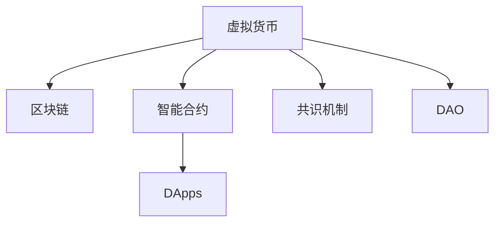

                 

# 虚拟货币生态:全球脑时代的经济运行体系

## 1. 背景介绍

### 1.1 问题由来

在21世纪初期，随着互联网技术的迅猛发展和全球金融市场的不断融合，一种新的数字资产形式——虚拟货币开始崭露头角。比特币的诞生标志着区块链技术的初步应用，也开启了一个新的金融时代——全球脑时代。全球脑时代不仅意味着金融市场的数字化和智能化，更深刻地影响了经济、法律、社会伦理等多方面。

虚拟货币生态系统（Crypto ecosystem），是全球脑时代的核心架构。它由虚拟货币、区块链网络、智能合约、分布式应用（DApps）等多个模块构成。在这一体系中，虚拟货币扮演着价值载体和交易媒介的角色，区块链提供了去中心化、安全性高、透明公开的账本支持，智能合约则提供了自动化的执行环境，而DApps则涵盖了金融、社交、游戏、教育等各个领域，为全球脑时代的各类应用场景提供了丰富的可能性。

### 1.2 问题核心关键点

虚拟货币生态系统之所以重要，在于它构建了一个全新的经济运行体系。这一体系以数字货币为媒介，通过区块链技术提供信任保障，利用智能合约实现自动化执行，结合DApps提供各种智能化的应用，彻底颠覆了传统的金融和交易模式。以下是虚拟货币生态系统在多个维度上的核心关键点：

1. **去中心化**：区块链技术的去中心化特性，使得虚拟货币交易不受单一机构控制，保证了系统的开放性和公平性。
2. **透明公开**：所有交易记录公开透明，无法篡改，确保了交易的可信度和安全性。
3. **自动化执行**：智能合约自动执行，减少了人工干预，提高了交易效率和透明度。
4. **智能应用**：结合DApps提供智能化的应用场景，为经济活动带来了更多创新可能性。
5. **隐私保护**：利用加密技术保护用户隐私，避免个人信息被滥用。

这些核心关键点共同构建了虚拟货币生态系统的基本框架，为全球脑时代的各类经济活动提供了坚实的基础。

## 2. 核心概念与联系

### 2.1 核心概念概述

虚拟货币生态系统包含了多个核心概念，这些概念相互联系，构成了系统的运行基础。以下是几个关键概念的概述：

1. **虚拟货币（Crypto currency）**：指通过区块链技术发行和管理的数字货币，如比特币、以太坊等。
2. **区块链（Blockchain）**：一种去中心化的分布式账本技术，由区块按时间顺序连接构成，具有不可篡改、透明公开的特性。
3. **智能合约（Smart contract）**：通过区块链技术自动执行的合约，具有自动化、去中心化、透明公开等特点。
4. **分布式应用（DApps）**：在区块链上运行的应用程序，具有去中心化、高效、安全等特点。
5. **共识机制（Consensus mechanism）**：区块链网络中用于达成共识的算法，如工作量证明（PoW）、权益证明（PoS）等。
6. **去中心化自治组织（DAO）**：一种基于区块链技术的管理形式，由社区成员共同治理。

这些概念之间的联系可以通过以下Mermaid流程图来展示：



这个流程图展示了虚拟货币生态系统的核心概念及其相互关系：

1. 虚拟货币通过区块链技术进行发行和管理。
2. 智能合约在区块链上运行，自动执行交易和协议。
3. DApps利用区块链和智能合约提供各类智能化的应用场景。
4. 共识机制保障区块链网络的安全和稳定。
5. DAO用于社区治理，协调DApps的开发和运营。

## 3. 核心算法原理 & 具体操作步骤

### 3.1 算法原理概述

虚拟货币生态系统的核心算法原理主要基于区块链和智能合约技术。以下是区块链和智能合约的基本原理：

**区块链原理**：区块链通过将交易数据打包成区块，按时间顺序连接形成链式结构。每个区块包含一个哈希值，确保了区块数据的不可篡改性。共识机制用于达成共识，确定新区块的添加。

**智能合约原理**：智能合约是一种自动执行的合约，其逻辑和条件写在区块链上。一旦合约条件满足，智能合约将自动执行相应的操作，如转账、执行买卖合约等。

### 3.2 算法步骤详解

基于区块链和智能合约技术的虚拟货币生态系统，其核心算法步骤如下：

1. **虚拟货币发行**：通过区块链网络，虚拟货币由发行方根据预设规则生成并记录在区块链上。
2. **交易确认**：当用户发起交易时，智能合约根据交易规则自动验证并执行。
3. **共识达成**：通过共识机制，确保所有节点对交易记录达成一致，防止双重支付。
4. **智能合约执行**：智能合约自动执行交易，记录在区块链上，保证交易的可信度和安全性。
5. **DApps运行**：DApps在区块链上运行，提供各类智能化的应用服务。

### 3.3 算法优缺点

虚拟货币生态系统基于区块链和智能合约技术，具有以下优点：

- **去中心化**：无需中央权威机构，提升了系统的透明性和安全性。
- **透明公开**：所有交易记录公开透明，减少了信息不对称。
- **自动化执行**：减少了人工干预，提高了交易效率和透明度。
- **智能应用**：结合DApps提供智能化的应用场景，丰富了经济活动。

但同时也存在一些缺点：

- **计算资源消耗大**：区块链和智能合约的运行需要大量计算资源，可能影响网络性能。
- **扩展性有限**：当前区块链网络的扩展性有限，难以处理大规模交易。
- **安全风险**：共识机制的漏洞可能导致网络攻击和重放攻击。
- **法律监管不足**：缺乏明确的法律和监管框架，可能引发监管风险。

### 3.4 算法应用领域

虚拟货币生态系统的核心算法原理和操作步骤，在多个领域中得到了广泛应用，例如：

- **金融支付**：虚拟货币作为一种支付方式，已经被广泛应用于跨境支付、汇款等场景。
- **供应链管理**：通过区块链技术，供应链各环节的信息透明化，提高了效率和可信度。
- **版权保护**：利用区块链和智能合约技术，实现版权的自动授权和交易。
- **数字身份**：通过区块链技术，实现数字身份的管理和认证。
- **去中心化金融（DeFi）**：在区块链上运行金融服务，如去中心化交易所、借贷平台等。

## 4. 数学模型和公式 & 详细讲解 & 举例说明

### 4.1 数学模型构建

在虚拟货币生态系统中，数学模型主要用于分析共识机制和智能合约的运行。以下是一个基于PoW（工作量证明）的共识机制数学模型：

1. **工作量证明机制**：矿工需要计算哈希值，第一个计算正确的节点将区块添加到区块链上。
2. **奖励机制**：奖励给找到正确哈希值的节点一定数量的虚拟货币。

设矿工数量为N，单个区块产生的奖励为R，则每找到一次正确哈希值的概率为 $\frac{1}{2^n}$，其中n为哈希算法的复杂度。假设找到一个区块的时间为T，则每个矿工找到区块的期望时间期望为 $\mathbb{E}[T]=\frac{2^n}{R}$。

### 4.2 公式推导过程

对于上述共识机制，我们可以进一步推导出每个矿工找到区块的期望时间期望公式：

$$
\mathbb{E}[T] = \frac{2^n}{R}
$$

其中，R为虚拟货币的奖励量，n为哈希算法的复杂度。这个公式展示了在PoW机制下，矿工找到区块的期望时间与奖励量和哈希复杂度的关系。

### 4.3 案例分析与讲解

以比特币为例，其PoW共识机制中，矿工需要计算哈希值找到随机数，该过程的复杂度为1000，即n=1000。假设比特币的奖励为10个比特币，即R=10，则每个矿工找到区块的期望时间期望为：

$$
\mathbb{E}[T] = \frac{2^{1000}}{10}
$$

这个公式展示了比特币网络中，矿工找到区块的期望时间非常长，这保证了系统的安全性。但同时也带来了网络扩展性有限的问题，需要不断改进共识机制以适应更多的交易需求。

## 5. 项目实践：代码实例和详细解释说明

### 5.1 开发环境搭建

在进行虚拟货币生态系统的项目实践前，我们需要准备好开发环境。以下是使用Python和PyBlockchain库进行区块链开发的流程：

1. 安装Anaconda：从官网下载并安装Anaconda，用于创建独立的Python环境。
2. 创建并激活虚拟环境：
```bash
conda create -n blockchain-env python=3.8 
conda activate blockchain-env
```

3. 安装PyBlockchain：
```bash
pip install pyblockchain
```

4. 安装必要的库：
```bash
pip install flask flaskrestful requests
```

完成上述步骤后，即可在`blockchain-env`环境中开始区块链开发的实践。

### 5.2 源代码详细实现

下面以比特币的区块链实现为例，给出使用PyBlockchain库进行区块链开发的Python代码实现。

```python
from pyblockchain import Block, Blockchain, Consensus
from pyblockchain import transaction

# 创建区块链实例
blockchain = Blockchain()
consensus = Consensus('PoW', 2**31)  # 选择PoW共识机制，哈希复杂度为2^31

# 创建初始区块
block = Block(blockchain=blockchain, consensus=consensus, prev_hash=blockchain.hash_last_block())
block.add_transaction(transaction.create_genesis_block(transaction))
blockchain.add_block(block)

# 挖矿并添加新区块
blockchain.mine_blocks(100)
```

在上述代码中，我们首先创建了一个区块链实例，并指定了工作量证明（PoW）共识机制和哈希复杂度。然后创建了初始区块，并添加了一个创世区块。最后通过挖矿机制，矿工可以自动添加新区块，更新区块链。

### 5.3 代码解读与分析

让我们再详细解读一下关键代码的实现细节：

**区块链实例创建**：通过PyBlockchain库创建区块链实例，指定共识机制和哈希复杂度。

**区块创建**：创建初始区块，并将创世交易添加到区块中。

**挖矿机制**：通过区块链实例的`mine_blocks`方法，矿工可以自动添加新区块，更新区块链。

以上代码展示了比特币区块链的基本实现流程。开发者可以根据实际需求，进一步扩展区块链的功能，如添加智能合约、实现分布式应用等。

## 6. 实际应用场景

### 6.4 未来应用展望

虚拟货币生态系统的未来应用前景非常广阔，以下是对几个重要应用场景的展望：

- **全球支付系统**：虚拟货币将大幅简化跨境支付流程，降低交易成本，提高支付效率。
- **供应链金融**：结合区块链和智能合约技术，供应链金融将变得更加透明、可信和高效。
- **去中心化金融**：DeFi平台将为金融市场提供更多元化的金融产品和服务，降低传统金融机构的垄断地位。
- **智能合约保险**：利用智能合约技术，实现自动化的保险理赔和赔付，提高保险行业的效率和公平性。
- **数字身份和认证**：通过区块链技术，实现数字身份的统一管理和认证，保障个人隐私和数据安全。
- **去中心化组织**：DAO将改变传统组织的管理模式，实现社区自治，提高决策透明度和效率。

## 7. 工具和资源推荐

### 7.1 学习资源推荐

为了帮助开发者系统掌握虚拟货币生态系统的理论基础和实践技巧，这里推荐一些优质的学习资源：

1. **《区块链原理与技术》**：深入浅出地介绍了区块链的基本原理和关键技术，适合初学者入门。
2. **《智能合约编程》**：详细讲解了智能合约的基本概念和编程方法，适合中级开发者进阶。
3. **《加密货币技术》**：系统介绍了虚拟货币生态系统的核心技术，如共识机制、智能合约等。
4. **CoinDesk网站**：提供最新的虚拟货币和区块链新闻、技术分析和行业报告，是了解最新趋势的好地方。
5. **以太坊开发者文档**：详细介绍了以太坊平台及其智能合约开发环境，是学习和开发智能合约的重要参考。

通过这些资源的学习实践，相信你一定能够快速掌握虚拟货币生态系统的精髓，并用于解决实际的区块链问题。

### 7.2 开发工具推荐

高效的开发离不开优秀的工具支持。以下是几款用于虚拟货币生态系统开发的常用工具：

1. **Python**：灵活的编程语言，丰富的第三方库，适合区块链和智能合约的开发。
2. **PyBlockchain**：Python区块链开发库，提供了创建区块链、共识机制、智能合约等功能，适合快速原型开发。
3. **Web3.js**：以太坊官方提供的JavaScript库，支持智能合约的部署、交互和测试。
4. **Truffle Suite**：以太坊开发框架，集成了IDE、测试网络、合约部署等功能，适合智能合约的开发和调试。
5. **Ganache**：以太坊本地测试网络，提供免费的测试以太币，适合开发和测试智能合约。
6. **OpenSSL**：开源加密库，支持生成和验证区块链中的数字证书和签名，适合实现加密通信和安全传输。

合理利用这些工具，可以显著提升虚拟货币生态系统开发的效率，加快创新迭代的步伐。

### 7.3 相关论文推荐

虚拟货币生态系统的核心技术不断演进，以下几篇论文代表了该领域的研究前沿：

1. **Bitcoin: A Peer-to-Peer Electronic Cash System**：比特币白皮书，阐述了比特币系统的核心架构和共识机制。
2. **Ethereum Whitepaper**：以太坊白皮书，详细介绍了以太坊平台的架构和智能合约的实现。
3. **On the Semantic Understanding of Smart Contracts**：分析智能合约的语义理解问题，提出了智能合约的形式化验证方法。
4. **Blockchain-based Supply Chain Management**：研究了基于区块链的供应链管理，展示了其优势和应用场景。
5. **Decentralized Autonomous Organizations**：探讨了DAO的组织形式和管理机制，展望了其未来的发展方向。

这些论文代表了大规模区块链和智能合约的研究脉络，为虚拟货币生态系统的持续发展和优化提供了理论支持。

## 8. 总结：未来发展趋势与挑战

### 8.1 总结

本文对虚拟货币生态系统进行了全面系统的介绍。首先阐述了虚拟货币生态系统在21世纪初期迅速发展的原因和背景，明确了其在全球脑时代的核心地位和核心关键点。其次，从原理到实践，详细讲解了虚拟货币生态系统的核心算法原理和操作步骤，给出了虚拟货币生态系统的完整代码实现。同时，本文还广泛探讨了虚拟货币生态系统在多个行业领域的应用前景，展示了其巨大的潜力。此外，本文精选了虚拟货币生态系统的各类学习资源，力求为读者提供全方位的技术指引。

通过本文的系统梳理，可以看到，虚拟货币生态系统已经构建了一个全新的经济运行体系，彻底颠覆了传统的金融和交易模式。未来，伴随区块链和智能合约技术的持续演进，这一体系将带来更多颠覆性的变革，深刻影响全球经济和社会的发展。

### 8.2 未来发展趋势

展望未来，虚拟货币生态系统的发展趋势如下：

1. **技术迭代加速**：区块链和智能合约技术将不断演进，提升系统的性能和安全性，降低交易成本。
2. **应用场景多样化**：虚拟货币生态系统将涵盖更多应用场景，如供应链金融、数字身份、去中心化金融等。
3. **跨链技术发展**：不同区块链之间的互操作性将得到提升，实现资产跨链流转。
4. **共识机制多样化**：除了PoW和PoS，未来还将出现更多共识机制，如DPoS、PBFT等，提升系统的扩展性和安全性。
5. **隐私保护加强**：隐私保护技术将进一步发展，保护用户的隐私和数据安全。
6. **法规政策完善**：虚拟货币生态系统将逐步完善法规政策，保障其健康发展。

这些趋势凸显了虚拟货币生态系统的广阔前景。这些方向的探索发展，必将进一步提升虚拟货币生态系统的性能和应用范围，为全球经济和社会带来深远影响。

### 8.3 面临的挑战

尽管虚拟货币生态系统已经取得了瞩目成就，但在迈向更加智能化、普适化应用的过程中，它仍面临着诸多挑战：

1. **扩展性瓶颈**：当前区块链网络的扩展性有限，难以处理大规模交易。如何提升扩展性，成为一大难题。
2. **安全性问题**：区块链网络的安全性仍面临挑战，如51%攻击、重放攻击等。如何提高安全性，避免系统崩溃。
3. **法律法规不完善**：虚拟货币生态系统缺乏明确的法律和监管框架，可能引发监管风险。
4. **共识机制漏洞**：共识机制的漏洞可能导致网络攻击和重放攻击。如何改进共识机制，增强系统安全性。
5. **技术复杂度高**：区块链和智能合约技术复杂度高，需要高水平的专业人才进行开发和维护。如何降低技术门槛，提高系统的易用性。

正视虚拟货币生态系统面临的这些挑战，积极应对并寻求突破，将是大规模区块链和智能合约走向成熟的必由之路。相信随着学界和产业界的共同努力，这些挑战终将一一被克服，虚拟货币生态系统必将在构建人机协同的智能时代中扮演越来越重要的角色。

### 8.4 研究展望

面对虚拟货币生态系统所面临的种种挑战，未来的研究需要在以下几个方面寻求新的突破：

1. **提升扩展性**：开发更高效的网络协议和共识机制，提升系统的扩展性和并发性能。
2. **加强安全性**：改进共识机制和智能合约的设计，增强系统的鲁棒性和安全性。
3. **完善法规政策**：加强虚拟货币生态系统的法律和监管研究，提供规范的运行环境。
4. **优化开发工具**：开发更多易用、高效的开发工具，降低技术门槛，提高开发效率。
5. **跨链互操作**：研究跨链互操作技术，实现不同区块链之间的无缝连接。
6. **隐私保护技术**：研究隐私保护技术，保护用户数据和隐私。

这些研究方向将引领虚拟货币生态系统向更高的台阶发展，为构建安全、可靠、可解释、可控的智能系统铺平道路。面向未来，虚拟货币生态系统还需要与其他人工智能技术进行更深入的融合，如知识表示、因果推理、强化学习等，多路径协同发力，共同推动虚拟货币生态系统的进步。只有勇于创新、敢于突破，才能不断拓展区块链和智能合约的边界，让智能技术更好地造福人类社会。

## 9. 附录：常见问题与解答

**Q1: 什么是区块链和智能合约？**

A: 区块链是一种去中心化的分布式账本技术，通过区块按时间顺序连接构成，具有不可篡改、透明公开的特性。智能合约是一种自动执行的合约，其逻辑和条件写在区块链上，一旦合约条件满足，智能合约将自动执行相应的操作。

**Q2: 如何提高虚拟货币生态系统的扩展性？**

A: 提高虚拟货币生态系统的扩展性需要从多个方面入手，如优化共识机制、改进网络协议、采用分片技术、优化智能合约等。

**Q3: 区块链和智能合约的安全性如何保障？**

A: 区块链和智能合约的安全性主要通过共识机制、加密技术、多签名机制等方式保障。

**Q4: 虚拟货币生态系统如何应对监管挑战？**

A: 虚拟货币生态系统需要加强与法律法规的协调，制定明确的监管框架，保障系统的健康发展。

**Q5: 虚拟货币生态系统的未来趋势是什么？**

A: 虚拟货币生态系统的未来趋势包括技术迭代加速、应用场景多样化、跨链技术发展、共识机制多样化、隐私保护加强、法规政策完善等。

---

作者：禅与计算机程序设计艺术 / Zen and the Art of Computer Programming

