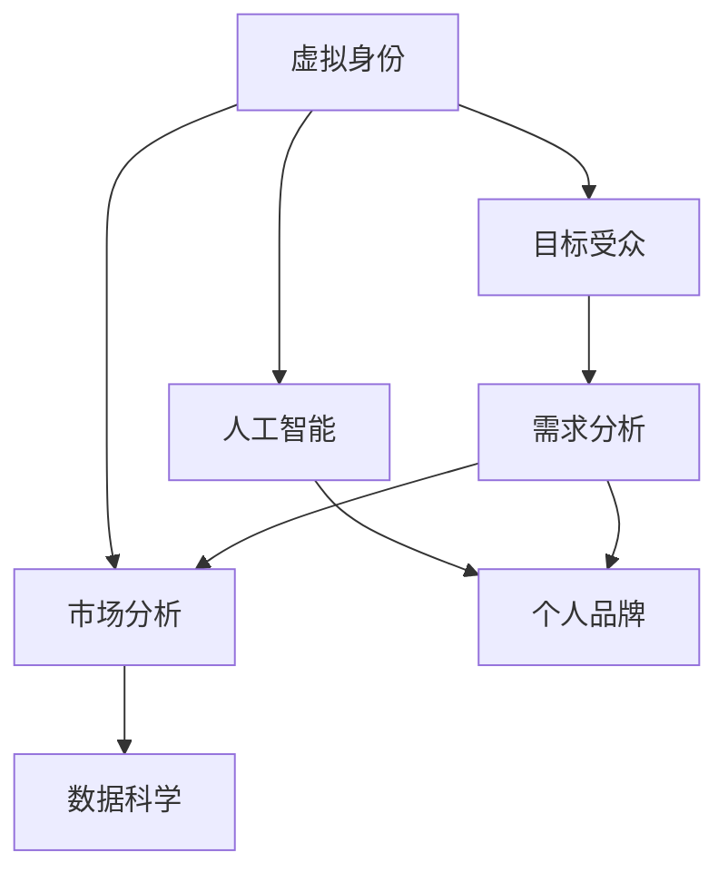

                 

# 虚拟身份市场分析师：AI时代的个人品牌顾问

> 关键词：虚拟身份, 市场分析, 人工智能, 个人品牌, 数据科学

## 1. 背景介绍

在数字化时代，个人品牌已成为职业发展的重要组成部分。随着人工智能技术的迅猛发展，如何利用AI技术提升个人品牌影响力，成为一个引人注目的话题。特别是在虚拟身份和数字营销领域，虚拟身份市场分析师的角色显得尤为重要。虚拟身份，即通过数字技术和AI算法构建的虚拟存在，不仅能够帮助个人以更具吸引力的方式展现自己，还能提升品牌知名度和市场竞争力。

本文将深入探讨虚拟身份市场分析师的工作原理、核心算法和操作步骤，通过一系列案例分析与讲解，展示其如何在AI时代中塑造并优化个人品牌。此外，本文还将详细讨论其在多领域的应用场景，以及未来发展趋势和面临的挑战。

## 2. 核心概念与联系

### 2.1 核心概念概述

- **虚拟身份(Virtual Identity)**：基于数字技术构建的虚拟存在，可以是一个虚拟人物、虚拟社交账号或虚拟体验。它通过AI技术展现个性、行为和能力，模拟真实世界中的角色，形成独特的品牌形象。

- **市场分析(Market Analysis)**：对市场动态、趋势和需求进行研究和分析，以指导决策和行动。虚拟身份市场分析师利用数据分析和AI算法，精准把握市场需求，预测市场变化。

- **人工智能(Artificial Intelligence)**：通过机器学习、自然语言处理、计算机视觉等技术，构建智能化的虚拟身份，提升其互动性和真实感。

- **个人品牌(Personal Brand)**：个人或组织在公众眼中形成的认知和价值定位，通过特定行为、形象和信息传达，形成独特的影响力和市场地位。

- **数据科学(Data Science)**：结合统计学、计算技术和数据分析，从数据中提取有价值的信息，指导决策和创新。

这些概念之间的关系可以通过以下Mermaid流程图来展示：



这个流程图展示了虚拟身份市场分析师如何利用AI技术，结合数据科学，对目标受众进行需求分析，并构建和优化个人品牌。

## 3. 核心算法原理 & 具体操作步骤

### 3.1 算法原理概述

虚拟身份市场分析器的核心算法主要基于机器学习和自然语言处理技术。其工作原理如下：

1. **需求分析**：利用数据科学工具，分析目标受众的需求和偏好，构建用户画像，识别市场热点。
2. **AI建模**：通过自然语言处理和机器学习算法，构建虚拟身份的模型，使其能够理解和生成符合用户需求的内容。
3. **优化调整**：根据用户反馈和市场变化，不断优化虚拟身份的模型，提升其互动性和真实感。

### 3.2 算法步骤详解

1. **数据收集与处理**
   - 收集目标受众的社交媒体数据、在线行为数据、反馈信息等，构建多维度数据集。
   - 使用数据清洗和预处理技术，去除噪声数据，标准化数据格式。

2. **需求建模与分析**
   - 利用机器学习算法，如聚类分析和分类算法，分析用户需求，构建用户画像。
   - 通过自然语言处理技术，如情感分析和主题建模，识别市场热点和用户偏好。

3. **虚拟身份构建**
   - 基于用户画像和市场需求，使用生成对抗网络（GAN）、深度学习等技术，构建虚拟身份的模型。
   - 通过文本生成、语音合成、图像生成等技术，使虚拟身份具备多种互动方式。

4. **互动与优化**
   - 将虚拟身份部署到社交媒体、网站、应用程序等平台，与用户进行互动。
   - 根据用户反馈和互动效果，不断优化虚拟身份的模型，提升其互动性和真实感。

### 3.3 算法优缺点

**优点**：
- 能够快速响应市场需求，提升品牌知名度和市场竞争力。
- 通过AI技术，提升互动性和真实感，增强用户黏性。
- 数据驱动的决策，更加科学和精准。

**缺点**：
- 数据隐私和安全问题。虚拟身份涉及大量用户数据，需要严格保护用户隐私。
- 技术复杂度高，需要跨学科知识和技能。
- 初始投资和维护成本高，需要强大的技术支持和团队。

### 3.4 算法应用领域

虚拟身份市场分析师在多个领域有广泛的应用，例如：

- **电子商务**：通过虚拟身份进行产品展示和互动，提升用户体验和转化率。
- **品牌推广**：构建虚拟代言人，提升品牌形象和市场影响力。
- **客户服务**：利用虚拟客服，提供24/7的客户支持，提升服务效率和满意度。
- **营销活动**：通过虚拟身份进行社交媒体营销，精准触达目标受众，提升营销效果。
- **虚拟活动**：举办虚拟展览、虚拟会议等活动，增加品牌曝光和用户参与度。

## 4. 数学模型和公式 & 详细讲解 & 举例说明

### 4.1 数学模型构建

假设目标受众的社交媒体数据集为 $D=\{(x_i,y_i)\}_{i=1}^N$，其中 $x_i$ 表示用户的历史互动数据，$y_i$ 表示用户的兴趣标签。虚拟身份市场分析师的任务是构建一个模型 $M$，使其能够预测新用户 $z$ 的兴趣标签。

数学模型构建如下：

$$
M = \arg\min_{\theta} \frac{1}{N} \sum_{i=1}^N \mathcal{L}(M(x_i),y_i)
$$

其中 $\mathcal{L}$ 为损失函数，用于衡量模型预测结果与实际标签之间的差异。

### 4.2 公式推导过程

以分类任务为例，假设模型 $M$ 的输出为 $y' = M(x)$，则分类问题的损失函数为交叉熵损失函数：

$$
\mathcal{L}(y',y) = -\sum_{i=1}^N y_i \log M(x_i) + (1-y_i) \log (1-M(x_i))
$$

其中 $y$ 为实际标签，$y'$ 为模型预测结果。

### 4.3 案例分析与讲解

假设目标受众的社交媒体数据集中包含用户的兴趣爱好，如电影、书籍、音乐等。市场分析师首先使用聚类算法将用户分为不同的兴趣群体，然后基于每个兴趣群体的特征，使用深度学习模型构建虚拟身份的推荐系统。通过分析用户与虚拟身份的互动数据，模型能够不断调整虚拟身份的行为和内容，提升用户满意度和转化率。

## 5. 项目实践：代码实例和详细解释说明

### 5.1 开发环境搭建

在开发环境搭建方面，需要以下工具和软件：

- Python：Python 3.7及以上版本，用于数据处理和模型训练。
- TensorFlow或PyTorch：用于构建和训练虚拟身份模型。
- Jupyter Notebook：用于交互式数据处理和模型训练。
- Scikit-learn：用于数据预处理和特征工程。

### 5.2 源代码详细实现

以下是一个使用TensorFlow构建虚拟身份市场分析器的示例代码：

```python
import tensorflow as tf
from sklearn.preprocessing import LabelEncoder

# 数据加载和预处理
def load_and_preprocess_data():
    # 加载社交媒体数据
    data = load_data()
    # 数据清洗和预处理
    data = preprocess_data(data)
    # 标签编码
    le = LabelEncoder()
    labels = le.fit_transform(data['labels'])
    return data, labels

# 模型构建
def build_model(input_shape, num_classes):
    model = tf.keras.Sequential([
        tf.keras.layers.Dense(128, activation='relu', input_shape=input_shape),
        tf.keras.layers.Dense(64, activation='relu'),
        tf.keras.layers.Dense(num_classes, activation='softmax')
    ])
    return model

# 模型训练
def train_model(model, data, labels, epochs, batch_size):
    model.compile(optimizer='adam', loss='categorical_crossentropy', metrics=['accuracy'])
    model.fit(data, labels, epochs=epochs, batch_size=batch_size)

# 数据加载和预处理
data, labels = load_and_preprocess_data()

# 模型构建和训练
input_shape = (input_dim,)
num_classes = num_labels
model = build_model(input_shape, num_classes)
train_model(model, data, labels, epochs=10, batch_size=32)
```

### 5.3 代码解读与分析

代码中，`load_and_preprocess_data` 函数用于数据加载和预处理，`build_model` 函数用于构建虚拟身份市场分析器模型，`train_model` 函数用于模型训练。通过训练模型，我们可以预测新用户的兴趣标签，从而构建更加符合用户需求的虚拟身份。

## 6. 实际应用场景

### 6.1 电子商务

在电子商务领域，虚拟身份市场分析师可以帮助电商平台构建虚拟客服、虚拟导购等，提升用户体验和购买转化率。例如，电商平台可以利用虚拟导购进行商品推荐，通过分析用户历史购买记录和浏览行为，生成个性化的推荐列表。虚拟导购还可以回答用户疑问，提供专业的购买建议，增强用户购买信心。

### 6.2 品牌推广

品牌推广中，虚拟身份市场分析师可以构建虚拟代言人，提升品牌知名度和市场影响力。例如，时尚品牌可以构建虚拟时尚博主，通过社交媒体发布时尚资讯和穿搭建议，吸引目标受众。虚拟博主可以通过互动，增加品牌曝光和用户黏性，提升品牌形象和市场影响力。

### 6.3 客户服务

客户服务中，虚拟身份市场分析师可以构建虚拟客服，提供24/7的客户支持。例如，银行业可以利用虚拟客服进行客户咨询和投诉处理，提升服务效率和客户满意度。虚拟客服还可以根据用户的历史互动数据，预测用户需求，提供个性化的服务，提升用户满意度。

### 6.4 营销活动

营销活动中，虚拟身份市场分析师可以构建虚拟代言人，进行社交媒体营销，精准触达目标受众。例如，科技公司可以构建虚拟代言人，发布最新的产品和技术资讯，吸引目标受众。虚拟代言人可以通过互动，增加品牌曝光和用户参与度，提升营销效果。

### 6.5 虚拟活动

虚拟活动中，虚拟身份市场分析师可以举办虚拟展览、虚拟会议等，增加品牌曝光和用户参与度。例如，教育机构可以举办虚拟教育展，展示最新的教育技术和产品。虚拟展可以通过互动，增加用户参与度，提升品牌形象和市场影响力。

## 7. 工具和资源推荐

### 7.1 学习资源推荐

- Coursera和edX等在线课程平台：提供机器学习、自然语言处理、数据科学等课程，帮助理解虚拟身份市场分析器的原理和实践。
- Google AI的《Hands-On Machine Learning with Scikit-Learn, Keras, and TensorFlow》书籍：介绍了机器学习、深度学习和自然语言处理的实践技巧，适用于实际项目开发。
- Hugging Face的Transformers库：提供多种预训练语言模型，适用于虚拟身份构建和优化。

### 7.2 开发工具推荐

- TensorFlow和PyTorch：两大流行的深度学习框架，提供丰富的机器学习算法和模型库。
- Jupyter Notebook：交互式的数据处理和模型训练环境，方便代码调试和实验。
- Scikit-learn：常用的数据处理和特征工程工具，适用于数据预处理和模型训练。

### 7.3 相关论文推荐

- "Generative Adversarial Nets" by Ian Goodfellow等人：介绍生成对抗网络（GAN）的基本原理和应用。
- "Attention is All You Need" by Ashish Vaswani等人：介绍Transformer模型，为虚拟身份的构建提供了理论基础。
- "A Survey on Deep Learning Based Characterization of Social Media Content" by M. Mohammadi、R. Ghofrani和M. Sadeghi：综述了利用深度学习进行社交媒体内容分析的研究进展。

## 8. 总结：未来发展趋势与挑战

### 8.1 研究成果总结

虚拟身份市场分析师作为AI时代个人品牌顾问，其工作原理和技术方法已经在多个领域展示了显著效果。通过机器学习和自然语言处理技术，构建了具有高度互动性和真实感的虚拟身份，提升了品牌知名度和市场竞争力。

### 8.2 未来发展趋势

未来，虚拟身份市场分析师将面临以下几个发展趋势：

1. **跨领域融合**：虚拟身份将与物联网、增强现实等技术结合，提供更加丰富和多样的互动体验。
2. **个性化推荐**：通过更精确的用户画像和需求分析，提供个性化的虚拟身份推荐和互动，提升用户体验。
3. **情感计算**：引入情感计算技术，使虚拟身份能够更好地理解和回应用户情感，增强用户黏性。
4. **隐私保护**：加强数据隐私保护措施，确保用户数据的安全和隐私。
5. **跨模态交互**：通过多模态数据的融合，提升虚拟身份的互动性和真实感。

### 8.3 面临的挑战

尽管虚拟身份市场分析师在多个领域展示了显著效果，但也面临以下几个挑战：

1. **数据隐私和安全**：虚拟身份涉及大量用户数据，数据隐私和安全问题亟待解决。
2. **技术复杂度高**：虚拟身份的构建和优化需要跨学科知识和技能，技术难度较大。
3. **初始投资和维护成本高**：虚拟身份的构建和优化需要强大的技术支持和团队，初始投资和维护成本高。
4. **互动性和真实感**：如何提升虚拟身份的互动性和真实感，使其更加贴近用户，仍需不断优化和改进。
5. **市场接受度**：虚拟身份的接受度仍需市场教育和用户习惯的改变。

### 8.4 研究展望

未来，虚拟身份市场分析师将探索以下几个方向：

1. **跨模态数据融合**：利用多模态数据的融合，提升虚拟身份的互动性和真实感。
2. **情感计算与行为分析**：引入情感计算技术，使虚拟身份能够更好地理解和回应用户情感，增强用户黏性。
3. **用户行为预测**：通过机器学习算法，预测用户行为和需求，提供个性化的虚拟身份推荐和互动。
4. **隐私保护与伦理**：加强数据隐私保护措施，确保用户数据的安全和隐私，同时关注伦理道德问题。
5. **跨领域应用**：探索虚拟身份在更多领域的应用，如教育、医疗、政府服务等，提升各行业的智能化水平。

## 9. 附录：常见问题与解答

**Q1：虚拟身份市场分析师与传统市场分析师有何不同？**

A：虚拟身份市场分析师不仅分析市场数据，还构建和优化虚拟身份，提升品牌知名度和市场竞争力。虚拟身份通过AI技术展现个性和互动性，可以更有效地触达用户和传递信息。

**Q2：构建虚拟身份的主要步骤是什么？**

A：构建虚拟身份的主要步骤包括数据收集和预处理、需求建模与分析、虚拟身份构建和互动优化。每一步都需要运用数据科学和AI技术，确保虚拟身份的精准性和互动性。

**Q3：虚拟身份市场分析师如何提升用户体验？**

A：通过构建虚拟客服、虚拟代言人等，虚拟身份市场分析师可以提供24/7的客户支持和专业化的服务。利用虚拟身份，可以提升用户的购买转化率、品牌曝光和用户参与度。

**Q4：虚拟身份市场分析师面临的主要挑战是什么？**

A：虚拟身份市场分析师面临的主要挑战包括数据隐私和安全问题、技术复杂度高、初始投资和维护成本高、互动性和真实感不足等。这些挑战需要不断优化和改进，才能实现更高的市场竞争力。

**Q5：未来虚拟身份市场分析师的发展趋势是什么？**

A：未来，虚拟身份市场分析师将探索跨模态数据融合、情感计算与行为分析、用户行为预测、隐私保护与伦理、跨领域应用等方向。这些趋势将进一步提升虚拟身份的互动性和真实感，拓展其应用范围。

