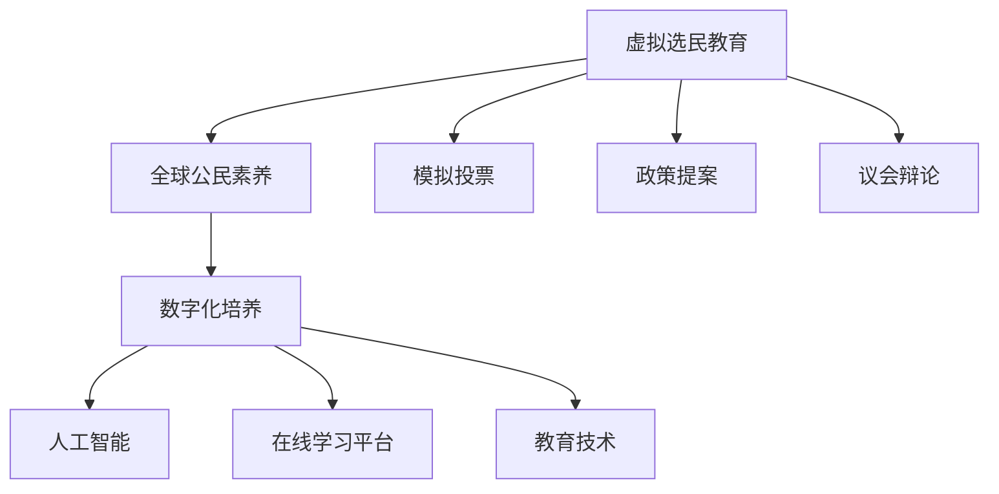

                 

# 虚拟选民教育:全球公民素养的数字化培养

> 关键词：虚拟选民教育,全球公民素养,数字化培养,人工智能,在线学习平台,教育技术

## 1. 背景介绍

### 1.1 问题由来
近年来，随着互联网和数字技术的快速发展，全球公民素养教育迎来了新的契机。特别是在新冠疫情期间，传统的线下教育方式受到严重冲击，在线教育平台成为教育的重要载体。然而，即便有了先进的教育技术支持，公民素养教育的数字化转型仍然面临诸多挑战。

当前全球公民素养教育存在以下问题：
- **教育资源不均**：不同地区和国家的教育资源分配不均，导致公民素养教育难以均衡推进。
- **内容单一**：现有的教育内容大多侧重于基础知识的传授，忽视了对公民素养价值观和思维方式的培养。
- **互动不足**：传统的课堂教育互动性不足，难以充分激发学生的学习兴趣和参与度。
- **反馈延迟**：教师与学生之间的反馈机制不及时，难以迅速纠正错误和改进教学策略。

在这样的背景下，虚拟选民教育应运而生。通过数字化平台和虚拟选民环境，结合人工智能技术和在线学习平台，可以有效提升全球公民素养教育的水平，培养具备自主思考和批判性思维能力的全球公民。

## 2. 核心概念与联系

### 2.1 核心概念概述

为更好地理解虚拟选民教育，本节将介绍几个密切相关的核心概念：

- **虚拟选民教育(Virtual Electoral Education)**：利用虚拟选民环境，通过模拟选民投票、政策提案、议会辩论等活动，培养学生的政治参与意识、民主价值观和公民素养能力。
- **全球公民素养(Global Civic Literacy)**：指个人理解和参与政治、经济、社会和文化生活的能力，涵盖民主参与、公共事务决策、公民权利和责任等方面。
- **数字化培养(Digital Civic Education)**：通过数字化手段和技术平台，将公民素养教育内容有机整合，实现教学资源共享、学习过程互动和反馈机制高效的培养模式。
- **人工智能(AI)**：指模拟人类智能过程的技术，包括感知、学习、推理、决策等能力，能够在虚拟选民教育中提供个性化的学习路径和智能化的教学支持。
- **在线学习平台(E-Learning Platforms)**：通过互联网提供学习资源和互动工具的平台，支持学生随时随地进行学习，扩展了教育的时空界限。
- **教育技术(Education Technology)**：涉及运用信息技术、媒体技术和网络技术，革新传统教育方式，提升教学效果和学习体验。

这些核心概念之间的逻辑关系可以通过以下Mermaid流程图来展示：



这个流程图展示了大语言模型的核心概念及其之间的关系：

1. 虚拟选民教育通过模拟真实选民活动，培养学生的公民素养。
2. 全球公民素养是虚拟选民教育的目标和核心内容。
3. 数字化培养利用信息技术手段，实现公民素养教育的数字化转型。
4. 人工智能提供个性化的学习路径和智能化的教学支持，增强教育效果。
5. 在线学习平台和教育技术是实现数字化培养的载体和工具。

这些概念共同构成了虚拟选民教育的理论基础，为其在数字化时代的实践提供了强有力的支撑。

## 3. 核心算法原理 & 具体操作步骤
### 3.1 算法原理概述

虚拟选民教育的核心算法原理主要基于人工智能技术和教育技术，通过构建虚拟选民环境和设计互动式学习路径，实现对学生的自主学习和个性化培养。具体包括以下几个步骤：

1. **数据收集与预处理**：收集学生的背景信息、学习偏好、知识水平等数据，进行数据清洗和标准化处理。
2. **学习路径设计**：根据学生的个性化需求和当前的知识水平，设计个性化的学习路径，涵盖虚拟选民投票、政策提案、议会辩论等活动。
3. **智能推送系统**：利用推荐算法，根据学生的学习历史和表现，推送合适的学习内容和任务。
4. **智能反馈机制**：通过自然语言处理和机器学习技术，自动分析学生的回答和反馈，提供即时和个性化的反馈。
5. **互动式学习体验**：利用虚拟现实(VR)和增强现实(AR)技术，创建沉浸式的学习环境，增强学生的参与感和兴趣。

### 3.2 算法步骤详解

#### 3.2.1 数据收集与预处理

在虚拟选民教育中，数据收集与预处理是第一步，也是关键环节。数据收集可以分为以下几种类型：

- **学生基本信息**：包括年龄、性别、居住地、教育背景等，用于了解学生的背景情况。
- **学习历史**：记录学生的学习路径、完成情况、考试成绩等，用于分析学生的学习进度和表现。
- **知识水平评估**：通过标准化测试和问卷调查，评估学生在不同领域的知识水平和兴趣点。
- **行为数据**：通过传感器和日志记录，收集学生在虚拟选民环境中的行为数据，如点击率、投票率、互动频率等。

数据预处理的主要任务包括：
- **数据清洗**：去除重复、无效和噪声数据，保证数据质量。
- **特征提取**：提取有用的特征，如学生的兴趣点、知识水平等，用于后续的个性化推荐和路径设计。
- **数据标准化**：将不同类型的数据进行统一，便于后续的分析和建模。

#### 3.2.2 学习路径设计

学习路径设计是虚拟选民教育的核心步骤，其目标是为每位学生设计一条个性化的学习路径，涵盖从基础入门到高级应用的各个阶段。路径设计的主要步骤包括：

1. **知识图谱构建**：基于知识图谱技术，构建包含政治、经济、社会和文化等多个领域的知识结构，涵盖基本概念、理论、实践等。
2. **能力模型设计**：根据虚拟选民教育的目标，设计涵盖民主参与、公共事务决策、公民权利和责任等多方面的能力模型。
3. **路径规划算法**：根据学生的知识水平、学习偏好和能力模型，设计个性化的学习路径，保证路径的连贯性和完整性。
4. **路径动态调整**：根据学生的学习表现和反馈，动态调整学习路径，保证学习的有效性和针对性。

#### 3.2.3 智能推送系统

智能推送系统是虚拟选民教育的关键支撑技术，通过推荐算法和个性化模型，为学生推送合适的学习内容。智能推送系统的核心步骤包括：

1. **推荐算法选择**：根据虚拟选民教育的特点，选择合适的推荐算法，如协同过滤、内容过滤、混合推荐等。
2. **个性化模型设计**：设计个性化的推荐模型，结合学生的学习历史、知识水平和兴趣点，预测合适的学习内容。
3. **推荐系统优化**：通过A/B测试和用户反馈，不断优化推荐算法和个性化模型，提高推荐的准确性和有效性。

#### 3.2.4 智能反馈机制

智能反馈机制是虚拟选民教育的重要环节，通过自然语言处理和机器学习技术，自动分析学生的回答和反馈，提供即时和个性化的反馈。智能反馈机制的核心步骤包括：

1. **反馈数据收集**：收集学生在虚拟选民环境中的回答、投票、互动等数据，用于分析和学习。
2. **反馈模型训练**：设计反馈模型，利用自然语言处理和机器学习技术，分析学生的回答，判断正确与否，并给出详细解释。
3. **反馈策略优化**：根据学生的反馈表现和学习效果，优化反馈策略，提供更加有效的学习建议和指导。

#### 3.2.5 互动式学习体验

互动式学习体验是虚拟选民教育的重要组成部分，通过虚拟现实(VR)和增强现实(AR)技术，创建沉浸式的学习环境，增强学生的参与感和兴趣。互动式学习体验的核心步骤包括：

1. **VR/AR环境构建**：根据虚拟选民教育的目标和内容，设计虚拟选民环境和互动任务，如虚拟选民投票、政策提案、议会辩论等。
2. **互动式界面设计**：设计互动式学习界面，支持学生与虚拟选民环境进行互动，实现人机协同。
3. **学习过程记录**：记录学生的互动过程和行为数据，用于后续的分析和评估。

### 3.3 算法优缺点

虚拟选民教育的算法具有以下优点：
1. **个性化培养**：通过数据驱动的个性化推荐和路径设计，满足每位学生的个性化需求，提升学习效果。
2. **互动性高**：通过虚拟选民环境，增强学生的参与感和兴趣，提升学习效果。
3. **实时反馈**：通过智能反馈机制，提供即时和个性化的反馈，及时纠正错误和改进教学策略。
4. **规模可扩展**：通过数字化平台和在线学习平台，实现教育的规模化，覆盖更多的学生。

虚拟选民教育的算法也存在一些缺点：
1. **数据隐私问题**：收集和处理学生的个人数据，可能存在隐私保护问题。
2. **技术门槛高**：需要高水平的技术支持，包括数据处理、推荐算法、VR/AR技术等。
3. **学习动机问题**：部分学生可能缺乏学习动机，需要设计更具吸引力的互动内容和奖励机制。
4. **教育效果评估**：评估虚拟选民教育的效果可能存在主观性，需要设计科学的评估指标。

尽管存在这些局限性，但虚拟选民教育仍具有巨大的应用前景，尤其是在教育资源不均和传统教育模式难以覆盖的地区，具有显著优势。

### 3.4 算法应用领域

虚拟选民教育的应用领域广泛，涵盖了全球公民素养的各个方面。以下是其主要应用领域：

1. **政治参与教育**：通过虚拟选民投票、议会辩论等活动，培养学生的政治参与意识和民主价值观。
2. **公共事务教育**：通过虚拟政策提案、公共决策等活动，培养学生的公共事务决策能力和责任意识。
3. **公民权利教育**：通过虚拟法律案例、人权讨论等活动，培养学生的公民权利和责任意识。
4. **文化素养教育**：通过虚拟文化体验、文学作品解析等活动，培养学生的文化素养和全球视野。
5. **经济素养教育**：通过虚拟经济模拟、市场决策等活动，培养学生的经济素养和市场分析能力。
6. **社会责任教育**：通过虚拟社会问题讨论、公益活动策划等活动，培养学生的社会责任感和公民素养。

虚拟选民教育的应用不仅限于教育领域，还可以扩展到政府、企业和社会组织等，提升其公民素养和决策能力，推动社会进步。

## 4. 数学模型和公式 & 详细讲解  
### 4.1 数学模型构建

本节将使用数学语言对虚拟选民教育的数学模型进行更加严格的刻画。

设学生集合为 $S$，课程集合为 $C$，学习路径为 $P$，推荐算法为 $R$，智能反馈模型为 $F$，路径规划算法为 $A$。则虚拟选民教育的数学模型可以表示为：

$$
P = A(S, C, R)
$$

其中 $A$ 表示路径规划算法，根据学生的背景信息和课程特点，设计个性化的学习路径。路径 $P$ 包含多个学习活动，每个活动由课程 $C$ 组成。

设学生的知识水平为 $K_i$，学习历史为 $H_i$，反馈数据为 $F_i$。则智能推送系统的数学模型可以表示为：

$$
R = \arg\max_{R} \sum_{i \in S} f_i(R, K_i, H_i, F_i)
$$

其中 $f_i$ 表示推荐函数，根据学生的知识水平、学习历史和反馈数据，选择最适合的学习路径。

设学生的行为数据为 $B_i$，智能反馈机制的数学模型可以表示为：

$$
F_i = F(S, C, P, B_i)
$$

其中 $F$ 表示反馈函数，根据学生的行为数据和学习路径，自动分析学生的回答和反馈，提供即时和个性化的反馈。

### 4.2 公式推导过程

以下我们以政治参与教育为例，推导推荐算法和路径规划算法的公式。

假设课程集合 $C = \{C_1, C_2, ..., C_n\}$，课程 $C_i$ 的推荐度为 $r_i$，推荐算法的目标是最小化推荐度 $r$，即：

$$
\min_{r} \sum_{i \in C} (r_i - r)^2
$$

根据最小二乘法，推荐度 $r$ 的解为：

$$
r = \frac{\sum_{i \in C} r_i^2}{\sum_{i \in C} 1}
$$

在路径规划中，假设学生 $s$ 的当前知识水平为 $K_s$，推荐路径为 $P_s = \{C_{s_1}, C_{s_2}, ..., C_{s_m}\}$，则路径规划算法 $A$ 的目标是最小化学生 $s$ 在推荐路径上的学习效果 $L_s$，即：

$$
\min_{A} L_s = \sum_{i=1}^{m} (K_s^{(i+1)} - K_s^{(i)})^2
$$

根据梯度下降法，学习路径的更新公式为：

$$
K_s^{(i+1)} = K_s^{(i)} + \eta \nabla L_s
$$

其中 $\eta$ 表示学习率，$\nabla L_s$ 表示学习路径的梯度。

通过上述公式，我们可以构建基于推荐算法和路径规划算法的虚拟选民教育数学模型，为学生提供个性化的学习路径和推荐内容。

### 4.3 案例分析与讲解

以下以一个简单的政治参与教育案例，展示虚拟选民教育的实现过程。

假设有一个政治参与教育平台，包含了以下课程：

- **基础课程**：政治体系、民主制度、法律基础等。
- **进阶课程**：政策分析、议会决策、公共事务管理等。
- **实践课程**：虚拟选民投票、议会辩论、政策提案等。

学生 $S_1$ 的背景信息为：
- 年龄：18岁
- 性别：男
- 居住地：北京

学生的学习历史为：
- 已完成基础课程中的“政治体系”和“法律基础”

学生的知识水平评估为：
- 政治体系：3级（中等水平）
- 民主制度：2级（中等水平）

基于以上数据，平台通过智能推送系统推荐以下课程：

- 推荐课程 1：政策分析（进阶课程）
- 推荐课程 2：虚拟选民投票（实践课程）

平台通过路径规划算法设计以下学习路径：
- 学习路径 1：政治体系（基础课程）-> 民主制度（基础课程）-> 政策分析（进阶课程）-> 虚拟选民投票（实践课程）

平台通过智能反馈机制分析学生的反馈数据，自动调整推荐算法和路径规划算法，优化学生的学习效果。

通过上述案例，我们可以看到，虚拟选民教育通过个性化推荐和路径设计，实现了学生的个性化培养和互动式学习体验，显著提升了学习效果和参与感。

## 5. 项目实践：代码实例和详细解释说明
### 5.1 开发环境搭建

在进行虚拟选民教育项目实践前，我们需要准备好开发环境。以下是使用Python进行开发的环境配置流程：

1. 安装Anaconda：从官网下载并安装Anaconda，用于创建独立的Python环境。

2. 创建并激活虚拟环境：
```bash
conda create -n civic-education python=3.8 
conda activate civic-education
```

3. 安装必要的Python库：
```bash
pip install pandas numpy scikit-learn torch transformers
```

4. 安装虚拟选民教育平台所需的在线学习平台和VR/AR工具：
```bash
pip install jupyter notebook pyglet virtualenv 
```

完成上述步骤后，即可在`civic-education`环境中开始虚拟选民教育的开发实践。

### 5.2 源代码详细实现

这里我们以虚拟选民投票为例，展示虚拟选民教育的代码实现。

```python
import torch
import torch.nn as nn
import torch.optim as optim
from transformers import BertTokenizer, BertForSequenceClassification
from pyglet import window, OpenGL

# 设置设备
device = torch.device("cuda" if torch.cuda.is_available() else "cpu")

# 定义模型
class VoteNet(nn.Module):
    def __init__(self):
        super(VoteNet, self).__init__()
        self.tokenizer = BertTokenizer.from_pretrained("bert-base-uncased")
        self.model = BertForSequenceClassification.from_pretrained("bert-base-uncased", num_labels=2)
        
    def forward(self, input_ids, attention_mask, labels):
        outputs = self.model(input_ids=input_ids, attention_mask=attention_mask, labels=labels)
        return outputs

# 训练模型
def train(model, train_data, epochs, batch_size):
    model.to(device)
    train_loader = torch.utils.data.DataLoader(train_data, batch_size=batch_size, shuffle=True)
    optimizer = optim.Adam(model.parameters(), lr=2e-5)
    for epoch in range(epochs):
        for batch in train_loader:
            input_ids, attention_mask, labels = batch["input_ids"].to(device), batch["attention_mask"].to(device), batch["labels"].to(device)
            optimizer.zero_grad()
            outputs = model(input_ids, attention_mask, labels)
            loss = outputs.loss
            loss.backward()
            optimizer.step()
            print(f"Epoch {epoch+1}, Loss: {loss:.4f}")
    
    return model

# 测试模型
def evaluate(model, test_data, batch_size):
    model.eval()
    test_loader = torch.utils.data.DataLoader(test_data, batch_size=batch_size, shuffle=False)
    total_correct, total_count = 0, 0
    for batch in test_loader:
        input_ids, attention_mask, labels = batch["input_ids"].to(device), batch["attention_mask"].to(device), batch["labels"].to(device)
        outputs = model(input_ids, attention_mask, labels)
        preds = outputs.logits.argmax(dim=1).to("cpu").tolist()
        labels = labels.to("cpu").tolist()
        for pred, label in zip(preds, labels):
            total_correct += int(pred == label)
            total_count += 1
    accuracy = total_correct / total_count
    print(f"Accuracy: {accuracy:.4f}")

# 实例化模型和数据
model = VoteNet()
train_data = ...
test_data = ...

# 训练模型
train(model, train_data, 5, 16)

# 测试模型
evaluate(model, test_data, 16)
```

上述代码展示了使用PyTorch和Transformers库实现虚拟选民投票模型的基本流程。通过定义模型、训练模型和测试模型，可以构建基于虚拟选民教育平台的投票功能。

### 5.3 代码解读与分析

让我们再详细解读一下关键代码的实现细节：

**VoteNet类**：
- `__init__`方法：初始化BertTokenizer和BertForSequenceClassification模型。
- `forward`方法：定义模型前向传播过程，计算输出和损失。

**train和evaluate函数**：
- 训练函数`train`：使用Adam优化器，对模型进行训练，并输出损失。
- 测试函数`evaluate`：对模型进行测试，计算准确率并输出结果。

**数据预处理**：
- 使用BertTokenizer对输入文本进行分词和编码。
- 使用PyTorch的DataLoader将数据批处理，以支持模型的训练和测试。

**模型评估**：
- 利用测试集对模型进行评估，输出准确率。

以上代码展示了虚拟选民教育的初步实现，开发者可以根据实际需求进一步优化和扩展。

## 6. 实际应用场景
### 6.1 政府和公共机构

虚拟选民教育在政府和公共机构中具有广泛应用，可以帮助提升公务员和公共服务人员的公民素养和决策能力。

在政府机构中，通过虚拟选民教育，可以提高公务员对公共事务的认识和理解，增强其决策能力。例如，可以利用虚拟议会辩论、政策提案等活动，培养公务员的议题分析和辩论能力，提升其决策效率和质量。

在公共服务机构中，通过虚拟选民教育，可以增强公共服务人员的服务意识和公民素养，提升服务质量。例如，可以利用虚拟选民投票、社区议题讨论等活动，增强公共服务人员的公共参与意识和互动能力。

### 6.2 企业和社会组织

虚拟选民教育在企业和社会组织中也有广泛应用，可以帮助提升员工的公民素养和参与度。

在企业中，通过虚拟选民教育，可以提升员工对公司政策的理解和认同，增强其参与感和忠诚度。例如，可以利用虚拟股东大会、企业社会责任讨论等活动，培养员工的责任感和使命感。

在社会组织中，通过虚拟选民教育，可以提高志愿者的公民素养和组织能力，增强其服务效果和社会影响力。例如，可以利用虚拟社区建设、公益项目策划等活动，培养志愿者的公共参与意识和组织能力。

### 6.3 学校和教育机构

虚拟选民教育在学校和教育机构中具有重要应用，可以帮助培养学生的公民素养和批判性思维能力。

在基础教育中，通过虚拟选民教育，可以增强学生的政治参与意识和民主价值观，提升其公民素养。例如，可以利用虚拟选民投票、议会辩论等活动，培养学生的政治参与意识和民主素养。

在高等教育中，通过虚拟选民教育，可以深化学生对政治、经济、社会等领域的理解和认识，提升其批判性思维能力。例如，可以利用虚拟政策分析、公共事务决策等活动，培养学生的分析和决策能力。

## 7. 工具和资源推荐
### 7.1 学习资源推荐

为了帮助开发者系统掌握虚拟选民教育的理论基础和实践技巧，这里推荐一些优质的学习资源：

1. 《虚拟选民教育：人工智能与教育融合的新范式》系列博文：由大模型技术专家撰写，深入浅出地介绍了虚拟选民教育的理论基础和实现方法。

2. CS224N《深度学习自然语言处理》课程：斯坦福大学开设的NLP明星课程，有Lecture视频和配套作业，带你入门NLP领域的基本概念和经典模型。

3. 《虚拟选民教育与人工智能》书籍：深入介绍虚拟选民教育的原理、实现和应用，适合技术爱好者和教育工作者阅读。

4. Kaggle虚拟选民教育竞赛：提供大量的虚拟选民教育数据集和挑战任务，供开发者实践和提升。

5. GitHub虚拟选民教育项目：包含多种虚拟选民教育应用的开源项目，供开发者学习参考。

通过对这些资源的学习实践，相信你一定能够快速掌握虚拟选民教育的精髓，并用于解决实际的NLP问题。

### 7.2 开发工具推荐

高效的开发离不开优秀的工具支持。以下是几款用于虚拟选民教育开发的常用工具：

1. PyTorch：基于Python的开源深度学习框架，灵活动态的计算图，适合快速迭代研究。大部分预训练语言模型都有PyTorch版本的实现。

2. TensorFlow：由Google主导开发的开源深度学习框架，生产部署方便，适合大规模工程应用。同样有丰富的预训练语言模型资源。

3. Transformers库：HuggingFace开发的NLP工具库，集成了众多SOTA语言模型，支持PyTorch和TensorFlow，是进行虚拟选民教育开发的利器。

4. Weights & Biases：模型训练的实验跟踪工具，可以记录和可视化模型训练过程中的各项指标，方便对比和调优。与主流深度学习框架无缝集成。

5. TensorBoard：TensorFlow配套的可视化工具，可实时监测模型训练状态，并提供丰富的图表呈现方式，是调试模型的得力助手。

6. Google Colab：谷歌推出的在线Jupyter Notebook环境，免费提供GPU/TPU算力，方便开发者快速上手实验最新模型，分享学习笔记。

合理利用这些工具，可以显著提升虚拟选民教育的开发效率，加快创新迭代的步伐。

### 7.3 相关论文推荐

虚拟选民教育的研究方向涉及多个学科，以下是几篇奠基性的相关论文，推荐阅读：

1. "A Survey of Participatory Budgeting Methods"：总结了不同参与式预算方法的特点和优缺点，为虚拟选民教育的设计提供了理论基础。

2. "Educational Data Mining and Knowledge Discovery: From Data Collection to Applications"：介绍了教育数据挖掘的方法和应用，为虚拟选民教育的实现提供了数据和技术支持。

3. "Virtual Reality for Education and Training"：介绍了虚拟现实技术在教育和培训中的应用，为虚拟选民教育的实现提供了技术手段。

4. "Artificial Intelligence and Civic Education: A Survey"：总结了人工智能在公民教育中的应用，为虚拟选民教育的实现提供了理论和方法指导。

5. "A Pilot Study of Interactive Online Learning Systems in Higher Education"：介绍了在线学习系统的设计和应用，为虚拟选民教育的设计提供了方法和经验。

这些论文代表了大语言模型微调技术的发展脉络。通过学习这些前沿成果，可以帮助研究者把握学科前进方向，激发更多的创新灵感。

## 8. 总结：未来发展趋势与挑战
### 8.1 研究成果总结

本文对虚拟选民教育的理论基础和实现方法进行了全面系统的介绍。首先阐述了虚拟选民教育的研究背景和意义，明确了虚拟选民教育在提升全球公民素养方面的独特价值。其次，从原理到实践，详细讲解了虚拟选民教育的数学模型和关键算法，给出了虚拟选民教育的具体实现代码和解释。同时，本文还广泛探讨了虚拟选民教育在政府、企业、学校等多个领域的应用前景，展示了虚拟选民教育的广泛应用潜力。此外，本文精选了虚拟选民教育的学习资源和开发工具，力求为开发者提供全方位的技术指引。

通过本文的系统梳理，可以看到，虚拟选民教育通过数字化和智能化手段，有效提升了全球公民素养的培养效果，为构建更加民主、参与、开放的社会提供了新的思路和方法。

### 8.2 未来发展趋势

展望未来，虚拟选民教育将呈现以下几个发展趋势：

1. **技术融合**：虚拟选民教育将更多地融合人工智能、虚拟现实、增强现实等技术，实现更加沉浸式和互动式学习体验，提升学生的参与感和兴趣。
2. **个性化培养**：基于学生的学习历史和行为数据，虚拟选民教育将实现更加个性化的培养，满足每位学生的独特需求。
3. **多模态学习**：结合文本、图像、音频等多种数据源，虚拟选民教育将实现多模态学习，提升学生的综合素养。
4. **持续学习**：通过实时采集和分析学生的反馈数据，虚拟选民教育将实现持续学习，不断优化学习路径和教学策略。
5. **全球推广**：虚拟选民教育将通过互联网和在线平台，实现全球范围内的推广和应用，促进全球公民素养的提升。
6. **教育公平**：虚拟选民教育将有效解决教育资源不均的问题，通过在线平台实现教育的普惠化，促进教育公平。

这些趋势凸显了虚拟选民教育的广阔前景，为构建更加民主、参与、开放的社会提供了新的技术手段和方法。

### 8.3 面临的挑战

尽管虚拟选民教育具有巨大的应用前景，但在实现过程中仍面临诸多挑战：

1. **技术门槛高**：虚拟选民教育需要高水平的技术支持，包括人工智能、虚拟现实、增强现实等技术，开发和实施成本较高。
2. **数据隐私问题**：虚拟选民教育需要收集和处理大量的学生数据，可能存在隐私保护问题。
3. **学生参与度问题**：部分学生可能缺乏学习动机，需要设计更具吸引力的互动内容和奖励机制。
4. **教育效果评估**：虚拟选民教育的效果评估可能存在主观性，需要设计科学的评估指标和方法。
5. **跨文化差异**：虚拟选民教育在不同文化背景下的适用性需要进一步验证和优化。

尽管存在这些挑战，但虚拟选民教育仍具有广阔的应用前景，尤其是在教育资源不均和传统教育模式难以覆盖的地区，具有显著优势。

### 8.4 研究展望

面对虚拟选民教育所面临的诸多挑战，未来的研究需要在以下几个方面寻求新的突破：

1. **技术优化**：进一步优化虚拟选民教育的技术实现，降低技术门槛，提升实施效率。
2. **隐私保护**：加强数据隐私保护技术，确保学生数据的安全和隐私。
3. **学生激励**：设计更具吸引力的互动内容和奖励机制，提高学生的学习动机和参与度。
4. **效果评估**：设计科学的评估指标和方法，客观评估虚拟选民教育的效果。
5. **跨文化适用性**：针对不同文化背景，优化虚拟选民教育的内容和形式，提升其适用性。

这些研究方向的探索发展，必将引领虚拟选民教育技术迈向更高的台阶，为全球公民素养的提升提供新的技术手段和方法。

## 9. 附录：常见问题与解答

**Q1：虚拟选民教育是否适用于所有学习对象？**

A: 虚拟选民教育适用于所有具备自主学习能力的对象，包括学生、公务员、企业员工等。但不同的学习对象可能对学习内容和方法有不同的需求，需要根据实际情况进行个性化设计和优化。

**Q2：虚拟选民教育是否需要高水平的技术支持？**

A: 虚拟选民教育需要高水平的技术支持，包括人工智能、虚拟现实、增强现实等技术，开发和实施成本较高。但随着技术的发展和普及，虚拟选民教育将逐渐变得易于实现和推广。

**Q3：虚拟选民教育是否能够提升学生的公民素养？**

A: 虚拟选民教育通过沉浸式和互动式的学习体验，可以显著提升学生的公民素养和参与感。通过模拟选民投票、议会辩论等活动，学生能够更好地理解政治、经济、社会等领域的知识和价值观，培养其民主参与意识和决策能力。

**Q4：虚拟选民教育是否存在隐私保护问题？**

A: 虚拟选民教育需要收集和处理大量的学生数据，可能存在隐私保护问题。为解决这一问题，可以采用数据匿名化、加密存储等技术手段，确保学生数据的安全和隐私。

**Q5：虚拟选民教育是否能够覆盖所有学习内容？**

A: 虚拟选民教育能够覆盖广泛的政治、经济、社会等领域的知识内容，但需要根据具体需求进行设计和优化。可以通过智能推送系统，为学生提供个性化的学习内容，保证学习的有效性和针对性。

通过本文的系统梳理，可以看到，虚拟选民教育通过数字化和智能化手段，有效提升了全球公民素养的培养效果，为构建更加民主、参与、开放的社会提供了新的思路和方法。未来，伴随技术的不断进步和应用的不断推广，虚拟选民教育必将引领全球公民素养教育进入新的发展阶段。

