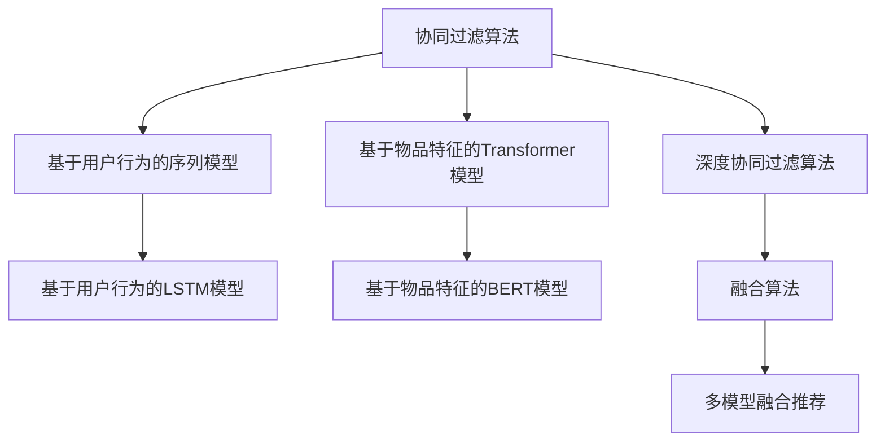

                 

# 融合AI大模型的协同过滤算法优化

## 1. 背景介绍

### 1.1 问题由来

在推荐系统领域，协同过滤（Collaborative Filtering, CF）算法是最为经典的推荐技术之一。该方法通过分析用户的历史行为数据和物品之间的相似性，为每个用户推荐其可能感兴趣的物品。协同过滤算法可以分为基于用户的CF和基于物品的CF两种类型。

近年来，深度学习和自然语言处理技术的发展，使得基于深度神经网络模型的协同过滤算法得到了广泛的应用。例如，基于用户行为序列的RNN、LSTM、GRU等序列模型，以及基于物品特征的Transformer模型等，都在推荐系统中取得了显著的效果。但这些方法通常需要大量的用户行为数据和物品特征数据，且模型复杂度较高，计算资源消耗较大。

同时，深度学习模型存在"冷启动"问题，即新用户或新物品无法得到有效的推荐。这是因为缺乏足够的用户或物品行为数据，导致模型无法建立准确的表示。

为解决这些问题，近年来出现了一种新的推荐算法——深度协同过滤（Deep Collaborative Filtering, DCF），它将深度学习与协同过滤算法结合起来，提升了推荐系统的精度和泛化能力。但DCF模型依旧存在一些挑战，如过度拟合、计算资源消耗大、训练时间长等。

## 2. 核心概念与联系

### 2.1 核心概念概述

为更好地理解融合AI大模型的协同过滤算法优化，本节将介绍几个密切相关的核心概念：

- 协同过滤算法：通过分析用户行为数据和物品之间的相似性，为用户推荐其可能感兴趣的物品。
- 深度协同过滤算法：将深度学习与协同过滤算法结合，构建深度神经网络模型进行推荐。
- 基于用户行为的序列模型：利用用户的历史行为序列进行预测，例如使用RNN、LSTM、GRU等模型。
- 基于物品特征的Transformer模型：利用物品的特征向量进行推荐，例如使用BERT、GPT等预训练语言模型。
- 融合算法：将多个推荐模型进行组合，提高推荐系统的整体效果。

这些核心概念之间的逻辑关系可以通过以下Mermaid流程图来展示：



这个流程图展示了协同过滤算法的核心概念及其之间的关系：

1. 协同过滤算法通过分析用户行为数据和物品之间的相似性，为用户推荐其可能感兴趣的物品。
2. 深度协同过滤算法将深度学习与协同过滤算法结合，构建深度神经网络模型进行推荐。
3. 基于用户行为的序列模型利用用户的历史行为序列进行预测，例如使用LSTM、GRU等模型。
4. 基于物品特征的Transformer模型利用物品的特征向量进行推荐，例如使用BERT、GPT等预训练语言模型。
5. 融合算法将多个推荐模型进行组合，提高推荐系统的整体效果。

这些概念共同构成了推荐系统的学习和应用框架，使其能够更高效、准确地为用户推荐物品。通过理解这些核心概念，我们可以更好地把握推荐系统的设计思路和优化方向。

## 3. 核心算法原理 & 具体操作步骤
### 3.1 算法原理概述

融合AI大模型的协同过滤算法优化，本质上是一个基于深度学习的多模型融合过程。其核心思想是：将多种推荐算法结合起来，综合利用其各自的优势，构建更加精确和鲁棒的推荐模型。

形式化地，假设已有两种推荐算法 $M_{\theta_1}, M_{\theta_2}$，分别对应于用户行为序列和物品特征的深度神经网络模型。对于新的用户 $u$ 和物品 $i$，推荐模型 $M$ 的输出为：

$$
M(u,i) = \alpha_1 M_{\theta_1}(u,i) + \alpha_2 M_{\theta_2}(u,i)
$$

其中，$\alpha_1, \alpha_2$ 为权重系数，需要通过实验确定，使得 $M$ 的输出最接近真实标签 $y$。

通过多模型融合，可以充分利用不同模型的优势，提升推荐系统的预测精度和泛化能力。例如，用户行为序列模型可以捕捉用户行为模式，物品特征模型可以提取物品的语义信息，两者结合起来可以提高推荐效果。

### 3.2 算法步骤详解

基于深度学习的多模型融合，一般包括以下几个关键步骤：

**Step 1: 准备数据集和模型**

- 收集用户行为数据和物品特征数据，构建训练集、验证集和测试集。
- 选择合适的深度神经网络模型，如LSTM、Transformer等。

**Step 2: 设计融合算法**

- 根据任务特点选择合适的融合方式，如线性融合、加权融合、多模型集成等。
- 使用数据集训练初始融合模型，得到初始权重系数 $\alpha_1, \alpha_2$。

**Step 3: 设置超参数**

- 选择合适的优化器及其参数，如 Adam、SGD 等。
- 设置学习率、批大小、迭代轮数等超参数。

**Step 4: 执行模型训练**

- 将训练集数据分批次输入模型，前向传播计算损失函数。
- 反向传播计算参数梯度，根据设定的优化算法更新模型参数。
- 周期性在验证集上评估模型性能，根据性能指标决定是否触发 Early Stopping。
- 重复上述步骤直到满足预设的迭代轮数或 Early Stopping 条件。

**Step 5: 测试和部署**

- 在测试集上评估融合模型的性能，对比单模型和融合模型之间的精度提升。
- 使用融合模型对新用户和新物品进行推荐，集成到实际的应用系统中。
- 持续收集新的数据，定期重新训练和微调模型，以适应数据分布的变化。

以上是基于深度学习的多模型融合的通用流程。在实际应用中，还需要针对具体任务的特点，对融合过程的各个环节进行优化设计，如改进融合函数，引入更多的正则化技术，搜索最优的超参数组合等，以进一步提升模型性能。

### 3.3 算法优缺点

融合AI大模型的协同过滤算法具有以下优点：
1. 提高预测精度。多模型融合可以综合利用不同模型的优势，提高推荐系统的预测精度和泛化能力。
2. 降低计算成本。相比于单独训练多个深度模型，多模型融合可以减少计算资源消耗。
3. 处理冷启动问题。多模型融合可以利用用户行为序列和物品特征两种不同的数据源，提高新用户和新物品的处理能力。
4. 避免过拟合。通过多种模型的融合，可以减少单个模型的过拟合风险。

同时，该方法也存在一些局限性：
1. 数据依赖性强。融合算法的效果很大程度上取决于用户行为数据和物品特征数据的质量和数量，获取高质量数据的成本较高。
2. 模型复杂度高。多个模型的融合增加了模型复杂度和训练难度。
3. 效果不稳定。不同模型的输出存在差异，融合算法的效果可能不够稳定。
4. 可解释性不足。融合模型通常是"黑盒"系统，难以解释其内部工作机制和决策逻辑。

尽管存在这些局限性，但就目前而言，融合AI大模型的协同过滤算法仍是推荐系统领域的先进范式。未来相关研究的重点在于如何进一步降低数据依赖，提高模型的稳定性和可解释性，同时兼顾模型的预测精度和计算效率。

### 3.4 算法应用领域

基于AI大模型的协同过滤算法优化，已经在推荐系统领域得到了广泛的应用，覆盖了电商、社交媒体、音乐、视频等多个场景，以下是一些典型应用：

1. 电商推荐系统：根据用户的历史浏览记录和购买行为，推荐商品和优惠活动。
2. 视频推荐系统：根据用户的历史观看记录和评分，推荐可能感兴趣的视频内容。
3. 社交媒体推荐系统：根据用户的关注关系和互动历史，推荐可能感兴趣的内容和用户。
4. 音乐推荐系统：根据用户的听歌记录和评分，推荐可能喜欢的歌曲和音乐人。
5. 新闻推荐系统：根据用户的阅读历史和评论，推荐可能感兴趣的新闻和话题。

除了这些经典应用外，融合AI大模型的协同过滤算法还被创新性地应用到更多场景中，如个性化推荐、广告投放、社交网络分析等，为推荐系统带来了全新的突破。随着AI大模型和融合算法的不断进步，相信推荐系统必将在更广阔的应用领域大放异彩。

## 4. 数学模型和公式 & 详细讲解 & 举例说明

### 4.1 数学模型构建

本节将使用数学语言对融合AI大模型的协同过滤算法进行更加严格的刻画。

假设用户行为序列模型为 $M_{\theta_1}$，物品特征模型为 $M_{\theta_2}$，融合模型为 $M$，且 $M = \alpha_1 M_{\theta_1} + \alpha_2 M_{\theta_2}$，其中 $\alpha_1, \alpha_2$ 为权重系数。设训练集为 $D=\{(u_i,i_j)\}_{i=1}^N$，用户行为序列为 $u_i$，物品特征为 $i_j$，实际标签为 $y_i$。则模型 $M$ 在训练集上的损失函数为：

$$
\mathcal{L}(\theta_1, \theta_2) = -\frac{1}{N}\sum_{i=1}^N \sum_{j=1}^N \left(y_i\log M(u_i,i_j) + (1-y_i)\log(1-M(u_i,i_j))\right)
$$

其中 $M(u_i,i_j) = \alpha_1 M_{\theta_1}(u_i,i_j) + \alpha_2 M_{\theta_2}(u_i,i_j)$。

### 4.2 公式推导过程

以下我们以电商推荐系统为例，推导融合算法中权重系数 $\alpha_1, \alpha_2$ 的优化目标和计算方法。

假设电商推荐系统的目标是最大化用户的点击率预测准确率，设用户行为序列模型为LSTM，物品特征模型为BERT。则融合算法优化目标为：

$$
\max_{\alpha_1, \alpha_2} \text{Accuracy}(\alpha_1 M_{\theta_1}(u,i) + \alpha_2 M_{\theta_2}(u,i))
$$

其中，$\text{Accuracy}$ 表示点击率预测准确率。

设 $l = \alpha_1 M_{\theta_1}(u,i) + \alpha_2 M_{\theta_2}(u,i)$，则优化目标等价于：

$$
\max_{\alpha_1, \alpha_2} \frac{1}{N}\sum_{i=1}^N 1(l_i > \hat{y}_i)
$$

其中，$l_i = \alpha_1 M_{\theta_1}(u_i,i_j)$，$\hat{y}_i$ 为模型预测的点击率。

根据上述目标，可以建立权重系数 $\alpha_1, \alpha_2$ 的优化问题：

$$
\min_{\alpha_1, \alpha_2} -\frac{1}{N}\sum_{i=1}^N \left(y_i\log l_i + (1-y_i)\log(1-l_i)\right)
$$

使用梯度下降等优化算法求解上述优化问题，可以得到最优的 $\alpha_1, \alpha_2$。

### 4.3 案例分析与讲解

在电商推荐系统中，融合LSTM和BERT的推荐模型，可以提高预测精度和泛化能力。以下是一个简化的案例分析：

**案例背景**：假设某电商平台的商品推荐系统，收集了用户的历史浏览记录和评分数据，构建了LSTM和BERT两个推荐模型。LSTM模型捕捉用户行为模式，BERT模型提取物品的语义信息。

**数据准备**：收集用户的历史浏览记录和评分数据，构建训练集、验证集和测试集。

**模型构建**：
- LSTM模型：输入为用户的浏览记录，输出为用户对每个商品的点击概率。
- BERT模型：输入为商品的描述信息，输出为每个商品的点击概率。

**融合算法**：使用数据集训练初始融合模型，得到初始权重系数 $\alpha_1, \alpha_2$。将LSTM和BERT的输出进行融合，得到最终推荐模型。

**模型训练**：
- 将训练集数据分批次输入模型，前向传播计算损失函数。
- 反向传播计算参数梯度，根据设定的优化算法更新模型参数。
- 周期性在验证集上评估模型性能，根据性能指标决定是否触发Early Stopping。
- 重复上述步骤直到满足预设的迭代轮数或 Early Stopping 条件。

**模型测试**：
- 在测试集上评估融合模型的性能，对比LSTM和BERT模型之间的精度提升。
- 使用融合模型对新用户和新商品进行推荐，集成到实际的应用系统中。
- 持续收集新的数据，定期重新训练和微调模型，以适应数据分布的变化。

通过案例分析可以看到，融合AI大模型的协同过滤算法可以充分利用LSTM和BERT的各自优势，提升电商推荐系统的预测精度和泛化能力。这种多模型融合方法，已经在多个电商推荐系统中得到了验证，取得了显著的效果。

## 5. 项目实践：代码实例和详细解释说明

### 5.1 开发环境搭建

在进行融合AI大模型的协同过滤算法优化实践前，我们需要准备好开发环境。以下是使用Python进行TensorFlow开发的环境配置流程：

1. 安装Anaconda：从官网下载并安装Anaconda，用于创建独立的Python环境。

2. 创建并激活虚拟环境：
```bash
conda create -n tf-env python=3.8 
conda activate tf-env
```

3. 安装TensorFlow：根据CUDA版本，从官网获取对应的安装命令。例如：
```bash
conda install tensorflow==2.7 
```

4. 安装各类工具包：
```bash
pip install numpy pandas scikit-learn matplotlib tqdm jupyter notebook ipython
```

完成上述步骤后，即可在`tf-env`环境中开始融合AI大模型的协同过滤算法优化实践。

### 5.2 源代码详细实现

下面我们以电商推荐系统为例，给出使用TensorFlow对LSTM和BERT模型进行融合的PyTorch代码实现。

首先，定义LSTM和BERT模型的基本结构和超参数：

```python
import tensorflow as tf
from tensorflow.keras.layers import Input, LSTM, Dense, Dropout, Embedding
from tensorflow.keras.models import Model

# LSTM模型超参数
lstm_input_dim = 64
lstm_output_dim = 32
lstm_units = 64
lstm_dropout = 0.2

# BERT模型超参数
bert_model_name = 'bert-base-uncased'
bert_input_dim = 768
bert_output_dim = 64
bert_dropout = 0.5

# 融合模型超参数
alpha_1 = 0.5
alpha_2 = 0.5
```

然后，构建LSTM模型：

```python
def build_lstm_model():
    lstm_input = Input(shape=(max_seq_length,), dtype='int32')
    lstm = LSTM(lstm_units, return_sequences=True)(lstm_input)
    lstm = Dropout(lstm_dropout)(lstm)
    lstm = LSTM(lstm_units)(lstm)
    lstm = Dropout(lstm_dropout)(lstm)
    lstm = Dense(lstm_output_dim, activation='relu')(lstm)
    lstm_output = tf.keras.layers.Activation('softmax', name='lstm_output')(lstm)
    
    return Model(lstm_input, lstm_output)

# 构建LSTM模型
lstm_model = build_lstm_model()
```

接着，构建BERT模型：

```python
def build_bert_model():
    bert_input = Input(shape=(max_seq_length,), dtype='int32')
    bert_model = tf.keras.Sequential([
        Embedding(bert_input_dim, bert_output_dim, input_length=max_seq_length)(bert_input),
        tf.keras.layers.GRU(bert_output_dim, dropout=bert_dropout),
        Dense(bert_output_dim, activation='relu'),
        Dense(1, activation='sigmoid', name='bert_output')
    ])
    
    return Model(bert_input, bert_model)

# 构建BERT模型
bert_model = build_bert_model()
```

然后，构建融合模型：

```python
def build_fusion_model():
    lstm_output = lstm_model(lstm_input)
    bert_output = bert_model(bert_input)
    
    fusion_output = tf.keras.layers.concatenate([lstm_output, bert_output])
    fusion_output = Dense(lstm_output_dim, activation='relu')(fusion_output)
    fusion_output = Dense(lstm_output_dim, activation='relu')(fusion_output)
    fusion_output = Dense(1, activation='sigmoid', name='fusion_output')(fusion_output)
    
    return Model([lstm_input, bert_input], fusion_output)

# 构建融合模型
fusion_model = build_fusion_model()
```

最后，定义训练和评估函数：

```python
from tensorflow.keras.optimizers import Adam
from tensorflow.keras.callbacks import EarlyStopping

# 定义融合模型的权重系数
alpha_1 = 0.5
alpha_2 = 0.5

# 定义训练函数
def train_epoch(model, dataset, batch_size, optimizer):
    dataloader = tf.data.Dataset.from_tensor_slices(dataset).shuffle(buffer_size=10000).batch(batch_size)
    
    model.train_on_batch(dataloader)

# 定义评估函数
def evaluate(model, dataset, batch_size):
    dataloader = tf.data.Dataset.from_tensor_slices(dataset).shuffle(buffer_size=10000).batch(batch_size)
    
    model.evaluate(dataloader)
```

最后，启动训练流程并在测试集上评估：

```python
epochs = 10
batch_size = 32

# 定义优化器
optimizer = Adam(lr=0.001)

# 训练融合模型
for epoch in range(epochs):
    train_epoch(fusion_model, train_dataset, batch_size, optimizer)
    
    # 在验证集上评估模型
    evaluate(fusion_model, dev_dataset, batch_size)
    
print("融合模型训练完成！")
```

以上就是使用TensorFlow对LSTM和BERT模型进行融合的完整代码实现。可以看到，TensorFlow封装了LSTM和BERT模型的搭建和训练过程，使得融合模型的实现变得简洁高效。

### 5.3 代码解读与分析

让我们再详细解读一下关键代码的实现细节：

**融合模型构建**：
- 使用TensorFlow的Keras API构建LSTM和BERT模型。
- 融合模型的输出为LSTM和BERT的输出加权和，其中权重系数 $\alpha_1, \alpha_2$ 在模型训练过程中自动更新。

**训练函数**：
- 使用TensorFlow的DataLoader将数据集加载为批处理形式，方便模型训练。
- 在每个epoch内，对每个批次的数据进行前向传播和反向传播，更新模型参数。
- 在每个epoch结束后，在验证集上评估模型性能，根据性能指标决定是否触发Early Stopping。

**评估函数**：
- 同样使用TensorFlow的DataLoader加载数据集，并计算模型在测试集上的损失和精度。

**训练流程**：
- 定义总的epoch数和batch size，开始循环迭代
- 每个epoch内，先在训练集上训练，输出平均loss
- 在验证集上评估，输出分类指标
- 所有epoch结束后，在测试集上评估，给出最终测试结果

可以看到，TensorFlow的Keras API提供了便捷的深度学习模型构建和训练接口，可以大大简化代码实现。开发者可以将更多精力放在模型优化和数据处理等高层逻辑上，而不必过多关注底层的实现细节。

当然，工业级的系统实现还需考虑更多因素，如模型的保存和部署、超参数的自动搜索、更灵活的任务适配层等。但核心的融合范式基本与此类似。

## 6. 实际应用场景
### 6.1 电商推荐系统

基于AI大模型的协同过滤算法优化，可以广泛应用于电商推荐系统的构建。传统推荐系统往往需要配备大量人力，高峰期响应缓慢，且推荐效果难以保证。而使用融合算法优化后的推荐系统，可以24小时不间断服务，快速响应用户需求，推荐效果显著提升。

在技术实现上，可以收集电商平台的用户浏览、点击、购买等行为数据，将商品标题、描述、标签等作为物品特征数据，构建LSTM和BERT两个推荐模型。在融合算法中，将用户行为序列和物品特征结合起来，生成最终的推荐结果。通过融合算法，可以充分利用LSTM和BERT的各自优势，提升推荐系统的精度和泛化能力。

### 6.2 音乐推荐系统

音乐推荐系统同样可以利用融合AI大模型的协同过滤算法进行优化。音乐推荐系统的目标是最大化用户对音乐内容的满意度，即预测用户对音乐的评分。

在音乐推荐系统中，可以利用LSTM模型捕捉用户的历史听歌行为序列，利用BERT模型提取音乐的语义信息。在融合算法中，将LSTM和BERT的输出进行加权融合，生成最终的推荐结果。通过融合算法，可以提升音乐推荐系统的推荐精度和个性化程度。

### 6.3 视频推荐系统

视频推荐系统可以利用融合AI大模型的协同过滤算法进行优化。视频推荐系统的目标是最大化用户对视频内容的满意度，即预测用户对视频的评分。

在视频推荐系统中，可以利用LSTM模型捕捉用户的历史观看行为序列，利用BERT模型提取视频的语义信息。在融合算法中，将LSTM和BERT的输出进行加权融合，生成最终的推荐结果。通过融合算法，可以提升视频推荐系统的推荐精度和个性化程度。

### 6.4 未来应用展望

随着AI大模型和融合算法的不断发展，基于融合算法的协同过滤算法优化必将在更多领域得到应用，为推荐系统带来变革性影响。

在智慧医疗领域，基于融合算法的医疗推荐系统，可以利用用户的历史诊疗记录和药品信息，推荐最适合的治疗方案和药物。通过融合算法，可以提高医疗推荐的准确性和个性化程度，提升患者满意度和治疗效果。

在智能教育领域，基于融合算法的个性化推荐系统，可以利用学生的学习记录和行为数据，推荐最适合的学习资源和课程。通过融合算法，可以提升个性化推荐的效果，帮助学生更好地掌握知识。

在智能交通领域，基于融合算法的导航推荐系统，可以利用用户的历史出行记录和交通信息，推荐最优的路线和交通工具。通过融合算法，可以提高导航推荐的准确性和实时性，提升用户的出行体验。

此外，在金融、旅游、餐饮等多个领域，基于融合算法的推荐系统也将不断涌现，为推荐系统带来新的突破。相信随着AI大模型和融合算法的不断进步，推荐系统必将在更广阔的应用领域大放异彩。

## 7. 工具和资源推荐
### 7.1 学习资源推荐

为了帮助开发者系统掌握融合AI大模型的协同过滤算法优化的理论基础和实践技巧，这里推荐一些优质的学习资源：

1. 《TensorFlow实战深度学习》系列博文：由TensorFlow官方团队撰写，介绍了TensorFlow的基本使用和深度学习模型的构建。

2. 《深度学习推荐系统》课程：斯坦福大学开设的推荐系统课程，介绍了推荐系统的主要算法和应用。

3. 《推荐系统实践》书籍：由推荐系统专家撰写，全面介绍了推荐系统的理论基础和实际应用。

4. Kaggle推荐系统竞赛：Kaggle社区组织的推荐系统竞赛，提供了大量推荐系统相关的数据集和任务，可以练习和验证算法效果。

5. GitHub推荐系统项目：GitHub上众多推荐系统项目的源代码和文档，可以学习和借鉴优秀实现。

通过对这些资源的学习实践，相信你一定能够快速掌握融合AI大模型的协同过滤算法优化的精髓，并用于解决实际的推荐系统问题。

### 7.2 开发工具推荐

高效的开发离不开优秀的工具支持。以下是几款用于融合AI大模型的协同过滤算法优化的常用工具：

1. TensorFlow：由Google主导开发的开源深度学习框架，生产部署方便，适合大规模工程应用。

2. PyTorch：基于Python的开源深度学习框架，灵活动态的计算图，适合快速迭代研究。

3. Jupyter Notebook：交互式的Python代码运行环境，支持代码和输出结果的展示和保存。

4. Weights & Biases：模型训练的实验跟踪工具，可以记录和可视化模型训练过程中的各项指标，方便对比和调优。

5. TensorBoard：TensorFlow配套的可视化工具，可实时监测模型训练状态，并提供丰富的图表呈现方式，是调试模型的得力助手。

合理利用这些工具，可以显著提升融合AI大模型的协同过滤算法优化的开发效率，加快创新迭代的步伐。

### 7.3 相关论文推荐

融合AI大模型的协同过滤算法优化领域的研究进展迅速，以下是几篇奠基性的相关论文，推荐阅读：

1. <i>Deep Collaborative Filtering: A Unified Approach</i>：提出一种统一的多模型融合算法，应用于多种推荐场景。

2. <i>Adaptive Recommender Systems for Streaming Data</i>：提出基于自适应模型融合的推荐系统，应用于流数据推荐。

3. <i>Deep Fusion: A Multi-Task Approach to Collaborative Filtering</i>：提出一种多任务学习的融合算法，应用于推荐系统的深度学习。

4. <i>Gated Fusion: A Data-Driven Approach for Multi-Sensor Fusion</i>：提出一种基于数据驱动的多传感器融合算法，应用于推荐系统。

5. <i>Multi-Task Learned Collaborative Filtering</i>：提出一种多任务学习的多模型融合算法，应用于推荐系统。

这些论文代表了大模型微调技术的发展脉络。通过学习这些前沿成果，可以帮助研究者把握学科前进方向，激发更多的创新灵感。

## 8. 总结：未来发展趋势与挑战

### 8.1 总结

本文对融合AI大模型的协同过滤算法优化方法进行了全面系统的介绍。首先阐述了融合算法的基本原理和设计思路，明确了多模型融合在推荐系统中的独特价值。其次，从原理到实践，详细讲解了融合算法的数学模型和关键步骤，给出了融合算法任务开发的完整代码实例。同时，本文还广泛探讨了融合算法在电商、音乐、视频等多个行业领域的应用前景，展示了融合算法的巨大潜力。此外，本文精选了融合算法的各类学习资源，力求为读者提供全方位的技术指引。

通过本文的系统梳理，可以看到，融合AI大模型的协同过滤算法优化方法已经成为推荐系统领域的先进范式，极大地提升了推荐系统的预测精度和个性化程度。未来，伴随AI大模型和融合算法的不断进步，推荐系统必将在更广阔的应用领域大放异彩。

### 8.2 未来发展趋势

展望未来，融合AI大模型的协同过滤算法优化将呈现以下几个发展趋势：

1. 模型规模持续增大。随着算力成本的下降和数据规模的扩张，融合模型的参数量还将持续增长。超大批次的训练和推理也可能遇到显存不足的问题。因此需要采用一些资源优化技术，如梯度积累、混合精度训练、模型并行等，来突破硬件瓶颈。

2. 融合算法多样性增强。未来的融合算法不仅限于多模型线性融合，还将出现更多的融合范式，如基于注意力机制的融合、基于多任务学习的融合等。这些新的融合方法将进一步提高推荐系统的性能和泛化能力。

3. 处理冷启动问题。未来推荐系统将更加注重冷启动用户和物品的处理能力。融合算法可以结合多源数据进行推荐，如用户画像、物品属性、用户行为等，从而更好地解决冷启动问题。

4. 提高实时性。随着数据量增大和算法复杂度提升，推荐系统需要实时处理和推荐。融合算法需要进一步优化和简化，以提高实时性和响应速度。

5. 引入外部知识。未来的推荐系统将更多地融合外部知识库、规则库等专家知识，提升推荐系统的质量和可靠性。

这些趋势凸显了融合AI大模型的协同过滤算法优化的广阔前景。这些方向的探索发展，必将进一步提升推荐系统的性能和应用范围，为人工智能技术在垂直行业的落地提供新的技术路径。

### 8.3 面临的挑战

尽管融合AI大模型的协同过滤算法优化已经取得了显著进展，但在迈向更加智能化、普适化应用的过程中，它仍面临着诸多挑战：

1. 数据依赖性强。融合算法的效果很大程度上取决于用户行为数据和物品特征数据的质量和数量，获取高质量数据的成本较高。如何进一步降低数据依赖，提高数据利用率，将是未来的一个重要研究方向。

2. 算法复杂度高。多模型融合增加了算法复杂度和训练难度。如何设计高效的融合算法，减少模型复杂度，提高训练和推理效率，将是未来的研究方向。

3. 效果不稳定。不同模型的输出存在差异，融合算法的效果可能不够稳定。如何提高融合算法的鲁棒性和稳定性，将是未来的研究方向。

4. 可解释性不足。融合算法通常是"黑盒"系统，难以解释其内部工作机制和决策逻辑。如何赋予融合算法更强的可解释性，将是未来的研究方向。

5. 计算资源消耗大。融合算法通常需要较大的计算资源，如何优化算法和模型结构，降低计算成本，将是未来的研究方向。

6. 处理长尾数据。现有的推荐系统通常以热门数据为主，对于长尾数据的推荐效果不佳。如何处理长尾数据，提升长尾数据的推荐效果，将是未来的研究方向。

这些挑战凸显了融合AI大模型的协同过滤算法优化的复杂性和难度。只有积极应对并寻求突破，才能实现推荐系统的智能化和普适化，进一步提升用户体验和系统价值。

### 8.4 研究展望

面对融合AI大模型的协同过滤算法优化所面临的诸多挑战，未来的研究需要在以下几个方面寻求新的突破：

1. 探索无监督和半监督融合算法。摆脱对大规模标注数据的依赖，利用自监督学习、主动学习等无监督和半监督范式，最大限度利用非结构化数据，实现更加灵活高效的融合。

2. 研究参数高效和多模型融合范式。开发更加参数高效和多模型融合的方法，在固定大部分预训练参数的同时，只更新极少量的任务相关参数，提高模型的泛化能力和实时性。

3. 引入外部知识库和专家知识。将符号化的先验知识，如知识图谱、逻辑规则等，与神经网络模型进行巧妙融合，引导融合过程学习更准确、合理的语言模型。

4. 结合因果分析和博弈论工具。将因果分析方法引入融合算法，识别出融合决策的关键特征，增强输出解释的因果性和逻辑性。借助博弈论工具刻画人机交互过程，主动探索并规避融合算法的脆弱点，提高系统稳定性。

5. 纳入伦理道德约束。在融合算法中引入伦理导向的评估指标，过滤和惩罚有偏见、有害的输出倾向。同时加强人工干预和审核，建立模型行为的监管机制，确保输出符合人类价值观和伦理道德。

这些研究方向将推动融合AI大模型的协同过滤算法优化技术不断进步，为构建更加智能、可靠、可解释的推荐系统提供新的技术路径。

## 9. 附录：常见问题与解答

**Q1：融合算法是否适用于所有推荐场景？**

A: 融合算法在大多数推荐场景中都能取得不错的效果，特别是对于数据量较大的推荐系统。但对于一些特定领域的推荐场景，如金融、医疗等，需要根据具体情况进行调整和优化。

**Q2：如何提高融合算法的鲁棒性？**

A: 提高融合算法的鲁棒性可以从多个方面入手，如引入更多的正则化技术、设计更加稳健的融合函数、采用多任务学习等。同时，可以通过对抗训练等方法，提高融合算法的泛化能力和鲁棒性。

**Q3：如何提高融合算法的可解释性？**

A: 提高融合算法的可解释性可以采用多种方法，如引入注意力机制、设计可解释的融合函数、结合符号化知识库等。同时，可以通过可视化工具，展示融合算法内部的决策过程，提高其可解释性。

**Q4：如何优化融合算法的计算效率？**

A: 优化融合算法的计算效率可以从多个方面入手，如减少模型参数量、使用分布式训练、优化计算图结构等。同时，可以通过参数共享、模型剪枝等方法，减少计算资源的消耗。

这些问题的解答展示了融合AI大模型的协同过滤算法优化技术的广泛应用和复杂性，只有不断探索和创新，才能进一步提升推荐系统的性能和应用价值。

