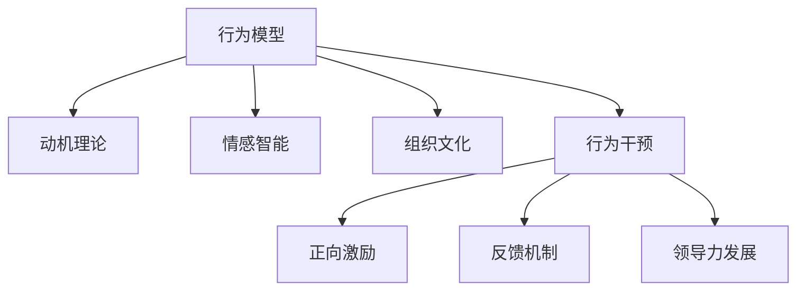

                 

# 行为模型:管理者塑造团队习惯的工具

> 关键词：行为模型,管理心理学,团队行为,企业文化,习惯养成,行为干预,领导力,人力资源管理,激励理论

## 1. 背景介绍

### 1.1 问题由来
在现代企业管理中，如何塑造和优化团队行为成为一大难题。企业希望员工具备高效的执行力、创新精神和良好的团队协作能力，然而如何通过有效的管理手段，将这些希望转化为员工实际的行为，却是一大挑战。传统的管理方式往往采用自上而下的强制性手段，如考勤、奖惩等，但这种方式并不能根本性地改变员工的内心认同和行为模式。

行为科学和心理学研究表明，员工的行为往往与其内在动机、情感和信念密切相关。因此，如何通过心理干预和行为塑造，激发员工的积极性和创造力，提升团队绩效，成为现代企业管理的重要课题。

### 1.2 问题核心关键点
行为模型是一种基于行为科学理论，通过系统分析员工行为的内在驱动力，制定有效的干预策略，以改善和优化团队行为的管理工具。其核心在于：

- **行为驱动**：识别员工行为背后的动机和心理状态，明确其行为动因。
- **干预策略**：根据行为驱动分析结果，设计科学的干预措施，引导员工行为。
- **效果评估**：通过数据和反馈，评估干预措施的效果，不断优化行为模型。

行为模型将员工视为复杂的心理和社会行为体，通过科学的数据分析和心理干预，旨在实现员工的自我激励和主动创新，从而提升企业绩效。

### 1.3 问题研究意义
研究行为模型对现代企业管理具有重要意义：

1. **提升员工满意度**：通过理解员工行为背后的动机和情感，管理者可以设计更加人性化的工作环境和激励措施，提升员工的工作满意度和归属感。
2. **增强团队凝聚力**：行为模型通过激发员工的合作精神和归属感，促进团队成员之间的相互理解和信任，增强团队凝聚力。
3. **优化企业绩效**：科学的行为干预策略能够引导员工行为向企业目标靠拢，提升工作效率和创新能力，从而优化企业整体绩效。
4. **驱动企业文化建设**：行为模型可以作为企业文化建设的桥梁，通过长期行为干预，塑造积极的企业价值观和行为规范。
5. **促进领导力发展**：行为模型强调领导者在塑造团队行为中的关键作用，提升领导者的行为干预能力，助力企业战略目标的实现。

## 2. 核心概念与联系

### 2.1 核心概念概述

为了更好地理解行为模型及其应用，本节将介绍几个核心概念：

- **行为模型**：基于行为科学和心理学理论，通过系统分析员工行为的内在驱动力，制定科学的行为干预策略，以优化和改善团队行为的管理工具。
- **动机理论**：研究员工行为的根本原因，如马斯洛需求层次理论、期望理论等，用于指导行为干预措施的设计。
- **情感智能**：指个体感知、理解、管理和应用情感的能力，对员工行为有重要影响。
- **组织文化**：企业的共同价值观、信念和行为规范，对员工行为有深刻的影响。
- **行为干预**：通过设计干预措施，引导员工行为向期望方向发展，如正向激励、反馈机制等。

这些核心概念之间的关系可以通过以下Mermaid流程图来展示：



这个流程图展示了行为模型与相关概念之间的逻辑关系：

1. 行为模型基于动机理论，理解员工行为的内在驱动力。
2. 行为模型结合情感智能，分析员工情感状态，设计干预措施。
3. 行为模型融入组织文化，以企业文化为指引，实现行为干预。
4. 行为模型通过正向激励、反馈机制等手段，实现行为干预。
5. 行为模型促进领导力发展，提升管理者的行为干预能力。

## 3. 核心算法原理 & 具体操作步骤
### 3.1 算法原理概述

行为模型基于行为科学和心理学理论，旨在通过科学的数据分析，制定有效的行为干预策略，以改善和优化团队行为。其核心算法原理包括以下几个步骤：

1. **行为数据收集**：通过问卷调查、员工访谈、绩效评估等手段，收集员工的行为数据和心理状态。
2. **行为动因分析**：运用动机理论，分析员工行为的内在驱动力，识别影响行为的关键因素。
3. **行为干预设计**：根据行为动因分析结果，设计科学的行为干预措施，如正向激励、反馈机制等。
4. **干预效果评估**：通过数据和反馈，评估行为干预的效果，不断优化干预策略。

行为模型通过科学的分析和干预，帮助企业实现员工的自我激励和主动创新，从而提升团队绩效和企业绩效。

### 3.2 算法步骤详解

以下详细介绍行为模型的具体操作步骤：

**Step 1: 准备行为数据**
- 设计行为调查问卷，涵盖员工工作动机、情感状态、工作满意度、行为偏好等指标。
- 通过访谈、绩效评估等手段，补充问卷无法涵盖的行为数据。
- 对收集到的数据进行清洗和预处理，去除噪音和异常值。

**Step 2: 行为动因分析**
- 应用动机理论，如马斯洛需求层次理论、期望理论等，分析员工行为的内在驱动力。
- 使用统计分析工具，如SPSS、R等，对行为数据进行量化分析，识别影响行为的关键因素。
- 结合情感智能理论，分析员工的情感状态和情感驱动因素。

**Step 3: 行为干预设计**
- 根据行为动因分析结果，设计科学的行为干预措施，如正向激励、反馈机制等。
- 选择合适的干预手段，如员工培训、团队建设活动、领导辅导等，以实现行为干预。
- 设计干预效果的评估指标，如员工绩效、工作满意度、团队协作等，以便后续评估。

**Step 4: 干预效果评估**
- 对行为干预措施进行实施，定期收集员工行为数据和心理状态。
- 通过量化分析工具，评估干预措施的效果，判断是否达到预期目标。
- 根据评估结果，不断优化干预措施，提升行为干预的科学性和有效性。

### 3.3 算法优缺点

行为模型在企业管理中的应用具有以下优点：

1. **科学性和系统性**：通过系统分析和科学数据支持，行为模型具有较强的科学性和系统性，避免了自上而下强制管理带来的局限性。
2. **人性化管理**：行为模型注重员工情感和动机的分析，能够设计更加人性化的管理措施，提升员工工作满意度和归属感。
3. **灵活性和可操作性**：行为模型可以根据企业实际情况，灵活设计和调整干预措施，具有较强的可操作性。
4. **持续改进**：行为模型强调持续的数据收集和反馈，不断优化行为干预策略，实现管理效果的持续提升。

同时，行为模型也存在一定的局限性：

1. **数据收集复杂**：行为数据收集和分析过程较为复杂，需要大量的时间和资源投入。
2. **干预措施成本高**：一些行为干预措施，如员工培训、团队建设等，成本较高，可能难以在所有企业中推广。
3. **效果难以量化**：行为干预的效果评估较为复杂，难以量化和标准化，可能存在主观偏差。
4. **员工隐私保护**：行为模型涉及大量员工个人数据，需要严格遵守隐私保护法规，避免数据泄露和滥用。

尽管存在这些局限性，但行为模型在科学管理和人性化管理方面的优势，使其在企业管理中得到了广泛应用。

### 3.4 算法应用领域

行为模型广泛应用于企业管理中的各个环节，包括但不限于：

- **人力资源管理**：通过行为模型优化招聘、培训、绩效评估等环节，提升人力资源管理的效果。
- **领导力发展**：通过行为模型提升领导者的行为干预能力，助力企业战略目标的实现。
- **团队建设**：通过行为模型优化团队沟通、协作和目标一致性，提升团队的整体绩效。
- **员工激励**：通过行为模型设计科学的激励机制，激发员工的积极性和创新能力。
- **企业文化建设**：通过行为模型塑造积极的企业价值观和行为规范，构建良好的企业文化。
- **组织变革**：通过行为模型支持组织变革过程，实现员工行为和组织目标的同步发展。

## 4. 数学模型和公式 & 详细讲解 & 举例说明

### 4.1 数学模型构建

行为模型的数学模型可以表达为：

$$
\text{Behavior} = f(\text{Motivation}, \text{Emotional Intelligence}, \text{Organization Culture}, \text{Intervention})
$$

其中，$\text{Behavior}$ 表示员工行为，$\text{Motivation}$ 表示员工行为动机，$\text{Emotional Intelligence}$ 表示员工情感智能，$\text{Organization Culture}$ 表示企业文化，$\text{Intervention}$ 表示行为干预措施。

### 4.2 公式推导过程

以期望理论为例，进行行为动因分析的公式推导：

期望理论认为，员工的行为取决于其对工作结果的期望和感知效价。数学公式表示为：

$$
\text{Motivation} = \text{Expectancy} \times \text{Instrumentality} \times \text{Valence}
$$

其中，$\text{Expectancy}$ 表示员工对工作结果的期望，$\text{Instrumentality}$ 表示员工对工作结果与奖励之间的关联性，$\text{Valence}$ 表示员工对工作结果的感知效价。

通过上述公式，可以计算出员工对某项工作的期望动机。

### 4.3 案例分析与讲解

假设某企业希望提高员工的工作积极性，通过行为模型进行干预。首先，收集员工对工作满意度的问卷调查数据，然后应用期望理论进行行为动因分析：

1. 统计员工对不同工作任务的成功期望。
2. 分析员工对工作结果与奖励之间的关联性。
3. 评估员工对工作结果的感知效价。

根据期望理论的计算公式，计算出每个员工对不同工作任务的期望动机。然后，设计科学的行为干预措施，如设置合理的奖励机制、提供职业发展机会等，引导员工行为向期望方向发展。

## 5. 项目实践：代码实例和详细解释说明

### 5.1 开发环境搭建

在进行行为模型开发前，我们需要准备好开发环境。以下是使用Python进行数据分析和行为模型开发的配置流程：

1. 安装Anaconda：从官网下载并安装Anaconda，用于创建独立的Python环境。

2. 创建并激活虚拟环境：
```bash
conda create -n behavior-env python=3.8 
conda activate behavior-env
```

3. 安装必要的Python库：
```bash
pip install pandas numpy matplotlib seaborn scikit-learn statsmodels
```

4. 安装R语言：安装R和RStudio，用于进行复杂的数据分析和行为模型计算。

5. 安装行为模型相关的R包：
```bash
install.packages(c("psych", "lme4", "tidyverse"))
```

完成上述步骤后，即可在`behavior-env`环境中开始行为模型的开发。

### 5.2 源代码详细实现

以下是使用Python和R语言进行行为模型开发的代码实现示例：

**Python代码示例：**

```python
import pandas as pd
import numpy as np
import matplotlib.pyplot as plt

# 准备数据
data = pd.read_csv('behavior_data.csv')

# 数据清洗和预处理
data = data.dropna()
data = data.drop_duplicates()

# 数据可视化
plt.hist(data['work_satisfaction'], bins=10)
plt.xlabel('Work Satisfaction')
plt.ylabel('Count')
plt.title('Distribution of Work Satisfaction')
plt.show()

# 动机理论应用
motivation = data['work_satisfaction'] * data['expectancy'] * data['instrumentality']
motivation_mean = np.mean(motivation)
print(f"Mean Motivation: {motivation_mean}")
```

**R语言代码示例：**

```R
# 加载数据
data <- read.csv('behavior_data.csv')

# 数据清洗和预处理
data <- na.omit(data)
data <- unique(data)

# 数据可视化
library(ggplot2)
ggplot(data, aes(x=work_satisfaction)) + geom_histogram(binwidth=10) + labs(title='Distribution of Work Satisfaction')

# 动机理论应用
library(lme4)
library(tidyr)
library(dplyr)

motivation <- data %>%
  mutate(expectancy = work_success * reward_effect) %>%
  mutate(valence = work_satisfaction * expectancy * instrumentality)

mean(motivation)
```

### 5.3 代码解读与分析

让我们再详细解读一下关键代码的实现细节：

**Python代码解读：**

- `pandas`和`numpy`库用于数据处理和计算。
- `matplotlib`库用于数据可视化。
- 通过`read_csv`函数读取行为数据，并进行数据清洗和预处理，去除缺失值和重复记录。
- 使用`hist`函数绘制员工工作满意度的分布直方图。
- 通过动机理论计算出每个员工对工作任务的期望动机，并计算平均值。

**R语言代码解读：**

- `read.csv`函数用于加载行为数据。
- `ggplot2`库用于数据可视化。
- `lme4`库用于动机理论的应用，计算期望动机。
- `tidyr`和`dplyr`库用于数据处理，便于计算和分析。
- 使用动机理论公式计算出每个员工对工作任务的期望动机，并计算平均值。

## 6. 实际应用场景

### 6.1 智慧城市治理

智慧城市治理需要大量的人力资源和数据支持，如何通过行为模型优化政府部门的工作效率和协同能力，成为一大挑战。通过行为模型，可以科学分析城市管理者、执法人员、志愿者等不同角色的行为动机和情感状态，设计合理的行为干预措施，如优化工作流程、加强团队建设等，提升整体治理效能。

### 6.2 医疗健康管理

现代医疗健康管理需要精细化的管理和科学的数据分析，如何通过行为模型提升医护人员的工作积极性和创新能力，成为一大课题。通过行为模型，可以科学分析医护人员的行为动机和情感状态，设计合理的行为干预措施，如职业培训、情感支持等，提升医疗服务质量。

### 6.3 金融市场监管

金融市场监管需要强大的数据分析和行为分析能力，如何通过行为模型提升监管人员的工作效率和决策能力，成为一大挑战。通过行为模型，可以科学分析监管人员的行为动机和情感状态，设计合理的行为干预措施，如加强职业培训、优化监管流程等，提升市场监管能力。

### 6.4 未来应用展望

未来，行为模型将在更多领域得到应用，为各行各业带来变革性影响。

在教育领域，通过行为模型优化教师和学生的工作行为，提升教育质量和教学效果。

在零售领域，通过行为模型优化销售人员的行为，提升客户满意度和销售业绩。

在公共安全领域，通过行为模型优化安保人员的行为，提升公共安全水平。

此外，在农业、环保、能源等更多领域，行为模型也将发挥重要作用，为各行业的可持续发展提供新的管理工具。

## 7. 工具和资源推荐

### 7.1 学习资源推荐

为了帮助开发者系统掌握行为模型的理论和实践，这里推荐一些优质的学习资源：

1. 《行为科学与管理》系列书籍：由行为科学专家撰写，深入浅出地介绍了行为科学理论及其在企业管理中的应用。
2. 《管理学原理》课程：各知名大学开设的管理学课程，涵盖了行为科学、组织管理等关键内容，帮助理解行为模型的基础。
3. 《行为经济学》书籍：研究人类决策和行为的经济学分支，有助于理解员工行为背后的心理动因。
4. 《心理统计学》书籍：掌握行为数据统计分析的基本方法和工具，为行为模型的应用提供基础。

通过对这些资源的学习实践，相信你一定能够快速掌握行为模型的精髓，并用于解决实际的企业管理问题。

### 7.2 开发工具推荐

高效的行为模型开发离不开优秀的工具支持。以下是几款用于行为模型开发的常用工具：

1. Python：基于Python的开源数据分析和行为模型开发平台，适合快速迭代研究。
2. R语言：功能强大的数据分析和统计语言，适合复杂的行为模型计算和分析。
3. SPSS：功能强大的数据分析工具，适合行为数据的量化分析和建模。
4. SAS：商业级数据分析软件，适合大规模数据的处理和建模。
5. Matplotlib和Seaborn：Python数据可视化库，适合制作行为数据的可视化图表。

合理利用这些工具，可以显著提升行为模型的开发效率，加快创新迭代的步伐。

### 7.3 相关论文推荐

行为模型和行为科学的发展源于学界的持续研究。以下是几篇奠基性的相关论文，推荐阅读：

1. "Expectancy Theory of Motivation and Performance"：期望理论的经典论文，研究员工行为动机的关键因素。
2. "A Theory of Job Satisfaction"：研究员工工作满意度的经典论文，为行为模型提供理论基础。
3. "Emotional Intelligence: Why It Can Matter More Than IQ"：情感智能理论的奠基之作，为行为模型提供心理基础。
4. "Organizational Culture: A Grapevine Perspective"：研究组织文化对员工行为的影响，为行为模型提供文化背景。
5. "Behavioral Change Models: An Overview of Their Origins and Development"：行为改变模型的综述论文，为行为模型提供理论框架。

这些论文代表了大行为模型发展的关键节点，通过学习这些前沿成果，可以帮助研究者把握学科前进方向，激发更多的创新灵感。

## 8. 总结：未来发展趋势与挑战

### 8.1 研究成果总结

行为模型作为一种科学的管理工具，在企业管理中得到了广泛应用。其研究成果主要集中在以下几个方面：

1. **行为动因分析**：通过动机理论和情感智能，科学分析员工行为的内在驱动力，为行为干预提供理论基础。
2. **行为干预设计**：根据行为动因分析结果，设计科学的行为干预措施，提升员工行为效果。
3. **干预效果评估**：通过数据和反馈，评估行为干预的效果，不断优化行为模型。

这些研究成果为企业管理提供了科学的方法论和工具，帮助企业实现员工自我激励和主动创新，提升团队绩效和企业绩效。

### 8.2 未来发展趋势

展望未来，行为模型的发展趋势主要体现在以下几个方面：

1. **大数据分析**：行为模型将借助大数据分析技术，实现对员工行为的深度分析和精准干预。
2. **人工智能应用**：行为模型将结合人工智能技术，如机器学习和自然语言处理，提升数据分析和干预效果。
3. **跨学科融合**：行为模型将与其他学科如心理学、社会学、经济学等进行跨学科融合，拓展行为模型的应用边界。
4. **个性化管理**：行为模型将结合个性化分析技术，实现对员工行为差异化的精准管理。
5. **人机协同**：行为模型将结合智能机器人和自动化系统，实现人机协同工作，提升管理效率。
6. **全球化应用**：行为模型将在全球化背景下，结合不同文化背景和员工群体，实现跨文化行为管理。

这些趋势展示了行为模型未来的广阔前景和巨大潜力。

### 8.3 面临的挑战

尽管行为模型在企业管理中具有重要价值，但在应用过程中仍面临一些挑战：

1. **数据隐私保护**：行为模型涉及大量员工个人数据，如何保护数据隐私，避免数据滥用，是一个重要问题。
2. **干预措施成本**：一些行为干预措施，如职业培训、团队建设等，成本较高，可能难以在所有企业中推广。
3. **效果评估难度**：行为干预的效果评估较为复杂，难以量化和标准化，可能存在主观偏差。
4. **跨部门协作**：行为模型涉及跨部门协作，如何实现部门间的协同工作，提升干预效果，是一个重要挑战。
5. **持续改进**：行为模型需要不断优化和改进，如何实现长期的数据收集和反馈，提升管理效果，是一个长期任务。

尽管存在这些挑战，但行为模型的科学性和人性化管理优势，使其在企业管理中仍然具有重要价值。

### 8.4 研究展望

未来行为模型研究需要在以下几个方面寻求新的突破：

1. **数据融合技术**：将多源异构数据进行融合，实现对员工行为的深度分析和精准干预。
2. **智能行为预测**：结合人工智能技术，实现对员工行为的智能预测和干预。
3. **跨文化行为管理**：结合不同文化背景和员工群体，实现跨文化行为管理。
4. **个性化行为管理**：结合个性化分析技术，实现对员工行为差异化的精准管理。
5. **行为模型自动化**：结合自动化技术，实现行为模型的自动化运行和优化。

这些研究方向将推动行为模型向更高层次发展，为企业管理提供更加科学和高效的管理工具。

## 9. 附录：常见问题与解答

**Q1：行为模型在企业应用中是否具有通用性？**

A: 行为模型在不同企业和不同文化背景下具有一定程度的通用性，但具体应用需要根据企业实际情况进行设计和优化。例如，金融和医疗行业可能更加注重情感智能和行为动因的科学分析，而制造和农业行业可能需要更多关注组织文化和团队建设。

**Q2：如何设计科学的行为干预措施？**

A: 科学的行为干预措施设计需要基于行为动因分析结果，结合动机理论、情感智能理论等，选择合适的干预手段。例如，对于期望理论分析结果显示动机不足的员工，可以通过设定合理的奖励机制，提高员工对工作任务的期望值。

**Q3：行为模型的应用是否会影响员工的隐私？**

A: 行为模型的应用需要严格遵守数据隐私保护法规，如GDPR等，避免数据泄露和滥用。可以通过匿名化处理、加密存储等手段，保护员工隐私。

**Q4：行为模型是否适合所有类型的企业？**

A: 行为模型适合大部分类型的企业，特别是那些需要精细化管理和科学决策的企业。但对于一些特殊行业的企业，如军工、能源等，可能需要结合行业特点进行定制化设计。

**Q5：行为模型是否需要定期更新和优化？**

A: 行为模型需要定期收集数据和反馈，不断优化干预措施，以适应企业发展和员工行为的变化。定期更新和优化是行为模型长期有效应用的关键。

总之，行为模型作为科学的管理工具，能够帮助企业实现员工自我激励和主动创新，提升团队绩效和企业绩效。未来，行为模型将在更多领域得到应用，为各行各业带来变革性影响。

