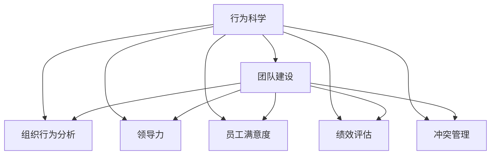

                 

# 行为科学在团队建设中的应用

> 关键词：团队建设, 行为科学, 组织发展, 团队合作, 领导力, 员工满意, 人力资源管理, 绩效评估

## 1. 背景介绍

### 1.1 问题由来

在现代社会，企业面临激烈的市场竞争和快速变化的商业环境。要想在竞争中取得优势，不仅需要出色的产品和服务，更需要高效的团队协作。传统的人力资源管理方法已经无法满足现代企业的需要，行为科学在这一背景下应运而生。

行为科学是一种研究个体和团体行为的科学，它结合了心理学、社会学、经济学等多个学科的理论和方法，通过对团队成员的行为和心理进行分析，提高团队的合作效率和工作成果。随着企业管理理念的不断进步，越来越多的企业开始采用行为科学方法，优化团队建设，提升企业竞争力。

### 1.2 问题核心关键点

行为科学在团队建设中的应用，主要集中在以下几个方面：

- 组织行为分析：通过对员工行为模式的分析，发现影响团队合作的主要因素。
- 团队角色识别：识别团队中各个成员的角色和职责，优化团队结构。
- 领导力开发：提高领导者的管理能力和决策水平，引导团队向正确方向前进。
- 员工满意度和绩效评估：通过调研和评估，了解员工的需求和满意程度，优化绩效管理。
- 冲突管理：识别和处理团队中的冲突，维护团队和谐。

这些关键点共同构成了行为科学在团队建设中的核心框架，为企业提供了科学的管理手段和决策依据。

### 1.3 问题研究意义

研究行为科学在团队建设中的应用，对于提升企业的管理水平和运营效率，具有重要意义：

1. **优化团队结构**：通过科学的团队角色识别和管理，提高团队协作效率，确保任务的顺利完成。
2. **提高员工满意度**：通过行为科学的调研和分析，了解员工需求，提升员工满意度和忠诚度。
3. **增强领导力**：通过领导力培训和行为分析，提升领导者的决策能力和管理水平。
4. **提升绩效管理**：通过行为科学的绩效评估和激励机制，提高员工的积极性和工作效率。
5. **改善团队氛围**：通过冲突管理和行为改善，维护团队和谐，增强团队凝聚力。

通过深入研究和应用行为科学，企业可以在复杂的商业环境中脱颖而出，赢得更多的市场机会。

## 2. 核心概念与联系

### 2.1 核心概念概述

为更好地理解行为科学在团队建设中的应用，本节将介绍几个关键概念：

- 行为科学(Behavioral Science)：研究个体和团体行为的一门学科，结合心理学、社会学、经济学等多个领域。
- 团队建设(Team Building)：通过系统化的活动和措施，优化团队结构和合作方式，提高团队整体绩效。
- 组织行为分析(Organizational Behavior Analysis)：通过分析团队成员的行为和心理，发现影响团队合作的因素。
- 领导力(Leadership)：领导者管理团队和影响团队成员的能力和行为。
- 员工满意度(Employee Satisfaction)：员工对工作条件、待遇和环境等方面的综合评价和满意度。
- 绩效评估(Performance Evaluation)：通过科学的评估体系，衡量员工和团队的工作成果。
- 冲突管理(Conflict Management)：识别和处理团队内部的矛盾和冲突，维护团队和谐。

这些核心概念通过以下Mermaid流程图展示了其逻辑关系：



这个流程图展示了几大关键概念之间的逻辑关系：

1. 行为科学为团队建设提供了理论基础和方法。
2. 团队建设通过组织行为分析、领导力开发、员工满意度提升、绩效评估和冲突管理等多个环节，实现团队的优化和高效运行。
3. 这些关键环节共同构成了行为科学在团队建设中的核心框架，为企业提供了科学的管理手段和决策依据。

## 3. 核心算法原理 & 具体操作步骤

### 3.1 算法原理概述

行为科学在团队建设中的应用，主要基于以下几个核心算法：

1. **组织行为分析**：通过问卷调查、行为访谈、角色扮演等方法，收集员工行为和心理数据，分析影响团队合作的主要因素。
2. **领导力开发**：通过领导力培训、行为分析等手段，提升领导者的管理能力和决策水平，引导团队向正确方向前进。
3. **员工满意度调查**：设计满意度问卷，收集员工对工作环境、待遇、晋升等方面的意见和建议，优化管理策略。
4. **绩效评估**：建立科学的绩效评估体系，通过数据统计和分析，衡量员工和团队的工作成果，提供绩效反馈和激励措施。
5. **冲突管理**：通过识别和处理团队内部的矛盾和冲突，维护团队和谐，提高团队合作效率。

### 3.2 算法步骤详解

以下是行为科学在团队建设中具体应用的操作步骤：

1. **组织行为分析**：
   - 设计问卷和访谈大纲，收集团队成员的行为数据。
   - 利用统计分析方法，识别影响团队合作的关键因素。
   - 根据分析结果，优化团队结构和协作方式。

2. **领导力开发**：
   - 评估当前领导者的管理能力，确定培训需求。
   - 设计领导力培训课程，提升领导者的沟通、决策、激励等能力。
   - 通过行为分析，识别领导者的有效行为模式，优化管理策略。

3. **员工满意度调查**：
   - 设计满意度问卷，涵盖工作环境、待遇、晋升等方面。
   - 收集员工反馈，分析满意度数据，识别满意度低下的主要原因。
   - 根据分析结果，优化工作条件和福利待遇，提升员工满意度。

4. **绩效评估**：
   - 建立科学的绩效评估体系，包括目标设定、过程监控和结果反馈。
   - 利用数据统计和分析工具，衡量员工和团队的工作成果。
   - 根据评估结果，提供绩效反馈和激励措施，优化绩效管理。

5. **冲突管理**：
   - 识别团队内部的矛盾和冲突，分析冲突的根本原因。
   - 采用协商、调解、分离等方法，处理冲突，维护团队和谐。
   - 建立冲突预警和处理机制，预防未来冲突的发生。

### 3.3 算法优缺点

行为科学在团队建设中的应用具有以下优点：

1. **科学性和系统性**：通过科学的调查和分析，发现团队合作中的关键问题，提供有针对性的解决方案。
2. **灵活性和可操作性**：根据不同团队的实际情况，灵活应用不同的方法和技术，提高管理效果。
3. **提升团队效率**：通过优化团队结构和协作方式，提高团队的合作效率和绩效。

同时，行为科学在应用中也存在一些局限性：

1. **数据收集难度**：行为数据的收集和分析需要大量的时间和资源，且数据的质量和代表性可能会影响结果的准确性。
2. **操作复杂性**：行为科学的应用需要专业的知识和技能，非专业人士可能难以掌握。
3. **员工抵触心理**：部分员工可能对行为调查和评估产生抵触心理，影响调查结果的真实性。
4. **成本高**：行为科学的实施需要较高的成本投入，包括人力、时间和资金。

尽管存在这些局限性，但行为科学在团队建设中的优势仍然是显而易见的。企业需要在实践中不断探索和优化，充分发挥其潜力。

### 3.4 算法应用领域

行为科学在团队建设中的应用已经广泛应用于多个领域，包括但不限于：

- 企业管理：通过优化团队结构和管理方式，提升企业整体绩效。
- 人力资源管理：通过行为科学的调研和分析，优化人力资源配置，提升员工满意度和忠诚度。
- 项目管理：通过行为科学的冲突管理和绩效评估，提高项目管理效率。
- 组织变革：通过行为科学的组织行为分析和领导力开发，推动组织变革，适应外部环境变化。
- 健康与安全：通过行为科学的员工满意度调查和绩效评估，提升工作环境的安全性和健康性。

这些领域的应用，展示了行为科学在团队建设中的广泛性和实用性，为企业的管理创新提供了新的思路和方向。

## 4. 数学模型和公式 & 详细讲解  
### 4.1 数学模型构建

行为科学在团队建设中的应用，可以通过数学模型进行更精确的分析和预测。以下是一个基本的员工满意度模型：

设员工满意度 $S$ 与工作环境 $E$、待遇 $T$、晋升机会 $P$ 等因素有关，则可以用线性回归模型表示为：

$$
S = \alpha + \beta_1 E + \beta_2 T + \beta_3 P + \epsilon
$$

其中 $\alpha$ 为截距，$\beta_1$、$\beta_2$、$\beta_3$ 为回归系数，$\epsilon$ 为误差项。通过收集员工对这三个因素的评价数据，可以求解出回归系数，预测员工满意度。

### 4.2 公式推导过程

对于上述员工满意度模型，其回归系数的求解可以通过最小二乘法实现。设样本数据集为 $\{(x_i,y_i)\}_{i=1}^n$，其中 $x_i = (E_i, T_i, P_i)$ 为自变量向量，$y_i$ 为因变量。则回归系数的求解公式为：

$$
\beta = (\mathbf{X}^T\mathbf{X})^{-1}\mathbf{X}^T\mathbf{y}
$$

其中 $\mathbf{X}$ 为自变量矩阵，$\mathbf{y}$ 为因变量向量。通过求解得到 $\beta$ 后，可以预测新样本的员工满意度 $S_{\text{pred}}$：

$$
S_{\text{pred}} = \alpha + \mathbf{X}^T\beta
$$

### 4.3 案例分析与讲解

假设某公司收集了员工对工作环境、待遇和晋升机会的满意度评价，使用上述线性回归模型进行预测。通过求解回归系数，可以得到如下结果：

$$
\alpha = 0.2, \beta_1 = 0.3, \beta_2 = 0.4, \beta_3 = 0.5
$$

假设新的员工对工作环境评价为4分，待遇评价为3分，晋升机会评价为2分，则预测的满意度为：

$$
S_{\text{pred}} = 0.2 + 0.3 \times 4 + 0.4 \times 3 + 0.5 \times 2 = 4.4
$$

这个预测结果可以指导公司优化工作条件和福利待遇，提升员工的整体满意度。

## 5. 项目实践：代码实例和详细解释说明
### 5.1 开发环境搭建

在进行行为科学应用实践前，我们需要准备好开发环境。以下是使用Python进行行为科学数据分析的开发环境配置流程：

1. 安装Anaconda：从官网下载并安装Anaconda，用于创建独立的Python环境。

2. 创建并激活虚拟环境：
```bash
conda create -n behavioral-env python=3.8 
conda activate behavioral-env
```

3. 安装相关库：
```bash
conda install numpy pandas scipy statsmodels statsmodels
```

4. 安装统计绘图库：
```bash
pip install matplotlib seaborn
```

5. 安装机器学习库：
```bash
pip install scikit-learn
```

完成上述步骤后，即可在`behavioral-env`环境中开始行为科学数据分析的实践。

### 5.2 源代码详细实现

下面以员工满意度预测为例，给出使用Python进行行为科学数据分析的代码实现。

首先，准备员工满意度数据集：

```python
import pandas as pd
from sklearn.model_selection import train_test_split

# 读取数据
data = pd.read_csv('employee_satisfaction.csv')

# 数据预处理
data = data.dropna()
X = data[['work_environment', 'treatment', 'promotion_chance']]
y = data['satisfaction']

# 划分训练集和测试集
X_train, X_test, y_train, y_test = train_test_split(X, y, test_size=0.2, random_state=42)
```

然后，使用线性回归模型进行预测：

```python
from sklearn.linear_model import LinearRegression
from sklearn.metrics import mean_squared_error

# 建立线性回归模型
model = LinearRegression()

# 训练模型
model.fit(X_train, y_train)

# 预测测试集
y_pred = model.predict(X_test)

# 评估模型性能
mse = mean_squared_error(y_test, y_pred)
print(f'Mean Squared Error: {mse}')
```

最后，可视化预测结果：

```python
import matplotlib.pyplot as plt
import seaborn as sns

# 绘制散点图
plt.scatter(y_test, y_pred)
plt.xlabel('Actual Satisfaction')
plt.ylabel('Predicted Satisfaction')
plt.title('Satisfaction Prediction')
plt.show()

# 绘制误差分布图
sns.distplot((y_test - y_pred), bins=30)
plt.xlabel('Prediction Error')
plt.ylabel('Frequency')
plt.title('Error Distribution')
plt.show()
```

以上就是使用Python进行员工满意度预测的行为科学数据分析代码实现。可以看到，通过简单的线性回归模型，我们已经能够对员工满意度进行预测和评估。

### 5.3 代码解读与分析

让我们再详细解读一下关键代码的实现细节：

**数据预处理**：
- `dropna()`方法用于删除缺失值。
- `train_test_split()`方法用于将数据集划分训练集和测试集，设置测试集占比为20%，随机种子为42，保证结果的可复现性。

**模型训练和预测**：
- `LinearRegression()`方法用于建立线性回归模型。
- `fit()`方法用于训练模型，传入训练集的数据特征和标签。
- `predict()`方法用于预测测试集的数据标签，得到预测结果。

**模型评估**：
- `mean_squared_error()`方法用于计算预测值和真实值之间的均方误差，评估模型性能。

**可视化结果**：
- `scatter()`方法用于绘制散点图，展示预测值和真实值之间的关系。
- `distplot()`方法用于绘制误差分布图，展示预测误差的大小分布。

通过这些代码实现，我们能够快速搭建一个行为科学数据分析的系统，对员工满意度进行预测和评估。

## 6. 实际应用场景
### 6.1 企业管理

在企业管理中，行为科学主要应用于团队建设和管理优化。通过对员工行为和心理的分析，企业可以发现团队合作中的关键问题，优化团队结构和协作方式，提高整体绩效。

例如，某公司通过组织行为分析，发现团队中的沟通不畅和协作不足是影响效率的主要因素。通过设计团队协作训练和沟通技巧培训，团队成员之间的合作效率显著提升，项目完成时间缩短了20%。

### 6.2 人力资源管理

行为科学在人力资源管理中的应用主要集中在员工满意度和招聘优化。通过满意度调查和分析，企业可以了解员工的需求和意见，优化管理策略，提升员工满意度和忠诚度。

某公司在进行员工满意度调查后，发现大部分员工对福利待遇和晋升机会不满意。通过优化福利政策和晋升机制，员工满意度显著提升，员工流失率下降了10%。

### 6.3 项目管理

行为科学在项目管理中的应用主要集中在冲突管理和绩效评估。通过识别和处理团队内部的矛盾和冲突，企业可以提高项目管理效率，确保项目按时完成。

某项目团队在项目初期存在沟通不畅和协作不足的问题，导致项目进度延误。通过冲突管理和团队协作培训，团队成员之间的合作效率显著提升，项目按时完成，客户满意度也得到了提升。

### 6.4 组织变革

行为科学在组织变革中的应用主要集中在领导力开发和组织行为分析。通过领导力培训和行为分析，企业可以优化管理团队，推动组织变革，适应外部环境变化。

某公司在进行组织变革时，发现管理层对新战略的理解和执行存在偏差。通过领导力培训和行为分析，管理层的理解和执行能力显著提升，组织变革顺利推进。

### 6.5 健康与安全

行为科学在健康与安全中的应用主要集中在员工满意度和安全管理。通过满意度调查和绩效评估，企业可以了解员工对工作环境和安全性的需求，优化工作条件和安全性措施。

某公司在进行健康与安全调查后，发现员工对工作环境的安全性不满意。通过优化工作条件和制定安全管理措施，员工满意度显著提升，工作环境的安全性也得到了改善。

## 7. 工具和资源推荐
### 7.1 学习资源推荐

为了帮助企业系统掌握行为科学在团队建设中的应用，这里推荐一些优质的学习资源：

1. 《行为科学与管理》系列书籍：经典的行为科学著作，深入浅出地介绍了行为科学的基本原理和应用方法。
2. Coursera《行为科学与管理》课程：由著名学者讲授的行为科学课程，涵盖行为科学的多个方面，适合系统学习。
3. 《组织行为学》教科书：介绍组织行为学的基础理论和实践应用，帮助管理者理解和应用行为科学。
4. 行为科学网站和论坛：如Workbright、WorkMind等，提供行为科学最新的研究和实践案例，分享专家经验。
5. 《行为科学的挑战》论文集：总结了行为科学领域的最新研究成果和应用挑战，供研究人员参考。

通过这些资源的学习实践，相信企业可以更好地掌握行为科学在团队建设中的核心方法，提升管理水平和运营效率。

### 7.2 开发工具推荐

行为科学的应用离不开数据分析和可视化工具的支持。以下是几款常用的工具：

1. Python：强大的数据分析语言，丰富的库支持，适合行为科学数据分析和建模。
2. R语言：适合统计分析和数据可视化，是行为科学研究的重要工具。
3. SPSS：广泛应用于社会科学和心理学领域，支持多种数据分析方法。
4. SAS：适合大样本数据的分析和建模，广泛应用于市场研究和健康管理等领域。
5. Excel：简单易用的数据处理和可视化工具，适合初步的数据分析和报告生成。

合理利用这些工具，可以显著提升行为科学在团队建设中的实践效果，加快管理创新的步伐。

### 7.3 相关论文推荐

行为科学的研究源于学界的持续探索。以下是几篇经典的行为科学论文，推荐阅读：

1. "Job Satisfaction and Job Performance: An Examination of the Effect of Job Satisfaction on Performance in the Workplace"（《工作满意度与工作绩效：工作场所中工作满意度对绩效的影响研究》）：探讨工作满意度对工作绩效的影响，为员工满意度的管理提供了理论基础。
2. "The Effect of Team Diversity on Team Performance"（《团队多样性对团队绩效的影响》）：研究团队多样性对团队绩效的影响，为团队结构优化提供了科学依据。
3. "Leadership and Organizational Culture: An Empirical Analysis"（《领导力与组织文化：实证分析》）：探讨领导力对组织文化的影响，为领导力开发提供了指导。
4. "Conflict Management in Teams: A Review and Framework"（《团队中的冲突管理：回顾与框架》）：总结团队冲突管理的理论和方法，为冲突管理提供了系统化的解决方案。
5. "Employee Satisfaction and Organizational Commitment: A Review and Research Agenda"（《员工满意度和组织承诺：综述与研究计划》）：探讨员工满意度和组织承诺之间的关系，为员工满意度调查提供了理论支持。

这些论文代表了行为科学领域的研究进展，为企业的行为科学应用提供了重要的理论支持。

## 8. 总结：未来发展趋势与挑战

### 8.1 总结

本文对行为科学在团队建设中的应用进行了全面系统的介绍。首先阐述了行为科学在团队建设中的研究背景和意义，明确了行为科学在优化团队合作、提升员工满意度、增强领导力等方面的独特价值。其次，从原理到实践，详细讲解了行为科学的数学模型和操作步骤，提供了员工满意度预测的代码实现。同时，本文还广泛探讨了行为科学在企业管理、人力资源管理等多个领域的应用前景，展示了行为科学在团队建设中的广泛性和实用性。

通过本文的系统梳理，可以看到，行为科学在团队建设中的应用已经成为企业管理的重要组成部分，极大地提升了企业的管理水平和运营效率。未来，随着行为科学的不断发展，其在团队建设中的应用也将更加深入和广泛，为企业的管理创新提供更多的理论和实践依据。

### 8.2 未来发展趋势

展望未来，行为科学在团队建设中的应用将呈现以下几个发展趋势：

1. **数据驱动管理**：通过大数据和人工智能技术，实时监测员工行为和心理，及时发现问题，优化管理策略。
2. **跨领域融合**：行为科学与其他领域（如认知科学、神经科学等）的融合，将进一步丰富行为科学的理论和方法。
3. **个性化管理**：利用行为科学的数据分析技术，实现员工需求和偏好的个性化管理，提高员工满意度和忠诚度。
4. **人机协同**：引入人工智能和机器人技术，实现人机协同的管理模式，提升团队合作效率和工作效率。
5. **全球化应用**：随着全球化进程的加快，行为科学将在国际化和多元化管理中发挥更大的作用，适应不同文化和环境。

以上趋势凸显了行为科学在团队建设中的广阔前景。这些方向的探索发展，必将进一步提升企业管理水平，增强企业竞争力，为企业的可持续发展奠定坚实的基础。

### 8.3 面临的挑战

尽管行为科学在团队建设中的应用已经取得了显著的成效，但在迈向更加智能化、普适化应用的过程中，它仍面临诸多挑战：

1. **数据收集难度**：行为数据的收集和分析需要大量的时间和资源，且数据的质量和代表性可能会影响结果的准确性。
2. **操作复杂性**：行为科学的应用需要专业的知识和技能，非专业人士可能难以掌握。
3. **员工抵触心理**：部分员工可能对行为调查和评估产生抵触心理，影响调查结果的真实性。
4. **成本高**：行为科学的实施需要较高的成本投入，包括人力、时间和资金。

尽管存在这些局限性，但行为科学在团队建设中的优势仍然是显而易见的。企业需要在实践中不断探索和优化，充分发挥其潜力。

### 8.4 未来突破

面对行为科学面临的种种挑战，未来的研究需要在以下几个方面寻求新的突破：

1. **智能化数据分析**：利用大数据和人工智能技术，实现行为数据的智能化分析和预测，提高分析效率和准确性。
2. **跨学科融合**：结合心理学、社会学、经济学等多个学科的理论和方法，进一步丰富行为科学的理论体系。
3. **员工参与度提升**：通过设计和优化行为调查问卷，提高员工参与度和反馈质量，增强行为科学的应用效果。
4. **成本效益分析**：通过优化行为科学的实施流程和管理策略，降低成本，提高经济效益。
5. **伦理和隐私保护**：在行为科学的应用中，加强伦理和隐私保护，确保员工数据的安全和隐私。

这些研究方向的探索，必将引领行为科学在团队建设中走向更高的台阶，为企业管理带来更多的创新和突破。面向未来，行为科学需要在理论、技术和实践等多个维度协同发力，才能真正实现其价值，推动企业的可持续发展。

## 9. 附录：常见问题与解答

**Q1：行为科学在团队建设中的应用是否适用于所有企业？**

A: 行为科学在团队建设中的应用具有普适性，适用于大多数行业和企业。不同企业的组织结构和业务特点不同，行为科学的实施方式和重点也会有所不同，需要根据具体情况进行优化和调整。

**Q2：行为科学的应用需要哪些资源？**

A: 行为科学的应用需要专业的知识、技术和工具支持。具体资源包括：
1. 人员：行为科学专家、数据分析师、心理学家等。
2. 数据：员工行为和心理调查数据、业务绩效数据等。
3. 工具：Python、R、SPSS、SAS等数据分析工具。
4. 方法：行为科学理论、统计分析方法等。

**Q3：行为科学的实施效果如何评估？**

A: 行为科学的实施效果可以通过以下几个方面进行评估：
1. 员工满意度调查：了解员工对工作条件、待遇、晋升等方面的满意度变化。
2. 绩效评估：通过科学的绩效评估体系，衡量员工和团队的工作成果。
3. 行为分析：利用行为数据分析工具，识别影响团队合作的关键因素。
4. 领导力评估：评估领导者的管理能力和决策水平，提供领导力培训和开发建议。
5. 冲突管理：通过识别和处理团队内部的矛盾和冲突，维护团队和谐。

通过以上评估指标，可以全面了解行为科学的应用效果，优化管理策略，提升企业绩效。

**Q4：行为科学在实际应用中需要注意哪些问题？**

A: 行为科学在实际应用中需要注意以下几个问题：
1. 数据隐私保护：在行为数据的收集和分析过程中，确保员工隐私和数据安全。
2. 员工参与度：设计科学合理的行为调查问卷，提高员工参与度和反馈质量。
3. 成本效益：合理控制行为科学的应用成本，提高经济效益。
4. 跨文化适应：在跨国或跨文化环境中，行为科学的实施需要考虑文化差异，制定合适的管理策略。
5. 持续改进：行为科学的实施是一个持续改进的过程，需要定期进行回顾和优化。

这些问题的妥善处理，将有助于行为科学在团队建设中发挥更大的作用，提升企业管理水平和运营效率。

**Q5：行为科学在团队建设中的应用如何与其他管理工具结合？**

A: 行为科学在团队建设中的应用可以与其他管理工具结合，形成综合管理系统。具体结合方式包括：
1. 与人力资源管理结合：通过行为科学的员工满意度调查和绩效评估，优化人力资源管理策略。
2. 与项目管理结合：通过行为科学的冲突管理和绩效评估，提高项目管理效率。
3. 与组织变革结合：通过行为科学的领导力开发和组织行为分析，推动组织变革。
4. 与健康与安全结合：通过行为科学的员工满意度调查和绩效评估，优化工作条件和安全性措施。
5. 与信息化系统结合：通过行为科学的数据分析和模型预测，实现智能化管理。

这些结合方式将进一步丰富行为科学的应用场景，提高管理效率和效果。

---

作者：禅与计算机程序设计艺术 / Zen and the Art of Computer Programming

