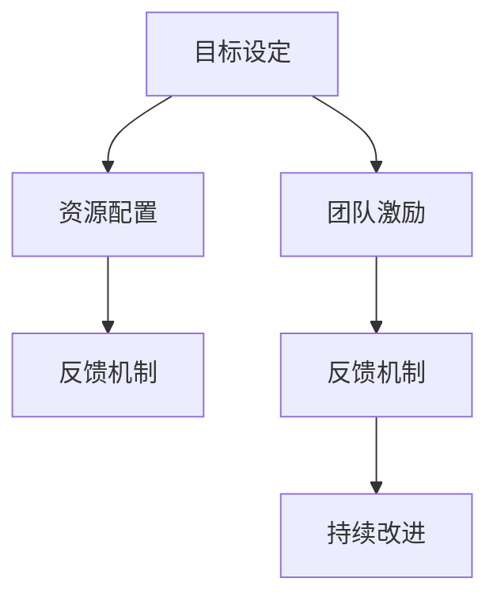

                 

# 行动体系:执行力的保障

在快节奏的数字化时代，执行力成为了企业核心竞争力的关键指标之一。一个高效的行动体系不仅能够确保任务的高效完成，还能提升团队的整体战斗力和创新能力。本文将从执行力保障的多个维度出发，深入剖析行动体系的核心构成和操作机制，为读者提供全面系统的理论支持和实践指导。

## 1. 背景介绍

### 1.1 问题由来
在数字化转型的浪潮下，企业在管理、运营、创新等多个方面面临前所未有的挑战。传统的管理模式无法满足快速变化的业务需求，执行力问题显得尤为突出。如何构建一个能够高效、灵活应对市场变化的行动体系，成为企业领导者亟待解决的重要课题。

### 1.2 问题核心关键点
构建高效的执行力保障体系，需要从目标设定、资源配置、团队激励、反馈机制等多个维度进行全面规划。本文将深入探讨每个维度的关键点，帮助企业构建一个全面的行动体系。

### 1.3 问题研究意义
一个高效的执行力保障体系，不仅能提升企业运营效率，还能增强团队协作力和创新能力，从而实现业务的持续增长。本文旨在为企业的管理者提供实用的工具和方法，帮助他们在数字化转型中构建高效的行动体系，推动企业的持续发展。

## 2. 核心概念与联系

### 2.1 核心概念概述

构建执行力保障体系的核心概念包括以下几个方面：

- **目标设定（Goal Setting）**：明确、具体的目标设定是行动体系的首要环节。
- **资源配置（Resource Allocation）**：合理分配资源，确保任务的高效执行。
- **团队激励（Team Motivation）**：通过有效的激励机制，激发团队成员的积极性和创造力。
- **反馈机制（Feedback Loop）**：建立有效的反馈机制，确保任务执行过程中的问题及时得到解决。
- **持续改进（Continuous Improvement）**：通过持续的改进机制，不断优化行动体系，提升执行力。

### 2.2 核心概念原理和架构的 Mermaid 流程图



这个流程图展示了执行力保障体系的构建过程。目标是体系的起点，资源配置、团队激励和反馈机制是保障体系运转的关键环节，而持续改进则是提升体系效率的不竭动力。

## 3. 核心算法原理 & 具体操作步骤

### 3.1 算法原理概述

构建执行力保障体系的算法原理，主要基于目标管理（Goal Management）、项目管理（Project Management）和团队管理（Team Management）的理论基础。其核心在于：

- **SMART原则**：确保目标的具体性（Specific）、可衡量性（Measurable）、可达成性（Achievable）、相关性（Relevant）和时限性（Time-bound）。
- **资源优化算法**：通过线性规划、混合整数规划等算法，实现资源的最优配置。
- **激励理论**：如期望理论、公平理论、双因素理论等，指导团队激励机制的设计。
- **反馈机制设计**：如PDCA循环（Plan-Do-Check-Act），确保问题能够及时反馈和解决。

### 3.2 算法步骤详解

构建执行力保障体系的具体步骤包括：

1. **目标设定**：采用SMART原则，设定明确、具体的目标，并将其分解为可执行的任务。
2. **资源配置**：通过需求分析和资源优化算法，合理分配各项资源，确保任务高效执行。
3. **团队激励**：根据期望理论、公平理论等理论，设计科学的激励机制，激发团队成员的积极性。
4. **反馈机制建立**：建立PDCA循环等反馈机制，确保问题能够及时反馈和解决。
5. **持续改进**：采用PDCA循环、六西格玛等工具，不断优化行动体系，提升执行力。

### 3.3 算法优缺点

**优点**：

- 通过明确的SMART目标设定，确保任务的高效执行。
- 资源优化算法可以合理分配资源，提高任务执行效率。
- 科学的激励机制能够有效激发团队成员的积极性。
- 反馈机制确保问题及时解决，提升任务执行质量。
- 持续改进机制不断优化行动体系，提升执行力。

**缺点**：

- 目标设定需要高水平的管理能力，对于缺乏经验的管理者可能较为困难。
- 资源优化算法需要较高的数学和计算能力，对于资源有限的企业可能存在难度。
- 激励机制设计需要充分理解团队成员的心理和需求，有一定难度。
- 反馈机制的建立和维护需要持续的努力，可能耗时较长。
- 持续改进需要系统的数据分析和决策支持，对企业资源要求较高。

### 3.4 算法应用领域

执行力保障体系的应用领域广泛，涵盖企业管理的多个方面：

- **项目管理**：通过明确的目标设定、资源优化和持续改进，确保项目的高效完成。
- **团队管理**：通过科学的激励机制和反馈机制，提升团队协作力和执行力。
- **业务流程优化**：通过PDCA循环等方法，不断优化业务流程，提升运营效率。
- **创新管理**：通过持续改进和创新激励，激发团队成员的创新能力，推动业务创新。

## 4. 数学模型和公式 & 详细讲解 & 举例说明

### 4.1 数学模型构建

构建执行力保障体系，可以通过数学模型来量化和优化各环节。以下是一些常见的数学模型：

- **目标设定模型**：SMART目标的设定可以使用线性规划等数学模型进行优化，确保目标的合理性和可达成性。
- **资源优化模型**：资源优化可以通过线性规划、混合整数规划等算法，实现资源的最优配置。
- **激励机制设计模型**：期望理论、公平理论等可以使用数学模型进行量化和优化，确保激励机制的有效性。
- **反馈机制设计模型**：PDCA循环等反馈机制可以使用流程图进行建模，确保问题及时反馈和解决。

### 4.2 公式推导过程

以目标设定模型为例，设目标为 $G$，其分解为 $n$ 个可执行任务 $T=\{T_1, T_2, ..., T_n\}$，每个任务需要资源 $R_i$，资源总预算为 $B$。目标设定的数学模型可以表示为：

$$
\begin{aligned}
\min_{x} & \quad \sum_{i=1}^n x_i R_i \\
\text{s.t.} & \quad \sum_{i=1}^n x_i = 1 \\
& \quad x_i \geq 0 \\
& \quad \sum_{i=1}^n x_i R_i \leq B
\end{aligned}
$$

其中，$x_i$ 为任务 $T_i$ 的权重，表示其在目标中的重要性。模型求解后，可以得到各个任务的权重，进而明确任务的重要性顺序，优化资源配置。

### 4.3 案例分析与讲解

假设一家公司需要开发一款新产品，需要在市场调研、技术开发、生产准备等多个环节进行资源配置。通过目标设定模型，可以明确每个环节的目标和所需资源，优化资源配置，确保新产品开发的高效完成。

## 5. 项目实践：代码实例和详细解释说明

### 5.1 开发环境搭建

为了进行项目实践，需要搭建一个开发环境。以下是Python开发环境的搭建步骤：

1. 安装Anaconda：从官网下载并安装Anaconda，用于创建独立的Python环境。

2. 创建并激活虚拟环境：
```bash
conda create -n py-env python=3.8 
conda activate py-env
```

3. 安装必要的工具包：
```bash
pip install numpy pandas scikit-learn
```

### 5.2 源代码详细实现

以下是Python代码实现目标设定模型的示例：

```python
import numpy as np
from scipy.optimize import linprog

def set_goal(target, resources, budget):
    A = np.eye(len(resources))
    b = np.ones(len(resources))
    c = resources
    result = linprog(c, A_ub=A, b_ub=b, bounds=(0, None), constraints={'type': 'ineq', 'fun': lambda x: budget - np.dot(x, resources)})
    return result.x

# 示例：公司有资源A、B、C，总预算为1000
resources = [100, 200, 300]
budget = 1000
target = 1

# 调用目标设定模型
goal_weights = set_goal(target, resources, budget)
print(goal_weights)
```

### 5.3 代码解读与分析

- `linprog`函数：使用线性规划算法求解目标设定模型。
- `A`：约束矩阵，表示每个任务所需的资源。
- `b`：约束向量，表示资源总预算。
- `c`：目标函数系数，表示每个任务的重要性。
- `bounds`：任务权重上下限。
- 最终求解得到各个任务权重，即目标设定结果。

## 6. 实际应用场景

### 6.1 智能制造

智能制造企业需要高效地管理生产流程，确保任务的高效完成。通过构建执行力保障体系，企业可以明确每个生产环节的目标和所需资源，优化资源配置，提升生产效率。

### 6.2 物流管理

物流企业在面对复杂多变的市场需求时，需要高效地调度资源，确保货物的准时交付。通过执行力保障体系，企业可以明确每个物流环节的目标和所需资源，优化资源配置，提升物流效率。

### 6.3 项目管理

项目管理中，明确的目标设定和资源优化是项目成功的关键。通过构建执行力保障体系，项目经理可以明确项目目标和所需资源，优化资源配置，确保项目的高效完成。

## 7. 工具和资源推荐

### 7.1 学习资源推荐

1. 《项目管理知识体系指南》：PMBOK（Project Management Body of Knowledge）提供了项目管理的全面知识体系，是项目管理实践的重要参考。
2. 《团队激励与组织行为》：哈佛商学院出版的经典著作，介绍了科学的激励机制设计和团队管理技巧。
3. 《反馈机制设计》：介绍了PDCA循环等反馈机制的设计和应用，帮助企业建立有效的反馈体系。
4. 《持续改进与创新管理》：介绍了持续改进和创新管理的工具和方法，帮助企业提升创新能力。

### 7.2 开发工具推荐

1. Python：Python以其简洁易懂的语法和强大的计算能力，成为执行力保障体系开发的首选语言。
2. Jupyter Notebook：提供交互式的编程环境，方便进行模型开发和数据分析。
3. Tableau：数据可视化工具，帮助企业直观理解数据，优化决策。
4. Microsoft Project：项目管理工具，帮助企业进行任务规划和资源配置。

### 7.3 相关论文推荐

1. 《目标设定与管理：SMART原则的应用》：探讨SMART原则在目标设定和管理中的应用。
2. 《资源优化算法在项目管理中的应用》：介绍线性规划、混合整数规划等算法在资源优化中的应用。
3. 《团队激励机制设计》：探讨期望理论、公平理论等理论在团队激励中的应用。
4. 《反馈机制设计模型》：介绍PDCA循环等反馈机制的设计和应用。

## 8. 总结：未来发展趋势与挑战

### 8.1 研究成果总结

构建执行力保障体系的研究成果包括：

- 明确了目标设定、资源配置、团队激励和反馈机制等核心概念及其相互联系。
- 提出了SMART目标设定、资源优化算法、激励机制设计和反馈机制设计等关键方法。
- 提供了目标设定模型、资源优化模型、激励机制模型和反馈机制模型的详细推导和解释。

### 8.2 未来发展趋势

未来执行力保障体系的发展趋势包括：

- **智能化**：利用AI和大数据技术，实时分析任务执行情况，优化资源配置和激励机制。
- **自适应**：引入自适应算法，根据任务执行情况动态调整目标和资源。
- **协同化**：实现跨部门、跨团队的协同管理，提升整体的执行力。

### 8.3 面临的挑战

构建执行力保障体系面临的挑战包括：

- **目标设定的合理性**：如何设定科学、可行的目标，确保任务的高效完成。
- **资源配置的优化**：如何在资源有限的情况下，合理配置资源，确保任务的高效执行。
- **激励机制的有效性**：如何设计科学的激励机制，激发团队成员的积极性和创造力。
- **反馈机制的建立**：如何建立有效的反馈机制，确保问题能够及时反馈和解决。
- **持续改进的优化**：如何通过持续改进机制，不断优化行动体系，提升执行力。

### 8.4 研究展望

未来执行力保障体系的研究展望包括：

- **跨领域应用**：将执行力保障体系应用于更多领域，提升各行业的管理水平。
- **个性化定制**：根据不同企业的特点，进行个性化定制，提升执行力保障体系的效果。
- **动态优化**：引入动态优化算法，根据任务执行情况动态调整目标和资源。
- **多层次优化**：不仅关注单个任务，还关注跨任务、跨部门的协同优化，提升整体执行力。

## 9. 附录：常见问题与解答

**Q1: 执行力保障体系是否适用于所有企业？**

A: 执行力保障体系适用于大多数企业，尤其是需要高效管理和运营的企业。但是，对于一些特殊行业，如金融、医疗等，需要根据行业特点进行适当的调整和优化。

**Q2: 目标设定的SMART原则具体是什么？**

A: SMART原则包括五个维度：
- **Specific（具体）**：目标要明确具体，避免模糊不清。
- **Measurable（可衡量）**：目标要可量化，方便评估和监控。
- **Achievable（可达成）**：目标要现实可行，避免过于理想化。
- **Relevant（相关性）**：目标要与企业的战略和价值目标相关。
- **Time-bound（时限性）**：目标要有明确的时间限制，避免无限制的拖延。

**Q3: 资源优化算法有哪些？**

A: 资源优化算法包括线性规划、混合整数规划、整数线性规划等。这些算法可以帮助企业在资源有限的情况下，合理配置资源，确保任务的高效执行。

**Q4: 如何设计科学的激励机制？**

A: 设计科学的激励机制需要考虑以下因素：
- **公平性**：激励机制要公平，确保团队成员的贡献得到合理回报。
- **多样性**：激励方式要多样化，既包括物质激励，也包括精神激励。
- **即时性**：激励要及时，及时反馈和奖励可以更好地激发团队成员的积极性。

**Q5: 如何建立有效的反馈机制？**

A: 建立有效的反馈机制需要考虑以下因素：
- **及时性**：问题反馈要及时，避免拖延和积累。
- **系统性**：反馈机制要系统化，避免随意性。
- **多层次**：反馈机制要涵盖多个层次，从个人到团队，再到企业，确保全员参与。

通过以上问题的解答，相信读者对执行力保障体系有更深入的理解，并能在实际工作中加以应用和优化。

---

作者：禅与计算机程序设计艺术 / Zen and the Art of Computer Programming

