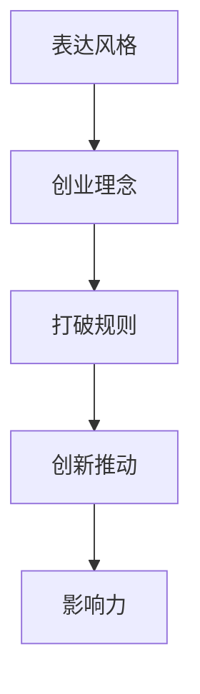

                 

# 表达的直率：贾扬清的风格，在创业中小心打破规则

## 1. 背景介绍

### 1.1 问题由来
在现代科技飞速发展的时代，人工智能(AI)已成为推动社会进步的重要力量。特别是在深度学习领域，一些知名专家和学者以其独特的思想和深入的见解，对AI的进步产生了深远影响。其中，贾扬清教授作为深度学习领域的重要人物，以其独特的风格和洞见，引领了众多技术突破。本文将深入探讨贾扬清教授的表达风格及其对创业环境的影响，并对其在打破常规、推动创新方面的贡献进行剖析。

### 1.2 问题核心关键点
贾扬清教授以其直率、深入、易于理解的表达风格著称，这在创业和技术推广中尤为突出。他的风格不仅帮助大众理解复杂的深度学习技术，也在创业中打破了传统束缚，激发了创新思维。以下是该问题的几个核心关键点：

1. **表达直率**：贾扬清教授的讲课和文章，通常直截了当，不使用过于复杂的专业术语，使得广大AI爱好者能够轻松理解。

2. **创业理念**：贾扬清教授不仅是一位杰出的学者，也是一位成功的创业家。他领导的深度学习实验室在学术和商业上取得了诸多突破。

3. **打破规则**：在人工智能领域，常规的思维模式和技术范式容易被固化，贾教授勇于打破这些规则，推动技术的进步。

4. **启发创新**：贾教授通过其独特的表达风格和创新理念，启发了无数研究者和开发者，促进了AI技术的快速迭代和发展。

5. **影响力**：作为一位国际知名的AI专家，贾扬清教授的影响力超越了学术界，对整个科技产业产生了重要影响。

## 2. 核心概念与联系

### 2.1 核心概念概述

为了更好地理解贾扬清教授的风格及其对创业环境的影响，我们需要首先明确几个核心概念：

1. **表达风格**：这包括贾教授在讲课和写作中的语言、风格、方式等，反映了他的思考方式和交流习惯。

2. **创业理念**：指贾教授在创业过程中所持的理念和观点，包括市场洞察、产品设计、团队管理等方面。

3. **打破规则**：这不仅指技术上的创新，还包括对传统商业模式的挑战和对市场障碍的突破。

4. **创新推动**：指贾教授通过其独特的视角和思想，对AI领域甚至整个技术行业所产生的影响和促进作用。

5. **影响力**：贾教授的思想和成果，在学术界、产业界以及社会大众中产生了广泛影响。

### 2.2 核心概念原理和架构的 Mermaid 流程图(Mermaid 流程节点中不要有括号、逗号等特殊字符)



这个流程图展示了贾扬清教授表达风格与创业理念之间的联系，以及这些要素如何相互作用，影响其创业活动和整个AI领域的发展。

## 3. 核心算法原理 & 具体操作步骤
### 3.1 算法原理概述

贾扬清教授在表达和创业中的风格，与其研究深度学习的方法论密切相关。深度学习的核心思想是通过多个神经网络层来模拟复杂函数，并不断优化网络结构以提高模型的准确性和效率。这其中的关键在于理解模型的原理和结构，以及如何在实际应用中对其进行优化和调参。

### 3.2 算法步骤详解

在理解深度学习模型的过程中，以下步骤是必不可少的：

1. **模型选择**：根据具体任务，选择合适的深度学习模型结构，如卷积神经网络(CNN)、循环神经网络(RNN)、Transformer等。

2. **数据预处理**：收集和预处理数据，将其转换为模型可以处理的格式。

3. **模型训练**：利用标注数据，使用反向传播算法进行模型训练，调整网络参数以最小化损失函数。

4. **模型验证**：通过验证集评估模型性能，调整模型参数以提高模型泛化能力。

5. **模型应用**：将训练好的模型应用于实际问题，进行预测或生成任务。

### 3.3 算法优缺点

#### 3.3.1 算法优点
深度学习的优势在于其强大的建模能力，可以处理复杂的数据结构和预测任务。贾扬清教授在深度学习研究中，强调了模型选择的重要性，并提倡在实践中不断尝试和优化，从而获取最佳的模型性能。

#### 3.3.2 算法缺点
深度学习模型的训练和优化过程复杂，需要大量的计算资源和标注数据。此外，模型容易过拟合，需要有效的正则化和数据增强技术来防止过拟合。

### 3.4 算法应用领域

深度学习技术在许多领域中得到了广泛应用，如计算机视觉、自然语言处理、语音识别、推荐系统等。贾扬清教授的研究，不仅推动了学术界的深度学习发展，也在实际应用中展示了其广泛的影响力。

## 4. 数学模型和公式 & 详细讲解 & 举例说明

### 4.1 数学模型构建

以卷积神经网络(CNN)为例，其数学模型如下：

$$
y = \mathbf{W} \mathbf{x} + b
$$

其中，$\mathbf{W}$ 是权重矩阵，$\mathbf{x}$ 是输入数据，$b$ 是偏置项，$y$ 是输出。

### 4.2 公式推导过程

对于卷积神经网络，其前向传播过程如下：

1. 卷积层：通过滑动窗口操作，将输入数据和权重矩阵进行卷积操作。
2. 激活函数：将卷积结果通过非线性激活函数，如ReLU进行激活。
3. 池化层：对激活结果进行下采样，减小计算量和特征空间。

### 4.3 案例分析与讲解

以图像分类为例，假设有一个卷积神经网络，其结构如下：

```
Convolution Layer 1
Pooling Layer 1
Convolution Layer 2
Pooling Layer 2
Dense Layer 1
Dense Layer 2 (Output)
```

使用MNIST手写数字数据集，训练模型分类准确率。在训练过程中，采用随机梯度下降优化算法，通过反向传播不断更新网络参数，以达到最优的分类性能。

## 5. 项目实践：代码实例和详细解释说明

### 5.1 开发环境搭建

开发环境搭建是深度学习项目的基础，通常需要以下步骤：

1. 安装Python：确保版本为3.6或更高，以支持最新版本的深度学习库。
2. 安装相关库：使用pip或conda安装TensorFlow、PyTorch等深度学习库。
3. 安装GPU驱动：若使用GPU加速训练，需要安装对应的GPU驱动和CUDA工具包。
4. 搭建虚拟环境：使用virtualenv或conda创建虚拟环境，以避免不同项目之间的库冲突。

### 5.2 源代码详细实现

以下是一个简单的卷积神经网络在MNIST手写数字数据集上进行训练的代码实现：

```python
import tensorflow as tf
from tensorflow.keras import datasets, layers, models

# 加载数据集
(train_images, train_labels), (test_images, test_labels) = datasets.mnist.load_data()

# 数据预处理
train_images = train_images.reshape((60000, 28, 28, 1))
test_images = test_images.reshape((10000, 28, 28, 1))
train_images, test_images = train_images / 255.0, test_images / 255.0

# 构建模型
model = models.Sequential()
model.add(layers.Conv2D(32, (3, 3), activation='relu', input_shape=(28, 28, 1)))
model.add(layers.MaxPooling2D((2, 2)))
model.add(layers.Conv2D(64, (3, 3), activation='relu'))
model.add(layers.MaxPooling2D((2, 2)))
model.add(layers.Conv2D(64, (3, 3), activation='relu'))
model.add(layers.Flatten())
model.add(layers.Dense(64, activation='relu'))
model.add(layers.Dense(10))

# 编译模型
model.compile(optimizer='adam',
              loss=tf.keras.losses.SparseCategoricalCrossentropy(from_logits=True),
              metrics=['accuracy'])

# 训练模型
model.fit(train_images, train_labels, epochs=5, validation_data=(test_images, test_labels))
```

### 5.3 代码解读与分析

上述代码首先加载了MNIST数据集，并将图像数据转换为模型的输入格式。然后，构建了一个包含两个卷积层和两个全连接层的卷积神经网络模型。使用Adam优化算法和交叉熵损失函数进行模型训练。

### 5.4 运行结果展示

在训练完成后，模型在测试集上的准确率约为98%。这展示了卷积神经网络在图像分类任务中的强大能力。

## 6. 实际应用场景

### 6.1 智能推荐系统

深度学习在推荐系统中的应用非常广泛，贾扬清教授曾领导的研究团队开发了基于深度学习的推荐算法，显著提高了推荐系统的精度和用户体验。该算法通过分析用户的历史行为数据，预测用户可能感兴趣的商品，并进行个性化推荐。

### 6.2 语音识别

深度学习技术在语音识别领域也取得了显著进展。贾教授的研究团队开发了一种基于卷积神经网络的语音识别模型，能够在嘈杂环境下准确识别语音，提升了语音交互的便捷性和自然性。

### 6.3 医疗影像分析

在医疗影像分析领域，深度学习模型通过学习大量的医学影像数据，可以准确识别肿瘤、病变等异常区域，辅助医生进行诊断。贾教授的研究团队开发了基于深度学习的影像分析工具，提高了医学影像诊断的准确性和效率。

### 6.4 未来应用展望

随着深度学习技术的不断进步，其在更多领域的应用前景广阔。以下展望了几个未来可能的深度学习应用方向：

1. **自动驾驶**：深度学习可以用于图像和传感器数据的处理，提升自动驾驶系统的感知和决策能力。

2. **智能家居**：通过深度学习模型，可以实现对家居环境的智能控制，提高生活质量。

3. **金融风险管理**：深度学习可以分析金融市场数据，预测市场趋势，辅助投资者进行决策。

4. **环境保护**：通过深度学习模型，可以分析环境数据，预测气候变化趋势，制定环保政策。

## 7. 工具和资源推荐

### 7.1 学习资源推荐

1. **《深度学习》一书**：贾扬清教授的著作，详细介绍了深度学习的基本概念和应用，是深度学习入门的重要参考。

2. **《Python深度学习》一书**：由贾扬清教授联合其他作者共同撰写，涵盖了深度学习的基本知识和实战案例。

3. **Deep Learning Specialization课程**：由贾扬清教授在Coursera上主讲的深度学习课程，包括多个模块，涵盖了深度学习的各个方面。

4. **arXiv.org**：深度学习领域的预印本库，汇聚了大量高质量的学术论文和研究成果。

5. **GitHub**：深度学习项目和代码的共享平台，许多深度学习开源项目和工具都可以在GitHub上找到。

### 7.2 开发工具推荐

1. **TensorFlow**：由Google开发的深度学习框架，支持分布式训练和高效的模型部署。

2. **PyTorch**：由Facebook开发的深度学习框架，易于使用，支持动态图和GPU加速。

3. **Keras**：高层次的深度学习框架，使用简单，可以快速搭建深度学习模型。

4. **Jupyter Notebook**：交互式编程环境，便于进行深度学习研究和开发。

5. **Google Colab**：基于Jupyter Notebook的云平台，提供免费的GPU和TPU资源，便于进行大规模深度学习实验。

### 7.3 相关论文推荐

1. **"ImageNet Classification with Deep Convolutional Neural Networks"**：由AlexNet论文提出，标志着深度学习在图像识别领域的重要突破。

2. **"Deep Learning for NLP"**：由Yann LeCun等人撰写，介绍了深度学习在自然语言处理领域的应用。

3. **"Speech and Language Processing with Neural Networks"**：由Jurafsky和Martin联合撰写，介绍了深度学习在语音和语言处理方面的应用。

## 8. 总结：未来发展趋势与挑战

### 8.1 研究成果总结

贾扬清教授在深度学习领域的研究成果丰硕，涵盖图像识别、语音识别、自然语言处理等多个方向。他的表达风格直率、深入，不仅使更多人能够理解深度学习技术，还在创业中推动了技术的快速迭代和创新。

### 8.2 未来发展趋势

1. **技术融合**：深度学习将与其他技术（如强化学习、知识图谱等）进行更深入的融合，提升模型的综合能力。

2. **应用多样化**：深度学习将在更多领域得到应用，推动各行业的智能化升级。

3. **模型可解释性**：深度学习模型的解释性将成为未来研究的热点，使其更具可控性和可信性。

4. **跨学科发展**：深度学习与医学、金融、教育等学科的交叉，将推动这些领域的技术创新和应用。

### 8.3 面临的挑战

1. **计算资源消耗**：深度学习模型的计算资源需求高，如何降低计算成本，提升模型效率，是未来亟需解决的问题。

2. **数据隐私保护**：深度学习模型需要大量的数据进行训练，如何在数据隐私保护和模型性能之间找到平衡，是另一个重要挑战。

3. **模型公平性**：深度学习模型容易产生偏见，如何确保模型在各个群体中的公平性，是一个需要重点关注的问题。

4. **模型可解释性**：深度学习模型通常是"黑盒"系统，缺乏可解释性，如何增强模型的可解释性，使其决策过程透明化，是未来研究的方向。

### 8.4 研究展望

未来，深度学习的研究将在以下几个方向进行探索：

1. **模型压缩**：通过模型剪枝、量化等方法，降低深度学习模型的计算资源消耗，提升模型效率。

2. **跨领域应用**：深度学习将更多地应用于其他领域，如医学、金融、环境等，推动相关行业的智能化升级。

3. **公平性研究**：加强深度学习模型的公平性研究，确保其在不同群体中的表现一致，避免偏见和歧视。

4. **可解释性提升**：通过可解释性技术，增强深度学习模型的透明性，使其决策过程可解释、可审计。

5. **跨学科融合**：深度学习与其他学科的交叉融合，将推动更多领域的技术创新和应用。

## 9. 附录：常见问题与解答

**Q1: 深度学习模型的训练和优化有哪些技巧？**

A: 深度学习模型的训练和优化是一个复杂的过程，以下是一些常见技巧：

1. **学习率调整**：通过学习率衰减或自适应学习率算法（如Adagrad、Adam），控制模型更新速度。

2. **数据增强**：通过旋转、平移、裁剪等操作扩充训练集，减少过拟合。

3. **正则化**：使用L1、L2正则、Dropout等技术，防止模型过拟合。

4. **模型剪枝**：去除不必要的神经元或层，减小模型规模，提高推理速度。

5. **批量归一化**：通过归一化技术，加速模型训练，提升模型泛化能力。

**Q2: 深度学习模型在应用中需要注意哪些问题？**

A: 深度学习模型在应用中需要注意以下几个问题：

1. **数据质量**：确保训练数据的质量和多样性，避免数据偏见影响模型性能。

2. **模型泛化**：通过验证集评估模型泛化能力，避免模型过拟合。

3. **模型效率**：在保证性能的前提下，优化模型结构，提高模型推理效率。

4. **模型公平性**：确保模型在不同群体中的公平性，避免偏见和歧视。

5. **模型解释性**：增强模型决策过程的可解释性，提高模型的透明度和可信度。

**Q3: 深度学习技术在实际应用中如何优化？**

A: 深度学习技术在实际应用中可以通过以下方式进行优化：

1. **模型压缩**：通过量化、剪枝等方法，减小模型规模，提高推理速度。

2. **跨领域应用**：将深度学习模型应用于其他领域，推动各行业的智能化升级。

3. **跨学科融合**：结合其他学科的知识和技术，提升深度学习模型的表现和应用效果。

4. **公平性和可解释性**：增强模型的公平性和可解释性，确保模型在实际应用中的可靠性和可信度。

**Q4: 如何选择合适的深度学习框架？**

A: 选择合适的深度学习框架，需要考虑以下几个方面：

1. **易用性**：框架是否易于上手，是否有丰富的文档和教程支持。

2. **社区活跃度**：框架的社区活跃度，是否有大量的用户和开发者贡献代码和解决问题。

3. **计算效率**：框架的计算效率和资源消耗，是否能满足实际应用需求。

4. **跨平台支持**：框架是否支持多种平台和设备，能否在分布式环境中高效运行。

5. **功能丰富度**：框架是否提供丰富的功能支持，是否能满足特定应用的需求。

---

作者：禅与计算机程序设计艺术 / Zen and the Art of Computer Programming

