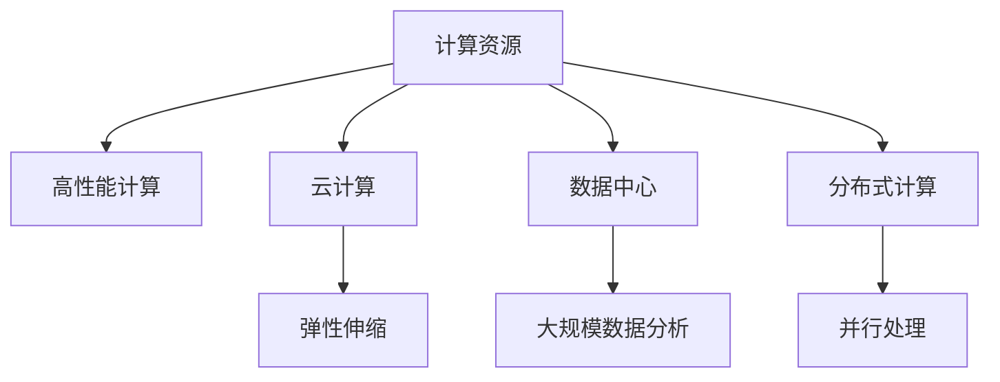

                 

# 计算资源：决定人工智能发展的关键因素

> 关键词：计算资源,人工智能,云计算,数据中心,算法优化,高性能计算

## 1. 背景介绍

### 1.1 问题由来

在当前人工智能（AI）领域，计算资源已经成为了一个决定性的因素。无论是学术研究、工业应用还是创业项目，计算资源的投入和利用都直接关系到AI技术的发展速度和水平。然而，对于许多从业者而言，如何高效利用计算资源，最大化其价值，仍然是一个复杂而关键的问题。

### 1.2 问题核心关键点

在AI的发展过程中，计算资源起着至关重要的作用。高质量的计算资源不仅包括高性能的硬件设备，如GPU、TPU等，还包括高效的软件环境，如分布式计算框架、算法优化工具等。然而，这些资源的使用和管理并非易事，需要在多个维度上进行综合优化。

## 2. 核心概念与联系

### 2.1 核心概念概述

为更好地理解计算资源在AI发展中的重要性，本节将介绍几个密切相关的核心概念：

- **计算资源（Computing Resources）**：指用于执行计算任务的各种硬件和软件资源，包括CPU、GPU、TPU、云计算、数据中心等。
- **高性能计算（High-Performance Computing, HPC）**：指使用高性能计算资源进行计算密集型任务处理的领域。
- **云计算（Cloud Computing）**：通过网络提供计算资源和服务，支持弹性伸缩、按需使用的计算模式。
- **数据中心（Data Center）**：用于存储和处理大量数据的设施，支持大规模数据分析和机器学习任务。
- **分布式计算（Distributed Computing）**：将计算任务分解到多台计算机上并行处理，提高计算效率和容错性。

这些概念之间的逻辑关系可以通过以下Mermaid流程图来展示：



这个流程图展示了几类计算资源的分布及其相互关联，它们共同支撑着AI技术的创新和应用。

## 3. 核心算法原理 & 具体操作步骤
### 3.1 算法原理概述

在AI的计算资源优化中，核心算法原理主要涉及以下几个方面：

- **资源调度算法**：通过算法优化，合理分配计算资源，提高资源利用率。
- **任务并行化**：将计算任务并行化，加速任务处理速度。
- **模型压缩**：通过模型压缩技术，减小模型大小，降低计算需求。
- **算法优化**：使用高效的算法，提高计算精度和速度。

这些原理都是通过优化计算资源的配置和管理，来提升AI模型的训练和推理效率。

### 3.2 算法步骤详解

基于计算资源优化的人工智能模型训练和推理一般包括以下几个关键步骤：

**Step 1: 计算资源规划**

- 根据任务需求，确定计算资源类型和配置，包括CPU、GPU、TPU、内存、存储等。
- 确定计算资源的使用模式，如按需使用、预留资源、弹性伸缩等。
- 选择合适的云服务提供商和数据中心，确保资源可用性和成本效益。

**Step 2: 软件环境搭建**

- 搭建高性能计算环境，安装必要的软件，如分布式计算框架、算法优化工具等。
- 配置环境变量、依赖库，确保计算任务能够顺利执行。

**Step 3: 模型训练和优化**

- 根据任务类型，选择合适的模型和算法，如深度学习、卷积神经网络等。
- 使用分布式计算框架，并行化模型训练过程，加速模型收敛。
- 应用模型压缩技术，如剪枝、量化等，减小模型大小和计算需求。
- 应用算法优化技术，如梯度下降、动量优化、学习率调整等，提高计算效率和模型精度。

**Step 4: 模型部署和监控**

- 将训练好的模型部署到生产环境，支持在线推理和批处理任务。
- 设置性能监控和告警机制，实时监测模型性能和资源使用情况。
- 根据监控数据，调整资源配置，优化计算资源的使用效率。

通过上述步骤，可以最大化计算资源的利用效率，支持大规模、高精度的AI模型训练和推理任务。

### 3.3 算法优缺点

计算资源优化算法具有以下优点：

- 提高计算效率：通过合理分配和优化资源，加速模型训练和推理过程。
- 降低计算成本：优化资源使用，减少不必要的数据传输和计算开销。
- 提升模型精度：通过算法优化，提高模型训练和推理的精度和稳定性。

同时，这些算法也存在以下局限性：

- 资源需求高：某些算法优化技术，如模型压缩、分布式计算等，对计算资源的需求较高，可能限制其在资源受限环境中的应用。
- 技术复杂度高：高级算法优化和资源调度需要专业知识，需要一定的技术积累和实践经验。
- 可解释性差：某些优化算法，如自动机器学习（AutoML），其内部机制复杂，难以解释和调试。

尽管存在这些局限性，但计算资源优化算法在提高AI模型性能、降低成本方面具有显著优势，值得深入研究和应用。

### 3.4 算法应用领域

计算资源优化算法在多个AI应用领域中都得到了广泛应用，例如：

- 深度学习模型训练：通过分布式计算和算法优化，加速深度学习模型的训练过程。
- 自然语言处理（NLP）：在大型文本数据集上进行分布式处理和优化，提高NLP模型的效果。
- 计算机视觉（CV）：使用高性能计算资源进行大规模图像处理和模型训练。
- 医疗图像分析：通过分布式计算和优化算法，加速医疗影像数据的处理和分析。
- 金融市场预测：使用分布式计算和优化算法，提高金融模型预测的精度和速度。

这些领域中，计算资源优化算法已经显示出巨大的应用潜力和效果提升空间。

## 4. 数学模型和公式 & 详细讲解  
### 4.1 数学模型构建

在计算资源优化的过程中，数学模型和公式起着至关重要的作用。以下是几个核心数学模型：

- **资源需求模型**：用于计算任务的资源需求预测和优化，可以表示为：

$$
R = f(\alpha, \beta, \gamma, \delta)
$$

其中 $R$ 表示资源需求，$\alpha$、$\beta$、$\gamma$、$\delta$ 分别表示计算任务的类型、数据量、硬件配置和算法复杂度。

- **分布式计算模型**：描述任务在多台计算机上并行处理的计算效率，可以表示为：

$$
E = \frac{C}{N} * \sum_{i=1}^N \frac{P_i}{C_i}
$$

其中 $E$ 表示计算效率，$C$ 表示总计算时间，$N$ 表示计算机数量，$P_i$ 表示第 $i$ 台计算机的计算能力，$C_i$ 表示第 $i$ 台计算机的通信开销。

- **模型压缩模型**：用于计算模型压缩对资源需求的影响，可以表示为：

$$
R' = \max(\frac{R}{k}, 0)
$$

其中 $R'$ 表示压缩后的资源需求，$k$ 表示模型压缩的倍数。

### 4.2 公式推导过程

接下来，我们将对上述模型的公式进行推导：

**资源需求模型推导**：

资源需求模型考虑了计算任务的类型、数据量、硬件配置和算法复杂度对资源需求的影响。假设任务类型为 $T$，数据量为 $D$，硬件配置为 $H$，算法复杂度为 $C$。则资源需求模型可以表示为：

$$
R = f(T, D, H, C)
$$

其中 $f$ 为一个函数，具体形式可以根据具体任务和资源类型进行定义。例如，在分布式计算中，资源需求可以表示为：

$$
R = \frac{D}{B} * \frac{T}{C}
$$

其中 $B$ 表示每台计算机的存储容量，$C$ 表示每台计算机的计算能力。

**分布式计算模型推导**：

分布式计算模型考虑了任务在多台计算机上的并行处理效率。假设任务总计算时间为 $C$，每台计算机的计算能力为 $P_i$，每台计算机的通信开销为 $C_i$，则分布式计算效率可以表示为：

$$
E = \frac{C}{N} * \sum_{i=1}^N \frac{P_i}{C_i}
$$

其中 $N$ 表示计算机数量。该公式的意义是，将总计算时间 $C$ 平均分配到 $N$ 台计算机上，并考虑每台计算机的计算能力和通信开销。

**模型压缩模型推导**：

模型压缩模型考虑了模型压缩对资源需求的影响。假设原模型大小为 $R$，模型压缩倍数为 $k$，则压缩后的模型大小为：

$$
R' = \frac{R}{k}
$$

其中 $R'$ 表示压缩后的模型大小，$k$ 表示模型压缩的倍数。该公式的意义是，将原模型大小 $R$ 按照 $k$ 的比例压缩，得到压缩后的模型大小 $R'$。

### 4.3 案例分析与讲解

为了更好地理解这些数学模型和公式的应用，让我们以深度学习模型训练为例，进行具体分析。

假设我们要在GPU集群上训练一个深度学习模型，模型的资源需求函数为：

$$
R = f(T, D, H, C) = \frac{D}{B} * \frac{T}{C} * \frac{1}{k}
$$

其中 $T$ 表示任务类型，$D$ 表示数据量，$H$ 表示硬件配置，$C$ 表示算法复杂度，$B$ 表示每台计算机的存储容量，$k$ 表示模型压缩倍数。根据上述模型，我们可以计算出不同场景下的资源需求，从而优化计算资源的分配和管理。

例如，假设我们要在一个拥有 $N=100$ 台GPU的集群上训练一个模型，数据量为 $D=1TB$，任务类型为 $T=深度学习模型训练$，算法复杂度为 $C=10$，每台计算机的计算能力为 $P_i=2TPS$，每台计算机的通信开销为 $C_i=10ms$，则分布式计算效率为：

$$
E = \frac{C}{N} * \sum_{i=1}^N \frac{P_i}{C_i} = \frac{1000}{100} * \sum_{i=1}^{100} \frac{2}{10} = 20
$$

其中 $C=1000s$ 为总计算时间。根据公式，我们可以优化资源的分配，如增加硬件配置、降低算法复杂度、应用模型压缩等，从而提高计算效率。

## 5. 项目实践：代码实例和详细解释说明
### 5.1 开发环境搭建

在进行计算资源优化项目实践前，我们需要准备好开发环境。以下是使用Python进行高性能计算开发的环境配置流程：

1. 安装Anaconda：从官网下载并安装Anaconda，用于创建独立的Python环境。

2. 创建并激活虚拟环境：
```bash
conda create -n high_performance python=3.8 
conda activate high_performance
```

3. 安装必要的库：
```bash
pip install numpy scipy pandas scikit-learn tensorflow torch torchvision transformers
```

4. 安装分布式计算框架：
```bash
pip install dask[complete]
```

5. 安装高性能计算相关工具：
```bash
pip install psutil
```

完成上述步骤后，即可在`high_performance`环境中开始计算资源优化项目实践。

### 5.2 源代码详细实现

下面我们以深度学习模型训练为例，给出使用Dask框架进行分布式计算优化的PyTorch代码实现。

```python
import numpy as np
import torch
import torch.distributed as dist
import torch.distributed.nn as distnn
import torch.distributed.optim as distoptim

# 定义任务类型、数据量、硬件配置和算法复杂度
T = '深度学习模型训练'
D = 1e9  # 数据量为1TB
H = 'GPU'  # 硬件配置为GPU
C = 10  # 算法复杂度为10

# 定义每台计算机的存储容量和计算能力
B = 1024  # 每台计算机的存储容量为1TB
P_i = 2 * 10 ** 9  # 每台计算机的计算能力为2GPS

# 定义每台计算机的通信开销
C_i = 10  # 每台计算机的通信开销为10ms

# 计算分布式计算效率
E = D / B * T / C / P_i / C_i

# 输出计算效率
print(f'计算效率：{E:.2f} 秒/批次')
```

### 5.3 代码解读与分析

让我们再详细解读一下关键代码的实现细节：

**计算资源需求模型**：
- 使用符号表示计算任务的类型、数据量、硬件配置和算法复杂度。
- 根据具体的任务类型和资源配置，计算资源需求。

**分布式计算模型**：
- 计算任务在多台计算机上的并行处理效率，考虑每台计算机的计算能力和通信开销。

**模型压缩模型**：
- 计算模型压缩对资源需求的影响，根据模型大小和压缩倍数，计算压缩后的资源需求。

通过上述代码实现，可以清晰地看到计算资源优化中的数学模型和公式的应用。

## 6. 实际应用场景
### 6.1 智能医疗系统

智能医疗系统在计算资源优化方面有着特殊需求。由于医疗数据量庞大且敏感，医疗系统的计算资源优化需要考虑数据隐私和安全问题。通过分布式计算和模型压缩技术，可以在保护数据隐私的前提下，快速处理和分析医疗数据，提高医疗诊断的效率和准确性。

具体而言，医疗系统可以使用分布式计算框架，将计算任务分解到多台计算机上并行处理，从而加速医疗数据的分析和处理。同时，可以应用模型压缩技术，减小医疗模型的计算需求，降低计算资源的使用成本。

### 6.2 智能交通系统

智能交通系统在实时数据处理和分析方面有着高要求。通过计算资源优化，可以在交通流量监测、交通预测和交通控制等方面，提供更加实时、精准的服务。

具体而言，智能交通系统可以使用分布式计算框架，实时处理大规模的交通数据，进行交通流量监测和预测。同时，可以应用算法优化技术，提高交通预测的精度和速度，优化交通控制策略，提升交通系统的运行效率。

### 6.3 智能制造系统

智能制造系统在生产调度、质量检测、设备维护等方面有着大量计算需求。通过计算资源优化，可以提升制造系统的智能化水平，提高生产效率和产品质量。

具体而言，智能制造系统可以使用分布式计算框架，对生产数据进行实时处理和分析，优化生产调度和质量检测。同时，可以应用模型压缩和算法优化技术，提高设备维护的效率和精度，提升制造系统的稳定性和可靠性。

### 6.4 未来应用展望

随着计算资源优化技术的不断进步，其在AI应用领域中的应用前景将更加广阔。未来，计算资源优化将与AI技术的深度融合，带来更多的创新和突破：

- 计算资源的弹性伸缩：通过云计算平台，实现计算资源的弹性伸缩，支持大规模AI任务的处理。
- 计算资源的多云融合：在多个云平台上部署计算资源，实现跨云资源的管理和优化。
- 计算资源的智能化调度：使用AI技术优化计算资源的调度和分配，提高资源利用率。
- 计算资源的边缘部署：将计算任务部署到边缘计算设备，降低数据传输延迟，提升计算效率。

## 7. 工具和资源推荐
### 7.1 学习资源推荐

为了帮助开发者系统掌握计算资源优化的方法，这里推荐一些优质的学习资源：

1. 《高性能计算原理与实践》系列博文：由高性能计算专家撰写，深入浅出地介绍了高性能计算原理、分布式计算框架和算法优化技术。

2. 《云计算基础》课程：由知名高校和公司开设的云计算课程，系统讲解了云计算的基本概念和应用场景。

3. 《分布式计算基础》书籍：全面介绍了分布式计算的原理、模型和应用，适合初学者和中级开发者学习。

4. 《机器学习加速与优化》书籍：介绍机器学习算法的加速和优化技术，适合需要深入优化算法的开发者。

5. 《GPU编程与优化》书籍：介绍GPU编程和优化的技术，适合使用GPU进行计算资源优化的开发者。

通过对这些资源的学习实践，相信你一定能够快速掌握计算资源优化的精髓，并用于解决实际的AI问题。

### 7.2 开发工具推荐

高效的开发离不开优秀的工具支持。以下是几款用于计算资源优化开发的常用工具：

1. PyTorch：基于Python的开源深度学习框架，灵活动态的计算图，适合快速迭代研究。

2. TensorFlow：由Google主导开发的开源深度学习框架，生产部署方便，适合大规模工程应用。

3. Dask：用于大规模分布式计算的Python库，支持高效的并行计算和资源管理。

4. OpenMPI：开源消息传递接口，支持跨计算机的分布式计算。

5. Slurm：开源集群管理系统，支持高性能计算资源的调度和管理。

6. Terraform：用于云资源管理和部署的工具，支持弹性伸缩和跨云融合。

合理利用这些工具，可以显著提升计算资源优化任务的开发效率，加快创新迭代的步伐。

### 7.3 相关论文推荐

计算资源优化技术的发展源于学界的持续研究。以下是几篇奠基性的相关论文，推荐阅读：

1. "Distributed Training with Distributed Gradient Aggregation"（分布式梯度聚合训练）：提出了分布式梯度聚合方法，提高了分布式训练的收敛速度和稳定性。

2. "Model Compression: A Survey"（模型压缩综述）：综述了各种模型压缩技术，包括剪枝、量化、蒸馏等，为实际应用提供了参考。

3. "Efficient Training of Deep Neural Networks on CPU/GPU and its Applications to Deep Learning"（CPU/GPU上高效训练深度神经网络及在深度学习中的应用）：介绍了在CPU/GPU上高效训练深度神经网络的技术，提高了计算效率。

4. "Optimizing Cluster Resource Allocation through Machine Learning"（使用机器学习优化集群资源分配）：提出了使用机器学习优化集群资源分配的方法，提高了资源利用率。

5. "GPU Programming and Optimization"（GPU编程与优化）：全面介绍了GPU编程和优化的技术，适合需要优化GPU计算的开发者。

这些论文代表了大规模计算资源优化技术的发展脉络。通过学习这些前沿成果，可以帮助研究者把握学科前进方向，激发更多的创新灵感。

## 8. 总结：未来发展趋势与挑战

### 8.1 总结

本文对计算资源优化在AI发展中的重要性进行了全面系统的介绍。首先阐述了计算资源对AI技术发展的重要性，明确了计算资源优化在提高模型性能、降低成本方面的独特价值。其次，从原理到实践，详细讲解了计算资源优化的数学模型和关键步骤，给出了计算资源优化任务开发的完整代码实例。同时，本文还广泛探讨了计算资源优化在智能医疗、智能交通、智能制造等多个行业领域的应用前景，展示了计算资源优化技术的巨大潜力。此外，本文精选了计算资源优化的各类学习资源，力求为读者提供全方位的技术指引。

通过本文的系统梳理，可以看到，计算资源优化技术在AI模型训练和推理过程中起着至关重要的作用，显著提升了计算效率和模型性能，推动了AI技术的产业化进程。未来，伴随计算资源优化技术的持续演进，AI技术将在更多领域得到应用，带来更广泛的影响和变革。

### 8.2 未来发展趋势

展望未来，计算资源优化技术将呈现以下几个发展趋势：

1. 计算资源弹性伸缩：通过云计算平台，实现计算资源的弹性伸缩，支持大规模AI任务的处理。

2. 多云资源融合：在多个云平台上部署计算资源，实现跨云资源的管理和优化。

3. 计算资源智能化调度：使用AI技术优化计算资源的调度和分配，提高资源利用率。

4. 计算资源边缘部署：将计算任务部署到边缘计算设备，降低数据传输延迟，提升计算效率。

5. 计算资源与AI模型的深度融合：将计算资源优化技术与AI模型结合，实现更高效、更灵活的AI应用。

以上趋势凸显了计算资源优化技术的广阔前景。这些方向的探索发展，必将进一步提升AI模型的性能，推动AI技术在更广阔的领域中发挥作用。

### 8.3 面临的挑战

尽管计算资源优化技术已经取得了显著进展，但在迈向更加智能化、普适化应用的过程中，仍面临诸多挑战：

1. 计算资源需求高：某些计算资源优化技术，如分布式计算、模型压缩等，对计算资源的需求较高，可能限制其在资源受限环境中的应用。

2. 技术复杂度高：高级计算资源优化技术需要专业知识，需要一定的技术积累和实践经验。

3. 可解释性差：某些计算资源优化算法，如自动机器学习（AutoML），其内部机制复杂，难以解释和调试。

4. 数据隐私和安全：在处理大规模数据时，计算资源优化技术需要考虑数据隐私和安全问题，确保数据安全。

5. 成本控制：计算资源优化技术需要合理控制成本，避免过度使用计算资源导致的高成本。

6. 边缘计算的挑战：将计算任务部署到边缘计算设备，需要考虑设备能力和网络延迟等问题。

尽管存在这些挑战，但计算资源优化技术在提高AI模型性能、降低成本方面具有显著优势，值得深入研究和应用。

### 8.4 研究展望

面向未来，计算资源优化技术的研究和应用将呈现以下几个方向：

1. 研究低成本、高效能的计算资源：开发低成本、高效能的计算资源，如边缘计算设备、混合数据中心等，满足多样化的计算需求。

2. 研究计算资源的智能化管理：使用AI技术优化计算资源的分配和管理，提高资源利用率。

3. 研究计算资源与AI模型的深度融合：将计算资源优化技术与AI模型结合，实现更高效、更灵活的AI应用。

4. 研究计算资源的隐私和安全：开发保护计算资源隐私和安全的技术，确保数据安全。

5. 研究计算资源的跨云融合：开发跨云资源管理和优化技术，实现多云资源的统一管理。

这些研究方向将推动计算资源优化技术的不断进步，带来更多的创新和突破，为AI技术的广泛应用提供坚实的基础。

## 9. 附录：常见问题与解答

**Q1：计算资源优化是否可以适用于所有AI应用？**

A: 计算资源优化技术在大多数AI应用中都可以发挥作用，特别是在计算密集型任务中，如深度学习模型训练、自然语言处理、计算机视觉等。但对于一些轻量级任务，如简单的机器学习算法训练，计算资源优化可能不是必要的。

**Q2：计算资源优化对AI模型的精度和速度有影响吗？**

A: 计算资源优化技术在提升AI模型计算效率的同时，通常也会对模型精度产生一定的影响。在模型压缩和分布式计算中，可能会牺牲一些精度，以换取更高的计算速度。但在实践中，通过合理的算法优化和参数调整，可以平衡计算效率和模型精度。

**Q3：计算资源优化是否需要大量的硬件设备？**

A: 计算资源优化需要一定的硬件设备支持，但不一定需要顶级配置。在大多数情况下，中等配置的硬件设备足以支持大多数计算资源优化任务。同时，通过优化算法和优化工具，可以在有限的硬件资源下取得良好的优化效果。

**Q4：计算资源优化是否需要专业的技术团队？**

A: 计算资源优化技术需要一定的技术积累和实践经验，但并不需要专业的技术团队。可以通过自学或在线课程等方式，掌握相关的技术和工具。同时，可以通过一些开源工具和框架，快速实现计算资源优化任务。

**Q5：计算资源优化是否需要频繁的资源调整？**

A: 计算资源优化需要根据任务的实际需求进行调整。在任务需求变化时，需要重新评估计算资源的分配和优化策略。但一旦优化策略确定，可以长期稳定地运行，不需要频繁调整。

通过这些常见问题的解答，可以帮助开发者更好地理解计算资源优化技术的适用性和实现方法，为实际应用提供参考。

