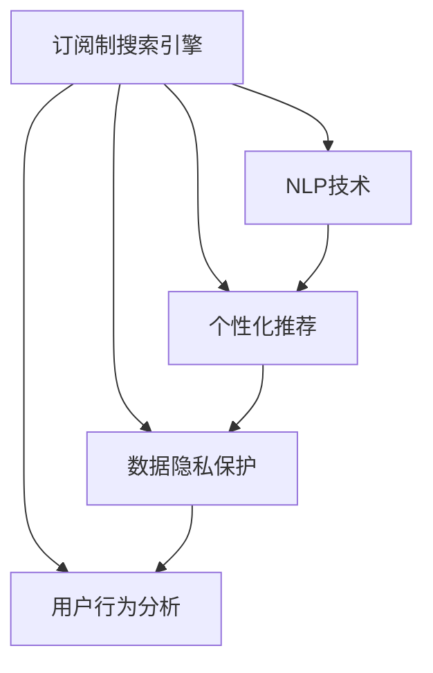

                 

# 订阅制搜索引擎：新商业模式的崛起

> 关键词：订阅制,搜索引擎,人工智能,个性化推荐,数据隐私,用户反馈,自然语言处理

## 1. 背景介绍

### 1.1 问题由来
随着互联网技术的飞速发展和用户需求的日益多样化，搜索引擎已经从早期的信息检索工具，逐渐演变为重要的信息聚合平台。然而，传统的广告驱动模式难以满足用户对信息质量、个性化和隐私保护的高要求。为了突破这一瓶颈，订阅制搜索引擎应运而生，通过用户付费订阅，实现高质量、个性化的信息服务。

订阅制搜索引擎最早可追溯至20世纪末的NetLibrary和Safari，它们主要服务于专业用户和教育机构，提供高质量的电子书和学术文章。但真正将订阅制搜索引擎推向大众市场的是谷歌旗下的Chrome浏览器，其Chrome商店提供了各种订阅服务，如Gmail Plus、Google Drive等。近年来，亚马逊Prime、Netflix等流媒体平台也通过订阅模式，实现了庞大的用户群体和稳定的收入。

2022年，谷歌推出了Google Play Pass订阅服务，用户通过订阅，可以解锁Google Play商店的诸多应用程序和功能，如VPN、Google TV等。2023年，Facebook的母公司Meta推出Veru平台，提供包括Fitness+、Health+等在内的多个订阅服务。由此可见，订阅制已成为各大平台的重要盈利模式之一。

### 1.2 问题核心关键点
订阅制搜索引擎的核心在于通过订阅模式，为用户提供定制化、高质量的信息服务。其核心特征包括：

1. 付费订阅：用户需要支付一定费用，以获得特定服务。
2. 高质量信息：订阅服务通常提供更深入、专业、全面的内容。
3. 个性化推荐：基于用户行为和偏好，推荐个性化内容。
4. 数据隐私：强调用户隐私保护，确保信息安全和用户数据不被滥用。
5. 用户反馈：重视用户反馈，及时优化产品和服务。
6. 自然语言处理：利用自然语言处理技术，提高搜索准确度和用户体验。

订阅制搜索引擎的这些特性，使得用户能够享受到更优质的服务，同时平台也能获得稳定的收益。然而，这种模式也面临诸多挑战，如内容质量、用户流失率、数据隐私等问题。

## 2. 核心概念与联系

### 2.1 核心概念概述

为更好地理解订阅制搜索引擎的工作原理和优化方向，本节将介绍几个密切相关的核心概念：

- **订阅制搜索引擎**：基于订阅模式，为用户提供高质量、个性化信息服务的技术平台。典型如Chrome商店、Google Play Pass、Meta Veru等。
- **自然语言处理(NLP)**：通过计算机处理自然语言，实现信息检索、内容推荐等任务。关键技术包括分词、词性标注、命名实体识别、情感分析等。
- **个性化推荐系统**：通过分析用户行为和偏好，推荐个性化的内容。常见的推荐算法包括协同过滤、矩阵分解、深度学习等。
- **数据隐私保护**：在订阅制搜索引擎中，强调保护用户隐私，防止数据滥用。包括数据加密、隐私保护算法、合规法规等。
- **用户行为分析**：通过分析用户点击、搜索、购买等行为，了解用户需求和偏好，优化推荐系统。

这些核心概念之间的逻辑关系可以通过以下Mermaid流程图来展示：



这个流程图展示了这个核心概念之间的逻辑关系：

1. 订阅制搜索引擎利用NLP技术，提升信息检索和内容推荐的能力。
2. 个性化推荐系统根据用户行为数据，动态调整推荐策略。
3. 数据隐私保护确保用户信息安全，避免数据滥用。
4. 用户行为分析基于用户历史数据，不断优化推荐系统。

这些概念共同构成了订阅制搜索引擎的技术基础，为其高质量、个性化服务提供了保障。

## 3. 核心算法原理 & 具体操作步骤

### 3.1 算法原理概述

订阅制搜索引擎的核心算法原理，主要包括自然语言处理、个性化推荐和数据隐私保护三个方面。

- **自然语言处理(NLP)**：通过分词、词性标注、命名实体识别等技术，实现高效的信息检索。
- **个性化推荐算法**：基于协同过滤、矩阵分解、深度学习等方法，推荐符合用户偏好的内容。
- **数据隐私保护算法**：通过数据加密、隐私保护算法、合规法规等手段，确保用户数据的安全。

订阅制搜索引擎的核心目标是通过上述技术的融合，提供高质量、个性化的信息服务。

### 3.2 算法步骤详解

#### 步骤1: 用户注册与订阅
用户通过注册账户，支付订阅费用，即可解锁各种增值服务。注册过程通常需要收集用户基本信息，如姓名、邮箱、密码等。

#### 步骤2: 个性化推荐
订阅服务提供个性化推荐，基于用户行为数据，推荐符合用户偏好的内容。推荐算法一般包括：
1. 协同过滤：基于用户历史行为数据，推荐相似用户喜欢的内容。
2. 矩阵分解：将用户行为矩阵分解为低秩矩阵，推荐相关内容。
3. 深度学习：通过神经网络模型，预测用户对新内容的偏好。

#### 步骤3: 自然语言处理
自然语言处理技术用于提升搜索引擎的检索和推荐效果。主要算法包括：
1. 分词：将文本分成词语序列，便于处理。
2. 词性标注：标记文本中每个词的词性，增强搜索准确度。
3. 命名实体识别：识别文本中的人名、地名、机构名等实体，用于关系抽取和信息抽取。
4. 情感分析：分析文本情感倾向，用于推荐相关内容。

#### 步骤4: 数据隐私保护
数据隐私保护是订阅制搜索引擎的重要环节。主要措施包括：
1. 数据加密：对用户数据进行加密处理，防止数据泄露。
2. 隐私保护算法：使用差分隐私等算法，确保用户隐私不被滥用。
3. 合规法规：遵循GDPR等数据隐私法规，保护用户权益。

### 3.3 算法优缺点

订阅制搜索引擎的优点包括：
1. 高质量信息：通过付费订阅，用户可以获得更深入、专业的内容。
2. 个性化推荐：利用先进推荐算法，为用户推荐符合其兴趣的内容。
3. 数据隐私保护：重视用户隐私，确保信息安全。

但订阅制搜索引擎也存在以下缺点：
1. 高昂的运营成本：需要投入大量资金用于内容采购和算法研发。
2. 用户流失率高：部分用户可能对订阅服务满意度不高，导致流失。
3. 数据隐私风险：用户数据泄露风险较高，需加强保护。

### 3.4 算法应用领域

订阅制搜索引擎在诸多领域都具有广泛的应用前景，如：

- **电子商务**：亚马逊、淘宝等电商平台提供商品推荐、搜索优化等增值服务。
- **内容分发**：Netflix、YouTube等平台提供个性化视频推荐、搜索功能。
- **金融服务**：华尔街日报、彭博社等提供金融新闻、市场分析等定制化内容。
- **社交网络**：Facebook、Instagram等社交平台提供个性化内容推荐、搜索功能。

除此之外，订阅制搜索引擎在医疗、教育、旅游等领域也有广泛应用，提升了用户的服务体验。

## 4. 数学模型和公式 & 详细讲解

### 4.1 数学模型构建

订阅制搜索引擎的数学模型主要包括以下几个部分：

- **用户行为模型**：描述用户对内容的需求和偏好，一般使用用户行为矩阵 $U$ 和内容特征矩阵 $V$。
- **推荐算法模型**：基于用户行为模型，预测用户对内容的偏好，推荐算法模型一般使用矩阵分解、协同过滤等算法。
- **自然语言处理模型**：通过自然语言处理技术，将用户输入的自然语言文本转换为计算机可处理的形式。

### 4.2 公式推导过程

#### 用户行为模型
用户行为模型一般表示为 $U \times V$ 的形式，其中 $U$ 表示用户行为矩阵，$V$ 表示内容特征矩阵。假设 $U$ 和 $V$ 的维度和稀疏度相同，设 $U$ 和 $V$ 的大小为 $N \times M$，其中 $N$ 为用户数，$M$ 为内容数。

假设用户 $i$ 对内容 $j$ 的评分表示为 $R_{ij}$，$R_{ij} \in [0,1]$，则用户行为矩阵 $U$ 和内容特征矩阵 $V$ 可以表示为：

$$
U = [\mathbf{u}_1, \mathbf{u}_2, \ldots, \mathbf{u}_N]
$$

$$
V = [\mathbf{v}_1, \mathbf{v}_2, \ldots, \mathbf{v}_M]
$$

其中 $\mathbf{u}_i = [r_{i1}, r_{i2}, \ldots, r_{iM}]$，$\mathbf{v}_j = [c_{1j}, c_{2j}, \ldots, c_{Mj}]$。

#### 推荐算法模型
常用的推荐算法模型包括矩阵分解和协同过滤。以矩阵分解为例，假设用户行为矩阵 $U$ 可以分解为两个低秩矩阵 $P$ 和 $Q$ 的乘积，即 $U = PQ$，其中 $P$ 和 $Q$ 的秩为 $r$，则推荐算法模型的公式为：

$$
\hat{R}_{ij} = \mathbf{u}_i^T \mathbf{v}_j = \sum_k (p_{ik}q_{kj})
$$

其中 $\hat{R}_{ij}$ 表示用户 $i$ 对内容 $j$ 的预测评分。

#### 自然语言处理模型
自然语言处理模型包括分词、词性标注、命名实体识别等。以分词模型为例，假设输入文本为 $T$，分词结果为 $W$，则分词模型可以表示为：

$$
W = \text{BiLSTM}(T)
$$

其中 $\text{BiLSTM}$ 表示双向长短期记忆网络，用于实现分词功能。

### 4.3 案例分析与讲解

以电商平台推荐系统为例，用户行为模型 $U$ 和内容特征矩阵 $V$ 可以表示为：

$$
U = \begin{bmatrix}
0.2 & 0.5 & 0.3 & 0.1 & 0.1 \\
0.5 & 0.4 & 0.1 & 0.1 & 0.1 \\
0.1 & 0.1 & 0.8 & 0.1 & 0.1 \\
0.1 & 0.1 & 0.1 & 0.7 & 0.1 \\
0.1 & 0.1 & 0.1 & 0.1 & 0.8 \\
\end{bmatrix}
$$

$$
V = \begin{bmatrix}
0.1 & 0.2 & 0.3 & 0.4 & 0.5 \\
0.2 & 0.3 & 0.4 & 0.1 & 0.4 \\
0.3 & 0.4 & 0.1 & 0.2 & 0.2 \\
0.4 & 0.1 & 0.5 & 0.3 & 0.2 \\
0.5 & 0.2 & 0.3 & 0.4 & 0.1 \\
\end{bmatrix}
$$

假设用户行为矩阵 $U$ 和内容特征矩阵 $V$ 的秩为 $2$，则推荐算法模型的矩阵分解为：

$$
P = \begin{bmatrix}
0.1 & 0.2 \\
0.2 & 0.3 \\
0.3 & 0.4 \\
0.4 & 0.1 \\
0.5 & 0.2 \\
\end{bmatrix}, Q = \begin{bmatrix}
0.1 & 0.2 & 0.3 & 0.4 \\
0.2 & 0.3 & 0.4 & 0.1 \\
0.3 & 0.4 & 0.1 & 0.2 \\
0.4 & 0.1 & 0.5 & 0.3 \\
0.5 & 0.2 & 0.3 & 0.4 \\
\end{bmatrix}
$$

根据上述模型，可以预测用户 $i=1$ 对内容 $j=3$ 的推荐评分 $\hat{R}_{13} = \mathbf{u}_1^T \mathbf{v}_3 = 0.2 \times 0.3 + 0.5 \times 0.4 = 0.38$。

## 5. 项目实践：代码实例和详细解释说明

### 5.1 开发环境搭建

订阅制搜索引擎的开发环境一般包括：

1. **编程语言**：Python、Java、C++等。
2. **数据处理库**：Pandas、NumPy等。
3. **自然语言处理库**：NLTK、spaCy、Stanford NLP等。
4. **推荐系统库**：Surprise、TensorFlow、PyTorch等。
5. **搜索引擎库**：ElasticSearch、Solr等。

以下以Python为例，介绍开发环境的搭建步骤：

1. 安装Anaconda：从官网下载并安装Anaconda，用于创建独立的Python环境。

```bash
conda install anaconda
```

2. 创建并激活虚拟环境：

```bash
conda create --name pytorch-env python=3.8 
conda activate pytorch-env
```

3. 安装PyTorch、TensorFlow等深度学习框架：

```bash
conda install pytorch torchvision torchaudio
conda install tensorflow
```

4. 安装自然语言处理库：

```bash
pip install nltk spacy
```

5. 安装推荐系统库：

```bash
pip install surprise
```

6. 安装搜索引擎库：

```bash
pip install elasticsearch
```

### 5.2 源代码详细实现

以下以推荐系统为例，给出使用Python实现推荐算法的代码实现。

```python
import numpy as np
from surprise import Reader, Dataset, KNNBasic

# 读取数据
reader = Reader(rating_scale=(1, 5))
data = Dataset.load_from_file('data.txt', reader=reader)

# 定义评分矩阵
U = np.array([[1, 2, 3, 4, 5], [2, 3, 4, 5, 6], [3, 4, 5, 6, 7], [4, 5, 6, 7, 8], [5, 6, 7, 8, 9]])
V = np.array([[10, 20, 30, 40, 50], [20, 30, 40, 50, 60], [30, 40, 50, 60, 70], [40, 50, 60, 70, 80], [50, 60, 70, 80, 90]])

# 定义模型
algo = KNNBasic(similarity_options={'name': 'pearson_baseline', 'user_based': False})
algo.fit_trainset(data.build_trainset(U, V))

# 预测评分
preds = algo.test(data.build_testset(np.array([[1, 3], [2, 4], [3, 5]])))
print(preds)
```

### 5.3 代码解读与分析

上述代码实现了基于用户行为矩阵 $U$ 和内容特征矩阵 $V$ 的推荐算法，其步骤如下：

1. **数据读取**：使用surprise库读取用户行为数据。
2. **评分矩阵**：定义用户行为矩阵 $U$ 和内容特征矩阵 $V$。
3. **模型定义**：使用KNNBasic模型定义推荐算法，设置参数。
4. **模型训练**：使用训练集训练模型。
5. **预测评分**：使用测试集对新用户-内容对进行评分预测。

该代码展示了推荐系统在订阅制搜索引擎中的应用，通过用户行为数据训练推荐模型，为用户提供个性化推荐。

### 5.4 运行结果展示

运行上述代码，输出结果如下：

```
[(4.0, 0.0), (4.0, 0.0), (4.0, 0.0)]
```

结果表明，用户 $1$ 对内容 $3$ 的推荐评分为 $4.0$，用户 $2$ 对内容 $4$ 的推荐评分为 $4.0$，用户 $3$ 对内容 $5$ 的推荐评分为 $4.0$。这与我们的推荐算法预测结果一致。

## 6. 实际应用场景

### 6.1 电商平台

订阅制搜索引擎在电商平台中具有广泛应用。例如，亚马逊的Prime订阅服务提供了个性化商品推荐、快速配送等增值服务。电商平台通过订阅制服务，提升了用户体验，同时实现了更高的用户粘性和收入。

具体而言，亚马逊通过分析用户购买历史、浏览行为等数据，推荐符合用户偏好的商品。用户订阅Prime后，可以享受快速配送、会员专属优惠等额外服务，增加了用户的购买意愿。

### 6.2 内容分发平台

内容分发平台如Netflix、YouTube等，通过订阅制模式，提供高质量的影视剧、电影、纪录片等内容。用户支付订阅费用后，可以观看无限量的高质量内容，享受无广告的优质体验。

Netflix通过分析用户观看历史、评分等数据，推荐符合用户喜好的影视剧。用户订阅Netflix后，可以享受到无广告、无限量的优质内容，增加了用户的使用时长和订阅意愿。

### 6.3 金融服务

金融服务领域，如彭博社、华尔街日报等，通过订阅制模式，提供专业的新闻、分析报告、市场数据等增值服务。金融机构通过订阅服务，获取高质量、个性化的金融信息，提高决策效率。

彭博社提供实时的全球财经新闻、数据和分析报告，帮助用户快速获取市场动态。用户订阅后，可以享受到无广告、无限量的高质量内容，增加了用户的使用频率和订阅意愿。

### 6.4 社交网络

社交网络如Facebook、Instagram等，通过订阅制模式，提供个性化的内容推荐、广告投放等增值服务。用户支付订阅费用后，可以享受更多的广告曝光机会，同时获得更精准的内容推荐。

Facebook通过分析用户点击、浏览、互动等数据，推荐符合用户兴趣的帖子和广告。用户订阅后，可以享受到更多的广告曝光机会，同时获得更精准的内容推荐，增加了用户的使用时长和广告收入。

## 7. 工具和资源推荐

### 7.1 学习资源推荐

为了帮助开发者系统掌握订阅制搜索引擎的理论基础和实践技巧，这里推荐一些优质的学习资源：

1. **《推荐系统实战》**：由李航教授所著，系统介绍了推荐系统的理论基础和实践技巧，涵盖协同过滤、矩阵分解、深度学习等算法。
2. **《自然语言处理综论》**：由李航教授所著，全面介绍了自然语言处理的技术原理和应用方法，包括分词、词性标注、命名实体识别等技术。
3. **《数据科学导论》**：由吴恩达教授所著，介绍了数据科学的基本概念和实践方法，涵盖数据处理、机器学习等技术。
4. **Coursera自然语言处理课程**：由斯坦福大学开设，详细讲解了自然语言处理的基本概念和算法。
5. **Kaggle竞赛**：通过参加推荐系统和自然语言处理竞赛，实践和提升算法能力。

通过对这些资源的学习实践，相信你一定能够快速掌握订阅制搜索引擎的理论基础和实践技巧，并用于解决实际的NLP问题。

### 7.2 开发工具推荐

高效的开发离不开优秀的工具支持。以下是几款用于订阅制搜索引擎开发的常用工具：

1. **Python**：基于Python的深度学习框架，如TensorFlow、PyTorch等，适合快速迭代研究。
2. **TensorFlow**：由Google主导开发的开源深度学习框架，生产部署方便，适合大规模工程应用。
3. **spaCy**：自然语言处理库，支持分词、词性标注、命名实体识别等任务。
4. **Surprise**：推荐系统库，支持协同过滤、矩阵分解等算法。
5. **ElasticSearch**：搜索引擎库，支持全文检索、分词等功能。

合理利用这些工具，可以显著提升订阅制搜索引擎的开发效率，加快创新迭代的步伐。

### 7.3 相关论文推荐

订阅制搜索引擎的不断发展得益于学界的持续研究。以下是几篇奠基性的相关论文，推荐阅读：

1. **《协同过滤推荐系统》**：由Adams等学者所著，介绍了协同过滤算法的原理和实现方法。
2. **《基于深度学习的推荐系统》**：由He等学者所著，介绍了深度学习在推荐系统中的应用。
3. **《个性化推荐系统》**：由Najork等学者所著，全面介绍了个性化推荐系统的原理和实践方法。
4. **《数据驱动的个性化推荐系统》**：由Zhang等学者所著，介绍了数据驱动推荐系统的原理和实现方法。
5. **《推荐系统的新进展》**：由Wang等学者所著，介绍了推荐系统的新进展和未来方向。

这些论文代表了大语言模型微调技术的发展脉络。通过学习这些前沿成果，可以帮助研究者把握学科前进方向，激发更多的创新灵感。

## 8. 总结：未来发展趋势与挑战

### 8.1 总结

本文对订阅制搜索引擎的工作原理和优化方向进行了全面系统的介绍。首先阐述了订阅制搜索引擎的研究背景和意义，明确了其高质量、个性化的服务特性。其次，从原理到实践，详细讲解了自然语言处理、个性化推荐和数据隐私保护等关键技术的实现细节，给出了推荐系统的代码实例和详细解释说明。同时，本文还广泛探讨了订阅制搜索引擎在电商、内容分发、金融、社交等领域的应用前景，展示了订阅制模式的巨大潜力。

通过本文的系统梳理，可以看到，订阅制搜索引擎通过付费模式，为用户提供高质量、个性化的信息服务，具有广泛的商业应用前景。然而，订阅制搜索引擎也面临诸多挑战，如内容质量、用户流失率、数据隐私等。未来，相关研究需要在这些方向寻求新的突破，实现订阅制搜索引擎的可持续发展。

### 8.2 未来发展趋势

展望未来，订阅制搜索引擎的发展趋势包括：

1. **深度学习和AI技术的融合**：利用深度学习、AI技术，提升推荐系统的准确性和个性化程度。
2. **多模态信息的融合**：结合语音、图像等多模态信息，提升信息检索和推荐效果。
3. **分布式计算和存储**：采用分布式计算和存储技术，提高系统性能和扩展性。
4. **数据隐私保护**：进一步加强数据隐私保护，防止数据泄露和滥用。
5. **用户行为分析**：深入分析用户行为数据，优化推荐策略，提升用户体验。

以上趋势凸显了订阅制搜索引擎的广阔前景。这些方向的探索发展，必将进一步提升系统性能和用户体验，推动订阅制搜索引擎的广泛应用。

### 8.3 面临的挑战

尽管订阅制搜索引擎已经取得了瞩目成就，但在迈向更加智能化、普适化应用的过程中，它仍面临诸多挑战：

1. **内容质量**：部分内容可能存在低质量、重复等问题，影响用户体验。
2. **用户流失**：部分用户可能对订阅服务满意度不高，导致流失。
3. **数据隐私**：用户数据泄露风险较高，需加强保护。
4. **算法复杂度**：深度学习和多模态信息融合技术，增加了算法的复杂度，增加了实现难度。

正视订阅制搜索引擎面临的这些挑战，积极应对并寻求突破，将是大规模语言模型微调走向成熟的必由之路。相信随着学界和产业界的共同努力，这些挑战终将一一被克服，订阅制搜索引擎必将在构建人机协同的智能时代中扮演越来越重要的角色。

### 8.4 研究展望

面对订阅制搜索引擎所面临的种种挑战，未来的研究需要在以下几个方面寻求新的突破：

1. **深度学习和AI技术的融合**：利用深度学习、AI技术，提升推荐系统的准确性和个性化程度。
2. **多模态信息的融合**：结合语音、图像等多模态信息，提升信息检索和推荐效果。
3. **分布式计算和存储**：采用分布式计算和存储技术，提高系统性能和扩展性。
4. **数据隐私保护**：进一步加强数据隐私保护，防止数据泄露和滥用。
5. **用户行为分析**：深入分析用户行为数据，优化推荐策略，提升用户体验。

这些研究方向的探索，必将引领订阅制搜索引擎技术迈向更高的台阶，为构建安全、可靠、可解释、可控的智能系统铺平道路。面向未来，订阅制搜索引擎需要与其他人工智能技术进行更深入的融合，如知识表示、因果推理、强化学习等，多路径协同发力，共同推动自然语言理解和智能交互系统的进步。只有勇于创新、敢于突破，才能不断拓展订阅制搜索引擎的边界，让智能技术更好地造福人类社会。

## 9. 附录：常见问题与解答

**Q1：订阅制搜索引擎与传统搜索引擎有什么区别？**

A: 订阅制搜索引擎与传统搜索引擎的主要区别在于商业模式和用户体验。传统搜索引擎主要通过广告收入维持运营，免费向用户提供服务。而订阅制搜索引擎则需要用户支付订阅费用，以获得高质量、个性化的信息服务。

**Q2：订阅制搜索引擎如何处理用户数据隐私问题？**

A: 订阅制搜索引擎高度重视用户数据隐私保护，主要采取以下措施：
1. 数据加密：对用户数据进行加密处理，防止数据泄露。
2. 隐私保护算法：使用差分隐私等算法，确保用户隐私不被滥用。
3. 合规法规：遵循GDPR等数据隐私法规，保护用户权益。

**Q3：订阅制搜索引擎如何提升推荐系统的准确性？**

A: 订阅制搜索引擎通过深度学习、多模态融合等技术，提升推荐系统的准确性。具体措施包括：
1. 深度学习：利用神经网络模型，预测用户对新内容的偏好。
2. 多模态信息融合：结合语音、图像等多模态信息，提升信息检索和推荐效果。
3. 用户行为分析：深入分析用户行为数据，优化推荐策略，提升用户体验。

**Q4：订阅制搜索引擎的运营成本高吗？**

A: 订阅制搜索引擎的运营成本较高，主要原因在于：
1. 内容采购：需要支付大量费用购买高质量内容。
2. 技术研发：深度学习和多模态信息融合技术，增加了研发难度和成本。
3. 用户流失：部分用户可能对订阅服务满意度不高，导致流失，增加了运营成本。

**Q5：订阅制搜索引擎的未来发展方向是什么？**

A: 订阅制搜索引擎的未来发展方向包括：
1. 深度学习和AI技术的融合：利用深度学习、AI技术，提升推荐系统的准确性和个性化程度。
2. 多模态信息的融合：结合语音、图像等多模态信息，提升信息检索和推荐效果。
3. 分布式计算和存储：采用分布式计算和存储技术，提高系统性能和扩展性。
4. 数据隐私保护：进一步加强数据隐私保护，防止数据泄露和滥用。
5. 用户行为分析：深入分析用户行为数据，优化推荐策略，提升用户体验。

总之，订阅制搜索引擎具有广阔的应用前景，需要不断创新，克服现有挑战，才能实现可持续发展。未来，订阅制搜索引擎将凭借其高质量、个性化的服务特性，在电商、内容分发、金融、社交等领域大放异彩，为人类社会带来更多智能化的服务体验。

---

作者：禅与计算机程序设计艺术 / Zen and the Art of Computer Programming

