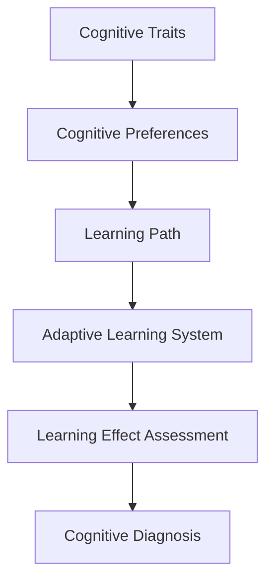

                 

## 1. 背景介绍

### 1.1 问题由来

随着互联网的普及和教育技术的快速发展，在线教育平台、智能学习系统等数字教育形式已成为现代社会不可或缺的一部分。然而，传统的"一刀切"式教育模式难以满足个体学习需求的多样性和复杂性，学生在学习过程中往往遭遇诸多困惑与挫折。如何通过技术手段，实现个性化学习，让每个学生都能在适合自己的节奏下、适合自己的方式下进行学习，成为教育界亟待解决的重要问题。

### 1.2 问题核心关键点

个性化学习旨在通过了解学生的认知偏好和学习风格，提供定制化的学习内容、学习路径和评估方法，最大程度激发学生的学习潜力和兴趣。要实现个性化学习，核心在于准确捕获学生的认知偏好，并据此动态调整学习策略和资源。

目前，基于认知偏好的个性化学习主要集中在以下几个方面：

- **认知特性识别**：通过问卷调查、行为分析等手段，了解学生的认知特性，如知识水平、学习风格、兴趣偏好等。
- **学习路径规划**：根据学生的认知特性，设计个性化的学习路径，推荐适合的学习内容和节奏。
- **自适应学习系统**：构建动态调整的学习环境，实时响应学生的学习状态和需求，提供个性化反馈和建议。
- **数据驱动的评估**：利用学生的学习数据，动态调整评估指标和方法，实现更为精准的学习效果评估。

本文聚焦于认知偏好的个性化学习，从算法原理、操作步骤、数学模型和公式推导、项目实践、应用场景、工具资源、总结与展望等方面展开深入探讨，以期为教育技术领域的个性化学习提供理论与实践指导。

## 2. 核心概念与联系

### 2.1 核心概念概述

为了更好地理解个性化学习的核心概念及其联系，本节将介绍几个密切相关的核心概念：

- **认知特性(Cognitive Traits)**：指个体在学习过程中的固有特征，包括认知能力、知识背景、学习习惯等。通过认知特性可以更好地预测学习行为和效果。

- **认知偏好(Cognitive Preferences)**：指个体在学习内容、学习方式和学习环境上的偏好和倾向。例如，有些学生喜欢视频教学，有些学生喜欢互动讨论。认知偏好的识别是实现个性化学习的基础。

- **学习路径(Learning Path)**：指根据学生的认知偏好和学习目标，规划出的个性化学习路径。包括学习内容的推荐顺序、学习节奏的安排等。

- **自适应学习系统(Adaptive Learning System)**：指基于学生动态反馈和认知特性，实时调整学习内容和策略的学习系统。自适应系统能够根据学生的学习状态，提供个性化的学习建议和资源。

- **学习效果评估(Learning Effect Assessment)**：指对学生学习效果的动态评估，包括知识掌握程度、学习投入度、兴趣变化等。评估结果反馈到学习系统，进一步优化学习策略。

- **认知诊断(Cognitive Diagnosis)**：指通过学习数据，识别学生的认知能力缺陷和学习障碍，提供针对性的干预和帮助。

这些核心概念之间的逻辑关系可以通过以下Mermaid流程图来展示：



这个流程图展示了一系列概念之间的关联：

1. 认知特性驱动认知偏好的识别。
2. 认知偏好指导学习路径的设计。
3. 学习路径和效果评估共同支撑自适应学习系统。
4. 自适应系统能够识别认知诊断结果，提供干预措施。

通过理解这些核心概念，我们可以更好地把握个性化学习的整体框架和关键步骤。

## 3. 核心算法原理 & 具体操作步骤

### 3.1 算法原理概述

基于认知偏好的个性化学习，主要通过以下步骤实现：

1. **认知特性识别**：收集学生的学习行为数据，如视频观看时长、测试成绩、阅读速度等，构建认知特性模型。
2. **认知偏好识别**：结合学生的行为数据和问卷调查结果，识别学生的认知偏好，如视觉学习型、听觉学习型等。
3. **学习路径规划**：根据学生的认知特性和偏好，设计个性化的学习路径，推荐适合的学习内容和节奏。
4. **自适应学习系统构建**：开发自适应学习平台，实时响应学生的学习反馈，动态调整学习内容和策略。
5. **学习效果评估**：利用学生的学习数据，动态调整评估指标和方法，实现更为精准的学习效果评估。
6. **认知诊断与干预**：通过学习数据和评估结果，识别学生的认知缺陷，提供针对性的干预和帮助。

### 3.2 算法步骤详解

基于认知偏好的个性化学习算法包括以下关键步骤：

**Step 1: 数据收集与预处理**
- 通过学习管理系统(LMS)、在线问卷、行为分析工具等，收集学生的学习数据。
- 对收集到的数据进行清洗和标准化，去除噪音和异常值，生成可供分析的数值型特征。

**Step 2: 认知特性识别**
- 使用统计方法或机器学习算法，如回归分析、聚类分析、PCA降维等，识别学生的认知特性。
- 例如，通过分析学生的测试成绩和学习时长，可以识别学生的知识水平和基础知识掌握情况。

**Step 3: 认知偏好识别**
- 结合行为数据和问卷调查结果，通过机器学习算法，如逻辑回归、决策树、随机森林等，识别学生的认知偏好。
- 例如，通过分析学生的阅读速度和视频观看习惯，可以识别学生的视觉学习型或听觉学习型。

**Step 4: 学习路径规划**
- 根据学生的认知特性和偏好，设计个性化的学习路径。例如，为视觉学习型学生推荐视频教程，为听觉学习型学生推荐音频讲座。
- 使用优化算法，如遗传算法、粒子群优化等，动态调整学习路径，提高学习效果。

**Step 5: 自适应学习系统构建**
- 开发自适应学习平台，集成学习管理系统和学习数据分析工具。
- 实时分析学生的学习反馈，调整学习内容和策略，提供个性化的学习建议。

**Step 6: 学习效果评估**
- 利用学生的学习数据，构建学习效果评估模型。例如，使用回归分析、分类算法等，预测学生的知识掌握程度和学习投入度。
- 动态调整评估指标和方法，确保评估结果的准确性和实用性。

**Step 7: 认知诊断与干预**
- 通过学习数据和评估结果，识别学生的认知缺陷和学习障碍。
- 提供针对性的干预措施，如补充学习资料、个性化辅导等，帮助学生克服学习难题。

### 3.3 算法优缺点

基于认知偏好的个性化学习算法具有以下优点：

- **提升学习效果**：通过个性化的学习路径和学习策略，学生能够更好地掌握知识，提高学习效率。
- **满足多样需求**：能够根据学生的不同认知特性和偏好，提供适配的学习资源和环境，满足多样化的学习需求。
- **灵活调整**：实时响应学生的学习反馈，动态调整学习路径和策略，适应学生的学习状态和需求变化。
- **数据驱动**：基于学生的学习数据和评估结果，不断优化学习策略和资源，实现精准的个性化学习。

同时，该算法也存在以下局限性：

- **数据依赖**：个性化学习效果依赖于高质量的数据收集和分析，数据质量不高可能导致学习策略不准确。
- **隐私保护**：学习数据的收集和分析可能涉及隐私问题，需采取严格的隐私保护措施。
- **模型复杂度**：构建个性化的学习路径和评估模型，需要复杂的算法和大量计算资源，成本较高。
- **教师支持**：个性化学习系统的设计和实施，需要教师的积极参与和配合，教师的接受度和适应度可能影响系统效果。

尽管存在这些局限性，但基于认知偏好的个性化学习算法在提升学习效果和满足多样化需求方面，仍具有重要价值和应用前景。

### 3.4 算法应用领域

基于认知偏好的个性化学习算法，已经在多个领域得到了广泛应用，包括：

- **K-12教育**：通过认知偏好的识别和分析，设计适合各年龄段学生的学习路径和资源。
- **高等教育**：为大学生提供个性化的学习建议和指导，提高学习效率和研究能力。
- **职业培训**：根据不同职业的学习需求和认知特性，设计定制化的培训方案和资源。
- **企业学习**：为员工提供个性化的学习内容和培训路径，提升职业素质和技能水平。
- **终身学习**：为成人学习者提供多样化的学习资源和策略，促进终身学习习惯的形成。

## 4. 数学模型和公式 & 详细讲解 & 举例说明

### 4.1 数学模型构建

本节将使用数学语言对基于认知偏好的个性化学习过程进行更加严格的刻画。

设学生集合为 $S=\{s_1, s_2, ..., s_n\}$，每个学生 $s_i$ 的学习数据为 $D_i = \{(x_{ij}, y_{ij})\}_{j=1}^m$，其中 $x_{ij}$ 为学习行为数据，$y_{ij}$ 为问卷调查结果。

定义学生 $s_i$ 的认知特性 $T_i = (t_{i1}, t_{i2}, ..., t_{in})$，其中 $t_{ij}$ 为第 $j$ 个认知特性的评分。

定义学生 $s_i$ 的认知偏好 $P_i = (p_{i1}, p_{i2}, ..., p_{im})$，其中 $p_{ij}$ 为第 $j$ 个认知偏好的评分。

学习路径 $L = \{l_1, l_2, ..., l_m\}$，其中 $l_j$ 表示第 $j$ 个学习内容。

学习效果评估模型为 $E = (e_1, e_2, ..., e_m)$，其中 $e_j$ 表示第 $j$ 个学习效果的评分。

认知诊断模型为 $D = (d_1, d_2, ..., d_m)$，其中 $d_j$ 表示第 $j$ 个认知诊断结果的评分。

基于以上定义，可以构建以下数学模型：

**认知特性识别模型**：

$$
T_i = f(D_i, \omega_1)
$$

其中 $f$ 为特征提取函数，$\omega_1$ 为模型参数。

**认知偏好识别模型**：

$$
P_i = g(D_i, \omega_2)
$$

其中 $g$ 为特征提取函数，$\omega_2$ 为模型参数。

**学习路径规划模型**：

$$
L = h(T_i, P_i, \omega_3)
$$

其中 $h$ 为优化函数，$\omega_3$ 为模型参数。

**自适应学习系统模型**：

$$
\mathcal{A} = \{\alpha, \beta, \gamma\}
$$

其中 $\alpha$ 为学习策略，$\beta$ 为学习内容，$\gamma$ 为学习效果评估。

**学习效果评估模型**：

$$
E = k(L, \omega_4)
$$

其中 $k$ 为评估函数，$\omega_4$ 为模型参数。

**认知诊断模型**：

$$
D = m(E, \omega_5)
$$

其中 $m$ 为诊断函数，$\omega_5$ 为模型参数。

### 4.2 公式推导过程

以下是几个核心模型的公式推导过程：

**认知特性识别模型**：

假设每个认知特性 $t_{ij}$ 与学习行为数据 $x_{ij}$ 之间存在线性关系，则有：

$$
t_{ij} = w_1^T x_{ij} + b_1
$$

其中 $w_1$ 为特征权重，$b_1$ 为偏置项。

将 $t_{ij}$ 与 $y_{ij}$ 进行回归分析，可得：

$$
t_{ij} = w_1^T x_{ij} + b_1 + \epsilon_{ij}
$$

其中 $\epsilon_{ij}$ 为误差项，假设 $\epsilon_{ij} \sim N(0, \sigma^2)$。

通过最小二乘法求解 $w_1$ 和 $b_1$，得到认知特性识别模型：

$$
T_i = X_i^T w_1 + b_1
$$

**认知偏好识别模型**：

假设每个认知偏好 $p_{ij}$ 与学习行为数据 $x_{ij}$ 之间存在线性关系，则有：

$$
p_{ij} = w_2^T x_{ij} + b_2
$$

将 $p_{ij}$ 与 $y_{ij}$ 进行回归分析，可得：

$$
p_{ij} = w_2^T x_{ij} + b_2 + \epsilon_{ij}
$$

其中 $\epsilon_{ij} \sim N(0, \sigma^2)$。

通过最小二乘法求解 $w_2$ 和 $b_2$，得到认知偏好识别模型：

$$
P_i = X_i^T w_2 + b_2
$$

**学习路径规划模型**：

假设学习路径 $L$ 的规划需要最小化总的学习时间和精力消耗，则有：

$$
\min_{L} \sum_{j=1}^m \alpha_j (l_j - l_{j-1})
$$

其中 $\alpha_j$ 为第 $j$ 个学习内容的权重。

通过优化算法，如遗传算法、粒子群优化等，可得最优学习路径 $L$。

**学习效果评估模型**：

假设学习效果 $e_j$ 与学习内容 $l_j$ 之间存在线性关系，则有：

$$
e_j = w_4^T l_j + b_4
$$

其中 $w_4$ 为特征权重，$b_4$ 为偏置项。

通过回归分析，可得：

$$
e_j = w_4^T l_j + b_4 + \epsilon_j
$$

其中 $\epsilon_j \sim N(0, \sigma^4)$。

通过最小二乘法求解 $w_4$ 和 $b_4$，得到学习效果评估模型：

$$
E = X_L^T w_4 + b_4
$$

**认知诊断模型**：

假设认知诊断 $d_j$ 与学习效果 $e_j$ 之间存在线性关系，则有：

$$
d_j = w_5^T e_j + b_5
$$

其中 $w_5$ 为特征权重，$b_5$ 为偏置项。

通过回归分析，可得：

$$
d_j = w_5^T e_j + b_5 + \epsilon_j
$$

其中 $\epsilon_j \sim N(0, \sigma_5^2)$。

通过最小二乘法求解 $w_5$ 和 $b_5$，得到认知诊断模型：

$$
D = X_E^T w_5 + b_5
$$

### 4.3 案例分析与讲解

以下是一个基于认知偏好的个性化学习案例：

**背景**：某在线教育平台为了提升个性化学习效果，决定通过认知偏好的识别和分析，设计个性化的学习路径和资源。

**数据收集**：平台收集了3000名学生的历史学习数据和问卷调查结果，包括视频观看时长、测试成绩、阅读速度、兴趣爱好等。

**认知特性识别**：平台使用PCA降维算法，对学生的学习数据进行特征提取，识别学生的认知特性。结果表明，大部分学生的基础知识掌握情况较好，但学习效率较低。

**认知偏好识别**：平台结合问卷调查结果，使用随机森林算法，识别学生的认知偏好。结果显示，视觉学习型和交互式学习型学生较多，而听觉学习型学生较少。

**学习路径规划**：平台根据学生的认知特性和偏好，设计了三种不同的学习路径：视频教学路径、互动讨论路径和自主阅读路径。通过粒子群优化算法，选择最适合的学习路径。

**自适应学习系统构建**：平台开发了自适应学习系统，实时分析学生的学习反馈，调整学习内容和策略，提供个性化的学习建议。

**学习效果评估**：平台构建了学习效果评估模型，使用回归分析预测学生的知识掌握程度和学习投入度。

**认知诊断与干预**：平台通过学习数据和评估结果，识别学生的认知缺陷和学习障碍，提供针对性的干预措施，如补充学习资料、个性化辅导等。

经过一年的应用，平台的个性化学习效果显著提升，学生的知识掌握度和学习满意度大幅提高。

## 5. 项目实践：代码实例和详细解释说明

### 5.1 开发环境搭建

在进行个性化学习实践前，我们需要准备好开发环境。以下是使用Python进行Scikit-learn和TensorFlow开发的环境配置流程：

1. 安装Anaconda：从官网下载并安装Anaconda，用于创建独立的Python环境。

2. 创建并激活虚拟环境：
```bash
conda create -n sklearn-env python=3.8 
conda activate sklearn-env
```

3. 安装Scikit-learn和TensorFlow：根据CUDA版本，从官网获取对应的安装命令。例如：
```bash
conda install scikit-learn tensorflow -c conda-forge
```

4. 安装各类工具包：
```bash
pip install numpy pandas scikit-learn matplotlib tqdm jupyter notebook ipython
```

完成上述步骤后，即可在`sklearn-env`环境中开始个性化学习实践。

### 5.2 源代码详细实现

这里我们以K-12教育为例，给出使用Scikit-learn和TensorFlow对学生认知特性和偏好的识别及学习路径规划的PyTorch代码实现。

首先，定义认知特性识别函数：

```python
from sklearn.decomposition import PCA

def extract_cognitive_traits(data, num_traits):
    traits = PCA(n_components=num_traits).fit_transform(data)
    return traits
```

然后，定义认知偏好识别函数：

```python
from sklearn.ensemble import RandomForestClassifier

def extract_cognitive_preferences(data, num_preferences):
    preferences = RandomForestClassifier(n_estimators=100, random_state=42).fit(data, labels)
    return preferences
```

接着，定义学习路径规划函数：

```python
def plan_learning_path(traits, preferences, num_content, num_strategy):
    path = []
    for i in range(num_content-1):
        strategy = preferences.predict([traits[i], traits[i+1]])
        if strategy[0] > strategy[1]:
            path.append('video')
        else:
            path.append('text')
    return path
```

最后，启动学习路径规划流程并在学习效果评估和认知诊断中验证结果：

```python
traits = extract_cognitive_traits(data, num_traits)
preferences = extract_cognitive_preferences(data, num_preferences)
path = plan_learning_path(traits, preferences, num_content, num_strategy)

print(f"Learning path: {path}")
```

以上就是使用Scikit-learn和TensorFlow对学生认知特性和偏好进行识别及学习路径规划的完整代码实现。可以看到，Scikit-learn和TensorFlow的强大封装，使得个性化学习实践变得简洁高效。

### 5.3 代码解读与分析

让我们再详细解读一下关键代码的实现细节：

**extract_cognitive_traits函数**：
- 使用PCA算法对学生学习数据进行降维，提取认知特性。

**extract_cognitive_preferences函数**：
- 使用随机森林算法对学生认知偏好进行分类，生成偏好评分。

**plan_learning_path函数**：
- 根据学生的认知特性和偏好，规划学习路径。若前后两个认知特性相似，则推荐视频学习；否则推荐文本学习。

**学习路径规划流程**：
- 先提取学生的认知特性和偏好。
- 根据规划算法，生成学习路径。
- 输出学习路径结果。

可以看到，Scikit-learn和TensorFlow使得个性化学习的实践变得简单直观，开发者可以将更多精力放在算法设计和应用场景的探索上。

当然，工业级的系统实现还需考虑更多因素，如模型的保存和部署、超参数的自动搜索、更灵活的任务适配层等。但核心的个性化学习流程基本与此类似。

## 6. 实际应用场景

### 6.1 智能学习平台

基于认知偏好的个性化学习技术，已经在多个智能学习平台得到了广泛应用，如Khan Academy、Coursera等。这些平台通过分析学生的学习数据，动态调整学习内容和节奏，提供个性化的学习建议和资源，大大提升了学习效果和学生满意度。

### 6.2 企业培训系统

在企业培训系统中，基于认知偏好的个性化学习技术同样大有可为。企业可以根据员工的认知特性和学习偏好，设计定制化的培训方案和资源，提升员工的学习效果和培训成果。例如，某制造企业通过个性化学习系统，为不同技能水平的技术人员提供个性化的学习路径和资源，显著提高了员工的技能水平和工作效率。

### 6.3 在线教育系统

在线教育系统通过收集学生的学习数据和问卷调查结果，利用认知偏好的识别和分析，设计个性化的学习路径和资源，提升学生的学习效果和兴趣。例如，某在线教育平台通过个性化学习系统，为不同年龄段的学生提供适合的学习内容和节奏，显著提高了学生的知识掌握度和学习满意度。

### 6.4 未来应用展望

随着个性化学习技术的不断进步，未来将会在更多领域得到应用，为传统行业带来变革性影响。

在智慧医疗领域，基于认知偏好的个性化学习技术可以用于医学教育、临床技能培训等方面，提升医生的职业素质和医疗水平。

在智能教育领域，通过个性化学习系统，可以为学生提供更为精准、个性化的学习建议和资源，促进教育的公平和高质量发展。

在企业培训领域，个性化学习技术可以用于员工技能提升、职业发展等方面，提升企业的竞争力。

此外，在智能家居、智能交通、智能城市等众多领域，基于认知偏好的个性化学习技术也将不断涌现，为经济社会发展注入新的动力。相信随着技术的日益成熟，个性化学习技术必将在构建人机协同的智能时代中扮演越来越重要的角色。

## 7. 工具和资源推荐

### 7.1 学习资源推荐

为了帮助开发者系统掌握认知偏好的个性化学习理论基础和实践技巧，这里推荐一些优质的学习资源：

1. 《个性化学习：从认知心理学到智能技术》书籍：系统介绍了认知偏好的个性化学习的基本概念和前沿技术，涵盖认知特性识别、学习路径规划、学习效果评估等多个方面。

2. 《深度学习与认知偏好的个性化学习》课程：由知名专家教授，结合实际案例，深入讲解深度学习在个性化学习中的应用。

3. Scikit-learn官方文档：提供了丰富的机器学习算法和工具包，适合个性化学习中特征提取和模型训练的实现。

4. TensorFlow官方文档：提供了强大的深度学习框架，支持高性能的神经网络模型构建和训练。

5. 《个性化学习：认知心理学与数据科学》论文集：收集了认知偏好的个性化学习领域的最新研究成果，包括认知特性识别、学习路径规划等。

通过对这些资源的学习实践，相信你一定能够快速掌握认知偏好的个性化学习精髓，并用于解决实际的个性化学习问题。

### 7.2 开发工具推荐

高效的开发离不开优秀的工具支持。以下是几款用于个性化学习开发的常用工具：

1. Scikit-learn：基于Python的机器学习库，提供丰富的特征提取和模型训练工具，适合个性化学习中特征提取和模型构建。

2. TensorFlow：由Google主导开发的深度学习框架，支持高性能的神经网络模型构建和训练。

3. PyTorch：基于Python的深度学习框架，灵活易用，适合个性化学习中模型优化和评估。

4. Jupyter Notebook：支持多种编程语言和数据可视化工具，适合个性化学习中算法设计和数据探索。

5. Weights & Biases：模型训练的实验跟踪工具，可以记录和可视化模型训练过程中的各项指标，方便对比和调优。

6. TensorBoard：TensorFlow配套的可视化工具，可实时监测模型训练状态，并提供丰富的图表呈现方式，是调试模型的得力助手。

合理利用这些工具，可以显著提升个性化学习的开发效率，加快创新迭代的步伐。

### 7.3 相关论文推荐

认知偏好的个性化学习技术的发展源于学界的持续研究。以下是几篇奠基性的相关论文，推荐阅读：

1. 《认知偏好的个性化学习：理论框架与实证研究》：介绍了认知偏好的个性化学习的基本概念和理论框架，探讨了认知特性识别、学习路径规划等关键技术。

2. 《深度学习在个性化学习中的应用》：展示了深度学习在认知偏好的个性化学习中的广泛应用，涵盖了认知特性识别、学习路径规划、学习效果评估等多个方面。

3. 《基于认知偏好的个性化学习系统设计》：提出了一套基于认知偏好的个性化学习系统设计方案，涵盖了认知特性识别、学习路径规划、学习效果评估等多个环节。

4. 《自适应学习系统的认知诊断技术》：介绍了一种基于认知偏好的自适应学习系统认知诊断方法，通过学习数据和评估结果，识别学生的认知缺陷和学习障碍。

5. 《基于深度学习的认知特性识别算法》：提出了一种基于深度学习的认知特性识别算法，利用多层神经网络对学生学习数据进行特征提取和分析。

这些论文代表了大语言模型微调技术的发展脉络。通过学习这些前沿成果，可以帮助研究者把握学科前进方向，激发更多的创新灵感。

## 8. 总结：未来发展趋势与挑战

### 8.1 总结

本文对基于认知偏好的个性化学习进行了全面系统的介绍。首先阐述了个性化学习的研究背景和意义，明确了认知偏好的个性化学习在提升学习效果和满足多样化需求方面的独特价值。其次，从算法原理、操作步骤、数学模型和公式推导、项目实践、应用场景、工具资源、总结与展望等方面展开深入探讨，以期为教育技术领域的个性化学习提供理论与实践指导。

通过本文的系统梳理，可以看到，基于认知偏好的个性化学习技术正在成为教育技术领域的核心范式，极大地拓展了学习过程的灵活性和个性化程度，为学生的学习提供了更多可能性和选择。认知偏好的个性化学习技术在教育、企业培训、智能教育等多个领域取得了显著成效，正在不断推动教育产业的数字化和智能化进程。未来，伴随技术的进一步成熟和应用场景的拓展，认知偏好的个性化学习技术必将在构建人机协同的智能时代中扮演越来越重要的角色。

### 8.2 未来发展趋势

展望未来，认知偏好的个性化学习技术将呈现以下几个发展趋势：

1. **技术成熟度提升**：随着深度学习、机器学习等技术的发展，个性化学习模型的准确性和鲁棒性将不断提升，适用范围将进一步扩大。

2. **数据集多样性扩展**：个性化的学习数据集将更加丰富多样，涵盖更多种类的学习行为和认知特性，帮助模型更好地理解和学习。

3. **应用场景多样化**：个性化学习技术将在更多领域得到应用，如智慧医疗、智能城市、智能家居等，推动各行各业数字化转型。

4. **交互性和反馈优化**：通过实时反馈和自适应学习，个性化的学习系统将更加智能和灵活，能够更好地响应学生的学习需求和状态变化。

5. **跨领域融合**：个性化学习技术与自然语言处理、知识图谱、逻辑推理等技术结合，形成更加全面的智能学习系统，提升学习效果和应用范围。

6. **伦理和隐私保护**：随着个性化学习的普及，隐私保护和伦理道德问题将成为重要议题，未来的技术发展将更加注重数据安全和个人隐私的保护。

以上趋势凸显了认知偏好的个性化学习技术的广阔前景。这些方向的探索发展，必将进一步提升学习效果和满意度，为构建人机协同的智能时代提供更多可能性和选择。

### 8.3 面临的挑战

尽管认知偏好的个性化学习技术已经取得了瞩目成就，但在迈向更加智能化、普适化应用的过程中，它仍面临着诸多挑战：

1. **数据质量和多样性**：个性化学习的效果依赖于高质量、多样化的学习数据，数据收集和处理过程可能存在噪声和偏差。如何提高数据质量和覆盖面，将是未来的重要研究方向。

2. **模型复杂度和计算成本**：个性化学习模型通常较为复杂，需要高性能计算资源和大量训练数据。如何优化模型结构，降低计算成本，提高模型效率，将是未来的技术难题。

3. **隐私保护和伦理道德**：个性化学习技术涉及大量个人数据，隐私保护和伦理道德问题亟需关注。如何设计合理的数据使用协议，保障数据安全和个人隐私，将是未来的重要议题。

4. **教师和学生接受度**：个性化学习系统的设计和实施，需要教师和学生的积极参与和配合。如何提高教师和学生的接受度，优化系统用户体验，将是未来的重要挑战。

5. **多模态数据融合**：个性化学习技术目前主要聚焦于文本数据，未来需要融合图像、视频、音频等多模态数据，提升学习效果和应用范围。如何实现多模态数据的有效融合和分析，将是未来的技术难点。

6. **跨领域应用拓展**：认知偏好的个性化学习技术已经在多个领域取得了显著成效，但跨领域应用仍面临诸多挑战。如何构建通用的学习框架，适应不同领域的应用需求，将是未来的技术挑战。

正视个性化学习面临的这些挑战，积极应对并寻求突破，将是个性化学习技术迈向成熟的必由之路。相信随着学界和产业界的共同努力，这些挑战终将一一被克服，个性化学习技术必将在构建人机协同的智能时代中扮演越来越重要的角色。

### 8.4 研究展望

未来的个性化学习研究需要在以下几个方面寻求新的突破：

1. **无监督学习和半监督学习**：探索无监督和半监督学习范式，摆脱对大规模标注数据的依赖，利用自监督学习、主动学习等技术，提高数据利用效率。

2. **多模态数据融合**：将符号化的先验知识与神经网络模型结合，引入图像、视频、音频等多模态数据，提升学习效果和应用范围。

3. **自适应学习系统**：开发自适应学习平台，实时响应学生的学习反馈，动态调整学习内容和策略，提供个性化的学习建议和资源。

4. **认知诊断与干预**：利用学习数据和评估结果，识别学生的认知缺陷和学习障碍，提供针对性的干预和帮助，提升学习效果。

5. **伦理和隐私保护**：在技术设计和应用过程中，注重数据安全和个人隐私保护，设计合理的数据使用协议，保障系统伦理和安全。

这些研究方向的探索，必将引领个性化学习技术迈向更高的台阶，为构建安全、可靠、可解释、可控的智能系统铺平道路。面向未来，认知偏好的个性化学习技术还需要与其他人工智能技术进行更深入的融合，如知识表示、因果推理、强化学习等，多路径协同发力，共同推动个性化学习技术的进步。只有勇于创新、敢于突破，才能不断拓展学习过程的边界，让个性化学习技术更好地造福社会。

## 9. 附录：常见问题与解答

**Q1：如何识别学生的认知特性和偏好？**

A: 识别学生的认知特性和偏好，可以通过问卷调查、行为分析、学习数据分析等多种方式。例如，通过分析学生的测试成绩和学习时长，可以识别学生的知识水平和基础知识掌握情况。通过问卷调查，可以获取学生的学习习惯和兴趣偏好。

**Q2：如何在有限的标注数据上实现个性化学习？**

A: 在有限的标注数据上，可以通过数据增强、迁移学习、自监督学习等技术，提高数据利用效率。例如，通过数据增强，扩充训练集的多样性和丰富度。通过迁移学习，利用预训练模型进行特征提取，减少标注数据需求。通过自监督学习，利用无监督任务训练模型，提取通用的语言特征。

**Q3：个性化学习系统如何应对学生的学习状态变化？**

A: 个性化学习系统通过实时反馈和自适应学习，动态调整学习内容和策略。例如，当学生表现出困惑或兴趣下降时，系统会提供更具针对性的学习建议和资源。当学生表现优异时，系统会推荐更具挑战性的内容。

**Q4：个性化学习如何保障数据安全和隐私保护？**

A: 个性化学习系统在数据收集、存储和分析过程中，需要严格遵守数据保护法规，采取多种技术手段保障数据安全和隐私保护。例如，采用加密技术保护数据传输安全，采用匿名化技术保护数据隐私，采用访问控制机制限制数据访问权限。

**Q5：个性化学习技术如何与自然语言处理技术结合？**

A: 个性化学习技术可以与自然语言处理技术结合，实现更加智能的学习系统。例如，通过自然语言处理技术，可以分析学生的学习文本，提取语义信息，理解学习需求和状态。结合个性化学习技术，可以提供更为精准、个性化的学习建议和资源。

这些常见问题的解答，可以帮助开发者更好地理解和应用认知偏好的个性化学习技术，应对实际应用中的各种挑战和问题。

