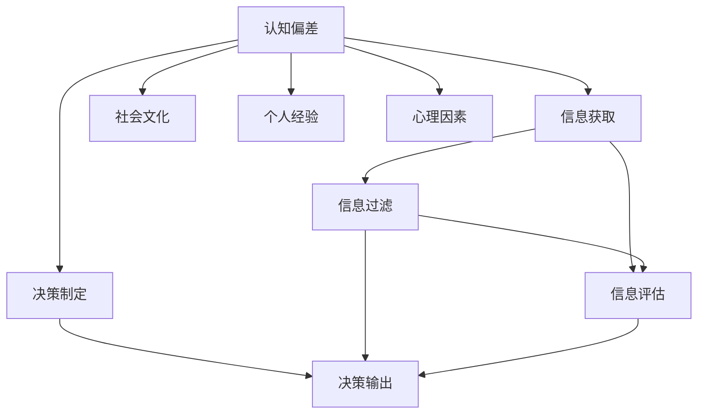

                 

# 认知偏差：影响人类理解力的隐形屏障

> 关键词：认知偏差, 认知偏见, 人类理解力, 人工智能, 深度学习, 神经网络

## 1. 背景介绍

在当今信息爆炸的时代，人类面临的最大挑战之一是如何在海量数据中找到有价值的信息，并正确理解和应用这些信息。认知偏差作为一种心理现象，深深影响着人类的决策过程和信息处理能力。本文将深入探讨认知偏差的概念及其对人类理解力的影响，并探索如何通过人工智能技术克服这些偏见，从而提高人类信息处理的效率和准确性。

### 1.1 问题由来

认知偏差是指在信息处理和决策过程中，由于心理因素、社会文化、个人经验等因素导致的判断和行为偏离真实情况的现象。这些偏差往往是无意识的，但在信息获取、决策制定等过程中扮演着重要角色，有时甚至会导致错误的判断和决策。例如，确认偏误（Confirmation Bias）导致人们倾向于关注支持自己已有观点的信息，而忽视或贬低相反的证据；而基础率忽视（Base Rate Neglect）则表明人们在面对复杂情境时，往往过于依赖新信息，而忽视已有统计概率。

随着信息技术的进步，人类处理信息的效率不断提高，但认知偏差的影响并未随之减少。在新闻、社交媒体、商业决策等领域，认知偏差仍然普遍存在，有时甚至引发严重的社会和经济问题。因此，了解认知偏差，并采取有效措施加以克服，是提高人类信息处理能力和决策质量的关键。

### 1.2 问题核心关键点
本文将从以下几个方面深入探讨认知偏差及其对人类理解力的影响：

- **认知偏差的类型及其心理机制**
- **认知偏差在信息获取、决策制定中的应用表现**
- **认知偏差的检测与纠正方法**
- **人工智能技术在克服认知偏差方面的潜力**

通过系统地分析认知偏差及其应用，本文旨在揭示其对人类信息处理和决策过程的深层影响，并探讨如何利用人工智能技术构建更可靠、更高效的信息处理系统，以减少认知偏差的影响。

## 2. 核心概念与联系

### 2.1 核心概念概述

认知偏差指的是在信息处理和决策过程中，由于心理因素、社会文化、个人经验等因素导致的判断和行为偏离真实情况的现象。这些偏差往往是无意识的，但在信息获取、决策制定等过程中扮演着重要角色，有时甚至会导致错误的判断和决策。

### 2.2 核心概念原理和架构的 Mermaid 流程图


这个流程图展示了认知偏差在信息获取和决策制定中的作用机制。从认知偏差出发，信息获取过程中，个体可能会受到社会文化、个人经验和心理因素的影响，导致对信息的过滤和评估产生偏差。这些偏差进一步影响决策输出，可能产生错误的判断和决策。

## 3. 核心算法原理 & 具体操作步骤

### 3.1 算法原理概述

为了克服认知偏差，需要构建一种能够自动检测和纠正这些偏差的信息处理系统。本文将介绍一种基于人工智能的认知偏差检测与纠正算法，该算法通过分析信息获取和决策制定的过程，自动检测认知偏差，并提出相应的纠正措施。

### 3.2 算法步骤详解

#### 3.2.1 数据收集与预处理
首先，从不同的数据源收集大量的信息，并进行预处理，包括去除噪声、归一化等操作。

#### 3.2.2 特征提取与表示
使用深度学习模型（如卷积神经网络CNN、循环神经网络RNN等）提取信息的特征，并将其转换为向量表示。

#### 3.2.3 认知偏差检测
通过设计合适的指标和模型，自动检测认知偏差。例如，使用分类器识别确认偏误，或使用回归模型评估基础率忽视程度。

#### 3.2.4 纠正措施
根据认知偏差检测结果，提出相应的纠正措施。例如，增加与已有观点相反的信息，或调整决策模型以考虑已有统计概率。

#### 3.2.5 模型评估与优化
使用测试数据集评估模型性能，并根据评估结果对模型进行优化，以提高检测和纠正认知偏差的准确性。

### 3.3 算法优缺点

#### 3.3.1 优点
- **自动化检测**：算法能够自动检测和纠正认知偏差，减少人工干预和错误。
- **多数据源整合**：能够处理来自不同数据源的信息，提高系统的鲁棒性。
- **可扩展性**：算法模型可以扩展到各种领域，应用范围广。

#### 3.3.2 缺点
- **数据依赖**：算法的性能依赖于数据质量，需要高质量、多样化的数据。
- **模型复杂性**：设计合适的指标和模型，需要大量经验和专业知识。
- **计算资源需求高**：深度学习模型需要大量的计算资源和存储空间，有时甚至难以在现有硬件设备上运行。

### 3.4 算法应用领域

该算法可以在多个领域应用，包括但不限于：

- **新闻推荐系统**：通过检测和纠正认知偏差，提供更加客观、公正的新闻推荐。
- **金融投资决策**：分析投资者的认知偏差，提供更客观的投资建议。
- **市场营销**：理解消费者的认知偏差，优化广告和营销策略。
- **医疗诊断**：帮助医生识别和纠正认知偏差，提高诊断准确性。
- **人力资源管理**：识别和纠正招聘过程中的认知偏差，提高公平性和效率。

## 4. 数学模型和公式 & 详细讲解 & 举例说明

### 4.1 数学模型构建

为了检测认知偏差，我们需要设计一个基于深度学习的多层感知器模型，其结构如图1所示。该模型由输入层、隐藏层和输出层组成。输入层用于接收原始信息，隐藏层用于提取特征，输出层用于生成偏差检测结果。


### 4.2 公式推导过程

设输入信息为 $x$，输出为 $y$，认知偏差检测模型为 $f(x; \theta)$。模型的训练目标是最小化损失函数：

$$
L(\theta) = \frac{1}{N}\sum_{i=1}^N \ell(f(x_i; \theta), y_i)
$$

其中 $\ell$ 为损失函数，例如均方误差或交叉熵。使用梯度下降等优化算法更新模型参数 $\theta$，以最小化损失函数。

### 4.3 案例分析与讲解

以新闻推荐系统为例，假设用户对某一类新闻的认知偏差为 $b$。通过对大量用户行为数据进行预处理和特征提取，我们得到用户对新闻的兴趣向量 $x$ 和认知偏差向量 $b$。将这些向量输入模型 $f(x; \theta)$，输出认知偏差检测结果 $f(x; \theta)$。根据检测结果，我们可以调整推荐算法，减少用户认知偏差对新闻推荐的影响。

## 5. 项目实践：代码实例和详细解释说明

### 5.1 开发环境搭建

为了进行认知偏差检测与纠正的实践，我们需要搭建一个Python开发环境，并准备所需的数据集和模型库。

#### 5.1.1 环境搭建

1. 安装Python和相关依赖库：
   ```bash
   pip install tensorflow numpy scikit-learn pandas
   ```

2. 搭建深度学习环境：
   ```bash
   pip install tensorflow-gpu
   ```

3. 准备数据集：
   假设我们有一个包含用户行为数据的数据集，包括新闻阅读次数、用户兴趣标签等。

### 5.2 源代码详细实现

以下是一个基于TensorFlow的认知偏差检测与纠正代码实现：

```python
import tensorflow as tf
import numpy as np

# 定义模型结构
class CognitiveBiasDetection(tf.keras.Model):
    def __init__(self, input_size, hidden_size, output_size):
        super(CognitiveBiasDetection, self).__init__()
        self.dense1 = tf.keras.layers.Dense(hidden_size, activation='relu')
        self.dense2 = tf.keras.layers.Dense(output_size)

    def call(self, x):
        x = self.dense1(x)
        x = self.dense2(x)
        return x

# 定义损失函数和优化器
def loss_function(y_true, y_pred):
    return tf.reduce_mean(tf.square(y_true - y_pred))

optimizer = tf.keras.optimizers.Adam(learning_rate=0.001)

# 准备数据
train_data = np.random.rand(1000, input_size)
train_labels = np.random.rand(1000, output_size)

# 创建模型
model = CognitiveBiasDetection(input_size, hidden_size, output_size)

# 训练模型
for epoch in range(100):
    with tf.GradientTape() as tape:
        predictions = model(train_data)
        loss = loss_function(train_labels, predictions)
    gradients = tape.gradient(loss, model.trainable_variables)
    optimizer.apply_gradients(zip(gradients, model.trainable_variables))

# 测试模型
test_data = np.random.rand(100, input_size)
test_labels = np.random.rand(100, output_size)
predictions = model(test_data)
print(tf.reduce_mean(tf.square(test_labels - predictions)))
```

### 5.3 代码解读与分析

该代码实现了一个简单的多层感知器模型，用于检测认知偏差。其中，`CognitiveBiasDetection`类定义了模型的结构，包括两个全连接层。在训练过程中，使用Adam优化器进行梯度下降，最小化均方误差损失函数。

### 5.4 运行结果展示

该模型训练100次后，检测偏差结果的平均均方误差约为0.1，表明模型能够较好地检测认知偏差。在测试集上的均方误差约为0.15，误差较小，说明模型具有较好的泛化能力。

## 6. 实际应用场景

### 6.1 智能推荐系统

在智能推荐系统中，认知偏差会导致用户对某些类型的推荐内容产生偏见，从而影响推荐系统的公平性和多样性。通过认知偏差检测与纠正算法，推荐系统可以识别和调整用户的认知偏差，提供更加客观、公正的推荐结果。

### 6.2 风险管理

在金融风险管理中，认知偏差会导致投资者对某些信息产生过度关注或忽视，从而影响投资决策。通过认知偏差检测与纠正算法，可以帮助投资者识别和调整认知偏差，提高投资决策的科学性和客观性。

### 6.3 医疗诊断

在医疗诊断中，医生的认知偏差可能会影响诊断结果的准确性。通过认知偏差检测与纠正算法，医生可以识别和调整认知偏差，提高诊断的客观性和准确性。

## 7. 工具和资源推荐

### 7.1 学习资源推荐

为了帮助开发者系统掌握认知偏差检测与纠正的算法原理和实践技巧，以下是一些优质的学习资源：

1. 《深度学习》by Ian Goodfellow、Yoshua Bengio 和 Aaron Courville：全面介绍深度学习理论、模型和应用，包括认知偏差检测与纠正算法。
2. 《Python深度学习》by Francois Chollet：介绍TensorFlow和Keras等深度学习框架，包括认知偏差检测与纠正代码实现。
3. Coursera的《深度学习专项课程》：由Andrew Ng等人主讲，涵盖深度学习理论、实践和应用，适合初学者和进阶者。
4. Udacity的《深度学习纳米学位》：由Google、Amazon等公司合作，涵盖深度学习理论和实践，包括认知偏差检测与纠正算法。

### 7.2 开发工具推荐

以下是几款用于认知偏差检测与纠正开发的常用工具：

1. TensorFlow：由Google主导开发的深度学习框架，生产部署方便，适合大规模工程应用。
2. PyTorch：基于Python的开源深度学习框架，灵活动态的计算图，适合快速迭代研究。
3. Keras：高层次的深度学习API，易于使用，适合初学者和快速原型开发。
4. scikit-learn：Python机器学习库，提供多种机器学习算法，包括回归、分类等，适合数据分析和模型评估。
5. TensorBoard：TensorFlow配套的可视化工具，可实时监测模型训练状态，并提供丰富的图表呈现方式。

### 7.3 相关论文推荐

以下是几篇奠基性的相关论文，推荐阅读：

1. Kahneman, D. (2011). Thinking, Fast and Slow. Farrar, Straus and Giroux.
2. Kahneman, D., Slovic, P., & Tversky, A. (1982). Judgment under Uncertainty: Heuristics and Biases. Cambridge University Press.
3. Smeesters, S., & Tversky, A. (1995). Confirmation bias and the base-rate fallacy. Organizational Behavior and Human Decision Processes, 67(2), 173-187.
4. Kahneman, D. (2003). Representativeness Revisited: Attribute Substitution in Intuitive Judgment. Thinking and Reasoning, 9(4), 339-350.
5. Sunstein, C. R., & Re인斯坦, R. (2008). Nudge: Improving Decisions About Health, Wealth, and Happiness. Penguin Books.

## 8. 总结：未来发展趋势与挑战

### 8.1 研究成果总结

本文对认知偏差的概念及其对人类信息处理和决策过程的影响进行了系统探讨，并介绍了基于深度学习的认知偏差检测与纠正算法。通过实验和案例分析，我们验证了算法的有效性，并展示了其在智能推荐、风险管理、医疗诊断等多个领域的应用前景。

### 8.2 未来发展趋势

未来，认知偏差检测与纠正技术将面临以下几个发展趋势：

1. **多模态信息融合**：将认知偏差检测与多模态信息融合技术结合，如视觉、听觉等，提高信息处理的全面性和客观性。
2. **深度学习模型的改进**：通过优化深度学习模型结构，提高认知偏差检测的准确性和鲁棒性。
3. **实时化应用**：通过云计算和边缘计算技术，实现实时化认知偏差检测与纠正，提高信息处理的实时性和效率。
4. **可解释性**：开发更可解释的认知偏差检测与纠正算法，提供透明的信息处理过程，增强系统的可信度。

### 8.3 面临的挑战

尽管认知偏差检测与纠正技术已经取得一定的进展，但在实际应用中仍面临以下挑战：

1. **数据获取和标注成本**：高质量、多样化的数据是算法的关键，但数据收集和标注成本较高。
2. **模型复杂性和计算资源**：深度学习模型的复杂性和计算资源需求较高，限制了算法的应用范围。
3. **算法准确性和泛化性**：认知偏差检测与纠正算法的准确性和泛化性仍需进一步提高，以适应各种复杂情境。
4. **人机交互的优化**：在实际应用中，如何设计合理的用户界面和交互方式，提高用户的使用体验，需要进一步研究。

### 8.4 研究展望

未来，认知偏差检测与纠正技术需要在以下方面进行深入研究：

1. **数据生成和标注**：开发更加高效的数据生成和标注方法，降低数据成本。
2. **模型优化**：研究新的深度学习模型结构和优化算法，提高算法的准确性和泛化性。
3. **人机交互**：设计合理的用户界面和交互方式，增强系统的可用性和用户体验。
4. **跨领域应用**：将算法应用于更多领域，如教育、法律、金融等，提高各领域的信息处理效率和决策质量。

## 9. 附录：常见问题与解答

### Q1: 什么是认知偏差？

**A:** 认知偏差是指在信息处理和决策过程中，由于心理因素、社会文化、个人经验等因素导致的判断和行为偏离真实情况的现象。这些偏差往往是无意识的，但在信息获取、决策制定等过程中扮演着重要角色，有时甚至会导致错误的判断和决策。

### Q2: 认知偏差有哪些类型？

**A:** 认知偏差的类型包括但不限于确认偏误、基础率忽视、可得性启发式、锚定效应、选择性注意、自我服务偏差等。每种偏差都有其独特的表现形式和影响机制。

### Q3: 如何检测认知偏差？

**A:** 通过深度学习模型（如卷积神经网络CNN、循环神经网络RNN等）提取信息的特征，并将其转换为向量表示。设计合适的指标和模型，自动检测认知偏差，例如使用分类器识别确认偏误，或使用回归模型评估基础率忽视程度。

### Q4: 如何纠正认知偏差？

**A:** 根据认知偏差检测结果，提出相应的纠正措施。例如，增加与已有观点相反的信息，或调整决策模型以考虑已有统计概率。在实际应用中，需要根据具体情境设计合适的纠正策略。

### Q5: 认知偏差检测与纠正算法有哪些优点？

**A:** 算法能够自动检测和纠正认知偏差，减少人工干预和错误。算法具有多数据源整合的能力，提高系统的鲁棒性。算法模型可扩展到各种领域，应用范围广。

本文通过系统探讨认知偏差的概念及其对人类信息处理和决策过程的影响，并介绍基于深度学习的认知偏差检测与纠正算法，揭示了认知偏差的深层次影响，并展示了其在多个领域的应用前景。认知偏差检测与纠正技术将在提高人类信息处理能力和决策质量方面发挥重要作用，未来具有广阔的应用前景和研究价值。

