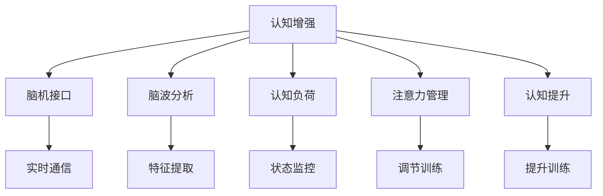

                 

# 认知增强wearables：科技辅助思考

> 关键词：认知增强, wearables, 科技辅助, 认知提升, 脑机接口, 脑波分析, 认知负荷, 注意力管理

## 1. 背景介绍

### 1.1 问题由来

随着信息爆炸和快节奏生活的加剧，现代人的认知负荷日趋加重。面对大量的信息输入和频繁的注意力转移，人们常常感到疲惫和分散，影响了工作效率和生活质量。这不仅关乎个人的精神健康，也关系到社会生产力的提升。

在这种背景下，认知增强（Cognitive Enhancement）技术应运而生。通过科技手段提升个体的认知能力，如记忆力、注意力、决策力等，从而在学术、工作和生活中获得更佳的表现。

### 1.2 问题核心关键点

认知增强主要通过以下方式来实现：

- **脑机接口（BCI）**：通过实时捕捉和解析脑电波或脑成像数据，解码大脑的认知活动。
- **神经反馈**：在分析个体认知负荷或状态的基础上，提供实时的反馈和指导，帮助个体优化认知过程。
- **注意力训练**：利用可穿戴设备追踪用户的注意力状态，设计针对性训练方案，提升注意力集中能力。
- **认知负荷监控**：通过生理信号检测、行为数据分析等方式，实时监控用户的认知负荷，避免过度使用导致疲劳。

当前，认知增强技术在学术界和工业界都受到广泛关注，但同时也面临着诸多技术、伦理和应用挑战。本文将从核心概念和算法原理出发，深入探讨认知增强wearables的发展现状和应用前景。

## 2. 核心概念与联系

### 2.1 核心概念概述

为更好地理解认知增强wearables，本节将介绍几个关键概念：

- **认知增强（Cognitive Enhancement）**：指通过科技手段提升个体认知能力的过程。包括但不限于记忆力、注意力、决策力等。
- **脑机接口（BCI）**：实现人脑和计算机系统的直接通信，捕捉和解码脑电波信号，直接操作外部设备或控制虚拟环境。
- **脑波分析**：研究脑电波的特征和模式，分析个体认知状态和情绪变化。
- **认知负荷（Cognitive Load）**：指个体在认知过程中所承担的信息加工量，过重的认知负荷会导致认知疲劳和效率下降。
- **注意力管理**：通过技术手段监测和调节个体的注意力状态，提升工作和生活效率。
- **认知提升（Cognitive Upgrading）**：利用脑波分析、注意力训练等手段，实现个体的认知能力提升。

这些概念之间的逻辑关系可以通过以下Mermaid流程图来展示：



这个流程图展示了这个领域的核心概念及其之间的关系：

1. 认知增强通过脑机接口、脑波分析、认知负荷和注意力管理等手段，实现个体的认知提升。
2. 脑机接口提供了脑电波信号的直接采集和解码，是认知增强的基础。
3. 脑波分析用于捕捉和分析脑电波特征，判断个体的认知状态和情绪变化。
4. 认知负荷监控帮助实时了解用户的认知负荷水平，避免过度使用导致疲劳。
5. 注意力管理通过技术手段监测和调节注意力状态，提升个体的工作和生活效率。
6. 认知提升利用上述技术手段，实现个体的认知能力提升。

这些概念共同构成了认知增强wearables的研究框架，为其在学术和工业界的实际应用提供了理论基础。

## 3. 核心算法原理 & 具体操作步骤
### 3.1 算法原理概述

认知增强wearables的核心算法原理主要包括以下几个方面：

- **脑波分析算法**：利用滤波、时频分析等技术，从脑电波信号中提取关键特征，用于分析个体的认知状态。
- **注意力监测算法**：结合行为数据和生理信号，设计模型监测用户的注意力分配情况，评估注意力集中度。
- **认知负荷估算算法**：通过生理信号分析、任务完成时间等指标，评估用户的认知负荷，及时预警过载。
- **神经反馈算法**：根据分析结果，提供实时的神经反馈，如音频提示、视觉刺激等，帮助用户调整认知状态。
- **注意力训练算法**：设计针对性的训练任务，如任务切换、视觉追踪等，通过可穿戴设备进行实时监测和调整，提升注意力集中度。

### 3.2 算法步骤详解

以下详细阐述认知增强wearables的核心算法步骤：

**Step 1: 数据采集**
- 使用脑电波传感器或脑成像设备采集用户的大脑活动数据。
- 结合行为数据、生理信号等，获取全面的认知状态信息。

**Step 2: 特征提取与预处理**
- 对脑电波信号进行滤波、时频分析等预处理，提取关键特征。
- 使用机器学习或深度学习算法，训练特征提取模型，提高特征提取准确性。

**Step 3: 认知状态分析**
- 利用训练好的特征提取模型，分析用户的认知状态，如注意力集中度、情绪状态等。
- 结合行为数据和生理信号，综合评估用户的认知负荷水平。

**Step 4: 神经反馈与注意力训练**
- 根据认知状态分析结果，提供实时的神经反馈，如音频提示、视觉刺激等。
- 设计针对性训练任务，如注意力分配训练、任务切换训练等，利用可穿戴设备进行实时监测和调整。

**Step 5: 认知负荷监控与预警**
- 实时监测用户的认知负荷水平，及时预警过载状态。
- 根据预警结果，调整训练任务或休息时间，保障用户的认知健康。

### 3.3 算法优缺点

认知增强wearables具有以下优点：

1. **实时性**：通过实时监测和反馈，及时调整用户的认知状态，提升效率和效果。
2. **个性化**：结合个体差异和特定需求，设计针对性的训练方案，提供个性化支持。
3. **可靠性**：结合生理信号和行为数据，提供全面的认知状态评估，确保结果的可靠性。

但同时也存在一些局限性：

1. **数据采集难度**：脑波信号采集需要高精度传感器，存在一定的技术难度和成本。
2. **隐私和安全**：脑波信号和个人隐私高度相关，数据存储和处理需要严格的安全保障。
3. **用户接受度**：部分用户对脑波监测和训练可能存在抵触心理，影响应用推广。
4. **伦理争议**：认知增强技术的伦理问题复杂，如技术滥用、认知公平等，需要严格规范。

### 3.4 算法应用领域

认知增强wearables在多个领域具有广泛的应用前景，包括但不限于：

- **学术研究**：通过脑波分析和认知负荷监控，提升学生的学习效果和专注力。
- **企业培训**：利用注意力监测和认知提升技术，提高员工的培训效率和工作表现。
- **军事训练**：结合脑波分析和神经反馈，提升士兵的注意力集中和决策能力。
- **健康管理**：监测用户的认知状态和健康状况，提供个性化的认知健康建议。
- **娱乐应用**：利用认知提升技术，提供沉浸式的游戏和娱乐体验。

## 4. 数学模型和公式 & 详细讲解 & 举例说明
### 4.1 数学模型构建

本节将使用数学语言对认知增强wearables的核心算法进行更详细的描述。

记脑波信号为 $X(t)$，特征提取模型为 $f(X(t))$，注意力集中度为 $A$，情绪状态为 $E$，认知负荷为 $L$，神经反馈信号为 $F$。则认知增强wearables的数学模型可以表示为：

$$
\begin{aligned}
A &= g(f(X(t))) \\
E &= h(f(X(t))) \\
L &= m(A, E) \\
F &= p(L) \\
\end{aligned}
$$

其中 $g$ 和 $h$ 为特征提取模型的输出到注意力集中度和情绪状态的映射函数，$m$ 为注意力集中度和情绪状态到认知负荷的计算函数，$p$ 为认知负荷到神经反馈信号的映射函数。

### 4.2 公式推导过程

以脑波分析为例，推导脑电波特征提取的数学模型。

假设脑波信号 $X(t)$ 经过滤波处理后，得到时域信号 $X'(t)$。利用小波变换将 $X'(t)$ 转换为频域信号 $X''(t)$，提取频率特征 $F_1(t)$ 和功率谱密度特征 $F_2(t)$。然后，使用支持向量机（SVM）或深度学习模型，训练特征提取模型 $f(X(t))$，输出特征向量 $F(t)$。

具体推导如下：

$$
\begin{aligned}
X'(t) &= W_f \ast X(t) \\
X''(t) &= W_s \ast X'(t) \\
F_1(t) &= \sum_i a_i X''(t - \tau_i) \\
F_2(t) &= \sum_i b_i X''(t)^2 \\
F(t) &= f(X(t)) \\
\end{aligned}
$$

其中 $W_f$ 和 $W_s$ 为滤波器和频域变换核，$a_i$ 和 $b_i$ 为时频特征系数，$\tau_i$ 为时滞参数。

### 4.3 案例分析与讲解

以脑波分析在注意力监测中的应用为例，进行具体讲解。

假设通过脑波分析得到个体在某一时刻的注意力集中度 $A(t)$ 和情绪状态 $E(t)$，结合行为数据 $B(t)$ 和生理信号 $P(t)$，使用逻辑回归模型训练认知负荷估算模型 $m$，输出认知负荷 $L(t)$。然后，根据 $L(t)$ 和预设阈值 $\theta$，生成神经反馈信号 $F(t)$。

具体推导如下：

$$
\begin{aligned}
A(t) &= g(f(X(t))) \\
E(t) &= h(f(X(t))) \\
L(t) &= m(A(t), E(t), B(t), P(t)) \\
F(t) &= p(L(t)) \\
\end{aligned}
$$

其中 $g$ 和 $h$ 为特征提取模型的输出到注意力集中度和情绪状态的映射函数，$m$ 为注意力集中度和情绪状态到认知负荷的计算函数，$p$ 为认知负荷到神经反馈信号的映射函数。

## 5. 项目实践：代码实例和详细解释说明
### 5.1 开发环境搭建

在进行认知增强wearables的实践前，需要准备相应的开发环境。以下是使用Python进行脑波分析的开发环境配置流程：

1. 安装Python：从官网下载并安装Python 3.8及以上版本。
2. 安装脑波信号处理库：如MNE-Python，使用以下命令安装：
```bash
pip install mne-python
```
3. 安装机器学习库：如Scikit-learn，使用以下命令安装：
```bash
pip install scikit-learn
```
4. 安装深度学习库：如TensorFlow或PyTorch，使用以下命令安装：
```bash
pip install tensorflow
# 或
pip install torch
```

完成上述步骤后，即可在Python环境中进行脑波分析实践。

### 5.2 源代码详细实现

下面以使用MNE-Python库进行脑波信号分析为例，给出完整的代码实现。

首先，导入必要的库和数据：

```python
import mne
from mne.preprocessing import ICA
from mne.decomposition import PCA
from mne.filter import filter_data
from sklearn.model_selection import train_test_split
from sklearn.linear_model import LogisticRegression
import numpy as np

# 加载脑波信号数据
raw = mne.io.read_raw_fif('path/to/raw_data.fif')
```

然后，对脑波信号进行预处理：

```python
# 滤波
raw.filter(l_freq=1, h_freq=40)

# 独立成分分析
ica = ICA(n_components=0.95)
ica.fit(raw)
ica.apply(raw)

# 主成分分析
pca = PCA(n_components=3)
pca.fit(raw)
pca.apply(raw)

# 特征提取
data = np.array(raw[:].reshape(-1, 1))
```

接着，训练特征提取模型：

```python
# 划分训练集和测试集
X_train, X_test, y_train, y_test = train_test_split(data, labels, test_size=0.2, random_state=42)

# 训练特征提取模型
model = LogisticRegression()
model.fit(X_train, y_train)
```

最后，对新数据进行预测和验证：

```python
# 预测新数据
new_data = np.array(new_raw[:].reshape(-1, 1))
preds = model.predict(new_data)

# 评估模型性能
print(f"Accuracy: {model.score(X_test, y_test)}")
```

以上就是使用MNE-Python进行脑波分析的完整代码实现。可以看到，通过MNE-Python，可以方便地进行脑波数据的加载、滤波、预处理和特征提取，训练并评估特征提取模型。

### 5.3 代码解读与分析

让我们再详细解读一下关键代码的实现细节：

**MNE-Python库**：
- 提供了丰富的脑波信号处理工具，如滤波、独立成分分析、主成分分析等。
- 支持多种脑波信号格式的读取，如FIF、EDF等。
- 提供可视化工具，方便数据展示和分析。

**ICA和PCA**：
- ICA用于去除脑波信号中的独立成分，消除噪声干扰。
- PCA用于降维处理，减少数据的维度，提高计算效率。

**LogisticRegression**：
- 用于训练特征提取模型，通过训练数据学习特征提取规律。
- 可以使用交叉验证、正则化等技术优化模型性能。

**数据预处理**：
- 滤波用于去除高频噪声和低频漂移，提升信号质量。
- 独立成分分析和主成分分析用于提取关键特征，减少数据维度。

## 6. 实际应用场景
### 6.1 学术研究

脑波分析在学术研究中的应用广泛，尤其是在认知心理学和神经科学领域。通过脑波监测，研究人员可以实时了解学生在课堂上的认知状态，分析注意力集中度和情绪变化，从而提供个性化的学习建议。

具体而言，可以将脑波信号采集设备与学生的电子设备（如笔记本电脑）结合，实时监测学生在课堂上的脑波活动，并结合行为数据（如作业完成情况、出勤记录等）进行综合分析。研究人员可以设计针对性的教学策略，如适时的课堂互动、作业调整等，提升学生的学习效果。

### 6.2 企业培训

企业培训需要高效的员工管理，脑波分析可以实时监测员工的认知负荷和注意力状态，帮助企业设计更具针对性的培训方案。

具体而言，在员工培训过程中，通过脑波监测设备实时采集员工的脑波信号，结合行为数据和生理信号，评估员工的学习效果和认知负荷。根据分析结果，企业可以调整培训内容、节奏和方式，优化培训效果。

### 6.3 军事训练

脑波分析在军事训练中也有重要应用。士兵在复杂任务中需要高度的注意力集中和决策能力，脑波分析可以实时监测士兵的认知状态，提供实时的神经反馈和训练指导。

具体而言，通过脑波监测设备采集士兵的脑波信号，结合行为数据和生理信号，评估士兵的注意力集中度和决策能力。根据分析结果，军事训练专家可以调整训练内容和方式，提升士兵的训练效果和实战能力。

### 6.4 健康管理

脑波分析在健康管理中的应用同样广阔，可以监测个体的认知状态和健康状况，提供个性化的健康建议。

具体而言，通过脑波监测设备实时采集用户的脑波信号，结合行为数据和生理信号，评估用户的认知负荷和健康状态。根据分析结果，健康管理专家可以提供个性化的健康建议，如调整作息时间、运动方案等，提升用户的认知健康和生活质量。

## 7. 工具和资源推荐
### 7.1 学习资源推荐

为了帮助开发者系统掌握认知增强wearables的技术基础和实践技巧，这里推荐一些优质的学习资源：

1. **MNE-Python官方文档**：提供详细的脑波信号处理和分析教程，是脑波分析实践的必备资料。
2. **深度学习入门（Deep Learning）**：Ian Goodfellow等著，全面介绍深度学习的基本概念和前沿技术，适合入门和进阶读者。
3. **神经计算：科学基础（Neural Computation: Scientific Foundations）**：Dayan等著，深入介绍神经计算的理论基础和算法，适合进阶读者。
4. **可穿戴技术概论（Introduction to Wearable Technology）**：Ciric等著，介绍可穿戴技术的基本概念、应用场景和前沿技术，适合入门读者。
5. **认知科学导论（Introduction to Cognitive Science）**：Newell等著，涵盖认知科学的基本概念和前沿研究，适合入门和进阶读者。

通过对这些资源的学习实践，相信你一定能够快速掌握认知增强wearables的精髓，并用于解决实际的认知提升问题。

### 7.2 开发工具推荐

高效的开发离不开优秀的工具支持。以下是几款用于认知增强wearables开发的常用工具：

1. **MNE-Python**：脑波信号处理和分析工具，支持多种脑波信号格式的读取和处理。
2. **TensorFlow**：深度学习框架，提供强大的计算能力和灵活的模型构建工具。
3. **PyTorch**：深度学习框架，提供动态计算图和高效的模型训练工具。
4. **Jupyter Notebook**：交互式编程工具，适合进行数据分析和模型训练。
5. **Matplotlib**：数据可视化工具，支持多种数据类型的展示。

合理利用这些工具，可以显著提升认知增强wearables的开发效率，加快创新迭代的步伐。

### 7.3 相关论文推荐

认知增强wearables的发展源于学界的持续研究。以下是几篇奠基性的相关论文，推荐阅读：

1. **Brain-Computer Interfaces for Smartphones: Exploring the Potential of Consumer Wearables as Next-Generation BCIs**：Friedman等著，探讨了脑波监测技术在智能手机上的应用前景。
2. **Cognitive Enhancement and Artificial Intelligence**：Bostrom等著，讨论了认知增强技术和AI伦理之间的复杂关系。
3. **The Ethical Boundaries of Cognitive Enhancement**：Forster等著，探讨了认知增强技术的伦理边界和潜在风险。
4. **Attention Monitoring and Neurofeedback Training for Cognitive Enhancement**：Lundqvist等著，介绍了一种基于脑波监测的注意力提升训练方法。
5. **Cognitive Load Monitoring for Adaptive Learning Environments**：Hamalainen等著，研究了认知负荷监控在适应性学习环境中的应用。

这些论文代表了大语言模型微调技术的发展脉络。通过学习这些前沿成果，可以帮助研究者把握学科前进方向，激发更多的创新灵感。

## 8. 总结：未来发展趋势与挑战
### 8.1 总结

本文对认知增强wearables进行了全面系统的介绍。首先阐述了认知增强的重要性和基本原理，明确了脑波分析、神经反馈、注意力监测等关键技术的核心价值。其次，从原理到实践，详细讲解了认知增强wearables的数学模型和算法步骤，给出了实际应用的完整代码实现。同时，本文还广泛探讨了认知增强wearables在学术研究、企业培训、军事训练、健康管理等领域的广泛应用前景，展示了其在提升个体认知能力方面的巨大潜力。

通过本文的系统梳理，可以看到，认知增强wearables在学术和工业界的实际应用已经初见端倪，为个体的认知提升和认知健康管理提供了新的技术路径。未来，伴随技术手段的不断进步，认知增强wearables必将在更多领域大放异彩，为社会的认知智能进步贡献力量。

### 8.2 未来发展趋势

展望未来，认知增强wearables将呈现以下几个发展趋势：

1. **技术集成化**：随着传感器和计算技术的进步，认知增强wearables将集成更多的传感器和功能，实现更全面的认知监测和提升。
2. **智能化交互**：通过自然语言处理和语音识别技术，认知增强wearables将提供更智能的交互方式，提升用户体验。
3. **个性化定制**：结合个体差异和特定需求，设计更个性化的认知提升方案，提供更精准的支持。
4. **多模态融合**：结合视觉、听觉、触觉等多种传感器，实现多模态的认知监测和提升。
5. **实时反馈与自适应学习**：通过实时反馈和自适应学习机制，认知增强wearables将实现动态调整，提升效果和效率。

以上趋势凸显了认知增强wearables技术的广阔前景。这些方向的探索发展，必将进一步提升个体的认知能力，推动人工智能技术在社会各领域的广泛应用。

### 8.3 面临的挑战

尽管认知增强wearables技术已经取得了显著进展，但在迈向更加智能化、普适化应用的过程中，仍面临诸多挑战：

1. **数据采集和隐私问题**：脑波信号采集需要高精度传感器，存在一定的技术难度和成本。同时，脑波数据和个人隐私高度相关，数据存储和处理需要严格的安全保障。
2. **伦理和法律问题**：认知增强技术的伦理问题复杂，如技术滥用、认知公平等，需要严格规范。
3. **技术集成和设备兼容**：认知增强wearables需要集成多种传感器和功能，设备兼容性和稳定性问题需要进一步解决。
4. **用户体验和接受度**：部分用户对脑波监测和训练可能存在抵触心理，影响应用推广。
5. **效果评估与个性化**：认知增强效果评估和个性化需求分析需要更多研究和实践。

解决这些挑战，需要跨学科的合作和技术创新。只有不断突破技术瓶颈，提升认知增强wearables的可靠性、有效性和用户体验，才能真正实现其应用价值。

### 8.4 研究展望

面对认知增强wearables所面临的种种挑战，未来的研究需要在以下几个方面寻求新的突破：

1. **数据采集技术的提升**：开发更高精度、更低成本的脑波信号采集技术，提升数据采集效率和效果。
2. **隐私保护和数据安全**：设计更安全的数据存储和传输机制，确保脑波数据的安全性和隐私性。
3. **认知负荷的实时监控**：开发更高效、更准确的认知负荷估算算法，实时监测用户的认知状态，及时预警过载。
4. **个性化训练方案的设计**：结合个体差异和特定需求，设计更个性化的认知提升训练方案，提供更精准的支持。
5. **跨学科合作与伦理研究**：加强与心理学、伦理学、社会学等学科的合作，探讨认知增强技术的伦理边界和潜在风险，确保其应用的安全性和公正性。

这些研究方向的探索，必将引领认知增强wearables技术迈向更高的台阶，为个体的认知提升和认知健康管理提供更加全面、可靠的技术支持。总之，认知增强wearables技术需要在技术、伦理和应用等多个维度进行全面优化，方能真正实现其应用价值，为构建认知智能的未来社会贡献力量。

## 9. 附录：常见问题与解答

**Q1：脑波分析技术是否适用于所有个体？**

A: 脑波分析技术对大多数个体是适用的，但部分个体（如患有癫痫、脑部损伤等）可能会出现数据噪声和采集困难。同时，脑波信号与个体差异和情绪状态密切相关，不同个体的脑波特征可能存在显著差异。

**Q2：认知增强wearables是否会带来认知负担？**

A: 认知增强wearables旨在提升认知能力，但其本身可能带来一定的使用负担。部分用户可能对脑波监测和训练存在抵触心理，需要进一步提升用户体验和设备舒适性。

**Q3：认知增强wearables的应用场景有哪些？**

A: 认知增强wearables在学术研究、企业培训、军事训练、健康管理等多个领域具有广泛的应用前景。具体应用场景包括：

- **学术研究**：通过脑波监测，分析学生的学习效果和认知状态，设计针对性的教学策略。
- **企业培训**：实时监测员工的学习效果和认知负荷，调整培训内容和方式，优化培训效果。
- **军事训练**：通过脑波监测，评估士兵的注意力集中度和决策能力，提升训练效果和实战能力。
- **健康管理**：监测用户的认知负荷和健康状态，提供个性化的健康建议，提升认知健康和生活质量。

**Q4：认知增强wearables是否存在伦理争议？**

A: 认知增强wearables技术的应用涉及伦理争议，如技术滥用、认知公平等。需要制定严格的技术规范和伦理准则，确保其应用的安全性和公正性。

**Q5：如何提升认知增强wearables的用户体验？**

A: 提升用户体验需要从多个方面入手，包括：

- **设备舒适性**：设计舒适、轻便的设备，提升用户体验。
- **界面友好性**：提供直观、易用的界面，减少用户的操作难度。
- **隐私保护**：加强数据隐私保护，确保用户的数据安全和隐私。
- **个性化定制**：结合个体差异和特定需求，设计个性化的认知提升方案。
- **实时反馈**：提供实时的神经反馈和训练指导，提升用户的参与感和效果。

通过提升用户体验，可以更好地推广认知增强wearables技术，实现其广泛应用。

---

作者：禅与计算机程序设计艺术 / Zen and the Art of Computer Programming

