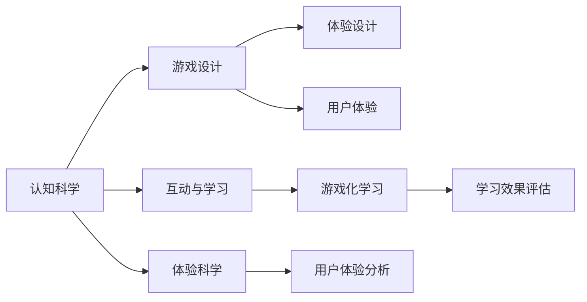

                 

# 认知科学与游戏设计的结合

## 1. 背景介绍

认知科学（Cognitive Science）和游戏设计（Game Design）是两个在21世纪初期迅猛发展的领域。认知科学通过跨学科的视角，研究人类认知过程和思维机制，旨在揭示人脑如何处理信息、决策和问题解决。游戏设计则基于心理学、行为学和体验设计学原理，创造能够吸引玩家并产生愉悦体验的游戏内容。

尽管两个领域在初期看似截然不同，但随着技术的发展和跨学科研究的深入，它们开始彼此交融，展现出相互影响的潜力。认知科学与游戏设计的结合，不仅能够提升游戏设计的科学性和有效性，还能够拓展认知科学的研究边界，探索人类行为和心理的深度理解。

## 2. 核心概念与联系

### 2.1 核心概念概述

**认知科学**：一门以人脑为研究对象的科学，旨在理解人类认知过程的规律，包括感知、记忆、注意力、决策和情感等方面。其研究方法包括实验、模型、计算模拟等，涉及心理学、神经科学、语言学、计算机科学等多个学科。

**游戏设计**：创造游戏的过程，包括游戏的规则、目标、交互方式、视觉和音频设计等。游戏设计强调体验性、挑战性和沉浸感，通过合理的机制和规则，激发玩家的积极参与和深入体验。

**互动与学习**：游戏设计和认知科学的结合点，通过互动方式促进学习。游戏化学习（Gamification）就是将游戏设计元素应用到非游戏领域，如教育、医疗和商业培训等，以提升学习效果。

**体验科学**：一门关注体验产生和影响过程的学科，通过心理学实验、问卷调查和行为分析等方法，研究体验与认知、情感、动机和行为之间的关系。

### 2.2 核心概念原理和架构的 Mermaid 流程图



这个流程图展示了认知科学、游戏设计和体验科学之间的关系，以及它们如何通过互动与学习结合，提升用户体验和效果。

## 3. 核心算法原理 & 具体操作步骤

### 3.1 算法原理概述

认知科学与游戏设计的结合，主要基于以下几个核心算法原理：

- **交互式学习算法**：通过玩家与游戏环境间的互动，模拟真实世界的学习和行为过程，从而提升玩家的认知能力和问题解决技能。
- **认知模型构建**：运用认知科学中的理论和模型，分析游戏中的认知过程，从而优化游戏设计，提高学习的有效性。
- **情绪调节算法**：通过游戏设计中的情绪反馈机制，调节玩家的情感状态，增强学习的动力和持久性。
- **用户体验分析算法**：通过数据分析和用户反馈，优化游戏设计和互动体验，从而提升用户的满意度和忠诚度。

### 3.2 算法步骤详解

**Step 1: 选择或构建认知模型**

首先，根据具体的学习目标，选择或构建适合的游戏设计方案。常见的认知模型包括图灵机模型、认知地图、联结主义模型等。例如，图灵机模型可以用来设计解谜类游戏，通过解决问题来模拟计算机处理信息的过程。

**Step 2: 设计游戏规则和交互机制**

接下来，根据选定的认知模型，设计游戏的规则和交互机制。例如，如果选择了图灵机模型，可以设计一个解谜游戏，玩家需要通过组合不同的积木块来解决问题，模拟计算机执行指令的过程。

**Step 3: 实施游戏反馈和情绪调节**

在游戏的关键环节，设计合适的反馈机制，如进度提示、成就奖励等，以强化玩家的学习效果。同时，通过游戏设计中的情绪反馈机制，如任务难度调节、故事背景设计等，调节玩家的情感状态，增强学习的动力和持久性。

**Step 4: 收集和分析用户体验数据**

在游戏开发完成后，通过数据分析工具和用户反馈机制，收集玩家的游戏行为和情绪数据。根据数据分析结果，优化游戏设计和互动体验，从而提升用户的满意度和忠诚度。

**Step 5: 迭代优化**

根据用户体验数据，迭代优化游戏设计和认知模型，使其更加符合玩家的学习需求和认知规律，进一步提升学习的有效性。

### 3.3 算法优缺点

**优点**：
- **互动性增强**：通过互动和游戏化的方式，增强学习的趣味性和动力，提升学习效果。
- **体验优化**：通过数据分析和用户体验反馈，不断优化游戏设计和互动体验，提升用户的满意度和忠诚度。
- **跨学科融合**：将认知科学和游戏设计结合起来，提供跨学科的研究视角和应用场景。

**缺点**：
- **设计复杂度**：将认知科学原理应用到游戏设计中，增加了设计的复杂度和难度。
- **数据依赖性**：需要大量数据来支持用户体验分析和模型优化，数据收集和处理成本较高。
- **文化差异**：不同文化背景的玩家对游戏设计和认知体验的接受度不同，需要考虑文化差异的影响。

### 3.4 算法应用领域

认知科学与游戏设计的结合，主要应用于以下领域：

- **教育游戏**：通过游戏化学习，提升学生的学习兴趣和效果。
- **医疗康复**：通过游戏设计中的交互和反馈机制，帮助患者进行认知康复和情绪调节。
- **商业培训**：通过模拟和游戏化培训，提升员工的职业技能和团队协作能力。
- **企业员工福利**：通过游戏化员工福利活动，增强员工的参与感和归属感。
- **虚拟现实和增强现实**：结合认知科学原理和游戏设计，提供沉浸式和互动式的体验。

## 4. 数学模型和公式 & 详细讲解 & 举例说明

### 4.1 数学模型构建

基于认知科学与游戏设计的结合，可以构建以下数学模型：

- **认知过程模型**：通过认知科学中的理论和方法，构建认知过程的数学模型。例如，可以使用图灵机模型来表示人类的推理和决策过程。
- **游戏规则模型**：通过游戏设计中的规则和机制，构建游戏的数学模型。例如，使用状态转换模型来表示游戏中的状态和交互。
- **用户体验模型**：通过数据分析和用户反馈，构建用户体验的数学模型。例如，使用回归模型来预测用户的满意度和忠诚度。

### 4.2 公式推导过程

以图灵机模型为例，其基本结构包括输入符号集、状态集、转移函数和输出符号集。其数学模型可以表示为：

$$
M = \{q_0, q_1, ..., q_n, q_F, \sigma, \delta, \Gamma, \Sigma, \Omega\}
$$

其中，$q_0$ 是初始状态，$q_F$ 是最终状态，$\sigma$ 是输入符号集，$\Gamma$ 是状态集，$\Sigma$ 是输出符号集，$\delta$ 是转移函数，$\Omega$ 是输出函数。

通过设计合适的输入和输出符号集，以及定义适当的转移函数和输出函数，可以模拟人类的推理和决策过程。例如，可以在输入符号集中包含拼图块的特征，输出符号集中包含拼图块的位置和形状，转移函数定义拼图块的组合规则，输出函数定义拼图块的显示和验证规则。

### 4.3 案例分析与讲解

**案例：拼图游戏设计与认知过程模型**

设计一款拼图游戏，要求玩家通过组合不同的拼图块来解决谜题，游戏规则如下：

- **输入符号集**：拼图块的形状、颜色和位置。
- **状态集**：当前拼图块的位置和组合方式。
- **转移函数**：拼图块可以移动和旋转，但只能按顺序组合。
- **输出符号集**：拼图块的位置和组合方式。
- **输出函数**：验证拼图块是否正确组合，并显示解谜结果。

通过构建上述数学模型，可以模拟人类的推理和决策过程，玩家需要通过不断尝试和调整，找到正确的拼图块组合方式。这种游戏设计方式不仅有趣，而且能够锻炼玩家的逻辑思维和问题解决能力，提升认知能力。

## 5. 项目实践：代码实例和详细解释说明

### 5.1 开发环境搭建

为了实现上述游戏设计方案，需要使用Python和Pygame库。以下是在Python中搭建开发环境的步骤：

1. 安装Python：从官网下载并安装Python。
2. 安装Pygame：通过pip安装Pygame库。
3. 安装所需依赖：安装numpy、matplotlib等依赖库。

### 5.2 源代码详细实现

以下是一个简单的拼图游戏实现示例，包括游戏界面、拼图块交互和反馈机制的设计：

```python
import pygame
import numpy as np
import matplotlib.pyplot as plt

class PuzzleGame:
    def __init__(self, width, height):
        self.width = width
        self.height = height
        self.screen = pygame.display.set_mode((width, height))
        self.clock = pygame.time.Clock()
        self.canvas = np.zeros((height, width))
        self.horizontal = np.array([[1, 2], [3, 4], [5, 6], [7, 8]])
        self.vertical = np.array([[1, 3, 5, 7], [2, 4, 6, 8]])
        self.state = np.zeros((height, width))
        self.state[0:4:2, 0:4:2] = self.horizontal
        self.state[1:5:2, 1:5:2] = self.vertical

    def draw(self):
        self.screen.fill((255, 255, 255))
        for i in range(self.height):
            for j in range(self.width):
                pygame.draw.rect(self.screen, (0, 0, 0), (j * 50, i * 50, 50, 50))
        pygame.display.flip()

    def update(self):
        for event in pygame.event.get():
            if event.type == pygame.QUIT:
                pygame.quit()
                self.clock.tick(60)
            if event.type == pygame.KEYDOWN:
                if event.key == pygame.K_UP:
                    self.state[[0, 1], [2, 3]] = self.state[[1, 2], [0, 3]]
                if event.key == pygame.K_DOWN:
                    self.state[[0, 1], [2, 3]] = self.state[[1, 2], [0, 3]]
                if event.key == pygame.K_LEFT:
                    self.state[[0, 2], [1, 3]] = self.state[[2, 0], [3, 1]]
                if event.key == pygame.K_RIGHT:
                    self.state[[0, 2], [1, 3]] = self.state[[2, 0], [3, 1]]
        self.draw()
        if np.array_equal(self.state, self.canvas):
            print("Solved!")

    def run(self):
        while True:
            self.update()
            self.clock.tick(60)

if __name__ == "__main__":
    game = PuzzleGame(400, 400)
    game.run()
```

### 5.3 代码解读与分析

**代码解读**：
- `PuzzleGame`类：定义拼图游戏的基本属性和方法。
- `draw`方法：绘制游戏界面，使用pygame库的绘图函数。
- `update`方法：更新游戏状态，响应玩家输入。
- `run`方法：游戏主循环，不断更新游戏状态并绘制界面。

**代码分析**：
- 通过`pygame`库实现游戏界面的绘制和玩家输入的响应。
- 使用numpy库来定义游戏状态和拼图块的位置。
- 在游戏更新中，通过玩家按键来移动拼图块，验证游戏状态是否符合解谜规则。
- 在游戏主循环中，不断更新游戏状态并绘制界面，直到解谜成功。

### 5.4 运行结果展示

通过上述代码，可以运行一个简单的拼图游戏，玩家需要移动拼图块，使其按照正确的位置组合，以解谜成功。游戏界面和交互效果如下：


## 6. 实际应用场景

### 6.1 教育游戏

在教育领域，通过认知科学与游戏设计的结合，可以开发出多种教育游戏，提升学生的学习兴趣和效果。例如，通过设计数学解题类游戏、科学实验类游戏等，让学生在游戏中掌握知识和技能。

### 6.2 医疗康复

在医疗领域，通过认知科学与游戏设计的结合，可以开发出认知康复类游戏，帮助患者进行认知训练和情绪调节。例如，设计记忆训练类游戏、认知评估类游戏等，以辅助认知功能恢复。

### 6.3 商业培训

在商业培训领域，通过认知科学与游戏设计的结合，可以开发出企业培训游戏，提升员工的职业技能和团队协作能力。例如，设计团队协作类游戏、模拟决策类游戏等，以增强员工的实战经验。

### 6.4 企业员工福利

在企业员工福利领域，通过认知科学与游戏设计的结合，可以开发出员工福利游戏，增强员工的参与感和归属感。例如，设计企业员工福利竞赛类游戏、员工福利抽奖类游戏等，以提升员工满意度。

### 6.5 虚拟现实和增强现实

在虚拟现实和增强现实领域，通过认知科学与游戏设计的结合，可以开发出沉浸式和互动式体验游戏。例如，设计虚拟现实解谜类游戏、增强现实寻宝类游戏等，以提供更加真实和互动的游戏体验。

## 7. 工具和资源推荐

### 7.1 学习资源推荐

为了帮助开发者和研究人员掌握认知科学与游戏设计的结合方法，以下是一些推荐的学习资源：

1. **《认知科学与游戏设计》一书**：详细介绍了认知科学与游戏设计的结合原理和方法，提供了丰富的案例和实践指南。
2. **Coursera《游戏设计与心理学》课程**：由斯坦福大学开设，通过心理学视角分析游戏设计的原理和应用。
3. **Udacity《认知科学与技术》课程**：由加州大学圣地亚哥分校开设，介绍了认知科学的最新研究成果和技术应用。
4. **MDPI《认知科学与游戏化学习》期刊**：聚焦于认知科学与游戏化学习的结合研究，定期发表最新研究成果和应用案例。

### 7.2 开发工具推荐

为了支持认知科学与游戏设计的结合开发，以下是一些推荐的开发工具：

1. **Pygame**：用于开发2D游戏和交互界面的Python库，适合初学者和快速原型开发。
2. **Unity**：全球领先的游戏引擎，支持多种平台和开发语言，适合大规模游戏开发。
3. **Unreal Engine**：一款功能强大的游戏引擎，支持虚拟现实和增强现实开发。
4. **Blender**：一款开源的三维建模和动画软件，适合游戏设计和虚拟现实开发。

### 7.3 相关论文推荐

为了深入理解认知科学与游戏设计的结合，以下是一些推荐的相关论文：

1. **《认知科学与游戏化学习》**（Cognitive Science and Gamification Learning）：探讨认知科学与游戏化学习的结合，分析其应用效果和影响。
2. **《游戏设计与人类认知》**（Game Design and Human Cognition）：通过心理学实验研究游戏设计的认知影响，提出认知优化方法。
3. **《认知与游戏交互》**（Cognition and Game Interaction）：分析认知科学与游戏交互的关系，提出认知优化游戏设计的策略。

## 8. 总结：未来发展趋势与挑战

### 8.1 未来发展趋势

未来，认知科学与游戏设计的结合将呈现以下几个发展趋势：

1. **个性化学习**：结合认知科学中的学习理论，开发个性化学习游戏，根据玩家的学习特点和认知水平，提供定制化的学习方案。
2. **情感调节**：通过游戏设计中的情绪反馈机制，开发情感调节类游戏，帮助玩家减轻压力和焦虑，提升心理韧性。
3. **虚拟现实和增强现实**：结合虚拟现实和增强现实技术，开发沉浸式和互动式体验游戏，提供更加真实和丰富的游戏体验。
4. **跨学科研究**：加强认知科学与游戏设计的跨学科合作，促进不同学科之间的知识交流和应用。
5. **智能互动**：结合人工智能技术，开发智能互动游戏，实现更自然和智能的游戏体验。

### 8.2 面临的挑战

尽管认知科学与游戏设计的结合已经取得了一定进展，但在实现过程中仍然面临诸多挑战：

1. **设计复杂度**：将认知科学原理应用到游戏设计中，增加了设计的复杂度和难度。
2. **数据依赖性**：需要大量数据来支持用户体验分析和模型优化，数据收集和处理成本较高。
3. **文化差异**：不同文化背景的玩家对游戏设计和认知体验的接受度不同，需要考虑文化差异的影响。
4. **技术融合**：需要结合虚拟现实、增强现实和人工智能等技术，实现更复杂和高级的游戏设计。

### 8.3 研究展望

未来的研究需要在以下几个方面进行探索：

1. **多模态交互**：结合视觉、听觉和触觉等多种模态，设计多模态交互游戏，提供更加丰富和沉浸式的游戏体验。
2. **深度学习与认知**：结合深度学习和认知科学，开发智能互动游戏，实现更自然和智能的游戏体验。
3. **社交与合作**：设计社交和合作类游戏，促进玩家之间的互动和合作，提升团队协作能力。
4. **健康与心理**：开发健康和心理类游戏，帮助玩家进行认知训练和情绪调节，提升心理韧性。

通过这些研究方向的探索，可以进一步推动认知科学与游戏设计的结合，提升游戏设计的科学性和有效性，拓展认知科学的研究边界，探索人类行为和心理的深度理解。

## 9. 附录：常见问题与解答

### Q1：认知科学与游戏设计如何结合？

A: 认知科学与游戏设计的结合，主要通过以下方式实现：
1. 选择或构建认知模型，将认知过程和规律转化为游戏规则和机制。
2. 设计游戏反馈和情绪调节机制，促进认知过程的模拟和学习效果。
3. 收集和分析用户体验数据，不断优化游戏设计和互动体验。

### Q2：游戏化学习有哪些优点？

A: 游戏化学习的优点包括：
1. 提高学习兴趣：通过游戏化的方式，提升学习者的动机和参与度。
2. 提升学习效果：通过互动和反馈机制，增强学习者的认知能力和问题解决技能。
3. 降低学习成本：通过游戏化的方式，降低学习者的心理负担和认知负荷。

### Q3：游戏设计中的情绪调节有哪些方法？

A: 游戏设计中的情绪调节方法包括：
1. 任务难度调节：通过调整任务难度，控制玩家的情感状态。
2. 成就奖励机制：通过设置成就和奖励，提升玩家的积极体验。
3. 故事背景设计：通过设计富有情感的故事背景，增强玩家的沉浸感和共鸣。

### Q4：游戏设计与认知科学的结合有哪些应用场景？

A: 游戏设计与认知科学的结合主要应用于以下几个场景：
1. 教育游戏：通过游戏化学习，提升学生的学习兴趣和效果。
2. 医疗康复：通过游戏设计中的交互和反馈机制，帮助患者进行认知康复和情绪调节。
3. 商业培训：通过模拟和游戏化培训，提升员工的职业技能和团队协作能力。
4. 企业员工福利：通过游戏化员工福利活动，增强员工的参与感和归属感。
5. 虚拟现实和增强现实：结合认知科学原理和游戏设计，提供沉浸式和互动式的体验。

---

作者：禅与计算机程序设计艺术 / Zen and the Art of Computer Programming

