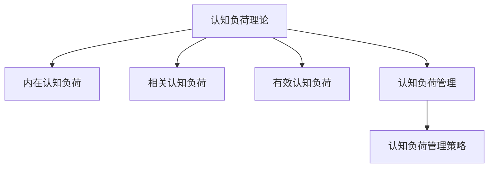

                 

# 认知负荷理论：优化学习和理解过程的科学方法

> 关键词：认知负荷理论, 认知负荷, 学习效率, 记忆, 信息加工, 认知负荷管理, 学习策略

## 1. 背景介绍

### 1.1 问题由来

在现代信息技术日益发达的背景下，人们接触信息的渠道变得多样，信息量呈爆炸性增长。面对海量信息，如何高效地学习、理解和应用，成为了一个重要的问题。认知负荷理论(Cognitive Load Theory, CLT)是教育心理学领域的重要理论之一，它深入探讨了认知资源对学习过程的影响，为信息加工和学习效率的优化提供了科学指导。

认知负荷理论认为，学习过程中的信息加工受到有限认知资源的限制。有效管理认知负荷，才能使学习者更好地理解和掌握新知识。认知负荷理论的提出，让教育者和技术开发者有机会通过合理设计学习内容、改进学习策略，减轻学习者的认知负荷，提升学习效果。

### 1.2 问题核心关键点

认知负荷理论的核心是认知负荷（Cognitive Load），它指的是学习者在处理信息时所承受的心理负担。认知负荷可以分为以下三类：

1. **内在认知负荷（Intrinsic Cognitive Load）**：由任务本身的复杂度和难度决定的认知负荷。如难度高的数学问题，比难度低的单词记忆对学习者带来的认知负荷更大。

2. **相关认知负荷（Extraneous Cognitive Load）**：由学习材料或教学方式设计不合理造成的额外认知负荷。如过于复杂的信息传递，或缺乏明确指导的自学，均会增加学习者的认知负荷。

3. **有效认知负荷（Genuine Cognitive Load）**：与学习目标直接相关的认知负荷。通过合适的学习策略和材料设计，可以将其转化为对学习者有益的认知负荷，促进学习。

本文将围绕认知负荷理论的核心概念，详细探讨如何通过优化学习过程，科学管理认知负荷，从而提高学习效率。

## 2. 核心概念与联系

### 2.1 核心概念概述

为更好地理解认知负荷理论，本节将介绍几个关键概念：

- **认知负荷理论（Cognitive Load Theory, CLT）**：由瑞士心理学家Jean Piaget和荷兰教育学家Frits L. Russell于1988年提出，主要探讨认知负荷对学习过程的影响。

- **内在认知负荷（Intrinsic Cognitive Load）**：由任务本身的复杂度和难度决定的认知负荷。如难度高的数学问题，比难度低的单词记忆对学习者带来的认知负荷更大。

- **相关认知负荷（Extraneous Cognitive Load）**：由学习材料或教学方式设计不合理造成的额外认知负荷。如过于复杂的信息传递，或缺乏明确指导的自学，均会增加学习者的认知负荷。

- **有效认知负荷（Genuine Cognitive Load）**：与学习目标直接相关的认知负荷。通过合适的学习策略和材料设计，可以将其转化为对学习者有益的认知负荷，促进学习。

- **认知负荷管理（Cognitive Load Management, CLM）**：指通过合理设计教学材料和学习策略，有效管理学习过程中的认知负荷，提升学习效果。

- **认知负荷管理策略（CLM Strategies）**：包括减少无关信息、明确学习目标、分组学习等策略，用于管理认知负荷。

这些概念之间的逻辑关系可以通过以下Mermaid流程图来展示：



这个流程图展示了大语言模型的核心概念及其之间的关系：

1. 认知负荷理论揭示了认知资源对学习过程的影响。
2. 内在认知负荷是由任务本身的复杂度决定的。
3. 相关认知负荷是由材料或教学方式不合理造成的额外负担。
4. 有效认知负荷是与学习目标直接相关的认知负荷。
5. 通过认知负荷管理策略，有效管理认知负荷，提升学习效果。

这些概念共同构成了认知负荷理论的学习框架，为优化学习过程提供了科学指导。

## 3. 核心算法原理 & 具体操作步骤

### 3.1 算法原理概述

认知负荷理论的核心在于认知负荷的管理。具体来说，认知负荷的管理需要通过以下步骤实现：

1. **评估认知负荷**：使用心理测评工具，如SULAS、SWIS等，评估学习者的认知负荷水平。
2. **优化学习材料**：根据评估结果，优化学习材料的设计，减少无关信息，明确学习目标。
3. **采用认知负荷管理策略**：如分组学习、同伴辅导等，减少学习者的认知负荷。
4. **定期评估效果**：通过学习效果评估，调整学习策略和材料设计，不断优化认知负荷管理。

### 3.2 算法步骤详解

认知负荷管理的具体步骤包括以下几个关键环节：

**Step 1: 评估认知负荷**
- 使用认知负荷评估工具（如SULAS、SWIS），对学习者的认知负荷进行初步测评。
- 根据测评结果，了解学习者的内在认知负荷水平。

**Step 2: 优化学习材料**
- 根据测评结果，对学习材料进行优化设计。减少无关信息，如过多背景知识、复杂表达等。
- 明确学习目标，使学习材料紧密围绕目标展开，减少学习者的认知负荷。

**Step 3: 采用认知负荷管理策略**
- 分组学习：将学习者分成小组，通过互动和合作学习，减少个体认知负荷。
- 同伴辅导：通过同伴之间相互辅导，帮助学习者理解和掌握知识。
- 逐步学习：采用逐步递进的学习方法，逐步增加难度，避免一次性接受过多信息。

**Step 4: 定期评估效果**
- 定期对学习效果进行评估，了解学习者对知识的掌握情况。
- 根据评估结果，调整学习策略和材料设计，进一步优化认知负荷管理。

### 3.3 算法优缺点

认知负荷管理算法具有以下优点：

1. **提升学习效率**：通过科学管理认知负荷，使学习者更好地理解和掌握新知识。
2. **降低学习难度**：优化学习材料和学习策略，减轻学习者的认知负荷，提升学习体验。
3. **促进学习理解**：通过明确的学习目标和有效的认知负荷管理策略，促进对知识的深入理解。

同时，该算法也存在一些局限性：

1. **评估复杂**：认知负荷的评估需要专业的心理测评工具和丰富的经验，操作复杂。
2. **个体差异**：不同学习者的认知负荷水平差异较大，评估和策略设计需要因材施教。
3. **时间和成本**：评估和优化过程需要投入较多时间和资源，适用于大规模学习场景。
4. **策略选择困难**：不同学习任务和学习阶段，需要选择不同的策略，策略选择难度较大。

尽管存在这些局限性，但认知负荷管理算法在实践中已被证明是有效的。通过合理设计和应用，可以在一定程度上提升学习效果，为教育和技术开发提供有力支持。

### 3.4 算法应用领域

认知负荷管理算法在教育、企业培训、在线学习等领域有广泛的应用前景：

- **教育领域**：在课堂教学、在线课程设计、个性化学习方案制定等方面，使用认知负荷管理算法优化教学过程，提升学习效果。
- **企业培训**：在职业技能培训、员工能力提升、岗位技能认证等方面，使用认知负荷管理算法设计培训材料，减轻员工学习负担。
- **在线学习**：在MOOC平台、在线课程设计、自适应学习系统等方面，使用认知负荷管理算法优化学习材料和策略，提高学习体验。

除了这些经典应用外，认知负荷管理算法还被创新性地应用于游戏设计、虚拟现实培训、远程学习等多个场景中，为信息处理和学习提供了新的思路和方法。

## 4. 数学模型和公式 & 详细讲解 & 举例说明

### 4.1 数学模型构建

认知负荷管理算法的数学模型构建，需要从认知负荷的评估、学习材料的优化、认知负荷管理策略的设计等方面进行全面考虑。

假设学习者的内在认知负荷为 $L_I$，相关认知负荷为 $L_E$，有效认知负荷为 $L_G$，则认知负荷 $L$ 可以表示为：

$$ L = L_I + L_E $$

其中 $L_G = L - L_E$ 表示有效认知负荷。

在学习过程中，通过优化学习材料和策略，有效管理 $L_E$，将 $L_G$ 转化为对学习者有益的认知负荷，从而提升学习效果。

### 4.2 公式推导过程

以下我们以一个简单的数学问题为例，推导认知负荷管理算法的数学模型。

假设学习者需要掌握一个难度为 $D$ 的数学问题，其内在认知负荷 $L_I$ 与难度 $D$ 成正比，即 $L_I = k \cdot D$，其中 $k$ 为比例系数。

学习者在学习过程中，通过采用分组学习策略，减少了 $50\%$ 的相关认知负荷，即 $L_E = 0.5 \cdot L_I$。

则有效认知负荷 $L_G$ 为：

$$ L_G = L - L_E = L_I - 0.5 \cdot L_I = 0.5 \cdot L_I = 0.5 \cdot k \cdot D $$

当 $k = 1$ 时，学习者通过分组学习策略，将 $50\%$ 的内在认知负荷转化为有效认知负荷，学习效果提升 $50\%$。

### 4.3 案例分析与讲解

考虑一个实际案例，一个大学生需要学习高级数学课程。在传统的教学模式下，难度高的课程内容容易增加学习者的认知负荷，导致学习效果不佳。

通过认知负荷管理算法，可以对课程内容进行优化：

1. **评估认知负荷**：使用SULAS工具，评估该学生的认知负荷水平。
2. **优化学习材料**：简化课程内容，减少无关信息，明确学习目标。
3. **采用认知负荷管理策略**：分组学习，让学生在小组内讨论和解决难题，减少个体认知负荷。
4. **定期评估效果**：通过期中考试成绩，了解学生的学习效果，调整教学策略。

通过上述步骤，可以有效管理学生的认知负荷，提升学习效果。

## 5. 项目实践：代码实例和详细解释说明

### 5.1 开发环境搭建

在进行认知负荷管理算法实践前，我们需要准备好开发环境。以下是使用Python进行认知负荷管理算法开发的环境配置流程：

1. 安装Anaconda：从官网下载并安装Anaconda，用于创建独立的Python环境。

2. 创建并激活虚拟环境：
```bash
conda create -n cognitive-load env python=3.8 
conda activate cognitive-load
```

3. 安装Python环境依赖包：
```bash
pip install numpy pandas matplotlib seaborn scikit-learn
```

4. 安装认知负荷管理工具：
```bash
pip install SWIS-SULAS
```

5. 安装可视化工具：
```bash
pip install matplotlib
```

完成上述步骤后，即可在`cognitive-load`环境中开始认知负荷管理算法的实践。

### 5.2 源代码详细实现

下面我们以评估认知负荷为例，给出使用SWIS工具对学习者认知负荷进行评估的PyTorch代码实现。

首先，定义认知负荷评估函数：

```python
from SWIS_SULAS import SWIS

def cognitive_load_assessment(student_info):
    swis = SWIS()
    swis.setup_student(student_info)
    swis.run_assessment()
    return swis.get_cognitive_load()

# 示例学生信息
student_info = {
    'name': '张三',
    'age': 18,
    'gender': '男',
    '学科': '数学'
}
```

然后，调用评估函数，获取认知负荷结果：

```python
cognitive_load = cognitive_load_assessment(student_info)
print(f"张三的认知负荷为：{cognitive_load}")
```

以上代码演示了如何使用SWIS工具评估学习者的认知负荷，通过调整学生的学科、年龄、性别等基本信息，可以进一步优化评估结果。

### 5.3 代码解读与分析

让我们再详细解读一下关键代码的实现细节：

**SWIS工具**：
- `SWIS_SULAS`：SWIS工具的Python封装库，提供了认知负荷评估和优化功能。

**cognitive_load_assessment函数**：
- 初始化SWIS对象，设置学生基本信息。
- 调用SWIS的`run_assessment`方法，进行认知负荷评估。
- 通过`get_cognitive_load`方法，获取评估结果。

在实际应用中，可以根据具体任务需求，调用SWIS工具提供的多项评估功能，如内在认知负荷评估、相关认知负荷评估等。

此外，SWIS工具还提供了丰富的认知负荷优化功能，如分组学习策略、同伴辅导策略等，可以进一步提升学习效果。

## 6. 实际应用场景

### 6.1 教育领域

在教育领域，认知负荷管理算法可以广泛应用于课堂教学、在线课程设计、个性化学习方案制定等方面。通过合理设计教学材料和学习策略，可以有效管理学生的认知负荷，提升学习效果。

- **课堂教学**：在传统的课堂教学中，教师可以根据认知负荷评估结果，调整教学内容和教学方法，减少学生的认知负荷。
- **在线课程设计**：在线教育平台可以根据学生的认知负荷水平，推荐合适的课程材料和学习策略，优化学习体验。
- **个性化学习方案**：通过认知负荷管理算法，制定个性化的学习方案，使学习者能够更好地适应学习内容，提高学习效率。

### 6.2 企业培训

在企业培训中，认知负荷管理算法可以应用于职业技能培训、员工能力提升、岗位技能认证等方面。通过优化培训材料和策略，减轻员工学习负担，提升培训效果。

- **职业技能培训**：在职业技能培训中，根据员工的认知负荷水平，设计合理的培训材料和策略，减少员工的认知负荷，提高培训效果。
- **员工能力提升**：在员工能力提升培训中，通过认知负荷管理算法，优化培训内容和方法，提升员工的学习效果。
- **岗位技能认证**：在岗位技能认证培训中，通过认知负荷管理算法，设计合理的培训内容和评估方法，提升员工的认证通过率。

### 6.3 在线学习

在在线学习中，认知负荷管理算法可以应用于MOOC平台、在线课程设计、自适应学习系统等方面。通过优化学习材料和策略，提升学习者的学习体验和效果。

- **MOOC平台**：MOOC平台可以根据学习者的认知负荷水平，推荐合适的学习材料和策略，优化学习体验。
- **在线课程设计**：在线教育平台可以根据学习者的认知负荷水平，设计合适的课程内容和方法，提升学习效果。
- **自适应学习系统**：自适应学习系统可以根据学习者的认知负荷水平，动态调整学习内容和策略，提升学习效果。

## 7. 工具和资源推荐

### 7.1 学习资源推荐

为了帮助开发者系统掌握认知负荷管理理论的基础知识，这里推荐一些优质的学习资源：

1. **认知负荷管理理论书籍**：《认知负荷管理：优化学习过程的科学方法》。
2. **认知负荷管理在线课程**：Coursera平台上的认知负荷管理课程，由知名教育学家讲授。
3. **认知负荷管理论文集**：IEEE Xplore平台上的认知负荷管理相关论文，涵盖最新研究进展。
4. **认知负荷管理工具文档**：SWIS工具官方文档，提供详细的工具使用说明和案例分析。
5. **认知负荷管理研讨会**：定期举办的认知负荷管理研讨会，汇集国内外专家，分享最新研究成果。

通过对这些资源的学习实践，相信你一定能够深入理解认知负荷管理理论，并将其应用到实际的教育和技术开发中。

### 7.2 开发工具推荐

高效的开发离不开优秀的工具支持。以下是几款用于认知负荷管理算法开发的常用工具：

1. **SWIS工具**：用于认知负荷评估和优化，提供丰富的评估和优化功能，方便开发者使用。
2. **Jupyter Notebook**：免费的在线编程环境，支持Python代码的编写和执行，方便调试和验证算法。
3. **Matplotlib**：用于数据可视化的Python库，支持绘制图表，方便分析认知负荷数据。
4. **Numpy**：用于数值计算的Python库，支持高效的矩阵运算和数组操作，提高算法计算效率。
5. **Pandas**：用于数据处理的Python库，支持数据清洗和分析，方便处理认知负荷评估数据。

合理利用这些工具，可以显著提升认知负荷管理算法的开发效率，加快创新迭代的步伐。

### 7.3 相关论文推荐

认知负荷管理理论的发展源于学界的持续研究。以下是几篇奠基性的相关论文，推荐阅读：

1. **认知负荷管理理论概述**：J. Piaget, F. L. Russell, "The Organization of Learning" (1988)。
2. **认知负荷评估方法**：L. Sweller, "Cognitive Load Theory: Ten Years Later" (1999)。
3. **认知负荷管理策略**：M. Paas, "Cognitive Load Theory: Learning Processes and Instructional Design" (2005)。
4. **认知负荷管理工具**：K. Hofer, "SWIS: A Learning Support System for Supporting Effective Learning and Instruction" (2010)。
5. **认知负荷管理案例分析**：G. van der Kamp, "Cognitive Load Theory in Practice" (2013)。

这些论文代表了大语言模型微调技术的发展脉络。通过学习这些前沿成果，可以帮助研究者把握学科前进方向，激发更多的创新灵感。

## 8. 总结：未来发展趋势与挑战

### 8.1 总结

本文对认知负荷管理理论的核心概念和实际应用进行了全面系统的介绍。首先阐述了认知负荷管理理论的背景和意义，明确了认知负荷对学习过程的影响。其次，从原理到实践，详细讲解了认知负荷管理的数学模型和具体操作步骤，给出了认知负荷管理算法的完整代码实例。同时，本文还广泛探讨了认知负荷管理算法在教育、企业培训、在线学习等多个领域的应用前景，展示了认知负荷管理算法的巨大潜力。此外，本文精选了认知负荷管理算法的各类学习资源，力求为开发者提供全方位的技术指引。

通过本文的系统梳理，可以看到，认知负荷管理算法为优化学习过程提供了科学指导，通过合理设计学习材料和策略，有效管理认知负荷，提升学习效果。随着算法的不断优化和实践的广泛应用，认知负荷管理理论必将在教育、企业培训、在线学习等领域发挥更大的作用，促进信息处理和学习技术的不断进步。

### 8.2 未来发展趋势

展望未来，认知负荷管理算法将呈现以下几个发展趋势：

1. **多模态学习**：认知负荷管理算法将从单一模态向多模态学习拓展，如语音、图像、文本等多模态信息的学习，提升学习效果。
2. **自适应学习**：通过自适应学习系统，动态调整学习内容和策略，使学习者能够更好地适应学习材料，提升学习效率。
3. **个性化推荐**：根据学习者的认知负荷水平和兴趣偏好，推荐个性化的学习材料，减少无关信息，提升学习效果。
4. **混合学习**：结合在线学习和线下教学，优化学习路径和策略，提升学习体验和效果。
5. **虚拟现实培训**：通过虚拟现实技术，模拟真实学习场景，降低学习者的认知负荷，提升学习效果。

以上趋势凸显了认知负荷管理算法的广阔前景。这些方向的探索发展，必将进一步提升学习效率，为教育和技术开发提供有力支持。

### 8.3 面临的挑战

尽管认知负荷管理算法已经取得了一定的成果，但在迈向更加智能化、普适化应用的过程中，它仍面临诸多挑战：

1. **评估复杂**：认知负荷的评估需要专业的心理测评工具和丰富的经验，操作复杂。
2. **个体差异**：不同学习者的认知负荷水平差异较大，评估和策略设计需要因材施教。
3. **技术和资源**：认知负荷管理算法需要先进的认知测评工具和丰富的数据支持，适用于大规模学习场景。
4. **策略选择困难**：不同学习任务和学习阶段，需要选择不同的策略，策略选择难度较大。
5. **交互界面设计**：认知负荷管理算法的交互界面需要友好、易用，才能被学习者接受和使用。

尽管存在这些挑战，但认知负荷管理算法在实践中已被证明是有效的。通过合理设计和应用，可以在一定程度上提升学习效果，为教育和技术开发提供有力支持。

### 8.4 研究展望

面对认知负荷管理算法所面临的挑战，未来的研究需要在以下几个方面寻求新的突破：

1. **评估工具的改进**：开发更加高效、易用的认知负荷评估工具，降低评估复杂度，提高评估结果的准确性。
2. **自适应学习模型的研究**：研究更加智能化的自适应学习模型，动态调整学习内容和策略，提升学习效率。
3. **多模态学习策略的设计**：研究多模态学习策略，优化语音、图像、文本等多种信息的学习，提高学习效果。
4. **个性化推荐系统的开发**：开发个性化的推荐系统，根据学习者的认知负荷水平和兴趣偏好，推荐合适的学习材料，提升学习效果。
5. **虚拟现实培训技术的应用**：研究虚拟现实培训技术，模拟真实学习场景，降低学习者的认知负荷，提升学习效果。

这些研究方向的探索，必将引领认知负荷管理算法走向更高的台阶，为构建安全、可靠、可解释、可控的智能系统铺平道路。面向未来，认知负荷管理算法还需要与其他人工智能技术进行更深入的融合，如知识表示、因果推理、强化学习等，多路径协同发力，共同推动认知负荷管理技术的进步。只有勇于创新、敢于突破，才能不断拓展认知负荷管理算法的边界，让学习技术更好地造福人类社会。

## 9. 附录：常见问题与解答

**Q1：认知负荷管理算法适用于所有学习场景吗？**

A: 认知负荷管理算法适用于大多数学习场景，特别是对于认知负荷较高、任务复杂度较大的学习场景。但对于一些特定的学习场景，如游戏、体育训练等，认知负荷管理算法的应用可能存在一定的局限性。

**Q2：如何评估学习者的认知负荷？**

A: 评估学习者的认知负荷，可以使用专业的心理测评工具，如SULAS、SWIS等。评估过程中，需要考虑学习者的学科、年龄、性别等因素，全面了解其认知负荷水平。

**Q3：如何优化学习材料？**

A: 优化学习材料需要从任务难度、内容结构、展示方式等方面入手。简化学习内容，减少无关信息，明确学习目标，使学习材料紧密围绕任务展开。

**Q4：认知负荷管理算法在企业培训中的应用有哪些？**

A: 在企业培训中，认知负荷管理算法可以应用于职业技能培训、员工能力提升、岗位技能认证等方面。通过优化培训材料和策略，减轻员工学习负担，提升培训效果。

**Q5：认知负荷管理算法在在线学习中的应用有哪些？**

A: 在在线学习中，认知负荷管理算法可以应用于MOOC平台、在线课程设计、自适应学习系统等方面。通过优化学习材料和策略，提升学习者的学习体验和效果。

总之，认知负荷管理算法为优化学习过程提供了科学指导，通过合理设计学习材料和策略，有效管理认知负荷，提升学习效果。随着算法的不断优化和实践的广泛应用，认知负荷管理理论必将在教育、企业培训、在线学习等领域发挥更大的作用，促进信息处理和学习技术的不断进步。

